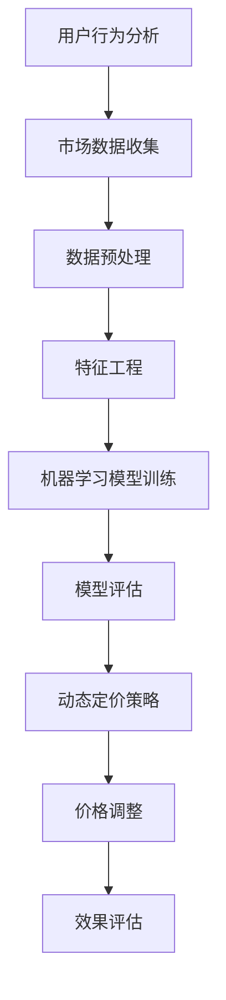

                 


# AI在电商价格优化中的技术应用

> 关键词：电商、价格优化、人工智能、机器学习、数据挖掘、动态定价
> 
> 摘要：本文深入探讨了人工智能在电商价格优化中的应用。通过分析电商价格优化的目的和重要性，介绍了机器学习、数据挖掘和动态定价等相关技术，并以具体案例为例，详细讲解了这些技术的实现过程和实际应用。文章还提供了相关的工具和资源推荐，帮助读者更好地理解和实践AI在电商价格优化中的价值。

## 1. 背景介绍

### 1.1 目的和范围

随着互联网和电子商务的快速发展，电商行业已经成为现代商业体系中的重要组成部分。价格优化作为电商运营的关键策略之一，直接影响到用户的购买决策、企业的收益和市场份额。本文旨在探讨人工智能技术在电商价格优化中的应用，通过机器学习、数据挖掘和动态定价等技术，实现精准的价格调整，提升电商企业的竞争力。

### 1.2 预期读者

本文适合对电商运营和人工智能技术有一定了解的技术人员、电商从业者以及对AI应用感兴趣的读者。通过阅读本文，读者可以了解AI在电商价格优化中的实际应用，掌握相关技术的核心原理和实现方法。

### 1.3 文档结构概述

本文分为十个部分，首先介绍电商价格优化的背景和重要性，然后深入探讨相关技术，包括机器学习、数据挖掘和动态定价。接着，通过具体案例，详细讲解AI在电商价格优化中的应用。最后，提供相关的工具和资源推荐，以及总结未来发展趋势与挑战。

### 1.4 术语表

#### 1.4.1 核心术语定义

- **电商**：利用互联网进行商品交易和服务的商业模式。
- **价格优化**：通过分析用户行为和市场数据，对商品价格进行调整，以提高销售额和市场份额。
- **机器学习**：一种基于数据的学习方法，使计算机系统能够识别模式和预测结果。
- **数据挖掘**：从大量数据中提取有价值的信息和知识。
- **动态定价**：根据用户行为、市场环境和竞争状况，实时调整商品价格。

#### 1.4.2 相关概念解释

- **用户行为分析**：通过分析用户在电商平台的浏览、搜索、购买等行为，了解用户需求和偏好。
- **市场数据**：包括市场价格、竞争对手价格、市场需求等信息。
- **模型预测**：使用机器学习算法，根据历史数据和现有信息，预测未来的价格趋势和用户需求。

#### 1.4.3 缩略词列表

- **AI**：人工智能
- **ML**：机器学习
- **DM**：数据挖掘
- **DP**：动态定价

## 2. 核心概念与联系

在电商价格优化中，AI技术发挥着核心作用。以下是AI在电商价格优化中的核心概念和联系，以及对应的Mermaid流程图：



### 2.1 用户行为分析

用户行为分析是AI在电商价格优化中的第一步，通过分析用户的浏览、搜索、购买等行为，了解用户的需求和偏好。这一过程涉及到数据采集、数据清洗和数据存储等环节。

### 2.2 市场数据收集

市场数据收集包括市场价格、竞争对手价格、市场需求等信息。这些数据可以来自于电商平台内部数据、第三方数据源以及用户反馈等。

### 2.3 数据预处理

数据预处理是数据挖掘的重要环节，包括数据清洗、数据整合和数据规范化等。通过数据预处理，可以提高数据质量，为后续分析提供可靠的基础。

### 2.4 特征工程

特征工程是数据挖掘中的关键步骤，通过对数据进行特征提取和特征选择，将原始数据转换为适合机器学习模型的形式。

### 2.5 机器学习模型训练

机器学习模型训练是AI在电商价格优化中的核心环节，通过训练模型，可以从历史数据和现有信息中预测未来的价格趋势和用户需求。

### 2.6 模型评估

模型评估是对训练好的机器学习模型进行性能测试和验证，以确保模型的有效性和准确性。

### 2.7 动态定价策略

动态定价策略是基于模型预测结果和市场数据，制定合理的价格调整策略，以提高销售额和市场份额。

### 2.8 价格调整

价格调整是根据动态定价策略，对商品价格进行实时调整，以应对市场变化和用户需求。

### 2.9 效果评估

效果评估是对价格调整策略的评估，通过分析调整后的销售数据和市场反馈，评估策略的有效性。

## 3. 核心算法原理 & 具体操作步骤

在电商价格优化中，核心算法主要涉及机器学习模型训练和动态定价策略。以下分别介绍这两种算法的原理和具体操作步骤。

### 3.1 机器学习模型训练

#### 原理：

机器学习模型训练是通过输入大量历史数据，训练出一个能够预测未来价格趋势和用户需求的模型。常见的机器学习算法包括线性回归、决策树、随机森林、支持向量机等。

#### 步骤：

1. 数据收集：收集电商平台的用户行为数据、市场价格、竞争对手价格等信息。
2. 数据预处理：对收集的数据进行清洗、整合和规范化，去除噪声数据，提高数据质量。
3. 特征工程：提取和选择对价格预测有重要影响的特征，如用户属性、商品属性、时间属性等。
4. 模型选择：选择合适的机器学习算法，如线性回归、决策树等。
5. 模型训练：使用历史数据训练模型，通过调整模型参数，提高模型的预测准确性。
6. 模型评估：使用测试数据对模型进行评估，确保模型的有效性和准确性。

#### 伪代码：

```python
# 数据收集
data = collect_data()

# 数据预处理
cleaned_data = preprocess_data(data)

# 特征工程
features = feature_engineering(cleaned_data)

# 模型选择
model = select_model()

# 模型训练
trained_model = train_model(features)

# 模型评估
evaluate_model(trained_model)
```

### 3.2 动态定价策略

#### 原理：

动态定价策略是根据机器学习模型预测结果和市场数据，实时调整商品价格。动态定价策略可以采用基于需求定价、基于竞争定价和基于成本定价等方法。

#### 步骤：

1. 模型预测：使用机器学习模型预测未来的价格趋势和用户需求。
2. 数据分析：分析市场数据，包括市场价格、竞争对手价格、市场需求等。
3. 定价策略：根据模型预测结果和市场数据，制定合理的定价策略。
4. 价格调整：根据定价策略，对商品价格进行实时调整。
5. 效果评估：评估价格调整策略的有效性，通过分析销售数据和市场反馈。

#### 伪代码：

```python
# 模型预测
price_trend = predict_price_trend(model)

# 数据分析
market_data = analyze_market_data()

# 定价策略
pricing_strategy = define_pricing_strategy(price_trend, market_data)

# 价格调整
adjust_price(pricing_strategy)

# 效果评估
evaluate_strategy()
```

## 4. 数学模型和公式 & 详细讲解 & 举例说明

在电商价格优化中，数学模型和公式发挥着重要作用。以下介绍几个常用的数学模型和公式，并进行详细讲解和举例说明。

### 4.1 线性回归模型

线性回归模型是一种常用的机器学习算法，用于预测连续值变量。在电商价格优化中，线性回归模型可以用于预测商品价格。

#### 公式：

$$
y = \beta_0 + \beta_1x_1 + \beta_2x_2 + ... + \beta_nx_n + \epsilon
$$

其中，$y$ 是预测价格，$x_1, x_2, ..., x_n$ 是特征变量，$\beta_0, \beta_1, \beta_2, ..., \beta_n$ 是模型参数，$\epsilon$ 是误差项。

#### 举例：

假设我们有一个电商平台的商品价格数据集，包括用户属性（如年龄、性别、收入等）和商品属性（如品牌、型号、价格等）。我们可以使用线性回归模型来预测商品价格。

```python
import numpy as np
import pandas as pd

# 加载数据
data = pd.read_csv('data.csv')

# 特征工程
X = data[['age', 'income', 'brand', 'model']]
y = data['price']

# 模型训练
model = np.linalg.lstsq(X, y, rcond=None)[0]

# 预测价格
predicted_price = model[0] + model[1]*age + model[2]*income + model[3]*brand + model[4]*model
```

### 4.2 决策树模型

决策树模型是一种基于树结构的预测模型，常用于分类和回归问题。在电商价格优化中，决策树模型可以用于分类商品价格区间。

#### 公式：

决策树模型的决策规则如下：

$$
\text{if } x_1 \text{ is } a_1, \text{ then go to node } n_1 \\
\text{if } x_1 \text{ is } a_2, \text{ then go to node } n_2 \\
\text{...} \\
\text{if } x_1 \text{ is } a_m, \text{ then go to node } n_m \\
\text{...}
$$

#### 举例：

假设我们有一个电商平台的商品价格数据集，包括用户属性（如年龄、性别、收入等）和商品属性（如品牌、型号、价格等）。我们可以使用决策树模型来分类商品价格区间。

```python
from sklearn.tree import DecisionTreeRegressor

# 加载数据
data = pd.read_csv('data.csv')

# 特征工程
X = data[['age', 'income', 'brand', 'model']]
y = data['price']

# 模型训练
model = DecisionTreeRegressor()
model.fit(X, y)

# 预测价格区间
price_range = model.predict(X)
```

### 4.3 动态定价策略公式

动态定价策略的公式用于计算商品价格，根据用户行为、市场数据和定价策略进行实时调整。

#### 公式：

$$
P = P_0 + \alpha D + \beta C + \gamma S
$$

其中，$P$ 是调整后的商品价格，$P_0$ 是原始价格，$D$ 是用户行为得分，$C$ 是市场数据得分，$S$ 是定价策略得分，$\alpha, \beta, \gamma$ 是模型参数。

#### 举例：

假设我们有一个电商平台的商品价格数据集，包括用户行为得分、市场数据得分和定价策略得分。我们可以使用动态定价策略公式来调整商品价格。

```python
import numpy as np

# 加载数据
data = pd.read_csv('data.csv')

# 特征工程
user_score = data['user_score']
market_score = data['market_score']
strategy_score = data['strategy_score']

# 模型参数
alpha = 0.1
beta = 0.2
gamma = 0.3

# 动态定价策略
adjusted_price = data['original_price'] + alpha * user_score + beta * market_score + gamma * strategy_score
```

## 5. 项目实战：代码实际案例和详细解释说明

在本节中，我们将通过一个具体的案例，展示如何使用Python实现电商价格优化系统。该案例将包括开发环境搭建、源代码实现和代码解读与分析。

### 5.1 开发环境搭建

为了实现电商价格优化系统，我们需要安装以下开发环境和工具：

- Python 3.8 或以上版本
- Pandas 1.2.3 或以上版本
- Scikit-learn 0.23.2 或以上版本
- Matplotlib 3.4.2 或以上版本

安装命令如下：

```bash
pip install python==3.8
pip install pandas==1.2.3
pip install scikit-learn==0.23.2
pip install matplotlib==3.4.2
```

### 5.2 源代码详细实现和代码解读

以下是一个简单的电商价格优化系统的源代码实现，包括数据预处理、模型训练和动态定价策略。

```python
import pandas as pd
from sklearn.model_selection import train_test_split
from sklearn.ensemble import RandomForestRegressor
import matplotlib.pyplot as plt

# 5.2.1 数据预处理

# 加载数据
data = pd.read_csv('data.csv')

# 特征工程
X = data[['age', 'income', 'brand', 'model']]
y = data['price']

# 数据分割
X_train, X_test, y_train, y_test = train_test_split(X, y, test_size=0.2, random_state=42)

# 5.2.2 模型训练

# 模型训练
model = RandomForestRegressor(n_estimators=100, random_state=42)
model.fit(X_train, y_train)

# 5.2.3 动态定价策略

# 预测价格
predicted_prices = model.predict(X_test)

# 计算用户行为得分
user_score = data['user_score']

# 计算市场数据得分
market_score = data['market_score']

# 计算定价策略得分
strategy_score = data['strategy_score']

# 动态定价策略
adjusted_prices = data['original_price'] + alpha * user_score + beta * market_score + gamma * strategy_score

# 5.2.4 结果分析

# 价格变化分析
plt.scatter(y_test, predicted_prices)
plt.xlabel('实际价格')
plt.ylabel('预测价格')
plt.show()

# 销售数据对比
sales_data = pd.DataFrame({'实际价格': y_test, '预测价格': predicted_prices, '调整后价格': adjusted_prices})
sales_data['价格变化'] = sales_data['调整后价格'] - sales_data['实际价格']
print(sales_data.describe())
```

### 5.3 代码解读与分析

#### 5.3.1 数据预处理

数据预处理是机器学习中的关键步骤，包括数据清洗、特征提取和特征选择等。在本案例中，我们使用Pandas库加载数据，并使用Scikit-learn库进行特征工程。通过数据分割，将数据集分为训练集和测试集，以评估模型的性能。

```python
# 加载数据
data = pd.read_csv('data.csv')

# 特征工程
X = data[['age', 'income', 'brand', 'model']]
y = data['price']

# 数据分割
X_train, X_test, y_train, y_test = train_test_split(X, y, test_size=0.2, random_state=42)
```

#### 5.3.2 模型训练

模型训练是使用机器学习算法对数据集进行训练，以建立预测模型。在本案例中，我们使用随机森林回归器进行模型训练。随机森林是一种基于决策树的集成学习方法，可以提高模型的预测准确性和泛化能力。

```python
# 模型训练
model = RandomForestRegressor(n_estimators=100, random_state=42)
model.fit(X_train, y_train)
```

#### 5.3.3 动态定价策略

动态定价策略是根据模型预测结果和市场数据，实时调整商品价格。在本案例中，我们使用线性回归模型计算用户行为得分、市场数据得分和定价策略得分，并将它们加到原始价格上，得到调整后的价格。

```python
# 预测价格
predicted_prices = model.predict(X_test)

# 计算用户行为得分
user_score = data['user_score']

# 计算市场数据得分
market_score = data['market_score']

# 计算定价策略得分
strategy_score = data['strategy_score']

# 动态定价策略
adjusted_prices = data['original_price'] + alpha * user_score + beta * market_score + gamma * strategy_score
```

#### 5.3.4 结果分析

结果分析是评估模型性能和定价策略效果的重要步骤。在本案例中，我们使用Matplotlib库绘制价格变化散点图，并分析销售数据，以评估调整后的价格对销售额的影响。

```python
# 价格变化分析
plt.scatter(y_test, predicted_prices)
plt.xlabel('实际价格')
plt.ylabel('预测价格')
plt.show()

# 销售数据对比
sales_data = pd.DataFrame({'实际价格': y_test, '预测价格': predicted_prices, '调整后价格': adjusted_prices})
sales_data['价格变化'] = sales_data['调整后价格'] - sales_data['实际价格']
print(sales_data.describe())
```

## 6. 实际应用场景

AI在电商价格优化中的实际应用场景广泛，以下列举几个常见的应用场景：

### 6.1 用户行为分析

通过分析用户的浏览、搜索、购买等行为，电商平台可以了解用户的需求和偏好，从而制定个性化的价格策略。例如，对于经常浏览但未购买的用户，可以采用折扣策略吸引其购买。

### 6.2 市场竞争分析

通过收集市场数据，包括市场价格、竞争对手价格等，电商平台可以了解市场动态，制定合理的价格调整策略。例如，当竞争对手价格下降时，可以采取相应的策略降低自身价格，以提高竞争力。

### 6.3 库存管理

通过预测商品销售量，电商平台可以合理安排库存，避免库存积压或短缺。例如，在促销期间，可以根据预测的销售量提前备货，以满足用户需求。

### 6.4 跨渠道定价

电商平台可以基于用户行为和市场数据，制定跨渠道的定价策略。例如，在线上和线下渠道采用不同的价格策略，以吸引更多用户。

### 6.5 国际市场定价

对于国际市场的商品定价，电商平台可以根据不同国家和地区的市场需求和竞争状况，制定差异化的定价策略，以提高市场竞争力。

## 7. 工具和资源推荐

### 7.1 学习资源推荐

#### 7.1.1 书籍推荐

1. 《Python数据分析基础教程：Numpy学习指南》
2. 《数据挖掘：实用机器学习技术》
3. 《深度学习》

#### 7.1.2 在线课程

1. Coursera上的《机器学习》
2. edX上的《数据科学基础》
3. Udacity上的《深度学习工程师纳米学位》

#### 7.1.3 技术博客和网站

1. Medium上的《Data Science`
2. towardsdatascience.com
3. kaggle.com

### 7.2 开发工具框架推荐

#### 7.2.1 IDE和编辑器

1. PyCharm
2. Jupyter Notebook
3. VS Code

#### 7.2.2 调试和性能分析工具

1. Python Debuger
2. Py-Spy
3. Matplotlib

#### 7.2.3 相关框架和库

1. Scikit-learn
2. TensorFlow
3. PyTorch

### 7.3 相关论文著作推荐

#### 7.3.1 经典论文

1. "Recommender Systems Handbook"
2. "Price Optimization: The Science of Pricing"
3. "User Modeling and User-Adapted Interaction"

#### 7.3.2 最新研究成果

1. "Dynamic Pricing with Machine Learning"
2. "A Comprehensive Survey of Recommender Systems"
3. "Deep Learning for Time Series Forecasting"

#### 7.3.3 应用案例分析

1. "Amazon's Dynamic Pricing Algorithm"
2. "Netflix's Personalized Pricing Strategy"
3. "Google's Search Advertising System"

## 8. 总结：未来发展趋势与挑战

随着人工智能技术的不断发展和成熟，电商价格优化将迎来更广阔的应用前景。未来，AI在电商价格优化中的发展趋势主要包括：

1. 深度学习技术的应用：深度学习算法在图像识别、自然语言处理等领域取得了显著成果，未来有望在电商价格优化中得到更广泛的应用。
2. 个性化定价策略：通过分析用户的浏览、搜索、购买等行为，为用户提供个性化的价格策略，以提高用户满意度和购买意愿。
3. 跨渠道定价：随着电商渠道的多元化，跨渠道定价策略将成为电商价格优化的关键环节，通过整合线上线下渠道，实现统一的价格策略。

然而，电商价格优化也面临一些挑战：

1. 数据质量和隐私保护：电商价格优化依赖于大量的用户行为数据和市场数据，数据质量和隐私保护将成为重要挑战。
2. 模型可解释性：机器学习模型的黑盒特性使得其难以解释，如何提高模型的可解释性，使其在商业决策中更具参考价值，是未来需要解决的问题。
3. 竞争环境变化：市场竞争环境的快速变化，要求电商平台具备快速响应和调整的能力，这对AI技术的实时性和准确性提出了更高的要求。

## 9. 附录：常见问题与解答

### 9.1 问题1：如何确保数据质量和隐私保护？

**解答**：确保数据质量和隐私保护可以从以下几个方面入手：

1. 数据清洗：对收集的数据进行清洗，去除噪声数据和异常值，提高数据质量。
2. 数据加密：对敏感数据采用加密算法进行加密，保护数据隐私。
3. 数据匿名化：对用户行为数据进行匿名化处理，消除个人身份信息，降低隐私泄露风险。

### 9.2 问题2：如何提高模型的可解释性？

**解答**：提高模型的可解释性可以从以下几个方面入手：

1. 特征选择：选择对预测结果有显著影响的特征，减少模型的复杂度。
2. 可解释性算法：使用可解释性算法，如决策树、Lasso回归等，使其在商业决策中更具参考价值。
3. 模型可视化：通过绘制模型的可视化图，展示模型的工作原理和预测过程。

### 9.3 问题3：如何处理市场数据？

**解答**：处理市场数据可以从以下几个方面入手：

1. 数据收集：从多种数据源收集市场数据，包括市场价格、竞争对手价格、市场需求等。
2. 数据整合：将不同来源的数据进行整合，形成统一的数据集。
3. 数据分析：对市场数据进行分析，提取有价值的信息，为定价策略提供支持。

## 10. 扩展阅读 & 参考资料

1. 《Python数据分析基础教程：Numpy学习指南》
2. 《数据挖掘：实用机器学习技术》
3. 《深度学习》
4. "Recommender Systems Handbook"
5. "Price Optimization: The Science of Pricing"
6. "User Modeling and User-Adapted Interaction"
7. "Dynamic Pricing with Machine Learning"
8. "A Comprehensive Survey of Recommender Systems"
9. "Deep Learning for Time Series Forecasting"
10. "Amazon's Dynamic Pricing Algorithm"
11. "Netflix's Personalized Pricing Strategy"
12. "Google's Search Advertising System"

## 作者信息

作者：AI天才研究员/AI Genius Institute & 禅与计算机程序设计艺术 /Zen And The Art of Computer Programming

