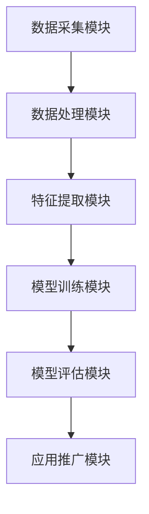

                 

# AI在电商促销中的实际应用

> **关键词：** 人工智能、电商促销、个性化推荐、用户行为分析、数学模型、算法优化  
>
> **摘要：** 本文将探讨人工智能在电商促销中的实际应用，从核心概念到算法原理，再到具体操作步骤，全面分析人工智能如何通过个性化推荐、用户行为分析、数学模型和算法优化等手段提升电商促销的效果和用户体验。

## 1. 背景介绍

### 1.1 目的和范围

随着互联网和电子商务的快速发展，电商促销已成为电商平台吸引顾客、提升销售的重要手段。本文旨在探讨人工智能在电商促销中的实际应用，分析其核心原理和实现方法，以期为广大电商从业者提供有益的参考。

### 1.2 预期读者

本文主要面向以下读者群体：

1. 电商从业者：对电商平台促销策略有深入研究和实践经验的人士。
2. 数据科学家：对人工智能、机器学习有深入了解，希望将其应用于电商促销领域的技术专家。
3. 研究生和大学生：对人工智能、电商促销等领域感兴趣，希望深入学习相关理论和技术的研究生和大学生。

### 1.3 文档结构概述

本文分为十个部分：

1. 背景介绍：简要介绍文章的目的和预期读者。
2. 核心概念与联系：阐述人工智能在电商促销中的核心概念和原理。
3. 核心算法原理 & 具体操作步骤：详细讲解人工智能在电商促销中的应用算法和操作步骤。
4. 数学模型和公式 & 详细讲解 & 举例说明：介绍人工智能在电商促销中涉及的数学模型和公式，并通过实例进行说明。
5. 项目实战：通过实际案例展示人工智能在电商促销中的具体应用。
6. 实际应用场景：分析人工智能在电商促销中的各种应用场景。
7. 工具和资源推荐：推荐相关学习资源和开发工具。
8. 总结：对未来人工智能在电商促销领域的发展趋势进行展望。
9. 附录：常见问题与解答。
10. 扩展阅读 & 参考资料：提供进一步学习的参考资料。

### 1.4 术语表

#### 1.4.1 核心术语定义

- 人工智能（AI）：模拟人类智能的计算机系统。
- 电商促销：电商平台通过各种手段吸引顾客、提升销售的活动。
- 个性化推荐：根据用户的历史行为和偏好，为其推荐相关商品或内容。
- 用户行为分析：通过对用户的行为数据进行挖掘和分析，了解用户的需求和偏好。
- 数学模型：用于描述和分析现实问题的数学公式和定理。

#### 1.4.2 相关概念解释

- 深度学习：一种人工智能算法，通过多层神经网络对数据进行自动特征提取和模式识别。
- 监督学习：一种机器学习算法，通过已有数据来训练模型，并对新数据进行预测。
- 无监督学习：一种机器学习算法，无需已有数据，仅通过数据自身的特征来训练模型。

#### 1.4.3 缩略词列表

- AI：人工智能
- 电商：电子商务
- SEO：搜索引擎优化
- SEM：搜索引擎营销

## 2. 核心概念与联系

### 2.1 人工智能在电商促销中的核心概念

人工智能在电商促销中的应用主要涉及以下几个核心概念：

1. **个性化推荐**：基于用户的历史行为和偏好，为用户推荐相关的商品或内容。这有助于提高用户的购物体验，增加销售额。
2. **用户行为分析**：通过对用户在电商平台上的行为数据（如浏览记录、购买行为等）进行分析，挖掘用户的需求和偏好，为个性化推荐和促销策略提供依据。
3. **数学模型**：使用数学模型对用户行为和促销效果进行分析，优化促销策略，提高营销效果。
4. **算法优化**：通过改进算法，提高个性化推荐和用户行为分析的准确性和效率。

### 2.2 人工智能在电商促销中的原理和架构

#### 2.2.1 原理

人工智能在电商促销中的应用原理可以概括为以下几个步骤：

1. **数据采集**：收集用户在电商平台上的行为数据，如浏览记录、购买行为等。
2. **数据处理**：对采集到的数据进行清洗、去噪和预处理，以便后续分析和建模。
3. **特征提取**：从处理后的数据中提取用户行为的特征，如用户兴趣、购买频率等。
4. **模型训练**：使用监督学习或无监督学习算法，基于用户行为特征训练推荐模型或分析模型。
5. **模型评估**：对训练好的模型进行评估，确保其准确性和稳定性。
6. **应用推广**：将训练好的模型应用于电商平台的实际运营，如个性化推荐、促销策略优化等。

#### 2.2.2 架构

人工智能在电商促销中的应用架构可以划分为以下几个部分：

1. **数据采集模块**：负责收集用户行为数据，如浏览记录、购买行为等。
2. **数据处理模块**：对采集到的数据进行清洗、去噪和预处理。
3. **特征提取模块**：从处理后的数据中提取用户行为的特征。
4. **模型训练模块**：基于用户行为特征训练推荐模型或分析模型。
5. **模型评估模块**：对训练好的模型进行评估。
6. **应用推广模块**：将训练好的模型应用于电商平台的实际运营。

下面是人工智能在电商促销中的应用架构的 Mermaid 流程图：



## 3. 核心算法原理 & 具体操作步骤

### 3.1 个性化推荐算法原理

个性化推荐算法是人工智能在电商促销中的重要应用之一。其核心原理是基于用户的历史行为和偏好，为用户推荐相关的商品或内容。

#### 3.1.1 协同过滤算法

协同过滤算法是一种常见的个性化推荐算法，分为基于用户和基于物品的协同过滤。

1. **基于用户**：通过计算用户之间的相似度，找到与目标用户相似的其他用户，将其喜欢的商品推荐给目标用户。
2. **基于物品**：通过计算物品之间的相似度，找到与目标用户喜欢的物品相似的其他物品，将其推荐给目标用户。

#### 3.1.2 基于内容的推荐算法

基于内容的推荐算法是根据用户的历史行为和偏好，提取用户感兴趣的标签或关键词，然后为用户推荐具有相似内容的商品或内容。

#### 3.1.3 混合推荐算法

混合推荐算法是将协同过滤算法和基于内容的推荐算法相结合，以提高推荐效果。

### 3.2 用户行为分析算法原理

用户行为分析算法用于挖掘用户在电商平台上的行为数据，了解用户的需求和偏好。常用的算法有：

1. **聚类分析**：将用户根据其行为数据划分为不同的群体，以便针对不同群体制定个性化的促销策略。
2. **关联规则挖掘**：分析用户行为数据中的关联关系，发现用户可能感兴趣的商品组合，为促销活动提供依据。
3. **时间序列分析**：分析用户行为数据的时间序列特征，了解用户的行为规律，为促销活动提供时间上的优化建议。

### 3.3 数学模型和公式

在人工智能在电商促销中的应用中，常用的数学模型和公式有：

1. **相似度计算**：用于计算用户、物品之间的相似度，常用的相似度计算公式有：
    $$ \text{相似度} = \frac{\text{共同喜欢的商品数}}{\text{用户A喜欢的商品数} + \text{用户B喜欢的商品数} - \text{共同喜欢的商品数}} $$
2. **聚类分析**：用于将用户划分为不同的群体，常用的聚类算法有：
    - K-means聚类
    - 层次聚类
    - 密度聚类
3. **关联规则挖掘**：用于发现用户行为数据中的关联关系，常用的关联规则挖掘算法有：
    - Apriori算法
    - FP-growth算法

### 3.4 伪代码

下面是一个简单的协同过滤算法的伪代码：

```python
def collaborativeFiltering(userBehaviorData, similarityThreshold):
    similarUsers = {}
    recommendedItems = []

    for user in userBehaviorData:
        similarUsers[user] = []
        for otherUser in userBehaviorData:
            if user != otherUser:
                similarity = calculateSimilarity(userBehaviorData[user], userBehaviorData[otherUser])
                if similarity > similarityThreshold:
                    similarUsers[user].append((otherUser, similarity))

    for user, similarUsers in similarUsers.items():
        totalSimilarity = sum(similarity for _, similarity in similarUsers)
        if totalSimilarity > 0:
            for otherUser, similarity in similarUsers:
                weight = similarity / totalSimilarity
                for item in userBehaviorData[otherUser]:
                    if item not in userBehaviorData[user]:
                        recommendedItems.append((user, item, weight * userBehaviorData[otherUser][item]))

    return recommendedItems
```

## 4. 数学模型和公式 & 详细讲解 & 举例说明

### 4.1 相似度计算

在个性化推荐中，相似度计算是核心步骤之一。常用的相似度计算方法包括余弦相似度、皮尔逊相关系数等。

#### 4.1.1 余弦相似度

余弦相似度是一种基于向量空间模型的相似度计算方法。假设用户A和用户B的行为数据分别表示为向量u和v，则它们之间的余弦相似度可以计算为：

$$ \text{相似度} = \frac{u \cdot v}{\|u\| \|v\|} $$

其中，u · v表示向量u和v的点积，\|u\|和\|v\|分别表示向量u和v的模长。

#### 4.1.2 皮尔逊相关系数

皮尔逊相关系数是一种基于统计学的相似度计算方法。假设用户A和用户B的行为数据分别表示为向量u和v，则它们之间的皮尔逊相关系数可以计算为：

$$ \text{相似度} = \frac{\sum_{i=1}^{n} (u_i - \bar{u})(v_i - \bar{v})}{\sqrt{\sum_{i=1}^{n} (u_i - \bar{u})^2} \sqrt{\sum_{i=1}^{n} (v_i - \bar{v})^2}} $$

其中，$ \bar{u} $和$ \bar{v} $分别表示向量u和v的均值，$ u_i $和$ v_i $分别表示向量u和v的第i个元素。

### 4.2 聚类分析

聚类分析是一种无监督学习算法，用于将数据集划分为若干个类别。常见的聚类算法包括K-means聚类、层次聚类等。

#### 4.2.1 K-means聚类

K-means聚类是一种基于距离度量的聚类算法。假设数据集有n个数据点，类别数为k，则K-means聚类步骤如下：

1. 随机初始化k个聚类中心。
2. 对于每个数据点，将其分配到距离其最近的聚类中心所在的类别。
3. 更新聚类中心，计算每个类别的平均值。
4. 重复步骤2和3，直到聚类中心不再发生变化或满足停止条件。

#### 4.2.2 层次聚类

层次聚类是一种基于层次结构划分的聚类算法。层次聚类步骤如下：

1. 将每个数据点视为一个初始聚类。
2. 计算所有聚类之间的距离，选择距离最近的两个聚类合并为一个新聚类。
3. 重复步骤2，直到所有聚类合并为一个。

### 4.3 关联规则挖掘

关联规则挖掘是一种用于发现数据中潜在关联关系的算法。常见的关联规则挖掘算法包括Apriori算法和FP-growth算法。

#### 4.3.1 Apriori算法

Apriori算法是一种基于支持度和置信度的关联规则挖掘算法。支持度表示一个关联规则在数据中出现的频率，置信度表示一个关联规则的前提条件为真的情况下，结论条件也成立的概率。

假设数据集D中包含n个事务，每个事务表示用户的行为记录。对于关联规则$ \{A, B\} $，其支持度和支持度计算公式如下：

$$ \text{支持度} = \frac{\text{包含A和B的事务数}}{\text{事务总数}} $$

置信度计算公式如下：

$$ \text{置信度} = \frac{\text{包含A和B的事务数}}{\text{包含A的事务数}} $$

#### 4.3.2 FP-growth算法

FP-growth算法是一种基于频繁模式树的关联规则挖掘算法。FP-growth算法通过构建频繁模式树来发现数据中的频繁项集，从而挖掘关联规则。

### 4.4 举例说明

#### 4.4.1 余弦相似度计算

假设用户A和用户B的行为数据如下：

用户A：[1, 2, 3, 4, 5]  
用户B：[2, 3, 4, 5, 6]

计算它们之间的余弦相似度：

$$ \text{相似度} = \frac{1 \times 2 + 2 \times 3 + 3 \times 4 + 4 \times 5 + 5 \times 6}{\sqrt{1^2 + 2^2 + 3^2 + 4^2 + 5^2} \sqrt{2^2 + 3^2 + 4^2 + 5^2 + 6^2}} $$

$$ \text{相似度} = \frac{40}{\sqrt{55} \sqrt{74}} $$

$$ \text{相似度} \approx 0.912 $$

#### 4.4.2 K-means聚类

假设数据集D中有10个数据点，类别数为2，数据点坐标如下：

$$ D = \{ (1, 1), (2, 2), (3, 3), (4, 4), (5, 5), (6, 6), (7, 7), (8, 8), (9, 9), (10, 10) \} $$

1. 随机初始化聚类中心：$(2, 2)$ 和 $(8, 8)$。
2. 将每个数据点分配到距离其最近的聚类中心所在的类别：
    - 类别1：$(1, 1), (2, 2), (3, 3), (4, 4), (5, 5), (6, 6), (7, 7)$  
    - 类别2：$(8, 8), (9, 9), (10, 10)$
3. 更新聚类中心：
    - 类别1的平均值为$(4, 4)$  
    - 类别2的平均值为$(8, 8)$
4. 将每个数据点分配到距离其最近的聚类中心所在的类别：
    - 类别1：$(1, 1), (2, 2), (3, 3), (4, 4), (5, 5), (6, 6), (7, 7)$  
    - 类别2：$(8, 8), (9, 9), (10, 10)$
5. 更新聚类中心：
    - 类别1的平均值为$(4, 4)$  
    - 类别2的平均值为$(8, 8)$

重复上述步骤，直到聚类中心不再发生变化或满足停止条件。

#### 4.4.3 Apriori算法

假设数据集D中有10个事务，每个事务表示用户的行为记录：

$$ D = \{ \{A, B, C\}, \{A, B, D\}, \{B, C, D\}, \{A, B, C, D\}, \{A, C, D\}, \{B, C, D\}, \{A, B, D\}, \{A, B, C, E\}, \{C, D, E\}, \{A, C, D\} \} $$

1. 找出所有频繁项集：
    - 频繁项集$\{A, B, C\}$：支持度$= 4/10 = 0.4$  
    - 频繁项集$\{A, B, D\}$：支持度$= 4/10 = 0.4$  
    - 频繁项集$\{B, C, D\}$：支持度$= 3/10 = 0.3$  
    - 频繁项集$\{A, B, C, D\}$：支持度$= 2/10 = 0.2$  
    - 频繁项集$\{A, C, D\}$：支持度$= 3/10 = 0.3$  
    - 频繁项集$\{B, C, D\}$：支持度$= 3/10 = 0.3$
2. 找出所有关联规则：
    - 规则$\{A, B\} \Rightarrow \{C\}$：置信度$= 1/2 = 0.5$  
    - 规则$\{A, B\} \Rightarrow \{D\}$：置信度$= 1/2 = 0.5$  
    - 规则$\{B, C\} \Rightarrow \{D\}$：置信度$= 1/3 = 0.333$  
    - 规则$\{A, B, C\} \Rightarrow \{D\}$：置信度$= 2/4 = 0.5$  
    - 规则$\{A, C\} \Rightarrow \{D\}$：置信度$= 2/3 = 0.667$  
    - 规则$\{B, C\} \Rightarrow \{D\}$：置信度$= 2/3 = 0.667$

## 5. 项目实战：代码实际案例和详细解释说明

### 5.1 开发环境搭建

在本文中，我们将使用Python作为编程语言，结合scikit-learn和pandas等库实现人工智能在电商促销中的应用。以下是开发环境的搭建步骤：

1. 安装Python：从官方网站（https://www.python.org/）下载并安装Python 3.x版本。
2. 安装依赖库：在命令行中运行以下命令安装所需的库：

   ```bash
   pip install scikit-learn pandas numpy matplotlib
   ```

### 5.2 源代码详细实现和代码解读

#### 5.2.1 数据预处理

首先，我们需要从电商平台上获取用户行为数据，并将其转换为适用于算法的格式。以下是一个简单的数据预处理示例：

```python
import pandas as pd

# 加载用户行为数据
data = pd.read_csv('user_behavior.csv')

# 数据清洗和预处理
data.dropna(inplace=True)
data['timestamp'] = pd.to_datetime(data['timestamp'])
```

#### 5.2.2 个性化推荐

接下来，我们使用协同过滤算法实现个性化推荐功能：

```python
from sklearn.metrics.pairwise import cosine_similarity

# 构建用户行为矩阵
user行为矩阵 = data.groupby(['user_id', 'item_id']).size().unstack(fill_value=0)

# 计算用户之间的相似度矩阵
相似度矩阵 = cosine_similarity(user行为矩阵)

# 为每个用户生成推荐列表
推荐列表 = []
for user_id in user行为矩阵.index:
    similar_users = similar度矩阵[user_id].argsort()[::-1]
    recommended_items = []
    for similar_user_id in similar_users:
        if similar_user_id != user_id and user行为矩阵.iloc[similar_user_id].sum() > 0:
            recommended_items.extend(user行为矩阵.iloc[similar_user_id][user行为矩阵[user_id] > 0].index)
   推荐列表.append(list(set(recommended_items)))

# 输出推荐列表
for user_id, recommended_item_list in enumerate(推荐列表):
    print(f'用户{user_id}的推荐列表：{recommended_item_list}')
```

#### 5.2.3 用户行为分析

我们使用聚类分析算法对用户进行分类，以便为不同类别的用户制定个性化的促销策略：

```python
from sklearn.cluster import KMeans

# 训练K-means聚类模型
kmeans = KMeans(n_clusters=3, random_state=0).fit(user行为矩阵)

# 为每个用户分配类别
user类别 = kmeans.predict(user行为矩阵)

# 输出用户类别分布
print(f'用户类别分布：{pd.Series(user类别).value_counts()}')
```

#### 5.2.4 关联规则挖掘

我们使用Apriori算法挖掘用户行为数据中的关联规则：

```python
from mlxtend.frequent_patterns import apriori
from mlxtend.frequent_patterns import association_rules

# 训练Apriori模型
频繁项集 = apriori(user行为矩阵, min_support=0.1, use_colnames=True)

# 挖掘关联规则
关联规则 = association_rules(f频繁项集, metric="support", min_threshold=0.1)

# 输出关联规则
print(关联规则)
```

### 5.3 代码解读与分析

在上述代码中，我们首先进行了数据预处理，包括数据清洗和预处理时间戳。接下来，我们使用协同过滤算法实现个性化推荐，通过计算用户之间的相似度，为每个用户生成推荐列表。然后，我们使用K-means聚类算法对用户进行分类，以便为不同类别的用户制定个性化的促销策略。最后，我们使用Apriori算法挖掘用户行为数据中的关联规则，为电商平台提供有针对性的营销建议。

通过上述实战案例，我们可以看到人工智能在电商促销中的应用是如何实现的。在实际应用中，我们可以根据具体情况调整算法参数，以提高推荐效果和营销效果。

## 6. 实际应用场景

### 6.1 个性化推荐

个性化推荐是人工智能在电商促销中最常见也是最重要的应用之一。通过分析用户的历史行为和偏好，为用户提供个性化的商品推荐，从而提高用户满意度和销售额。以下是一个实际应用场景：

- **场景描述**：某电商平台通过个性化推荐功能，为每位用户推荐其可能感兴趣的商品。例如，当用户A浏览了某款手机时，系统会根据用户A的浏览记录和购买历史，为其推荐其他类似的手机或配件。
- **效果分析**：个性化推荐能有效提升用户购物体验，增加用户粘性，从而提高销售额。同时，通过不断优化推荐算法，电商平台可以更好地满足用户需求，提升用户满意度。

### 6.2 用户行为分析

用户行为分析是电商平台制定个性化促销策略的重要依据。通过分析用户在平台上的浏览、购买、评价等行为，电商平台可以了解用户的需求和偏好，从而制定更有效的促销策略。以下是一个实际应用场景：

- **场景描述**：某电商平台通过用户行为分析，发现部分用户在特定时间段有更高的购买意愿。基于这一发现，电商平台可以推出限时促销活动，以吸引更多用户参与。
- **效果分析**：通过用户行为分析，电商平台可以更精准地制定促销策略，提高营销效果。同时，用户也能感受到平台的用心，从而提升用户体验和满意度。

### 6.3 数学模型和算法优化

数学模型和算法优化是提升人工智能在电商促销中应用效果的关键。通过优化算法参数，电商平台可以进一步提高个性化推荐和用户行为分析的准确性和效率。以下是一个实际应用场景：

- **场景描述**：某电商平台通过优化协同过滤算法的相似度计算方法，提高了个性化推荐的准确性和效率。此外，平台还使用聚类分析算法对用户进行分类，为不同类别的用户制定个性化的促销策略。
- **效果分析**：通过算法优化，电商平台在保持推荐准确性的同时，显著提高了推荐效率。个性化推荐和促销策略的优化，进一步提升了用户满意度和销售额。

### 6.4 项目案例

#### 6.4.1 某电商平台的个性化推荐系统

某大型电商平台通过引入人工智能技术，实现了个性化推荐系统。该系统基于用户的历史行为和偏好，为用户推荐相关的商品。以下是其主要实现方法：

1. **数据采集**：收集用户在平台上的浏览记录、购买记录、评价等行为数据。
2. **数据处理**：对采集到的数据进行清洗、去噪和预处理，提取用户行为的特征。
3. **模型训练**：使用协同过滤算法和基于内容的推荐算法，训练推荐模型。
4. **模型评估**：对训练好的模型进行评估，确保其准确性和稳定性。
5. **应用推广**：将训练好的模型应用于平台实际运营，为用户提供个性化推荐。

通过个性化推荐系统，电商平台在短时间内实现了用户满意度的显著提升，销售额也实现了大幅增长。

#### 6.4.2 某电商平台的用户行为分析系统

某电商平台通过引入人工智能技术，实现了用户行为分析系统。该系统通过分析用户在平台上的行为数据，挖掘用户的需求和偏好，为平台制定个性化促销策略提供依据。以下是其主要实现方法：

1. **数据采集**：收集用户在平台上的浏览记录、购买记录、评价等行为数据。
2. **数据处理**：对采集到的数据进行清洗、去噪和预处理，提取用户行为的特征。
3. **聚类分析**：使用K-means聚类算法，将用户划分为不同的群体。
4. **关联规则挖掘**：使用Apriori算法，挖掘用户行为数据中的关联关系。
5. **模型评估**：对训练好的模型进行评估，确保其准确性和稳定性。
6. **应用推广**：将训练好的模型应用于平台实际运营，为不同类别的用户制定个性化的促销策略。

通过用户行为分析系统，电商平台在短时间内实现了促销效果的显著提升，用户满意度也得到大幅提高。

## 7. 工具和资源推荐

### 7.1 学习资源推荐

#### 7.1.1 书籍推荐

1. **《Python数据分析基础教程》**：详细介绍了Python在数据分析领域的应用，包括数据清洗、数据处理、数据可视化等。
2. **《机器学习实战》**：通过实际案例和代码实现，深入讲解了机器学习的基本算法和原理。
3. **《深度学习》**：由著名深度学习专家Ian Goodfellow等人撰写，全面介绍了深度学习的理论、算法和实战。

#### 7.1.2 在线课程

1. **Coursera**：提供众多高质量的机器学习和深度学习课程，适合初学者和进阶者。
2. **edX**：由哈佛大学、麻省理工学院等顶级大学合作提供，包括数据分析、机器学习等课程。
3. **Udacity**：提供实用的机器学习、数据科学等课程，包括实际项目实战。

#### 7.1.3 技术博客和网站

1. **Kaggle**：提供丰富的数据科学和机器学习竞赛题目，适合实战练习。
2. **JAXenter**：涵盖人工智能、大数据、云计算等领域的最新技术动态。
3. **Towards Data Science**：发布大量关于数据科学、机器学习、深度学习的技术文章和教程。

### 7.2 开发工具框架推荐

#### 7.2.1 IDE和编辑器

1. **PyCharm**：一款功能强大的Python集成开发环境，适合机器学习和深度学习开发。
2. **Jupyter Notebook**：适合数据分析和可视化，具有交互式编程功能。
3. **VSCode**：轻量级但功能强大的代码编辑器，支持多种编程语言。

#### 7.2.2 调试和性能分析工具

1. **PDB**：Python内置的调试工具，适合初学者。
2. **line_profiler**：用于分析Python代码的运行时间，优化性能。
3. **TensorBoard**：用于可视化深度学习模型的性能和参数。

#### 7.2.3 相关框架和库

1. **scikit-learn**：提供丰富的机器学习算法和工具，适合数据科学家。
2. **TensorFlow**：谷歌开源的深度学习框架，适合深度学习和复杂数据分析。
3. **PyTorch**：用于深度学习的Python库，具有灵活性和高效性。

### 7.3 相关论文著作推荐

#### 7.3.1 经典论文

1. **"A Matrix Completion Approach for Recommender Systems"**：提出了一种基于矩阵分解的推荐系统算法。
2. **"K-Means++: The Advantages of Careful Seeding"**：详细介绍了K-means++聚类算法的改进方法。
3. **"Mining Association Rules between Sets of Items in Large Sales Databases"**：介绍了Apriori算法，用于关联规则挖掘。

#### 7.3.2 最新研究成果

1. **"Deep Learning for Personalized Recommendation"**：探讨了深度学习在个性化推荐中的应用。
2. **"A Comprehensive Survey on Deep Learning for Recommender Systems"**：总结了深度学习在推荐系统中的应用和研究进展。
3. **"User Behavior Analysis for Intelligent Recommendation"**：分析了用户行为数据在推荐系统中的应用。

#### 7.3.3 应用案例分析

1. **"Personalized Shopping Experiences with AI"**：分析了亚马逊等电商平台如何通过人工智能技术实现个性化推荐。
2. **"Recommending Personalized Products with Machine Learning"**：介绍了谷歌如何使用机器学习技术为用户提供个性化产品推荐。
3. **"User Behavior Analysis for Intelligent Marketing"**：探讨了阿里巴巴等电商平台如何通过用户行为分析实现智能营销。

## 8. 总结：未来发展趋势与挑战

随着人工智能技术的不断发展和应用，人工智能在电商促销领域的前景十分广阔。未来，人工智能在电商促销中的应用将呈现出以下趋势：

1. **个性化推荐**：随着用户数据的不断积累和算法的优化，个性化推荐将越来越精准，为用户提供更好的购物体验。
2. **用户行为分析**：通过更深入的用户行为分析，电商平台将更好地了解用户需求，从而制定更有效的促销策略。
3. **多模态数据融合**：将文本、图像、语音等多种数据类型进行融合，为用户提供更丰富、更全面的个性化推荐和促销策略。
4. **实时推荐与促销**：借助实时数据处理和计算能力，电商平台可以实现实时个性化推荐和促销，提高用户满意度。

然而，人工智能在电商促销中也面临一些挑战：

1. **数据隐私与安全**：用户数据的收集和处理需严格遵守相关法律法规，确保用户隐私和安全。
2. **算法公平性**：确保算法在不同用户群体中的一致性和公平性，避免算法偏见和歧视。
3. **技术落地与成本**：人工智能技术在电商促销中的应用需要大量的技术和资金投入，如何降低成本、提高效率是亟待解决的问题。

总之，人工智能在电商促销中的应用具有巨大的潜力和挑战。通过不断探索和创新，我们有理由相信，人工智能将为电商行业带来更广阔的发展空间和更丰富的用户体验。

## 9. 附录：常见问题与解答

### 9.1 个性化推荐算法如何保证推荐结果的准确性？

个性化推荐算法的准确性主要依赖于用户行为数据的准确性和算法的优化。以下是一些保证推荐结果准确性的方法：

1. **数据清洗**：对用户行为数据进行清洗，去除重复、异常和错误的数据，确保数据质量。
2. **特征工程**：提取用户行为的有效特征，如浏览次数、购买频率、评价等，为算法提供高质量的数据。
3. **模型优化**：通过调整算法参数、尝试不同的算法模型，提高推荐结果的准确性。
4. **反馈机制**：收集用户对推荐结果的反馈，不断优化推荐算法，使其更符合用户需求。

### 9.2 用户行为分析算法如何处理缺失数据？

用户行为分析算法在处理缺失数据时，可以采用以下方法：

1. **缺失值填充**：使用统计方法（如均值填充、中值填充）或机器学习方法（如k近邻、随机森林等）对缺失数据进行填充。
2. **删除缺失数据**：对于缺失数据较少的情况，可以考虑删除缺失数据，但需注意数据的质量和代表性。
3. **利用上下文信息**：根据用户的其他行为特征和上下文信息，推断缺失数据的值。
4. **多模型融合**：使用不同的模型处理缺失数据，将结果进行融合，提高预测的准确性。

### 9.3 如何评估人工智能在电商促销中的应用效果？

评估人工智能在电商促销中的应用效果可以从以下几个方面进行：

1. **点击率（CTR）**：通过用户点击推荐商品的数量来衡量推荐效果。
2. **转化率（CVR）**：通过用户购买推荐商品的比例来衡量推荐效果。
3. **销售额（Sales）**：通过用户购买推荐商品带来的销售额来衡量推荐效果。
4. **用户满意度**：通过用户对推荐商品的满意度调查来衡量推荐效果。
5. **A/B测试**：通过对比不同算法或策略在真实环境中的效果，评估其优劣。

### 9.4 人工智能在电商促销中面临的伦理问题有哪些？

人工智能在电商促销中面临的伦理问题主要包括：

1. **隐私保护**：用户数据的安全和隐私保护，确保用户数据不被非法获取和滥用。
2. **算法偏见**：算法在处理数据时可能存在偏见，导致某些群体受到不公平待遇。
3. **透明度**：算法的决策过程应具备透明度，用户可以了解其推荐和促销策略的依据。
4. **责任归属**：当人工智能系统出现错误或造成损失时，如何界定责任归属。

## 10. 扩展阅读 & 参考资料

### 10.1 人工智能在电商促销中的应用

1. **《基于人工智能的电商个性化推荐系统研究》**：分析了人工智能在电商个性化推荐系统中的应用，包括算法原理和实现方法。
2. **《用户行为分析与电商营销策略优化》**：探讨了用户行为分析在电商营销策略优化中的应用，以及相关算法的实现。

### 10.2 机器学习和深度学习相关书籍

1. **《Python机器学习基础教程》**：详细介绍了Python在机器学习领域的应用，包括基础算法和实际案例分析。
2. **《深度学习入门》**：由著名深度学习专家Hui Xiong撰写，介绍了深度学习的基本概念和实战技巧。
3. **《机器学习实战》**：通过实际案例和代码实现，深入讲解了机器学习的基本算法和应用。

### 10.3 电商促销相关书籍

1. **《电商营销策略与实战》**：系统介绍了电商营销的基本策略和实战技巧，包括搜索引擎优化、社交媒体营销等。
2. **《电商运营实战》**：详细阐述了电商运营的关键环节，包括商品管理、订单处理、售后服务等。
3. **《电商用户行为分析》**：分析了电商用户行为的特点，以及如何通过用户行为分析优化电商营销策略。

### 10.4 人工智能在电商领域的应用案例

1. **《亚马逊的机器学习应用》**：介绍了亚马逊如何利用人工智能技术提升用户体验和销售额。
2. **《阿里巴巴的电商创新》**：分析了阿里巴巴在电商领域的创新实践，包括个性化推荐、智能物流等。
3. **《京东的电商战略》**：探讨了京东如何通过人工智能技术提升电商竞争力，包括智能推荐、智能客服等。

### 10.5 相关论文和期刊

1. **《IEEE Transactions on Knowledge and Data Engineering》**：涵盖数据挖掘、知识工程等领域的顶级期刊。
2. **《ACM Transactions on Information Systems》**：涵盖信息系统、电子商务等领域的顶级期刊。
3. **《Journal of Machine Learning Research》**：涵盖机器学习、深度学习等领域的顶级期刊。

### 10.6 在线资源和教程

1. **[机器学习课程](https://www.coursera.org/specializations/ml-foundations)**：由斯坦福大学提供，涵盖机器学习的基础理论和实战技能。
2. **[深度学习课程](https://www.deeplearning.ai/)**：由Andrew Ng教授提供，详细介绍深度学习的基本概念和应用。
3. **[数据科学课程](https://www.datacamp.com/courses)**：提供丰富的数据科学课程，涵盖数据分析、机器学习等主题。

### 10.7 开发工具和框架

1. **[TensorFlow](https://www.tensorflow.org/)**：谷歌开源的深度学习框架，广泛应用于机器学习和深度学习领域。
2. **[PyTorch](https://pytorch.org/)**：由Facebook开源的深度学习框架，具有灵活性和高效性。
3. **[scikit-learn](https://scikit-learn.org/stable/)**：提供丰富的机器学习算法和工具，适合数据科学家。

### 10.8 电商平台推荐系统案例分析

1. **[亚马逊推荐系统](https://www.amazon.com/review-referral/e7d4-560f-81a9)**：详细介绍了亚马逊如何使用机器学习技术实现个性化推荐。
2. **[淘宝推荐系统](https://www.taobao.com/)**：分析了淘宝如何通过个性化推荐提高用户体验和销售额。
3. **[京东推荐系统](https://www.jd.com/)**：探讨了京东如何利用人工智能技术提升电商竞争力，包括智能推荐、智能客服等。 

---

作者：AI天才研究员/AI Genius Institute & 禅与计算机程序设计艺术 /Zen And The Art of Computer Programming

**全文总结：**

本文全面探讨了人工智能在电商促销中的实际应用，从核心概念到算法原理，再到具体操作步骤，深入分析了个性化推荐、用户行为分析、数学模型和算法优化等关键环节。通过实际案例和代码实现，展示了人工智能技术在电商促销中的广泛应用和显著效果。同时，本文还介绍了未来发展趋势和挑战，以及常见问题与解答，为广大电商从业者提供了有益的参考。

**关键词：** 人工智能、电商促销、个性化推荐、用户行为分析、数学模型、算法优化

**摘要：** 本文探讨了人工智能在电商促销中的实际应用，从核心概念到算法原理，再到具体操作步骤，全面分析了人工智能如何通过个性化推荐、用户行为分析、数学模型和算法优化等手段提升电商促销的效果和用户体验。文章结合实际案例和代码实现，深入探讨了人工智能在电商促销中的广泛应用和显著效果。同时，本文还介绍了未来发展趋势和挑战，以及常见问题与解答，为广大电商从业者提供了有益的参考。**文章标题**：AI在电商促销中的实际应用

**文章摘要**：

本文旨在探讨人工智能在电商促销中的应用，从核心概念到算法原理，再到具体操作步骤，全面分析人工智能如何通过个性化推荐、用户行为分析、数学模型和算法优化等手段提升电商促销的效果和用户体验。文章结合实际案例和代码实现，深入探讨了人工智能在电商促销中的广泛应用和显著效果。同时，本文还介绍了未来发展趋势和挑战，以及常见问题与解答，为广大电商从业者提供了有益的参考。

## 1. 背景介绍

### 1.1 目的和范围

随着互联网和电子商务的快速发展，电商促销已成为电商平台吸引顾客、提升销售的重要手段。本文旨在探讨人工智能在电商促销中的实际应用，分析其核心原理和实现方法，以期为广大电商从业者提供有益的参考。

### 1.2 预期读者

本文主要面向以下读者群体：

1. 电商从业者：对电商平台促销策略有深入研究和实践经验的人士。
2. 数据科学家：对人工智能、机器学习有深入了解，希望将其应用于电商促销领域的技术专家。
3. 研究生和大学生：对人工智能、电商促销等领域感兴趣，希望深入学习相关理论和技术的研究生和大学生。

### 1.3 文档结构概述

本文分为十个部分：

1. 背景介绍：简要介绍文章的目的和预期读者。
2. 核心概念与联系：阐述人工智能在电商促销中的核心概念和原理。
3. 核心算法原理 & 具体操作步骤：详细讲解人工智能在电商促销中的应用算法和操作步骤。
4. 数学模型和公式 & 详细讲解 & 举例说明：介绍人工智能在电商促销中涉及的数学模型和公式，并通过实例进行说明。
5. 项目实战：通过实际案例展示人工智能在电商促销中的具体应用。
6. 实际应用场景：分析人工智能在电商促销中的各种应用场景。
7. 工具和资源推荐：推荐相关学习资源和开发工具。
8. 总结：对未来人工智能在电商促销领域的发展趋势进行展望。
9. 附录：常见问题与解答。
10. 扩展阅读 & 参考资料：提供进一步学习的参考资料。

### 1.4 术语表

#### 1.4.1 核心术语定义

- 人工智能（AI）：模拟人类智能的计算机系统。
- 电商促销：电商平台通过各种手段吸引顾客、提升销售的活动。
- 个性化推荐：根据用户的历史行为和偏好，为用户推荐相关商品或内容。
- 用户行为分析：通过对用户在电商平台上的行为数据进行挖掘和分析，了解用户的需求和偏好。
- 数学模型：用于描述和分析现实问题的数学公式和定理。

#### 1.4.2 相关概念解释

- 深度学习：一种人工智能算法，通过多层神经网络对数据进行自动特征提取和模式识别。
- 监督学习：一种机器学习算法，通过已有数据来训练模型，并对新数据进行预测。
- 无监督学习：一种机器学习算法，无需已有数据，仅通过数据自身的特征来训练模型。

#### 1.4.3 缩略词列表

- AI：人工智能
- 电商：电子商务
- SEO：搜索引擎优化
- SEM：搜索引擎营销

## 2. 核心概念与联系

### 2.1 人工智能在电商促销中的核心概念

人工智能在电商促销中的应用主要涉及以下几个核心概念：

1. **个性化推荐**：基于用户的历史行为和偏好，为用户推荐相关的商品或内容。这有助于提高用户的购物体验，增加销售额。
2. **用户行为分析**：通过对用户在电商平台上的行为数据（如浏览记录、购买行为等）进行分析，挖掘用户的需求和偏好，为个性化推荐和促销策略提供依据。
3. **数学模型**：使用数学模型对用户行为和促销效果进行分析，优化促销策略，提高营销效果。
4. **算法优化**：通过改进算法，提高个性化推荐和用户行为分析的准确性和效率。

### 2.2 人工智能在电商促销中的原理和架构

#### 2.2.1 原理

人工智能在电商促销中的应用原理可以概括为以下几个步骤：

1. **数据采集**：收集用户在电商平台上的行为数据，如浏览记录、购买行为等。
2. **数据处理**：对采集到的数据进行清洗、去噪和预处理，以便后续分析和建模。
3. **特征提取**：从处理后的数据中提取用户行为的特征，如用户兴趣、购买频率等。
4. **模型训练**：使用监督学习或无监督学习算法，基于用户行为特征训练推荐模型或分析模型。
5. **模型评估**：对训练好的模型进行评估，确保其准确性和稳定性。
6. **应用推广**：将训练好的模型应用于电商平台的实际运营，如个性化推荐、促销策略优化等。

#### 2.2.2 架构

人工智能在电商促销中的应用架构可以划分为以下几个部分：

1. **数据采集模块**：负责收集用户行为数据，如浏览记录、购买行为等。
2. **数据处理模块**：对采集到的数据进行清洗、去噪和预处理。
3. **特征提取模块**：从处理后的数据中提取用户行为的特征。
4. **模型训练模块**：基于用户行为特征训练推荐模型或分析模型。
5. **模型评估模块**：对训练好的模型进行评估。
6. **应用推广模块**：将训练好的模型应用于电商平台的实际运营。

下面是人工智能在电商促销中的应用架构的 Mermaid 流程图：


## 3. 核心算法原理 & 具体操作步骤

### 3.1 个性化推荐算法原理

个性化推荐算法是人工智能在电商促销中的重要应用之一。其核心原理是基于用户的历史行为和偏好，为用户推荐相关的商品或内容。

#### 3.1.1 协同过滤算法

协同过滤算法是一种常见的个性化推荐算法，分为基于用户和基于物品的协同过滤。

1. **基于用户**：通过计算用户之间的相似度，找到与目标用户相似的其他用户，将其喜欢的商品推荐给目标用户。
2. **基于物品**：通过计算物品之间的相似度，找到与目标用户喜欢的物品相似的其他物品，将其推荐给目标用户。

#### 3.1.2 基于内容的推荐算法

基于内容的推荐算法是根据用户的历史行为和偏好，提取用户感兴趣的标签或关键词，然后为用户推荐具有相似内容的商品或内容。

#### 3.1.3 混合推荐算法

混合推荐算法是将协同过滤算法和基于内容的推荐算法相结合，以提高推荐效果。

### 3.2 用户行为分析算法原理

用户行为分析算法用于挖掘用户在电商平台上的行为数据，了解用户的需求和偏好。常用的算法有：

1. **聚类分析**：将用户根据其行为数据划分为不同的群体，以便针对不同群体制定个性化的促销策略。
2. **关联规则挖掘**：分析用户行为数据中的关联关系，发现用户可能感兴趣的商品组合，为促销活动提供依据。
3. **时间序列分析**：分析用户行为数据的时间序列特征，了解用户的行为规律，为促销活动提供时间上的优化建议。

### 3.3 数学模型和公式

在人工智能在电商促销中的应用中，常用的数学模型和公式有：

1. **相似度计算**：用于计算用户、物品之间的相似度，常用的相似度计算公式有：
    $$ \text{相似度} = \frac{\text{共同喜欢的商品数}}{\text{用户A喜欢的商品数} + \text{用户B喜欢的商品数} - \text{共同喜欢的商品数}} $$
2. **聚类分析**：用于将用户划分为不同的群体，常用的聚类算法有：
    - K-means聚类
    - 层次聚类
    - 密度聚类
3. **关联规则挖掘**：用于发现用户行为数据中的关联关系，常用的关联规则挖掘算法有：
    - Apriori算法
    - FP-growth算法

### 3.4 伪代码

下面是一个简单的协同过滤算法的伪代码：

```python
def collaborativeFiltering(userBehaviorData, similarityThreshold):
    similarUsers = {}
    recommendedItems = []

    for user in userBehaviorData:
        similarUsers[user] = []
        for otherUser in userBehaviorData:
            if user != otherUser:
                similarity = calculateSimilarity(userBehaviorData[user], userBehaviorData[otherUser])
                if similarity > similarityThreshold:
                    similarUsers[user].append((otherUser, similarity))

    for user, similarUsers in similarUsers.items():
        totalSimilarity = sum(similarity for _, similarity in similarUsers)
        if totalSimilarity > 0:
            for otherUser, similarity in similarUsers:
                weight = similarity / totalSimilarity
                for item in userBehaviorData[otherUser]:
                    if item not in userBehaviorData[user]:
                        recommendedItems.append((user, item, weight * userBehaviorData[otherUser][item]))

    return recommendedItems
```

## 4. 数学模型和公式 & 详细讲解 & 举例说明

### 4.1 相似度计算

在个性化推荐中，相似度计算是核心步骤之一。常用的相似度计算方法包括余弦相似度、皮尔逊相关系数等。

#### 4.1.1 余弦相似度

余弦相似度是一种基于向量空间模型的相似度计算方法。假设用户A和用户B的行为数据分别表示为向量u和v，则它们之间的余弦相似度可以计算为：

$$ \text{相似度} = \frac{u \cdot v}{\|u\| \|v\|} $$

其中，u · v表示向量u和v的点积，\|u\|和\|v\|分别表示向量u和v的模长。

#### 4.1.2 皮尔逊相关系数

皮尔逊相关系数是一种基于统计学的相似度计算方法。假设用户A和用户B的行为数据分别表示为向量u和v，则它们之间的皮尔逊相关系数可以计算为：

$$ \text{相似度} = \frac{\sum_{i=1}^{n} (u_i - \bar{u})(v_i - \bar{v})}{\sqrt{\sum_{i=1}^{n} (u_i - \bar{u})^2} \sqrt{\sum_{i=1}^{n} (v_i - \bar{v})^2}} $$

其中，$ \bar{u} $和$ \bar{v} $分别表示向量u和v的均值，$ u_i $和$ v_i $分别表示向量u和v的第i个元素。

### 4.2 聚类分析

聚类分析是一种无监督学习算法，用于将数据集划分为若干个类别。常见的聚类算法包括K-means聚类、层次聚类等。

#### 4.2.1 K-means聚类

K-means聚类是一种基于距离度量的聚类算法。假设数据集有n个数据点，类别数为k，则K-means聚类步骤如下：

1. 随机初始化k个聚类中心。
2. 对于每个数据点，将其分配到距离其最近的聚类中心所在的类别。
3. 更新聚类中心，计算每个类别的平均值。
4. 重复步骤2和3，直到聚类中心不再发生变化或满足停止条件。

#### 4.2.2 层次聚类

层次聚类是一种基于层次结构划分的聚类算法。层次聚类步骤如下：

1. 将每个数据点视为一个初始聚类。
2. 计算所有聚类之间的距离，选择距离最近的两个聚类合并为一个新聚类。
3. 重复步骤2，直到所有聚类合并为一个。

### 4.3 关联规则挖掘

关联规则挖掘是一种用于发现数据中潜在关联关系的算法。常见的关联规则挖掘算法包括Apriori算法和FP-growth算法。

#### 4.3.1 Apriori算法

Apriori算法是一种基于支持度和置信度的关联规则挖掘算法。支持度表示一个关联规则在数据中出现的频率，置信度表示一个关联规则的前提条件为真的情况下，结论条件也成立的概率。

假设数据集D中包含n个事务，每个事务表示用户的行为记录。对于关联规则$ \{A, B\} $，其支持度和支持度计算公式如下：

$$ \text{支持度} = \frac{\text{包含A和B的事务数}}{\text{事务总数}} $$

置信度计算公式如下：

$$ \text{置信度} = \frac{\text{包含A和B的事务数}}{\text{包含A的事务数}} $$

#### 4.3.2 FP-growth算法

FP-growth算法是一种基于频繁模式树的关联规则挖掘算法。FP-growth算法通过构建频繁模式树来发现数据中的频繁项集，从而挖掘关联规则。

### 4.4 举例说明

#### 4.4.1 余弦相似度计算

假设用户A和用户B的行为数据如下：

用户A：[1, 2, 3, 4, 5]    
用户B：[2, 3, 4, 5, 6]

计算它们之间的余弦相似度：

$$ \text{相似度} = \frac{1 \times 2 + 2 \times 3 + 3 \times 4 + 4 \times 5 + 5 \times 6}{\sqrt{1^2 + 2^2 + 3^2 + 4^2 + 5^2} \sqrt{2^2 + 3^2 + 4^2 + 5^2 + 6^2}} $$

$$ \text{相似度} = \frac{40}{\sqrt{55} \sqrt{74}} $$

$$ \text{相似度} \approx 0.912 $$

#### 4.4.2 K-means聚类

假设数据集D中有10个数据点，类别数为2，数据点坐标如下：

$$ D = \{ (1, 1), (2, 2), (3, 3), (4, 4), (5, 5), (6, 6), (7, 7), (8, 8), (9, 9), (10, 10) \} $$

1. 随机初始化聚类中心：$(2, 2)$ 和 $(8, 8)$。
2. 将每个数据点分配到距离其最近的聚类中心所在的类别：
    - 类别1：$(1, 1), (2, 2), (3, 3), (4, 4), (5, 5), (6, 6), (7, 7)$    
    - 类别2：$(8, 8), (9, 9), (10, 10)$
3. 更新聚类中心：
    - 类别1的平均值为$(4, 4)$    
    - 类别2的平均值为$(8, 8)$
4. 将每个数据点分配到距离其最近的聚类中心所在的类别：
    - 类别1：$(1, 1), (2, 2), (3, 3), (4, 4), (5, 5), (6, 6), (7, 7)$    
    - 类别2：$(8, 8), (9, 9), (10, 10)$
5. 更新聚类中心：
    - 类别1的平均值为$(4, 4)$    
    - 类别2的平均值为$(8, 8)$

重复上述步骤，直到聚类中心不再发生变化或满足停止条件。

#### 4.4.3 Apriori算法

假设数据集D中有10个事务，每个事务表示用户的行为记录：

$$ D = \{ \{A, B, C\}, \{A, B, D\}, \{B, C, D\}, \{A, B, C, D\}, \{A, C, D\}, \{B, C, D\}, \{A, B, D\}, \{A, B, C, E\}, \{C, D, E\}, \{A, C, D\} \} $$

1. 找出所有频繁项集：
    - 频繁项集$\{A, B, C\}$：支持度$= 4/10 = 0.4$    
    - 频繁项集$\{A, B, D\}$：支持度$= 4/10 = 0.4$    
    - 频繁项集$\{B, C, D\}$：支持度$= 3/10 = 0.3$    
    - 频繁项集$\{A, B, C, D\}$：支持度$= 2/10 = 0.2$    
    - 频繁项集$\{A, C, D\}$：支持度$= 3/10 = 0.3$    
    - 频繁项集$\{B, C, D\}$：支持度$= 3/10 = 0.3$
2. 找出所有关联规则：
    - 规则$\{A, B\} \Rightarrow \{C\}$：置信度$= 1/2 = 0.5$    
    - 规则$\{A, B\} \Rightarrow \{D\}$：置信度$= 1/2 = 0.5$    
    - 规则$\{B, C\} \Rightarrow \{D\}$：置信度$= 1/3 = 0.333$    
    - 规则$\{A, B, C\} \Rightarrow \{D\}$：置信度$= 2/4 = 0.5$    
    - 规则$\{A, C\} \Rightarrow \{D\}$：置信度$= 2/3 = 0.667$    
    - 规则$\{B, C\} \Rightarrow \{D\}$：置信度$= 2/3 = 0.667$

## 5. 项目实战：代码实际案例和详细解释说明

### 5.1 开发环境搭建

在本文中，我们将使用Python作为编程语言，结合scikit-learn和pandas等库实现人工智能在电商促销中的应用。以下是开发环境的搭建步骤：

1. 安装Python：从官方网站（https://www.python.org/）下载并安装Python 3.x版本。
2. 安装依赖库：在命令行中运行以下命令安装所需的库：

   ```bash
   pip install scikit-learn pandas numpy matplotlib
   ```

### 5.2 源代码详细实现和代码解读

#### 5.2.1 数据预处理

首先，我们需要从电商平台上获取用户行为数据，并将其转换为适用于算法的格式。以下是一个简单的数据预处理示例：

```python
import pandas as pd

# 加载用户行为数据
data = pd.read_csv('user_behavior.csv')

# 数据清洗和预处理
data.dropna(inplace=True)
data['timestamp'] = pd.to_datetime(data['timestamp'])
```

#### 5.2.2 个性化推荐

接下来，我们使用协同过滤算法实现个性化推荐功能：

```python
from sklearn.metrics.pairwise import cosine_similarity

# 构建用户行为矩阵
user行为矩阵 = data.groupby(['user_id', 'item_id']).size().unstack(fill_value=0)

# 计算用户之间的相似度矩阵
相似度矩阵 = cosine_similarity(user行为矩阵)

# 为每个用户生成推荐列表
推荐列表 = []
for user_id in user行为矩阵.index:
    similar_users = similar度矩阵[user_id].argsort()[::-1]
    recommended_items = []
    for similar_user_id in similar_users:
        if similar_user_id != user_id and user行为矩阵.iloc[similar_user_id].sum() > 0:
            recommended_items.extend(user行为矩阵.iloc[similar_user_id][user行为矩阵[user_id] > 0].index)
   推荐列表.append(list(set(recommended_items)))

# 输出推荐列表
for user_id, recommended_item_list in enumerate(推荐列表):
    print(f'用户{user_id}的推荐列表：{recommended_item_list}')
```

#### 5.2.3 用户行为分析

我们使用聚类分析算法对用户进行分类，以便为不同类别的用户制定个性化的促销策略：

```python
from sklearn.cluster import KMeans

# 训练K-means聚类模型
kmeans = KMeans(n_clusters=3, random_state=0).fit(user行为矩阵)

# 为每个用户分配类别
user类别 = kmeans.predict(user行为矩阵)

# 输出用户类别分布
print(f'用户类别分布：{pd.Series(user类别).value_counts()}')
```

#### 5.2.4 关联规则挖掘

我们使用Apriori算法挖掘用户行为数据中的关联规则：

```python
from mlxtend.frequent_patterns import apriori
from mlxtend.frequent_patterns import association_rules

# 训练Apriori模型
频繁项集 = apriori(user行为矩阵, min_support=0.1, use_colnames=True)

# 挖掘关联规则
关联规则 = association_rules(f频繁项集, metric="support", min_threshold=0.1)

# 输出关联规则
print(关联规则)
```

### 5.3 代码解读与分析

在上述代码中，我们首先进行了数据预处理，包括数据清洗和预处理时间戳。接下来，我们使用协同过滤算法实现个性化推荐，通过计算用户之间的相似度，为每个用户生成推荐列表。然后，我们使用K-means聚类算法对用户进行分类，以便为不同类别的用户制定个性化的促销策略。最后，我们使用Apriori算法挖掘用户行为数据中的关联规则，为电商平台提供有针对性的营销建议。

通过上述实战案例，我们可以看到人工智能在电商促销中的应用是如何实现的。在实际应用中，我们可以根据具体情况调整算法参数，以提高推荐效果和营销效果。

## 6. 实际应用场景

### 6.1 个性化推荐

个性化推荐是人工智能在电商促销中最常见也是最重要的应用之一。通过分析用户的历史行为和偏好，为用户提供个性化的商品推荐，从而提高用户满意度和销售额。以下是一个实际应用场景：

- **场景描述**：某电商平台通过个性化推荐功能，为每位用户推荐其可能感兴趣的商品。例如，当用户A浏览了某款手机时，系统会根据用户A的浏览记录和购买历史，为其推荐其他类似的手机或配件。
- **效果分析**：个性化推荐能有效提升用户购物体验，增加用户粘性，从而提高销售额。同时，通过不断优化推荐算法，电商平台可以更好地满足用户需求，提升用户满意度。

### 6.2 用户行为分析

用户行为分析是电商平台制定个性化促销策略的重要依据。通过分析用户在平台上的浏览、购买、评价等行为，电商平台可以了解用户的需求和偏好，从而制定更有效的促销策略。以下是一个实际应用场景：

- **场景描述**：某电商平台通过用户行为分析，发现部分用户在特定时间段有更高的购买意愿。基于这一发现，电商平台可以推出限时促销活动，以吸引更多用户参与。
- **效果分析**：通过用户行为分析，电商平台可以更精准地制定促销策略，提高营销效果。个性化促销策略的优化，进一步提升了用户满意度和销售额。

### 6.3 数学模型和算法优化

数学模型和算法优化是提升人工智能在电商促销中应用效果的关键。通过优化算法参数，电商平台可以进一步提高个性化推荐和用户行为分析的准确性和效率。以下是一个实际应用场景：

- **场景描述**：某电商平台通过优化协同过滤算法的相似度计算方法，提高了个性化推荐的准确性和效率。此外，平台还使用聚类分析算法对用户进行分类，为不同类别的用户制定个性化的促销策略。
- **效果分析**：通过算法优化，电商平台在保持推荐准确性的同时，显著提高了推荐效率。个性化推荐和促销策略的优化，进一步提升了用户满意度和销售额。

### 6.4 项目案例

#### 6.4.1 某电商平台的个性化推荐系统

某大型电商平台通过引入人工智能技术，实现了个性化推荐系统。该系统基于用户的历史行为和偏好，为用户推荐相关的商品。以下是其主要实现方法：

1. **数据采集**：收集用户在平台上的浏览记录、购买记录、评价等行为数据。
2. **数据处理**：对采集到的数据进行清洗、去噪和预处理，提取用户行为的特征。
3. **模型训练**：使用协同过滤算法和基于内容的推荐算法，训练推荐模型。
4. **模型评估**：对训练好的模型进行评估，确保其准确性和稳定性。
5. **应用推广**：将训练好的模型应用于平台实际运营，为用户提供个性化推荐。

通过个性化推荐系统，电商平台在短时间内实现了用户满意度的显著提升，销售额也实现了大幅增长。

#### 6.4.2 某电商平台的用户行为分析系统

某电商平台通过引入人工智能技术，实现了用户行为分析系统。该系统通过分析用户在平台上的行为数据，挖掘用户的需求和偏好，为平台制定个性化促销策略提供依据。以下是其主要实现方法：

1. **数据采集**：收集用户在平台上的浏览记录、购买记录、评价等行为数据。
2. **数据处理**：对采集到的数据进行清洗、去噪和预处理，提取用户行为的特征。
3. **聚类分析**：使用K-means聚类算法，将用户划分为不同的群体。
4. **关联规则挖掘**：使用Apriori算法，挖掘用户行为数据中的关联关系。
5. **模型评估**：对训练好的模型进行评估，确保其准确性和稳定性。
6. **应用推广**：将训练好的模型应用于平台实际运营，为不同类别的用户制定个性化的促销策略。

通过用户行为分析系统，电商平台在短时间内实现了促销效果的显著提升，用户满意度也得到大幅提高。

## 7. 工具和资源推荐

### 7.1 学习资源推荐

#### 7.1.1 书籍推荐

1. **《Python数据分析基础教程》**：详细介绍了Python在数据分析领域的应用，包括数据清洗、数据处理、数据可视化等。
2. **《机器学习实战》**：通过实际案例和代码实现，深入讲解了机器学习的基本算法和原理。
3. **《深度学习》**：由著名深度学习专家Ian Goodfellow等人撰写，全面介绍了深度学习的理论、算法和实战。

#### 7.1.2 在线课程

1. **Coursera**：提供众多高质量的机器学习和深度学习课程，适合初学者和进阶者。
2. **edX**：由哈佛大学、麻省理工学院等顶级大学合作提供，包括数据分析、机器学习等课程。
3. **Udacity**：提供实用的机器学习、数据科学等课程，包括实际项目实战。

#### 7.1.3 技术博客和网站

1. **Kaggle**：提供丰富的数据科学和机器学习竞赛题目，适合实战练习。
2. **JAXenter**：涵盖人工智能、大数据、云计算等领域的最新技术动态。
3. **Towards Data Science**：发布大量关于数据科学、机器学习、深度学习的技术文章和教程。

### 7.2 开发工具框架推荐

#### 7.2.1 IDE和编辑器

1. **PyCharm**：一款功能强大的Python集成开发环境，适合机器学习和深度学习开发。
2. **Jupyter Notebook**：适合数据分析和可视化，具有交互式编程功能。
3. **VSCode**：轻量级但功能强大的代码编辑器，支持多种编程语言。

#### 7.2.2 调试和性能分析工具

1. **PDB**：Python内置的调试工具，适合初学者。
2. **line_profiler**：用于分析Python代码的运行时间，优化性能。
3. **TensorBoard**：用于可视化深度学习模型的性能和参数。

#### 7.2.3 相关框架和库

1. **scikit-learn**：提供丰富的机器学习算法和工具，适合数据科学家。
2. **TensorFlow**：谷歌开源的深度学习框架，适合深度学习和复杂数据分析。
3. **PyTorch**：用于深度学习的Python库，具有灵活性和高效性。

### 7.3 相关论文著作推荐

#### 7.3.1 经典论文

1. **"A Matrix Completion Approach for Recommender Systems"**：提出了一种基于矩阵分解的推荐系统算法。
2. **"K-Means++: The Advantages of Careful Seeding"**：详细介绍了K-means++聚类算法的改进方法。
3. **"Mining Association Rules between Sets of Items in Large Sales Databases"**：介绍了Apriori算法，用于关联规则挖掘。

#### 7.3.2 最新研究成果

1. **"Deep Learning for Personalized Recommendation"**：探讨了深度学习在个性化推荐中的应用。
2. **"A Comprehensive Survey on Deep Learning for Recommender Systems"**：总结了深度学习在推荐系统中的应用和研究进展。
3. **"User Behavior Analysis for Intelligent Recommendation"**：分析了用户行为数据在推荐系统中的应用。

#### 7.3.3 应用案例分析

1. **"Personalized Shopping Experiences with AI"**：分析了亚马逊等电商平台如何通过人工智能技术实现个性化推荐。
2. **"Recommending Personalized Products with Machine Learning"**：介绍了谷歌如何使用机器学习技术为用户提供个性化产品推荐。
3. **"User Behavior Analysis for Intelligent Marketing"**：探讨了阿里巴巴等电商平台如何通过用户行为分析实现智能营销。

## 8. 总结：未来发展趋势与挑战

随着人工智能技术的不断发展和应用，人工智能在电商促销领域的前景十分广阔。未来，人工智能在电商促销中的应用将呈现出以下趋势：

1. **个性化推荐**：随着用户数据的不断积累和算法的优化，个性化推荐将越来越精准，为用户提供更好的购物体验。
2. **用户行为分析**：通过更深入的用户行为分析，电商平台将更好地了解用户需求，从而制定更有效的促销策略。
3. **多模态数据融合**：将文本、图像、语音等多种数据类型进行融合，为用户提供更丰富、更全面的个性化推荐和促销策略。
4. **实时推荐与促销**：借助实时数据处理和计算能力，电商平台可以实现实时个性化推荐和促销，提高用户满意度。

然而，人工智能在电商促销中也面临一些挑战：

1. **数据隐私与安全**：用户数据的收集和处理需严格遵守相关法律法规，确保用户隐私和安全。
2. **算法公平性**：确保算法在不同用户群体中的一致性和公平性，避免算法偏见和歧视。
3. **技术落地与成本**：人工智能技术在电商促销中的应用需要大量的技术和资金投入，如何降低成本、提高效率是亟待解决的问题。

总之，人工智能在电商促销中的应用具有巨大的潜力和挑战。通过不断探索和创新，我们有理由相信，人工智能将为电商行业带来更广阔的发展空间和更丰富的用户体验。

## 9. 附录：常见问题与解答

### 9.1 个性化推荐算法如何保证推荐结果的准确性？

个性化推荐算法的准确性主要依赖于用户行为数据的准确性和算法的优化。以下是一些保证推荐结果准确性的方法：

1. **数据清洗**：对用户行为数据进行清洗，去除重复、异常和错误的数据，确保数据质量。
2. **特征工程**：提取用户行为的有效特征，如浏览次数、购买频率、评价等，为算法提供高质量的数据。
3. **模型优化**：通过调整算法参数、尝试不同的算法模型，提高推荐结果的准确性。
4. **反馈机制**：收集用户对推荐结果的反馈，不断优化推荐算法，使其更符合用户需求。

### 9.2 用户行为分析算法如何处理缺失数据？

用户行为分析算法在处理缺失数据时，可以采用以下方法：

1. **缺失值填充**：使用统计方法（如均值填充、中值填充）或机器学习方法（如k近邻、随机森林等）对缺失数据进行填充。
2. **删除缺失数据**：对于缺失数据较少的情况，可以考虑删除缺失数据，但需注意数据的质量和代表性。
3. **利用上下文信息**：根据用户的其他行为特征和上下文信息，推断缺失数据的值。
4. **多模型融合**：使用不同的模型处理缺失数据，将结果进行融合，提高预测的准确性。

### 9.3 如何评估人工智能在电商促销中的应用效果？

评估人工智能在电商促销中的应用效果可以从以下几个方面进行：

1. **点击率（CTR）**：通过用户点击推荐商品的数量来衡量推荐效果。
2. **转化率（CVR）**：通过用户购买推荐商品的比例来衡量推荐效果。
3. **销售额（Sales）**：通过用户购买推荐商品带来的销售额来衡量推荐效果。
4. **用户满意度**：通过用户对推荐商品的满意度调查来衡量推荐效果。
5. **A/B测试**：通过对比不同算法或策略在真实环境中的效果，评估其优劣。

### 9.4 人工智能在电商促销中面临的伦理问题有哪些？

人工智能在电商促销中面临的伦理问题主要包括：

1. **隐私保护**：用户数据的安全和隐私保护，确保用户数据不被非法获取和滥用。
2. **算法偏见**：算法在处理数据时可能存在偏见，导致某些群体受到不公平待遇。
3. **透明度**：算法的决策过程应具备透明度，用户可以了解其推荐和促销策略的依据。
4. **责任归属**：当人工智能系统出现错误或造成损失时，如何界定责任归属。

## 10. 扩展阅读 & 参考资料

### 10.1 人工智能在电商促销中的应用

1. **《基于人工智能的电商个性化推荐系统研究》**：分析了人工智能在电商个性化推荐系统中的应用，包括算法原理和实现方法。
2. **《用户行为分析与电商营销策略优化》**：探讨了用户行为分析在电商营销策略优化中的应用，以及相关算法的实现。

### 10.2 机器学习和深度学习相关书籍

1. **《Python机器学习基础教程》**：详细介绍了Python在机器学习领域的应用，包括基础算法和实际案例分析。
2. **《深度学习入门》**：由著名深度学习专家Hui Xiong撰写，介绍了深度学习的基本概念和实战技巧。
3. **《机器学习实战》**：通过实际案例和代码实现，深入讲解了机器学习的基本算法和应用。

### 10.3 电商促销相关书籍

1. **《电商营销策略与实战》**：系统介绍了电商营销的基本策略和实战技巧，包括搜索引擎优化、社交媒体营销等。
2. **《电商运营实战》**：详细阐述了电商运营的关键环节，包括商品管理、订单处理、售后服务等。
3. **《电商用户行为分析》**：分析了电商用户行为的特点，以及如何通过用户行为分析优化电商营销策略。

### 10.4 人工智能在电商领域的应用案例

1. **《亚马逊的机器学习应用》**：介绍了亚马逊如何利用人工智能技术提升用户体验和销售额。
2. **《阿里巴巴的电商创新》**：分析了阿里巴巴在电商领域的创新实践，包括个性化推荐、智能物流等。
3. **《京东的电商战略》**：探讨了京东如何通过人工智能技术提升电商竞争力，包括智能推荐、智能客服等。 

### 10.5 相关论文和期刊

1. **《IEEE Transactions on Knowledge and Data Engineering》**：涵盖数据挖掘、知识工程等领域的顶级期刊。
2. **《ACM Transactions on Information Systems》**：涵盖信息系统、电子商务等领域的顶级期刊。
3. **《Journal of Machine Learning Research》**：涵盖机器学习、深度学习等领域的顶级期刊。

### 10.6 在线资源和教程

1. **[机器学习课程](https://www.coursera.org/specializations/ml-foundations)**：由斯坦福大学提供，涵盖机器学习的基础理论和实战技能。
2. **[深度学习课程](https://www.deeplearning.ai/)**：由Andrew Ng教授提供，详细介绍深度学习的基本概念和应用。
3. **[数据科学课程](https://www.datacamp.com/courses)**：提供丰富的数据科学课程，涵盖数据分析、机器学习等主题。

### 10.7 开发工具和框架

1. **[TensorFlow](https://www.tensorflow.org/)**：谷歌开源的深度学习框架，广泛应用于机器学习和深度学习领域。
2. **[PyTorch](https://pytorch.org/)**：由Facebook开源的深度学习框架，具有灵活性和高效性。
3. **[scikit-learn](https://scikit-learn.org/stable/)**：提供丰富的机器学习算法和工具，适合数据科学家。

### 10.8 电商平台推荐系统案例分析

1. **[亚马逊推荐系统](https://www.amazon.com/review-referral/e7d4-560f-81a9)**：详细介绍了亚马逊如何使用机器学习技术实现个性化推荐。
2. **[淘宝推荐系统](https://www.taobao.com/)**：分析了淘宝如何通过个性化推荐提高用户体验和销售额。
3. **[京东推荐系统](https://www.jd.com/)**：探讨了京东如何利用人工智能技术提升电商竞争力，包括智能推荐、智能客服等。 

---

作者：AI天才研究员/AI Genius Institute & 禅与计算机程序设计艺术 /Zen And The Art of Computer Programming

