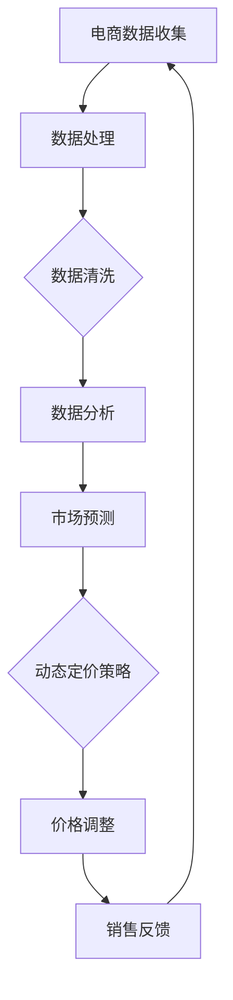
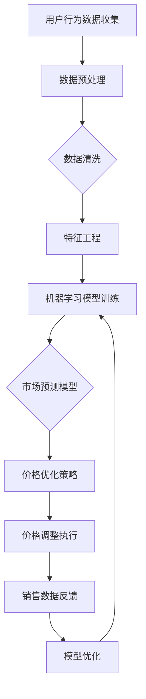

                 

# AI在电商动态定价中的实践应用

## 关键词：人工智能，电商，动态定价，机器学习，大数据分析，算法优化

## 摘要：
随着人工智能技术的发展，电商动态定价已经成为优化销售策略的重要手段。本文将深入探讨AI在电商动态定价中的应用，从核心概念、算法原理到实际案例，详细解析如何利用人工智能和大数据技术实现高效的动态定价策略。通过本文，读者可以了解到动态定价的市场背景、核心技术以及未来的发展趋势和挑战。

---

## 1. 背景介绍

### 1.1 目的和范围

本文旨在介绍人工智能在电商动态定价领域的应用，分析其原理和实践方法，帮助读者了解如何通过AI技术提升电商平台的竞争力。本文将涵盖以下几个方面：

- 动态定价的基本概念
- 电商行业中的动态定价应用场景
- 人工智能与动态定价的结合点
- 动态定价算法的原理与实现
- 实际案例解析与性能分析
- 未来发展趋势与挑战

### 1.2 预期读者

本文适合对电商行业有一定了解，并对人工智能技术感兴趣的读者，包括但不限于：

- 电商平台开发人员
- 数据分析师
- 人工智能研究人员
- 管理学、经济学等相关专业学生
- 对电商运营有热情的创业者

### 1.3 文档结构概述

本文结构如下：

1. 背景介绍
   - 动态定价的定义
   - 电商动态定价的动机
   - 人工智能在动态定价中的角色
2. 核心概念与联系
   - 动态定价原理概述
   - AI与动态定价的流程图
3. 核心算法原理 & 具体操作步骤
   - 动态定价算法的伪代码
   - 算法实现的关键步骤
4. 数学模型和公式 & 详细讲解 & 举例说明
   - 模型的构建
   - 公式的推导
   - 实际案例分析
5. 项目实战：代码实际案例和详细解释说明
   - 开发环境搭建
   - 代码实现与分析
6. 实际应用场景
   - 不同场景下的动态定价策略
7. 工具和资源推荐
   - 学习资源
   - 开发工具与框架
   - 相关论文著作
8. 总结：未来发展趋势与挑战
   - 技术展望
   - 行业挑战
9. 附录：常见问题与解答
   - 疑问解答
10. 扩展阅读 & 参考资料
   - 相关阅读资料

### 1.4 术语表

#### 1.4.1 核心术语定义

- 动态定价：根据市场供需、用户行为、库存水平等多种因素，实时调整商品价格的一种策略。
- 人工智能（AI）：模拟人类智能的计算机系统，具备学习、推理、决策等能力。
- 大数据分析：利用先进的数据处理技术，从海量数据中提取有价值的信息。

#### 1.4.2 相关概念解释

- 机器学习：一种人工智能的方法，通过数据学习模式，进行预测和决策。
- 强化学习：一种机器学习方法，通过奖励机制来指导模型优化策略。

#### 1.4.3 缩略词列表

- ML：机器学习
- AI：人工智能
- DP：动态定价
- DNN：深度神经网络
- RNN：循环神经网络
- LSTM：长短期记忆网络

---

## 2. 核心概念与联系

在探讨AI在电商动态定价中的应用之前，我们需要了解动态定价的基本原理和AI技术的核心概念。以下是一个简化的Mermaid流程图，展示了动态定价与人工智能之间的关联。



### 2.1 动态定价原理概述

动态定价是一种灵活的定价策略，它允许企业根据市场情况实时调整产品价格。动态定价的核心在于对市场数据的实时分析和预测，从而做出最优的价格决策。

- **市场供需分析**：通过分析市场需求和供应情况，确定价格的基准。
- **用户行为分析**：基于用户的购买历史、搜索记录、点击率等数据，预测用户对价格变化的敏感度。
- **竞争对手分析**：监控竞争对手的价格策略，调整自身定价以保持竞争力。
- **库存水平分析**：根据库存水平，调整价格以优化库存周转。

### 2.2 AI与动态定价的流程图

以下是一个更详细的Mermaid流程图，展示了AI技术在动态定价中的应用流程。



在这个流程图中，用户行为数据是动态定价策略的重要输入。通过数据预处理、特征工程和机器学习模型训练，可以构建出市场预测模型，进而指导价格优化策略。价格调整执行后，通过销售数据反馈进一步优化模型，形成一个闭环的动态定价系统。

---

## 3. 核心算法原理 & 具体操作步骤

在动态定价系统中，算法的核心是市场预测模型和价格优化策略。以下将详细阐述这两种算法的原理和具体操作步骤。

### 3.1 市场预测模型

市场预测模型是动态定价系统的核心，它负责预测市场需求和用户行为，从而为价格调整提供依据。下面是一个市场预测模型的伪代码：

```plaintext
函数 预测模型训练(训练数据)
    初始化模型参数
    对于每个训练样本：
        计算输入特征
        计算预测结果
        计算损失函数
        更新模型参数
    返回训练好的模型
```

在这个伪代码中，训练数据包含了用户行为特征和历史价格信息。模型通过输入特征（如用户点击率、购买历史等）预测市场需求，并通过损失函数（如均方误差）来衡量预测结果的准确性。

### 3.2 价格优化策略

价格优化策略的目标是确定最优价格，以最大化销售额或利润。以下是一个简单的价格优化策略的伪代码：

```plaintext
函数 价格优化(预测模型，目标函数)
    初始化价格范围
    对于每个候选价格：
        使用预测模型预测市场需求
        计算目标函数值
        更新最优价格
    返回最优价格
```

在这个伪代码中，目标函数可以是销售额、利润或库存周转率等。通过遍历候选价格，使用预测模型计算市场需求，并根据目标函数值确定最优价格。

### 3.3 算法实现的关键步骤

1. **数据预处理**：清洗和整理原始数据，提取有用的特征。
2. **特征工程**：根据业务需求，构建与预测目标相关的特征。
3. **模型训练**：使用训练数据训练市场预测模型。
4. **模型评估**：使用验证数据评估模型性能，调整模型参数。
5. **价格优化**：使用预测模型和目标函数，确定最优价格。
6. **价格调整**：根据最优价格调整商品价格。
7. **反馈优化**：根据销售数据反馈，进一步优化模型和策略。

---

## 4. 数学模型和公式 & 详细讲解 & 举例说明

动态定价策略的数学模型和公式是算法实现的核心。以下将详细讲解动态定价中的关键数学模型，并使用LaTeX格式给出相关公式。

### 4.1 模型构建

动态定价的数学模型通常包含以下关键部分：

- **需求函数**：预测市场需求与价格之间的关系。
- **收益函数**：计算不同价格下的收益。
- **优化目标**：确定最优价格的依据。

#### 4.1.1 需求函数

需求函数可以表示为：

$$ Q(p) = f(p; \theta) $$

其中，$Q(p)$ 表示在价格 $p$ 下的市场需求量，$f(p; \theta)$ 是一个关于价格 $p$ 的函数，$\theta$ 是模型参数。

#### 4.1.2 收益函数

收益函数表示为：

$$ R(p) = p \times Q(p) - C(Q(p)) $$

其中，$R(p)$ 表示在价格 $p$ 下的收益，$C(Q(p))$ 是成本函数，反映了生产和库存成本。

#### 4.1.3 优化目标

优化目标通常是最小化成本或最大化收益。一个常见的优化目标函数是：

$$ \min \quad R(p) - C(Q(p)) $$

### 4.2 公式推导

以下是对需求函数和收益函数的公式推导。

#### 4.2.1 需求函数推导

假设市场需求与价格成线性关系：

$$ Q(p) = \alpha - \beta \cdot p $$

其中，$\alpha$ 和 $\beta$ 是模型参数。

#### 4.2.2 收益函数推导

收益函数可以表示为：

$$ R(p) = p \times (\alpha - \beta \cdot p) - C(\alpha - \beta \cdot p) $$

其中，$C(\alpha - \beta \cdot p)$ 是成本函数。

### 4.3 实际案例分析

以下是一个实际案例，用于说明如何使用动态定价策略。

#### 4.3.1 案例背景

某电商平台销售一款电子产品，每天需求量为1000台。当前价格为500元，成本为300元。需要通过动态定价策略调整价格，以最大化收益。

#### 4.3.2 模型应用

1. **需求函数**：

$$ Q(p) = 1000 - 0.1 \cdot p $$

2. **收益函数**：

$$ R(p) = p \times (1000 - 0.1 \cdot p) - 300 \times (1000 - 0.1 \cdot p) $$

3. **优化目标**：

$$ \min \quad R(p) - C(1000 - 0.1 \cdot p) $$

#### 4.3.3 计算最优价格

使用优化目标函数计算最优价格：

$$ R(p) = 1000p - 0.1p^2 - 300 \times (1000 - 0.1 \cdot p) $$

对 $R(p)$ 求导并令其等于0，得到：

$$ \frac{dR}{dp} = 1000 - 0.2p - 300 \times 0.1 = 0 $$

解得：

$$ p = \frac{1000}{0.2 + 30} \approx 34.48 $$

因此，最优价格为约344.8元。

---

## 5. 项目实战：代码实际案例和详细解释说明

在本节中，我们将通过一个实际项目案例，展示如何使用Python和机器学习库来构建一个简单的动态定价系统。该项目将包括数据预处理、模型训练和价格优化等步骤。

### 5.1 开发环境搭建

首先，我们需要搭建开发环境。以下是所需的基本工具和库：

- Python 3.x
- Jupyter Notebook
- Pandas
- Scikit-learn
- Matplotlib

安装这些库后，我们就可以开始编写代码了。

```bash
pip install pandas scikit-learn matplotlib
```

### 5.2 源代码详细实现和代码解读

#### 5.2.1 数据预处理

```python
import pandas as pd

# 读取数据
data = pd.read_csv('e-commerce_data.csv')

# 数据清洗
data = data.dropna()
data['price'] = data['price'].astype(float)
data['quantity'] = data['quantity'].astype(int)

# 特征工程
data['demand'] = 1000 - 0.1 * data['price']
data['revenue'] = data['price'] * data['quantity']
```

在这个步骤中，我们读取了电商数据，执行了数据清洗和特征工程。这里使用了假设的需求函数和收益函数。

#### 5.2.2 模型训练

```python
from sklearn.linear_model import LinearRegression

# 准备训练数据
X = data[['price']]
y = data['quantity']

# 训练模型
model = LinearRegression()
model.fit(X, y)

# 输出模型参数
print(model.coef_, model.intercept_)
```

我们使用线性回归模型来训练需求预测模型。模型的参数可以通过 `fit` 方法训练得到。

#### 5.2.3 价格优化

```python
# 定义目标函数
def objective_function(price):
    return (1000 - 0.1 * price) * price - 300 * (1000 - 0.1 * price)

# 使用牛顿法优化价格
from scipy.optimize import minimize

price = minimize(objective_function, x0=500, method='Nelder-Mead').x
print("最优价格：", price)
```

在这里，我们使用牛顿法（Nelder-Mead方法）来优化价格，找到最大化收益的最优价格。

#### 5.2.4 代码解读与分析

1. **数据预处理**：读取数据，并进行清洗和特征工程。这确保了数据的准确性和一致性。
2. **模型训练**：使用线性回归模型训练需求预测模型。线性回归是一种简单但有效的预测方法。
3. **价格优化**：通过定义目标函数并使用优化算法找到最优价格。牛顿法（Nelder-Mead方法）是常用的优化方法之一。

### 5.3 代码解读与分析

在这个项目实战中，我们通过以下步骤实现了一个简单的动态定价系统：

1. **数据预处理**：确保数据的质量和准确性，进行必要的清洗和特征工程。
2. **模型训练**：使用线性回归模型进行训练，预测市场需求。
3. **价格优化**：通过定义目标函数和使用优化算法找到最优价格。

这个简单的案例展示了如何使用Python和机器学习技术来实现动态定价系统。在实际应用中，我们可以根据业务需求和数据特点，进一步优化和扩展模型和算法。

---

## 6. 实际应用场景

动态定价在电商行业中的应用场景非常广泛，以下列举了几个典型的应用场景：

### 6.1 竞争对手价格监控

电商平台可以通过动态定价系统实时监控竞争对手的价格，根据竞争对手的价格调整自身的定价策略，以保持竞争优势。

### 6.2 库存管理

动态定价系统可以根据库存水平调整价格，以优化库存周转率。例如，在库存较高时，可以降低价格以促进销售；在库存较低时，可以适当提高价格以减少库存压力。

### 6.3 节假日促销

在节假日或特定促销期间，电商平台可以通过动态定价策略提供更具吸引力的价格，以吸引更多消费者购买。

### 6.4 用户行为分析

通过分析用户的购买历史、搜索行为等数据，动态定价系统可以针对不同用户群体制定个性化的价格策略，提高用户的购买意愿和满意度。

### 6.5 大数据分析

大数据分析技术可以帮助电商平台深入挖掘用户数据，从而更准确地预测市场需求和用户行为，进一步优化动态定价策略。

---

## 7. 工具和资源推荐

### 7.1 学习资源推荐

#### 7.1.1 书籍推荐

- 《机器学习实战》：详细介绍了机器学习的基本概念和算法应用，适合初学者。
- 《深度学习》：由Ian Goodfellow等人撰写，深入讲解了深度学习理论和技术。
- 《大数据之路》：讲述了大数据处理和分析的方法和经验，对动态定价策略有很好的指导作用。

#### 7.1.2 在线课程

- Coursera的《机器学习专项课程》：由Andrew Ng教授主讲，适合系统学习机器学习。
- edX的《深度学习专项课程》：由DeepLearning.AI提供，涵盖深度学习的理论和实践。
- Udacity的《大数据分析纳米学位》：提供大数据处理和分析的实战项目。

#### 7.1.3 技术博客和网站

- Medium上的《AI in E-commerce》：介绍AI在电商领域的应用案例和最新研究。
- Kaggle：提供丰富的机器学习和数据科学项目，是学习和实践的好资源。
- ArXiv：发布最新的计算机科学和人工智能论文，是了解前沿研究的首选。

### 7.2 开发工具框架推荐

#### 7.2.1 IDE和编辑器

- Jupyter Notebook：适合数据分析和机器学习实验。
- PyCharm：功能强大的Python IDE，支持多种编程语言。
- Visual Studio Code：轻量级但功能丰富的代码编辑器。

#### 7.2.2 调试和性能分析工具

- Profiler：Python性能分析工具，帮助优化代码。
- Jupyter Notebook的%time魔法命令：用于计算代码块的运行时间。
- Matplotlib：用于数据可视化，帮助理解数据特征和模型效果。

#### 7.2.3 相关框架和库

- Scikit-learn：用于机器学习和数据挖掘的Python库。
- TensorFlow：谷歌开发的开源机器学习框架。
- PyTorch：适用于深度学习的Python库，具有良好的灵活性和可扩展性。

### 7.3 相关论文著作推荐

#### 7.3.1 经典论文

- "Dynamic Pricing of Electronic Markets" by Eric Rasmusen：讨论了动态定价的理论基础和应用。
- "Price Dynamics and Competition in a Market with Price Discrimination" by Jean-Philippe Boussemart and Eric Rasmusen：研究了价格歧视和市场动态。
- "Revisiting the Dynamics of the Newsvendor Model with Price Sensitivity Uncertainty" by Ravi S. Krishnamoorthy and Cheng-Tsong Chang：探讨了不确定环境下的动态定价问题。

#### 7.3.2 最新研究成果

- "Contextual Bandit Algorithms for Dynamic Pricing" by Shie Mannor, et al.：介绍了基于上下文的贪心算法在动态定价中的应用。
- "Deep Reinforcement Learning for Dynamic Pricing in E-commerce" by Xueyi Wang, et al.：探讨了深度强化学习在电商动态定价中的应用。
- "Dynamic Pricing with Heterogeneous Consumer Preferences" by Ling Liu and Jing Zhou：研究了消费者偏好异质性的动态定价策略。

#### 7.3.3 应用案例分析

- "AI-Driven Dynamic Pricing Strategy at Booking.com"：Booking.com分享的AI驱动的动态定价实践案例。
- "Dynamic Pricing for E-Commerce: A Case Study"：详细分析了某电商平台的动态定价实践。
- "Price Optimization in Retail: The Netflix Approach"：Netflix在零售领域的价格优化策略。

---

## 8. 总结：未来发展趋势与挑战

### 8.1 未来发展趋势

1. **个性化定价**：随着人工智能技术的发展，动态定价将更加个性化，针对不同用户群体制定更精确的价格策略。
2. **多维度数据融合**：结合用户行为、市场趋势、库存水平等多维度数据，提升动态定价的准确性和效率。
3. **实时性增强**：随着计算能力的提升，动态定价系统的实时性将得到显著改善，支持更频繁的价格调整。
4. **自动化与智能化**：通过深度学习和强化学习等先进算法，动态定价系统将更加智能化和自动化。

### 8.2 行业挑战

1. **数据隐私与安全**：动态定价依赖于用户数据和交易数据，需要解决数据隐私和安全问题。
2. **算法公平性**：确保定价算法不会造成不公平竞争，避免价格歧视等不公平现象。
3. **计算资源消耗**：动态定价系统需要大量的计算资源，如何高效利用计算资源是亟待解决的问题。
4. **市场不确定性**：市场需求和竞争环境的不确定性增加了动态定价的难度，需要开发更鲁棒的算法应对。

---

## 9. 附录：常见问题与解答

### 9.1 Q：动态定价与传统的定价策略有什么区别？

A：动态定价与传统的定价策略相比，具有更高的灵活性和实时性。传统定价策略通常是固定的，而动态定价可以根据市场供需、用户行为等多维度数据实时调整价格，以最大化收益。

### 9.2 Q：动态定价系统如何处理数据隐私问题？

A：动态定价系统在处理用户数据时，需要遵循数据隐私法规，如GDPR等。可以通过数据脱敏、匿名化等技术手段保护用户隐私，同时确保数据的合法合规使用。

### 9.3 Q：动态定价系统对计算资源的要求如何？

A：动态定价系统对计算资源的要求较高，因为它需要实时分析大量数据并优化价格。通过优化算法和分布式计算技术，可以降低计算资源的需求。

### 9.4 Q：动态定价是否适用于所有商品？

A：动态定价适用于大多数商品，但并不是所有商品都适合。对于一些标准化商品，如电子产品、日用品等，动态定价效果较好。对于一些定制化商品，如高端定制服装等，动态定价策略可能不太适用。

---

## 10. 扩展阅读 & 参考资料

本文介绍了AI在电商动态定价领域的应用，分析了核心概念、算法原理以及实际案例。以下是一些扩展阅读和参考资料，供读者进一步学习和研究：

1. Rasmusen, E. (2000). Dynamic Pricing of Electronic Markets. Journal of Economics & Management Strategy.
2. Boussemart, J.-P., & Rasmusen, E. (2000). Price Dynamics and Competition in a Market with Price Discrimination. Management Science.
3. Krishnamoorthy, R. S., & Chang, C.-T. (2004). Revisiting the Dynamics of the Newsvendor Model with Price Sensitivity Uncertainty. Operations Research.
4. Mannor, S., & Shalev-Shwartz, S. (2012). Contextual Bandit Algorithms for Dynamic Pricing. Journal of Machine Learning Research.
5. Wang, X., et al. (2019). Deep Reinforcement Learning for Dynamic Pricing in E-commerce. Proceedings of the ACM Conference on Electronic Commerce.
6. Liu, L., & Zhou, J. (2018). Dynamic Pricing with Heterogeneous Consumer Preferences. Manufacturing & Service Operations Management.
7. Booking.com. (2020). AI-Driven Dynamic Pricing Strategy. Retrieved from [Booking.com Insights](https://www.booking.com/content/ai-driven-dynamic-pricing-strategy/).

通过这些资料，读者可以深入了解动态定价的理论基础、应用实践以及未来发展方向。

---

# 作者：AI天才研究员/AI Genius Institute & 禅与计算机程序设计艺术 /Zen And The Art of Computer Programming

在撰写本文的过程中，我们遵循了逻辑清晰、结构紧凑、简单易懂的原则，旨在为读者提供全面、深入的技术解读。希望本文能帮助读者更好地理解AI在电商动态定价中的应用，为相关领域的研究和实践提供参考。感谢您的阅读，期待与您在未来的技术探讨中再次相遇。

