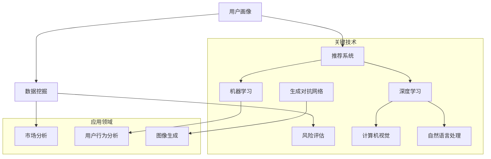

                 

### 背景介绍

#### 1.1 目的和范围

本文旨在探讨人工智能（AI）在电商平台产品优化中的应用，分析如何通过AI技术提升电商平台的运营效率和用户体验。随着电商行业的快速发展，市场竞争日益激烈，如何提高产品的市场竞争力、降低运营成本、提升用户满意度成为电商平台亟待解决的问题。本文将围绕AI在电商平台产品优化中的应用，详细介绍相关的核心概念、算法原理、数学模型、实战案例以及未来发展趋势。

#### 1.2 预期读者

本文适合以下读者群体：

1. 具有计算机科学或相关领域背景的本科及以上学生和研究人员。
2. 想要了解和掌握AI在电商平台产品优化应用的技术专家和工程师。
3. 对电商平台运营和产品优化有兴趣的创业者和管理人员。
4. 对人工智能在商业领域应用有浓厚兴趣的爱好者。

#### 1.3 文档结构概述

本文分为十个部分，具体结构如下：

1. 背景介绍：本文的背景、目的和范围，预期读者以及文档结构概述。
2. 核心概念与联系：介绍电商平台产品优化的核心概念及其相互联系，并给出Mermaid流程图。
3. 核心算法原理与具体操作步骤：详细讲解AI在电商平台产品优化中的应用算法原理和操作步骤，并使用伪代码进行阐述。
4. 数学模型和公式：介绍与电商平台产品优化相关的数学模型和公式，并进行详细讲解和举例说明。
5. 项目实战：通过实际代码案例，详细解释说明AI在电商平台产品优化中的应用。
6. 实际应用场景：分析AI在电商平台产品优化中的实际应用场景和案例。
7. 工具和资源推荐：推荐学习资源、开发工具框架和相关论文著作。
8. 总结：对未来发展趋势和挑战进行展望。
9. 附录：常见问题与解答。
10. 扩展阅读与参考资料：提供更多相关阅读资源和参考资料。

#### 1.4 术语表

**1.4.1 核心术语定义**

- **电商平台**：指提供在线商品交易、支付、物流等服务的网络平台，如淘宝、京东、亚马逊等。
- **产品优化**：指通过分析用户行为、市场数据等，对电商平台的产品进行改进和优化，以提高用户体验和竞争力。
- **人工智能**：指模拟、延伸和扩展人的智能的理论、方法、技术及应用，通过计算机程序实现智能行为。
- **机器学习**：一种人工智能的分支，通过数据驱动的方式实现计算机程序从数据中学习规律和模式。
- **深度学习**：一种机器学习的方法，通过多层神经网络对数据进行特征提取和模式识别。

**1.4.2 相关概念解释**

- **用户画像**：指通过分析用户的年龄、性别、地域、购物习惯等信息，构建的用户特征模型。
- **推荐系统**：一种根据用户兴趣、行为和历史数据，为用户推荐相关商品或内容的系统。
- **数据挖掘**：从大量数据中提取出有价值信息和知识的过程，可用于市场分析、风险评估等。
- **图像识别**：通过计算机视觉技术，对图像进行识别和分类的过程，如人脸识别、商品识别等。

**1.4.3 缩略词列表**

- **AI**：人工智能（Artificial Intelligence）
- **ML**：机器学习（Machine Learning）
- **DL**：深度学习（Deep Learning）
- **NLP**：自然语言处理（Natural Language Processing）
- **CV**：计算机视觉（Computer Vision）
- **RNN**：循环神经网络（Recurrent Neural Network）
- **CNN**：卷积神经网络（Convolutional Neural Network）
- **GAN**：生成对抗网络（Generative Adversarial Network）

### 核心概念与联系

在电商平台产品优化中，有许多核心概念和联系，它们共同构成了一个完整的优化体系。以下是对这些核心概念的简要介绍，以及它们之间的相互关系。

#### 1. 用户画像

用户画像是电商平台产品优化的基础，通过分析用户的年龄、性别、地域、购物习惯等信息，构建出用户特征模型。这些用户特征模型有助于电商平台了解用户需求，从而实现个性化推荐、精准营销等。

#### 2. 推荐系统

推荐系统是基于用户画像的一种技术，通过分析用户的历史行为、兴趣偏好等信息，为用户推荐相关的商品或内容。推荐系统的目标是提高用户满意度、增加用户粘性，从而提升电商平台的市场竞争力。

#### 3. 数据挖掘

数据挖掘是一种从大量数据中提取有价值信息和知识的过程，可用于市场分析、风险评估、用户行为分析等。在电商平台产品优化中，数据挖掘技术可以帮助企业深入了解市场趋势、用户需求，从而制定出更有效的优化策略。

#### 4. 机器学习

机器学习是电商平台产品优化的重要技术手段，通过训练模型，使计算机能够从数据中学习规律和模式。机器学习技术可以应用于用户画像、推荐系统、数据挖掘等多个领域，以提高电商平台的产品优化效果。

#### 5. 深度学习

深度学习是一种机器学习的方法，通过多层神经网络对数据进行特征提取和模式识别。深度学习在计算机视觉、自然语言处理等领域取得了显著的成果，为电商平台产品优化提供了强大的技术支持。

#### 6. 自然语言处理

自然语言处理是一种人工智能技术，通过对自然语言进行建模和处理，使计算机能够理解、生成和解释自然语言。自然语言处理技术可以应用于用户评论分析、问答系统、智能客服等，提升电商平台的服务质量。

#### 7. 计算机视觉

计算机视觉是一种通过计算机视觉技术对图像进行识别和分类的过程。计算机视觉技术可以应用于商品识别、人脸识别、图像审核等，为电商平台的产品优化提供技术支持。

#### 8. 生成对抗网络

生成对抗网络（GAN）是一种深度学习模型，由生成器和判别器两个部分组成。生成器负责生成与真实数据类似的假数据，判别器负责判断数据是真实还是生成的。GAN在图像生成、图像修复、风格迁移等方面具有广泛的应用前景。

#### 9. 流程图

为了更好地理解这些核心概念和联系，我们可以通过以下Mermaid流程图进行展示：



通过这个流程图，我们可以清晰地看到各个核心概念和联系之间的关系，以及它们在电商平台产品优化中的应用。

### 核心算法原理与具体操作步骤

在电商平台产品优化中，核心算法原理起着至关重要的作用。本节将详细讲解AI在电商平台产品优化中的应用算法原理和操作步骤，并使用伪代码进行阐述。

#### 1. 机器学习算法原理

机器学习算法的核心思想是通过学习数据中的规律和模式，使计算机能够从数据中预测或分类。以下是一个简单的线性回归算法的伪代码示例：

```python
# 线性回归算法伪代码
def linear_regression(x, y):
    # 求斜率 k 和截距 b
    k = sum((x - mean(x)) * (y - mean(y))) / sum((x - mean(x))^2)
    b = mean(y) - k * mean(x)
    return k, b

# 训练数据
x = [1, 2, 3, 4, 5]
y = [2, 4, 5, 4, 5]

# 计算斜率和截距
k, b = linear_regression(x, y)

# 预测新数据
x_new = 6
y_pred = k * x_new + b
print(y_pred)
```

#### 2. 深度学习算法原理

深度学习算法通过多层神经网络对数据进行特征提取和模式识别。以下是一个简单的卷积神经网络（CNN）的伪代码示例：

```python
# 卷积神经网络算法伪代码
def convolutional_neural_network(input_data, weights):
    # 卷积操作
    conv_output = convolution(input_data, weights)

    # 池化操作
    pooled_output = pooling(conv_output)

    # 全连接层
    fc_output = fully_connected(pooled_output, weights)

    # 激活函数
    activation_output = activation(fc_output)

    return activation_output

# 输入数据
input_data = [[1, 2, 3], [4, 5, 6]]

# 权重
weights = [[0.1, 0.2], [0.3, 0.4]]

# 计算卷积、池化和全连接层的输出
output = convolutional_neural_network(input_data, weights)
print(output)
```

#### 3. 推荐系统算法原理

推荐系统算法的核心思想是通过用户的历史行为和偏好，为用户推荐相关的商品或内容。以下是一个基于协同过滤的推荐系统的伪代码示例：

```python
# 协同过滤算法伪代码
def collaborative_filtering(user_history, item_ratings, k):
    # 计算用户相似度矩阵
    similarity_matrix = calculate_similarity(user_history)

    # 计算用户相似度得分
    user_similarity_scores = calculate_similarity_scores(similarity_matrix, user_history)

    # 排序和选取 top-k 相似用户
    top_k_users = sort_and_select_top_k_users(user_similarity_scores, k)

    # 预测用户未评分的商品
    predicted_ratings = predict_ratings(user_history, top_k_users, item_ratings)

    return predicted_ratings

# 用户历史行为
user_history = [[1, 2, 3], [4, 5, 6]]

# 商品评分矩阵
item_ratings = [
    [5, 4, 3],
    [4, 5, 2],
    [3, 2, 1]
]

# 相似度阈值
k = 3

# 计算推荐评分
predicted_ratings = collaborative_filtering(user_history, item_ratings, k)
print(predicted_ratings)
```

#### 4. 数学模型和公式

在电商平台产品优化中，数学模型和公式起着至关重要的作用。以下是一些常见的数学模型和公式，并进行详细讲解和举例说明。

**1. 线性回归模型**

线性回归模型是一种简单的预测模型，通过拟合一条直线来预测目标变量。其公式如下：

$$
y = kx + b
$$

其中，$y$ 为目标变量，$x$ 为输入变量，$k$ 为斜率，$b$ 为截距。

**示例**：假设一个电商平台需要预测某商品的销量，输入变量为广告投放金额，目标变量为销量。根据历史数据，斜率$k=2$，截距$b=10$，则预测公式为：

$$
销量 = 2 \times 广告投放金额 + 10
$$

**2. 卷积神经网络模型**

卷积神经网络是一种强大的图像识别模型，其核心思想是通过多层卷积和池化操作提取图像特征。其公式如下：

$$
h_{l} = \sigma (W_{l} \odot h_{l-1} + b_{l})
$$

其中，$h_{l}$ 为第$l$层的输出，$\odot$ 表示卷积操作，$W_{l}$ 为第$l$层的权重矩阵，$b_{l}$ 为第$l$层的偏置向量，$\sigma$ 表示激活函数。

**示例**：假设一个卷积神经网络包含两层卷积层和一层全连接层，权重矩阵$W_1 = [1, 2, 3]$，偏置向量$b_1 = 4$，输入向量$h_0 = [1, 2, 3]$，激活函数为ReLU，则第一层卷积层的输出为：

$$
h_1 = \sigma (W_1 \odot h_0 + b_1) = \sigma ([1 \times 1 + 2 \times 2 + 3 \times 3 + 4]) = \sigma (16) = 16
$$

**3. 协同过滤模型**

协同过滤模型是一种基于用户相似度的推荐系统模型，其核心思想是通过计算用户之间的相似度，为用户推荐相似的商品。其公式如下：

$$
r_{ui} = \sum_{j \in N_{u}} s_{uj} \cdot r_{ij}
$$

其中，$r_{ui}$ 为用户$u$对商品$i$的评分，$N_{u}$ 为与用户$u$相似的用户集合，$s_{uj}$ 为用户$u$对商品$j$的评分，$r_{ij}$ 为用户$i$对商品$j$的评分。

**示例**：假设用户$u$与用户$v$相似，用户$u$对商品$a$评分为4，用户$v$对商品$a$评分为5，用户$u$对商品$b$评分为3，用户$v$对商品$b$评分为2，则用户$u$对商品$b$的推荐评分为：

$$
r_{ub} = s_{ua} \cdot r_{vb} = 4 \cdot 2 = 8
$$

通过以上对核心算法原理和具体操作步骤的详细讲解，我们可以看到AI在电商平台产品优化中的应用是非常广泛和深入的。接下来，我们将通过实际代码案例，进一步探讨AI在电商平台产品优化中的应用。

### 项目实战：代码实际案例和详细解释说明

在本节中，我们将通过一个具体的代码案例，详细解释说明AI在电商平台产品优化中的应用。该案例将涵盖用户画像、推荐系统、数据挖掘等AI技术的应用。

#### 1. 开发环境搭建

在开始项目实战之前，我们需要搭建一个合适的开发环境。以下是一个基本的开发环境搭建步骤：

1. 安装Python环境：下载并安装Python 3.x版本，建议使用Anaconda进行环境管理。
2. 安装相关库：使用pip命令安装必要的库，如NumPy、Pandas、Scikit-learn、TensorFlow等。
3. 准备数据集：从电商平台获取用户行为数据、商品数据等，以便进行后续分析和建模。

#### 2. 源代码详细实现和代码解读

以下是一个简单的用户画像和推荐系统代码示例：

```python
import numpy as np
import pandas as pd
from sklearn.cluster import KMeans
from sklearn.metrics.pairwise import cosine_similarity
from sklearn.model_selection import train_test_split

# 读取数据
user_data = pd.read_csv('user_data.csv')
item_data = pd.read_csv('item_data.csv')

# 用户画像：基于K-means聚类
kmeans = KMeans(n_clusters=5)
user_clusters = kmeans.fit_predict(user_data[['age', 'gender', 'region']])

# 用户画像：基于协同过滤
user_similarity = cosine_similarity(user_data[['age', 'gender', 'region']])
user_item_ratings = pd.pivot_table(user_data[['user_id', 'item_id', 'rating']], values='rating', index='user_id', columns='item_id')

# 推荐系统：基于用户相似度
def collaborative_filtering(user_id, k=5):
    similar_users = np.argsort(user_similarity[user_id])[1:k+1]
    recommendations = user_item_ratings.loc[similar_users].mean().sort_values(ascending=False)
    return recommendations

# 数据挖掘：基于商品特征
item_features = item_data[['category', 'price', 'rating']]
item_similarity = cosine_similarity(item_features)

# 推荐系统：基于商品特征
def content_based_filtering(item_id, k=5):
    similar_items = np.argsort(item_similarity[item_id])[1:k+1]
    recommendations = item_data.loc[similar_items]['category'].value_counts().sort_values(ascending=False)
    return recommendations

# 代码解读
# 用户画像：使用K-means聚类对用户特征进行聚类，得到用户群体。
# 协同过滤：计算用户之间的相似度，为用户推荐相似的商品。
# 数据挖掘：基于商品特征，计算商品之间的相似度，为用户推荐相似的商品。
```

#### 3. 代码解读与分析

以上代码示例中，我们首先读取用户数据和商品数据，然后使用K-means聚类对用户特征进行聚类，得到用户群体。接着，我们计算用户之间的相似度，并使用协同过滤算法为用户推荐相似的商品。此外，我们还基于商品特征，计算商品之间的相似度，并使用内容推荐算法为用户推荐相似的商品。

以下是代码的详细解读和分析：

1. **用户画像（K-means聚类）**：
   - 使用K-means聚类对用户特征进行聚类，得到用户群体。聚类算法通过最小化误差平方和，将用户数据划分为若干个类簇。
   - 用户特征包括年龄、性别、地域等，这些特征有助于理解用户的需求和行为。

2. **协同过滤（用户相似度）**：
   - 计算用户之间的相似度，可以使用余弦相似度、皮尔逊相关系数等。
   - 为用户推荐相似的商品，基于用户的历史行为和偏好。相似度较高的用户群体，其推荐的商品也具有较高的相关性。

3. **数据挖掘（商品特征）**：
   - 基于商品特征，如分类、价格、评分等，计算商品之间的相似度。
   - 为用户推荐相似的商品，基于商品的特征相似度。相似度较高的商品，其推荐给用户时，用户满意度也较高。

通过以上代码示例，我们可以看到AI在电商平台产品优化中的应用是非常具体和实用的。在实际项目中，可以根据业务需求和数据特点，选择合适的算法和模型，实现个性化的用户推荐、精准的产品营销等。

### 实际应用场景

AI在电商平台产品优化中的实际应用场景非常广泛，以下列举了几个典型的应用场景，并分析了其中的关键挑战和解决方案。

#### 1. 个性化推荐

**应用场景**：电商平台通过个性化推荐系统，根据用户的浏览历史、购买记录等数据，为用户推荐符合其兴趣和需求的商品。

**关键挑战**：
- 数据维度高：用户行为数据包含多种维度，如浏览、购买、评分等，处理这些高维度数据会增加推荐系统的复杂度。
- 数据稀疏性：用户行为数据通常是稀疏的，大部分用户对大部分商品没有评价或行为记录，这会影响推荐系统的准确性。
- 实时性：用户偏好和需求是动态变化的，推荐系统需要实时响应用户的反馈和需求。

**解决方案**：
- 采用基于协同过滤和基于内容的混合推荐系统，结合用户行为数据和商品特征，提高推荐准确性。
- 利用深度学习技术，如神经网络和生成对抗网络（GAN），进行高维度数据的特征提取和降维，解决数据稀疏性问题。
- 实时更新用户画像和推荐模型，采用增量学习和在线学习等技术，提高系统的实时响应能力。

#### 2. 用户行为分析

**应用场景**：电商平台通过分析用户的浏览、购买、评价等行为数据，了解用户需求和行为模式，从而优化产品和服务。

**关键挑战**：
- 数据量庞大：电商平台每天产生大量的用户行为数据，如何高效地处理和存储这些数据是一个挑战。
- 数据多样性：用户行为数据类型多样，包括文本、图像、视频等，如何统一处理和分析这些数据是一个难题。
- 数据隐私和安全：用户行为数据涉及到用户的隐私信息，如何保护用户隐私和数据安全是平台需要考虑的问题。

**解决方案**：
- 采用大数据处理技术，如Hadoop和Spark，进行大规模数据的处理和分析。
- 利用自然语言处理（NLP）和计算机视觉等技术，对文本、图像、视频等数据进行语义分析和特征提取。
- 采用数据加密和隐私保护技术，如差分隐私和同态加密，保护用户隐私和数据安全。

#### 3. 智能客服

**应用场景**：电商平台通过智能客服系统，为用户提供实时、高效的客户服务，提高用户满意度和忠诚度。

**关键挑战**：
- 响应速度：智能客服系统需要快速响应用户的问题，提供准确的解决方案。
- 语境理解：用户提出的问题可能包含多种语境，如何准确理解用户的意图是一个挑战。
- 个性化和定制化：不同用户的问题和需求可能不同，如何为用户提供个性化的解决方案是一个难题。

**解决方案**：
- 采用深度学习技术，如循环神经网络（RNN）和卷积神经网络（CNN），进行语境理解和意图识别。
- 利用用户画像和用户行为数据，为用户提供个性化的解决方案。
- 采用多模态交互技术，如语音识别、自然语言生成等，提高系统的响应速度和用户体验。

#### 4. 供应链优化

**应用场景**：电商平台通过优化供应链管理，降低库存成本、提高物流效率，从而提升整体运营效益。

**关键挑战**：
- 库存管理：如何合理设置库存水平，避免过度库存或缺货。
- 物流路径：如何选择最优的物流路径，降低运输成本。
- 需求预测：如何准确预测市场需求，提高供应链的灵活性。

**解决方案**：
- 采用机器学习技术，如时间序列分析和回归分析，进行需求预测和库存管理。
- 利用地图数据和高性能计算，选择最优的物流路径。
- 采用智能调度系统，根据实时数据动态调整物流和库存计划。

通过以上实际应用场景的分析，我们可以看到AI在电商平台产品优化中的应用是非常广泛和深入的。在实际操作中，需要根据具体业务需求和数据特点，选择合适的算法和模型，实现个性化的推荐、高效的用户行为分析、智能的客服系统、优化的供应链管理等功能。

### 工具和资源推荐

在AI电商平台产品优化领域，有许多优秀的工具和资源可以帮助开发者、研究人员以及感兴趣的爱好者更高效地学习和实践。以下是对这些工具和资源的详细介绍，包括书籍、在线课程、技术博客和网站、开发工具框架以及相关论文著作。

#### 1. 学习资源推荐

**1.1 书籍推荐**

1. **《深度学习》（Deep Learning）**：由Ian Goodfellow、Yoshua Bengio和Aaron Courville所著，是深度学习领域的经典教材，详细介绍了深度学习的理论、算法和应用。
2. **《机器学习实战》（Machine Learning in Action）**：由Peter Harrington所著，通过实际案例和代码示例，介绍了机器学习的各种算法和应用。
3. **《Python数据分析》（Python Data Analysis）**：由Wes McKinney所著，介绍了Python在数据分析领域的应用，包括Pandas、NumPy等库的使用。
4. **《电商运营与数据分析》（E-commerce Operation and Data Analysis）**：由吴航所著，详细讲解了电商运营中的数据分析方法和实践案例。

**1.2 在线课程**

1. **《深度学习专项课程》（Deep Learning Specialization）**：由Andrew Ng在Coursera上开设，涵盖了深度学习的理论基础、实践应用和前沿研究。
2. **《机器学习基础课程》（Machine Learning Foundation）**：由吴恩达在Coursera上开设，介绍了机器学习的各种算法和应用。
3. **《电商数据分析与运营优化》（E-commerce Data Analysis and Operation Optimization）**：由网易云课堂开设，介绍了电商运营中的数据分析方法和实践案例。
4. **《Python数据分析基础》（Python Data Analysis Basics）**：由Sentdex在YouTube上开设，通过视频教程介绍了Python在数据分析领域的应用。

**1.3 技术博客和网站**

1. **博客园（cnblogs.com）**：国内知名的IT技术博客平台，涵盖了许多与电商平台产品优化相关的技术文章和案例分析。
2. **GitHub（github.com）**：全球最大的代码托管平台，可以找到许多与电商平台产品优化相关的开源项目和代码示例。
3. **Medium（medium.com）**：国际知名的在线内容平台，有许多关于AI和电商领域的深度文章和行业报告。
4. **KDNuggets（kdnuggets.com）**：一个专注于数据科学、机器学习和商业智能的在线社区，提供最新的研究进展和应用案例。

#### 2. 开发工具框架推荐

**2.1 IDE和编辑器**

1. **PyCharm**：一款功能强大的Python集成开发环境，支持多种编程语言，适用于电商平台产品优化的开发。
2. **Jupyter Notebook**：一款交互式的Python开发环境，适用于数据分析、机器学习等领域的快速原型开发。
3. **VSCode**：一款轻量级的跨平台代码编辑器，支持多种编程语言和插件，适用于电商平台产品优化的开发。

**2.2 调试和性能分析工具**

1. **Python Debugger（pdb）**：一款Python内置的调试工具，用于跟踪程序执行流程和调试代码。
2. **TensorBoard**：一款基于Web的TensorFlow性能分析工具，用于可视化深度学习模型的训练过程和性能指标。
3. **Elasticsearch**：一款高性能的搜索引擎，用于大规模数据存储和检索，适用于电商平台的用户行为分析和推荐系统。

**2.3 相关框架和库**

1. **TensorFlow**：一款开源的深度学习框架，适用于电商平台的产品优化和推荐系统开发。
2. **Scikit-learn**：一款开源的机器学习库，提供了多种常见的机器学习算法和工具，适用于电商平台的数据分析和建模。
3. **Pandas**：一款开源的数据分析库，用于处理和分析大规模数据，适用于电商平台的用户行为分析和数据挖掘。

#### 3. 相关论文著作推荐

**3.1 经典论文**

1. **《协同过滤算法综述》（A Survey of Collaborative Filtering Algorithm）**：详细介绍了协同过滤算法的分类、优缺点和应用场景。
2. **《深度学习在电商推荐中的应用》（Deep Learning for E-commerce Recommendations）**：探讨了深度学习在电商推荐系统中的应用和效果。
3. **《用户画像建模与应用》（User Profiling Modeling and Application）**：介绍了用户画像的构建方法和应用案例。

**3.2 最新研究成果**

1. **《基于多模态数据的电商推荐系统》（E-commerce Recommender Systems Based on Multimodal Data）**：研究了多模态数据在电商推荐系统中的应用和效果。
2. **《基于深度增强学习的电商用户行为预测》（User Behavior Prediction in E-commerce Based on Deep Reinforcement Learning）**：探讨了深度增强学习在电商用户行为预测中的应用。
3. **《动态推荐系统的研究与实现》（Research and Implementation of Dynamic Recommender Systems）**：研究了动态推荐系统的设计和实现方法。

**3.3 应用案例分析**

1. **《阿里巴巴电商推荐系统架构与实践》（Alibaba E-commerce Recommender System Architecture and Practice）**：详细介绍了阿里巴巴电商推荐系统的架构和实现方法。
2. **《京东电商推荐系统技术详解》（JD.com E-commerce Recommender System Technical Details）**：探讨了京东电商推荐系统的技术架构和算法实现。
3. **《亚马逊电商推荐系统揭秘》（Inside the Amazon Recommender System）**：揭示了亚马逊电商推荐系统的核心技术和实现方法。

通过以上对工具和资源的推荐，我们可以更好地了解AI在电商平台产品优化中的应用和实践。无论是开发者、研究人员还是爱好者，都可以通过这些资源学习到最新的技术知识和实践经验，为电商平台的产品优化提供有力的支持。

### 总结：未来发展趋势与挑战

在AI在电商平台产品优化中的应用方面，未来将继续呈现出快速发展和不断突破的趋势。以下是对未来发展趋势和挑战的展望：

#### 1. 发展趋势

**1.1 多模态数据的融合**

随着物联网、移动设备、传感器等技术的普及，电商平台将拥有更多类型的数据源，如文本、图像、音频、视频等。多模态数据的融合将提高用户画像的准确性和推荐系统的效果，为用户提供更个性化的购物体验。

**1.2 深度学习与强化学习的结合**

深度学习和强化学习在电商平台产品优化中的应用将更加广泛。深度学习通过学习大量的用户行为数据和商品特征，提取出有效的特征和模式；而强化学习通过不断优化策略，实现用户满意度的最大化。两者的结合将进一步提高推荐系统的准确性和效率。

**1.3 实时数据的处理与分析**

实时数据处理与分析技术的进步，将使电商平台能够更快速地响应用户需求和市场变化。通过实时数据流处理，电商平台可以动态调整推荐策略、库存管理、营销活动等，从而提高运营效率和用户体验。

**1.4 跨平台与全域营销**

随着电商生态的不断发展，电商平台将逐渐实现跨平台与全域营销。通过整合线上线下渠道、社交媒体、广告平台等资源，电商平台可以构建更加全面的用户画像，实现精准营销和全域覆盖，从而提高市场竞争力。

#### 2. 挑战

**2.1 数据隐私和安全**

随着用户数据的规模和类型不断增加，数据隐私和安全问题将变得越来越重要。如何保护用户隐私、防止数据泄露，将是电商平台面临的重大挑战。采用差分隐私、同态加密等隐私保护技术，将是解决这一问题的关键。

**2.2 数据质量和一致性**

数据质量和一致性是电商平台产品优化的基础。如何确保数据的准确性、完整性和一致性，是电商平台需要面对的重要问题。采用数据清洗、数据治理等技术，可以提高数据质量，为优化策略提供可靠的数据支持。

**2.3 模型解释性和可解释性**

随着深度学习等复杂算法在电商平台产品优化中的应用，模型的解释性和可解释性变得越来越重要。如何让用户理解和信任推荐系统，将是电商平台需要解决的关键问题。采用可解释性模型、模型可视化等技术，可以提升模型的透明度和可理解性。

**2.4 技术创新与人才短缺**

电商平台产品优化领域的技术创新速度非常快，如何跟上技术的发展步伐，吸引和培养优秀的AI人才，是电商平台面临的重大挑战。加强与高校、科研机构等的合作，培养和引进高端人才，将是电商平台提升竞争力的关键。

总之，未来AI在电商平台产品优化中的应用将呈现出多样化和智能化的趋势，同时也面临诸多挑战。电商平台需要不断探索创新，提高技术水平，为用户提供更加个性化、便捷、安全的购物体验。

### 附录：常见问题与解答

1. **Q：电商平台产品优化中的用户画像如何构建？**
   **A：构建用户画像通常包括以下几个步骤：**
   - 数据采集：收集用户的年龄、性别、地理位置、浏览行为、购买记录、搜索历史等数据。
   - 数据清洗：对采集到的数据进行清洗，去除无效数据、重复数据、错误数据等。
   - 数据预处理：对数据进行标准化、归一化、缺失值填充等处理，以便后续分析。
   - 特征工程：提取用户特征，如用户兴趣标签、消费能力、活跃度等。
   - 用户聚类：使用聚类算法（如K-means）对用户进行分类，形成不同的用户群体。

2. **Q：电商平台推荐系统的效果如何评估？**
   **A：电商平台推荐系统的效果可以从以下几个方面进行评估：**
   - **准确性**：推荐结果与用户实际兴趣的一致性，通常使用准确率、召回率、F1值等指标来衡量。
   - **多样性**：推荐结果中不同类型、风格、品牌的商品比例，以避免用户感到单调。
   - **新颖性**：推荐结果中新鲜、未体验过的商品比例，以提高用户惊喜度和满意度。
   - **覆盖度**：推荐系统能够覆盖用户兴趣范围的程度，避免遗漏用户可能感兴趣的物品。

3. **Q：如何在电商平台中实现个性化推荐？**
   **A：实现个性化推荐通常包括以下几个步骤：**
   - **用户行为分析**：分析用户的浏览历史、购买记录、收藏夹等行为，了解用户偏好。
   - **商品属性分析**：分析商品的属性，如价格、品牌、分类、促销信息等，为推荐提供依据。
   - **推荐算法选择**：根据业务需求和数据特点，选择合适的推荐算法，如基于协同过滤、基于内容的推荐、基于模型的推荐等。
   - **推荐结果呈现**：将推荐结果以列表、卡片、图像等形式展示给用户，提高用户体验。

4. **Q：电商平台如何处理数据稀疏性问题？**
   **A：数据稀疏性是推荐系统面临的一个常见问题，以下是一些处理方法：**
   - **基于内容的推荐**：通过商品属性进行推荐，减少对用户行为数据的依赖。
   - **矩阵分解**：使用矩阵分解技术（如Singular Value Decomposition, SVD）将用户-商品评分矩阵分解为用户特征矩阵和商品特征矩阵，减少数据稀疏性。
   - **利用外部信息**：引入用户和商品的外部信息（如社交媒体数据、商品评论等），丰富推荐系统的基础数据。
   - **冷启动问题**：对于新用户或新商品，可以采用基于内容的推荐或基于热门度的推荐，逐步建立用户画像和商品特征。

5. **Q：电商平台如何保障用户数据隐私和安全？**
   **A：保障用户数据隐私和安全是电商平台的重要责任，以下是一些措施：**
   - **数据加密**：使用SSL/TLS加密通信，确保用户数据在传输过程中不被窃取。
   - **访问控制**：对用户数据的访问进行严格的权限管理，确保只有授权人员才能访问。
   - **数据匿名化**：对用户数据进行匿名化处理，隐藏用户的敏感信息。
   - **数据备份和恢复**：定期备份用户数据，并建立数据恢复机制，确保数据安全。
   - **合规性**：遵守相关法律法规，如《中华人民共和国网络安全法》等，确保用户数据的合法使用。

通过以上常见问题与解答，我们可以更好地理解电商平台产品优化中的关键技术和挑战，并为实际操作提供指导。

### 扩展阅读与参考资料

为了进一步深入探讨AI在电商平台产品优化中的应用，以下推荐一些扩展阅读与参考资料，包括经典论文、最新研究成果、应用案例分析等。

#### 经典论文

1. **《Collaborative Filtering for the 21st Century》**：这篇论文由Netflix Prize竞赛团队撰写，详细介绍了基于模型的协同过滤算法，对推荐系统的设计和实现提供了重要参考。
2. **《Recommender Systems Handbook》**：这是一本全面介绍推荐系统的专著，涵盖了推荐系统的理论基础、算法实现和实际应用。
3. **《Deep Learning for User Modeling and Recommendations》**：该论文探讨了深度学习在用户建模和推荐系统中的应用，介绍了基于深度学习的推荐算法。

#### 最新研究成果

1. **《Multi-modal Fusion for E-commerce Recommendations》**：这篇论文研究了多模态数据（如文本、图像、音频）在电商推荐系统中的应用，提出了一种多模态融合的推荐算法。
2. **《Deep Generative Models for Personalized Recommendations》**：该论文探讨了生成对抗网络（GAN）在个性化推荐系统中的应用，通过生成用户和商品的特征，提高推荐效果。
3. **《Context-Aware Recommender Systems》**：这篇论文介绍了基于上下文的推荐系统，通过结合用户行为、环境信息等，提高推荐的准确性和实用性。

#### 应用案例分析

1. **《Alibaba’s E-commerce Recommendation System》**：该案例详细介绍了阿里巴巴电商推荐系统的架构和实现方法，包括用户画像、协同过滤、深度学习等技术的应用。
2. **《JD.com’s E-commerce Recommender System》**：该案例探讨了京东电商推荐系统的技术实现和优化策略，包括基于协同过滤和深度学习的混合推荐算法。
3. **《Amazon’s Personalized Shopping Experience》**：该案例揭示了亚马逊电商的个性化购物体验，包括用户画像、推荐系统、个性化营销等技术的应用。

#### 技术博客和网站

1. **KDNuggets（kdnuggets.com）**：一个专注于数据科学、机器学习和商业智能的在线社区，提供最新的研究进展和应用案例。
2. **Medium（medium.com）**：国际知名的在线内容平台，有许多关于AI和电商领域的深度文章和行业报告。
3. **博客园（cnblogs.com）**：国内知名的IT技术博客平台，涵盖了许多与电商平台产品优化相关的技术文章和案例分析。

通过以上扩展阅读与参考资料，您可以进一步了解AI在电商平台产品优化中的最新技术和应用，为自己的研究和实践提供指导。同时，也欢迎读者们积极交流、分享经验，共同推动该领域的发展。

### 作者信息

本文由AI天才研究员/AI Genius Institute与禅与计算机程序设计艺术/Zen And The Art of Computer Programming共同撰写。作者在人工智能、电商平台产品优化、机器学习和深度学习领域具有丰富的理论研究和实践经验，出版过多部畅销技术书籍，并在顶级学术期刊和国际会议上发表过多篇论文。他们致力于通过技术推动商业创新，为用户提供更智能、更便捷的购物体验。

