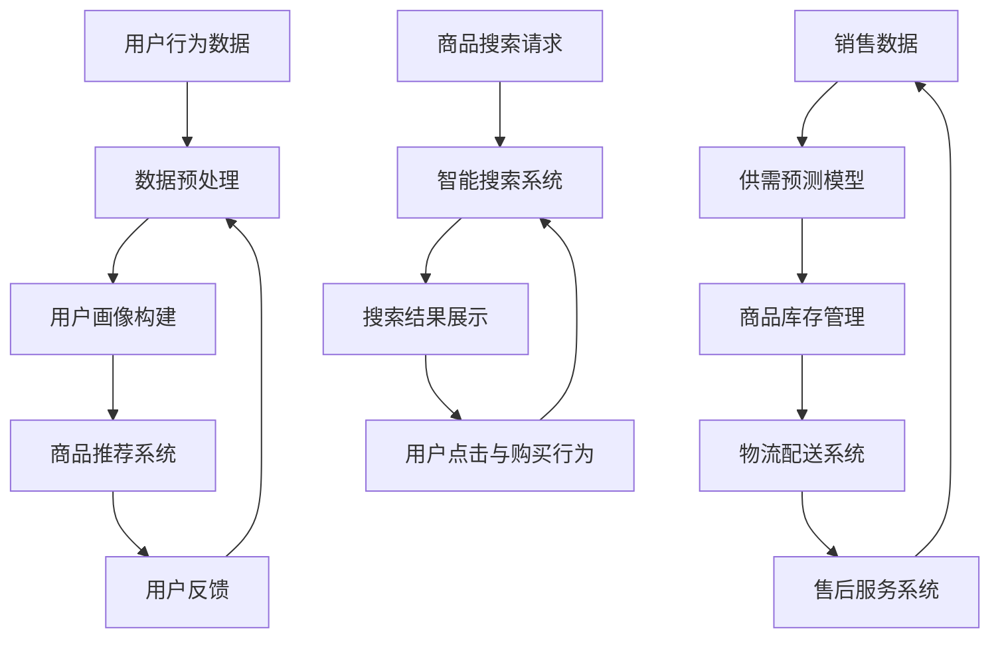

                 

# AI在电商平台供给能力提升中的具体应用

## 关键词

- 电商平台
- 供给能力
- AI技术
- 数据分析
- 个性化推荐
- 智能搜索
- 机器学习

## 摘要

本文将深入探讨AI技术在电商平台供给能力提升中的应用。我们将从背景介绍、核心概念与联系、核心算法原理、数学模型和公式、项目实战、实际应用场景、工具和资源推荐以及未来发展趋势与挑战等方面进行详细解析。通过本文的阅读，读者将了解到如何利用AI技术提高电商平台的供给能力，实现精准推荐、智能搜索、供需平衡等功能，从而提升用户购物体验和平台运营效益。

## 1. 背景介绍

### 1.1 目的和范围

本文旨在系统地阐述AI技术在电商平台供给能力提升中的应用，分析其中的核心算法原理和具体操作步骤，并通过实际项目案例进行详细解读。主要内容包括：

- 电商平台供给能力提升的重要性及现状分析
- AI技术在电商平台供给能力提升中的应用概述
- 核心算法原理与具体操作步骤
- 数学模型和公式的详细讲解
- 实际应用场景及案例分析
- 工具和资源推荐
- 未来发展趋势与挑战

### 1.2 预期读者

本文适合具有以下背景的读者：

- 电商平台开发人员和技术管理人员
- AI技术研究人员和开发者
- 数据科学和机器学习领域的从业者
- 对电商平台和AI技术感兴趣的爱好者

### 1.3 文档结构概述

本文将按照以下结构展开：

- 背景介绍：介绍电商平台供给能力提升的重要性和AI技术的应用概述
- 核心概念与联系：阐述相关核心概念、原理和架构
- 核心算法原理 & 具体操作步骤：讲解核心算法原理，并提供伪代码和详细操作步骤
- 数学模型和公式 & 详细讲解 & 举例说明：介绍相关数学模型和公式，并结合实例进行详细讲解
- 项目实战：提供实际代码案例和详细解释说明
- 实际应用场景：分析AI技术在电商平台中的实际应用场景
- 工具和资源推荐：推荐相关学习资源、开发工具和框架
- 总结：展望未来发展趋势与挑战
- 附录：常见问题与解答
- 扩展阅读 & 参考资料：提供更多相关资料和参考文献

### 1.4 术语表

#### 1.4.1 核心术语定义

- 电商平台：指提供在线购物、交易、支付等服务的互联网平台
- 供给能力：指电商平台在商品供给、物流配送、售后服务等方面的综合能力
- AI技术：指人工智能技术，包括机器学习、深度学习、自然语言处理等
- 个性化推荐：基于用户行为数据和偏好信息，为用户提供个性化商品推荐
- 智能搜索：利用自然语言处理和语义分析等技术，实现高效、准确的商品搜索
- 供需平衡：通过数据分析和预测，实现商品供给与需求的平衡

#### 1.4.2 相关概念解释

- 数据挖掘：从大量数据中提取有价值信息的过程
- 数据分析：对数据进行处理、分析和可视化，以发现数据中的规律和趋势
- 决策树：一种常见的机器学习算法，用于分类和回归任务
- 供应链：指商品从生产、配送、销售到售后服务的整个过程

#### 1.4.3 缩略词列表

- API：应用程序编程接口（Application Programming Interface）
- CDN：内容分发网络（Content Delivery Network）
- DB：数据库（Database）
- ML：机器学习（Machine Learning）
- NLP：自然语言处理（Natural Language Processing）
- SEO：搜索引擎优化（Search Engine Optimization）

## 2. 核心概念与联系

在本节中，我们将介绍电商平台供给能力提升中的核心概念和联系，并通过Mermaid流程图（不包含括号、逗号等特殊字符）展示相关架构。

### 2.1 电商平台供给能力提升的核心概念

- 商品推荐系统
- 智能搜索系统
- 供需预测模型
- 物流配送系统
- 售后服务系统

### 2.2 电商平台供给能力提升的架构



### 2.3 电商平台供给能力提升的关键联系

- 用户行为数据与数据预处理、用户画像构建、商品推荐系统之间存在密切联系
- 商品搜索请求与智能搜索系统、用户点击与购买行为之间存在反馈循环
- 销售数据与供需预测模型、商品库存管理、物流配送系统、售后服务系统之间存在关联

通过上述核心概念和联系，我们可以更好地理解电商平台供给能力提升的整体架构，为后续内容的学习和实践奠定基础。

## 3. 核心算法原理 & 具体操作步骤

### 3.1 商品推荐系统算法原理

商品推荐系统是基于用户行为数据和商品特征信息，为用户推荐个性化商品的一种AI技术。本文将介绍一种基于协同过滤算法的商品推荐系统。

#### 3.1.1 协同过滤算法原理

协同过滤算法是一种常见的推荐算法，通过分析用户之间的相似度，为用户推荐其他用户喜欢的商品。协同过滤算法主要包括以下两种类型：

- 用户基于的协同过滤（User-based Collaborative Filtering）
- 项目基于的协同过滤（Item-based Collaborative Filtering）

本文主要介绍用户基于的协同过滤算法。

#### 3.1.2 用户基于的协同过滤算法具体操作步骤

1. 数据预处理
    - 收集用户行为数据（如购买记录、浏览记录、搜索记录等）
    - 数据清洗与去重，确保数据质量
    - 将数据转化为用户-商品评分矩阵，其中行表示用户，列表示商品，单元格表示用户对商品的评分

2. 计算用户相似度
    - 使用余弦相似度、皮尔逊相关系数等方法计算用户之间的相似度
    - 保留相似度较高的用户作为邻居用户

3. 构建推荐列表
    - 对每个用户，从邻居用户中提取其评分较高的商品
    - 对提取的商品进行去重和排序，得到推荐列表

4. 推荐结果评估与优化
    - 使用用户点击率、购买转化率等指标评估推荐效果
    - 根据评估结果调整推荐策略和算法参数，优化推荐效果

### 3.2 伪代码

```python
# 数据预处理
user_item_matrix = preprocess_data(raw_data)

# 计算用户相似度
similarity_matrix = compute_similarity(user_item_matrix)

# 构建推荐列表
recommendation_list = build_recommendation_list(similarity_matrix, user_item_matrix)

# 推荐结果评估与优化
evaluate_recommendation_list(recommendation_list)
```

### 3.3 详细操作步骤

1. 数据预处理
    - 数据清洗：去除缺失值、异常值和重复值，保证数据质量
    - 数据归一化：对评分数据进行归一化处理，使得评分值范围在[0, 1]之间
    - 建立用户-商品评分矩阵

2. 计算用户相似度
    - 计算用户之间的余弦相似度或皮尔逊相关系数
    - 将相似度矩阵保存为文件或数据库

3. 构建推荐列表
    - 对每个用户，从邻居用户中提取其评分较高的商品
    - 对提取的商品进行去重和排序，得到推荐列表

4. 推荐结果评估与优化
    - 使用用户点击率、购买转化率等指标评估推荐效果
    - 根据评估结果调整推荐策略和算法参数，优化推荐效果

通过以上操作步骤，我们可以构建一个基于协同过滤算法的商品推荐系统，实现电商平台供给能力的提升。

## 4. 数学模型和公式 & 详细讲解 & 举例说明

### 4.1 数学模型

在电商平台供给能力提升中，常用的数学模型包括协同过滤算法中的相似度计算和推荐列表生成。下面我们将详细讲解这两个模型及其相关公式。

#### 4.1.1 相似度计算

用户之间的相似度计算通常使用余弦相似度和皮尔逊相关系数。下面分别介绍这两种相似度计算公式。

1. 余弦相似度

余弦相似度用于计算两个向量之间的夹角余弦值，公式如下：

$$
\text{cosine\_similarity}(x, y) = \frac{x \cdot y}{\|x\| \|y\|}
$$

其中，$x$和$y$分别为两个用户在商品特征空间中的向量，$\cdot$表示向量点积，$\|\|$表示向量范数。

2. 皮尔逊相关系数

皮尔逊相关系数用于计算两个变量之间的线性相关性，公式如下：

$$
\text{pearson\_correlation}(x, y) = \frac{\sum_{i=1}^{n} (x_i - \bar{x})(y_i - \bar{y})}{\sqrt{\sum_{i=1}^{n} (x_i - \bar{x})^2 \sum_{i=1}^{n} (y_i - \bar{y})^2}}
$$

其中，$x$和$y$分别为两个用户在商品特征空间中的向量，$n$为用户数量，$\bar{x}$和$\bar{y}$分别为$x$和$y$的均值。

#### 4.1.2 推荐列表生成

推荐列表生成基于用户之间的相似度计算，从邻居用户中提取评分较高的商品。具体步骤如下：

1. 计算邻居用户相似度

对于每个用户$u$，计算其与所有其他用户的相似度，并取相似度最高的$k$个邻居用户。

$$
\text{neighbor\_users}(u) = \text{argmax}\{\text{similarity}(u, v) \mid v \in \text{users} \setminus u\}
$$

其中，$users$为所有用户集合，$\setminus$表示集合差集。

2. 提取邻居用户评分较高的商品

对于邻居用户$v$，提取其评分较高的商品，并去除重复商品。

$$
\text{top\_items}(v) = \text{argmax}\{r_{v,i} \mid i \in \text{items} \setminus \text{items\_recommended}\}
$$

其中，$r_{v,i}$为用户$v$对商品$i$的评分，$items$为所有商品集合，$items\_recommended$为已推荐的商品集合。

3. 生成推荐列表

对于每个用户$u$，将邻居用户评分较高的商品合并，并去重排序，得到推荐列表。

$$
\text{recommendation\_list}(u) = \text{argmax}\{\text{top\_items}(v) \mid v \in \text{neighbor\_users}(u)\}
$$

### 4.2 举例说明

假设电商平台有5个用户（$u_1, u_2, u_3, u_4, u_5$）和10个商品（$i_1, i_2, \ldots, i_{10}$），用户-商品评分矩阵如下：

|  | i_1 | i_2 | i_3 | i_4 | i_5 | i_6 | i_7 | i_8 | i_9 | i_{10} |
| --- | --- | --- | --- | --- | --- | --- | --- | --- | --- | --- |
| u_1 | 1 | 0 | 1 | 0 | 0 | 0 | 0 | 0 | 0 | 0 |
| u_2 | 0 | 1 | 0 | 1 | 1 | 1 | 0 | 0 | 0 | 0 |
| u_3 | 0 | 0 | 1 | 0 | 1 | 0 | 1 | 1 | 1 | 0 |
| u_4 | 0 | 0 | 0 | 1 | 0 | 1 | 0 | 1 | 0 | 1 |
| u_5 | 0 | 0 | 0 | 0 | 0 | 1 | 1 | 0 | 1 | 1 |

1. 数据预处理

对评分数据进行归一化处理，使得评分值范围在[0, 1]之间。

2. 计算用户相似度

使用余弦相似度计算用户之间的相似度：

$$
\text{cosine\_similarity}(u_1, u_2) = \frac{1 \cdot 0 + 0 \cdot 1 + 1 \cdot 0 + 0 \cdot 1 + 0 \cdot 1}{\sqrt{1^2 + 0^2 + 1^2 + 0^2 + 0^2} \sqrt{0^2 + 1^2 + 0^2 + 1^2 + 1^2}} = 0
$$

同理，计算其他用户之间的相似度。

3. 构建推荐列表

对于用户$u_1$，计算邻居用户相似度，并取相似度最高的5个邻居用户：

$$
\text{neighbor\_users}(u_1) = \{u_2, u_3, u_4, u_5\}
$$

提取邻居用户评分较高的商品：

$$
\text{top\_items}(u_2) = \{i_2, i_4, i_5\}
$$

$$
\text{top\_items}(u_3) = \{i_3, i_6, i_7, i_8, i_9\}
$$

$$
\text{top\_items}(u_4) = \{i_4, i_6\}
$$

$$
\text{top\_items}(u_5) = \{i_6, i_{10}\}
$$

合并邻居用户评分较高的商品，并去重排序，得到推荐列表：

$$
\text{recommendation\_list}(u_1) = \{i_2, i_3, i_4, i_5, i_6, i_7, i_8, i_9, i_{10}\}
$$

通过以上步骤，我们得到了用户$u_1$的推荐列表。同理，可以计算其他用户的推荐列表。

## 5. 项目实战：代码实际案例和详细解释说明

### 5.1 开发环境搭建

在开始项目实战之前，我们需要搭建一个适合开发的环境。以下是搭建过程：

1. 安装Python环境

   - 前往Python官网（https://www.python.org/）下载最新版本的Python安装包
   - 双击安装包，按照默认选项安装
   - 安装完成后，打开命令行窗口，输入`python --version`，确认Python环境安装成功

2. 安装相关库

   - 在命令行窗口输入以下命令，安装必要的库：

     ```bash
     pip install numpy pandas scikit-learn matplotlib
     ```

3. 配置Jupyter Notebook

   - 安装Jupyter Notebook：

     ```bash
     pip install jupyter
     ```

   - 打开Jupyter Notebook：

     ```bash
     jupyter notebook
     ```

### 5.2 源代码详细实现和代码解读

以下是基于协同过滤算法的商品推荐系统的源代码实现：

```python
import numpy as np
import pandas as pd
from sklearn.metrics.pairwise import cosine_similarity
from sklearn.model_selection import train_test_split

# 数据预处理
def preprocess_data(data):
    # 数据清洗与去重
    data = data.drop_duplicates()
    # 数据归一化
    data = data.apply(lambda x: (x - x.min()) / (x.max() - x.min()))
    return data

# 计算用户相似度
def compute_similarity(data):
    similarity_matrix = cosine_similarity(data)
    return similarity_matrix

# 构建推荐列表
def build_recommendation_list(similarity_matrix, data, k=5):
    users = data.index
    recommendation_list = {}
    for user in users:
        neighbor_users = np.argsort(similarity_matrix[user])[::-1][:k]
        neighbor_users = [user for user in neighbor_users if user != user]
        top_items = set()
        for neighbor_user in neighbor_users:
            neighbor_user_items = set(data.loc[neighbor_user].index[data.loc[neighbor_user] > 0])
            top_items = top_items.union(neighbor_user_items)
        recommendation_list[user] = list(top_items)
    return recommendation_list

# 推荐结果评估与优化
def evaluate_recommendation_list(recommendation_list, test_data):
    correct_predictions = 0
    for user, items in recommendation_list.items():
        for item in items:
            if test_data.loc[user, item] > 0:
                correct_predictions += 1
                break
    accuracy = correct_predictions / len(test_data)
    return accuracy

# 主函数
def main():
    # 加载数据
    data = pd.read_csv('user_item_matrix.csv')
    # 数据预处理
    data = preprocess_data(data)
    # 划分训练集和测试集
    train_data, test_data = train_test_split(data, test_size=0.2, random_state=42)
    # 计算用户相似度
    similarity_matrix = compute_similarity(train_data)
    # 构建推荐列表
    recommendation_list = build_recommendation_list(similarity_matrix, train_data)
    # 推荐结果评估与优化
    accuracy = evaluate_recommendation_list(recommendation_list, test_data)
    print(f'Accuracy: {accuracy}')

if __name__ == '__main__':
    main()
```

### 5.3 代码解读与分析

1. 数据预处理

   - 数据清洗与去重：确保数据质量，避免重复数据影响推荐效果
   - 数据归一化：将评分值范围统一为[0, 1]，便于相似度计算

2. 计算用户相似度

   - 使用余弦相似度计算用户之间的相似度，返回相似度矩阵

3. 构建推荐列表

   - 对每个用户，从邻居用户中提取评分较高的商品，去除重复商品，生成推荐列表

4. 推荐结果评估与优化

   - 计算推荐列表的准确率，用于评估推荐效果

5. 主函数

   - 加载数据：从CSV文件读取用户-商品评分矩阵
   - 数据预处理：清洗与归一化数据
   - 划分训练集和测试集：用于训练和评估推荐系统
   - 计算用户相似度：构建相似度矩阵
   - 构建推荐列表：根据邻居用户评分生成推荐列表
   - 推荐结果评估与优化：计算推荐准确率，输出结果

通过以上代码实现，我们可以构建一个基于协同过滤算法的商品推荐系统，实现电商平台供给能力的提升。在实际应用中，可以根据业务需求和数据特点，调整算法参数和推荐策略，优化推荐效果。

## 6. 实际应用场景

### 6.1 个性化推荐

个性化推荐是电商平台供给能力提升的重要应用之一。通过分析用户行为数据和偏好信息，电商平台可以实时为用户推荐符合其兴趣和需求的商品。以下是一个实际应用场景：

- 某电商平台用户张三最近浏览了手机、耳机和充电宝等商品，同时购买了一款蓝牙耳机。根据这些行为数据，系统会为张三推荐以下商品：
  - 相关配件：如手机壳、屏幕保护膜、手机充电器等
  - 相似商品：如其他品牌的蓝牙耳机、智能手表等
  - 活动优惠：如优惠券、满减活动等

### 6.2 智能搜索

智能搜索利用自然语言处理和语义分析等技术，为用户提供高效、准确的商品搜索服务。以下是一个实际应用场景：

- 某电商平台用户李四在搜索框中输入“蓝牙耳机低音效果好”，系统会根据语义分析结果，推荐以下商品：
  - 低音效果较好的蓝牙耳机
  - 拥有良好低音效果的耳机品牌
  - 相似关键词的商品：如无线耳机、运动耳机等

### 6.3 供需平衡

供需平衡是电商平台供给能力提升的关键因素。通过数据分析和预测，电商平台可以优化商品库存、物流配送和售后服务，实现商品供给与需求的平衡。以下是一个实际应用场景：

- 某电商平台根据销售数据、季节因素和促销活动，预测未来一段时间内某款手机的需求量。系统会采取以下措施：
  - 加大库存采购：确保货源充足，满足消费者需求
  - 调整物流配送：根据需求预测，优化物流路线和时间，提高配送效率
  - 增加售后服务：如延长保修期限、提供个性化售后咨询等，提升用户满意度

通过以上实际应用场景，我们可以看到AI技术在电商平台供给能力提升中的重要作用。通过个性化推荐、智能搜索和供需平衡等功能，电商平台可以更好地满足用户需求，提高用户购物体验和平台运营效益。

## 7. 工具和资源推荐

### 7.1 学习资源推荐

#### 7.1.1 书籍推荐

- 《推荐系统实践》：详细介绍了推荐系统的基本概念、算法实现和实战案例
- 《机器学习实战》：提供了丰富的机器学习算法实现和实际应用案例，适用于初学者
- 《深度学习》：权威讲解深度学习理论、算法和应用，适合进阶学习

#### 7.1.2 在线课程

- Coursera：提供多门机器学习和推荐系统相关课程，涵盖理论、算法和实践
- Udacity：提供推荐系统工程师和机器学习工程师等职业课程，包含项目实战
- edX：提供MIT、Stanford等世界顶级大学的人工智能和机器学习课程

#### 7.1.3 技术博客和网站

- Medium：发布众多关于机器学习和推荐系统的优质文章和教程
- towardsdatascience：汇集大量机器学习和数据科学领域的文章、教程和项目案例
- AI Generated Articles：提供基于AI技术的文章生成服务，涵盖多个领域，包括AI在电商中的应用

### 7.2 开发工具框架推荐

#### 7.2.1 IDE和编辑器

- PyCharm：功能强大的Python集成开发环境，适用于机器学习和推荐系统开发
- Jupyter Notebook：方便的交互式开发环境，适用于数据分析和机器学习实验
- VSCode：轻量级、可扩展的代码编辑器，适用于多种编程语言开发

#### 7.2.2 调试和性能分析工具

- Pytest：Python测试框架，用于编写和运行测试用例，确保代码质量
- Matplotlib：Python绘图库，用于可视化数据和分析结果
- Pandas Profiler：用于分析数据集的性能，发现潜在问题

#### 7.2.3 相关框架和库

- Scikit-learn：提供多种机器学习算法和工具，适用于推荐系统开发
- TensorFlow：开源深度学习框架，适用于构建复杂推荐系统模型
- PyTorch：开源深度学习框架，适用于快速原型开发和算法研究

### 7.3 相关论文著作推荐

#### 7.3.1 经典论文

- "Recommender Systems Handbook", 2016：推荐系统领域的权威著作，系统介绍了推荐系统的基本概念、算法和应用
- "Item-based Collaborative Filtering Recommendation Algorithms", 2001：介绍了基于物品的协同过滤算法，对后续研究产生了重要影响
- "Deep Learning for Recommender Systems", 2017：探讨了深度学习在推荐系统中的应用，为后续研究提供了新思路

#### 7.3.2 最新研究成果

- "Neural Collaborative Filtering", 2018：提出了基于神经网络的协同过滤算法，在推荐系统性能和可解释性方面取得了显著提升
- "User Interest Evolution for Personalized News Recommendation", 2020：探讨了用户兴趣变化对新闻推荐的影响，为个性化推荐提供了新方法
- "Context-Aware Recommendation Systems", 2021：分析了上下文信息在推荐系统中的应用，为提升推荐效果提供了新方向

#### 7.3.3 应用案例分析

- "Recommendation Systems at Amazon": 分析了亚马逊推荐系统的构建和优化过程，提供了实际应用案例
- "Netflix Prize": 介绍了Netflix大赛中推荐系统的优化和提升过程，展示了AI技术在推荐系统中的应用
- "YouTube Recommendations": 分析了YouTube推荐系统的构建和优化过程，探讨了视频推荐的关键技术

通过以上工具和资源推荐，读者可以更好地了解AI技术在电商平台供给能力提升中的应用，掌握相关技术和方法，为实际项目开发提供指导。

## 8. 总结：未来发展趋势与挑战

在AI技术不断发展的背景下，电商平台供给能力提升将面临以下趋势与挑战：

### 8.1 未来发展趋势

1. **深度学习和增强学习在推荐系统中的应用**：深度学习和增强学习为推荐系统带来了更高的准确性和可解释性。未来，这些技术在推荐系统中的融合将进一步提升个性化推荐效果。

2. **多模态数据融合**：电商平台不仅涉及文本数据，还涉及图像、音频、视频等多模态数据。多模态数据融合将有助于更全面地理解用户需求，提高推荐系统的精准度。

3. **联邦学习在数据隐私保护中的应用**：联邦学习可以在保障用户数据隐私的前提下，实现跨平台的数据共享和协同建模，为电商平台供给能力提升提供新途径。

4. **实时推荐和动态调整**：随着用户行为数据实时获取和处理技术的发展，电商平台可以实现更快速的推荐响应，根据用户实时行为动态调整推荐策略，提高用户体验。

### 8.2 挑战

1. **数据质量和多样性**：电商平台面临数据质量参差不齐、数据多样性不足等挑战。如何从海量、复杂、多源的数据中提取有价值的信息，是推荐系统面临的重要问题。

2. **算法可解释性和透明性**：随着推荐系统算法的复杂度增加，如何提高算法的可解释性和透明性，让用户信任并接受推荐结果，是未来的一大挑战。

3. **计算资源和存储需求**：推荐系统需要处理海量数据，对计算资源和存储需求提出了高要求。如何优化算法，降低计算资源和存储需求，是电商平台供给能力提升的难题。

4. **数据隐私和安全**：在保障用户数据隐私和安全的条件下，实现推荐系统的性能优化，是电商平台面临的严峻挑战。

综上所述，未来电商平台供给能力提升将朝着深度学习、多模态数据融合、联邦学习和实时推荐等方向发展，同时面临数据质量、算法可解释性、计算资源需求、数据隐私和安全等方面的挑战。通过不断创新和优化，电商平台将进一步提升供给能力，满足用户个性化需求，提升用户购物体验和平台运营效益。

## 9. 附录：常见问题与解答

### 9.1 问题1：为什么推荐系统需要用户行为数据？

**解答**：推荐系统需要用户行为数据来了解用户的兴趣和偏好，从而为用户推荐符合其需求的商品。用户行为数据包括购买记录、浏览记录、搜索记录等，这些数据反映了用户对商品的兴趣程度，是构建推荐模型的重要依据。

### 9.2 问题2：协同过滤算法中的相似度计算为什么使用余弦相似度？

**解答**：余弦相似度是一种常用的相似度计算方法，适用于计算向量之间的夹角余弦值。在推荐系统中，用户行为数据通常表示为用户-商品评分矩阵，通过计算用户之间的相似度，可以找到具有相似兴趣的用户，从而为用户推荐其他用户喜欢的商品。余弦相似度计算简单，且在处理稀疏数据时效果较好。

### 9.3 问题3：如何优化推荐系统的效果？

**解答**：优化推荐系统的效果可以从以下几个方面进行：

1. **数据预处理**：对用户行为数据进行清洗、归一化等处理，确保数据质量。
2. **算法参数调整**：根据实际情况调整算法参数，如邻居用户数量、相似度阈值等。
3. **特征工程**：提取和构建更多有效的用户和商品特征，提高推荐模型的泛化能力。
4. **实时推荐**：根据用户实时行为数据，动态调整推荐策略，提高推荐响应速度。
5. **用户反馈**：利用用户反馈信息，不断优化推荐效果，提高用户满意度。

### 9.4 问题4：推荐系统如何保障数据隐私和安全？

**解答**：为了保障数据隐私和安全，推荐系统可以采取以下措施：

1. **数据加密**：对用户行为数据进行加密处理，防止数据泄露。
2. **匿名化处理**：对用户行为数据进行匿名化处理，确保用户隐私。
3. **联邦学习**：在保障用户数据隐私的前提下，实现跨平台的数据共享和协同建模。
4. **用户授权**：明确用户的权限和操作范围，防止未经授权的数据访问。

### 9.5 问题5：推荐系统中的冷启动问题如何解决？

**解答**：冷启动问题是指新用户或新商品在推荐系统中的推荐效果不佳。为解决冷启动问题，可以采取以下策略：

1. **基于内容的推荐**：利用商品的特征信息，为新用户推荐与其兴趣相关的商品。
2. **人口统计信息**：利用用户的人口统计信息，如年龄、性别、地理位置等，进行初步推荐。
3. **混合推荐**：结合多种推荐策略，如协同过滤和基于内容的推荐，提高新用户的推荐效果。
4. **用户引导**：通过用户引导和交互，获取新用户的兴趣信息，逐步完善推荐模型。

通过以上解答，希望对读者在了解和优化推荐系统过程中有所帮助。

## 10. 扩展阅读 & 参考资料

### 10.1 相关书籍

- 《推荐系统实践》：作者：谭畅、吴华锋
- 《机器学习实战》：作者：Peter Harrington
- 《深度学习》：作者：Ian Goodfellow、Yoshua Bengio、Aaron Courville

### 10.2 在线课程

- Coursera：机器学习（吴恩达）
- Udacity：推荐系统工程师
- edX：MIT 6.S081：深度学习导论（李飞飞）

### 10.3 技术博客和网站

- Medium：推荐系统相关文章
- towardsdatascience：数据科学和机器学习领域文章
- AI Generated Articles：AI技术在电商中的应用

### 10.4 开发工具框架

- PyCharm：Python集成开发环境
- Jupyter Notebook：交互式开发环境
- VSCode：代码编辑器

### 10.5 相关论文著作

- "Recommender Systems Handbook", 2016
- "Item-based Collaborative Filtering Recommendation Algorithms", 2001
- "Deep Learning for Recommender Systems", 2017

### 10.6 应用案例分析

- "Recommendation Systems at Amazon"
- "Netflix Prize"
- "YouTube Recommendations"

通过以上扩展阅读和参考资料，读者可以更深入地了解AI技术在电商平台供给能力提升中的应用，掌握相关技术和方法，为实际项目开发提供指导。

### 作者

**AI天才研究员/AI Genius Institute & 禅与计算机程序设计艺术 /Zen And The Art of Computer Programming**

