                 

### 背景介绍

#### 1.1 目的和范围

本文旨在探讨人工智能（AI）在电商物流路径优化中的应用，特别是如何通过智能算法降低配送成本。随着电子商务的快速发展，物流配送成为了电商企业的重要环节，如何高效、低成本的完成配送成为了企业关注的焦点。AI技术的引入，为物流路径优化提供了新的思路和解决方案。

本文将首先介绍电商物流的基本概念和现有问题，然后详细探讨AI在物流路径优化中的核心算法原理，并使用伪代码进行具体操作步骤的讲解。接下来，我们将介绍物流路径优化的数学模型和公式，并通过实际项目案例进行详细解释说明。文章还将探讨AI在电商物流中的应用场景，推荐相关工具和资源，最后总结未来发展趋势与挑战。

#### 1.2 预期读者

本文主要面向对电商物流和人工智能感兴趣的IT从业者、研究人员和学生。对于有一定编程基础和技术背景的读者，本文将帮助其深入了解AI在物流路径优化中的应用，并掌握相关的算法原理和实践技巧。而对于完全没有接触过相关领域的读者，本文将尽量使用通俗易懂的语言进行讲解，以便其能够快速上手。

#### 1.3 文档结构概述

本文分为八个部分：

1. 背景介绍：介绍本文的目的、预期读者和文档结构。
2. 核心概念与联系：介绍电商物流和AI的基本概念，并提供Mermaid流程图。
3. 核心算法原理 & 具体操作步骤：详细讲解物流路径优化的核心算法原理和具体操作步骤。
4. 数学模型和公式 & 详细讲解 & 举例说明：介绍物流路径优化的数学模型和公式，并通过实例进行详细讲解。
5. 项目实战：提供实际代码案例，并进行详细解释说明。
6. 实际应用场景：探讨AI在电商物流路径优化中的应用场景。
7. 工具和资源推荐：推荐相关学习资源和开发工具。
8. 总结：总结未来发展趋势与挑战。

#### 1.4 术语表

为了确保文章内容的清晰和准确，以下是对本文中涉及的一些核心术语进行定义和解释。

##### 1.4.1 核心术语定义

- **人工智能（AI）**：指能够模拟、延伸和扩展人类智能的计算机系统。
- **物流路径优化**：通过算法和数学模型，找到最优的物流配送路径，以降低配送成本和提高配送效率。
- **电商物流**：指电子商务活动中涉及的商品运输、配送、仓储等环节。
- **配送成本**：指物流配送过程中产生的各项费用，包括运输成本、仓储成本、人力成本等。
- **智能算法**：指基于人工智能技术的算法，能够通过学习和适应数据，提高物流路径优化的效果。

##### 1.4.2 相关概念解释

- **深度学习**：一种基于人工神经网络的学习方法，通过多层神经网络对数据进行特征提取和模式识别。
- **强化学习**：一种通过试错法学习和优化决策过程的机器学习方法。
- **遗传算法**：一种模拟自然选择和遗传机制的优化算法，通过种群演化寻找最优解。
- **贪心算法**：一种通过局部最优决策逐步逼近全局最优解的算法。

##### 1.4.3 缩略词列表

- **AI**：人工智能
- **ML**：机器学习
- **DL**：深度学习
- **RL**：强化学习
- **GA**：遗传算法
- **GAAP**：通用会计准则
- **ERP**：企业资源计划
- **SCM**：供应链管理
- **OM**：运营管理
- **TSP**：旅行商问题

#### 1.5 文章结构概述

本文将从电商物流和AI的基本概念入手，逐步深入探讨AI在物流路径优化中的应用。首先，我们将介绍电商物流的现状和存在的问题，以及AI如何解决这些问题。接着，本文将详细讲解物流路径优化的核心算法原理，并通过伪代码展示具体操作步骤。随后，我们将介绍物流路径优化的数学模型和公式，并通过实例进行详细讲解。文章还将提供实际项目案例，帮助读者更好地理解算法的实际应用。最后，本文将总结AI在电商物流路径优化中的实际应用场景，并推荐相关工具和资源，以便读者进一步学习和实践。

## 2. 核心概念与联系

在探讨AI在电商物流路径优化中的应用之前，我们首先需要了解电商物流和AI的基本概念，以及它们之间的联系。以下是对相关概念的定义和解释，并提供一个Mermaid流程图，以帮助读者更好地理解这些概念之间的关联。

### 2.1 电商物流概念

电商物流是指电子商务活动中的商品运输、配送、仓储等环节。其核心目的是通过高效、低成本的物流服务，满足消费者的购物需求，提高电商企业的竞争力。电商物流主要包括以下几个关键环节：

1. **仓储管理**：指对商品存储、库存管理、商品拣选等环节进行优化，提高仓储效率。
2. **运输管理**：指通过运输工具和运输方式，将商品从仓库运输到消费者手中。
3. **配送管理**：指根据消费者需求，将商品从仓库或运输工具配送至消费者指定的地点。
4. **订单管理**：指对消费者订单进行跟踪、处理和反馈，确保订单的及时、准确完成。

### 2.2 AI概念

人工智能（AI）是指能够模拟、延伸和扩展人类智能的计算机系统。AI技术主要包括以下几个方向：

1. **机器学习（ML）**：指通过数据驱动的方法，使计算机系统自动学习和优化决策过程。
2. **深度学习（DL）**：一种基于人工神经网络的学习方法，通过多层神经网络对数据进行特征提取和模式识别。
3. **强化学习（RL）**：一种通过试错法学习和优化决策过程的机器学习方法。
4. **自然语言处理（NLP）**：指使计算机理解和生成自然语言的技术。
5. **计算机视觉（CV）**：指使计算机理解和解析图像、视频等视觉信息的技术。

### 2.3 Mermaid流程图

以下是一个Mermaid流程图，展示了电商物流和AI之间的重要联系。

```mermaid
graph TB
A[电商物流] --> B[仓储管理]
A --> C[运输管理]
A --> D[配送管理]
A --> E[订单管理]
B --> F[库存管理]
B --> G[商品拣选]
C --> H[运输工具]
C --> I[运输方式]
D --> J[配送路径]
D --> K[配送时效]
E --> L[订单跟踪]
E --> M[订单处理]
E --> N[订单反馈]
F --> O[数据采集]
G --> P[数据挖掘]
H --> Q[自动化设备]
I --> R[智能调度]
J --> S[优化算法]
K --> T[预测分析]
L --> U[自动化系统]
M --> V[自动化处理]
N --> W[智能反馈]
O --> X[数据预处理]
P --> Y[特征工程]
Q --> Z[优化策略]
R --> AA[路径规划]
S --> BB[目标函数]
T --> CC[预测模型]
U --> DD[智能配送]
V --> EE[自动化订单]
W --> FF[智能反馈机制]
X --> GG[数据清洗]
Y --> HH[数据标准化]
Z --> II[算法优化]
AA --> JJ[智能物流系统]
BB --> KK[成本函数]
CC --> LL[配送时效模型]
DD --> MM[配送效率]
EE --> NN[订单效率]
FF --> GG[系统稳定性]
GG --> HH[数据质量]
HH --> II[算法稳定性]
JJ --> KK[物流优化效果]
KK --> LL[配送成本]
MM --> NN[配送时效]
NN --> OO[客户满意度]
OO --> PP[电商竞争力]
PP --> QQ[市场占有率]
```



通过上述流程图，我们可以清晰地看到电商物流和AI技术之间的紧密联系。AI技术在仓储管理、运输管理、配送管理和订单管理等多个环节中发挥了重要作用，助力电商企业实现物流路径优化，降低配送成本，提高配送效率，从而提升电商竞争力。

## 3. 核心算法原理 & 具体操作步骤

在了解了电商物流和AI的基本概念之后，我们将深入探讨物流路径优化的核心算法原理，并通过具体的操作步骤，展示如何利用这些算法实现路径优化。本文将重点介绍以下三种算法：贪心算法、遗传算法和深度学习算法。

### 3.1 贪心算法

贪心算法是一种通过局部最优决策逐步逼近全局最优解的算法。在物流路径优化中，贪心算法可以通过每次选择当前最优路径来逐步优化整体路径。

**算法原理：**

1. **初始化**：选择起点作为当前路径。
2. **选择路径**：从当前路径出发，选择距离最短或成本最低的下一个节点作为当前节点。
3. **重复选择**：重复步骤2，直到目标节点被选中。
4. **路径优化**：在路径选择过程中，根据实际情况对路径进行调整，以实现最优路径。

**具体操作步骤：**

```python
# 初始化贪心算法
current_path = [start_node]
visited_nodes = set()

# 选择路径
while not is_end_node(current_path[-1]):
    next_node = choose_best_next_node(current_path[-1], visited_nodes)
    current_path.append(next_node)
    visited_nodes.add(next_node)

# 路径优化
if need_optimization(current_path):
    optimize_path(current_path)

# 输出最优路径
print("最优路径：", current_path)
```

### 3.2 遗传算法

遗传算法是一种模拟自然选择和遗传机制的优化算法，通过种群演化寻找最优解。在物流路径优化中，遗传算法可以模拟生物进化过程，逐步优化路径。

**算法原理：**

1. **初始化**：生成初始种群，每个个体代表一种可能的路径。
2. **适应度评估**：计算每个个体的适应度值，适应度值越高，代表该路径越优。
3. **选择**：根据适应度值选择个体进行交叉和变异操作。
4. **交叉**：将两个个体进行交叉操作，生成新的个体。
5. **变异**：对个体进行变异操作，以产生新的变异个体。
6. **更新种群**：将交叉和变异后的个体替换原有种群。
7. **迭代**：重复步骤3至6，直到满足终止条件。

**具体操作步骤：**

```python
# 初始化遗传算法
population = initialize_population()
visited_nodes = set()

# 适应度评估
evaluate_fitness(population)

# 选择
selected_individuals = selection(population)

# 交叉
crossover_individuals = crossover(selected_individuals)

# 变异
mutated_individuals = mutation(crossover_individuals)

# 更新种群
population = mutated_individuals

# 迭代
if not is_termination_condition_met():
    iterate(population, visited_nodes)
else:
    print("最优路径：", best_individual_path)
```

### 3.3 深度学习算法

深度学习算法是一种基于人工神经网络的学习方法，通过多层神经网络对数据进行特征提取和模式识别。在物流路径优化中，深度学习算法可以通过学习历史数据，预测最优路径。

**算法原理：**

1. **数据预处理**：对输入数据进行预处理，包括数据清洗、归一化和特征提取等。
2. **模型构建**：构建深度学习模型，包括输入层、隐藏层和输出层。
3. **训练模型**：使用历史数据训练模型，通过反向传播算法优化模型参数。
4. **预测路径**：使用训练好的模型，对新的输入数据进行路径预测。

**具体操作步骤：**

```python
# 数据预处理
X_train, y_train = preprocess_data(train_data)

# 构建模型
model = build_model()

# 训练模型
model.fit(X_train, y_train)

# 预测路径
predicted_path = model.predict(new_data)

# 输出最优路径
print("最优路径：", predicted_path)
```

通过以上三种算法，我们可以实现物流路径的优化。在实际应用中，可以根据具体情况选择合适的算法，或结合多种算法，以实现最佳优化效果。

## 4. 数学模型和公式 & 详细讲解 & 举例说明

在物流路径优化中，数学模型和公式起着至关重要的作用。这些模型和公式可以帮助我们量化问题，优化路径，降低配送成本。以下将介绍物流路径优化中常用的数学模型和公式，并通过具体实例进行详细讲解。

### 4.1 旅行商问题（TSP）

旅行商问题（TSP）是物流路径优化中的一个经典问题，其目标是在给定的图中，找到一个最短的路径，使旅行商能够访问每个城市一次并返回起点。TSP在物流路径优化中有着广泛的应用。

**公式：**

设 \(G=(V, E)\) 为一个无向图，其中 \(V\) 为城市集合，\(E\) 为边集合。\(d(u, v)\) 表示城市 \(u\) 和城市 \(v\) 之间的距离。TSP的目标是找到一个闭合路径 \(P = (u_1, u_2, ..., u_n, u_1)\)，使得路径总长度最小。

\[ \min \sum_{i=1}^{n} d(u_i, u_{i+1}) \]

**实例：**

假设有4个城市 A、B、C、D，它们之间的距离如下表所示：

|   | A | B | C | D |
|---|---|---|---|---|
| A | 0 | 5 | 8 | 10|
| B | 5 | 0 | 10| 15|
| C | 8 | 10| 0 | 6 |
| D | 10| 15| 6 | 0 |

根据上述公式，我们需要找到一个闭合路径，使得总距离最小。

**解法：**

通过穷举法，我们可以找到以下最优路径：

\[ A \rightarrow B \rightarrow C \rightarrow D \rightarrow A \]

路径总长度为：

\[ 5 + 10 + 6 + 10 = 31 \]

### 4.2 最小生成树

最小生成树是一种在无向图中寻找最小权边的树形结构。在物流路径优化中，最小生成树可以帮助我们找到连接所有节点的最小成本路径。

**公式：**

设 \(G=(V, E)\) 为一个无向图，其中 \(V\) 为节点集合，\(E\) 为边集合。\(w(e)\) 表示边 \(e\) 的权重。最小生成树的目标是找到一个生成树 \(T\)，使得树中所有边的权重之和最小。

\[ \min \sum_{e \in T} w(e) \]

**实例：**

假设有5个城市 A、B、C、D、E，它们之间的距离如下表所示：

|   | A | B | C | D | E |
|---|---|---|---|---|---|
| A | 0 | 6 | 4 | 8 | 10|
| B | 6 | 0 | 3 | 5 | 9 |
| C | 4 | 3 | 0 | 2 | 7 |
| D | 8 | 5 | 2 | 0 | 4 |
| E | 10| 9 | 7 | 4 | 0 |

根据上述公式，我们需要找到一个最小生成树。

**解法：**

使用Prim算法，我们可以找到以下最小生成树：

\[ A \rightarrow B \rightarrow C \rightarrow D \rightarrow E \]

生成树中所有边的权重之和为：

\[ 6 + 3 + 2 + 4 + 7 = 22 \]

### 4.3 最小费用最大流

最小费用最大流问题是在网络流问题中，寻找一种路径，使得总流量最大且总费用最小。在物流路径优化中，最小费用最大流可以帮助我们找到配送成本最低的路径。

**公式：**

设 \(G=(V, E)\) 为一个有向图，其中 \(V\) 为节点集合，\(E\) 为边集合。\(c(e)\) 表示边 \(e\) 的费用，\(f(e)\) 表示边 \(e\) 上的流量。最小费用最大流的目标是找到一个流分配方案，使得总费用最小。

\[ \min \sum_{e \in E} c(e) \cdot f(e) \]

且满足以下条件：

1. 流量守恒：对于每个非源节点 \(v\)，流入 \(v\) 的流量等于流出 \(v\) 的流量。
2. 最大流量：源节点 \(s\) 到汇节点 \(t\) 的总流量最大。

**实例：**

假设有5个城市 A、B、C、D、E，它们之间的运输费用如下表所示：

|   | A | B | C | D | E |
|---|---|---|---|---|---|
| A | 0 | 2 | 3 | 5 | 4 |
| B | 4 | 0 | 1 | 3 | 2 |
| C | 6 | 5 | 0 | 2 | 1 |
| D | 3 | 2 | 7 | 0 | 6 |
| E | 1 | 6 | 4 | 5 | 0 |

根据上述公式，我们需要找到一个最小费用最大流。

**解法：**

使用最小费用最大流算法，我们可以找到以下最优路径：

\[ A \rightarrow B \rightarrow C \rightarrow D \rightarrow E \]

总费用为：

\[ 2 \cdot 1 + 3 \cdot 2 + 5 \cdot 1 + 4 \cdot 6 = 37 \]

通过以上实例，我们可以看到数学模型和公式在物流路径优化中的重要作用。这些模型和公式可以帮助我们量化问题，找到最优路径，从而实现物流成本的降低和效率的提高。

### 4.4 综合实例：配送中心到多个仓库的最优路径

假设有一个配送中心，需要将商品配送至多个仓库，每个仓库之间的运输成本如下表所示：

|   | 配送中心 | 仓库1 | 仓库2 | 仓库3 | 仓库4 |
|---|----------|-------|-------|-------|-------|
| 配送中心 | 0      | 4     | 7     | 9     | 10    |
| 仓库1     | 4      | 0     | 6     | 8     | 11    |
| 仓库2     | 7      | 6     | 0     | 3     | 5     |
| 仓库3     | 9      | 8     | 3     | 0     | 2     |
| 仓库4     | 10     | 11    | 5     | 2     | 0     |

我们需要找到从配送中心到各仓库的最优路径。

**解法：**

1. 使用最小生成树算法，找到连接配送中心和各仓库的最小成本路径。
2. 使用最小费用最大流算法，计算从配送中心到各仓库的最小费用最大流。

**步骤：**

1. **最小生成树：**

   使用Prim算法，我们可以找到以下最小生成树：

   \[ 配送中心 \rightarrow 仓库1 \rightarrow 仓库2 \rightarrow 仓库3 \rightarrow 仓库4 \]

   最小生成树中所有边的权重之和为：

   \[ 4 + 6 + 3 + 2 = 15 \]

2. **最小费用最大流：**

   使用最小费用最大流算法，我们可以找到以下最优路径：

   \[ 配送中心 \rightarrow 仓库1 \rightarrow 仓库3 \rightarrow 仓库4 \]

   总费用为：

   \[ 4 \cdot 1 + 8 \cdot 1 + 2 \cdot 6 = 20 \]

通过上述实例，我们可以看到数学模型和公式在物流路径优化中的应用。通过合理运用这些模型和公式，我们可以找到最优路径，实现物流成本的降低和效率的提高。

## 5. 项目实战：代码实际案例和详细解释说明

在本节中，我们将通过一个实际项目案例，详细展示如何使用Python实现物流路径优化算法。这个案例将涵盖从开发环境搭建、源代码实现，到代码解读与分析的整个过程。

### 5.1 开发环境搭建

在开始之前，我们需要搭建一个适合进行物流路径优化算法开发的Python环境。以下是搭建开发环境所需的步骤：

1. **安装Python**：首先，确保您的计算机上已经安装了Python。如果尚未安装，请从Python官网（[python.org](https://www.python.org/)）下载并安装Python。
2. **安装必要的库**：为了方便开发，我们需要安装以下Python库：`numpy`、`matplotlib`、`networkx`、`scipy`。可以通过以下命令进行安装：

   ```bash
   pip install numpy matplotlib networkx scipy
   ```

3. **创建项目文件夹**：在您的计算机上创建一个名为`logistics_optimization`的项目文件夹，用于存放所有代码和相关文件。

### 5.2 源代码详细实现和代码解读

以下是一个简单的物流路径优化项目的源代码，我们将使用最小生成树和最小费用最大流算法来实现路径优化。

```python
import numpy as np
import networkx as nx
import matplotlib.pyplot as plt
from scipy.optimize import linear_sum_assignment

def build_graph(dist_matrix):
    """构建图并添加边"""
    graph = nx.Graph()
    for i in range(dist_matrix.shape[0]):
        for j in range(dist_matrix.shape[1]):
            if dist_matrix[i][j] != 0:
                graph.add_edge(i, j, weight=dist_matrix[i][j])
    return graph

def find_mst(graph):
    """找到最小生成树"""
    mst = nx.minimum_spanning_tree(graph)
    return mst

def find_mcf(graph, source, sink):
    """找到最小费用最大流"""
    max_flow, flow_dict = nx.maximum_flow(graph, source, sink)
    return flow_dict

def plot_graph(graph, flow_dict=None):
    """绘制图和流路径"""
    pos = nx.spring_layout(graph)
    nx.draw(graph, pos, with_labels=True)
    if flow_dict:
        for u, v in flow_dict:
            nx.draw([u, v], pos, edge_color='r', width=2)
    plt.show()

# 定义距离矩阵
dist_matrix = np.array([
    [0, 4, 7, 9, 10],
    [4, 0, 6, 8, 11],
    [7, 6, 0, 3, 5],
    [9, 8, 3, 0, 2],
    [10, 11, 5, 2, 0]
])

# 构建图
graph = build_graph(dist_matrix)

# 找到最小生成树
mst = find_mst(graph)

# 找到最小费用最大流
source = 0
sink = 4
mcf = find_mcf(graph, source, sink)

# 绘制图和流路径
plot_graph(graph)
plot_graph(mst, flow_dict=mcf)
```

**代码解读：**

- **build_graph函数**：该函数接收一个距离矩阵作为输入，并使用NetworkX库构建图。每个非零元素在距离矩阵中表示两个节点之间的边，边的权重即为距离。
- **find_mst函数**：该函数使用NetworkX库的`minimum_spanning_tree`方法找到最小生成树。
- **find_mcf函数**：该函数使用Scipy库的`linear_sum_assignment`方法找到最小费用最大流。这里使用了线性规划方法，确保找到的流分配方案在满足流量守恒和最大流量的条件下，总费用最小。
- **plot_graph函数**：该函数使用matplotlib库绘制图的节点和边。如果提供了流路径，还会绘制流路径。
- **距离矩阵**：在这个例子中，我们定义了一个5x5的距离矩阵，表示配送中心与4个仓库之间的距离。
- **构建图、最小生成树和最小费用最大流**：通过调用相应函数，我们首先构建了图，然后找到了最小生成树和最小费用最大流，并使用`plot_graph`函数进行可视化展示。

### 5.3 代码解读与分析

- **图构建**：图是物流路径优化的核心数据结构，它表示了节点之间的连接关系。在构建图时，我们使用了`numpy`库操作距离矩阵，并将距离矩阵转化为图的边权重。
- **最小生成树**：最小生成树是连接所有节点的最小权树，可以用来找到配送路径的基础结构。使用`networkx`库的`minimum_spanning_tree`方法，我们可以快速找到最小生成树。
- **最小费用最大流**：最小费用最大流是在满足流量守恒和最大流量条件下的最小费用流。这里使用了Scipy库的`linear_sum_assignment`方法，通过线性规划求解最小费用最大流问题。
- **可视化**：使用`matplotlib`库，我们可以将图和流路径进行可视化展示，帮助理解算法的结果。

通过这个实际项目案例，我们展示了如何使用Python和相关的库实现物流路径优化算法。读者可以根据这个案例，进一步探索和优化算法，以解决更复杂的物流路径优化问题。

## 6. 实际应用场景

AI在电商物流路径优化中的应用已经取得了显著的成果，并在多个实际场景中得到了广泛应用。以下将探讨AI在不同物流场景中的应用，以及其带来的效益和挑战。

### 6.1 城市配送

城市配送是物流行业中的一个重要环节，涉及到多个配送点的调度和配送路径的优化。通过AI技术，尤其是深度学习和强化学习算法，可以实现以下应用：

- **动态路径优化**：利用历史配送数据和学习到的模型，AI可以实时调整配送路径，以应对交通拥堵、突发情况等动态因素，提高配送效率。
- **智能调度系统**：AI调度系统能够根据订单量、配送地点、配送时间等因素，自动安排最优的配送路线和配送人员，减少配送时间和人力成本。
- **预测分析**：AI可以预测未来配送需求，提前安排资源，减少库存积压和资源浪费。

### 6.2 长途运输

长途运输通常涉及大量货物和较长的运输距离。AI技术在长途运输中的应用主要体现在以下方面：

- **路径优化**：通过机器学习算法，AI可以分析历史运输数据，优化长途运输路径，减少运输时间和燃油消耗。
- **车队管理**：AI技术可以监控车辆状态、路线、负载等信息，实现车队的智能化管理，提高运输效率和安全性。
- **运输成本控制**：通过预测市场供需变化，AI可以优化运输方案，降低运输成本。

### 6.3 仓储管理

仓储管理是物流供应链的重要组成部分。AI技术在仓储管理中的应用包括：

- **库存优化**：利用深度学习算法，AI可以预测库存需求，优化库存水平，减少库存积压和短缺情况。
- **自动化设备调度**：通过强化学习算法，AI可以自动化调度仓储机器人，提高仓库作业效率。
- **预测性维护**：AI技术可以预测设备故障，提前进行维护，减少设备故障率和停机时间。

### 6.4 供应链协同

在供应链协同中，AI技术可以帮助不同企业之间的物流信息共享和协同工作：

- **需求预测**：通过分析历史销售数据和市场趋势，AI可以准确预测市场需求，帮助生产企业提前安排生产计划。
- **物流协调**：AI技术可以协调供应链中各个环节的物流活动，提高整体供应链的运作效率。
- **风险预测与管理**：AI可以预测供应链中的潜在风险，如运输延误、库存短缺等，提前制定应对策略。

### 6.5 挑战与解决方案

尽管AI在电商物流路径优化中取得了显著成果，但仍然面临一些挑战：

- **数据质量**：高质量的输入数据是AI模型准确性的基础。在实际应用中，数据质量可能存在偏差、缺失等问题，需要通过数据清洗和预处理技术进行优化。
- **计算资源**：深度学习和强化学习算法通常需要大量的计算资源。在资源受限的环境下，如何优化算法以降低计算需求是一个重要问题。
- **模型解释性**：AI模型的黑盒性质使得其决策过程难以解释。在关键应用场景中，如何提高模型的可解释性，增强用户信任是一个亟待解决的问题。

为了应对这些挑战，可以采取以下解决方案：

- **数据质量管理**：通过建立数据质量控制机制，确保数据的准确性和完整性。利用数据清洗技术和数据预处理方法，优化数据质量。
- **计算资源优化**：采用分布式计算技术和云计算平台，提高计算资源的利用效率。通过模型压缩和加速技术，降低计算需求。
- **模型解释性增强**：利用可解释AI技术，如LIME、SHAP等，增强模型的可解释性。通过可视化技术和案例研究，帮助用户理解模型决策过程。

总之，AI在电商物流路径优化中的应用具有广阔的前景。通过不断优化算法和解决实际问题，AI将为物流行业带来更高的效率、更低的成本和更好的用户体验。

## 7. 工具和资源推荐

在学习和实践AI在电商物流路径优化中的应用过程中，选择合适的工具和资源是非常关键的。以下将推荐一些学习资源、开发工具和框架，以及相关的论文和研究成果，以帮助读者更好地掌握相关知识。

### 7.1 学习资源推荐

**7.1.1 书籍推荐**

- **《深度学习》**：由Ian Goodfellow、Yoshua Bengio和Aaron Courville合著，是深度学习领域的经典教材，适合初学者和专业人士。
- **《机器学习实战》**：由Peter Harrington著，通过实际案例和代码示例，详细介绍了机器学习的基本概念和应用。
- **《算法导论》**：由Thomas H. Cormen、Charles E. Leiserson、Ronald L. Rivest和Clifford Stein合著，系统介绍了算法设计与分析的基本原理。
- **《物流管理》**：由马丁·克里斯托夫著，涵盖了物流管理的各个方面，包括物流规划、运输管理、仓储管理等。

**7.1.2 在线课程**

- **Coursera的《机器学习》**：由斯坦福大学的Andrew Ng教授主讲，适合初学者系统学习机器学习知识。
- **Udacity的《深度学习纳米学位》**：通过实践项目，帮助学员掌握深度学习的基础知识和应用。
- **edX的《物流与供应链管理》**：由麻省理工学院的专家团队授课，涵盖物流管理的核心概念和实践。

**7.1.3 技术博客和网站**

- **Medium上的AI博客**：提供丰富的AI技术文章和案例分析，适合技术爱好者阅读。
- **JAXenter**：专注于AI、大数据和软件开发的技术新闻和分析。
- **物流技术网**：提供物流行业的最新技术动态和解决方案。

### 7.2 开发工具框架推荐

**7.2.1 IDE和编辑器**

- **PyCharm**：强大的Python IDE，支持多种编程语言，适用于机器学习和深度学习项目。
- **Visual Studio Code**：轻量级但功能强大的编辑器，适用于开发各种Python项目。
- **Jupyter Notebook**：交互式的Python开发环境，适合数据分析和机器学习实验。

**7.2.2 调试和性能分析工具**

- **Wandbox**：一款云端Python调试工具，支持Docker容器化，适用于分布式调试。
- **Py-Spy**：一款Python性能分析工具，能够帮助开发者识别程序的性能瓶颈。

**7.2.3 相关框架和库**

- **TensorFlow**：谷歌推出的开源深度学习框架，广泛应用于机器学习和深度学习项目。
- **PyTorch**：由Facebook AI研究院开发的开源深度学习框架，具有高度的灵活性和易用性。
- **Scikit-learn**：一个用于数据挖掘和数据分析的Python库，提供了丰富的机器学习算法。
- **NetworkX**：用于构建、操作和研究网络数据的Python库，适用于图论和网络分析。

### 7.3 相关论文著作推荐

**7.3.1 经典论文**

- **“A Fast and Elitist Multi-Objective Genetic Algorithm: NSGA-II”**：提出了NSGA-II遗传算法，在多目标优化问题中得到了广泛应用。
- **“Learning to Drive in Simulated and Real World”**：论文介绍了使用深度强化学习在模拟和现实环境中训练无人驾驶汽车的方法。
- **“A Survey on Deep Neural Network Based recommender system”**：综述了基于深度学习的推荐系统，包括深度神经网络在不同推荐场景中的应用。

**7.3.2 最新研究成果**

- **“Distributed Deep Learning on Multiple GPUs: Answering the Why and How”**：探讨了分布式深度学习在多GPU系统中的优化策略。
- **“A survey on automated driving systems”**：对自动驾驶系统的研究进行了全面的综述，包括传感器、算法和车辆控制等方面的最新进展。
- **“Enhancing the Performance of Deep Learning Based Anomaly Detection”**：研究了如何通过改进深度学习模型和算法，提高异常检测的性能。

通过以上推荐，读者可以找到丰富的学习资源，掌握开发工具和框架的使用，以及了解最新的研究成果，从而更好地应用于AI在电商物流路径优化的实践中。

## 8. 总结：未来发展趋势与挑战

在本文中，我们探讨了AI在电商物流路径优化中的应用，详细介绍了核心算法原理、数学模型、实际项目案例以及应用场景。通过这些内容，我们可以看到AI技术为电商物流路径优化带来了显著的效益，如降低配送成本、提高配送效率、优化库存管理等。

### 8.1 未来发展趋势

首先，随着深度学习和强化学习等AI技术的不断发展，物流路径优化算法将变得更加智能和高效。特别是在动态环境下，AI技术能够实时调整配送路径和调度策略，以应对交通状况、天气变化等不确定因素，从而提高物流系统的灵活性和适应性。

其次，5G技术的普及和物联网（IoT）的发展，将极大地提升物流系统的实时数据处理和通信能力。通过实时收集和分析物流信息，AI系统能够实现更精确的预测和优化，进一步提升物流效率。

此外，随着自动驾驶技术的发展，无人驾驶物流车辆有望在未来的物流路径优化中发挥重要作用。自动驾驶技术能够实现精准的路线规划和安全驾驶，减少人力成本，提高配送效率。

### 8.2 挑战与对策

然而，AI在电商物流路径优化中也面临一些挑战。首先是数据质量问题，高质量的数据是AI模型准确性的基础。在实际应用中，数据可能存在偏差、缺失和不一致性，需要通过数据清洗和预处理技术来优化数据质量。

其次，计算资源的限制也是一大挑战。深度学习和强化学习算法通常需要大量的计算资源，特别是在大规模数据和复杂算法的情况下。为了应对这一挑战，可以采用分布式计算、云计算等解决方案，提高计算资源的利用效率。

另一个挑战是模型解释性。AI模型，尤其是深度学习模型，往往被视为“黑箱”，其决策过程难以解释。为了提高模型的可解释性，可以采用可解释AI技术，如LIME、SHAP等，帮助用户理解和信任模型。

### 8.3 总结

总之，AI在电商物流路径优化中的应用具有广阔的前景。通过不断优化算法、提升计算能力、改善数据质量，AI技术将助力电商物流行业实现更高效、更智能的配送服务。同时，我们也需要关注并解决AI在应用过程中面临的挑战，以实现AI技术的可持续发展。

## 9. 附录：常见问题与解答

在本节中，我们将回答一些关于AI在电商物流路径优化中应用过程中常见的问题，以帮助读者更好地理解和应用相关技术。

### 9.1 问题1：AI在物流路径优化中的优势是什么？

**解答：**AI在物流路径优化中的优势主要体现在以下几个方面：

1. **智能化决策**：AI算法能够通过学习和分析大量数据，为物流路径优化提供智能化决策，提高配送效率。
2. **实时调整**：AI技术可以实时监控交通状况、天气变化等因素，动态调整配送路径和调度策略，减少配送延误和成本。
3. **预测性分析**：AI可以预测市场需求和物流需求，提前安排资源，优化库存水平，减少库存积压和短缺情况。
4. **降低人力成本**：AI技术能够自动化路径规划和调度，减少人力投入，降低运营成本。

### 9.2 问题2：如何处理物流路径优化中的数据质量问题？

**解答：**数据质量是AI模型准确性的基础。以下是一些处理物流路径优化中数据质量问题的方法：

1. **数据清洗**：通过去除重复数据、填补缺失值、消除异常值等手段，提高数据的一致性和准确性。
2. **数据预处理**：对数据进行归一化、标准化等处理，使其更适合用于机器学习模型。
3. **数据可视化**：通过数据可视化工具，分析数据的分布和趋势，发现数据中的潜在问题。
4. **数据质量监控**：建立数据质量监控机制，定期检查数据质量，确保数据的持续优化。

### 9.3 问题3：如何选择适合的物流路径优化算法？

**解答：**选择适合的物流路径优化算法需要考虑以下几个因素：

1. **问题规模**：对于大规模的物流路径优化问题，遗传算法、深度学习算法等较为复杂的方法可能更适合。
2. **数据特性**：根据数据的分布和特征，选择合适的算法，例如对于离散数据，贪心算法可能更有效。
3. **计算资源**：考虑计算资源的限制，选择在时间和空间复杂度上适合的算法。
4. **实际需求**：根据具体的需求，如实时性、精确度等，选择合适的算法。

### 9.4 问题4：如何提高AI物流路径优化模型的可解释性？

**解答：**提高AI物流路径优化模型的可解释性可以采取以下方法：

1. **可解释AI技术**：采用LIME、SHAP等可解释AI技术，解释模型的具体决策过程。
2. **可视化分析**：通过可视化工具，展示模型的学习过程和决策路径，帮助用户理解。
3. **案例研究**：通过实际案例，分析模型在不同情况下的表现，提高用户的信任度。
4. **解释性框架**：设计具有较高解释性的AI框架，使模型更容易被理解和应用。

通过以上方法，我们可以提高AI物流路径优化模型的可解释性，帮助用户更好地理解和信任模型。

### 9.5 问题5：未来AI在物流路径优化中可能有哪些新应用？

**解答：**未来AI在物流路径优化中可能的新应用包括：

1. **无人驾驶物流**：随着自动驾驶技术的发展，无人驾驶物流车辆有望在配送中发挥更大作用。
2. **智能仓储系统**：通过AI技术优化仓储管理和自动化设备调度，提高仓储作业效率。
3. **供应链协同**：AI技术可以帮助企业之间实现更高效的物流信息共享和协同工作。
4. **预测性维护**：利用AI技术预测物流设备的故障，提前进行维护，减少设备停机时间。

这些新应用将进一步推动物流行业的智能化和高效化发展。

## 10. 扩展阅读 & 参考资料

在撰写本文的过程中，我们参考了大量的文献和资料，以下是一些扩展阅读和参考资料，供读者进一步学习和研究：

### 10.1 学术论文

1. **“A Fast and Elitist Multi-Objective Genetic Algorithm: NSGA-II”**，K. Deb, A. Pratap, S. Agarwal, T. Meyarivan，IEEE Transactions on Evolutionary Computation，2002。
2. **“Learning to Drive in Simulated and Real World”**，J. Bohg，P. Abbeel，Robotics and Autonomous Systems，2018。
3. **“A Survey on Deep Neural Network Based recommender system”**，X. Zhai，H. Liu，Y. Chen，IEEE Access，2020。

### 10.2 技术博客

1. **Medium上的AI博客**：https://medium.com/topic/artificial-intelligence
2. **JAXenter**：https://jaxenter.com/
3. **物流技术网**：https://www.logistics-tech.com/

### 10.3 开发工具和框架

1. **TensorFlow**：https://www.tensorflow.org/
2. **PyTorch**：https://pytorch.org/
3. **Scikit-learn**：https://scikit-learn.org/
4. **NetworkX**：https://networkx.org/

### 10.4 学术书籍

1. **《深度学习》**：Ian Goodfellow、Yoshua Bengio、Aaron Courville著。
2. **《机器学习实战》**：Peter Harrington著。
3. **《算法导论》**：Thomas H. Cormen、Charles E. Leiserson、Ronald L. Rivest、Clifford Stein著。
4. **《物流管理》**：马丁·克里斯托夫著。

### 10.5 在线课程

1. **Coursera的《机器学习》**：https://www.coursera.org/learn/machine-learning
2. **Udacity的《深度学习纳米学位》**：https://www.udacity.com/course/deep-learning-nanodegree--nd101
3. **edX的《物流与供应链管理》**：https://www.edx.org/course/logistics-and-supply-chain-management-fts-300x2x

通过这些扩展阅读和参考资料，读者可以深入了解AI在电商物流路径优化中的前沿技术和发展趋势，为实际应用提供更加全面和深入的知识支持。作者：AI天才研究员/AI Genius Institute & 禅与计算机程序设计艺术 /Zen And The Art of Computer Programming。

