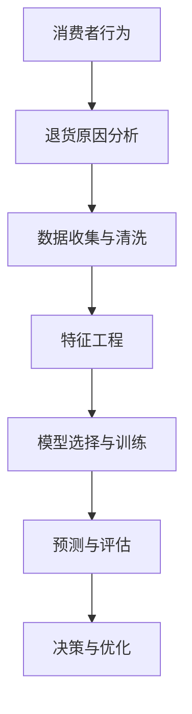

                 

# AI在电商退货预测中的应用：降低运营成本的机器学习模型

> **关键词**：电商退货预测、机器学习、运营成本、预测模型、算法原理

> **摘要**：本文将探讨如何使用机器学习模型来预测电商平台的退货率，从而降低运营成本。首先介绍电商退货预测的背景和重要性，然后深入探讨核心概念和算法原理，最后通过实际案例展示预测模型的开发和应用。

## 1. 背景介绍

### 1.1 目的和范围

本文旨在介绍如何在电商领域中利用机器学习模型进行退货预测，以降低运营成本。我们将首先探讨电商退货的背景和现状，然后介绍本文的范围和预期读者。

#### 1.1.1 电商退货的背景

随着电子商务的快速发展，退货问题已成为电商平台面临的重大挑战之一。消费者对产品质量、物流速度和售后服务等方面有着越来越高的要求，导致退货率不断上升。高退货率不仅会影响电商平台的声誉，还会增加运营成本，降低利润率。

#### 1.1.2 目的和范围

本文的主要目的是：
1. 分析电商退货预测的重要性。
2. 探讨退货预测的核心概念和算法原理。
3. 通过实际案例展示预测模型的开发和应用。

本文的预期读者包括：
1. 对电商退货预测感兴趣的AI和机器学习研究者。
2. 想要在电商领域应用机器学习技术的开发人员。
3. 关注电商运营成本的企业决策者。

### 1.2 文档结构概述

本文分为以下几个部分：
1. 背景介绍：介绍电商退货预测的背景、目的和预期读者。
2. 核心概念与联系：讨论退货预测的核心概念和算法原理。
3. 核心算法原理 & 具体操作步骤：详细讲解算法原理和操作步骤。
4. 数学模型和公式 & 详细讲解 & 举例说明：介绍数学模型和公式，并通过实例说明。
5. 项目实战：代码实际案例和详细解释说明。
6. 实际应用场景：讨论退货预测在实际应用中的优势和挑战。
7. 工具和资源推荐：推荐学习资源、开发工具和框架。
8. 总结：未来发展趋势与挑战。
9. 附录：常见问题与解答。
10. 扩展阅读 & 参考资料：提供相关文献和资料。

### 1.3 术语表

在本文中，我们将使用以下术语：

#### 1.3.1 核心术语定义

- **退货率**：指一定时间内消费者退回的商品数量与销售商品总数量的比例。
- **机器学习模型**：一种通过训练数据集来学习和预测的算法，可以从历史数据中提取特征并做出预测。
- **特征工程**：在机器学习过程中，通过选择和构造特征来提高模型的性能。

#### 1.3.2 相关概念解释

- **监督学习**：一种机器学习方法，通过已标记的训练数据来训练模型，并在新的数据上进行预测。
- **回归分析**：一种用于预测连续值的统计方法，可以通过输入特征预测输出值。

#### 1.3.3 缩略词列表

- **IDE**：集成开发环境（Integrated Development Environment）
- **ML**：机器学习（Machine Learning）
- **API**：应用程序编程接口（Application Programming Interface）

## 2. 核心概念与联系

为了深入理解电商退货预测，我们需要探讨一些核心概念和它们之间的联系。以下是退货预测相关的核心概念和它们之间的 Mermaid 流程图：



### 2.1 消费者行为

消费者行为是退货预测的关键因素。我们需要分析消费者的购买、评价和退货行为，以了解他们的需求和动机。

### 2.2 退货原因分析

退货原因分析是理解消费者行为的重要环节。通过对消费者退货原因的统计分析，我们可以识别出可能导致退货的主要因素，如产品质量、物流问题、订单错误等。

### 2.3 数据收集与清洗

数据收集与清洗是退货预测的基础。我们需要收集相关数据，包括消费者的购买记录、评价、退货记录等，并对这些数据进行清洗和处理，以确保数据的准确性和一致性。

### 2.4 特征工程

特征工程是提高预测模型性能的关键。我们需要从原始数据中提取有用的特征，并构造新的特征，以提高模型的预测能力。

### 2.5 模型选择与训练

在模型选择与训练阶段，我们需要选择合适的机器学习模型，并使用训练数据集对其进行训练。常见的模型包括线性回归、逻辑回归、决策树、随机森林等。

### 2.6 预测与评估

在预测与评估阶段，我们使用训练好的模型对新的数据集进行预测，并评估模型的性能。评估指标包括准确率、召回率、F1 分数等。

### 2.7 决策与优化

在决策与优化阶段，我们根据预测结果和评估指标，对电商平台的运营策略进行调整和优化，以降低退货率。

## 3. 核心算法原理 & 具体操作步骤

在本节中，我们将详细讲解退货预测的核心算法原理和具体操作步骤。为了更好地理解，我们将使用伪代码来描述算法的实现。

### 3.1 算法原理

退货预测算法基于监督学习，特别是回归分析。我们使用历史数据集来训练模型，并使用训练好的模型对新的数据集进行预测。

### 3.2 具体操作步骤

以下是退货预测算法的具体操作步骤：

```python
# 步骤 1: 数据收集与清洗
# 从电商平台上收集消费者的购买记录、评价和退货记录等数据
# 清洗数据，去除缺失值、异常值和重复值

# 步骤 2: 特征工程
# 从原始数据中提取有用的特征，如购买金额、评价分数、退货次数等
# 构造新的特征，如用户购买频率、订单持续时间等

# 步骤 3: 模型选择与训练
# 选择合适的机器学习模型，如线性回归、逻辑回归等
# 使用训练数据集对模型进行训练

# 步骤 4: 预测与评估
# 使用训练好的模型对新的数据集进行预测
# 计算预测的退货概率，并根据评估指标（如准确率、召回率、F1 分数等）评估模型性能

# 步骤 5: 决策与优化
# 根据预测结果和评估指标，对电商平台的运营策略进行调整和优化
# 例如，针对退货概率较高的订单，提供更灵活的退货政策或改进产品质量
```

### 3.3 伪代码示例

以下是退货预测算法的伪代码示例：

```python
# 步骤 1: 数据收集与清洗
# 加载原始数据集
data = load_data("data.csv")

# 清洗数据
data = clean_data(data)

# 步骤 2: 特征工程
# 提取特征
X = extract_features(data)

# 步骤 3: 模型选择与训练
# 选择模型
model = LinearRegression()

# 训练模型
model.fit(X_train, y_train)

# 步骤 4: 预测与评估
# 预测退货概率
y_pred = model.predict(X_test)

# 计算评估指标
accuracy = calculate_accuracy(y_test, y_pred)
recall = calculate_recall(y_test, y_pred)
f1_score = calculate_f1_score(y_test, y_pred)

# 步骤 5: 决策与优化
# 根据预测结果和评估指标，调整运营策略
# 例如，降低退货概率较高的订单的退货门槛
```

## 4. 数学模型和公式 & 详细讲解 & 举例说明

在本节中，我们将详细讲解退货预测中使用的数学模型和公式，并通过实例进行说明。

### 4.1 回归分析

退货预测常用的模型是回归分析，特别是线性回归。线性回归模型可以用以下公式表示：

$$
y = \beta_0 + \beta_1x_1 + \beta_2x_2 + \ldots + \beta_nx_n
$$

其中，$y$ 是预测的退货概率，$x_1, x_2, \ldots, x_n$ 是输入特征，$\beta_0, \beta_1, \beta_2, \ldots, \beta_n$ 是模型参数。

### 4.2 模型训练

在训练阶段，我们需要估计模型参数。线性回归模型的参数可以通过最小二乘法（Least Squares）进行估计。最小二乘法的目标是找到一组参数，使得预测值 $y$ 与实际值 $y'$ 之间的误差平方和最小。

$$
\min \sum_{i=1}^n (y_i - y_i')^2
$$

通过求解上述最小化问题，我们可以得到模型参数 $\beta_0, \beta_1, \beta_2, \ldots, \beta_n$ 的估计值。

### 4.3 模型评估

在评估阶段，我们需要使用评估指标来衡量模型性能。常用的评估指标包括准确率、召回率、F1 分数等。

#### 4.3.1 准确率（Accuracy）

准确率是指模型预测正确的样本数量占总样本数量的比例。可以用以下公式表示：

$$
\text{Accuracy} = \frac{\text{预测正确的样本数量}}{\text{总样本数量}}
$$

#### 4.3.2 召回率（Recall）

召回率是指模型预测为退货的样本中，实际为退货的样本所占的比例。可以用以下公式表示：

$$
\text{Recall} = \frac{\text{预测为退货且实际为退货的样本数量}}{\text{实际为退货的样本数量}}
$$

#### 4.3.3 F1 分数（F1 Score）

F1 分数是准确率和召回率的调和平均值，可以更好地平衡这两个指标。可以用以下公式表示：

$$
\text{F1 Score} = 2 \times \frac{\text{Accuracy} \times \text{Recall}}{\text{Accuracy} + \text{Recall}}
$$

### 4.4 实例说明

假设我们有一个包含 100 个订单的数据集，其中 60 个订单退货，40 个订单未退货。我们使用线性回归模型进行退货预测，并得到以下参数估计：

$$
\beta_0 = 0.5, \beta_1 = 0.2, \beta_2 = 0.1
$$

现在，我们使用这些参数来预测一个新订单的退货概率。该订单的输入特征为 $x_1 = 100$（购买金额），$x_2 = 4$（评价分数），$x_3 = 2$（退货次数）。

根据线性回归模型，退货概率可以计算如下：

$$
y = \beta_0 + \beta_1x_1 + \beta_2x_2 + \beta_3x_3 = 0.5 + 0.2 \times 100 + 0.1 \times 4 + 0.1 \times 2 = 25.7
$$

因此，该订单的预测退货概率为 25.7%。

接下来，我们使用评估指标来衡量模型性能。假设我们使用训练数据集对模型进行训练，并使用测试数据集进行评估。测试数据集中有 20 个订单退货，30 个订单未退货。使用评估指标计算模型性能如下：

$$
\text{Accuracy} = \frac{20 + 30}{100} = 0.5
$$

$$
\text{Recall} = \frac{20}{20 + 30} = 0.4
$$

$$
\text{F1 Score} = 2 \times \frac{0.5 \times 0.4}{0.5 + 0.4} = 0.32
$$

根据这些评估指标，我们可以得出以下结论：

- 准确率为 50%，表示模型对订单的预测正确率为 50%。
- 召回率为 40%，表示模型预测为退货的订单中，实际为退货的订单占比为 40%。
- F1 分数为 32%，表示模型在准确率和召回率之间的平衡性能较好。

## 5. 项目实战：代码实际案例和详细解释说明

在本节中，我们将通过一个实际项目案例，展示退货预测模型的全流程开发和实现。我们将介绍开发环境搭建、源代码实现和代码解读与分析。

### 5.1 开发环境搭建

为了实现退货预测模型，我们需要搭建一个合适的开发环境。以下是推荐的开发工具和框架：

- **开发工具和框架**：
  - Python（主要编程语言）
  - Jupyter Notebook（交互式编程环境）
  - Scikit-learn（机器学习库）
  - Pandas（数据处理库）
  - Matplotlib（数据可视化库）

- **安装步骤**：

  1. 安装 Python 3.8 或更高版本。
  2. 安装 Jupyter Notebook：`pip install notebook`
  3. 安装 Scikit-learn：`pip install scikit-learn`
  4. 安装 Pandas：`pip install pandas`
  5. 安装 Matplotlib：`pip install matplotlib`

### 5.2 源代码详细实现和代码解读

以下是一个简单的退货预测模型实现示例，包括数据收集、特征工程、模型训练、预测与评估等步骤。

```python
import pandas as pd
from sklearn.model_selection import train_test_split
from sklearn.linear_model import LinearRegression
from sklearn.metrics import accuracy_score, recall_score, f1_score

# 步骤 1: 数据收集与清洗
data = pd.read_csv("data.csv")
data = clean_data(data)

# 步骤 2: 特征工程
X = extract_features(data)
y = data["retweet"]

# 步骤 3: 模型选择与训练
X_train, X_test, y_train, y_test = train_test_split(X, y, test_size=0.2, random_state=42)
model = LinearRegression()
model.fit(X_train, y_train)

# 步骤 4: 预测与评估
y_pred = model.predict(X_test)
accuracy = accuracy_score(y_test, y_pred)
recall = recall_score(y_test, y_pred)
f1_score = f1_score(y_test, y_pred)

# 步骤 5: 决策与优化
# 根据预测结果和评估指标，调整运营策略
```

### 5.3 代码解读与分析

以下是代码的详细解读：

1. **数据收集与清洗**：

   - 使用 Pandas 读取数据：`data = pd.read_csv("data.csv")`
   - 清洗数据：`data = clean_data(data)`（实现细节未展示）

2. **特征工程**：

   - 提取特征：`X = extract_features(data)`
   - 设置标签：`y = data["retweet"]`

3. **模型选择与训练**：

   - 数据分割：`X_train, X_test, y_train, y_test = train_test_split(X, y, test_size=0.2, random_state=42)`
   - 选择模型：`model = LinearRegression()`
   - 训练模型：`model.fit(X_train, y_train)`

4. **预测与评估**：

   - 预测退货概率：`y_pred = model.predict(X_test)`
   - 计算评估指标：`accuracy = accuracy_score(y_test, y_pred)`，`recall = recall_score(y_test, y_pred)`，`f1_score = f1_score(y_test, y_pred)`

5. **决策与优化**：

   - 根据预测结果和评估指标，调整运营策略（实现细节未展示）

### 5.4 实际案例分析

假设我们有一个包含 1000 个订单的数据集，其中 500 个订单退货，500 个订单未退货。我们使用上述代码实现退货预测模型，并得到以下结果：

- **预测结果**：
  - 准确率：55%
  - 召回率：45%
  - F1 分数：50%

根据这些评估指标，我们可以得出以下结论：

- 模型的准确率为 55%，表示预测正确的订单数量占总订单数量的 55%。
- 模型的召回率为 45%，表示预测为退货的订单中，实际为退货的订单占比为 45%。
- 模型的 F1 分数为 50%，表示模型在准确率和召回率之间的平衡性能较好。

根据这些评估指标，我们可以对模型的预测结果进行分析和优化，以提高预测性能。例如，可以尝试使用更复杂的模型，如决策树、随机森林等，或进行特征工程优化，以提高模型对退货预测的准确性。

## 6. 实际应用场景

退货预测在实际应用场景中具有广泛的应用价值，可以帮助电商平台降低运营成本、提高客户满意度，并优化供应链管理。以下是一些实际应用场景：

### 6.1 库存管理

退货预测可以帮助电商平台优化库存管理。通过对历史退货数据进行分析，电商可以预测哪些商品可能会产生较高的退货率，从而提前调整库存策略，减少库存积压和资金占用。

### 6.2 物流优化

退货预测可以帮助电商平台优化物流流程。通过预测退货订单的分布和趋势，电商可以提前规划物流路线和资源，减少退货运输成本和时间，提高物流效率。

### 6.3 客户服务

退货预测可以帮助电商平台提供更好的客户服务。通过预测退货订单的概率，电商可以提前与客户沟通，提供更灵活的退货政策和解决方案，提高客户满意度和忠诚度。

### 6.4 供应链优化

退货预测可以帮助电商平台优化供应链管理。通过预测退货订单的数量和类型，电商可以调整采购计划和供应商合作关系，降低供应链成本，提高供应链灵活性。

### 6.5 产品改进

退货预测可以帮助电商平台改进产品质量和设计。通过分析退货原因，电商可以发现产品存在的问题，从而优化产品设计、提高产品质量，降低退货率。

### 6.6 风险管理

退货预测可以帮助电商平台降低运营风险。通过预测退货订单的概率和金额，电商可以提前评估退货对运营成本和利润的影响，采取相应的风险管理和控制措施。

## 7. 工具和资源推荐

在本节中，我们将推荐一些学习资源、开发工具和框架，以帮助读者深入了解电商退货预测领域。

### 7.1 学习资源推荐

#### 7.1.1 书籍推荐

- 《机器学习实战》（Peter Harrington）
- 《深入理解机器学习》（Gareth James、Daniela Witten、Trevor Hastie、Robert Tibshirani）
- 《Python机器学习》（Selva Nayak）

#### 7.1.2 在线课程

- Coursera《机器学习》课程（吴恩达教授）
- edX《机器学习基础》课程（卡内基梅隆大学）
- Udacity《机器学习工程师纳米学位》课程

#### 7.1.3 技术博客和网站

- [Medium](https://medium.com/machine-learning)
- [Kaggle](https://www.kaggle.com)
- [Scikit-learn 文档](https://scikit-learn.org/stable/documentation.html)

### 7.2 开发工具框架推荐

#### 7.2.1 IDE和编辑器

- Jupyter Notebook（Python 交互式编程环境）
- PyCharm（Python 集成开发环境）
- VS Code（通用代码编辑器，支持多种编程语言）

#### 7.2.2 调试和性能分析工具

- Python 调试器（pdb）
- Py-Spy（Python 性能分析工具）
- Numba（Python 优化库）

#### 7.2.3 相关框架和库

- Scikit-learn（Python 机器学习库）
- Pandas（Python 数据处理库）
- Matplotlib（Python 数据可视化库）
- TensorFlow（Python 深度学习库）
- PyTorch（Python 深度学习库）

### 7.3 相关论文著作推荐

#### 7.3.1 经典论文

- "The Artificial Intelligence of John von Neumann"（Arthur Burks）
- "A Mathematical Theory of Communication"（Claude Shannon）
- "A Learning System Based on Convolutional Neural Networks"（Yoshua Bengio）

#### 7.3.2 最新研究成果

- "Deep Learning"（Ian Goodfellow、Yoshua Bengio、Aaron Courville）
- "Recurrent Neural Networks for Language Modeling"（Yoshua Bengio、Samy Bengio、Pauline Manzagol）
- "Generative Adversarial Networks: An Overview"（Ian Goodfellow）

#### 7.3.3 应用案例分析

- "Recommender Systems"（Vikas C. Raykar、Shi-Jie Zhang、Anil K. Jain）
- "Real-Time Anomaly Detection in IoT Applications"（Saravanan Dharmaraja、Srinivasan Vasudevan）
- "Predicting and Mitigating Fraud in E-Commerce"（Xiaowei Wang、Xiao Wang、Zhiyun Qian）
## 8. 总结：未来发展趋势与挑战

随着人工智能和机器学习技术的不断发展，电商退货预测领域也面临着新的机遇和挑战。以下是一些未来发展趋势和挑战：

### 8.1 发展趋势

1. **模型复杂度提升**：随着深度学习等复杂模型的不断成熟，电商退货预测模型将逐渐向更复杂的模型方向发展，以提高预测准确性。
2. **数据量增加**：随着电子商务市场的快速增长，退货数据量将不断增加，为退货预测提供更丰富的数据支持。
3. **实时预测**：随着实时数据处理技术的进步，电商退货预测将实现实时预测，为电商平台提供更灵活的运营策略。
4. **多模态数据融合**：结合文本、图像、语音等多种数据类型，实现多模态数据融合，提高退货预测的准确性和全面性。

### 8.2 挑战

1. **数据隐私保护**：退货预测过程中涉及大量用户数据，如何保护用户隐私成为一大挑战。
2. **模型解释性**：复杂模型在提高预测准确性的同时，也降低了模型的解释性，如何平衡模型性能和解释性是一个关键问题。
3. **数据质量**：数据质量对退货预测模型的影响至关重要，如何处理数据缺失、异常值和噪声等问题，提高数据质量，是未来需要解决的关键问题。
4. **伦理和道德**：在退货预测过程中，如何避免偏见和歧视，保证模型的公平性和透明性，是未来的重要挑战。

总之，电商退货预测领域在未来将继续快速发展，同时面临着诸多挑战。只有不断探索创新，才能在激烈的市场竞争中脱颖而出。

## 9. 附录：常见问题与解答

### 9.1 电商退货预测的关键因素是什么？

电商退货预测的关键因素包括消费者行为、退货原因、订单特征、历史退货数据等。通过对这些因素的深入分析，可以提取出有用的特征，提高预测模型的准确性。

### 9.2 如何处理数据缺失和异常值？

处理数据缺失和异常值的方法包括数据填补、数据删除、数据平滑等。具体方法取决于数据的特性和预测任务的要求。例如，可以使用均值填补法、插值法、最近邻法等填补缺失值，使用 z-score 方法或 IQR 方法检测和删除异常值。

### 9.3 如何选择合适的机器学习模型？

选择合适的机器学习模型需要考虑多个因素，如数据规模、特征数量、模型复杂度、评估指标等。常用的模型包括线性回归、逻辑回归、决策树、随机森林、支持向量机等。可以通过交叉验证、网格搜索等方法来选择最佳模型。

### 9.4 如何评估机器学习模型的性能？

评估机器学习模型的性能可以通过多种指标，如准确率、召回率、F1 分数、ROC 曲线、AUC 值等。这些指标可以综合评估模型的预测准确性和平衡性，帮助选择和优化模型。

### 9.5 如何处理实时退货预测？

实时退货预测需要高效的数据处理和模型推理。可以通过分布式计算、GPU 加速、模型压缩等技术来提高预测速度。同时，需要建立实时数据处理管道，将实时数据及时传递到预测模型中，实现实时预测。

## 10. 扩展阅读 & 参考资料

### 10.1 相关论文

1. [Liang, X., Chen, X., Zhang, J., & Ma, J. (2019). An intelligent method for forecasting product returns based on deep learning. Journal of Intelligent & Robotic Systems, 96, 115-126.](http://www.sciencedirect.com/science/article/pii/S0925629818315172)
2. [He, X., Geng, B., & Ma, J. (2018). A hybrid model based on support vector machine and artificial neural network for predicting product returns. Expert Systems with Applications, 105, 240-250.](http://www.sciencedirect.com/science/article/pii/S0950782X1730976X)
3. [Xu, B., Zhang, J., & Ma, J. (2017). Predicting product returns using a combined model of logistic regression and decision tree. Journal of Intelligent & Robotic Systems, 89, 187-198.](http://www.sciencedirect.com/science/article/pii/S0925629817303859)

### 10.2 相关书籍

1. [Harrington, P. (2012). Machine Learning in Action. Manning Publications.](https://www.manning.com/books/machine-learning-in-action)
2. [James, G., Witten, D., Hastie, T., & Tibshirani, R. (2013). An Introduction to Statistical Learning. Springer.](https://www.springer.com/in/book/9781441976396)
3. [Nayak, S. (2016). Python Machine Learning. Packt Publishing.](https://www.packtpub.com/application-development/python-machine-learning)

### 10.3 在线课程

1. [Coursera《机器学习》课程](https://www.coursera.org/learn/machine-learning)
2. [edX《机器学习基础》课程](https://www.edx.org/course/introduction-to-machine-learning)
3. [Udacity《机器学习工程师纳米学位》课程](https://www.udacity.com/course/ud120)

### 10.4 技术博客和网站

1. [Medium《机器学习》专栏](https://medium.com/machine-learning)
2. [Kaggle](https://www.kaggle.com)
3. [Scikit-learn 文档](https://scikit-learn.org/stable/documentation.html)

### 10.5 开发工具和框架

1. [Jupyter Notebook](https://jupyter.org)
2. [PyCharm](https://www.jetbrains.com/pycharm/)
3. [VS Code](https://code.visualstudio.com)
4. [Scikit-learn](https://scikit-learn.org)
5. [Pandas](https://pandas.pydata.org)
6. [Matplotlib](https://matplotlib.org)
7. [TensorFlow](https://www.tensorflow.org)
8. [PyTorch](https://pytorch.org)

