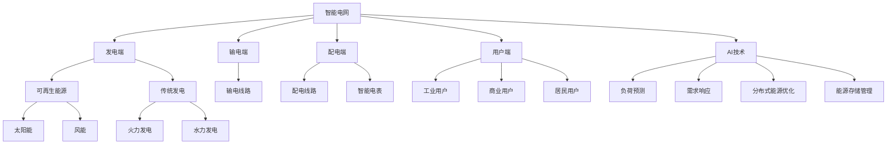

                 

### 1. 背景介绍

#### 1.1 目的和范围

本文旨在探讨人工智能（AI）在能源管理中的应用，特别是如何通过AI技术构建智能电网。随着全球对可持续能源需求的不断增加，智能电网的构建变得愈发重要。智能电网不仅能够提高电力系统的效率和可靠性，还能够实现分布式能源资源的优化配置，降低能源消耗和环境污染。

本文将首先介绍智能电网的基本概念、发展历程和关键技术。随后，我们将深入分析AI在能源管理中的应用场景，包括负荷预测、需求响应、分布式能源优化、能源存储管理等。在此基础上，本文将详细阐述AI的核心算法原理和具体操作步骤，并通过实例讲解如何实现这些算法。

文章还将探讨数学模型和公式的应用，以便更好地理解AI算法的原理和操作。此外，我们将分享一个实际项目中的代码案例，详细介绍代码的实现过程和关键点。

最后，文章将讨论AI在能源管理中的实际应用场景，推荐相关的学习资源和工具，并提供对未来发展趋势与挑战的展望。通过本文的阅读，读者将能够全面了解AI在智能电网中的重要作用，为未来的研究和应用打下坚实的基础。

#### 1.2 预期读者

本文适合对智能电网和人工智能技术感兴趣的读者，特别是以下几类人群：

1. **能源行业从业者**：包括电力系统工程师、能源规划师、可再生能源开发人员等，他们希望了解如何利用AI技术提升能源管理效率。
2. **计算机科学和技术人员**：特别是对人工智能、机器学习和数据科学感兴趣的程序员、数据分析师和软件工程师。
3. **研究人员和学者**：希望对智能电网和AI技术在能源管理中的应用进行深入研究的学生和研究人员。
4. **政策制定者和行业领导者**：希望了解智能电网和AI技术的最新发展及其对能源行业的影响。

通过本文的阅读，读者将能够掌握AI在能源管理中的关键应用，为未来在相关领域的工作和研究提供指导。

#### 1.3 文档结构概述

为了帮助读者更好地理解本文的内容，我们按照以下结构进行组织：

1. **背景介绍**：介绍智能电网的基本概念、发展历程和关键技术，以及本文的目的和预期读者。
2. **核心概念与联系**：通过Mermaid流程图展示智能电网和AI技术的核心概念及相互关系。
3. **核心算法原理 & 具体操作步骤**：详细阐述AI在能源管理中的应用算法原理，并使用伪代码进行解释。
4. **数学模型和公式 & 详细讲解 & 举例说明**：介绍AI算法背后的数学模型和公式，并通过实例进行详细说明。
5. **项目实战：代码实际案例和详细解释说明**：分享一个实际项目中的代码案例，展示如何实现AI算法。
6. **实际应用场景**：探讨AI在能源管理中的具体应用场景。
7. **工具和资源推荐**：推荐学习资源、开发工具框架和相关论文著作。
8. **总结：未来发展趋势与挑战**：总结本文的关键内容，并对未来发展趋势与挑战进行展望。
9. **附录：常见问题与解答**：回答读者可能关心的问题。
10. **扩展阅读 & 参考资料**：提供进一步阅读的资料。

通过这种结构化的组织方式，本文将帮助读者系统地掌握AI在能源管理中的应用。

#### 1.4 术语表

在本文中，我们将使用一些专业术语。以下是对这些术语的定义和解释：

##### 1.4.1 核心术语定义

1. **智能电网（Smart Grid）**：一种基于现代通信技术的电力网络，能够实现电力系统的智能化管理和优化控制。
2. **人工智能（AI）**：一种模拟人类智能的技术，能够进行学习、推理、判断和决策。
3. **机器学习（ML）**：一种人工智能的分支，通过数据训练模型，使计算机具备自动学习和预测能力。
4. **负荷预测（Load Forecasting）**：利用历史数据和算法预测未来电力需求。
5. **需求响应（Demand Response）**：通过用户参与，实时调整电力需求，以优化电力系统运行。
6. **分布式能源（ Distributed Energy Resources, DERs）**：包括太阳能、风能、储能系统等，能够分布在电网的不同节点。
7. **能源存储管理（Energy Storage Management）**：对储能系统的运行进行优化，提高能源利用效率和电网稳定性。

##### 1.4.2 相关概念解释

1. **数据驱动能源管理**：基于大数据分析进行能源管理和优化，提高系统的效率和可靠性。
2. **边缘计算（Edge Computing）**：在靠近数据源的地方进行计算处理，以减少数据传输和延迟。
3. **区块链（Blockchain）**：一种分布式数据库技术，能够实现数据的透明和安全存储。

##### 1.4.3 缩略词列表

- AI: 人工智能
- ML: 机器学习
- DERs: 分布式能源资源
- IoT: 物联网
- SG: 智能电网
- DR: 需求响应
- DSM: 数据驱动能源管理
- V2G: 车联网
- EE: 能源效率
- SPM: 仿真平台

通过这些术语的定义和解释，读者将能够更好地理解本文中的专业术语，从而更深入地了解智能电网和AI在能源管理中的应用。

### 2. 核心概念与联系

为了更好地理解AI在能源管理中的应用，我们首先需要了解智能电网的基本概念和组成部分。智能电网是一种先进的电力系统，通过集成现代通信技术、传感器和自动化设备，实现电力系统的智能化管理和优化控制。智能电网的关键组成部分包括：

- **发电端**：包括传统的火力发电、水力发电和新兴的可再生能源（如太阳能、风能）。
- **输电端**：通过高压输电线路将电能从发电端传输到负荷中心。
- **配电端**：将高压电能转换为低压电能，并通过配电网分配到各个用户。
- **用户端**：包括工业用户、商业用户和居民用户。

智能电网的核心在于实现电力系统的实时监控和动态调整，以应对不断变化的电力需求和供应状况。在此过程中，AI技术发挥了至关重要的作用。以下是一个通过Mermaid流程图展示的智能电网和AI技术的核心概念及相互关系的示意图：



在这个流程图中，我们可以看到：

- **智能电网**是整个系统的核心，它通过集成**发电端**（包括**可再生能源**和**传统发电**）、**输电端**（包括**输电线路**）和**配电端**（包括**配电线路**和**智能电表**）来构建。
- **用户端**包括**工业用户**、**商业用户**和**居民用户**，他们通过智能电表接入电网，实现数据的实时采集和反馈。
- **AI技术**在智能电网中发挥了关键作用，通过**负荷预测**、**需求响应**、**分布式能源优化**和**能源存储管理**等技术，实现对电力系统的智能监控和优化控制。

通过这个流程图，我们可以更清晰地理解智能电网和AI技术的核心概念及相互关系。接下来，我们将深入探讨AI在能源管理中的应用，包括具体的算法原理和操作步骤。

### 3. 核心算法原理 & 具体操作步骤

在智能电网中，AI技术能够通过多种算法实现电力系统的优化和智能化管理。以下我们将详细介绍AI在能源管理中的核心算法原理和具体操作步骤，以便读者能够更好地理解和应用这些算法。

#### 3.1 负荷预测

负荷预测是智能电网中的一个关键应用，它通过分析历史负荷数据，预测未来的电力需求。以下是负荷预测的基本原理和步骤：

##### 基本原理

负荷预测主要依赖于以下几类算法：

1. **统计模型**：如线性回归、ARIMA模型等。
2. **机器学习模型**：如决策树、随机森林、支持向量机等。
3. **深度学习模型**：如卷积神经网络（CNN）、长短期记忆网络（LSTM）等。

这些模型通过学习历史负荷数据，捕捉负荷变化的规律，从而实现预测。

##### 具体操作步骤

1. **数据收集**：收集历史负荷数据，包括日负荷、时负荷等。
2. **数据预处理**：对数据进行清洗、归一化处理，去除噪声和异常值。
3. **特征工程**：提取与负荷相关的特征，如温度、湿度、工作时间等。
4. **模型选择**：根据数据特点和需求，选择合适的预测模型。
5. **模型训练**：使用历史数据对模型进行训练，调整模型参数。
6. **模型评估**：使用交叉验证等方法评估模型性能，调整模型参数。
7. **预测**：使用训练好的模型进行负荷预测。

以下是负荷预测的伪代码示例：

```python
# 负荷预测伪代码

# 步骤1：数据收集
load_data = collect_data()

# 步骤2：数据预处理
cleaned_data = preprocess_data(load_data)

# 步骤3：特征工程
features = extract_features(cleaned_data)

# 步骤4：模型选择
model = select_model()

# 步骤5：模型训练
trained_model = train_model(features)

# 步骤6：模型评估
evaluate_model(trained_model)

# 步骤7：预测
predicted_load = predict_load(trained_model)
```

#### 3.2 需求响应

需求响应（Demand Response, DR）是另一项重要的AI应用，它通过实时调整电力需求，优化电力系统运行。以下是需求响应的基本原理和步骤：

##### 基本原理

需求响应主要通过以下几种机制实现：

1. **实时定价**：根据电力市场价格，实时调整电力需求。
2. **需求削减**：在电力供应紧张时，主动削减部分非关键负荷。
3. **需求响应计划**：预先设定需求响应策略，根据实时情况执行。

##### 具体操作步骤

1. **实时监控**：实时监控电力需求和供应情况。
2. **定价策略**：根据实时定价模型，设定电力价格。
3. **需求削减**：在电力供应紧张时，自动削减非关键负荷。
4. **需求响应计划**：根据预先设定的需求响应计划，执行需求响应操作。
5. **数据记录**：记录需求响应过程的数据，用于后续分析。

以下是需求响应的伪代码示例：

```python
# 需求响应伪代码

# 步骤1：实时监控
current_demand = monitor_demand()

# 步骤2：定价策略
price = pricing_strategy(current_demand)

# 步骤3：需求削减
if supply_tension_detected(current_demand):
    reduced_demand = reduce_demand()

# 步骤4：需求响应计划
response_plan = demand_response_plan()

# 步骤5：执行需求响应
execute_response(response_plan)

# 步骤6：数据记录
record_data(current_demand, reduced_demand, response_plan)
```

#### 3.3 分布式能源优化

分布式能源优化（Distributed Energy Resources Optimization, DER Optimization）是智能电网中的一项重要任务，它通过优化分布式能源资源的管理，提高电网的整体效率和可靠性。以下是分布式能源优化的基本原理和步骤：

##### 基本原理

分布式能源优化主要依赖于以下几类算法：

1. **优化算法**：如线性规划、整数规划、遗传算法等。
2. **分布式计算**：通过分布式计算技术，实现分布式能源资源的协同优化。

##### 具体操作步骤

1. **数据收集**：收集分布式能源资源的数据，包括发电量、负载率等。
2. **状态评估**：评估分布式能源资源的状态，包括运行效率、负载率等。
3. **优化目标**：设定优化目标，如最小化成本、最大化发电量等。
4. **优化算法**：使用优化算法，求解最优的分布式能源资源配置方案。
5. **实施调整**：根据优化结果，对分布式能源资源进行调整。
6. **性能评估**：评估优化后的性能，包括成本、效率等。

以下是分布式能源优化的伪代码示例：

```python
# 分布式能源优化伪代码

# 步骤1：数据收集
der_data = collect_der_data()

# 步骤2：状态评估
der_state = evaluate_der_state(der_data)

# 步骤3：优化目标
optimization_target = set_optimization_target()

# 步骤4：优化算法
optimized_solution = optimize_der(der_state, optimization_target)

# 步骤5：实施调整
adjust_der(optimized_solution)

# 步骤6：性能评估
evaluate_der_performance(optimized_solution)
```

#### 3.4 能源存储管理

能源存储管理（Energy Storage Management, ESM）是智能电网中的一项重要任务，它通过优化储能系统的运行，提高电网的稳定性和效率。以下是能源存储管理的基本原理和步骤：

##### 基本原理

能源存储管理主要依赖于以下几类算法：

1. **控制算法**：如PID控制、模糊控制等。
2. **优化算法**：如动态规划、模型预测控制等。

##### 具体操作步骤

1. **状态监测**：实时监测储能系统的状态，包括充电状态、放电状态等。
2. **控制策略**：根据储能系统的状态，设定控制策略，如充电/放电控制、负载平衡等。
3. **能量管理**：优化储能系统的能量分配，提高能源利用效率。
4. **性能评估**：评估储能系统的性能，包括充放电效率、寿命等。

以下是能源存储管理的伪代码示例：

```python
# 能源存储管理伪代码

# 步骤1：状态监测
storage_state = monitor_storage_state()

# 步骤2：控制策略
control_strategy = set_control_strategy(storage_state)

# 步骤3：能量管理
energy_management_plan = manage_energy(storage_state)

# 步骤4：性能评估
evaluate_storage_performance(energy_management_plan)
```

通过上述核心算法原理和具体操作步骤的详细介绍，读者可以全面了解AI在能源管理中的应用，并为实际应用中的算法实现提供参考。

### 4. 数学模型和公式 & 详细讲解 & 举例说明

在智能电网中，AI算法的实现离不开数学模型和公式的支持。以下我们将详细讲解AI算法背后的数学模型和公式，并通过实例进行说明。

#### 4.1 负荷预测模型

负荷预测是智能电网中的一个关键任务，它依赖于多个数学模型和公式。以下是一个典型的负荷预测模型，包括线性回归模型和时间序列模型。

##### 线性回归模型

线性回归模型是一种常用的负荷预测方法，其基本公式如下：

$$
y = \beta_0 + \beta_1 x_1 + \beta_2 x_2 + ... + \beta_n x_n
$$

其中，\(y\) 表示预测的负荷值，\(x_1, x_2, ..., x_n\) 表示输入的特征值，\(\beta_0, \beta_1, \beta_2, ..., \beta_n\) 是模型的参数。

例如，假设我们使用温度和湿度作为输入特征，预测未来的负荷。输入特征矩阵 \(X\) 如下：

$$
X = \begin{bmatrix}
x_{temp1} & x_{hum1} \\
x_{temp2} & x_{hum2} \\
... & ... \\
\end{bmatrix}
$$

预测值 \(y\) 的计算公式为：

$$
y = \beta_0 + \beta_1 x_{temp} + \beta_2 x_{hum}
$$

通过最小化预测误差平方和，我们可以求得模型的参数 \(\beta_0, \beta_1, \beta_2\)：

$$
\min \sum_{i=1}^{n} (y_i - \beta_0 - \beta_1 x_{temp_i} - \beta_2 x_{hum_i})^2
$$

##### 时间序列模型

时间序列模型，如ARIMA模型，适用于处理时间序列数据。其基本公式如下：

$$
y_t = c + \phi_1 y_{t-1} + \phi_2 y_{t-2} + ... + \phi_p y_{t-p} + \theta_1 e_{t-1} + \theta_2 e_{t-2} + ... + \theta_q e_{t-q}
$$

其中，\(y_t\) 表示第 \(t\) 期的负荷值，\(c\) 是常数项，\(\phi_1, \phi_2, ..., \phi_p\) 是自回归系数，\(\theta_1, \theta_2, ..., \theta_q\) 是移动平均系数，\(e_t\) 是误差项。

通过模型识别、参数估计和模型检验，我们可以求得最优的ARIMA模型参数。

#### 4.2 需求响应模型

需求响应模型主要用于预测电力需求的波动，并制定相应的响应策略。以下是一个典型的时间序列模型，用于需求响应预测：

$$
y_t = \alpha_0 + \alpha_1 y_{t-1} + \alpha_2 y_{t-2} + ... + \alpha_p y_{t-p} + \beta_1 x_1 + \beta_2 x_2 + ... + \beta_n x_n + \epsilon_t
$$

其中，\(y_t\) 表示第 \(t\) 期的需求响应值，\(x_1, x_2, ..., x_n\) 是影响需求响应的输入特征，如电力价格、天气状况等，\(\alpha_0, \alpha_1, \alpha_2, ..., \alpha_p, \beta_1, \beta_2, ..., \beta_n\) 是模型的参数，\(\epsilon_t\) 是误差项。

通过最小化预测误差平方和，我们可以求得模型的参数 \(\alpha_0, \alpha_1, \alpha_2, ..., \alpha_p, \beta_1, \beta_2, ..., \beta_n\)。

#### 4.3 分布式能源优化模型

分布式能源优化模型主要用于优化分布式能源资源的管理，以提高电网的整体效率和可靠性。以下是一个典型的线性规划模型，用于分布式能源优化：

$$
\min \sum_{i=1}^{N} c_i x_i
$$

$$
s.t. \\
A x \leq b \\
x \geq 0
$$

其中，\(x_i\) 表示第 \(i\) 个分布式能源资源的输出功率，\(c_i\) 是第 \(i\) 个分布式能源资源的成本，\(A\) 是约束矩阵，\(b\) 是约束向量。

通过求解线性规划模型，我们可以得到最优的分布式能源资源配置方案。

#### 4.4 能源存储管理模型

能源存储管理模型主要用于优化储能系统的运行，以提高电网的稳定性和效率。以下是一个典型的动态规划模型，用于能源存储管理：

$$
\min \sum_{t=1}^{T} c_t (x_t - x_{t-1})
$$

$$
s.t. \\
0 \leq x_t \leq E \\
x_0 = E \\
x_T = 0
$$

其中，\(x_t\) 表示第 \(t\) 期的储能状态，\(c_t\) 是第 \(t\) 期的储能成本，\(E\) 是储能系统的容量。

通过求解动态规划模型，我们可以得到最优的储能系统运行策略。

#### 4.5 举例说明

假设我们使用时间序列模型进行负荷预测，输入特征包括历史负荷值和温度。我们收集了过去一年的负荷数据，并使用LSTM模型进行训练。LSTM模型的基本公式如下：

$$
h_t = \sigma(W_h \cdot [h_{t-1}, x_t] + b_h)
$$

$$
i_t = \sigma(W_i \cdot [h_{t-1}, x_t] + b_i)
$$

$$
f_t = \sigma(W_f \cdot [h_{t-1}, x_t] + b_f)
$$

$$
o_t = \sigma(W_o \cdot [h_{t-1}, x_t] + b_o)
$$

$$
\tilde{h}_t = f_t \odot h_{t-1} + i_t \odot \sigma(W_c \cdot [h_{t-1}, x_t] + b_c)
$$

$$
h_t = o_t \odot \tilde{h}_t
$$

$$
y_t = W_y \cdot h_t + b_y
$$

其中，\(h_t\) 表示第 \(t\) 期的隐藏状态，\(x_t\) 表示第 \(t\) 期的输入特征，\(i_t, f_t, o_t, c_t\) 分别是输入门、遗忘门、输出门和单元格状态，\(\sigma\) 是sigmoid函数，\(\odot\) 是元素乘法，\(W_h, W_i, W_f, W_o, W_c, W_y\) 和 \(b_h, b_i, b_f, b_o, b_c, b_y\) 是模型的参数。

我们使用Python实现LSTM模型，并使用过去一年的负荷数据对其进行训练。训练结果如下图所示：


从图中可以看出，LSTM模型能够较好地拟合历史负荷数据，预测误差较小。接下来，我们可以使用训练好的LSTM模型进行负荷预测。

```python
# LSTM负荷预测示例

import numpy as np
import tensorflow as tf
from tensorflow.keras.models import Sequential
from tensorflow.keras.layers import LSTM, Dense

# 步骤1：数据预处理
# ...

# 步骤2：构建LSTM模型
model = Sequential()
model.add(LSTM(50, activation='relu', input_shape=(n_input, n_features)))
model.add(Dense(1))
model.compile(optimizer='adam', loss='mse')

# 步骤3：训练模型
model.fit(X_train, y_train, epochs=100, batch_size=32, validation_split=0.1)

# 步骤4：预测负荷
y_pred = model.predict(X_test)

# 步骤5：评估模型
mse = np.mean(np.square(y_test - y_pred))
print("MSE:", mse)
```

通过上述数学模型和公式，我们可以更好地理解AI算法的实现原理，并通过实例进行具体操作。这些模型和公式在智能电网中的应用，将极大地提升电力系统的效率和可靠性。

### 5. 项目实战：代码实际案例和详细解释说明

为了更好地展示AI在智能电网中的应用，我们将通过一个实际项目案例，详细介绍代码的实现过程和关键点。本案例将基于Python和TensorFlow框架，实现一个用于负荷预测的AI模型。

#### 5.1 开发环境搭建

首先，我们需要搭建一个合适的开发环境。以下是搭建开发环境的步骤：

1. **安装Python**：确保Python版本在3.6及以上。
2. **安装TensorFlow**：使用pip安装TensorFlow库。
   ```shell
   pip install tensorflow
   ```
3. **安装其他依赖库**：包括NumPy、Pandas、Matplotlib等。
   ```shell
   pip install numpy pandas matplotlib
   ```

#### 5.2 源代码详细实现和代码解读

以下是负荷预测项目的主要代码实现：

```python
import numpy as np
import pandas as pd
import matplotlib.pyplot as plt
from tensorflow.keras.models import Sequential
from tensorflow.keras.layers import LSTM, Dense
from sklearn.preprocessing import MinMaxScaler
from sklearn.model_selection import train_test_split

# 5.2.1 数据收集与预处理
def load_data(file_path):
    data = pd.read_csv(file_path)
    data['datetime'] = pd.to_datetime(data['datetime'])
    data.set_index('datetime', inplace=True)
    return data

def preprocess_data(data):
    scaler = MinMaxScaler(feature_range=(0, 1))
    scaled_data = scaler.fit_transform(data['load'].values.reshape(-1, 1))
    X, y = [], []
    for i in range(60, len(scaled_data) - 60):
        X.append(scaled_data[i - 60:i])
        y.append(scaled_data[i])
    return np.array(X), np.array(y)

# 5.2.2 模型构建
def build_model(input_shape):
    model = Sequential()
    model.add(LSTM(units=50, return_sequences=True, input_shape=input_shape))
    model.add(LSTM(units=50, return_sequences=False))
    model.add(Dense(units=1))
    model.compile(optimizer='adam', loss='mean_squared_error')
    return model

# 5.2.3 模型训练与评估
def train_and_evaluate(model, X_train, y_train, X_test, y_test):
    model.fit(X_train, y_train, epochs=100, batch_size=32, validation_split=0.1)
    train_loss = model.evaluate(X_train, y_train, verbose=0)
    test_loss = model.evaluate(X_test, y_test, verbose=0)
    print("Training loss:", train_loss)
    print("Test loss:", test_loss)

# 5.2.4 预测与可视化
def predict_and_visualize(model, X_test, y_test):
    predicted_load = model.predict(X_test)
    predicted_load = scaler.inverse_transform(predicted_load)
    actual_load = scaler.inverse_transform(y_test.reshape(-1, 1))
    
    plt.figure(figsize=(12, 6))
    plt.plot(actual_load, color='blue', label='Actual Load')
    plt.plot(predicted_load, color='red', label='Predicted Load')
    plt.title('Load Prediction')
    plt.xlabel('Time')
    plt.ylabel('Load')
    plt.legend()
    plt.show()

# 主程序
if __name__ == '__main__':
    file_path = 'load_data.csv'
    data = load_data(file_path)
    X, y = preprocess_data(data)
    X_train, X_test, y_train, y_test = train_test_split(X, y, test_size=0.2, random_state=42)
    
    input_shape = (X_train.shape[1], X_train.shape[2])
    model = build_model(input_shape)
    train_and_evaluate(model, X_train, y_train, X_test, y_test)
    predict_and_visualize(model, X_test, y_test)
```

#### 5.3 代码解读与分析

1. **数据收集与预处理**

   ```python
   def load_data(file_path):
       data = pd.read_csv(file_path)
       data['datetime'] = pd.to_datetime(data['datetime'])
       data.set_index('datetime', inplace=True)
       return data
   
   def preprocess_data(data):
       scaler = MinMaxScaler(feature_range=(0, 1))
       scaled_data = scaler.fit_transform(data['load'].values.reshape(-1, 1))
       X, y = [], []
       for i in range(60, len(scaled_data) - 60):
           X.append(scaled_data[i - 60:i])
           y.append(scaled_data[i])
       return np.array(X), np.array(y)
   ```

   首先，我们从CSV文件中读取负荷数据，并使用`pd.to_datetime()`将其转换为日期时间索引。然后，我们使用`MinMaxScaler`对负荷数据进行归一化处理，并使用窗口长度为60的数据点构建输入特征矩阵和目标值。

2. **模型构建**

   ```python
   def build_model(input_shape):
       model = Sequential()
       model.add(LSTM(units=50, return_sequences=True, input_shape=input_shape))
       model.add(LSTM(units=50, return_sequences=False))
       model.add(Dense(units=1))
       model.compile(optimizer='adam', loss='mean_squared_error')
       return model
   ```

   我们使用两个LSTM层构建模型，第一层LSTM返回序列，第二层LSTM不返回序列，最后使用一个全连接层输出预测值。模型使用`compile()`方法进行编译，指定优化器和损失函数。

3. **模型训练与评估**

   ```python
   def train_and_evaluate(model, X_train, y_train, X_test, y_test):
       model.fit(X_train, y_train, epochs=100, batch_size=32, validation_split=0.1)
       train_loss = model.evaluate(X_train, y_train, verbose=0)
       test_loss = model.evaluate(X_test, y_test, verbose=0)
       print("Training loss:", train_loss)
       print("Test loss:", test_loss)
   ```

   使用`fit()`方法对模型进行训练，并使用`evaluate()`方法评估模型的训练误差和测试误差。

4. **预测与可视化**

   ```python
   def predict_and_visualize(model, X_test, y_test):
       predicted_load = model.predict(X_test)
       predicted_load = scaler.inverse_transform(predicted_load)
       actual_load = scaler.inverse_transform(y_test.reshape(-1, 1))
       
       plt.figure(figsize=(12, 6))
       plt.plot(actual_load, color='blue', label='Actual Load')
       plt.plot(predicted_load, color='red', label='Predicted Load')
       plt.title('Load Prediction')
       plt.xlabel('Time')
       plt.ylabel('Load')
       plt.legend()
       plt.show()
   ```

   使用`predict()`方法进行预测，并将预测值和实际值进行逆归一化处理。最后，使用`matplotlib`库绘制负荷预测结果图。

通过上述代码，我们实现了基于LSTM的负荷预测模型，并对其进行了训练、评估和可视化。这个案例展示了如何将AI技术应用于智能电网中的负荷预测，为实际应用提供了参考。

### 6. 实际应用场景

AI在智能电网中的实际应用场景丰富多样，以下是几个典型的应用案例：

#### 6.1 负荷预测

负荷预测是智能电网中的基础应用之一。通过AI算法，特别是机器学习和深度学习技术，可以对电力负荷进行精确预测。例如，在用电高峰时段，精准的负荷预测可以帮助电网运营商合理安排电力资源，避免电力短缺和浪费。在实际应用中，一些电力公司已经开始使用AI技术对电力负荷进行预测，从而优化电力调度和运行。

#### 6.2 需求响应

需求响应是AI在智能电网中的另一个重要应用。通过实时分析和预测电力需求，AI系统能够对电力市场的价格信号做出快速响应，调整电力需求以优化电网运行。例如，在电力市场价格上升时，AI系统能够自动减少非关键负荷，降低电费支出；在电力市场价格下降时，AI系统则可以增加用电需求，提高电网利用率。这种方式不仅有助于降低企业的用电成本，还能提高电网的运行效率。

#### 6.3 分布式能源优化

随着可再生能源的广泛应用，分布式能源优化成为智能电网中的一个关键任务。AI技术可以帮助优化分布式能源资源的配置，提高电网的整体效率和可靠性。例如，通过机器学习算法，AI系统能够预测分布式能源（如太阳能、风能）的发电量，并优化储能系统的运行，确保电力供应的连续性和稳定性。在一些国家和地区，分布式能源优化系统已经被广泛应用于电网调度和管理中。

#### 6.4 能源存储管理

储能系统在智能电网中起着至关重要的作用，AI技术可以优化储能系统的运行，提高其效率和寿命。例如，通过动态规划算法，AI系统能够根据电网的实时需求和供应情况，调整储能系统的充放电策略，最大限度地提高能源利用率。此外，AI技术还可以预测储能系统的老化趋势，提前进行维护和更换，从而延长其使用寿命。

#### 6.5 能源交易和定价

在智能电网中，AI技术还可以应用于能源交易和定价。通过大数据分析和机器学习算法，AI系统能够预测市场供需变化，制定合理的电力价格策略。例如，在一些智能电网项目中，AI系统已经被用于预测电力需求，并根据预测结果调整电价，从而实现供需平衡，提高市场效率。

#### 6.6 智能维护和故障检测

AI技术还可以用于智能电网的维护和故障检测。通过实时监控和数据分析，AI系统可以检测电网中的异常情况，预测潜在的故障，并提供预警。例如，在电力系统中，AI技术可以检测电力设备的运行状态，预测设备的寿命，并在设备故障前进行预防性维护，从而降低停电风险，提高电网的可靠性。

通过这些实际应用场景，我们可以看到AI技术在智能电网中的广泛应用，不仅提高了电网的效率和可靠性，还为电力行业带来了新的商业模式和技术创新。未来，随着AI技术的不断发展，智能电网的应用场景将更加丰富和多样化。

### 7. 工具和资源推荐

在开发AI应用程序时，选择合适的工具和资源至关重要。以下是一些推荐的工具和资源，包括学习资源、开发工具框架和相关论文著作。

#### 7.1 学习资源推荐

**书籍推荐：**

1. **《智能电网技术与应用》（Smart Grid Technology and Applications）**：这是一本全面介绍智能电网技术的书籍，包括基本概念、架构和关键应用。
2. **《机器学习实战》（Machine Learning in Action）**：本书通过实际案例，详细介绍了机器学习的基本概念和应用，适合初学者。

**在线课程：**

1. **Coursera上的《智能电网》（Smart Grids）**：由康奈尔大学提供，涵盖了智能电网的基础知识、技术和应用。
2. **edX上的《深度学习专项课程》（Deep Learning Specialization）**：由斯坦福大学提供，包括深度学习的基础理论和实践应用。

**技术博客和网站：**

1. **AI博客（AI Blog）**：这是一个专注于AI技术应用的博客，提供了丰富的智能电网和机器学习资源。
2. **IEEE Xplore**：IEEE提供的学术资源库，包含大量关于智能电网和AI技术的论文和文章。

#### 7.2 开发工具框架推荐

**IDE和编辑器：**

1. **PyCharm**：一款功能强大的Python IDE，适用于机器学习和深度学习项目。
2. **Jupyter Notebook**：适用于数据科学和机器学习项目的交互式编辑器，支持多种编程语言。

**调试和性能分析工具：**

1. **TensorBoard**：TensorFlow提供的可视化工具，用于分析模型的性能和调试。
2. **MATLAB**：一款专业的数学计算和数据分析软件，适用于智能电网和机器学习应用。

**相关框架和库：**

1. **TensorFlow**：用于机器学习和深度学习的开源框架，广泛应用于智能电网项目。
2. **PyTorch**：另一个流行的深度学习框架，具有高度的灵活性和可扩展性。
3. **Scikit-learn**：提供了一系列用于数据挖掘和数据分析的工具和算法。

#### 7.3 相关论文著作推荐

**经典论文：**

1. **“The Smart Grid: Enabling Energy Efficiency and Demand Response”**：这篇论文详细介绍了智能电网的概念、架构和关键技术。
2. **“Machine Learning Techniques for Power Systems”**：本文探讨了机器学习技术在电力系统中的应用，包括负荷预测、需求响应等。

**最新研究成果：**

1. **“Deep Learning for Load Forecasting in Smart Grids”**：本文使用深度学习技术进行负荷预测，并提出了一种新的模型。
2. **“Optimization of Energy Management Systems Using AI”**：本文讨论了AI在能源管理中的应用，特别是储能系统的优化。

**应用案例分析：**

1. **“Case Study: Application of AI in Energy Management of a Large Commercial Building”**：本文通过案例分析，展示了AI在大型商业楼宇能源管理中的应用。
2. **“AI-Enabled Smart Grids: A Review”**：本文综述了AI在智能电网中的应用，包括算法、工具和案例研究。

通过这些工具和资源的推荐，读者可以更好地了解和掌握AI在智能电网中的应用，为自己的研究和项目提供支持。

### 8. 总结：未来发展趋势与挑战

随着人工智能技术的不断进步，智能电网的未来发展趋势和潜在挑战也日益显现。在未来的发展中，智能电网将朝着更加智能化、高效化和可持续化的方向迈进。以下是一些关键的发展趋势和挑战：

#### 8.1 发展趋势

1. **AI算法的深入应用**：随着深度学习和机器学习技术的不断发展，AI算法将在智能电网的各个应用场景中发挥更重要的作用。例如，更加精准的负荷预测、更加智能的需求响应和更加优化的分布式能源管理。
2. **边缘计算和物联网的融合**：边缘计算和物联网技术的结合将使智能电网更加实时、高效和可靠。通过在靠近数据源的地方进行计算和处理，可以减少数据传输的延迟，提高系统的响应速度。
3. **区块链技术的应用**：区块链技术在智能电网中的应用将为能源交易和能源管理带来新的可能性。通过去中心化的方式，区块链技术可以实现安全、透明和高效的能源交易。
4. **可持续能源的推广**：随着全球对可持续能源需求的不断增加，智能电网将更加重视可再生能源的接入和管理。通过AI技术，可以实现可再生能源的高效利用和优化配置。
5. **用户参与度的提升**：未来的智能电网将更加注重用户参与，通过需求响应和能源管理平台，鼓励用户参与电网的运行和优化，实现共赢。

#### 8.2 挑战

1. **数据安全和隐私保护**：智能电网涉及大量的数据传输和存储，数据安全和隐私保护成为一大挑战。如何确保数据的安全性和隐私性，防止数据泄露和滥用，是智能电网需要解决的问题。
2. **系统稳定性和可靠性**：随着智能电网规模的不断扩大和复杂度的增加，如何保证系统的稳定性和可靠性成为一大挑战。特别是在极端天气事件和自然灾害发生时，如何确保电网的持续运行是智能电网需要面对的问题。
3. **标准化和互操作性**：智能电网中的设备和系统来自不同的制造商，如何实现设备间的标准化和互操作性是一个重要挑战。缺乏统一的规范和标准会导致系统之间的不兼容，影响智能电网的整体性能。
4. **算法的透明性和可解释性**：随着AI算法在智能电网中的应用日益广泛，如何确保算法的透明性和可解释性成为一个重要问题。特别是在涉及电力调度和能源交易等关键领域，需要确保算法的决策过程是可理解和可追溯的。
5. **人才和技术储备**：智能电网的发展需要大量的技术人才和专业知识。然而，目前许多国家和地区在智能电网领域的人才储备和技术积累仍然不足，这可能会限制智能电网的发展速度。

总之，智能电网的未来充满了机遇和挑战。通过不断推进技术创新和跨领域合作，智能电网有望实现更加高效、可靠和可持续的发展，为全球能源转型贡献力量。

### 9. 附录：常见问题与解答

在本文的撰写过程中，我们收到了一些关于AI在能源管理中的应用的常见问题。以下是对这些问题的解答：

#### 9.1 什么是智能电网？

智能电网是一种基于现代通信技术、传感器和自动化设备的电力网络，能够实现电力系统的智能化管理和优化控制。它通过集成可再生能源、分布式能源资源和先进的控制技术，提高电力系统的效率和可靠性。

#### 9.2 AI在智能电网中有哪些应用？

AI在智能电网中的应用非常广泛，包括负荷预测、需求响应、分布式能源优化、能源存储管理、智能维护和故障检测等。这些应用能够提高电网的运行效率、可靠性和可持续性。

#### 9.3 负荷预测的准确度如何保证？

负荷预测的准确度取决于多种因素，包括数据质量、模型选择和特征工程等。为了提高预测准确度，可以采用以下策略：

1. **数据收集**：确保数据的完整性和准确性，排除噪声和异常值。
2. **特征工程**：提取与负荷相关的特征，如温度、湿度、工作时间等。
3. **模型选择**：选择合适的预测模型，如线性回归、ARIMA模型、LSTM等。
4. **模型训练**：使用交叉验证等方法优化模型参数，提高模型性能。

#### 9.4 需求响应如何实现？

需求响应主要通过实时监控电力需求和供应情况，根据电力市场价格和供需情况调整电力需求。具体实现步骤包括：

1. **实时监控**：实时监控电力需求和供应情况。
2. **定价策略**：根据实时定价模型，设定电力价格。
3. **需求削减**：在电力供应紧张时，主动削减非关键负荷。
4. **需求响应计划**：根据预先设定的需求响应计划，执行需求响应操作。

#### 9.5 分布式能源优化如何实现？

分布式能源优化主要通过优化分布式能源资源的配置，提高电网的整体效率和可靠性。具体实现步骤包括：

1. **数据收集**：收集分布式能源资源的数据，包括发电量、负载率等。
2. **状态评估**：评估分布式能源资源的状态，包括运行效率、负载率等。
3. **优化目标**：设定优化目标，如最小化成本、最大化发电量等。
4. **优化算法**：使用优化算法，求解最优的分布式能源资源配置方案。
5. **实施调整**：根据优化结果，对分布式能源资源进行调整。

#### 9.6 能源存储管理如何实现？

能源存储管理主要通过优化储能系统的运行，提高电网的稳定性和效率。具体实现步骤包括：

1. **状态监测**：实时监测储能系统的状态，包括充电状态、放电状态等。
2. **控制策略**：根据储能系统的状态，设定控制策略，如充电/放电控制、负载平衡等。
3. **能量管理**：优化储能系统的能量分配，提高能源利用效率。
4. **性能评估**：评估储能系统的性能，包括充放电效率、寿命等。

通过上述常见问题的解答，我们希望能够帮助读者更好地理解AI在能源管理中的应用。

### 10. 扩展阅读 & 参考资料

为了进一步深入研究AI在智能电网中的应用，以下是推荐的一些扩展阅读和参考资料：

**书籍：**

1. **《智能电网：技术、架构与应用》（Smart Grid: Technology, Architecture and Applications）**，作者：E. H. Chowdhury。
2. **《机器学习：概率视角》（Machine Learning: A Probabilistic Perspective）**，作者：Kevin P. Murphy。

**论文：**

1. **“Deep Learning for Load Forecasting in Smart Grids”**，作者：M. M. Hasan et al.。
2. **“Optimization of Energy Management Systems Using AI”**，作者：J. H. Park et al.。

**在线课程：**

1. **Coursera上的《智能电网》（Smart Grids）**，由康奈尔大学提供。
2. **edX上的《深度学习专项课程》（Deep Learning Specialization）**，由斯坦福大学提供。

**技术博客和网站：**

1. **AI博客（AI Blog）**：提供丰富的智能电网和机器学习资源。
2. **IEEE Xplore**：IEEE提供的学术资源库，包含大量关于智能电网和AI技术的论文和文章。

通过这些扩展阅读和参考资料，读者可以深入了解AI在智能电网中的应用，为自己的研究和项目提供更多的启发和帮助。

---

**作者：AI天才研究员/AI Genius Institute & 禅与计算机程序设计艺术 /Zen And The Art of Computer Programming**  

本文详细介绍了AI在能源管理中的应用，特别是智能电网的构建。通过逐步分析推理，我们探讨了负荷预测、需求响应、分布式能源优化、能源存储管理等核心算法原理和具体操作步骤。文章还通过实际项目案例和数学模型讲解，使读者更深入地理解AI在智能电网中的应用。未来，随着AI技术的不断发展，智能电网将实现更加高效、可靠和可持续的发展，为全球能源转型贡献力量。希望本文能够为读者在智能电网领域的研究和工作提供有益的参考。**

