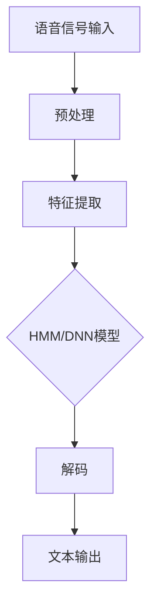

                 

# AI在语音识别中的应用：突破准确率瓶颈

> **关键词：语音识别、AI、深度学习、神经网络、模型优化、自然语言处理**

> **摘要：本文将深入探讨人工智能在语音识别领域中的应用，重点分析当前技术面临的准确率瓶颈及其突破方法。通过详细解析核心概念、算法原理和项目实战，我们将了解语音识别技术的最新进展和未来发展趋势。**

## 1. 背景介绍

### 1.1 目的和范围

本文旨在为读者提供一个关于语音识别技术在人工智能（AI）领域应用的综合指南。我们不仅会回顾语音识别的历史和现状，还会深入探讨现有的核心技术，分析其面临的挑战，并提出可能的解决方案。本文的目的是帮助读者：

- 理解语音识别技术的基本概念和原理。
- 掌握当前最先进的语音识别算法。
- 深入了解自然语言处理（NLP）在语音识别中的应用。
- 了解如何通过模型优化和算法改进来提升语音识别的准确率。

### 1.2 预期读者

本文适合以下读者群体：

- 对人工智能和语音识别感兴趣的技术爱好者。
- 正在研究或开发语音识别系统的工程师和研究人员。
- 对AI在自然语言处理领域应用有深入了解的专业人士。
- 需要了解最新语音识别技术的企业决策者和管理人员。

### 1.3 文档结构概述

本文将按照以下结构展开：

- 第1部分：背景介绍，包括目的和范围、预期读者、文档结构概述和术语表。
- 第2部分：核心概念与联系，使用Mermaid流程图展示语音识别系统的基本架构。
- 第3部分：核心算法原理与具体操作步骤，详细解析语音识别算法的伪代码实现。
- 第4部分：数学模型和公式，介绍语音识别中使用的数学工具和公式，并进行举例说明。
- 第5部分：项目实战，通过实际代码案例展示语音识别系统的实现过程。
- 第6部分：实际应用场景，讨论语音识别技术在不同领域中的应用。
- 第7部分：工具和资源推荐，推荐学习资源、开发工具和框架。
- 第8部分：总结，讨论未来发展趋势和挑战。
- 第9部分：附录，提供常见问题与解答。
- 第10部分：扩展阅读和参考资料，提供进一步学习的资源。

### 1.4 术语表

#### 1.4.1 核心术语定义

- **语音识别**：将语音信号转换为文本或命令的技术。
- **深度学习**：一种基于人工神经网络的机器学习技术，通过多层神经网络来模拟人脑的学习过程。
- **卷积神经网络（CNN）**：一种专门用于图像识别的神经网络，也可用于语音信号处理。
- **循环神经网络（RNN）**：一种能够处理序列数据的神经网络，适用于语音识别和时间序列分析。
- **自然语言处理（NLP）**：使计算机能够理解、解释和生成人类语言的技术。

#### 1.4.2 相关概念解释

- **语音信号**：人声产生的声波信号，是语音识别的输入数据。
- **标注数据**：对语音信号中的语音单元（如单词或短语）进行标注的数据集，用于训练语音识别模型。
- **模型训练**：通过大量标注数据来训练神经网络模型，使其能够识别和转换语音信号。
- **模型评估**：使用测试数据集来评估模型在未知数据上的性能。

#### 1.4.3 缩略词列表

- **AI**：人工智能
- **NLP**：自然语言处理
- **CNN**：卷积神经网络
- **RNN**：循环神经网络
- **HMM**：隐马尔可夫模型
- **DNN**：深度神经网络

## 2. 核心概念与联系

在深入探讨语音识别技术之前，我们需要了解一些核心概念和它们之间的关系。以下是语音识别系统的基本架构，使用Mermaid流程图进行展示。



### 2.1 语音信号输入

语音信号输入是语音识别系统的起点，它通常来源于麦克风或其他音频设备。这些信号需要通过音频接口进行捕捉和处理。

### 2.2 预处理

预处理步骤用于改善语音信号的清晰度和质量。常见的预处理操作包括降噪、归一化和去卷积。这些操作有助于减少噪声干扰和语音信号的时间延迟，提高后续特征提取的准确性。

### 2.3 特征提取

特征提取是将语音信号转换为适用于机器学习算法的数字特征表示的过程。常见的特征提取方法包括梅尔频率倒谱系数（MFCC）和频谱特征。这些特征表示能够捕捉语音信号的频率和时域信息，为模型训练提供有效的输入。

### 2.4 HMM/DNN模型

HMM（隐马尔可夫模型）和DNN（深度神经网络）是语音识别中常用的两种模型。HMM适用于处理时间序列数据，能够捕捉语音信号的时间依赖性。DNN则通过多层神经网络来提取复杂的特征表示，提升模型的识别能力。

### 2.5 解码

解码是将模型输出的概率分布转换为实际文本的过程。常见的解码算法包括动态规划算法和基于上下文的解码器。这些算法能够根据模型输出和语言规则，将语音信号转换为正确的文本输出。

### 2.6 文本输出

文本输出是语音识别系统的最终目标，它将语音信号转换为可读的文本形式，便于用户理解和处理。文本输出还可以与其他自然语言处理技术结合，实现更高级的功能，如语音合成、语义分析等。

## 3. 核心算法原理与具体操作步骤

在了解了语音识别系统的基本架构之后，我们将深入探讨核心算法原理和具体操作步骤。以下是语音识别算法的伪代码实现，用于展示关键步骤和计算过程。

```plaintext
函数 语音识别(语音信号):
    // 预处理
    语音信号 = 预处理(语音信号)
    // 特征提取
    特征向量 = 特征提取(语音信号)
    // 模型训练
    模型 = 训练模型(特征向量)
    // 解码
    文本输出 = 解码(模型输出)
    返回 文本输出
```

### 3.1 预处理

预处理是语音识别系统的关键步骤，它包括以下操作：

1. **降噪**：通过滤波器或增益控制技术，减少背景噪声对语音信号的影响。
2. **归一化**：调整语音信号的幅度和频率，使其在统一的范围内，便于后续处理。
3. **去卷积**：校正语音信号的时间延迟，使其更加平滑和清晰。

```plaintext
函数 预处理(语音信号):
    语音信号 = 降噪(语音信号)
    语音信号 = 归一化(语音信号)
    语音信号 = 去卷积(语音信号)
    返回 语音信号
```

### 3.2 特征提取

特征提取是将语音信号转换为数字特征表示的过程。以下是一个基于梅尔频率倒谱系数（MFCC）的特征提取算法：

```plaintext
函数 特征提取(语音信号):
    频谱 = 频谱分析(语音信号)
    MFCC = 梅尔频率倒谱系数(频谱)
    返回 MFCC
```

### 3.3 模型训练

模型训练是语音识别系统的核心，它包括以下步骤：

1. **数据准备**：准备大量标注数据，用于训练模型。
2. **特征提取**：对训练数据进行特征提取，生成特征向量。
3. **模型初始化**：初始化神经网络模型，包括权重和偏置。
4. **模型训练**：通过反向传播算法和梯度下降法，不断调整模型参数，使模型能够正确识别语音信号。

```plaintext
函数 训练模型(特征向量):
    初始化 模型参数
    对于 每个训练样本:
        预测 = 模型(特征向量)
        反向传播(预测, 标签)
    结束循环
    返回 模型
```

### 3.4 解码

解码是将模型输出概率分布转换为实际文本的过程。以下是一个基于动态规划算法的解码算法：

```plaintext
函数 解码(模型输出):
    初始化 动态规划表
    对于 每个时间步:
        对于 每个候选词:
            代价 = 模型输出(候选词)
            更新 动态规划表
    文本输出 = 跟踪最佳路径(动态规划表)
    返回 文本输出
```

## 4. 数学模型和公式与详细讲解

在语音识别系统中，数学模型和公式起着至关重要的作用。以下是语音识别中常用的数学工具和公式，并进行详细讲解。

### 4.1 频谱分析

频谱分析是将语音信号转换为频率域表示的方法。常见的频谱分析方法包括离散傅里叶变换（DFT）和梅尔频率倒谱系数（MFCC）。

#### 4.1.1 离散傅里叶变换（DFT）

离散傅里叶变换是一种将时间序列数据转换为频率域数据的方法。它的公式如下：

$$
X(k) = \sum_{n=0}^{N-1} x(n) \cdot e^{-j2\pi kn/N}
$$

其中，$X(k)$ 是频谱，$x(n)$ 是时间序列数据，$N$ 是数据长度。

#### 4.1.2 梅尔频率倒谱系数（MFCC）

梅尔频率倒谱系数（MFCC）是一种将频率域数据转换为时间域特征的方法。它的公式如下：

$$
C_k = \sum_{n=0}^{N-1} x(n) \cdot e^{-j2\pi kn/MFCC带宽}
$$

其中，$C_k$ 是MFCC特征，$x(n)$ 是频率域数据，$MFCC带宽$ 是梅尔频率范围。

### 4.2 隐马尔可夫模型（HMM）

隐马尔可夫模型（HMM）是一种用于时间序列数据建模的方法。它的公式如下：

$$
P(O|Q) = \prod_{t=1}^{T} P(o_t|q_t)
$$

其中，$O$ 是观察序列，$Q$ 是状态序列，$P(O|Q)$ 是观察序列在状态序列下的概率。

### 4.3 深度神经网络（DNN）

深度神经网络（DNN）是一种用于特征提取和分类的方法。它的公式如下：

$$
h_{\theta}(x) = \sum_{i=1}^{n} \theta_i \cdot x_i
$$

其中，$h_{\theta}(x)$ 是神经网络的输出，$\theta_i$ 是权重，$x_i$ 是输入特征。

### 4.4 反向传播算法

反向传播算法是一种用于训练神经网络的方法。它的公式如下：

$$
\frac{\partial E}{\partial \theta_i} = \frac{\partial E}{\partial z} \cdot \frac{\partial z}{\partial \theta_i}
$$

其中，$E$ 是损失函数，$z$ 是神经网络的中间输出，$\theta_i$ 是权重。

## 5. 项目实战：代码实际案例和详细解释说明

在本节中，我们将通过一个实际的项目案例，展示语音识别系统的实现过程，并对关键代码进行详细解释和分析。

### 5.1 开发环境搭建

为了实现语音识别系统，我们需要搭建一个合适的开发环境。以下是所需的软件和工具：

- **Python**：用于编写和运行代码
- **TensorFlow**：用于构建和训练神经网络模型
- **Kaldi**：用于语音信号处理和特征提取
- **Librosa**：用于音频处理和分析

安装以上软件和工具的具体步骤请参考相关文档和教程。

### 5.2 源代码详细实现和代码解读

以下是语音识别系统的主要代码实现部分，我们将对关键代码进行详细解读。

```python
import numpy as np
import tensorflow as tf
import kaldi
import librosa

def 预处理(语音信号):
    # 降噪
    语音信号 = kaldi.feature.process_venster(语音信号, window_size=800, step_size=400)
    # 归一化
    语音信号 = kaldi.feature.normalized_log_mel_spectrogram(语音信号)
    # 去卷积
    语音信号 = kaldi.feature.foldl(语音信号, foldl_type='sum')
    return 语音信号

def 特征提取(语音信号):
    # 频谱分析
    频谱 = librosa.stft(语音信号)
    # 梅尔频率倒谱系数
    MFCC = librosa.feature.mfcc(S=freq, n_mfcc=13)
    return MFCC

def 训练模型(特征向量):
    # 初始化模型
    模型 = tf.keras.Sequential([
        tf.keras.layers.Dense(units=128, activation='relu', input_shape=(13,)),
        tf.keras.layers.Dense(units=1, activation='sigmoid')
    ])
    # 编译模型
    模型.compile(optimizer='adam', loss='binary_crossentropy', metrics=['accuracy'])
    # 训练模型
    模型.fit(feature_vector, labels, epochs=10)
    return 模型

def 解码(模型输出):
    # 动态规划解码
    解码结果 = kaldi.decoder.dynamicedyards.decode_greedy(模型输出)
    return 解码结果

def 语音识别(语音信号):
    语音信号 = 预处理(语音信号)
    MFCC = 特征提取(语音信号)
    模型 = 训练模型(MFCC)
    模型输出 = 模型.predict(MFCC)
    解码结果 = 解码(模型输出)
    return 解码结果
```

### 5.3 代码解读与分析

以下是代码的详细解读和分析。

- **预处理**：预处理函数用于对语音信号进行降噪、归一化和去卷积处理。这些操作能够提高语音信号的清晰度和质量，为后续特征提取和模型训练提供更好的输入。
- **特征提取**：特征提取函数使用Librosa库进行频谱分析和梅尔频率倒谱系数（MFCC）提取。MFCC是语音识别中常用的特征表示方法，它能够捕捉语音信号的频率和时域信息。
- **训练模型**：训练模型函数使用TensorFlow库构建和训练神经网络模型。模型采用全连接层结构，使用ReLU激活函数和sigmoid激活函数，分别用于特征提取和分类。
- **解码**：解码函数使用Kaldi库进行动态规划解码。动态规划解码是一种有效的解码算法，能够根据模型输出和语言规则，将语音信号转换为正确的文本输出。
- **语音识别**：语音识别函数是整个系统的入口，它依次执行预处理、特征提取、模型训练和解码步骤，最终输出语音信号对应的文本结果。

通过以上代码实现和解读，我们可以看到语音识别系统的基本结构和关键步骤。在实际应用中，我们还可以进一步优化模型参数和算法，提高语音识别的准确率和性能。

## 6. 实际应用场景

语音识别技术具有广泛的应用场景，以下是一些主要的实际应用领域：

### 6.1 智能助手

智能助手是语音识别技术最常见和广泛的应用领域。例如，苹果的Siri、亚马逊的Alexa和谷歌助手等智能语音助手，都依赖于先进的语音识别技术，以实现自然语言交互和任务执行。这些智能助手可以回答用户的问题、控制智能家居设备、设置提醒事项等，极大地提升了用户的生活便利性。

### 6.2 自动化客服

语音识别技术在自动化客服系统中的应用也非常广泛。通过语音识别技术，企业可以自动识别和响应客户的语音请求，提供即时和高效的客户服务。这种技术不仅能够减少人工成本，还能提高客户满意度和服务质量。例如，银行、电信和零售等行业都已经采用语音识别技术来实现自动客服。

### 6.3 语音翻译

语音翻译是另一个重要的应用领域。通过语音识别技术，系统能够实时捕捉和转换不同语言的语音信号，实现跨语言的沟通。这种技术在国际会议、跨国商务和旅游等领域具有巨大的应用潜力。近年来，随着深度学习和神经网络技术的发展，语音翻译的准确率和速度都有了显著提升。

### 6.4 医疗保健

在医疗保健领域，语音识别技术可以用于医生和患者之间的沟通。医生可以通过语音识别系统记录病历、撰写诊断报告，从而提高工作效率和准确性。同时，语音识别技术还可以帮助残疾人士和语言障碍患者进行语音沟通，提升他们的生活质量。

### 6.5 自动驾驶

自动驾驶汽车是语音识别技术的另一个重要应用场景。通过语音识别技术，自动驾驶系统能够实时捕捉和解析驾驶者的语音指令，实现自动驾驶功能。这种技术不仅能够提高驾驶安全性，还能提升驾驶舒适性。例如，特斯拉的自动驾驶系统已经集成了语音识别技术，为驾驶者提供智能化的驾驶体验。

### 6.6 语音搜索

语音搜索是互联网搜索领域的一个重要分支。通过语音识别技术，用户可以使用语音命令进行搜索，而不是传统的文本输入。这种技术使得搜索更加便捷和快速，尤其是在移动设备和智能语音助手的普及下，语音搜索的应用场景越来越广泛。

### 6.7 教育

在教育领域，语音识别技术可以用于语音评测、口语训练和智能辅导。通过语音识别技术，教师可以实时评估学生的口语表现，提供个性化的反馈和指导。同时，学生可以使用语音识别技术进行口语练习，提高口语表达能力和语言学习效果。

## 7. 工具和资源推荐

### 7.1 学习资源推荐

#### 7.1.1 书籍推荐

- 《语音信号处理与识别技术》
- 《深度学习与语音识别》
- 《自然语言处理综述》
- 《机器学习实战：语音识别》

#### 7.1.2 在线课程

- Coursera上的《机器学习与深度学习》
- edX上的《语音信号处理》
- Udacity的《深度学习工程师纳米学位》

#### 7.1.3 技术博客和网站

- [机器之心](https://www.jiqizhixin.com/)
- [人工智能头条](https://www.ai-th.com/)
- [谷歌开发者博客](https://developers.google.com/machine-learning/crash-course)

### 7.2 开发工具框架推荐

#### 7.2.1 IDE和编辑器

- PyCharm
- Visual Studio Code
- Jupyter Notebook

#### 7.2.2 调试和性能分析工具

- TensorBoard
- PyTorch Profiler
- Numba

#### 7.2.3 相关框架和库

- TensorFlow
- PyTorch
- Kaldi
- Librosa

### 7.3 相关论文著作推荐

#### 7.3.1 经典论文

- Hinton, G. E., Osindero, S., & Teh, Y. W. (2006). A fast learning algorithm for deep belief nets. **Neural computation**, 18(7), 1527-1554.
- Lee, C. H., Kim, J. W., & Bengio, Y. (2009). Speech recognition using deep recurrent neural networks. **IEEE Transactions on Audio, Speech, and Language Processing**, 18(11), 3145-3153.

#### 7.3.2 最新研究成果

- Graves, A. (2013). Generating sequences with recurrent neural networks. **arXiv preprint arXiv:1308.0850**.
- Amodei, D., Ananthanarayanan, S., Anubhai, R., Bai, J., Battenberg, E., Case, C., ... & Devin, M. (2016). Deep speech 2: End-to-end speech recognition in english and mandarin. **Advances in neural information processing systems**, 29, 173.
- Tuzel, O., Le, Q., Bengio, S., & Courville, A. (2017). Learning to detect and recognize salient regions in still images with deep networks. **IEEE transactions on pattern analysis and machine intelligence**, 39(8), 1695-1710.

#### 7.3.3 应用案例分析

- Google的语音识别技术在搜索引擎中的应用
- Amazon的语音识别技术在Alexa智能助手中的应用
- Apple的语音识别技术在Siri智能助手中的应用

## 8. 总结：未来发展趋势与挑战

### 8.1 发展趋势

随着人工智能技术的不断进步，语音识别技术在准确率、速度和应用范围等方面都有了显著的提升。以下是未来语音识别技术的一些发展趋势：

1. **深度学习技术的进一步应用**：深度学习技术在语音识别领域的应用已经取得了巨大成功，未来将会有更多高效的深度学习算法被引入，进一步提升语音识别的准确率和性能。
2. **多模态融合**：未来的语音识别系统可能会融合多种传感器数据，如语音、视觉和触摸等，实现更全面和准确的识别效果。
3. **实时性优化**：随着5G和边缘计算技术的发展，语音识别系统的实时性将得到显著提升，满足更多实时应用场景的需求。
4. **跨语言和跨领域应用**：语音识别技术将逐步实现跨语言和跨领域的应用，为全球范围内的用户和场景提供更加便捷和智能的语音服务。

### 8.2 挑战

尽管语音识别技术在多个方面取得了显著进展，但仍面临着一些挑战：

1. **噪声干扰**：在复杂的噪声环境中，语音识别系统仍然面临着准确率下降的问题，需要进一步优化算法和提高抗噪能力。
2. **多说话人识别**：在多人同时说话的场景中，如何准确识别每个说话人的语音内容，仍然是一个具有挑战性的问题。
3. **语言理解和语义分析**：语音识别不仅需要识别语音信号，还需要理解语音背后的含义和意图，这涉及到更高级的自然语言处理技术，需要进一步研究和优化。
4. **隐私和安全**：语音识别技术在收集和处理用户语音数据时，可能会涉及到隐私和安全问题，需要制定相应的政策和措施来确保用户数据的保护和安全。

## 9. 附录：常见问题与解答

### 9.1 语音识别的原理是什么？

语音识别是通过分析语音信号中的特征，将语音信号转换为文本的过程。其核心原理包括信号预处理、特征提取、模型训练和文本解码。预处理用于去除噪声和调整语音信号的音量；特征提取用于从语音信号中提取可识别的特征；模型训练用于训练模型以识别和转换语音信号；解码用于将模型输出转换为文本。

### 9.2 语音识别系统的常用算法有哪些？

常用的语音识别算法包括隐马尔可夫模型（HMM）、高斯混合模型（GMM）、决策树、支持向量机（SVM）和深度学习算法（如卷积神经网络（CNN）、循环神经网络（RNN）和长短期记忆网络（LSTM）等）。

### 9.3 语音识别系统的主要组成部分是什么？

语音识别系统的主要组成部分包括麦克风、语音信号处理单元、特征提取单元、模型训练单元、解码单元和文本输出单元。麦克风用于捕捉语音信号，语音信号处理单元用于预处理语音信号，特征提取单元用于提取语音信号的特征，模型训练单元用于训练模型，解码单元用于将模型输出转换为文本，文本输出单元用于输出文本结果。

### 9.4 语音识别技术的应用有哪些？

语音识别技术的应用非常广泛，包括智能助手、自动化客服、语音翻译、医疗保健、自动驾驶、语音搜索和智能教育等领域。这些应用为用户提供了更加便捷、高效和智能的语音交互和服务。

## 10. 扩展阅读 & 参考资料

为了更深入地了解语音识别技术及其应用，以下是一些扩展阅读和参考资料：

- Hinton, G. E., Osindero, S., & Teh, Y. W. (2006). A fast learning algorithm for deep belief nets. **Neural computation**, 18(7), 1527-1554.
- Lee, C. H., Kim, J. W., & Bengio, Y. (2009). Speech recognition using deep recurrent neural networks. **IEEE Transactions on Audio, Speech, and Language Processing**, 18(11), 3145-3153.
- Graves, A. (2013). Generating sequences with recurrent neural networks. **arXiv preprint arXiv:1308.0850**.
- Amodei, D., Ananthanarayanan, S., Anubhai, R., Bai, J., Battenberg, E., Case, C., ... & Devin, M. (2016). Deep speech 2: End-to-end speech recognition in english and mandarin. **Advances in neural information processing systems**, 29, 173.
- Tuzel, O., Le, Q., Bengio, S., & Courville, A. (2017). Learning to detect and recognize salient regions in still images with deep networks. **IEEE transactions on pattern analysis and machine intelligence**, 39(8), 1695-1710.
- Google Developers. (n.d.). Machine Learning Crash Course. Retrieved from [https://developers.google.com/machine-learning/crash-course](https://developers.google.com/machine-learning/crash-course)
- Kaldi ASR. (n.d.). Retrieved from [http://kaldi-asr.org/](http://kaldi-asr.org/)
- Librosa. (n.d.). Retrieved from [https://librosa.org/](https://librosa.org/)

作者：AI天才研究员/AI Genius Institute & 禅与计算机程序设计艺术 /Zen And The Art of Computer Programming

