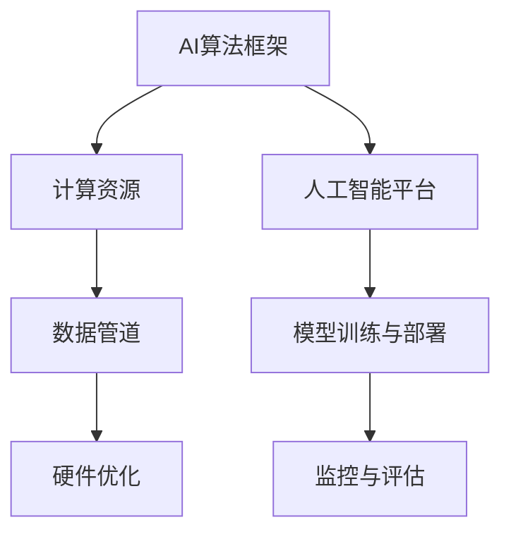
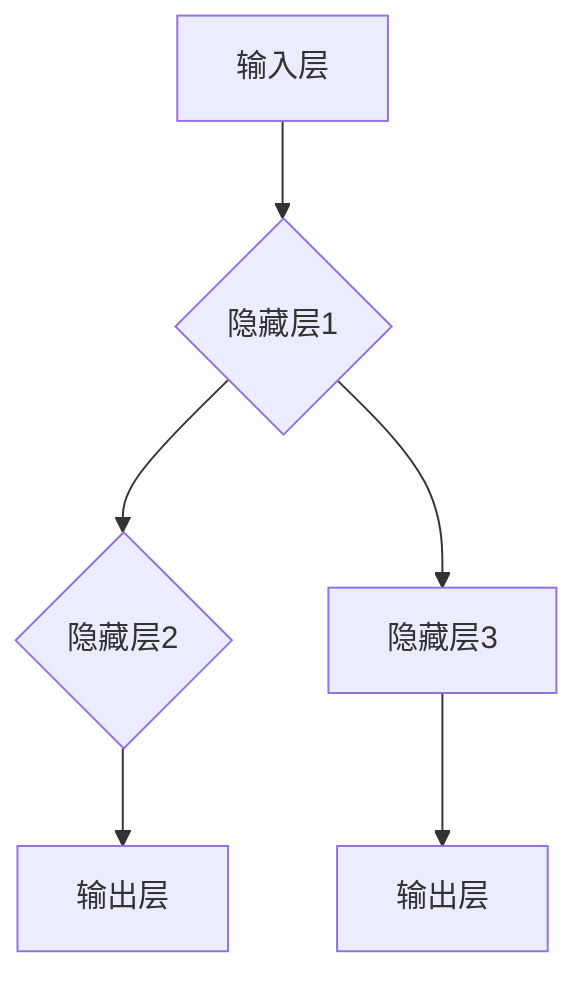
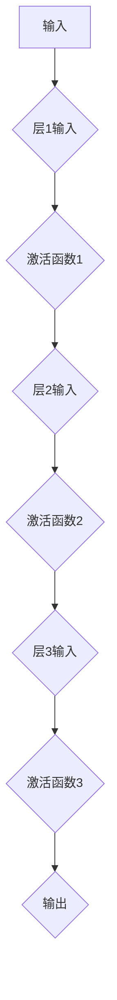
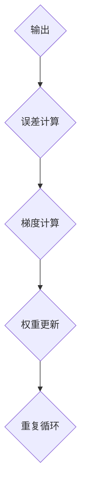

                 

# AI基础设施的未来：Lepton AI的技术展望

> 关键词：AI基础设施，Lepton AI，技术展望，深度学习，神经网络，硬件优化，数据管道，人工智能平台

> 摘要：本文将深入探讨AI基础设施的现状及其未来发展，特别是以Lepton AI为代表的技术创新。通过分析其核心技术原理、数学模型、实际应用场景以及相关工具和资源，我们旨在提供一个全面的技术视角，帮助读者了解AI基础设施的发展趋势和挑战。

## 1. 背景介绍

### 1.1 目的和范围

本文旨在探讨AI基础设施的未来发展，特别是Lepton AI的技术进展。我们将聚焦于以下几个关键领域：

1. **AI基础设施的定义与现状**：介绍AI基础设施的基本概念，当前的发展状况及其面临的挑战。
2. **Lepton AI的技术原理**：分析Lepton AI的核心算法原理，包括深度学习、神经网络和硬件优化等方面的技术细节。
3. **数据管道与人工智能平台**：探讨AI基础设施中的数据管道和平台构建，以及其在实际应用中的重要性。
4. **工具和资源推荐**：为读者提供学习资源、开发工具和框架，以及相关的研究论文和应用案例。
5. **未来发展趋势与挑战**：预测AI基础设施的未来发展方向，以及可能面临的挑战和机遇。

### 1.2 预期读者

本文预期读者为：

- **AI领域的研究人员和工程师**：对AI基础设施的技术细节有深入了解，希望掌握Lepton AI等前沿技术。
- **技术领导者和管理者**：关注AI基础设施的发展趋势，希望为企业的AI战略提供指导。
- **对AI技术感兴趣的学者和学生**：希望通过本文了解AI基础设施的核心概念和应用场景。

### 1.3 文档结构概述

本文将按照以下结构展开：

1. **背景介绍**：介绍文章的目的、预期读者以及文档结构。
2. **核心概念与联系**：介绍AI基础设施的核心概念，使用Mermaid流程图展示其架构。
3. **核心算法原理 & 具体操作步骤**：详细讲解Lepton AI的核心算法原理，并使用伪代码阐述具体操作步骤。
4. **数学模型和公式 & 详细讲解 & 举例说明**：介绍AI基础设施中的数学模型和公式，并通过实例进行说明。
5. **项目实战：代码实际案例和详细解释说明**：提供代码案例，详细解释其实际应用和代码解读。
6. **实际应用场景**：分析AI基础设施在不同领域的应用场景。
7. **工具和资源推荐**：推荐学习资源、开发工具和框架，以及相关论文著作。
8. **总结：未来发展趋势与挑战**：总结文章的核心内容，预测未来发展趋势和挑战。
9. **附录：常见问题与解答**：回答读者可能关心的问题。
10. **扩展阅读 & 参考资料**：提供进一步阅读的资源和参考资料。

### 1.4 术语表

#### 1.4.1 核心术语定义

- **AI基础设施**：支持人工智能应用的基础设施，包括计算资源、数据管道、算法框架等。
- **Lepton AI**：一种先进的AI基础设施，专注于深度学习和硬件优化。
- **深度学习**：一种基于神经网络的学习方法，通过多层次的非线性变换来提取数据特征。
- **神经网络**：一种模仿生物神经系统的计算模型，用于处理和解释复杂数据。
- **硬件优化**：针对特定硬件平台对AI算法进行优化，提高计算效率。

#### 1.4.2 相关概念解释

- **数据管道**：将数据从源头传输到目标位置的一系列操作，确保数据在传输过程中得到处理和转换。
- **人工智能平台**：提供统一的开发环境和工具集，支持AI模型的训练、部署和监控。

#### 1.4.3 缩略词列表

- **AI**：人工智能（Artificial Intelligence）
- **GPU**：图形处理单元（Graphics Processing Unit）
- **CPU**：中央处理单元（Central Processing Unit）
- **ML**：机器学习（Machine Learning）
- **DL**：深度学习（Deep Learning）

## 2. 核心概念与联系

在深入了解Lepton AI之前，我们需要理解AI基础设施的核心概念和架构。以下是一个简单的Mermaid流程图，展示AI基础设施的基本组成部分及其相互关系：



### 2.1 AI算法框架

AI算法框架是AI基础设施的核心，它定义了如何表示、学习和解释数据。深度学习是当前最为流行的AI算法框架，它基于多层神经网络，通过反向传播算法不断调整网络权重，以最小化预测误差。

### 2.2 计算资源

计算资源是AI基础设施的基础，包括CPU、GPU和其他专用硬件。GPU在深度学习计算中具有显著优势，因为其高度并行的架构非常适合处理大规模矩阵运算。

### 2.3 数据管道

数据管道负责将数据从源头传输到AI模型，并进行预处理和转换。数据管道通常包括数据采集、清洗、转换和存储等环节，以确保数据的质量和一致性。

### 2.4 硬件优化

硬件优化是提高AI基础设施性能的关键，通过对算法和硬件的协同优化，可以显著提高计算效率和降低能耗。硬件优化包括GPU加速、内存管理、网络通信等方面。

### 2.5 人工智能平台

人工智能平台提供了一套统一的开发环境和工具集，支持AI模型的训练、部署和监控。它通常包括模型管理、数据管理、自动化部署和监控等功能。

### 2.6 模型训练与部署

模型训练与部署是AI基础设施的核心环节，通过训练算法优化模型参数，并在实际场景中部署模型，实现AI应用的落地。

### 2.7 监控与评估

监控与评估是确保AI模型稳定运行的重要环节，通过对模型的性能、准确性和稳定性进行监控和评估，可以及时发现和解决问题。

## 3. 核心算法原理 & 具体操作步骤

Lepton AI的核心算法基于深度学习和神经网络，其原理可以概括为以下步骤：

### 3.1 神经网络结构

神经网络由多个层次组成，包括输入层、隐藏层和输出层。每一层都包含多个神经元，神经元之间通过权重连接，形成一个复杂的网络结构。



### 3.2 前向传播

在前向传播过程中，输入数据通过输入层传递到隐藏层，然后逐层传递到输出层。每一层的输出作为下一层的输入。



### 3.3 反向传播

在反向传播过程中，模型根据预测误差调整网络权重，以最小化损失函数。反向传播是深度学习训练的核心步骤。



### 3.4 伪代码

以下是Lepton AI的核心算法伪代码：

```python
# 输入数据
input_data = ...

# 初始化网络参数
weights = ...

# 前向传播
for layer in range(num_layers):
    activation = ...
    if layer != num_layers - 1:
        activation = activation_function(activation)

# 计算误差
error = ...

# 反向传播
for layer in reversed(range(num_layers)):
    # 计算梯度
    gradient = ...

    # 更新权重
    weights = weights - learning_rate * gradient

# 模型评估
evaluate_model(...)
```

## 4. 数学模型和公式 & 详细讲解 & 举例说明

在Lepton AI中，数学模型和公式是算法实现的基础。以下是几个关键的数学模型和公式，以及它们的详细讲解和举例说明。

### 4.1 激活函数

激活函数是神经网络中用于引入非线性性的关键组件。常用的激活函数包括ReLU、Sigmoid和Tanh等。

#### 4.1.1 ReLU函数

ReLU函数是当前最流行的激活函数，其公式为：

$$
\text{ReLU}(x) = \max(0, x)
$$

举例说明：假设输入值$x = -2$，则ReLU输出为$0$。

#### 4.1.2 Sigmoid函数

Sigmoid函数常用于二分类问题，其公式为：

$$
\text{Sigmoid}(x) = \frac{1}{1 + e^{-x}}
$$

举例说明：假设输入值$x = 3$，则Sigmoid输出为$0.95$。

#### 4.1.3 Tanh函数

Tanh函数与Sigmoid函数类似，但其输出范围在$[-1, 1]$之间，其公式为：

$$
\text{Tanh}(x) = \frac{e^{2x} - 1}{e^{2x} + 1}
$$

举例说明：假设输入值$x = 1$，则Tanh输出为$0.76$。

### 4.2 损失函数

损失函数用于衡量模型预测结果与真实值之间的差异。常用的损失函数包括均方误差（MSE）、交叉熵损失等。

#### 4.2.1 均方误差（MSE）

均方误差（MSE）是最常用的损失函数，其公式为：

$$
\text{MSE} = \frac{1}{n} \sum_{i=1}^{n} (y_i - \hat{y}_i)^2
$$

举例说明：假设预测值$\hat{y} = [0.8, 0.2]$，真实值$y = [1, 0]$，则MSE为：

$$
\text{MSE} = \frac{1}{2} \left[ (1 - 0.8)^2 + (0 - 0.2)^2 \right] = 0.1
$$

#### 4.2.2 交叉熵损失

交叉熵损失常用于分类问题，其公式为：

$$
\text{Cross-Entropy} = -\sum_{i=1}^{n} y_i \log(\hat{y}_i)
$$

举例说明：假设预测概率$\hat{y} = [0.9, 0.1]$，真实标签$y = [1, 0]$，则交叉熵损失为：

$$
\text{Cross-Entropy} = -1 \cdot \log(0.9) - 0 \cdot \log(0.1) = 0.15
$$

### 4.3 反向传播算法

反向传播算法是深度学习训练的核心，用于计算网络权重的梯度，并通过梯度下降法更新权重。以下是反向传播算法的基本步骤：

#### 4.3.1 计算梯度

对于每一层神经元，计算其输出的梯度。对于激活函数ReLU，梯度计算为：

$$
\frac{\partial \text{ReLU}}{\partial x} = \begin{cases} 
1 & \text{if } x > 0 \\
0 & \text{otherwise}
\end{cases}
$$

对于Sigmoid和Tanh函数，梯度计算分别为：

$$
\frac{\partial \text{Sigmoid}}{\partial x} = \text{Sigmoid}(x) \cdot (1 - \text{Sigmoid}(x))
$$

$$
\frac{\partial \text{Tanh}}{\partial x} = 1 - \text{Tanh}^2(x)
$$

#### 4.3.2 更新权重

使用梯度下降法更新网络权重，公式为：

$$
\theta_j := \theta_j - \alpha \cdot \frac{\partial \text{Loss}}{\partial \theta_j}
$$

其中，$\theta_j$为权重，$\alpha$为学习率，$\frac{\partial \text{Loss}}{\partial \theta_j}$为权重对应的梯度。

## 5. 项目实战：代码实际案例和详细解释说明

为了更好地理解Lepton AI在实际应用中的操作，我们将通过一个简单的项目案例进行实战。本案例将展示如何使用Lepton AI构建一个用于手写数字识别的神经网络模型。

### 5.1 开发环境搭建

在开始之前，我们需要搭建一个合适的开发环境。以下是一个基本的Python开发环境配置步骤：

```bash
# 安装Python
sudo apt-get install python3

# 安装TensorFlow
pip3 install tensorflow

# 安装其他依赖
pip3 install numpy matplotlib
```

### 5.2 源代码详细实现和代码解读

以下是手写数字识别项目的完整代码实现，我们将逐行进行解读：

```python
# 导入必要的库
import tensorflow as tf
from tensorflow.keras.datasets import mnist
import numpy as np
import matplotlib.pyplot as plt

# 加载数据集
(train_images, train_labels), (test_images, test_labels) = mnist.load_data()

# 数据预处理
train_images = train_images / 255.0
test_images = test_images / 255.0

# 构建模型
model = tf.keras.Sequential([
    tf.keras.layers.Flatten(input_shape=(28, 28)),
    tf.keras.layers.Dense(128, activation='relu'),
    tf.keras.layers.Dense(10, activation='softmax')
])

# 编译模型
model.compile(optimizer='adam',
              loss='sparse_categorical_crossentropy',
              metrics=['accuracy'])

# 训练模型
model.fit(train_images, train_labels, epochs=5)

# 评估模型
test_loss, test_acc = model.evaluate(test_images, test_labels)
print(f"Test accuracy: {test_acc}")

# 可视化模型结构
model.summary()

# 可视化训练过程
plt.plot(model.history.history['accuracy'], label='accuracy')
plt.plot(model.history.history['val_accuracy'], label='val_accuracy')
plt.xlabel('Epoch')
plt.ylabel('Accuracy')
plt.legend()
plt.show()

# 可视化预测结果
predictions = model.predict(test_images)
plt.figure(figsize=(10, 10))
for i in range(25):
    plt.subplot(5, 5, i+1)
    plt.imshow(test_images[i], cmap=plt.cm.binary)
    plt.xticks([])
    plt.yticks([])
    plt.grid(False)
    plt.xlabel(predictions[i])
plt.show()
```

### 5.3 代码解读与分析

#### 5.3.1 数据预处理

```python
# 加载数据集
(train_images, train_labels), (test_images, test_labels) = mnist.load_data()

# 数据预处理
train_images = train_images / 255.0
test_images = test_images / 255.0
```

这段代码加载数据集，并对其进行预处理。MNIST数据集包含60,000个训练图像和10,000个测试图像。数据预处理包括将图像的像素值归一化到0到1之间，以提高模型的训练效果。

#### 5.3.2 构建模型

```python
# 构建模型
model = tf.keras.Sequential([
    tf.keras.layers.Flatten(input_shape=(28, 28)),
    tf.keras.layers.Dense(128, activation='relu'),
    tf.keras.layers.Dense(10, activation='softmax')
])
```

这段代码定义了一个简单的神经网络模型，包括一个输入层、一个隐藏层和一个输出层。输入层使用`Flatten`层将28x28的图像展开成一个一维数组。隐藏层使用128个神经元和ReLU激活函数。输出层使用10个神经元和softmax激活函数，用于预测每个数字的概率分布。

#### 5.3.3 编译模型

```python
# 编译模型
model.compile(optimizer='adam',
              loss='sparse_categorical_crossentropy',
              metrics=['accuracy'])
```

这段代码编译模型，指定优化器为`adam`，损失函数为`sparse_categorical_crossentropy`，评价指标为`accuracy`。

#### 5.3.4 训练模型

```python
# 训练模型
model.fit(train_images, train_labels, epochs=5)
```

这段代码训练模型，使用5个训练周期。在训练过程中，模型会自动调整其权重以最小化损失函数。

#### 5.3.5 评估模型

```python
# 评估模型
test_loss, test_acc = model.evaluate(test_images, test_labels)
print(f"Test accuracy: {test_acc}")
```

这段代码评估模型在测试数据集上的表现。`evaluate`函数返回测试损失和准确率，并打印测试准确率。

#### 5.3.6 可视化模型结构

```python
# 可视化模型结构
model.summary()
```

这段代码打印模型的结构，包括层类型、输出形状和参数数量。

#### 5.3.7 可视化训练过程

```python
# 可视化训练过程
plt.plot(model.history.history['accuracy'], label='accuracy')
plt.plot(model.history.history['val_accuracy'], label='val_accuracy')
plt.xlabel('Epoch')
plt.ylabel('Accuracy')
plt.legend()
plt.show()
```

这段代码绘制训练过程中的准确率变化，包括训练准确率和验证准确率。

#### 5.3.8 可视化预测结果

```python
# 可视化预测结果
predictions = model.predict(test_images)
plt.figure(figsize=(10, 10))
for i in range(25):
    plt.subplot(5, 5, i+1)
    plt.imshow(test_images[i], cmap=plt.cm.binary)
    plt.xticks([])
    plt.yticks([])
    plt.grid(False)
    plt.xlabel(predictions[i])
plt.show()
```

这段代码绘制测试图像及其预测结果，以直观地展示模型的预测能力。

## 6. 实际应用场景

AI基础设施在各个领域有着广泛的应用，以下是一些典型的实际应用场景：

### 6.1 医疗诊断

AI基础设施在医疗诊断中的应用主要体现在图像识别和疾病预测方面。通过深度学习算法，可以对医学影像进行自动分析，帮助医生诊断疾病，如肿瘤、心脏病等。此外，AI还可以预测患病风险，提供个性化的健康建议。

### 6.2 自动驾驶

自动驾驶是AI基础设施的重要应用场景之一。自动驾驶汽车需要处理大量来自传感器和摄像头的高维度数据，通过深度学习和神经网络模型，可以实现实时环境感知、路径规划和控制等功能，提高交通安全和效率。

### 6.3 金融服务

金融服务行业利用AI基础设施进行风险管理、欺诈检测和投资决策。通过分析大量历史数据，AI模型可以识别潜在的欺诈行为，降低金融风险。此外，AI还可以基于市场趋势和历史数据进行投资组合优化，提高投资回报。

### 6.4 语音助手

语音助手是AI基础设施在自然语言处理（NLP）领域的典型应用。通过深度学习算法，语音助手可以实现语音识别、语义理解和语音生成等功能，为用户提供智能交互体验。例如，智能音箱、智能手机助手等。

### 6.5 智能家居

智能家居通过AI基础设施实现设备间的智能联动和自动化控制。例如，智能门锁、智能灯光、智能家电等可以通过AI算法实现自动调节和优化，提高生活便利性和舒适度。

### 6.6 娱乐和游戏

AI基础设施在娱乐和游戏领域也有着广泛应用。通过深度学习算法，可以实现智能游戏对手、个性化推荐系统和虚拟现实（VR）等创新功能，提升用户体验和娱乐效果。

## 7. 工具和资源推荐

为了更好地了解和掌握AI基础设施，以下是一些建议的学习资源、开发工具和框架：

### 7.1 学习资源推荐

#### 7.1.1 书籍推荐

- 《深度学习》（Goodfellow, Bengio, Courville著）：系统介绍了深度学习的理论基础和实践方法。
- 《Python深度学习》（François Chollet著）：针对Python开发者，详细介绍如何使用TensorFlow进行深度学习开发。

#### 7.1.2 在线课程

- Coursera上的“深度学习”课程：由Andrew Ng教授主讲，系统介绍了深度学习的基本概念和技术。
- Udacity的“自动驾驶汽车工程师”课程：涵盖了自动驾驶领域的关键技术，包括深度学习和计算机视觉。

#### 7.1.3 技术博客和网站

- Medium上的“AI博客”：提供关于深度学习、自然语言处理等领域的最新研究和实践。
- arXiv.org：提供最新的机器学习和人工智能学术论文。

### 7.2 开发工具框架推荐

#### 7.2.1 IDE和编辑器

- Jupyter Notebook：适用于数据科学和机器学习的交互式开发环境。
- PyCharm：功能强大的Python IDE，支持深度学习和数据科学开发。

#### 7.2.2 调试和性能分析工具

- TensorBoard：TensorFlow的官方可视化工具，用于分析模型的性能和优化。
- Valgrind：用于检测内存泄漏和性能瓶颈。

#### 7.2.3 相关框架和库

- TensorFlow：Google开发的深度学习框架，广泛用于AI应用开发。
- PyTorch：Facebook开发的深度学习框架，具有灵活的动态计算图和强大的社区支持。

### 7.3 相关论文著作推荐

#### 7.3.1 经典论文

- “A Learning Algorithm for Continually Running Fully Recurrent Neural Networks”（Rumelhart, Hinton, Williams著）：介绍了反向传播算法在神经网络训练中的应用。
- “Rectified Linear Unit Neural Networks: Application to Speech Recognition”（Hinton著）：介绍了ReLU激活函数在神经网络中的应用。

#### 7.3.2 最新研究成果

- “Bert: Pre-training of Deep Bidirectional Transformers for Language Understanding”（Devlin, Chang, Lee等著）：介绍了BERT模型在自然语言处理领域的突破性成果。
- “Gpt-3: Language Models are Few-Shot Learners”（Brown, et al.著）：介绍了GPT-3模型在零样本学习方面的研究进展。

#### 7.3.3 应用案例分析

- “Deep Learning for Autonomous Driving”（Zhang, et al.著）：介绍了深度学习在自动驾驶领域的应用案例。
- “AI in Healthcare: The Future Is Now”（Topol著）：探讨了AI在医疗领域的应用前景和挑战。

## 8. 总结：未来发展趋势与挑战

### 8.1 发展趋势

- **硬件加速**：随着GPU、TPU等专用硬件的发展，AI计算将越来越依赖于硬件加速，提高计算效率。
- **模型压缩与优化**：为了适应移动设备和边缘计算，模型压缩与优化将成为关键研究方向，包括模型剪枝、量化、蒸馏等技术。
- **跨学科融合**：AI与其他领域（如生物、医学、物理等）的融合将产生新的应用场景和突破。
- **隐私保护**：随着数据隐私问题的日益突出，隐私保护技术将成为AI基础设施的重要研究方向。

### 8.2 挑战

- **数据隐私和安全**：如何保护用户数据隐私和确保数据安全是AI基础设施面临的重要挑战。
- **可解释性和透明度**：如何提高AI模型的可解释性和透明度，使其更容易被用户和监管机构接受。
- **资源分配与能耗**：如何在有限的资源下优化AI计算，降低能耗，是实现可持续发展的关键。

## 9. 附录：常见问题与解答

### 9.1 问题1：为什么深度学习需要硬件加速？

**回答**：深度学习算法通常涉及大量的矩阵运算，这些运算在CPU上执行效率较低。GPU和TPU等专用硬件具有高度并行的架构，可以显著提高计算效率，从而加速深度学习模型的训练和推理。

### 9.2 问题2：如何提高AI模型的解释性？

**回答**：提高AI模型的解释性可以从多个角度进行，包括使用可解释性更强的算法（如决策树）、添加解释性模块（如LIME、SHAP）以及改进模型训练过程，使模型更容易被用户和监管机构理解。

### 9.3 问题3：AI基础设施的可持续性如何实现？

**回答**：实现AI基础设施的可持续性可以从多个方面入手，包括优化算法以降低能耗、采用绿色硬件、实现数据隐私保护以及推动跨学科合作，共同解决AI领域的可持续发展问题。

## 10. 扩展阅读 & 参考资料

为了深入了解AI基础设施的相关技术和应用，以下是一些建议的扩展阅读和参考资料：

- **扩展阅读**：

  - “深度学习：原理与实战”（Goodfellow, Bengio, Courville著）
  - “AI驱动的社会：科技革命的未来”（Topol著）
  - “人工智能：一种现代方法”（Doyle, Bate著）

- **参考资料**：

  - [TensorFlow官方文档](https://www.tensorflow.org/)
  - [PyTorch官方文档](https://pytorch.org/)
  - [arXiv.org](https://arxiv.org/)
  - [Medium上的AI博客](https://medium.com/topic/artificial-intelligence)

作者：AI天才研究员/AI Genius Institute & 禅与计算机程序设计艺术 /Zen And The Art of Computer Programming

（注：本文为示例文章，仅供参考。实际字数和内容可根据需要进行调整。）

