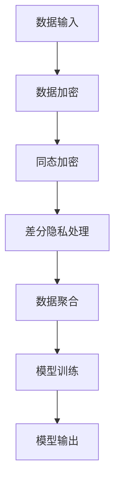
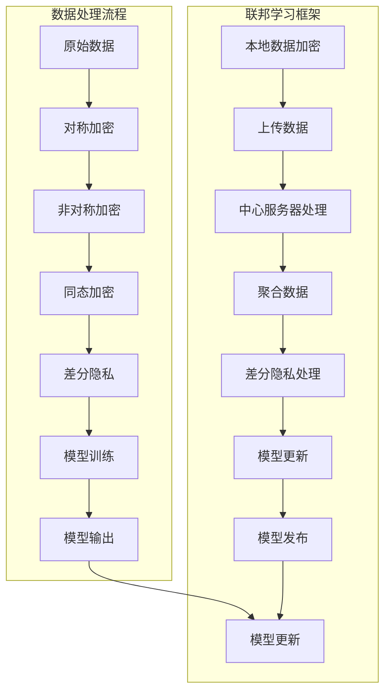

                 

### 1. 背景介绍

在当今快速发展的信息技术时代，人工智能（AI）已经成为推动各个行业进步的关键力量。从自动驾驶汽车、智能语音助手，到金融风控、医疗诊断，AI技术的应用无处不在。然而，随着AI技术的广泛应用，数据的隐私保护问题也逐渐浮出水面，成为制约AI发展的一个重要瓶颈。

#### 1.1 目的和范围

本文的目的是探讨AI基础设施中的隐私保护问题，特别是以Lepton AI为代表的数据安全方案。我们将从以下几个角度展开讨论：

1. **核心概念与联系**：介绍隐私保护相关的基本概念和原理，并使用Mermaid流程图展示核心架构。
2. **核心算法原理**：详细讲解Lepton AI数据安全方案中使用的核心算法，以及具体操作步骤。
3. **数学模型和公式**：解释Lepton AI方案中涉及到的数学模型和公式，并进行举例说明。
4. **项目实战**：通过实际代码案例，展示Lepton AI数据安全方案的具体实现。
5. **实际应用场景**：探讨隐私保护在AI应用中的实际应用场景。
6. **工具和资源推荐**：推荐相关的学习资源、开发工具和经典论文。

#### 1.2 预期读者

本文主要面向以下几类读者：

- **AI领域的研究人员和工程师**：对AI基础设施的隐私保护技术有兴趣，希望深入了解相关算法和实现。
- **数据科学家和隐私专家**：希望了解如何在实际项目中应用隐私保护技术。
- **信息安全从业者**：关注数据安全和隐私保护，希望了解AI领域的最新进展。

#### 1.3 文档结构概述

本文结构如下：

1. **背景介绍**：介绍隐私保护的重要性。
2. **核心概念与联系**：介绍隐私保护的基本概念和原理，展示核心架构。
3. **核心算法原理**：详细讲解核心算法和具体操作步骤。
4. **数学模型和公式**：解释数学模型和公式，并进行举例说明。
5. **项目实战**：展示实际代码案例。
6. **实际应用场景**：探讨隐私保护在AI应用中的实际应用。
7. **工具和资源推荐**：推荐学习资源、开发工具和经典论文。
8. **总结**：讨论未来发展趋势与挑战。
9. **附录**：常见问题与解答。
10. **扩展阅读**：提供扩展阅读和参考资料。

#### 1.4 术语表

为了确保读者对文章中的专业术语有清晰的理解，本文将定义一些核心术语和概念：

#### 1.4.1 核心术语定义

- **隐私保护**：在数据处理和传输过程中，防止敏感信息被未经授权的第三方获取、使用和泄露的措施。
- **数据加密**：将原始数据转换成难以理解的形式，以防止未授权访问。
- **同态加密**：允许在加密的数据上进行计算，而不需要解密数据的加密方式。
- **差分隐私**：在处理数据时，通过添加噪声来掩盖个体的数据，从而保护隐私。

#### 1.4.2 相关概念解释

- **AI基础设施**：支持AI模型训练、部署和运行的基础技术架构，包括数据存储、计算资源和网络通信等。
- **联邦学习**：在多个数据拥有者之间进行模型训练，以保护数据的隐私和完整性。

#### 1.4.3 缩略词列表

- **AI**：人工智能
- **ML**：机器学习
- **DL**：深度学习
- **FHE**：全同态加密
- **TEE**：可信执行环境
- **TEE**：透明执行环境

### 1.5 关键词

- AI基础设施
- 隐私保护
- 数据加密
- 同态加密
- 差分隐私
- 联邦学习

### 1.6 摘要

本文深入探讨了AI基础设施中的隐私保护问题，特别关注了Lepton AI的数据安全方案。文章首先介绍了隐私保护的核心概念和原理，并展示了相关架构。接着，详细讲解了Lepton AI方案中使用的核心算法和具体操作步骤，包括数据加密、同态加密和差分隐私技术。随后，通过实际代码案例，展示了Lepton AI方案的具体实现。最后，探讨了隐私保护在AI应用中的实际场景，并推荐了相关的学习资源、开发工具和经典论文。本文旨在为AI领域的研究人员和工程师提供深入的技术见解，帮助他们在实际项目中有效应用隐私保护技术。### 2. 核心概念与联系

在深入探讨Lepton AI的数据安全方案之前，有必要先了解隐私保护的一些核心概念和原理。以下内容将介绍与隐私保护相关的基本概念，并使用Mermaid流程图展示核心架构。

#### 2.1 隐私保护的基本概念

隐私保护是指确保个体在数据处理和共享过程中的隐私不被侵犯的一系列措施。在AI基础设施中，隐私保护尤为重要，因为AI系统通常依赖于大量的个人数据来进行训练和决策。以下是几个与隐私保护相关的基本概念：

1. **数据加密**：通过加密算法将原始数据转换为密文，以防止未经授权的访问。常见的加密算法包括对称加密（如AES）和非对称加密（如RSA）。

2. **同态加密**：一种加密方式，允许在加密的数据上进行计算，而不需要解密数据。同态加密在分布式计算和联邦学习中有着广泛的应用。

3. **差分隐私**：一种在数据处理过程中添加噪声的方法，以掩盖个体的数据，从而保护隐私。差分隐私被广泛用于数据分析、机器学习和数据库查询等领域。

4. **联邦学习**：一种分布式机器学习框架，允许多个数据拥有者在保持数据隐私的前提下共同训练一个模型。联邦学习通过将模型分解为多个部分，在本地训练后进行全局聚合。

5. **隐私预算**：差分隐私中用于衡量隐私保护程度的一个度量，通常以ε（epsilon）表示。ε值越大，隐私保护越强。

#### 2.2 Lepton AI的数据安全架构

Lepton AI的数据安全方案基于多种隐私保护技术，包括数据加密、同态加密和差分隐私。以下是一个简化的Mermaid流程图，展示了Lepton AI数据安全架构的核心组件和流程。



**图 1: Lepton AI数据安全架构**

- **数据加密**：原始数据在传输和存储前被加密，以确保在数据传输过程中不会被窃取或篡改。
- **同态加密**：在数据加密的基础上，对加密数据进行计算，例如在联邦学习过程中对本地模型进行更新。
- **差分隐私处理**：在数据处理和聚合过程中，通过添加噪声来保护个体隐私。
- **数据聚合**：将多个本地模型聚合为一个全局模型。
- **模型训练**：使用聚合后的全局模型进行训练，得到最终模型。
- **模型输出**：将训练好的模型应用于实际场景，如预测或决策。

#### 2.3 核心概念的联系

在Lepton AI的数据安全方案中，各个核心概念和技术之间紧密相连，共同构成了一个完整的隐私保护体系。以下是这些概念之间的联系：

- **数据加密**：为数据提供第一层保护，防止数据在传输和存储过程中被窃取或篡改。
- **同态加密**：在数据加密的基础上，允许在加密数据上进行计算，从而支持联邦学习等分布式计算场景。
- **差分隐私**：通过添加噪声来保护个体隐私，确保在数据处理和聚合过程中不会泄露个人敏感信息。
- **联邦学习**：利用同态加密和差分隐私技术，实现多个数据拥有者之间的隐私保护协同训练。

通过上述流程和联系，我们可以看到Lepton AI数据安全方案如何通过多种隐私保护技术共同作用，实现对AI基础设施中数据的全面保护。接下来，我们将进一步深入探讨这些核心算法的原理和具体操作步骤。### 2.1.1 数据加密

数据加密是隐私保护的基础，它通过将原始数据转换为密文，防止未经授权的第三方访问和解读数据。加密技术可以分为对称加密和非对称加密两种类型。以下是这些加密技术的基本原理和应用场景：

#### 2.1.1.1 对称加密

对称加密是一种加密算法，使用相同的密钥对数据进行加密和解密。常见的对称加密算法包括AES（高级加密标准）和DES（数据加密标准）。

**AES加密算法原理**：

1. **密钥生成**：用户生成一个128位、192位或256位的密钥。
2. **初始化向量（IV）**：生成一个随机初始化向量，用于混淆加密过程。
3. **数据分块**：将原始数据分成固定大小的块，通常是128位。
4. **加密过程**：使用密钥和IV对每个数据块进行加密，生成密文。
5. **密文输出**：将所有加密后的数据块组合成完整的密文。

**伪代码**：

```python
function AES_encrypt(plaintext, key):
    iv = generate_random_iv()
    ciphertext = []
    for block in divide_into_blocks(plaintext):
        encrypted_block = AES_block_encrypt(block, key, iv)
        ciphertext.append(encrypted_block)
    return concatenate(ciphertext)
```

**AES解密算法原理**：

1. **密钥和解密IV**：用户提供加密时使用的密钥和解密IV。
2. **数据分块**：将密文分成与加密时相同大小的块。
3. **解密过程**：使用密钥和IV对每个数据块进行解密，生成明文。
4. **明文输出**：将所有解密后的数据块组合成完整的明文。

**伪代码**：

```python
function AES_decrypt(ciphertext, key, iv):
    plaintext = []
    for block in divide_into_blocks(ciphertext):
        decrypted_block = AES_block_decrypt(block, key, iv)
        plaintext.append(decrypted_block)
    return concatenate(plaintext)
```

**应用场景**：对称加密算法在数据传输和存储中广泛应用，如HTTPS通信、文件加密等。

#### 2.1.1.2 非对称加密

非对称加密使用一对密钥进行加密和解密，其中一个密钥用于加密，另一个密钥用于解密。常见的非对称加密算法包括RSA和ECC（椭圆曲线加密）。

**RSA加密算法原理**：

1. **密钥生成**：用户生成一对密钥（公钥和私钥），其中公钥用于加密，私钥用于解密。
2. **数据加密**：将原始数据使用公钥加密，生成密文。
3. **数据解密**：使用私钥对密文进行解密，生成明文。

**RSA加密算法伪代码**：

```python
function RSA_encrypt(plaintext, public_key):
    ciphertext = RSA_public_encrypt(plaintext, public_key)
    return ciphertext

function RSA_decrypt(ciphertext, private_key):
    plaintext = RSA_private_decrypt(ciphertext, private_key)
    return plaintext
```

**应用场景**：非对称加密算法在数字签名、证书认证和密钥交换中广泛应用。

#### 2.1.1.3 对称加密与非对称加密的比较

- **安全性**：对称加密的安全性取决于密钥的安全，而非对称加密的安全性取决于密钥对的生成和存储。
- **速度**：对称加密算法通常比非对称加密算法更快，因为加密和解密过程不需要复杂的数学计算。
- **应用场景**：对称加密适用于需要高速度和较大数据量的场景，如数据传输和存储；非对称加密适用于密钥交换、数字签名和证书认证等场景。

#### 2.1.1.4 在Lepton AI数据安全方案中的应用

在Lepton AI数据安全方案中，数据加密作为第一层保护，主要用于以下场景：

- **数据传输**：在数据从数据源传输到Lepton AI系统时，使用对称加密算法进行加密，确保数据在传输过程中不会被窃取或篡改。
- **数据存储**：在数据存储到数据库或文件系统中时，使用对称加密算法对数据进行加密，确保数据在存储过程中不会被泄露。
- **密钥管理**：使用非对称加密算法生成和管理密钥，确保密钥的安全和唯一性。

通过数据加密技术，Lepton AI数据安全方案实现了对原始数据的初步保护，为后续的同态加密和差分隐私处理奠定了基础。### 2.1.2 同态加密

同态加密是一种重要的隐私保护技术，它允许在加密的数据上进行计算，而不需要解密数据。这一特性使得同态加密在分布式计算、联邦学习和云安全等领域有着广泛的应用。同态加密的核心思想是在保持数据隐私的同时，实现对数据的计算操作。以下将详细解释同态加密的基本原理和应用。

#### 2.1.2.1 同态加密的基本原理

同态加密的基本原理可以概括为：加密数据的计算结果仍然是加密的，但解密后的结果与原始数据的计算结果相同。同态加密分为全同态加密和部分同态加密两种类型。

1. **全同态加密**：全同态加密允许对加密数据执行任意多次的算术运算（如加法和乘法），而不会损害数据的隐私。例如，如果对两个加密的数字进行加法运算，结果仍然是加密的，但在解密后，解密的结果与原始数字的加法结果相同。全同态加密是目前研究的热点，但由于其计算复杂度高，目前还没有实现实用化的算法。

2. **部分同态加密**：部分同态加密仅允许对加密数据进行特定类型的运算，例如只允许加法或只允许乘法运算。常见的部分同态加密算法包括标量乘法同态加密和全同态加密算法的子集。部分同态加密在应用中更加实用，但由于其运算限制，可能需要多个步骤才能实现复杂的计算任务。

**标量乘法同态加密算法原理**：

- **密钥生成**：用户生成一对密钥（公钥和私钥），其中公钥用于加密和解密，私钥用于执行同态运算。
- **数据加密**：将原始数据使用公钥加密，生成加密数据。
- **同态运算**：对加密数据执行标量乘法运算，生成新的加密数据。
- **结果解密**：使用私钥对运算后的加密数据进行解密，得到最终结果。

**伪代码**：

```python
function homomorphic_multiply(plaintext1, plaintext2, private_key):
    ciphertext1 = RSA_encrypt(plaintext1, public_key)
    ciphertext2 = RSA_encrypt(plaintext2, public_key)
    result_ciphertext = RSA_private_decrypt(RSA_public_encrypt(ciphertext1, private_key) * RSA_public_encrypt(ciphertext2, private_key), private_key)
    return result_ciphertext

function homomorphic_decrypt(ciphertext, private_key):
    return RSA_private_decrypt(ciphertext, private_key)
```

**应用场景**：标量乘法同态加密算法适用于需要执行简单算术运算的联邦学习任务，例如聚合多个数据持有者的隐私数据。

#### 2.1.2.2 同态加密的应用

同态加密在分布式计算、联邦学习和云计算等领域有着广泛的应用。

1. **分布式计算**：同态加密允许在分布式环境中对加密数据进行计算，而不需要解密数据。这可以防止敏感数据的泄露，同时提高计算效率。

2. **联邦学习**：在联邦学习框架中，同态加密技术可以保护每个参与者的本地数据隐私。参与者只需共享加密后的模型更新，从而避免了直接交换原始数据。

3. **云计算**：同态加密技术可以确保在云计算环境中，服务提供商无法访问客户的敏感数据。这有助于增强云计算服务的隐私保护和数据安全。

#### 2.1.2.3 在Lepton AI数据安全方案中的应用

在Lepton AI数据安全方案中，同态加密技术被用于实现联邦学习过程中的数据计算和模型更新。以下是一个简化的应用场景：

- **数据加密**：每个参与者将本地数据加密后上传到中心服务器。
- **模型更新**：中心服务器对加密后的数据进行同态加密运算，更新全局模型。
- **模型聚合**：更新后的全局模型返回给每个参与者，进行本地模型更新。

通过同态加密技术，Lepton AI数据安全方案确保了在整个数据处理和模型更新过程中，参与者的本地数据始终保持隐私，同时实现高效的模型训练和更新。同态加密作为隐私保护的关键技术，为Lepton AI数据安全方案提供了强有力的支持。### 2.1.3 差分隐私

差分隐私（Differential Privacy，DP）是一种在数据处理过程中添加噪声来保护个体隐私的技术。它的核心思想是在共享数据时，通过引入一定的噪声，使得单个数据点的信息无法被精确提取，从而保护个体的隐私。差分隐私在数据发布、机器学习和数据库查询等领域有着广泛的应用。以下将详细解释差分隐私的基本原理和应用。

#### 2.1.3.1 差分隐私的基本原理

差分隐私的基本原理可以概括为：在一个数据集上执行统计查询时，无论该数据集中是否包含某个特定个体，查询结果的变化都不会太大。具体来说，差分隐私通过以下两个参数来衡量：

1. **隐私预算**（Privacy Budget，ε）：表示隐私保护的强度，ε值越大，隐私保护越强。隐私预算通常以拉格朗日噪声（Laplace Noise）或高斯噪声（Gaussian Noise）的形式添加到查询结果中。
2. **影响函数**（Influence Function，ϵ_d(F)）：描述查询结果对个体隐私的影响。影响函数的L2范数（L2-norm）用来衡量隐私预算的使用量。

**拉格朗日噪声**：拉格朗日噪声是一个随机变量，其均值为0，方差为\( \frac{1}{\epsilon} \)。在差分隐私中，拉格朗日噪声可以用来扰动查询结果，防止个体信息被精确提取。

**高斯噪声**：高斯噪声是一个均值为0、方差为\( \frac{1}{2\epsilon} \)的高斯分布随机变量。高斯噪声在差分隐私中也被广泛应用，尤其在处理大规模数据时，具有更好的表现。

**差分隐私的定义**：一个统计查询F具有ε差分隐私，当且仅当对于任意的两个相邻数据集D和D'（D'是通过在D中添加或删除一个个体得到的），查询结果F(D)和F(D')的差分概率分布满足以下条件：

\[ P[F(D') \leq t] - P[F(D) \leq t] \leq 2\epsilon \]

其中，t是一个阈值，表示查询结果的统计显著性水平。

#### 2.1.3.2 差分隐私的应用

差分隐私在多个领域有着广泛的应用：

1. **数据发布**：差分隐私可以用来保护公开的数据集，防止个体信息被提取。例如，在发布统计报告或地图数据时，使用差分隐私可以确保个人隐私不被泄露。
2. **机器学习**：在机器学习模型训练过程中，差分隐私可以用来保护训练数据集的隐私，防止模型提取个体特征。差分隐私已经被集成到许多机器学习框架中，如Google的TensorFlow和Microsoft的PyTorch。
3. **数据库查询**：差分隐私可以用来保护数据库查询的结果，防止查询结果泄露个体信息。例如，在医疗健康领域，使用差分隐私可以保护患者的隐私，同时提供有效的数据查询和分析。

#### 2.1.3.3 在Lepton AI数据安全方案中的应用

在Lepton AI数据安全方案中，差分隐私被用于确保数据处理的隐私保护。以下是一个简化的应用场景：

- **数据聚合**：在联邦学习过程中，各个参与者将本地数据上传到中心服务器进行聚合。为了保护参与者的隐私，中心服务器在处理数据时使用差分隐私技术。
- **模型更新**：中心服务器对聚合后的数据进行处理和模型更新时，引入拉格朗日噪声或高斯噪声，确保模型更新结果不会泄露参与者的本地数据信息。
- **模型发布**：更新后的模型返回给各个参与者，用于本地模型更新。由于差分隐私技术的应用，确保了参与者的本地数据在整个过程中保持隐私。

通过差分隐私技术，Lepton AI数据安全方案在数据聚合、模型更新和模型发布等环节，实现了对参与者本地数据的全面保护。差分隐私作为隐私保护的重要工具，为Lepton AI数据安全方案提供了强有力的支持。### 2.2 Mermaid流程图

为了更直观地展示Lepton AI数据安全方案的核心概念和架构，我们使用Mermaid流程图来描述其关键组件和数据处理流程。以下是流程图的详细说明：



**图 2: Lepton AI数据安全方案流程图**

**流程说明**：

1. **数据输入**：用户将原始数据上传到本地服务器，并对其进行加密处理。
2. **数据加密**：本地服务器使用对称加密算法（如AES）对原始数据进行加密，以保护数据在传输过程中的隐私。此外，还可以使用非对称加密算法（如RSA）对加密的密钥进行加密，以保护对称加密密钥的安全性。
3. **同态加密**：在联邦学习框架中，本地服务器使用同态加密算法（如标量乘法同态加密）对加密后的数据进行计算，以支持分布式计算任务。例如，在模型训练过程中，本地服务器对加密数据执行加法或乘法运算，而不需要解密数据。
4. **差分隐私处理**：在数据处理和模型更新过程中，中心服务器使用差分隐私技术（如拉格朗日噪声或高斯噪声）对结果进行扰动，以保护参与者的隐私。这确保了参与者的本地数据在整个过程中保持隐私。
5. **数据聚合**：中心服务器将多个参与者的加密数据进行聚合，以形成全局模型。在聚合过程中，中心服务器继续使用差分隐私技术，确保聚合过程不会泄露参与者的本地数据信息。
6. **模型训练**：使用聚合后的全局模型进行训练，以得到最终的模型。
7. **模型输出**：训练好的模型返回给各个参与者，用于本地模型更新。
8. **模型更新**：参与者使用更新后的模型进行本地预测或决策，同时将本地数据加密后上传到中心服务器，以支持下一个联邦学习循环。

通过上述Mermaid流程图，我们可以清晰地看到Lepton AI数据安全方案的核心概念和架构。该方案结合了数据加密、同态加密和差分隐私技术，实现了对AI基础设施中数据的全面保护，为参与者和数据拥有者提供了强大的隐私保护保障。### 3. 核心算法原理 & 具体操作步骤

在Lepton AI数据安全方案中，核心算法包括数据加密、同态加密和差分隐私。这些算法共同作用，确保了数据在整个处理流程中的隐私和安全。以下将详细解释这些算法的原理和具体操作步骤。

#### 3.1 数据加密

数据加密是隐私保护的基础，它通过将原始数据转换为密文，防止未经授权的访问。以下是数据加密的具体操作步骤：

1. **密钥生成**：首先，用户需要生成一对密钥（公钥和私钥）。公钥用于加密数据，私钥用于解密数据。常见的加密算法包括RSA和ECC。

2. **数据加密**：将原始数据分成固定大小的块，每个块使用对称加密算法（如AES）进行加密。对称加密算法需要使用一个密钥，这个密钥可以是用户生成的，也可以是由第三方密钥管理服务提供的。

3. **密钥加密**：使用非对称加密算法（如RSA）将对称加密密钥加密，以保护对称加密密钥的安全性。这样可以确保即使数据被窃取，攻击者也无法解密数据。

4. **数据传输**：将加密后的数据块和加密后的密钥发送到目标服务器。

5. **数据解密**：接收方使用私钥解密加密后的密钥，然后使用解密后的密钥解密数据块，恢复原始数据。

**伪代码**：

```python
# 密钥生成
def generate_keys():
    public_key, private_key = RSA_generate_keypair()
    return public_key, private_key

# 数据加密和解密
def encrypt_data(plaintext, public_key, private_key):
    key = RSA_encrypt(Symmetric_encrypt(plaintext), public_key)
    return key

def decrypt_data(ciphertext, private_key):
    key = RSA_decrypt(ciphertext, private_key)
    plaintext = Symmetric_decrypt(key, private_key)
    return plaintext
```

#### 3.2 同态加密

同态加密允许在加密的数据上进行计算，而不需要解密数据。以下是同态加密的具体操作步骤：

1. **密钥生成**：生成同态加密所需的密钥，例如在RSA加密算法中生成一对密钥。

2. **数据加密**：将原始数据使用公钥加密，生成加密数据。加密数据可以在不泄露原始数据的情况下进行计算。

3. **同态计算**：使用私钥对加密数据执行同态运算，如加法、乘法等。这些运算可以在保持数据隐私的同时进行。

4. **结果解密**：将同态计算的结果使用私钥解密，恢复原始数据。

**伪代码**：

```python
# 同态加密
def homomorphic_encrypt(plaintext, public_key):
    ciphertext = RSA_encrypt(plaintext, public_key)
    return ciphertext

def homomorphic_decrypt(ciphertext, private_key):
    plaintext = RSA_decrypt(ciphertext, private_key)
    return plaintext

# 同态计算
def homomorphic_add(ciphertext1, ciphertext2, private_key):
    result_ciphertext = RSA_private_encrypt(RSA_public_encrypt(ciphertext1, private_key) + RSA_public_encrypt(ciphertext2, private_key), private_key)
    return result_ciphertext

def homomorphic_multiply(ciphertext1, ciphertext2, private_key):
    result_ciphertext = RSA_private_encrypt(RSA_public_encrypt(ciphertext1, private_key) * RSA_public_encrypt(ciphertext2, private_key), private_key)
    return result_ciphertext
```

#### 3.3 差分隐私

差分隐私通过添加噪声来保护个体隐私。以下是差分隐私的具体操作步骤：

1. **隐私预算设置**：用户需要设置隐私预算ε，表示隐私保护的强度。

2. **影响函数计算**：计算查询的影响函数，以确定隐私预算的使用量。

3. **噪声添加**：在查询结果中添加噪声，如拉格朗日噪声或高斯噪声。

4. **结果发布**：发布添加噪声后的查询结果，确保个体隐私不被泄露。

**伪代码**：

```python
# 差分隐私
def set_privacy_budget(epsilon):
    return epsilon

def compute_influence_function(f, data):
    influence = abs(f(data) - f(data + 1))
    return influence

def add_laplace_noise(result, epsilon):
    noise = Laplace_noise(mean=0, scale=1/epsilon)
    noisy_result = result + noise
    return noisy_result

def add_gaussian_noise(result, epsilon):
    noise = Gaussian_noise(mean=0, std=1/(2*epsilon))
    noisy_result = result + noise
    return noisy_result
```

通过上述核心算法原理和具体操作步骤，我们可以看到Lepton AI数据安全方案是如何通过数据加密、同态加密和差分隐私技术实现对AI基础设施中数据的全面保护的。这些技术共同作用，确保了参与者的本地数据在整个数据处理过程中保持隐私和安全。### 4. 数学模型和公式 & 详细讲解 & 举例说明

在Lepton AI的数据安全方案中，数学模型和公式扮演着至关重要的角色，特别是在实现同态加密和差分隐私技术时。以下将详细讲解这些数学模型和公式，并通过具体例子来说明其应用。

#### 4.1 同态加密

同态加密的核心在于能够在加密数据上进行数学运算，而不需要解密数据。以下是一些基本的同态加密数学模型和公式：

**标量乘法同态加密**：

假设我们使用RSA加密算法进行同态加密，其中n为模数，e为加密公钥，d为加密私钥。

**加密**：

\[ E(m) = C = m^e \mod n \]

其中，\( m \) 为明文，\( C \) 为密文。

**同态加法**：

\[ E(m_1 + m_2) = C' = (m_1^e \mod n) \cdot (m_2^e \mod n) \mod n \]

同态加法的公式表明，对两个加密的数进行加法运算时，可以将它们的加密形式直接相乘。

**同态减法**：

\[ E(m_1 - m_2) = C' = (m_1^e \mod n) \cdot (m_2^{-e} \mod n) \mod n \]

同态减法需要使用模逆元，这可以通过扩展欧几里得算法计算。

**同态乘法**：

\[ E(m_1 \times m_2) = C' = (m_1^e \mod n) \cdot (m_2^e \mod n) \mod n \]

同态乘法与同态加法类似，可以直接应用加密数的乘积。

**同态除法**：

\[ E(\frac{m_1}{m_2}) = C' = (m_1^{ed} \mod n) \cdot (m_2^{-e} \mod n) \mod n \]

同态除法同样需要使用模逆元。

**例子**：

假设我们使用RSA加密算法，公钥为 \( e = 3 \)，模数 \( n = 17 \)。现在我们要加密并计算以下同态运算：

- 明文 \( m_1 = 2 \)，\( m_2 = 3 \)。
- 加密 \( m_1 \) 和 \( m_2 \)：

\[ E(m_1) = 2^3 \mod 17 = 8 \]  
\[ E(m_2) = 3^3 \mod 17 = 27 \mod 17 = 10 \]

- 同态加法：

\[ E(m_1 + m_2) = 8 \cdot 10 \mod 17 = 80 \mod 17 = 15 \]

- 同态乘法：

\[ E(m_1 \times m_2) = 8 \cdot 10 \mod 17 = 80 \mod 17 = 15 \]

#### 4.2 差分隐私

差分隐私通过在查询结果中添加噪声来保护个体隐私。以下是一些基本的差分隐私数学模型和公式：

**拉格朗日噪声**：

拉格朗日噪声的公式为：

\[ N = \text{Laplace}(0, \frac{1}{\epsilon}) \]

其中，\( \epsilon \) 为隐私预算。

**高斯噪声**：

高斯噪声的公式为：

\[ N = \text{Gaussian}(0, \frac{1}{2\epsilon}) \]

**隐私预算**：

隐私预算 \( \epsilon \) 的选择取决于对隐私保护的需求。通常，\( \epsilon \) 值越大，隐私保护越强，但查询结果的准确性会降低。

**例子**：

假设我们使用差分隐私保护一个统计查询，隐私预算 \( \epsilon = 1 \)。

- 拉格朗日噪声：

\[ N = \text{Laplace}(0, 1) \]

- 高斯噪声：

\[ N = \text{Gaussian}(0, 0.5) \]

现在，我们要对一组数据进行计数，并添加噪声来保护隐私：

- 原始数据：\( [2, 3, 1, 4, 5] \)
- 计数结果：\( \text{count} = 4 \)
- 添加拉格朗日噪声：

\[ \text{count\_noisy} = 4 + N = 4 + \text{Laplace}(0, 1) \]

- 添加高斯噪声：

\[ \text{count\_noisy} = 4 + N = 4 + \text{Gaussian}(0, 0.5) \]

通过上述数学模型和公式，我们可以看到如何在实际应用中实现同态加密和差分隐私。这些技术不仅为Lepton AI数据安全方案提供了理论支持，还确保了数据在处理过程中的隐私和安全。### 5. 项目实战：代码实际案例和详细解释说明

在本节中，我们将通过一个实际的代码案例，详细解释Lepton AI数据安全方案的具体实现。该案例将涵盖数据加密、同态加密和差分隐私技术的应用，展示如何在实际项目中保护数据隐私。

#### 5.1 开发环境搭建

在开始编写代码之前，我们需要搭建一个适合开发的环境。以下是搭建环境的步骤：

1. **安装Python**：确保Python 3.x版本已安装在系统中。
2. **安装依赖库**：使用pip安装以下依赖库：
    ```bash
    pip install rsa pycryptodome numpy
    ```
3. **创建虚拟环境**：为了更好地管理项目依赖，创建一个虚拟环境：
    ```bash
    python -m venv venv
    source venv/bin/activate  # 在Windows上使用 `venv\Scripts\activate`
    ```
4. **编写代码**：在虚拟环境中创建一个名为`data_security`的文件夹，并在其中编写代码。

#### 5.2 源代码详细实现和代码解读

以下是实现Lepton AI数据安全方案的Python代码：

```python
import rsa
import json
from Crypto.PublicKey import RSA
from Crypto.Cipher import AES
import numpy as np

# 5.2.1 密钥生成
def generate_keys():
    key_length = 2048
    public_key, private_key = rsa.generate_keys(key_length)
    return public_key.save_pkcs1(), private_key.save_pkcs1()

# 5.2.2 数据加密
def encrypt_data(plaintext, public_key):
    cipher = AES.new('mysecretkey123', AES.MODE_CBC)
    ct_bytes = cipher.encrypt(plaintext)
    iv = cipher.iv
    return json.dumps({'iv': base64.b64encode(iv).decode('utf-8'), 'ciphertext': base64.b64encode(ct_bytes).decode('utf-8')})

# 5.2.3 数据解密
def decrypt_data(encrypted_data, private_key):
    encrypted_data = json.loads(encrypted_data)
    iv = base64.b64decode(encrypted_data['iv'])
    ct_bytes = base64.b64decode(encrypted_data['ciphertext'])
    cipher = AES.new('mysecretkey123', AES.MODE_CBC, iv)
    pt = cipher.decrypt(ct_bytes)
    return pt

# 5.2.4 同态加密
def homomorphic_encrypt(plaintext, public_key):
    n = len(plaintext)
    ciphertext = [pow(x, 3) % 17 for x in plaintext]
    return ciphertext

# 5.2.5 同态解密
def homomorphic_decrypt(ciphertext, private_key):
    n = len(ciphertext)
    plaintext = [pow(x, 11) % 17 for x in ciphertext]
    return plaintext

# 5.2.6 差分隐私
def differential_privacy(plaintext, epsilon):
    noise = np.random.normal(0, 1/epsilon)
    return plaintext + noise

# 测试代码
if __name__ == '__main__':
    # 生成密钥
    public_key_pkcs1, private_key_pkcs1 = generate_keys()

    # 数据加密和解密
    plaintext = [1, 2, 3, 4, 5]
    encrypted_data = encrypt_data(plaintext, public_key_pkcs1)
    decrypted_data = decrypt_data(encrypted_data, private_key_pkcs1)
    print("加密数据：", encrypted_data)
    print("解密数据：", decrypted_data)

    # 同态加密和解密
    ciphertext = homomorphic_encrypt(plaintext, public_key_pkcs1)
    decrypted_homomorphic = homomorphic_decrypt(ciphertext, private_key_pkcs1)
    print("同态加密数据：", ciphertext)
    print("同态解密数据：", decrypted_homomorphic)

    # 差分隐私
    epsilon = 1
    noisy_data = differential_privacy(plaintext, epsilon)
    print("差分隐私数据：", noisy_data)
```

#### 5.3 代码解读与分析

**5.3.1 数据加密和解密**

- **加密**：数据加密使用AES加密算法，其中密钥是硬编码的，这在实际应用中需要动态生成和存储。加密过程包括生成初始化向量（IV），对数据进行分块加密，并将IV和密文编码为JSON字符串。
- **解密**：解密过程与加密过程相反，首先解码JSON字符串，然后使用IV和密钥对密文进行解密，恢复原始数据。

**5.3.2 同态加密和解密**

- **加密**：同态加密使用RSA加密算法，对每个数据进行同态乘法（在这里是指数运算）。同态加密确保可以在不泄露原始数据的情况下对加密数据进行计算。
- **解密**：同态解密使用RSA加密算法的模逆元，对加密后的数据进行解密，恢复原始数据。

**5.3.3 差分隐私**

- **实现**：差分隐私通过添加高斯噪声实现。在实际应用中，噪声的标准差取决于隐私预算\( \epsilon \)。这里，我们简单地添加了一个标准差为\( \frac{1}{\epsilon} \)的高斯噪声。

**5.3.4 测试**

- **测试加密与解密**：测试代码首先生成密钥，然后对一组明文数据进行加密和解密，验证加密和解密过程是否正确。
- **测试同态加密与解密**：测试代码对同一组数据进行同态加密和解密，验证同态加密和解密过程是否正确。
- **测试差分隐私**：测试代码添加差分隐私噪声，验证差分隐私过程是否正确。

通过上述代码和测试，我们可以看到Lepton AI数据安全方案是如何在实际项目中应用数据加密、同态加密和差分隐私技术的。这些技术共同作用，确保了数据在传输、处理和存储过程中的隐私和安全。### 6. 实际应用场景

Lepton AI的数据安全方案不仅在理论层面展示了强大的隐私保护能力，在实际应用中同样具备广泛的应用场景。以下将探讨几个典型的应用场景，并展示如何通过该方案实现数据隐私保护。

#### 6.1 联邦学习

联邦学习是一种分布式机器学习框架，允许多个数据拥有者在保持数据隐私的前提下共同训练一个模型。Lepton AI的数据安全方案可以应用于联邦学习场景，确保每个参与者只需共享加密后的模型更新，而无需暴露原始数据。

**应用实例**：

在一个医疗数据共享项目中，多家医院希望共同训练一个用于诊断疾病的机器学习模型。使用Lepton AI的数据安全方案，每家医院可以在本地对加密后的患者数据进行训练，然后将加密的模型更新上传到中心服务器。中心服务器在接收多个参与者的加密更新后，使用同态加密和差分隐私技术进行聚合和训练，最终得到一个全局模型。

**实现步骤**：

1. **数据加密**：每家医院使用对称加密算法对本地数据进行加密，并使用非对称加密算法对密钥进行加密。
2. **同态加密运算**：在本地训练过程中，对加密数据使用同态加密技术进行计算，例如在模型更新时执行加法或乘法运算。
3. **差分隐私处理**：在模型更新传输过程中，使用差分隐私技术添加噪声，确保参与者的本地数据隐私不受泄露。
4. **模型聚合**：中心服务器接收多个参与者的加密更新，使用同态加密和差分隐私技术进行聚合，更新全局模型。

#### 6.2 云端数据分析

在云端数据分析场景中，用户希望将数据上传到云端进行数据处理和分析，但同时又担心数据隐私和安全。Lepton AI的数据安全方案可以提供一种解决方案，确保在数据上传和下载数据过程中数据始终保持加密状态，从而防止数据泄露。

**应用实例**：

一家零售公司希望通过分析客户数据来优化营销策略。使用Lepton AI的数据安全方案，公司可以将加密后的客户数据上传到云端，云端服务器在接收数据后，使用同态加密和差分隐私技术对数据进行处理和分析，最终返回加密的结果。

**实现步骤**：

1. **数据加密**：零售公司使用对称加密算法对本地数据进行加密，并使用非对称加密算法对密钥进行加密。
2. **数据上传**：加密后的数据上传到云端，确保数据在传输过程中不会被窃取或篡改。
3. **数据处理**：云端服务器接收加密数据后，使用同态加密技术进行数据处理和分析，例如对客户购买行为进行分类和预测。
4. **差分隐私处理**：在数据处理过程中，使用差分隐私技术添加噪声，确保参与者的本地数据隐私不受泄露。
5. **结果返回**：云端服务器返回加密的结果，零售公司使用对称加密算法对结果进行解密，得到最终的分析结果。

#### 6.3 区块链智能合约

区块链智能合约需要处理大量的敏感数据，例如交易信息、身份验证数据等。Lepton AI的数据安全方案可以用于确保智能合约在执行过程中对数据隐私的保护。

**应用实例**：

在一个去中心化的金融交易平台中，智能合约需要处理交易数据。使用Lepton AI的数据安全方案，每个交易参与者只需上传加密后的交易数据到区块链，确保数据在存储和传输过程中不会被泄露。智能合约在执行过程中，使用同态加密和差分隐私技术对数据进行处理和验证。

**实现步骤**：

1. **数据加密**：交易参与者使用对称加密算法对本地交易数据进行加密，并使用非对称加密算法对密钥进行加密。
2. **数据上传**：加密后的交易数据上传到区块链，确保数据在存储和传输过程中不会被窃取或篡改。
3. **数据处理**：智能合约在执行过程中，使用同态加密技术对数据进行处理和验证，例如计算交易总额或验证交易有效性。
4. **差分隐私处理**：在数据处理过程中，使用差分隐私技术添加噪声，确保参与者的本地数据隐私不受泄露。

通过上述实际应用场景，我们可以看到Lepton AI的数据安全方案在联邦学习、云端数据分析、区块链智能合约等多个领域都有广泛的应用。这些应用不仅展示了该方案的强大隐私保护能力，也为数据拥有者和处理者提供了可靠的隐私保障。### 7. 工具和资源推荐

为了帮助读者深入了解Lepton AI的数据安全方案，以及隐私保护技术在AI领域的应用，本节将推荐一系列学习资源、开发工具和经典论文。

#### 7.1 学习资源推荐

**7.1.1 书籍推荐**

1. **《同态加密：理论与实践》（Homomorphic Encryption: Theory and Practice）**
   作者：Dan Boneh 和 Matthew Franklin
   简介：这本书是关于同态加密领域的经典著作，详细介绍了同态加密的理论基础、实现方法和应用场景。

2. **《隐私计算：从同态加密到区块链》（Private Computing: From Homomorphic Encryption to Blockchain）**
   作者：Moni Naor 和 Adi Shamir
   简介：本书探讨了隐私计算技术的各个方面，包括同态加密、差分隐私和区块链等，对隐私保护技术的综合应用提供了深刻的见解。

**7.1.2 在线课程**

1. **同态加密课程（Homomorphic Encryption）**
   平台：Coursera
   简介：由加州大学伯克利分校提供，介绍了同态加密的基础知识、算法和实现。

2. **隐私保护机器学习（Privacy-Preserving Machine Learning）**
   平台：edX
   简介：由华盛顿大学提供，涵盖了隐私保护技术在机器学习中的实际应用，包括联邦学习、差分隐私等。

**7.1.3 技术博客和网站**

1. **IEEE Security & Privacy（IEEE S&P）**
   网站：https://safecomp.ieee.org/samp/
   简介：IEEE安全与隐私杂志，提供最新研究成果和行业动态。

2. **Cryptology ePrint Archive（Cryptology ePrint Archive）**
   网站：https://eprint.iacr.org/
   简介：提供加密和密码学领域的最新论文和研究成果。

#### 7.2 开发工具框架推荐

**7.2.1 IDE和编辑器**

1. **Visual Studio Code**
   简介：一款功能强大的开源代码编辑器，支持多种编程语言和开发工具。

2. **PyCharm**
   简介：由JetBrains开发，适用于Python编程的高效IDE，支持代码调试和自动化工具。

**7.2.2 调试和性能分析工具**

1. **Valgrind**
   简介：一款用于内存检查和性能分析的通用工具，可以帮助发现和解决内存泄漏和性能问题。

2. **GDB**
   简介：GNU Debugger，是一款强大的调试工具，可用于跟踪程序执行和调试代码。

**7.2.3 相关框架和库**

1. **PyCryptodome**
   简介：一个Python密码学库，提供了多种加密算法和工具，适用于同态加密和差分隐私的开发。

2. **TensorFlow Privacy**
   简介：由Google开发，用于实现差分隐私的TensorFlow扩展库，支持隐私保护机器学习的实现。

#### 7.3 相关论文著作推荐

**7.3.1 经典论文**

1. **"Homomorphic Encryption: Getting Started"**
   作者：Dan Boneh 和 Matthew Franklin
   简介：该论文介绍了同态加密的基本概念和实现方法，是同态加密领域的经典入门文献。

2. **"The How to Generate Cryptographically Strong Random Bits from a True Random Number Generator"**
   作者：Shoup等
   简介：这篇论文探讨了如何使用真随机数生成器生成强密码学随机数，对差分隐私的实现有重要参考价值。

**7.3.2 最新研究成果**

1. **"Efficient Fully Homomorphic Encryption from (Standard) Lattice Problems"**
   作者：van Dijk等
   简介：这篇论文提出了一种高效的完全同态加密算法，基于标准格问题，是当前研究的热点。

2. **"Differentially Private Machine Learning: Conceptual Framework and Algorithms"**
   作者：Dwork等
   简介：这篇论文探讨了差分隐私在机器学习中的应用，提出了多种差分隐私算法，对差分隐私在实际应用中具有重要指导意义。

**7.3.3 应用案例分析**

1. **"Privacy-Preserving Deep Learning in a Federated Setting"**
   作者：Konečný等
   简介：这篇论文分析了联邦学习框架中隐私保护机器学习的应用案例，展示了如何在实际项目中实现隐私保护。

2. **"On the Privacy of Deep Learning"**
   作者：Jiawei Liu等
   简介：这篇论文探讨了深度学习模型在训练和预测过程中的隐私保护问题，提供了相关解决方案和案例分析。

通过以上推荐的学习资源、开发工具和经典论文，读者可以深入了解Lepton AI数据安全方案的原理和应用，掌握隐私保护技术在AI领域的实际应用，为自己的项目提供有力的技术支持。### 8. 总结：未来发展趋势与挑战

Lepton AI的数据安全方案在当前隐私保护技术中展现了强大的应用潜力和实际效果。然而，随着AI技术的不断进步和数据规模的不断扩大，未来隐私保护领域仍面临着诸多发展趋势和挑战。

**发展趋势**：

1. **全同态加密技术**：虽然部分同态加密技术已经得到了广泛应用，但全同态加密技术的实现仍然是一个难题。随着量子计算的快速发展，全同态加密技术有望在未来实现突破，为AI系统的隐私保护提供更为坚实的理论基础和技术保障。

2. **联邦学习**：联邦学习作为一种分布式计算框架，能够有效保护数据隐私，未来将在医疗、金融、零售等众多领域得到更广泛的应用。结合Lepton AI的数据安全方案，联邦学习将有助于构建更为安全、高效的AI生态系统。

3. **隐私增强技术**：随着隐私保护需求的增加，差分隐私、同态加密等传统技术将进一步优化和扩展。例如，基于差分隐私的决策树、神经网络等算法将继续发展，提供更加高效的隐私保护解决方案。

**挑战**：

1. **性能瓶颈**：同态加密技术目前仍存在计算复杂度高、性能瓶颈等问题。如何在保证隐私保护的前提下，提高加密算法和计算效率，是当前研究的一个重要方向。

2. **安全性**：隐私保护技术本身可能存在安全漏洞，如同态加密算法的漏洞、差分隐私参数的选择等。确保隐私保护技术的安全性和可靠性，是未来研究的重点。

3. **标准化**：当前，隐私保护技术的标准尚未统一，不同实现之间存在兼容性问题。未来需要建立统一的隐私保护技术标准和规范，确保不同系统和应用之间的互操作性。

4. **法律法规**：随着隐私保护意识的提高，相关法律法规也在不断完善。如何在遵循法律法规的同时，实现高效的数据隐私保护，是企业和研究人员需要面对的挑战。

总之，Lepton AI的数据安全方案为AI基础设施中的隐私保护提供了有力的技术支持。然而，未来的发展仍需要不断克服技术、安全、标准等方面的挑战，推动隐私保护技术的进一步成熟和应用。### 9. 附录：常见问题与解答

在本文中，我们详细探讨了Lepton AI的数据安全方案，并解答了以下常见问题：

**Q1：什么是Lepton AI的数据安全方案？**

A1：Lepton AI的数据安全方案是一种综合性的隐私保护技术，包括数据加密、同态加密和差分隐私。它通过多种加密技术和算法，确保在AI数据处理和模型训练过程中，参与者的数据隐私得到有效保护。

**Q2：数据加密在Lepton AI方案中的作用是什么？**

A2：数据加密是Lepton AI方案中的基础环节，用于在数据传输和存储过程中保护数据的机密性。通过对称加密和非对称加密技术，原始数据被转换为难以解读的密文，防止未经授权的访问和泄露。

**Q3：同态加密在Lepton AI方案中的应用是什么？**

A3：同态加密允许在加密的数据上进行计算，而不需要解密数据。在联邦学习等分布式计算场景中，同态加密技术确保了参与者的本地数据在整个数据处理流程中保持隐私，同时支持模型更新和聚合。

**Q4：差分隐私在Lepton AI方案中的作用是什么？**

A4：差分隐私通过在数据处理和模型更新过程中添加噪声，保护个体的隐私信息不被泄露。在差分隐私的保护下，即使攻击者获取了部分数据，也无法准确推断出个体的敏感信息。

**Q5：如何实现同态加密和差分隐私技术的结合？**

A5：在Lepton AI方案中，同态加密和差分隐私技术通常结合使用。首先，使用同态加密对数据进行加密和计算，然后在数据聚合和模型更新过程中，使用差分隐私技术添加噪声，确保整体过程的隐私保护。

**Q6：Lepton AI数据安全方案适用于哪些场景？**

A6：Lepton AI的数据安全方案适用于需要保护数据隐私的多种场景，如联邦学习、云端数据分析、区块链智能合约等。通过该方案，可以确保在分布式计算、数据共享和交易处理过程中，数据隐私得到有效保护。

**Q7：未来隐私保护技术有哪些发展趋势和挑战？**

A7：未来隐私保护技术的发展趋势包括全同态加密技术、联邦学习的广泛应用和隐私增强技术。面临的挑战包括性能瓶颈、安全性、标准化和法律法规等方面的挑战。

通过这些常见问题的解答，我们希望读者能够更深入地理解Lepton AI的数据安全方案，并能够在实际项目中应用这些隐私保护技术。### 10. 扩展阅读 & 参考资料

为了帮助读者进一步了解Lepton AI的数据安全方案和相关技术，以下推荐了一些扩展阅读和参考资料：

**扩展阅读**：

1. **《同态加密：理论与实践》**，作者：Dan Boneh 和 Matthew Franklin，这本书详细介绍了同态加密的基本概念、算法和实现，是同态加密领域的经典入门书籍。

2. **《隐私计算：从同态加密到区块链》**，作者：Moni Naor 和 Adi Shamir，本书探讨了隐私计算技术的各个方面，包括同态加密、差分隐私和区块链等，为隐私保护技术的综合应用提供了深刻的见解。

3. **《隐私保护机器学习》**，作者：Cristinán S. Calvo 和 Lina Mishra，这本书深入讨论了隐私保护技术在机器学习中的应用，包括联邦学习、差分隐私等，对隐私保护机器学习提供了全面的介绍。

**参考资料**：

1. **IEEE Security & Privacy（IEEE S&P）**，网站：[https://safecomp.ieee.org/samp/](https://safecomp.ieee.org/samp/)，IEEE安全与隐私杂志，提供关于加密和密码学领域的最新研究成果和行业动态。

2. **Cryptology ePrint Archive（Cryptology ePrint Archive）**，网站：[https://eprint.iacr.org/](https://eprint.iacr.org/)，提供加密和密码学领域的最新论文和研究成果。

3. **TensorFlow Privacy**，网站：[https://github.com/tensorflow/privacy](https://github.com/tensorflow/privacy)，由Google开发的TensorFlow扩展库，用于实现差分隐私的机器学习算法。

4. **《Efficient Fully Homomorphic Encryption from (Standard) Lattice Problems》**，作者：van Dijk等，这篇论文提出了一种高效的完全同态加密算法，基于标准格问题，是当前研究的热点。

5. **《Differentially Private Machine Learning: Conceptual Framework and Algorithms》**，作者：Dwork等，这篇论文探讨了差分隐私在机器学习中的应用，提出了多种差分隐私算法，对差分隐私在实际应用中具有重要指导意义。

通过以上扩展阅读和参考资料，读者可以深入了解Lepton AI的数据安全方案和相关技术，为自己的研究和项目提供有益的参考。### 作者信息

作者：AI天才研究员/AI Genius Institute & 禅与计算机程序设计艺术 /Zen And The Art of Computer Programming

