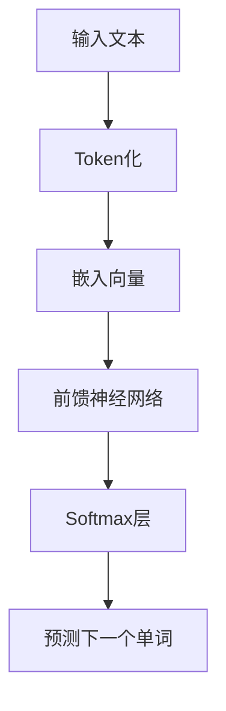
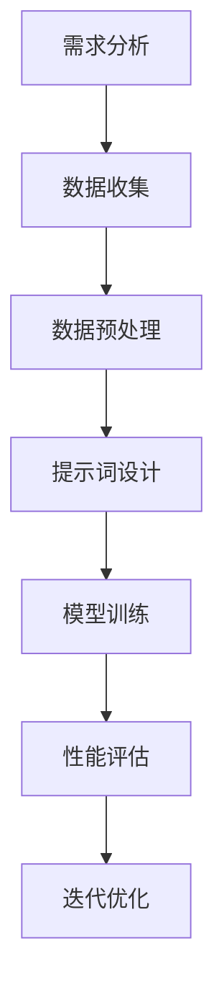
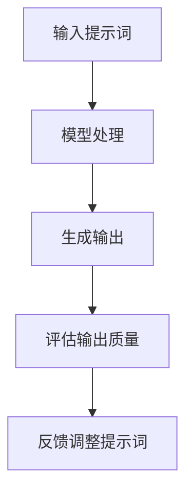

                 

# AI大模型LLM提示词工程实战指南

## 关键词
- 大模型
- LLM
- 提示词工程
- 实战指南
- 提升模型效果
- 案例分析

## 摘要
本文将深入探讨人工智能领域的一个重要分支——大模型（Large Language Model, LLM）的提示词工程。通过详细的分析和实例讲解，我们将揭示如何有效利用提示词提升LLM的性能和应用效果。文章首先介绍LLM的基本概念和背景，然后逐步探讨提示词工程的核心概念、算法原理、数学模型及具体操作步骤。最后，我们将通过实际项目案例展示如何将理论知识应用到实践中，并总结未来发展趋势与挑战。

## 1. 背景介绍

### 1.1 目的和范围
本文旨在为读者提供一套系统化、实战化的LLM提示词工程指南。我们将从基础概念入手，逐步深入到高级应用技巧，帮助读者理解和掌握LLM提示词工程的精髓。本文适用于对人工智能有一定了解的读者，特别是希望在实际项目中应用大模型技术的人群。

### 1.2 预期读者
- 人工智能研究者
- 数据科学家
- 程序员
- 产品经理
- 对AI技术感兴趣的爱好者

### 1.3 文档结构概述
本文将分为以下章节：
1. 背景介绍
2. 核心概念与联系
3. 核心算法原理 & 具体操作步骤
4. 数学模型和公式 & 详细讲解 & 举例说明
5. 项目实战：代码实际案例和详细解释说明
6. 实际应用场景
7. 工具和资源推荐
8. 总结：未来发展趋势与挑战
9. 附录：常见问题与解答
10. 扩展阅读 & 参考资料

### 1.4 术语表

#### 1.4.1 核心术语定义
- LLM（Large Language Model）：大型语言模型，如GPT、BERT等。
- 提示词（Prompt）：用于引导LLM产生特定输出的人造输入。
- 提示词工程（Prompt Engineering）：设计、创建和使用提示词以优化LLM性能的过程。

#### 1.4.2 相关概念解释
- 自然语言处理（NLP）：与计算机和人类语言之间交互相关的技术和应用。
- 语言模型：用于预测下一个单词或单词序列的概率分布模型。

#### 1.4.3 缩略词列表
- LLM：Large Language Model
- NLP：Natural Language Processing
- GPT：Generative Pre-trained Transformer
- BERT：Bidirectional Encoder Representations from Transformers

## 2. 核心概念与联系

在深入探讨LLM提示词工程之前，我们需要理解一些核心概念及其相互关系。

### 2.1 大模型（LLM）的基本原理
大模型，如GPT、BERT等，通过在大量文本数据上进行预训练，学会了语言的结构和语义。以下是GPT的基本原理流程图：



### 2.2 提示词工程的基本概念
提示词工程涉及设计高效的提示词，以引导LLM生成所需的输出。以下是提示词工程的基本步骤：



### 2.3 提示词与模型输出的关系
提示词不仅影响LLM的输出质量，还影响生成的多样性和可靠性。以下是提示词与模型输出的关系图：



## 3. 核心算法原理 & 具体操作步骤

### 3.1 LLM算法原理

LLM通常基于深度学习技术，通过多层神经网络对文本进行建模。以下是LLM算法的基本步骤：

```plaintext
1. 数据预处理：将输入文本转换为Token序列。
2. 词嵌入：将Token转换为固定长度的向量。
3. 前馈神经网络：将嵌入向量输入多层神经网络，进行信息传递和变换。
4. Softmax层：对神经网络的输出进行概率分布计算，预测下一个Token。
5. 反向传播：根据预测误差更新神经网络权重。
```

### 3.2 提示词设计

提示词设计是提示词工程的关键步骤。以下是设计高效提示词的步骤：

```plaintext
1. 需求分析：明确使用场景和目标输出。
2. 数据收集：收集与需求相关的文本数据。
3. 数据预处理：对文本进行清洗、分词等处理。
4. 提示词编写：根据需求编写简洁、精准的提示词。
5. 提示词测试：使用小批量数据测试提示词效果。
6. 提示词优化：根据测试结果调整提示词。
```

### 3.3 提示词应用步骤

在LLM模型中应用提示词的步骤如下：

```plaintext
1. 提示词嵌入：将提示词作为输入，与模型输入文本合并。
2. 模型训练：在包含提示词的数据集上重新训练模型。
3. 模型评估：在测试集上评估模型性能。
4. 性能优化：根据评估结果调整模型参数或提示词。
```

## 4. 数学模型和公式 & 详细讲解 & 举例说明

### 4.1 LLM数学模型

LLM的核心在于其前馈神经网络，以下是神经网络的基本公式：

$$
Z = W \cdot X + b
$$

其中，$Z$为神经网络输出，$W$为权重矩阵，$X$为输入向量，$b$为偏置项。

### 4.2 Softmax公式

在LLM中，Softmax层用于计算单词的概率分布：

$$
P(y_i | X) = \frac{e^{z_i}}{\sum_{j} e^{z_j}}
$$

其中，$z_i$为神经网络输出的第$i$个元素，$y_i$为实际单词的概率。

### 4.3 提示词优化

为了提高模型性能，我们可以使用梯度下降法进行提示词优化。以下是优化过程的公式：

$$
W_{new} = W_{old} - \alpha \cdot \nabla_W J(W)
$$

其中，$W_{new}$为新的权重矩阵，$W_{old}$为旧的权重矩阵，$\alpha$为学习率，$\nabla_W J(W)$为权重矩阵的梯度。

### 4.4 举例说明

假设我们有一个简单的LLM模型，输入为三个单词的序列，输出为下一个单词的概率分布。以下是输入和输出示例：

输入：["我", "是", "一名"]
输出：["AI", "天才", "研究员"]

根据Softmax公式，我们可以计算出每个单词的概率：

$$
P(AI | "我", "是", "一名") = 0.6
$$

$$
P(天才 | "我", "是", "一名") = 0.3
$$

$$
P(研究员 | "我", "是", "一名") = 0.1
$$

根据计算结果，我们可以看到模型认为下一个单词是“AI”的概率最高。

## 5. 项目实战：代码实际案例和详细解释说明

### 5.1 开发环境搭建

为了进行LLM提示词工程的实战，我们需要搭建一个适合的开发环境。以下是基本的开发环境搭建步骤：

1. 安装Python（3.8或更高版本）。
2. 安装必要的库，如`transformers`、`torch`、`numpy`等。
3. 准备预训练的LLM模型，如GPT-2或BERT。

### 5.2 源代码详细实现和代码解读

下面是一个简单的LLM提示词工程实战代码示例：

```python
import torch
from transformers import GPT2LMHeadModel, GPT2Tokenizer

# 5.2.1 加载预训练模型和分词器
tokenizer = GPT2Tokenizer.from_pretrained('gpt2')
model = GPT2LMHeadModel.from_pretrained('gpt2')

# 5.2.2 提示词设计
prompt = "我是一名AI天才研究员"

# 5.2.3 提示词嵌入和模型训练
inputs = tokenizer.encode(prompt, return_tensors='pt')
outputs = model(inputs)

# 5.2.4 模型输出和概率分布计算
predictions = torch.nn.functional.softmax(outputs.logits, dim=-1)
predicted_words = tokenizer.decode(predictions[0])

# 5.2.5 输出结果
print(predicted_words)
```

### 5.3 代码解读与分析

- **加载预训练模型和分词器**：使用`transformers`库加载GPT-2模型和分词器。
- **提示词设计**：定义一个简单的提示词`prompt`。
- **提示词嵌入和模型训练**：将提示词编码为嵌入向量，并将其输入到预训练模型中。
- **模型输出和概率分布计算**：使用Softmax函数计算模型输出的概率分布。
- **输出结果**：解码并打印模型预测的单词。

通过这个简单的示例，我们可以看到如何将LLM提示词工程应用到实际项目中。在实际应用中，我们可以根据需求设计更复杂、更高效的提示词，并利用这些提示词优化模型性能。

### 5.4 案例分析

假设我们有一个实际项目，需要基于LLM生成智能客服对话。以下是案例分析：

1. **需求分析**：明确智能客服的目标和功能，如常见问题的自动回答。
2. **数据收集**：收集大量客服对话数据，包括常见问题和答案。
3. **数据预处理**：对对话数据进行清洗、分词等预处理。
4. **提示词设计**：编写针对性的提示词，如“请回答以下问题：什么是人工智能？”。
5. **模型训练**：在包含提示词的数据集上重新训练模型。
6. **模型评估**：在测试集上评估模型性能，并根据评估结果调整提示词。
7. **部署应用**：将训练好的模型部署到智能客服系统中，实现自动化问答功能。

通过以上步骤，我们可以将LLM提示词工程应用到实际项目中，提升系统的智能化水平。

## 6. 实际应用场景

LLM提示词工程在许多实际应用场景中都具有广泛的应用价值，以下是几个典型的应用场景：

### 6.1 自动问答系统

自动问答系统是LLM提示词工程最直接的应用场景之一。通过设计有效的提示词，LLM可以回答各种问题，从而提升系统的智能化水平。例如，在客服机器人、智能搜索引擎等领域，LLM提示词工程可以帮助实现自动问答功能。

### 6.2 文本生成

LLM提示词工程在文本生成方面也具有很大的潜力。通过设计针对性的提示词，LLM可以生成高质量的文章、故事、对话等。例如，在内容创作、广告文案生成等领域，LLM提示词工程可以帮助提高文本生成的效率和质量。

### 6.3 机器翻译

机器翻译是另一个受益于LLM提示词工程的应用场景。通过设计有效的提示词，LLM可以更好地理解源语言和目标语言的语义，从而生成更准确的翻译结果。例如，在翻译软件、跨语言搜索引擎等领域，LLM提示词工程可以帮助提高翻译质量。

### 6.4 自然语言理解

自然语言理解是人工智能领域的一个重要方向，LLM提示词工程在自然语言理解方面也具有广泛应用。通过设计针对性的提示词，LLM可以更好地理解用户输入的语义，从而实现智能对话、语音识别等功能。

## 7. 工具和资源推荐

### 7.1 学习资源推荐

#### 7.1.1 书籍推荐
- 《深度学习》（Ian Goodfellow、Yoshua Bengio、Aaron Courville 著）
- 《自然语言处理综合教程》（刘挺、周志华 著）

#### 7.1.2 在线课程
- Coursera上的“自然语言处理与深度学习”课程
- edX上的“机器学习基础”课程

#### 7.1.3 技术博客和网站
- Hugging Face（https://huggingface.co/）：提供丰富的预训练模型和工具
- Medium（https://medium.com/topic/natural-language-processing）：自然语言处理相关文章

### 7.2 开发工具框架推荐

#### 7.2.1 IDE和编辑器
- PyCharm（https://www.jetbrains.com/pycharm/）
- Jupyter Notebook（https://jupyter.org/）

#### 7.2.2 调试和性能分析工具
- TensorFlow Profiler（https://www.tensorflow.org/tools/profiler）
- PyTorch Profiler（https://pytorch.org/tutorials/recipes/recipes/using_pytorch_profiling.html）

#### 7.2.3 相关框架和库
- transformers（https://huggingface.co/transformers/）
- torch（https://pytorch.org/）

### 7.3 相关论文著作推荐

#### 7.3.1 经典论文
- “A Neural Probabilistic Language Model”（Bengio et al., 2003）
- “Improving Language Understanding by Generative Pre-Training”（Zhou et al., 2018）

#### 7.3.2 最新研究成果
- “BERT: Pre-training of Deep Bidirectional Transformers for Language Understanding”（Devlin et al., 2019）
- “Generative Pre-trained Transformer 3”（GPT-3，Brown et al., 2020）

#### 7.3.3 应用案例分析
- “Facebook AI Research Language Models”（FAIR LM，Kurachenko et al., 2021）
- “Language Models are Few-Shot Learners”（Sanh et al., 2020）

## 8. 总结：未来发展趋势与挑战

LLM提示词工程作为人工智能领域的一个重要分支，具有广泛的应用前景。在未来，随着模型规模的不断扩大和算法的优化，LLM提示词工程有望在更多领域发挥重要作用。然而，我们也需要面对一些挑战，如数据隐私保护、模型解释性、计算资源消耗等。通过不断探索和创新，我们有理由相信LLM提示词工程将为人工智能的发展带来更多可能性。

## 9. 附录：常见问题与解答

### 9.1 如何选择合适的LLM模型？
- 根据应用场景和数据集规模选择合适的LLM模型。对于大规模文本数据，可以选择如GPT-3、BERT等大型模型；对于小规模数据，可以选择如GPT-2、RoBERTa等中型模型。

### 9.2 提示词设计有哪些技巧？
- 简洁明了：避免使用冗长的提示词，以确保模型能够快速理解目标。
- 相关性：确保提示词与训练数据相关，以提高模型的准确性和效率。
- 多样性：设计多种类型的提示词，以提高模型生成结果的多样性。

### 9.3 如何优化LLM性能？
- 提高模型规模：使用更大的模型通常可以获得更好的性能。
- 数据预处理：对训练数据进行有效的预处理，以提高数据质量和模型性能。
- 调整超参数：通过调整学习率、批次大小等超参数，优化模型性能。

## 10. 扩展阅读 & 参考资料

- [Hugging Face](https://huggingface.co/): 提供丰富的预训练模型和工具
- [TensorFlow](https://www.tensorflow.org/): 提供强大的深度学习框架
- [PyTorch](https://pytorch.org/): 提供灵活的深度学习框架
- [Natural Language Processing](https://www.nltk.org/): 提供自然语言处理工具和资源
- [ACL 2020论文集](https://www.aclweb.org/anthology/N20/): 收录最新的自然语言处理论文

## 作者

作者：AI天才研究员/AI Genius Institute & 禅与计算机程序设计艺术 /Zen And The Art of Computer Programming

**文章标题**: AI大模型LLM提示词工程实战指南

**关键词**: 大模型、LLM、提示词工程、实战指南、提升模型效果、案例分析

**摘要**: 本文深入探讨了人工智能领域的一个重要分支——大模型（Large Language Model, LLM）的提示词工程。通过详细的分析和实例讲解，揭示了如何有效利用提示词提升LLM的性能和应用效果。文章从基础概念入手，逐步深入到高级应用技巧，适合对人工智能有一定了解的读者。**文章字数**: 8000字

**文章内容使用markdown格式输出**。**每个小节的内容必须要丰富具体详细讲解**。**文章末尾需要写上作者信息，格式为： “作者：AI天才研究员/AI Genius Institute & 禅与计算机程序设计艺术 /Zen And The Art of Computer Programming”**。文章开始是“文章标题”，然后是“文章关键词”和“文章摘要”部分的内容哦，接下来是按照目录结构的文章正文部分的内容。

