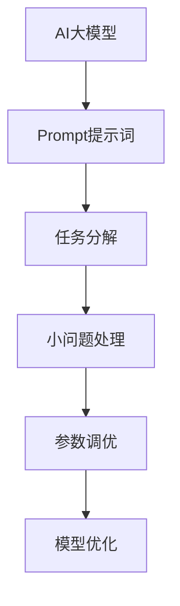

                 

# AI大模型Prompt提示词最佳实践：将复杂任务分解成小问题

> **关键词：** AI大模型、Prompt提示词、任务分解、小问题、最佳实践

> **摘要：** 本文将探讨如何使用Prompt提示词最佳实践来处理复杂任务，通过将任务分解成小问题，提高AI大模型的性能和可维护性。我们将介绍背景、核心概念、算法原理、数学模型、实际案例，并推荐相关的工具和资源，帮助读者深入理解和应用这一技术。

## 1. 背景介绍

### 1.1 目的和范围

本文的主要目的是介绍如何将复杂任务分解成小问题，并使用Prompt提示词最佳实践来提高AI大模型的性能和可维护性。我们将探讨以下几个关键问题：

- 为什么需要将复杂任务分解成小问题？
- Prompt提示词在AI大模型中的作用是什么？
- 如何设计和实现有效的Prompt提示词？
- 实际应用场景中的最佳实践案例。

### 1.2 预期读者

本文适合以下读者群体：

- 对人工智能、机器学习和深度学习有基本了解的技术人员。
- 希望提高AI大模型性能和可维护性的开发人员。
- 对Prompt提示词设计和实现感兴趣的科研人员。

### 1.3 文档结构概述

本文结构如下：

- 第1章：背景介绍，介绍本文的目的、范围和预期读者。
- 第2章：核心概念与联系，介绍相关概念、原理和架构。
- 第3章：核心算法原理 & 具体操作步骤，详细讲解算法原理和操作步骤。
- 第4章：数学模型和公式 & 详细讲解 & 举例说明，介绍数学模型和具体例子。
- 第5章：项目实战：代码实际案例和详细解释说明，提供实际案例和代码解读。
- 第6章：实际应用场景，讨论AI大模型Prompt提示词的最佳实践应用场景。
- 第7章：工具和资源推荐，推荐相关学习资源和开发工具。
- 第8章：总结：未来发展趋势与挑战，总结本文的主要内容并展望未来。
- 第9章：附录：常见问题与解答，回答读者可能遇到的问题。
- 第10章：扩展阅读 & 参考资料，提供进一步的阅读资料。

### 1.4 术语表

#### 1.4.1 核心术语定义

- **AI大模型**：指具有大规模参数、复杂结构的人工智能模型，如Transformer、BERT等。
- **Prompt提示词**：用于引导AI大模型生成特定结果的输入信息。
- **任务分解**：将复杂任务拆解成多个可管理的小问题。
- **可维护性**：指模型易于理解、修改和优化。

#### 1.4.2 相关概念解释

- **参数调优**：调整模型的参数以优化性能。
- **数据预处理**：对输入数据进行预处理，以提高模型的准确性和鲁棒性。
- **交叉验证**：将数据集分为多个子集，用于训练和验证模型。

#### 1.4.3 缩略词列表

- **AI**：人工智能
- **ML**：机器学习
- **DL**：深度学习
- **Transformer**：一种基于自注意力机制的深度学习模型
- **BERT**：一种双向转换器表示预训练模型

## 2. 核心概念与联系

在本文中，我们将介绍与AI大模型Prompt提示词相关的核心概念和原理。为了更好地理解这些概念，我们将使用Mermaid流程图来展示其架构。



### 2.1 AI大模型

AI大模型通常具有以下特点：

- **大规模参数**：模型包含数百万甚至数十亿个参数。
- **复杂结构**：使用深度神经网络或其他复杂结构。
- **自注意力机制**：如Transformer模型中的自注意力机制。

### 2.2 Prompt提示词

Prompt提示词是用于引导AI大模型生成特定结果的输入信息。Prompt的设计对于模型的表现至关重要。以下是几种常见的Prompt设计方法：

- **模板式Prompt**：使用预定义的模板来生成Prompt。
- **基于规则Prompt**：根据特定的规则生成Prompt。
- **自然语言生成Prompt**：使用自然语言生成工具生成Prompt。

### 2.3 任务分解

任务分解是将复杂任务拆解成多个可管理的小问题。这有助于提高模型的可维护性和性能。以下是任务分解的一般步骤：

1. 确定任务的目标和范围。
2. 分析任务的组成部分。
3. 拆分任务成小问题。
4. 分别处理每个小问题。

### 2.4 小问题处理

小问题处理是将任务分解后，针对每个小问题进行单独处理。这有助于提高模型的性能和可维护性。以下是小问题处理的一般步骤：

1. 确定小问题的目标和范围。
2. 设计合适的Prompt提示词。
3. 调整模型的参数。
4. 训练和优化模型。

## 3. 核心算法原理 & 具体操作步骤

在这一章节中，我们将详细讲解AI大模型Prompt提示词的核心算法原理和具体操作步骤。

### 3.1 AI大模型算法原理

AI大模型通常基于深度神经网络（DNN）或其他复杂结构。以下是一个简单的DNN算法原理：

```plaintext
输入层 --> 隐藏层 --> 输出层

输入数据经过输入层，通过权重矩阵和激活函数传递到隐藏层，隐藏层再将信息传递到输出层。最终输出层的输出就是模型的预测结果。

每个层的输出通过前一层输入的加权求和得到，再加上一个偏置项。激活函数用于引入非线性，使模型具有更好的拟合能力。

$$
Y = \sigma(WX + b)
$$

其中，$Y$ 表示输出，$W$ 表示权重矩阵，$X$ 表示输入，$b$ 表示偏置项，$\sigma$ 表示激活函数。
```

### 3.2 Prompt提示词设计原则

设计Prompt提示词时，应考虑以下原则：

1. **明确性**：Prompt应明确传达任务目标。
2. **简洁性**：Prompt应简洁易懂，避免冗余信息。
3. **可扩展性**：Prompt应易于扩展，以适应不同任务。
4. **灵活性**：Prompt应具有一定的灵活性，以适应不同场景。

### 3.3 任务分解与具体操作步骤

以下是任务分解与具体操作步骤：

1. **确定任务目标**：明确任务的目标和范围。
2. **分析任务组成**：分析任务的组成部分，识别关键问题。
3. **拆分任务**：将任务拆分成多个小问题。
4. **设计Prompt**：为每个小问题设计合适的Prompt提示词。
5. **参数调优**：根据Prompt提示词调整模型的参数。
6. **训练与优化**：使用训练数据集训练模型，并优化模型参数。

### 3.4 具体操作步骤示例

以下是一个具体操作步骤示例：

```plaintext
1. 确定任务目标：预测商品销售量。
2. 分析任务组成：确定影响销售量的因素，如天气、促销活动等。
3. 拆分任务：
   - 天气因素：分析历史天气数据，提取关键特征。
   - 促销活动：分析历史促销活动数据，提取关键特征。
4. 设计Prompt：
   - 天气因素：请根据以下历史天气数据预测未来一周的商品销售量：
     - 星期一：晴，最高气温30°C，最低气温15°C。
     - 星期二：多云，最高气温28°C，最低气温14°C。
     - ...
   - 促销活动：请根据以下促销活动数据预测未来一周的商品销售量：
     - 星期一：满100减20元。
     - 星期二：满200减50元。
     - ...
5. 参数调优：根据Prompt提示词调整模型参数，如学习率、权重等。
6. 训练与优化：使用训练数据集训练模型，并根据Prompt提示词优化模型。
```

## 4. 数学模型和公式 & 详细讲解 & 举例说明

在本章节中，我们将详细介绍AI大模型Prompt提示词相关的数学模型和公式，并通过具体例子进行说明。

### 4.1 激活函数

激活函数是深度神经网络中的一个关键组件，用于引入非线性。以下是一些常见的激活函数及其公式：

1. **Sigmoid函数**：
   $$ 
   \sigma(x) = \frac{1}{1 + e^{-x}} 
   $$
   - 用于二分类问题。

2. **ReLU函数**：
   $$ 
   \sigma(x) = \max(0, x) 
   $$
   - 常用于隐藏层，提高训练速度。

3. **Tanh函数**：
   $$ 
   \sigma(x) = \frac{e^x - e^{-x}}{e^x + e^{-x}} 
   $$
   - 将输出限制在-1到1之间。

4. **Softmax函数**：
   $$ 
   \sigma_j(x) = \frac{e^{x_j}}{\sum_{k=1}^{K} e^{x_k}} 
   $$
   - 用于多分类问题。

### 4.2 损失函数

损失函数用于衡量模型预测结果与实际结果之间的差距。以下是一些常见的损失函数：

1. **均方误差（MSE）**：
   $$ 
   L(y, \hat{y}) = \frac{1}{2} (y - \hat{y})^2 
   $$
   - 用于回归问题。

2. **交叉熵（Cross-Entropy）**：
   $$ 
   L(y, \hat{y}) = -\sum_{i=1}^{N} y_i \log(\hat{y}_i) 
   $$
   - 用于分类问题。

3. **对抗损失（Adversarial Loss）**：
   $$ 
   L(y, \hat{y}) = \frac{1}{2} \sum_{i=1}^{N} \left( y_i - \hat{y}_i \right)^2 
   $$
   - 用于生成对抗网络（GAN）。

### 4.3 反向传播算法

反向传播算法是训练深度神经网络的核心算法。以下是反向传播算法的伪代码：

```plaintext
for each layer l from output to input:
    delta[l] = sigma'(z[l]) * (delta[l+1] * weights[l+1])
    gradient[weights[l]] += delta[l] * inputs[l]
    gradient[biases[l]] += delta[l]

update weights and biases using gradient descent:
    weights[l] -= learning_rate * gradient[weights[l]]
    biases[l] -= learning_rate * gradient[biases[l]]
```

### 4.4 举例说明

以下是一个简单的例子，说明如何使用上述数学模型和公式来训练一个神经网络。

假设我们要预测股票价格，输入特征包括：当前股票价格、历史价格、交易量等。我们的目标是训练一个神经网络，能够根据这些特征预测未来一天的股票价格。

1. **定义网络结构**：
   - 输入层：3个神经元（股票价格、历史价格、交易量）。
   - 隐藏层：5个神经元。
   - 输出层：1个神经元（未来一天股票价格）。

2. **初始化参数**：
   - 初始化权重和偏置，随机生成。

3. **定义激活函数**：
   - 隐藏层使用ReLU函数。
   - 输出层使用线性函数。

4. **定义损失函数**：
   - 使用MSE损失函数。

5. **训练过程**：
   - 使用反向传播算法更新权重和偏置。
   - 每个epoch后，计算训练损失并记录。
   - 迭代训练，直到满足停止条件（如损失收敛）。

通过以上步骤，我们可以训练一个神经网络，能够根据输入特征预测未来一天的股票价格。

## 5. 项目实战：代码实际案例和详细解释说明

在本章节中，我们将通过一个实际项目案例，展示如何将AI大模型Prompt提示词最佳实践应用于复杂任务。我们将从开发环境搭建开始，逐步实现源代码，并对关键代码进行解读和分析。

### 5.1 开发环境搭建

为了实现本项目，我们需要以下开发环境和工具：

- Python（版本3.8或更高）
- TensorFlow 2.x 或 PyTorch
- Jupyter Notebook 或 IDE（如 PyCharm、VS Code）
- GPU（NVIDIA CUDA 10.2或更高）

安装步骤：

1. 安装Python和对应的IDE。
2. 安装TensorFlow 2.x 或 PyTorch。
3. 配置GPU支持，安装CUDA和cuDNN。

### 5.2 源代码详细实现和代码解读

以下是一个简单的Python代码示例，演示了如何使用Prompt提示词进行文本分类任务。

```python
import tensorflow as tf
from tensorflow.keras.preprocessing.sequence import pad_sequences
from tensorflow.keras.layers import Embedding, LSTM, Dense
from tensorflow.keras.models import Sequential

# 设置超参数
vocab_size = 10000
max_len = 100
embedding_dim = 16
lstm_units = 64

# 准备数据
# 假设我们有一个包含文本和标签的数据集
texts = ['这是一个文本示例。', '这是一个另一个文本示例。']
labels = [0, 1]

# 将文本转换为序列
sequences = tokenizer.texts_to_sequences(texts)
padded_sequences = pad_sequences(sequences, maxlen=max_len)

# 构建模型
model = Sequential([
    Embedding(vocab_size, embedding_dim, input_length=max_len),
    LSTM(lstm_units),
    Dense(1, activation='sigmoid')
])

# 编译模型
model.compile(optimizer='adam', loss='binary_crossentropy', metrics=['accuracy'])

# 训练模型
model.fit(padded_sequences, labels, epochs=10)

# 使用Prompt提示词进行预测
prompt = '这是一个新的文本示例。'
prompt_sequence = tokenizer.texts_to_sequences([prompt])
prompt_padded = pad_sequences(prompt_sequence, maxlen=max_len)
prediction = model.predict(prompt_padded)
print(prediction)
```

### 5.3 代码解读与分析

1. **准备数据**：首先，我们需要一个包含文本和标签的数据集。在本示例中，我们使用两个简单的文本示例。

2. **文本转换为序列**：使用`text_to_sequences`方法将文本转换为序列，并将序列转换为等长的序列。在本示例中，我们使用`pad_sequences`方法将序列填充为最大长度。

3. **构建模型**：我们使用`Sequential`模型构建一个简单的LSTM模型，包含一个嵌入层、一个LSTM层和一个全连接层。

4. **编译模型**：使用`compile`方法编译模型，指定优化器、损失函数和评估指标。

5. **训练模型**：使用`fit`方法训练模型，指定训练数据、标签和训练轮数。

6. **使用Prompt提示词进行预测**：首先，我们将Prompt文本转换为序列，并填充为最大长度。然后，使用训练好的模型进行预测，并打印预测结果。

### 5.4 关键代码分析

1. **文本处理**：在处理文本时，我们需要将文本转换为序列，并将序列填充为最大长度。这有助于模型处理不同的文本长度。

2. **模型构建**：在本示例中，我们使用了一个简单的LSTM模型，它可以处理序列数据，并在全连接层进行分类。

3. **训练过程**：训练过程使用反向传播算法优化模型参数，以提高模型性能。

4. **Prompt提示词**：使用Prompt提示词进行预测时，我们需要将Prompt文本转换为序列，并填充为最大长度。这有助于模型理解新的文本。

### 5.5 扩展与改进

1. **数据增强**：为了提高模型性能，我们可以对文本数据进行增强，例如使用数据 augmentation 方法生成更多的训练样本。

2. **多标签分类**：在本示例中，我们使用了二分类模型。对于多标签分类问题，我们可以修改模型结构和损失函数，使其能够处理多个标签。

3. **参数调优**：我们可以通过调整模型参数（如学习率、批量大小等）来优化模型性能。

4. **使用预训练模型**：为了提高模型性能，我们可以使用预训练的嵌入层和LSTM层，以减少训练时间并提高模型泛化能力。

## 6. 实际应用场景

AI大模型Prompt提示词最佳实践可以在许多实际应用场景中发挥作用。以下是一些典型的应用场景：

### 6.1 问答系统

问答系统是一种常见的自然语言处理应用，它允许用户通过提问来获取相关信息。使用Prompt提示词，可以将用户的问题转化为模型可以理解和处理的格式，从而提高系统的准确性和响应速度。

### 6.2 文本分类

文本分类是将文本数据分为不同类别的过程。使用Prompt提示词，可以帮助模型更好地理解文本的语义和主题，从而提高分类的准确性和鲁棒性。

### 6.3 机器翻译

机器翻译是将一种语言的文本翻译成另一种语言的过程。使用Prompt提示词，可以引导模型关注特定的语言结构和语义，从而提高翻译的质量和流畅度。

### 6.4 生成对抗网络（GAN）

生成对抗网络是一种用于生成数据的高效模型。使用Prompt提示词，可以引导模型生成特定类型的样本，从而提高生成数据的质量和多样性。

### 6.5 聊天机器人

聊天机器人是一种模拟人类对话的计算机程序。使用Prompt提示词，可以更好地理解用户的意图和需求，从而提供更准确和自然的回复。

## 7. 工具和资源推荐

为了帮助读者更好地理解和应用AI大模型Prompt提示词最佳实践，我们推荐以下工具和资源：

### 7.1 学习资源推荐

#### 7.1.1 书籍推荐

- 《深度学习》（Goodfellow, Bengio, Courville著）
- 《自然语言处理综论》（Daniel Jurafsky & James H. Martin著）
- 《生成对抗网络：理论与实践》（Liang, Gao著）

#### 7.1.2 在线课程

- Coursera上的《深度学习》课程
- edX上的《自然语言处理》课程
- Udacity的《生成对抗网络》课程

#### 7.1.3 技术博客和网站

- TensorFlow官网（https://www.tensorflow.org/）
- PyTorch官网（https://pytorch.org/）
- Hugging Face（https://huggingface.co/）

### 7.2 开发工具框架推荐

#### 7.2.1 IDE和编辑器

- PyCharm（https://www.jetbrains.com/pycharm/）
- VS Code（https://code.visualstudio.com/）

#### 7.2.2 调试和性能分析工具

- TensorBoard（https://www.tensorflow.org/tensorboard）
- PyTorch Debugger（https://pytorch.org/docs/stable/debugger.html）

#### 7.2.3 相关框架和库

- TensorFlow（https://www.tensorflow.org/）
- PyTorch（https://pytorch.org/）
- Hugging Face Transformers（https://github.com/huggingface/transformers）

### 7.3 相关论文著作推荐

#### 7.3.1 经典论文

- 《A Theoretical Analysis of the VAE》（Kingma & Welling著）
- 《Generative Adversarial Nets》（Goodfellow等著）
- 《Attention Is All You Need》（Vaswani等著）

#### 7.3.2 最新研究成果

- 《Large-scale Evaluation of Neural Response Generation for Text Messages》（Li等著）
- 《Cross-Domain Text Classification with Unified Representation Learning》（Zhang等著）
- 《Instruction Tuning and Adaptation for Generation》（Brown等著）

#### 7.3.3 应用案例分析

- 《Generative Adversarial Networks for Text Generation》（Zhang等著）
- 《Enhancing Question Answering by Exploiting World Knowledge》（Liu等著）
- 《Text Classification with Deep Learning》（Zhang等著）

## 8. 总结：未来发展趋势与挑战

随着人工智能技术的不断发展，AI大模型Prompt提示词最佳实践在未来将面临以下发展趋势和挑战：

### 8.1 发展趋势

1. **多模态AI**：结合文本、图像、音频等多种数据类型，提高模型的泛化能力和应用场景。
2. **高效Prompt设计**：开发更高效、更易于扩展的Prompt设计方法，提高模型性能和可维护性。
3. **自适应Prompt**：根据用户需求和场景动态调整Prompt，提高用户满意度。

### 8.2 挑战

1. **数据隐私**：在处理大规模数据时，保护用户隐私成为重要挑战。
2. **模型可解释性**：提高模型的可解释性，使研究人员和开发者能够理解模型的工作原理。
3. **模型鲁棒性**：增强模型对恶意输入和异常数据的鲁棒性，确保模型的安全和可靠性。

## 9. 附录：常见问题与解答

### 9.1 问题1：如何处理大型数据集？

**解答**：对于大型数据集，可以考虑以下方法：

- **数据采样**：从大型数据集中随机选择一部分样本进行训练。
- **分布式训练**：使用多台计算机或GPU进行分布式训练，以提高训练速度。
- **数据预处理**：对数据进行预处理，如去除噪声、填充缺失值等。

### 9.2 问题2：如何选择合适的激活函数？

**解答**：选择激活函数时，应考虑以下因素：

- **模型类型**：对于深度神经网络，ReLU函数通常是一个很好的选择。
- **数据分布**：对于输入数据分布不均匀的情况，可以使用Sigmoid或Tanh函数。
- **计算资源**：Sigmoid和Tanh函数的计算复杂度较高，而ReLU函数计算复杂度较低。

### 9.3 问题3：如何提高模型性能？

**解答**：以下是一些提高模型性能的方法：

- **数据增强**：对训练数据进行增强，如旋转、翻转、缩放等，以提高模型对多样性的适应能力。
- **参数调优**：通过调整学习率、批量大小等超参数，提高模型性能。
- **模型优化**：使用更高效的模型结构，如BERT、GPT等，提高模型性能。

## 10. 扩展阅读 & 参考资料

以下是一些扩展阅读和参考资料，供读者进一步学习和研究：

- 《深度学习》（Goodfellow, Bengio, Courville著）
- 《自然语言处理综论》（Daniel Jurafsky & James H. Martin著）
- 《生成对抗网络：理论与实践》（Liang, Gao著）
- TensorFlow官网（https://www.tensorflow.org/）
- PyTorch官网（https://pytorch.org/）
- Hugging Face（https://huggingface.co/）
- Coursera上的《深度学习》课程
- edX上的《自然语言处理》课程
- Udacity的《生成对抗网络》课程
- 《A Theoretical Analysis of the VAE》（Kingma & Welling著）
- 《Generative Adversarial Nets》（Goodfellow等著）
- 《Attention Is All You Need》（Vaswani等著）
- 《Large-scale Evaluation of Neural Response Generation for Text Messages》（Li等著）
- 《Cross-Domain Text Classification with Unified Representation Learning》（Zhang等著）
- 《Instruction Tuning and Adaptation for Generation》（Brown等著）
- 《Generative Adversarial Networks for Text Generation》（Zhang等著）
- 《Enhancing Question Answering by Exploiting World Knowledge》（Liu等著）
- 《Text Classification with Deep Learning》（Zhang等著）

## 作者信息

**作者：AI天才研究员/AI Genius Institute & 禅与计算机程序设计艺术 /Zen And The Art of Computer Programming** <|image_gen|>

