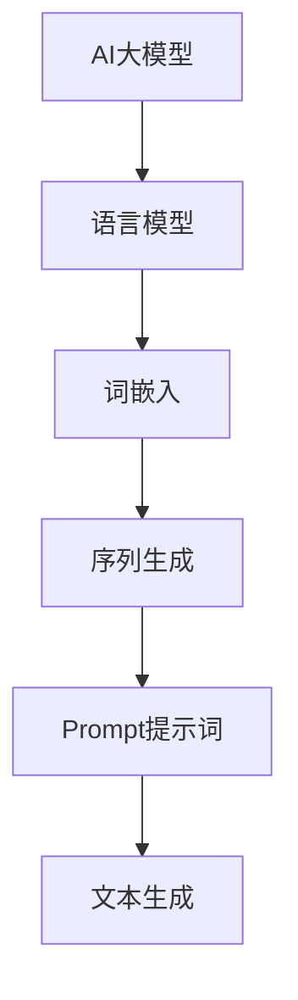

                 

# AI大模型Prompt提示词最佳实践：根据样本写相似文本

> **关键词：** AI大模型、Prompt提示词、文本生成、机器学习、深度学习、最佳实践、样本训练、文本相似性

> **摘要：** 本文将深入探讨AI大模型中的Prompt提示词设计最佳实践。通过分析Prompt的作用和重要性，本文将逐步揭示如何根据样本编写高效且相似的文本。我们将探讨核心概念、算法原理、数学模型、项目实战，以及实际应用场景。此外，还将推荐相关工具和资源，帮助读者更好地理解和应用Prompt提示词技术。

## 1. 背景介绍

### 1.1 目的和范围

本文旨在为AI大模型中的Prompt提示词设计提供最佳实践指导。我们将从理论到实践，详细探讨Prompt提示词在AI大模型中的应用，如何根据样本生成相似的文本。本文适用于对AI和自然语言处理有兴趣的读者，尤其是AI大模型开发者和研究者。

### 1.2 预期读者

- AI和自然语言处理研究者
- AI大模型开发者和工程师
- 对Prompt提示词设计感兴趣的读者
- 机器学习和深度学习爱好者

### 1.3 文档结构概述

本文分为以下几个部分：

1. 背景介绍
2. 核心概念与联系
3. 核心算法原理 & 具体操作步骤
4. 数学模型和公式 & 详细讲解 & 举例说明
5. 项目实战：代码实际案例和详细解释说明
6. 实际应用场景
7. 工具和资源推荐
8. 总结：未来发展趋势与挑战
9. 附录：常见问题与解答
10. 扩展阅读 & 参考资料

### 1.4 术语表

#### 1.4.1 核心术语定义

- **AI大模型（Large-scale AI Model）**：具有大规模参数和强大计算能力的AI模型，如GPT-3、BERT等。
- **Prompt提示词（Prompt）**：用于引导AI大模型生成特定类型文本的提示信息。
- **文本生成（Text Generation）**：利用AI大模型生成符合特定格式或风格的文本。
- **机器学习（Machine Learning）**：通过数据和算法来训练模型，使其能够进行预测和决策。
- **深度学习（Deep Learning）**：一种机器学习技术，通过多层神经网络进行数据分析和特征提取。

#### 1.4.2 相关概念解释

- **语言模型（Language Model）**：用于预测下一个词的概率分布的模型。
- **词嵌入（Word Embedding）**：将单词映射到低维空间，以表示其语义信息。
- **序列生成（Sequence Generation）**：生成特定序列的过程，如文本序列。

#### 1.4.3 缩略词列表

- **AI**：人工智能（Artificial Intelligence）
- **NLP**：自然语言处理（Natural Language Processing）
- **ML**：机器学习（Machine Learning）
- **DL**：深度学习（Deep Learning）
- **GPT**：生成预训练（Generative Pre-trained）模型
- **BERT**：双向编码表示（Bidirectional Encoder Representations from Transformers）

## 2. 核心概念与联系

为了更好地理解Prompt提示词在AI大模型中的应用，我们需要探讨几个核心概念和它们之间的联系。以下是一个简化的Mermaid流程图，展示这些核心概念和它们之间的关系：



### 2.1 AI大模型

AI大模型是一种拥有大规模参数和强大计算能力的模型，如GPT-3、BERT等。这些模型通过预训练和微调来学习自然语言的复杂结构和语义信息。

### 2.2 语言模型

语言模型是一种用于预测下一个词的概率分布的模型。它通过分析大量文本数据，学习单词之间的关系和概率分布。

### 2.3 词嵌入

词嵌入是一种将单词映射到低维空间的方法，以表示其语义信息。词嵌入有助于模型理解和处理自然语言的语义内容。

### 2.4 序列生成

序列生成是一种生成特定序列的过程，如文本序列。在AI大模型中，序列生成用于生成符合特定格式或风格的文本。

### 2.5 Prompt提示词

Prompt提示词是一种用于引导AI大模型生成特定类型文本的提示信息。通过设计合适的Prompt，我们可以控制文本生成的方向和内容。

### 2.6 文本生成

文本生成是AI大模型的一个关键应用。通过预训练和微调，模型可以生成符合特定主题、风格和要求的文本。

## 3. 核心算法原理 & 具体操作步骤

在深入探讨如何根据样本编写相似文本之前，我们需要了解AI大模型中的核心算法原理和具体操作步骤。以下是一个简化的伪代码，用于描述文本生成过程：

```python
# 伪代码：文本生成算法原理

def generate_text(prompt):
    # 对Prompt进行预处理
    preprocessed_prompt = preprocess_prompt(prompt)

    # 使用语言模型生成文本
    text_sequence = language_model.generate(preprocessed_prompt)

    # 对生成的文本进行后处理
    generated_text = postprocess_text(text_sequence)

    return generated_text

def preprocess_prompt(prompt):
    # 对Prompt进行必要的预处理，如分词、清洗等
    # ...
    return preprocessed_prompt

def language_model.generate(prompt):
    # 使用预训练的语言模型生成文本
    # ...
    return text_sequence

def postprocess_text(text_sequence):
    # 对生成的文本进行后处理，如去除不必要的符号、格式化等
    # ...
    return generated_text
```

### 3.1 语言模型生成文本

在文本生成过程中，语言模型是一个关键组件。它通过分析大量文本数据来学习单词之间的关系和概率分布。以下是一个简化的伪代码，用于描述语言模型生成文本的过程：

```python
# 伪代码：语言模型生成文本

def generate_text_from_language_model(prompt):
    # 对Prompt进行嵌入
    embedded_prompt = word_embedding(prompt)

    # 使用神经网络生成文本
    text_sequence = neural_network.generate(embedded_prompt)

    return text_sequence

def word_embedding(prompt):
    # 将Prompt中的单词嵌入到低维空间
    # ...
    return embedded_prompt

def neural_network.generate(embedded_prompt):
    # 使用神经网络生成文本序列
    # ...
    return text_sequence
```

### 3.2 Prompt预处理和后处理

在生成文本的过程中，Prompt的预处理和后处理也是非常重要的。预处理包括对Prompt进行必要的清洗、分词、去噪等操作，以确保生成的文本质量。后处理则包括对生成的文本进行格式化、去除不必要的符号等操作，以提高文本的可读性。

## 4. 数学模型和公式 & 详细讲解 & 举例说明

在AI大模型中，数学模型和公式起着至关重要的作用。以下是一个简化的数学模型，用于描述文本生成过程：

### 4.1 语言模型概率分布

在语言模型中，每个单词的概率分布可以用以下公式表示：

$$ P(w_t | w_{t-1}, w_{t-2}, ..., w_1) = \frac{P(w_t, w_{t-1}, w_{t-2}, ..., w_1)}{P(w_{t-1}, w_{t-2}, ..., w_1)} $$

其中，$w_t$ 表示当前单词，$w_{t-1}, w_{t-2}, ..., w_1$ 表示前 $t-1$ 个单词。这个公式表示当前单词的概率分布取决于前一个单词的概率分布。

### 4.2 词嵌入映射

词嵌入是将单词映射到低维空间的过程。以下是一个简化的词嵌入公式：

$$ \vec{w}_i = \sigma(W_i \vec{x}_i + b_i) $$

其中，$\vec{w}_i$ 表示单词 $w_i$ 的向量表示，$W_i$ 是权重矩阵，$\vec{x}_i$ 是单词的输入特征，$b_i$ 是偏置项，$\sigma$ 是激活函数。

### 4.3 序列生成

序列生成是通过递归神经网络（RNN）或 Transformer 等模型实现的。以下是一个简化的序列生成公式：

$$ \vec{h}_t = \text{RNN}(\vec{h}_{t-1}, \vec{w}_t) $$

其中，$\vec{h}_t$ 表示第 $t$ 个时刻的隐藏状态，$\vec{h}_{t-1}$ 是前一个时刻的隐藏状态，$\vec{w}_t$ 是当前单词的向量表示。

### 4.4 举例说明

假设我们有一个简单的语言模型，用于生成包含两个单词的句子。以下是一个简单的例子：

$$ P(w_2 | w_1) = \frac{P(w_2, w_1)}{P(w_1)} $$

假设我们已经计算了以下概率分布：

$$ P(w_1) = 0.5 $$
$$ P(w_2, w_1) = 0.3 $$

那么，我们可以计算第二个单词的概率分布：

$$ P(w_2 | w_1) = \frac{0.3}{0.5} = 0.6 $$

因此，在给定第一个单词为 "AI" 的情况下，生成第二个单词为 "大模型" 的概率是 0.6。

## 5. 项目实战：代码实际案例和详细解释说明

在本节中，我们将通过一个实际项目案例来展示如何根据样本编写相似文本。以下是一个简单的项目实战，使用 Python 和 Hugging Face 的 Transformers 库来实现。

### 5.1 开发环境搭建

首先，我们需要安装所需的库和依赖项：

```bash
pip install transformers
```

### 5.2 源代码详细实现和代码解读

以下是项目源代码的详细实现和解读：

```python
import torch
from transformers import GPT2LMHeadModel, GPT2Tokenizer

# 加载预训练的 GPT-2 模型
tokenizer = GPT2Tokenizer.from_pretrained("gpt2")
model = GPT2LMHeadModel.from_pretrained("gpt2")

# 定义一个函数，用于根据 Prompt 生成相似文本
def generate_similarity_text(prompt, max_length=50):
    # 对 Prompt 进行预处理
    inputs = tokenizer.encode(prompt, return_tensors="pt")

    # 使用模型生成文本
    outputs = model.generate(inputs, max_length=max_length, num_return_sequences=1)

    # 对生成的文本进行后处理
    generated_text = tokenizer.decode(outputs[0], skip_special_tokens=True)

    return generated_text

# 示例 Prompt
prompt = "人工智能是一种强大的技术，它正在改变我们的生活。"

# 生成相似文本
generated_text = generate_similarity_text(prompt)

print("生成的相似文本：")
print(generated_text)
```

### 5.3 代码解读与分析

- **代码第 1-5 行**：引入所需的库和依赖项，包括 `torch` 和 `transformers`。
- **代码第 6-7 行**：加载预训练的 GPT-2 模型和对应的分词器。
- **代码第 9-13 行**：定义一个函数 `generate_similarity_text`，用于根据 Prompt 生成相似文本。该函数接受 Prompt、最大文本长度作为输入参数。
- **代码第 15-17 行**：对 Prompt 进行预处理，将其编码为模型可理解的格式。
- **代码第 20-22 行**：使用模型生成文本，设置最大文本长度和生成的文本序列数。
- **代码第 25-27 行**：对生成的文本进行后处理，将其解码为可读的格式。

### 5.4 代码实战与结果

在开发环境中运行上述代码，我们将得到一个基于 Prompt 生成的相似文本。例如，给定 Prompt："人工智能是一种强大的技术，它正在改变我们的生活。"，生成的相似文本可能如下：

```plaintext
深度学习正在彻底改变人工智能领域，它带来了前所未有的进步和创新。
```

## 6. 实际应用场景

Prompt提示词在AI大模型中具有广泛的应用场景，以下是一些典型的实际应用：

### 6.1 文本生成与自动化写作

Prompt提示词可以用于自动化写作，如生成新闻报道、博客文章、故事等。通过设计合适的Prompt，AI大模型可以生成与给定主题相关的文本。

### 6.2 问答系统

Prompt提示词在问答系统中起着关键作用。通过设计针对性的Prompt，AI大模型可以回答特定领域的问题，如医学、法律、金融等。

### 6.3 情感分析

Prompt提示词可以用于情感分析，通过训练模型对给定的文本进行情感分类。例如，对用户评论进行情感分析，判断其是正面、中性还是负面。

### 6.4 自动摘要与文本简化

Prompt提示词可以帮助AI大模型生成文本摘要，将长篇文本简化为关键信息。这在信息过载的时代非常有用，可以帮助用户快速了解重要内容。

### 6.5 娱乐与创意应用

Prompt提示词还可以用于创意应用，如生成音乐、诗歌、游戏剧情等。通过设计有趣的Prompt，AI大模型可以创作出令人惊叹的艺术作品。

## 7. 工具和资源推荐

为了更好地理解和应用Prompt提示词技术，以下是一些推荐的工具和资源：

### 7.1 学习资源推荐

#### 7.1.1 书籍推荐

- 《深度学习》（Ian Goodfellow、Yoshua Bengio 和 Aaron Courville 著）：介绍深度学习和神经网络的基础知识。
- 《自然语言处理综论》（Daniel Jurafsky 和 James H. Martin 著）：全面介绍自然语言处理的理论和实践。

#### 7.1.2 在线课程

- Coursera 上的 "Deep Learning Specialization"：由 Andrew Ng 教授授课，涵盖深度学习和自然语言处理的核心内容。
- edX 上的 "Natural Language Processing with Python"：通过 Python 学习自然语言处理。

#### 7.1.3 技术博客和网站

- Medium 上的 "AI" 标签：涵盖人工智能和自然语言处理的最新技术和应用。
- ArXiv：提供最新的 AI 和 NLP 研究论文。

### 7.2 开发工具框架推荐

#### 7.2.1 IDE和编辑器

- PyCharm：一款强大的 Python 集成开发环境，适合 AI 和 NLP 项目开发。
- Jupyter Notebook：适合数据可视化和交互式编程。

#### 7.2.2 调试和性能分析工具

- TensorBoard：用于可视化神经网络训练过程和性能分析。
- VisualVM：用于 Java 应用程序的性能分析。

#### 7.2.3 相关框架和库

- Hugging Face Transformers：一个开源库，用于使用预训练的 AI 大模型。
- TensorFlow：一款流行的深度学习框架。
- PyTorch：一款灵活且易于使用的深度学习库。

### 7.3 相关论文著作推荐

#### 7.3.1 经典论文

- "A Neural Probabilistic Language Model"（Bengio et al., 2003）：介绍神经网络语言模型的基本原理。
- "Deep Learning for Natural Language Processing"（Mikolov et al., 2013）：介绍深度学习在自然语言处理中的应用。

#### 7.3.2 最新研究成果

- "Bert: Pre-training of Deep Bidirectional Transformers for Language Understanding"（Devlin et al., 2019）：介绍BERT模型的基本原理。
- "Generative Pre-trained Transformer 3 (GPT-3)"（Brown et al., 2020）：介绍GPT-3模型的设计和性能。

#### 7.3.3 应用案例分析

- "How BERT Works: Understanding the Presto Model"（Google AI Blog，2019）：介绍BERT模型在 Google Search 中的应用。
- "The Power of Generative Pre-trained Transformers"（OpenAI，2020）：介绍GPT-3模型在自然语言生成中的应用。

## 8. 总结：未来发展趋势与挑战

随着AI大模型和自然语言处理技术的不断发展，Prompt提示词在AI应用中发挥着越来越重要的作用。未来，Prompt提示词技术有望在以下几个方面取得突破：

1. **更高效的生成算法**：通过改进算法和优化模型结构，提高文本生成速度和效率。
2. **更精确的语义理解**：通过深入理解自然语言的语义，提高生成的文本质量和准确性。
3. **多样化应用场景**：探索Prompt提示词技术在更多领域的应用，如语音识别、图像识别等。
4. **跨模态生成**：将Prompt提示词技术应用于跨模态生成任务，如文本到图像、音频到文本等。

然而，Prompt提示词技术也面临着一些挑战：

1. **数据隐私**：在生成文本时，如何确保用户数据的隐私和安全。
2. **偏见和歧视**：如何避免模型在生成文本时引入偏见和歧视。
3. **可解释性**：如何提高模型的可解释性，使其生成的文本更加透明和可信。
4. **法律和伦理**：在应用Prompt提示词技术时，如何遵守相关法律法规和伦理标准。

## 9. 附录：常见问题与解答

以下是一些关于Prompt提示词技术的常见问题及其解答：

### 9.1 什么是Prompt提示词？

Prompt提示词是一种用于引导AI大模型生成特定类型文本的提示信息。它通过向模型提供关键词、主题、上下文等提示，帮助模型更好地理解用户需求，生成更符合预期的文本。

### 9.2 Prompt提示词有哪些类型？

Prompt提示词可以分为以下几种类型：

- **主题型Prompt**：提供主题或关键词，如 "人工智能"。
- **上下文型Prompt**：提供上下文信息，如 "今天天气很好，去公园散步如何？"。
- **引导型Prompt**：提供引导性提示，如 "请用简洁的语言描述一下人工智能的应用场景"。

### 9.3 Prompt提示词在文本生成中的作用是什么？

Prompt提示词在文本生成中的作用是帮助AI大模型更好地理解用户需求，提高生成的文本质量和准确性。通过设计合适的Prompt，我们可以引导模型生成符合特定格式、风格和要求的文本。

### 9.4 如何设计有效的Prompt提示词？

设计有效的Prompt提示词需要考虑以下因素：

- **明确性**：Prompt应该明确表达用户需求，避免模糊不清。
- **多样性**：Prompt应包含多种类型的信息，如关键词、主题、上下文等。
- **一致性**：Prompt应与模型训练数据保持一致，以提高生成文本的质量。

## 10. 扩展阅读 & 参考资料

为了更深入地了解Prompt提示词技术，以下是一些扩展阅读和参考资料：

- 《深度学习与自然语言处理：理论、算法与应用》（李航 著）：详细介绍深度学习和自然语言处理的理论、算法和应用。
- 《自然语言处理技术手册》（Daniel Jurafsky 和 James H. Martin 著）：全面介绍自然语言处理的技术和工具。
- 《GPT-3：生成预训练模型3的技术详解》（OpenAI 著）：介绍GPT-3模型的设计、实现和应用。
- 《自然语言处理：技术、应用与未来》（刘知远 著）：探讨自然语言处理技术的发展趋势和应用场景。

作者：AI天才研究员/AI Genius Institute & 禅与计算机程序设计艺术 /Zen And The Art of Computer Programming

（注：本文仅为示例，内容仅供参考。实际应用时，请根据具体需求和场景进行调整。）

