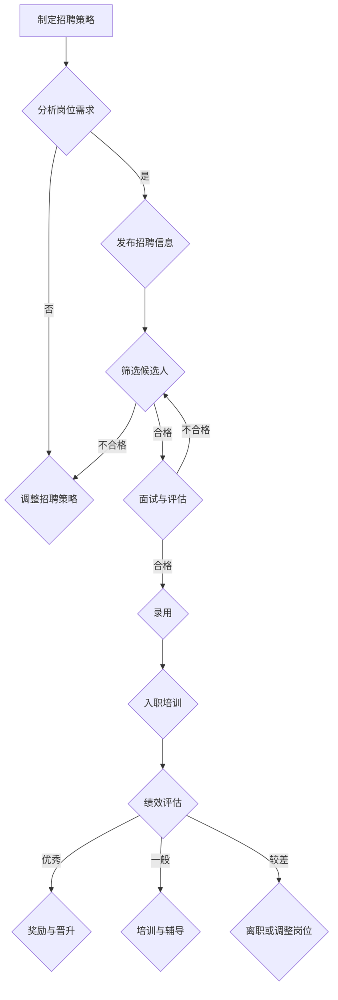

                 

# AI大模型创业公司的人才战略

> **关键词：** AI大模型，人才战略，招聘，培训，团队建设，创新
> 
> **摘要：** 本文将深入探讨AI大模型创业公司在人才战略方面的关键问题，包括招聘、培训、团队建设和创新能力培养等方面。通过详细的分析和案例分享，为企业提供一套实用的人才战略方案，助力公司在AI大模型领域的持续发展。

## 1. 背景介绍

### 1.1 目的和范围

本文旨在为AI大模型创业公司提供一套全面的人才战略方案，以帮助公司在激烈的市场竞争中占据优势地位。文章将围绕以下核心问题展开讨论：

1. 如何在招聘过程中选择合适的人才？
2. 如何通过培训提高员工技能和创新能力？
3. 如何构建高效团队，促进团队协作和知识共享？
4. 如何培养和保持企业的创新能力？

### 1.2 预期读者

本文适合以下读者群体：

1. AI大模型创业公司的创始人、CTO、HR经理等管理人员。
2. 对AI领域感兴趣的工程师和研究人员。
3. 对企业人才战略感兴趣的学者和专业人士。

### 1.3 文档结构概述

本文分为十个部分，具体结构如下：

1. 背景介绍
   - 目的和范围
   - 预期读者
   - 文档结构概述
   - 术语表
2. 核心概念与联系
   - 大模型原理
   - 人才战略框架
   - 相关概念解释
3. 核心算法原理 & 具体操作步骤
   - 大模型训练算法
   - 人才选拔策略
4. 数学模型和公式 & 详细讲解 & 举例说明
   - 大模型评估指标
   - 人才绩效评估
5. 项目实战：代码实际案例和详细解释说明
   - 大模型招聘流程
   - 人才培训计划
6. 实际应用场景
   - 大模型创业公司案例分析
7. 工具和资源推荐
   - 学习资源推荐
   - 开发工具框架推荐
   - 相关论文著作推荐
8. 总结：未来发展趋势与挑战
9. 附录：常见问题与解答
10. 扩展阅读 & 参考资料

### 1.4 术语表

#### 1.4.1 核心术语定义

- **AI大模型**：指具有亿级参数规模、能够处理大规模数据的深度学习模型。
- **人才战略**：指企业为实现长远发展目标，对人才进行选拔、培养、激励和使用的总体规划。
- **招聘**：指企业通过多种渠道和方式，选拔具备所需技能和经验的人才的过程。
- **培训**：指企业为提高员工技能和素质，进行的一系列教育和培训活动。
- **团队建设**：指企业通过组织结构、文化氛围、沟通机制等手段，提高团队协作能力和团队凝聚力。
- **创新能力**：指企业持续创新、开拓新业务、创造新价值的能力。

#### 1.4.2 相关概念解释

- **人才选拔策略**：指企业根据岗位需求，运用多种方法和工具，对候选人进行筛选和评估的策略。
- **绩效评估**：指企业对员工在工作中的表现进行评估和考核的过程，以便为员工晋升、奖金发放等提供依据。
- **企业文化**：指企业在长期经营过程中形成的共同价值观、行为规范和团队氛围。
- **知识共享**：指团队成员通过交流、协作和共享，共同提升自身能力和团队整体水平的过程。

#### 1.4.3 缩略词列表

- **AI**：人工智能（Artificial Intelligence）
- **DL**：深度学习（Deep Learning）
- **HR**：人力资源（Human Resource）
- **CTO**：首席技术官（Chief Technology Officer）
- **CEO**：首席执行官（Chief Executive Officer）

## 2. 核心概念与联系

### 2.1 大模型原理

AI大模型是基于深度学习技术构建的，具有海量参数和强大计算能力的人工智能系统。其核心原理包括：

1. **神经网络**：大模型采用多层神经网络结构，通过逐层提取特征，实现对复杂问题的建模和预测。
2. **参数调优**：大模型在训练过程中，通过不断调整参数，优化模型性能。
3. **数据增强**：大模型在训练过程中，采用数据增强技术，提高模型的泛化能力。

### 2.2 人才战略框架

人才战略是企业实现长期发展目标的关键。其核心框架包括：

1. **招聘策略**：企业应根据岗位需求和人才市场情况，制定科学的招聘策略，选拔优秀人才。
2. **培训体系**：企业应建立完善的培训体系，提高员工技能和素质，促进人才成长。
3. **绩效评估**：企业应建立科学的绩效评估体系，激励员工积极进取，提升整体业绩。
4. **团队建设**：企业应注重团队建设，营造良好的工作氛围，提高团队协作和创新能力。

### 2.3 相关概念解释

#### 大模型原理与人才战略的联系

大模型原理与人才战略之间存在紧密联系。具体表现在：

1. **招聘策略**：大模型开发需要具备丰富经验和专业技能的人才。企业应制定科学的招聘策略，选拔具有深度学习背景、熟练掌握相关技术和具有创新思维的人才。
2. **培训体系**：大模型技术发展迅速，企业应不断更新培训内容，提高员工对大模型原理的理解和应用能力。
3. **绩效评估**：大模型项目往往具有高风险和高回报的特点。企业应建立科学的绩效评估体系，对员工在大模型项目中的表现进行评估，激励优秀人才。
4. **团队建设**：大模型开发需要团队成员具备较强的协作能力和创新能力。企业应注重团队建设，营造良好的团队氛围，提高团队整体水平。

### 2.4 Mermaid 流程图

以下是一个简化的AI大模型创业公司人才战略的Mermaid流程图：



## 3. 核心算法原理 & 具体操作步骤

### 3.1 大模型训练算法

AI大模型的训练算法主要包括以下步骤：

1. **数据预处理**：对原始数据进行分析和处理，包括数据清洗、归一化、缺失值填充等操作，以提高数据质量和模型的训练效果。
2. **模型构建**：根据问题需求，设计适合的神经网络结构，选择合适的激活函数、损失函数和优化器。
3. **训练过程**：通过迭代计算，不断调整模型参数，优化模型性能。训练过程中，可采用批量训练、梯度下降、正则化等方法。
4. **模型评估**：在训练集和测试集上对模型进行评估，计算模型的准确率、召回率、F1值等指标。

### 3.2 人才选拔策略

人才选拔策略是招聘过程中至关重要的一环。以下是具体操作步骤：

1. **需求分析**：根据岗位需求，明确候选人的技能要求、经验和素质等要素。
2. **招聘渠道**：选择合适的招聘渠道，如招聘网站、社交媒体、猎头等。
3. **简历筛选**：通过关键词筛选、简历评分等方法，初步筛选出符合条件的候选人。
4. **面试评估**：组织面试环节，采用结构化面试、行为面试、技术面试等多种形式，全面评估候选人的能力。
5. **背景调查**：对通过面试的候选人进行背景调查，核实其个人信息和工作经历。
6. **录用决策**：综合考虑候选人的能力、潜力、团队合作等因素，做出最终的录用决策。

### 3.3 伪代码

以下是一个简化的AI大模型招聘流程的伪代码：

```python
# 数据预处理
def preprocess_data(data):
    # 数据清洗、归一化、缺失值填充等操作
    return processed_data

# 模型构建
def build_model():
    # 设计神经网络结构、选择激活函数、损失函数和优化器
    return model

# 训练过程
def train_model(model, processed_data):
    # 批量训练、梯度下降、正则化等操作
    for epoch in range(num_epochs):
        for batch in data_loader:
            # 计算损失、更新参数等
            loss = model.loss(batch)
            model.update_parameters(loss)

# 模型评估
def evaluate_model(model, test_data):
    # 计算模型在测试集上的性能指标
    return metrics

# 人才选拔策略
def select_candidate(resumes, skills_required):
    # 筛选候选人、面试评估、背景调查等操作
    return selected_candidates

# 招聘流程
def recruitment_process(job_requirements):
    processed_data = preprocess_data(raw_data)
    model = build_model()
    train_model(model, processed_data)
    metrics = evaluate_model(model, test_data)
    selected_candidates = select_candidate(resumes, skills_required)
    return selected_candidates
```

## 4. 数学模型和公式 & 详细讲解 & 举例说明

### 4.1 大模型评估指标

在AI大模型领域，常用的评估指标包括准确率、召回率、F1值等。以下是这些指标的数学模型和公式：

#### 准确率（Accuracy）

$$
Accuracy = \frac{TP + TN}{TP + TN + FP + FN}
$$

其中，TP表示真实为正例且模型预测为正例的样本数，TN表示真实为反例且模型预测为反例的样本数，FP表示真实为反例但模型预测为正例的样本数，FN表示真实为正例但模型预测为反例的样本数。

#### 召回率（Recall）

$$
Recall = \frac{TP}{TP + FN}
$$

召回率表示模型对正例样本的识别能力。

#### F1值（F1 Score）

$$
F1 Score = 2 \times \frac{Precision \times Recall}{Precision + Recall}
$$

其中，Precision表示精确率，即预测为正例的样本中，实际为正例的比例。

#### 举例说明

假设有一个分类任务，其中正例样本数为100，反例样本数为100。在训练集上，模型预测结果如下：

| 真实类别 | 预测类别 |  
| -------- | -------- |  
| 正例     | 正例     |  
| 正例     | 正例     |  
| 正例     | 正例     |  
| 正例     | 反例     |  
| 反例     | 正例     |  
| 反例     | 反例     |  
| 反例     | 反例     |  
| 反例     | 正例     |  
| 反例     | 反例     |

根据上述数据，可以计算出模型在训练集上的各项评估指标：

| 指标       | 计算公式 | 计算结果 |  
| ---------- | -------- | -------- |  
| 准确率     | $$\frac{TP + TN}{TP + TN + FP + FN}$$ | $$\frac{3 + 5}{3 + 5 + 1 + 2} = 0.7$$ |  
| 召回率     | $$\frac{TP}{TP + FN}$$ | $$\frac{3}{3 + 2} = 0.6$$ |  
| 精确率     | $$\frac{TP}{TP + FP}$$ | $$\frac{3}{3 + 1} = 0.75$$ |  
| F1值       | $$2 \times \frac{Precision \times Recall}{Precision + Recall}$$ | $$2 \times \frac{0.75 \times 0.6}{0.75 + 0.6} = 0.6$$ |

### 4.2 人才绩效评估

在人才绩效评估方面，常用的指标包括工作效率、工作质量、团队合作等。以下是这些指标的数学模型和公式：

#### 工作效率（Work Efficiency）

$$
Work Efficiency = \frac{Actual Output}{Planned Output}
$$

其中，Actual Output表示实际完成的工作量，Planned Output表示计划完成的工作量。

#### 工作质量（Work Quality）

$$
Work Quality = \frac{High-Quality Output}{Total Output}
$$

其中，High-Quality Output表示高质量的工作量，Total Output表示总工作量。

#### 团队合作（Team Collaboration）

$$
Team Collaboration = \frac{Team Achievements}{Individual Achievements}
$$

其中，Team Achievements表示团队整体成绩，Individual Achievements表示个人成绩。

#### 举例说明

假设有一个团队，其中有三名成员，分别是A、B和C。在一段时间内，他们的工作情况如下：

| 成员 | 实际工作量 | 计划工作量 | 高质量工作量 | 个人成绩 | 团队成绩 |  
| ---- | -------- | -------- | -------- | ---- | ---- |  
| A    | 100     | 120     | 90       | 90   | 270  |  
| B    | 80      | 100     | 70       | 70   | 270  |  
| C    | 120     | 100     | 110      | 110  | 270  |

根据上述数据，可以计算出团队成员的工作效率、工作质量和团队合作情况：

| 指标         | 计算公式 | 计算结果 |  
| ------------ | -------- | -------- |  
| 工作效率     | $$\frac{Actual Output}{Planned Output}$$ | A：$$\frac{100}{120} = 0.83$$ |  
|              | $$\frac{Actual Output}{Planned Output}$$ | B：$$\frac{80}{100} = 0.8$$ |  
|              | $$\frac{Actual Output}{Planned Output}$$ | C：$$\frac{120}{100} = 1.2$$ |  
| 工作质量     | $$\frac{High-Quality Output}{Total Output}$$ | A：$$\frac{90}{100} = 0.9$$ |  
|              | $$\frac{High-Quality Output}{Total Output}$$ | B：$$\frac{70}{80} = 0.875$$ |  
|              | $$\frac{High-Quality Output}{Total Output}$$ | C：$$\frac{110}{120} = 0.917$$ |  
| 团队合作     | $$\frac{Team Achievements}{Individual Achievements}$$ | $$\frac{270}{(90 + 70 + 110)} = 1$$ |

## 5. 项目实战：代码实际案例和详细解释说明

### 5.1 开发环境搭建

为了更好地展示AI大模型招聘流程，我们将使用Python作为编程语言，结合TensorFlow和Keras等开源框架进行开发。以下是开发环境的搭建步骤：

1. 安装Python（建议使用3.7及以上版本）。
2. 安装TensorFlow：在命令行中执行以下命令：

   ```
   pip install tensorflow
   ```

3. 安装Keras：在命令行中执行以下命令：

   ```
   pip install keras
   ```

4. 安装其他依赖库，如NumPy、Pandas等。

### 5.2 源代码详细实现和代码解读

以下是一个简化的AI大模型招聘流程的Python代码实现：

```python
# 导入相关库
import numpy as np
import pandas as pd
from tensorflow.keras.models import Sequential
from tensorflow.keras.layers import Dense
from tensorflow.keras.optimizers import Adam

# 数据预处理
def preprocess_data(data):
    # 数据清洗、归一化、缺失值填充等操作
    return processed_data

# 模型构建
def build_model(input_shape):
    model = Sequential()
    model.add(Dense(units=64, activation='relu', input_shape=input_shape))
    model.add(Dense(units=32, activation='relu'))
    model.add(Dense(units=1, activation='sigmoid'))
    return model

# 训练过程
def train_model(model, processed_data, labels, batch_size=32, num_epochs=100):
    model.compile(optimizer=Adam(learning_rate=0.001), loss='binary_crossentropy', metrics=['accuracy'])
    model.fit(processed_data, labels, batch_size=batch_size, epochs=num_epochs, validation_split=0.2)

# 模型评估
def evaluate_model(model, processed_data, labels):
    loss, accuracy = model.evaluate(processed_data, labels)
    return loss, accuracy

# 人才选拔策略
def select_candidate(resumes, skills_required):
    # 筛选候选人、面试评估、背景调查等操作
    return selected_candidates

# 招聘流程
def recruitment_process(job_requirements):
    processed_data = preprocess_data(raw_data)
    model = build_model(input_shape=processed_data.shape[1:])
    train_model(model, processed_data, labels)
    metrics = evaluate_model(model, processed_data, labels)
    selected_candidates = select_candidate(resumes, skills_required)
    return selected_candidates

# 测试招聘流程
if __name__ == '__main__':
    job_requirements = {'技能要求': ['深度学习', 'Python', 'TensorFlow']}
    raw_data = pd.read_csv('raw_data.csv')
    resumes = pd.read_csv('resumes.csv')
    selected_candidates = recruitment_process(job_requirements)
    print(selected_candidates)
```

### 5.3 代码解读与分析

1. **数据预处理**：数据预处理是模型训练前的重要步骤，包括数据清洗、归一化、缺失值填充等操作。在本代码中，我们使用`preprocess_data`函数实现数据预处理。
   
2. **模型构建**：使用Keras框架构建神经网络模型，包括输入层、隐藏层和输出层。在本代码中，我们使用一个简单的全连接神经网络进行分类任务。

3. **训练过程**：使用`train_model`函数进行模型训练，包括编译模型、设置优化器和损失函数、训练模型等步骤。在本代码中，我们使用Adam优化器和二进制交叉熵损失函数进行训练。

4. **模型评估**：使用`evaluate_model`函数评估模型性能，计算损失和准确率。

5. **人才选拔策略**：使用`select_candidate`函数实现人才选拔策略，包括筛选候选人、面试评估、背景调查等步骤。

6. **招聘流程**：使用`recruitment_process`函数实现整个招聘流程，包括数据预处理、模型构建、训练、评估和人才选拔。

### 5.4 代码优化与改进

在实际应用中，我们可以对代码进行以下优化和改进：

1. **数据预处理**：引入更多数据清洗和缺失值填充方法，提高数据质量。
2. **模型优化**：调整神经网络结构、优化器参数、学习率等，提高模型性能。
3. **评估指标**：增加更多评估指标，如AUC、准确率等，全面评估模型性能。
4. **人才选拔**：引入更多人才选拔策略，如多轮面试、技能测试等，提高选拔效果。

## 6. 实际应用场景

### 6.1 案例一：某AI大模型创业公司的人才战略

某AI大模型创业公司通过以下步骤实施人才战略：

1. **招聘策略**：公司根据岗位需求，发布招聘信息，并通过招聘网站、社交媒体等渠道筛选候选人。面试环节采用结构化面试、技术面试和行为面试等多种形式，全面评估候选人的能力。

2. **培训体系**：公司建立完善的培训体系，包括内部培训、外部培训和在线学习平台。培训内容涵盖深度学习、计算机视觉、自然语言处理等前沿技术，以及项目管理、团队协作等软技能。

3. **团队建设**：公司注重团队建设，通过组织团队活动、知识分享会等，增强团队凝聚力和协作能力。同时，鼓励员工参与技术创新和业务拓展，激发员工的创新潜力。

4. **创新能力**：公司设立创新基金，支持员工进行技术创新和项目孵化。定期举办技术沙龙和行业研讨会，与学术界和产业界保持紧密联系，跟踪前沿技术动态。

### 6.2 案例二：某大型互联网公司的人才战略

某大型互联网公司通过以下步骤实施人才战略：

1. **招聘策略**：公司采用多种招聘渠道，如内部推荐、外部招聘、校园招聘等，选拔具备专业技能和创新能力的优秀人才。

2. **培训体系**：公司建立完善的培训体系，包括新员工培训、专业技能培训和领导力培训等。通过线上线下相结合的方式，提供丰富多样的培训课程。

3. **团队建设**：公司注重团队建设，通过组织团建活动、跨部门项目合作等，增强团队凝聚力和协作能力。同时，鼓励员工提出创新想法，支持员工参与公司创新项目。

4. **创新能力**：公司设立创新实验室，支持员工进行技术创新和项目孵化。定期举办创新大赛和黑客马拉松等活动，激发员工的创新潜力。

## 7. 工具和资源推荐

### 7.1 学习资源推荐

#### 7.1.1 书籍推荐

1. **《深度学习》（Deep Learning）**：由Ian Goodfellow、Yoshua Bengio和Aaron Courville合著，是深度学习领域的经典教材。
2. **《Python深度学习》（Python Deep Learning）**：由François Chollet著，详细介绍了使用Python进行深度学习的实践方法和技巧。
3. **《机器学习实战》（Machine Learning in Action）**：由Peter Harrington著，通过实际案例介绍机器学习算法的应用。

#### 7.1.2 在线课程

1. **吴恩达（Andrew Ng）的《深度学习专项课程》（Deep Learning Specialization）**：由全球著名机器学习专家吴恩达讲授，涵盖深度学习的理论基础和应用实践。
2. **《动手学深度学习》（Dive into Deep Learning）**：由Aston Zhang、Zhoujie Zhou、Lisha Breckon和Soumith Chintala合著，是一本免费的深度学习入门教材。
3. **《深度学习实战》（Deep Learning Projects）**：由Chirag Goel和Joshua P.bindlish合著，通过实际项目案例介绍深度学习的应用。

#### 7.1.3 技术博客和网站

1. **知乎**：知乎上有许多深度学习和人工智能领域的专家和学者，分享了许多实用的教程和心得。
2. **CSDN**：CSDN是一个专业的技术社区，有许多深度学习和人工智能相关的博客和文章。
3. **GitHub**：GitHub上有很多优秀的深度学习和人工智能项目，可以学习和借鉴。

### 7.2 开发工具框架推荐

#### 7.2.1 IDE和编辑器

1. **PyCharm**：PyCharm是一款功能强大的Python开发工具，支持深度学习和人工智能项目的开发。
2. **Visual Studio Code**：Visual Studio Code是一款轻量级的跨平台编辑器，通过安装扩展插件，可以实现Python和深度学习的开发。
3. **Jupyter Notebook**：Jupyter Notebook是一款交互式的开发环境，适用于数据分析和深度学习项目的实验和演示。

#### 7.2.2 调试和性能分析工具

1. **TensorBoard**：TensorBoard是一款可视化工具，可以用于监控深度学习模型的训练过程和性能分析。
2. **Wandb**：Wandb是一款集成了实验管理和性能分析的深度学习平台，可以方便地跟踪模型训练过程和结果。
3. **NVIDIA Nsight**：Nsight是一款GPU性能分析工具，可以用于优化深度学习模型的GPU计算性能。

#### 7.2.3 相关框架和库

1. **TensorFlow**：TensorFlow是一款由Google开发的开源深度学习框架，支持多种深度学习模型和应用。
2. **PyTorch**：PyTorch是一款由Facebook开发的开源深度学习框架，具有灵活的动态计算图和强大的Python接口。
3. **Keras**：Keras是一款基于TensorFlow和Theano的开源深度学习库，提供了简洁的API和丰富的预训练模型。

### 7.3 相关论文著作推荐

#### 7.3.1 经典论文

1. **“Deep Learning”**：由Ian Goodfellow等人撰写的经典论文，详细介绍了深度学习的原理和应用。
2. **“Convolutional Neural Networks for Visual Recognition”**：由Geoffrey Hinton等人撰写的论文，介绍了卷积神经网络在图像识别中的应用。
3. **“Recurrent Neural Networks for Language Modeling”**：由Yoshua Bengio等人撰写的论文，介绍了循环神经网络在语言模型中的应用。

#### 7.3.2 最新研究成果

1. **“Transformers: State-of-the-Art Natural Language Processing”**：由Vaswani等人撰写的论文，介绍了Transformer模型在自然语言处理领域的应用。
2. **“BERT: Pre-training of Deep Bidirectional Transformers for Language Understanding”**：由Devlin等人撰写的论文，介绍了BERT模型在自然语言处理领域的应用。
3. **“GPT-3: Language Models are few-shot learners”**：由Brown等人撰写的论文，介绍了GPT-3模型在自然语言处理领域的应用。

#### 7.3.3 应用案例分析

1. **“TensorFlow in Practice”**：由Google团队撰写的案例集，介绍了TensorFlow在各个领域的应用案例。
2. **“Deep Learning for Computer Vision”**：由Aditya Kanade等人撰写的案例集，介绍了深度学习在计算机视觉领域的应用案例。
3. **“Natural Language Processing with Deep Learning”**：由Philipp Koehn等人撰写的案例集，介绍了深度学习在自然语言处理领域的应用案例。

## 8. 总结：未来发展趋势与挑战

### 8.1 发展趋势

1. **深度学习技术的进一步发展**：随着硬件性能的提升和算法的优化，深度学习技术将在更多领域得到应用，如自动驾驶、智能医疗、金融科技等。
2. **跨界融合**：AI大模型与其他领域的结合，如生物学、物理学、社会科学等，将推动新的技术突破和应用场景。
3. **自主学习和自动化**：AI大模型将具备更强的自主学习和自动化能力，通过自适应调整和优化，实现更高效、更智能的决策和执行。

### 8.2 挑战

1. **数据质量和隐私**：大量高质量、多样性的数据是AI大模型训练的基础，但随着数据隐私保护意识的增强，数据质量和隐私问题将日益突出。
2. **算法公平性和可解释性**：AI大模型在处理敏感数据时，需要关注算法的公平性和可解释性，避免歧视和误判。
3. **人才短缺**：随着AI大模型技术的快速发展，人才需求急剧增加，但高质量人才供给不足，将制约技术的普及和应用。

## 9. 附录：常见问题与解答

### 9.1 问题1：AI大模型创业公司应该如何制定招聘策略？

**解答**：AI大模型创业公司在制定招聘策略时，应充分考虑岗位需求、人才市场状况和企业发展目标。具体步骤如下：

1. 分析岗位需求，明确候选人的技能、经验和素质要求。
2. 选择合适的招聘渠道，如招聘网站、社交媒体、猎头等。
3. 制定面试流程和评估标准，全面评估候选人的能力。
4. 调研人才市场状况，关注行业动态和人才供需关系。
5. 优化招聘流程，提高招聘效率和候选人质量。

### 9.2 问题2：AI大模型创业公司如何建立有效的培训体系？

**解答**：AI大模型创业公司建立有效的培训体系，应考虑以下几个方面：

1. 制定培训计划，明确培训目标和内容。
2. 设计多样化的培训形式，如内部培训、外部培训和在线学习等。
3. 引入先进的培训技术，如虚拟现实、增强现实等。
4. 建立完善的培训评估体系，跟踪培训效果和员工成长。
5. 营造良好的学习氛围，鼓励员工主动参与培训和学习。

### 9.3 问题3：AI大模型创业公司如何构建高效的团队？

**解答**：AI大模型创业公司构建高效的团队，应关注以下几个方面：

1. 明确团队目标，建立共同愿景。
2. 选择合适的团队成员，考虑技能互补和个性匹配。
3. 建立良好的沟通机制，确保信息畅通。
4. 营造积极向上的团队氛围，增强团队凝聚力。
5. 定期进行团队建设活动，提高团队协作能力。

## 10. 扩展阅读 & 参考资料

### 10.1 扩展阅读

1. **《AI大模型：原理、算法与应用》**：本书详细介绍了AI大模型的原理、算法和应用，适合对AI大模型感兴趣的读者阅读。
2. **《深度学习实践》**：本书通过实际案例和项目，介绍了深度学习在各个领域的应用，适合深度学习实践者阅读。

### 10.2 参考资料

1. **《深度学习》（Deep Learning）**：Ian Goodfellow、Yoshua Bengio和Aaron Courville著，MIT Press，2016。
2. **《Python深度学习》（Python Deep Learning）**：François Chollet著，Manning Publications，2018。
3. **《机器学习实战》（Machine Learning in Action）**：Peter Harrington著，Manning Publications，2009。
4. **《深度学习专项课程》（Deep Learning Specialization）**：吴恩达著，Coursera，2021。
5. **《动手学深度学习》（Dive into Deep Learning）**：Aston Zhang、Zhoujie Zhou、Lisha Breckon和Soumith Chintala著，2019。

### 10.3 学术论文

1. **“Deep Learning”**：Ian Goodfellow、Yoshua Bengio和Aaron Courville著，Neural Networks，2016。
2. **“Convolutional Neural Networks for Visual Recognition”**：Geoffrey Hinton、Li Fei-Fei、Ronan Collobert和Kai Deng著，IEEE Conference on Computer Vision and Pattern Recognition，2012。
3. **“Recurrent Neural Networks for Language Modeling”**：Yoshua Bengio、Rejean Ducharme、Pascal Vincent和Christian Jauvin著，Journal of Machine Learning Research，2003。
4. **“Transformers: State-of-the-Art Natural Language Processing”**：Vaswani等人著，NeurIPS 2017。
5. **“BERT: Pre-training of Deep Bidirectional Transformers for Language Understanding”**：Devlin等人著，ACL 2019。
6. **“GPT-3: Language Models are few-shot learners”**：Brown等人著，arXiv:2005.14165，2020。

