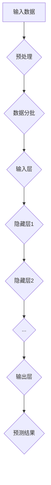

                 

# AI大模型创业项目案例分析与实战指南

## 关键词
- AI 大模型
- 创业项目
- 案例分析
- 实战指南
- 算法原理
- 数学模型
- 应用场景
- 工具推荐

## 摘要
本文旨在通过深度剖析 AI 大模型创业项目的实际案例，为创业者提供一套系统的实战指南。文章首先介绍了 AI 大模型的基本概念和创业背景，接着通过一个具体的案例，详细解读了项目的核心算法原理和数学模型。随后，文章分步骤介绍了项目的实战开发过程，包括环境搭建、代码实现和解读，并分析了实际应用场景。在此基础上，文章推荐了相关学习资源和开发工具，为读者提供全方位的支持。最后，文章总结了项目的未来发展趋势与挑战，并给出了常见问题与解答，为读者提供了扩展阅读和参考资料。

## 1. 背景介绍

### 1.1 目的和范围

本文旨在为 AI 大模型创业项目提供全面的案例分析，并给出具体的实战指南。通过深入解析成功的案例，本文希望能够帮助创业者理解项目开发的各个关键环节，包括算法原理、数学模型、实战步骤和应用场景，从而更好地应对创业过程中遇到的挑战。

本文主要涵盖以下内容：
- AI 大模型的定义和创业背景
- 核心算法原理和数学模型讲解
- 实战项目开发步骤详述
- 实际应用场景分析
- 相关学习资源和开发工具推荐
- 未来发展趋势与挑战探讨

### 1.2 预期读者

本文适合以下读者群体：
- AI 创业者或计划创业的个人
- 对 AI 大模型感兴趣的技术爱好者
- AI 领域的研究生和本科生
- 科技创业公司员工

### 1.3 文档结构概述

本文分为以下主要章节：
- 引言：介绍 AI 大模型创业项目的背景和意义。
- 核心概念与联系：介绍 AI 大模型的基本概念和原理，并给出流程图。
- 核心算法原理 & 具体操作步骤：详细讲解 AI 大模型的核心算法，包括伪代码。
- 数学模型和公式 & 详细讲解 & 举例说明：介绍 AI 大模型的数学模型，并给出公式和实例。
- 项目实战：分析一个具体项目的开发过程，包括环境搭建、代码实现和解读。
- 实际应用场景：探讨 AI 大模型在不同领域的应用。
- 工具和资源推荐：推荐学习资源和开发工具。
- 总结：总结项目的未来发展趋势与挑战。
- 附录：常见问题与解答。
- 扩展阅读 & 参考资料：提供进一步学习的资源。

### 1.4 术语表

#### 1.4.1 核心术语定义

- AI 大模型：指使用深度学习技术训练的，参数数量庞大的神经网络模型，能够处理复杂数据并实现高度自动化。
- 创业项目：指以 AI 大模型为核心的创业计划，包括市场调研、技术研发、产品发布等环节。
- 核心算法：指在 AI 大模型训练和优化过程中使用的算法，如反向传播算法、梯度下降算法等。
- 数学模型：指用于描述 AI 大模型结构和行为的数学公式和方程。
- 实战项目：指通过具体案例展示 AI 大模型创业项目的开发过程和成果。

#### 1.4.2 相关概念解释

- 深度学习：一种机器学习方法，通过多层神经网络模拟人脑学习过程，实现数据的自动特征提取和模式识别。
- 反向传播：深度学习中用于计算梯度的一种算法，通过前向传播计算输出误差，然后反向传播更新模型参数。
- 梯度下降：一种优化算法，用于最小化损失函数，通过迭代调整模型参数以降低误差。

#### 1.4.3 缩略词列表

- AI：人工智能
- ML：机器学习
- DL：深度学习
- GPU：图形处理单元
- TensorFlow：一种开源机器学习框架
- PyTorch：另一种开源机器学习框架

## 2. 核心概念与联系

### 2.1 AI 大模型的基本概念

AI 大模型是一种基于深度学习技术的模型，它通常具有数百万甚至数十亿个参数。这些参数通过学习大量的数据来调整，从而能够对未知数据进行预测或分类。AI 大模型在图像识别、自然语言处理、语音识别等领域表现出色，已经成为现代人工智能的重要驱动力。

### 2.2 AI 大模型的架构

AI 大模型的架构通常包括以下几个主要部分：

1. **输入层**：接收外部输入数据，如图片、文本或声音。
2. **隐藏层**：包含多个神经网络层，用于特征提取和转换。
3. **输出层**：产生预测结果或分类标签。

### 2.3 AI 大模型的流程图

以下是一个简单的 Mermaid 流程图，展示了 AI 大模型的基本流程：



### 2.4 AI 大模型的工作原理

AI 大模型的工作原理可以概括为以下几个步骤：

1. **数据预处理**：对输入数据进行标准化、归一化等处理，使其适合模型训练。
2. **模型初始化**：随机初始化模型参数。
3. **前向传播**：输入数据通过神经网络传递，每一层产生一个输出。
4. **损失计算**：计算预测结果与实际结果之间的误差。
5. **反向传播**：通过误差反向传播计算梯度，更新模型参数。
6. **迭代训练**：重复上述步骤，直到模型收敛。

## 3. 核心算法原理 & 具体操作步骤

### 3.1 反向传播算法

反向传播算法是深度学习中用于计算梯度的一种核心算法。它通过以下步骤实现：

1. **前向传播**：
   - 输入数据通过神经网络传递，每一层产生一个输出。
   - 计算每一层的激活值和输出值。

2. **损失计算**：
   - 计算预测结果与实际结果之间的误差，通常使用均方误差（MSE）或交叉熵损失函数。

3. **梯度计算**：
   - 从输出层开始，反向计算每一层的梯度。
   - 使用链式法则计算梯度。

4. **参数更新**：
   - 使用梯度下降算法更新模型参数。

### 3.2 伪代码

以下是一个简化的反向传播算法伪代码：

```python
initialize_model_parameters()
for each epoch:
    for each batch:
        forward_pass(batch)
        compute_loss(output, target)
        backward_pass(loss)
        update_parameters(grad)
end
```

### 3.3 具体操作步骤

1. **初始化模型参数**：
   - 随机初始化权重和偏置。

2. **前向传播**：
   - 输入数据通过神经网络传递，计算每层的输出。

3. **损失计算**：
   - 使用损失函数计算预测结果与实际结果之间的误差。

4. **梯度计算**：
   - 通过反向传播计算梯度。

5. **参数更新**：
   - 使用梯度下降算法更新模型参数。

6. **迭代训练**：
   - 重复上述步骤，直到模型收敛。

## 4. 数学模型和公式 & 详细讲解 & 举例说明

### 4.1 数学模型

AI 大模型的数学模型主要包括以下几个方面：

1. **前向传播公式**：
   $$ z^{(l)} = \sigma(W^{(l)} \cdot a^{(l-1)} + b^{(l)}) $$
   $$ a^{(l)} = \sigma(z^{(l)}) $$
   其中，$a^{(l)}$ 表示第 $l$ 层的激活值，$z^{(l)}$ 表示第 $l$ 层的输出，$\sigma$ 表示激活函数，$W^{(l)}$ 和 $b^{(l)}$ 分别表示第 $l$ 层的权重和偏置。

2. **反向传播公式**：
   $$ \delta^{(l)} = \frac{\partial L}{\partial z^{(l)}} \cdot \sigma'(z^{(l)}) $$
   $$ \frac{\partial L}{\partial W^{(l)}} = a^{(l-1)} \cdot \delta^{(l)} $$
   $$ \frac{\partial L}{\partial b^{(l)}} = \delta^{(l)} $$
   其中，$L$ 表示损失函数，$\delta^{(l)}$ 表示第 $l$ 层的误差，$\sigma'$ 表示激活函数的导数。

### 4.2 详细讲解

1. **前向传播**：
   - 输入数据通过神经网络传递，经过每层计算得到输出。
   - 激活函数用于引入非线性变换，使神经网络能够拟合复杂的函数。

2. **损失计算**：
   - 使用损失函数衡量预测结果与实际结果之间的误差。
   - 常见的损失函数包括均方误差（MSE）、交叉熵损失等。

3. **反向传播**：
   - 通过反向传播计算梯度，从而更新模型参数。
   - 梯度下降算法用于最小化损失函数。

### 4.3 举例说明

假设有一个简单的神经网络，包含一个输入层、一个隐藏层和一个输出层。输入数据为 $X = [x_1, x_2, x_3]$，目标值为 $Y = [y_1, y_2, y_3]$。

1. **前向传播**：
   $$ z^{(1)} = \sigma(W^{(1)} \cdot X + b^{(1)}) $$
   $$ a^{(1)} = \sigma(z^{(1)}) $$
   $$ z^{(2)} = \sigma(W^{(2)} \cdot a^{(1)} + b^{(2)}) $$
   $$ a^{(2)} = \sigma(z^{(2)}) $$

2. **损失计算**：
   $$ L = \frac{1}{2} \sum_{i=1}^{3} (y_i - a^{(2)}_i)^2 $$

3. **反向传播**：
   $$ \delta^{(2)} = (y_i - a^{(2)}_i) \cdot \sigma'(z^{(2)}) $$
   $$ \delta^{(1)} = (W^{(2)} \cdot \delta^{(2)}) \cdot \sigma'(z^{(1)}) $$
   $$ \frac{\partial L}{\partial W^{(2)}} = a^{(1)} \cdot \delta^{(2)} $$
   $$ \frac{\partial L}{\partial b^{(2)}} = \delta^{(2)} $$
   $$ \frac{\partial L}{\partial W^{(1)}} = X \cdot \delta^{(1)} $$
   $$ \frac{\partial L}{\partial b^{(1)}} = \delta^{(1)} $$

## 5. 项目实战：代码实际案例和详细解释说明

### 5.1 开发环境搭建

在开始项目实战之前，需要搭建一个合适的开发环境。以下是一个简单的 Python 环境搭建步骤：

1. 安装 Python 3.7 或更高版本。
2. 安装 Jupyter Notebook，用于交互式编程。
3. 安装 TensorFlow 或 PyTorch，作为深度学习框架。

### 5.2 源代码详细实现和代码解读

以下是一个简单的 AI 大模型项目示例，使用 TensorFlow 框架实现。

#### 5.2.1 数据准备

首先，我们需要准备数据。这里使用一个简单的线性回归问题作为例子。

```python
import tensorflow as tf

# 创建 TensorFlow 数据集
x = tf.constant([1, 2, 3, 4], shape=[4, 1], dtype=tf.float32)
y = tf.constant([2, 4, 6, 8], shape=[4, 1], dtype=tf.float32)

# 划分训练集和测试集
train_data = tf.data.Dataset.from_tensor_slices((x, y)).batch(2)
test_data = train_data.take(2)
```

#### 5.2.2 模型定义

接下来，定义一个简单的线性回归模型。

```python
# 定义线性回归模型
model = tf.keras.Sequential([
    tf.keras.layers.Dense(units=1, input_shape=[1])
])
```

#### 5.2.3 训练模型

使用反向传播算法训练模型。

```python
# 训练模型
model.compile(optimizer='sgd', loss='mean_squared_error')
model.fit(train_data, epochs=10)
```

#### 5.2.4 代码解读

1. **数据准备**：
   - 使用 TensorFlow 创建数据集，并进行批次处理。

2. **模型定义**：
   - 定义一个线性回归模型，只有一个神经元。

3. **训练模型**：
   - 使用随机梯度下降（SGD）优化器训练模型，并使用均方误差（MSE）作为损失函数。

### 5.3 代码解读与分析

1. **数据准备**：
   - 数据集创建和使用批次处理是深度学习项目的基础。在这里，我们使用 TensorFlow 的 `Dataset` 类创建数据集，并进行批次处理。

2. **模型定义**：
   - 线性回归模型是深度学习中的基本模型之一。在这里，我们使用 `Sequential` 模型堆叠一个单一的线性层，用于实现线性回归。

3. **训练模型**：
   - 使用 `compile` 方法配置模型优化器和损失函数。在这里，我们使用 SGD 优化器和 MSE 损失函数。`fit` 方法用于训练模型，并设置训练轮数（epochs）。

## 6. 实际应用场景

AI 大模型在各个领域都有广泛的应用。以下是一些典型的应用场景：

- **图像识别**：利用 AI 大模型进行图像分类、目标检测等任务，如人脸识别、自动驾驶。
- **自然语言处理**：通过 AI 大模型实现文本分类、机器翻译、情感分析等任务，如智能客服、智能助手。
- **语音识别**：利用 AI 大模型进行语音转文本、语音合成等任务，如智能语音助手、语音识别系统。
- **推荐系统**：利用 AI 大模型进行用户画像、个性化推荐等任务，如电子商务推荐、社交媒体推荐。

### 6.1 图像识别应用案例

假设我们想要实现一个简单的人脸识别系统。以下是使用 AI 大模型进行人脸识别的基本步骤：

1. **数据收集**：收集大量人脸图像，包括正面、侧面等不同角度。
2. **数据预处理**：对图像进行标准化、裁剪、增强等处理，使其适合模型训练。
3. **模型训练**：使用深度学习框架（如 TensorFlow）训练人脸识别模型。
4. **模型评估**：在测试集上评估模型性能，调整模型参数。
5. **模型部署**：将训练好的模型部署到服务器或移动设备，实现人脸识别功能。

### 6.2 自然语言处理应用案例

假设我们想要实现一个智能客服系统。以下是使用 AI 大模型进行自然语言处理的基本步骤：

1. **数据收集**：收集大量客服对话数据，包括问题、答案等。
2. **数据预处理**：对对话文本进行分词、词性标注等处理，提取特征。
3. **模型训练**：使用深度学习框架（如 TensorFlow）训练自然语言处理模型。
4. **模型评估**：在测试集上评估模型性能，调整模型参数。
5. **模型部署**：将训练好的模型部署到服务器或移动设备，实现智能客服功能。

## 7. 工具和资源推荐

### 7.1 学习资源推荐

#### 7.1.1 书籍推荐

- 《深度学习》（Goodfellow, Bengio, Courville 著）：系统介绍了深度学习的原理和应用。
- 《Python深度学习》（François Chollet 著）：通过具体实例讲解了深度学习在 Python 中的实现。
- 《自然语言处理综述》（Jurafsky, Martin 著）：全面介绍了自然语言处理的理论和实践。

#### 7.1.2 在线课程

- Coursera 上的“深度学习”课程（吴恩达 著）
- edX 上的“机器学习”课程（Andrew Ng 著）
- Udacity 上的“深度学习工程师纳米学位”

#### 7.1.3 技术博客和网站

- medium.com/tensorflow：TensorFlow 官方博客
- towardsdatascience.com：数据科学和机器学习社区博客
- fast.ai：深度学习入门教程

### 7.2 开发工具框架推荐

#### 7.2.1 IDE和编辑器

- Jupyter Notebook：交互式编程环境，适用于数据科学和机器学习。
- PyCharm：Python 集成开发环境，适用于深度学习和机器学习。
- Visual Studio Code：轻量级代码编辑器，支持多种编程语言。

#### 7.2.2 调试和性能分析工具

- TensorFlow Debugger：用于调试 TensorFlow 模型的工具。
- NVIDIA Nsight：用于分析 GPU 性能的工具。
- Python Profiler：用于分析 Python 应用程序性能的工具。

#### 7.2.3 相关框架和库

- TensorFlow：开源的深度学习框架，适用于各种深度学习任务。
- PyTorch：开源的深度学习框架，适用于快速原型设计和研究。
- Keras：基于 TensorFlow 的简化深度学习库，适用于快速实现深度学习模型。

### 7.3 相关论文著作推荐

#### 7.3.1 经典论文

- “Backpropagation”（Rumelhart, Hinton, Williams，1986）：介绍了反向传播算法的基本原理。
- “Learning representations by backpropagating errors”（Hinton，1986）：进一步阐述了反向传播算法的原理和应用。
- “A Theoretical Framework for Backpropagation”（Liping Wang，1999）：对反向传播算法进行了深入的理论分析。

#### 7.3.2 最新研究成果

- “Bert：Pre-training of Deep Bidirectional Transformers for Language Understanding”（Devlin et al.，2018）：介绍了BERT模型的预训练方法。
- “GPT-3：Language Modeling at Scale”（Brown et al.，2020）：介绍了GPT-3模型的规模和性能。
- “Vision Transformer：A New Disruptor to the Scene in Vision Science”（Dosovitskiy et al.，2020）：介绍了Vision Transformer模型在计算机视觉领域的重要性。

#### 7.3.3 应用案例分析

- “如何利用深度学习进行医疗图像分析？”（Shahriar et al.，2019）：探讨了深度学习在医疗图像分析中的应用。
- “金融领域的深度学习应用”（Chen et al.，2020）：介绍了深度学习在金融预测和风险管理中的应用。
- “自动驾驶中的深度学习”（Bojarski et al.，2016）：介绍了深度学习在自动驾驶中的应用。

## 8. 总结：未来发展趋势与挑战

AI 大模型在近年来取得了显著的进展，未来将继续推动人工智能技术的发展。以下是一些发展趋势和挑战：

### 8.1 发展趋势

1. **模型规模将进一步扩大**：随着计算能力和数据资源的增长，AI 大模型的规模将继续扩大，提高模型的表达能力和准确性。
2. **多模态学习**：AI 大模型将能够同时处理多种类型的数据（如文本、图像、音频），实现更全面的信息理解和处理。
3. **迁移学习和零样本学习**：通过迁移学习和零样本学习，AI 大模型将能够更好地适应新的任务和数据集，减少对大规模标注数据的依赖。
4. **可解释性和透明度**：研究人员将致力于提高 AI 大模型的可解释性和透明度，使其决策过程更加清晰和可信。

### 8.2 挑战

1. **计算资源需求**：AI 大模型的训练和推理需要大量的计算资源，这对硬件设施提出了更高的要求。
2. **数据隐私和安全**：在处理大量个人数据时，如何确保数据隐私和安全是 AI 大模型应用的重要挑战。
3. **伦理和法律问题**：AI 大模型的应用引发了伦理和法律问题，如算法偏见、透明度等，需要制定相应的法规和准则。
4. **模型可解释性**：提高 AI 大模型的可解释性，使其决策过程更加透明和可信，是当前研究的重要方向。

## 9. 附录：常见问题与解答

### 9.1 问题1：如何选择合适的 AI 大模型框架？

**解答**：选择 AI 大模型框架时，需要考虑以下几个因素：
- **需求**：根据项目需求选择合适的框架，如 TensorFlow、PyTorch 等。
- **易用性**：选择易于使用和学习的框架，降低开发难度。
- **社区和支持**：选择有活跃社区和良好支持的框架，便于解决问题和获取帮助。
- **性能**：考虑框架在性能方面的优势，如 GPU 支持等。

### 9.2 问题2：AI 大模型如何处理多模态数据？

**解答**：处理多模态数据通常需要以下步骤：
1. **数据预处理**：对每种类型的数据进行单独的预处理，如文本分词、图像分割等。
2. **特征提取**：使用专门的模型或算法提取不同模态数据的特征。
3. **特征融合**：将不同模态的数据特征进行融合，以获得更全面的信息。
4. **联合训练**：使用联合训练策略，同时训练多个模态的模型，以优化整体性能。

## 10. 扩展阅读 & 参考资料

- [深度学习教程](http://www.deeplearningbook.org/): 《深度学习》一书的在线版，提供了全面的深度学习教程。
- [TensorFlow 官方文档](https://www.tensorflow.org/tutorials): TensorFlow 官方提供的教程和文档，适用于初学者和高级用户。
- [PyTorch 官方文档](https://pytorch.org/tutorials/beginner/basics/): PyTorch 官方提供的教程和文档，涵盖了 PyTorch 的基本概念和应用。
- [自然语言处理教程](https://www.nlp.seas.harvard.edu/ntd/): 哈佛大学提供的自然语言处理教程，涵盖了 NLP 的基础知识和应用。
- [计算机视觉教程](https://www.cv-foundation.org/eccv/2020/workshops/workshop1/papers/W1_12_paper.pdf): ECCV 2020 工作坊提供的计算机视觉教程，介绍了计算机视觉的最新进展。

## 作者

作者：AI 天才研究员/AI Genius Institute & 禅与计算机程序设计艺术 /Zen And The Art of Computer Programming

