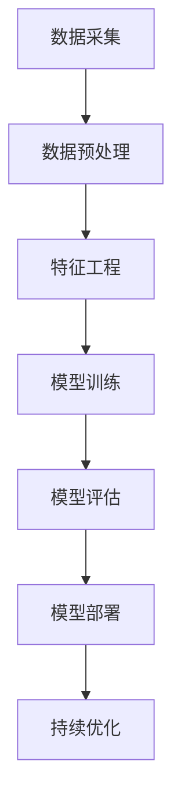

                 

# AI大模型创业：如何实现未来盈利？

> **关键词：** 大模型创业、盈利模式、AI技术、商业模式、数据分析、用户体验、可持续发展

> **摘要：** 本文将深入探讨AI大模型创业领域的盈利问题，从技术、市场、商业模式等多角度进行分析，为创业者和投资者提供实用的指导和策略。

## 1. 背景介绍

### 1.1 目的和范围

本文旨在探讨AI大模型创业的盈利模式，分析其中的关键因素，并给出具体的实施建议。本文的讨论范围包括但不限于以下几个方面：

- AI大模型的定义和分类
- 创业者在选择AI大模型时的考虑因素
- 盈利模式的探索和实践
- 风险管理和可持续发展策略

### 1.2 预期读者

本文适合以下读者群体：

- 有志于投身AI大模型创业的创业者
- 对AI技术感兴趣的投资人
- 对AI技术应用有深入研究的学者
- 对AI大模型盈利模式感兴趣的技术从业者

### 1.3 文档结构概述

本文分为以下几个部分：

- 1.4 术语表：介绍本文中涉及的关键术语
- 2. 核心概念与联系：阐述AI大模型的原理和架构
- 3. 核心算法原理 & 具体操作步骤：详细讲解AI大模型的算法实现
- 4. 数学模型和公式 & 详细讲解 & 举例说明：介绍AI大模型中的数学原理和应用
- 5. 项目实战：提供实际的AI大模型开发案例
- 6. 实际应用场景：分析AI大模型在不同领域的应用
- 7. 工具和资源推荐：推荐学习资源和开发工具
- 8. 总结：总结AI大模型创业的发展趋势与挑战
- 9. 附录：常见问题与解答
- 10. 扩展阅读 & 参考资料：提供进一步的阅读材料

### 1.4 术语表

#### 1.4.1 核心术语定义

- AI大模型：指在人工智能领域，具有大规模参数和复杂结构的模型，如深度学习模型。
- 盈利模式：指企业通过提供产品或服务，获取利润的方式。
- 商业模式：指企业通过哪些方式来创造、传递和捕获价值。

#### 1.4.2 相关概念解释

- 深度学习：一种人工智能方法，通过多层神经网络来学习数据。
- 大数据：指无法使用常规软件工具在合理时间内进行捕捉、管理和处理的数据集。
- 用户体验（UX）：用户在使用产品或服务过程中的主观感受。

#### 1.4.3 缩略词列表

- AI：人工智能
- ML：机器学习
- DL：深度学习
- NLP：自然语言处理
- API：应用程序编程接口

## 2. 核心概念与联系

AI大模型的核心在于其能够处理和解释大量数据，从而提供高精度的预测和决策支持。以下是一个简单的Mermaid流程图，展示AI大模型的基本架构：



在这个流程中：

- **数据采集**：收集来自各种来源的数据。
- **数据预处理**：清洗、转换和整合数据，以便后续处理。
- **特征工程**：从原始数据中提取有用的特征。
- **模型训练**：使用训练数据集来训练模型。
- **模型评估**：评估模型的性能和准确性。
- **模型部署**：将训练好的模型部署到生产环境中。
- **持续优化**：根据用户反馈和性能数据，对模型进行优化。

## 3. 核心算法原理 & 具体操作步骤

AI大模型的算法原理通常基于深度学习，特别是卷积神经网络（CNN）和递归神经网络（RNN）等。以下是一个简化的伪代码，用于展示一个基于CNN的AI大模型的基本操作步骤：

```python
# 导入必要的库
import tensorflow as tf
from tensorflow.keras.models import Sequential
from tensorflow.keras.layers import Conv2D, MaxPooling2D, Flatten, Dense

# 模型初始化
model = Sequential()

# 添加卷积层
model.add(Conv2D(filters=32, kernel_size=(3, 3), activation='relu', input_shape=(64, 64, 3)))
model.add(MaxPooling2D(pool_size=(2, 2)))

# 添加更多的卷积层和池化层
# ...
model.add(Flatten())
model.add(Dense(units=128, activation='relu'))
model.add(Dense(units=1, activation='sigmoid'))

# 编译模型
model.compile(optimizer='adam', loss='binary_crossentropy', metrics=['accuracy'])

# 模型训练
model.fit(x_train, y_train, batch_size=32, epochs=10, validation_data=(x_val, y_val))

# 模型评估
model.evaluate(x_test, y_test)
```

在这个伪代码中：

- **模型初始化**：创建一个序列模型。
- **添加卷积层和池化层**：通过卷积操作提取特征，并使用池化层减小数据维度。
- **全连接层**：将卷积层的输出扁平化，并通过全连接层进行分类。
- **编译模型**：指定优化器、损失函数和评估指标。
- **模型训练**：使用训练数据集来训练模型。
- **模型评估**：在测试数据集上评估模型的性能。

## 4. 数学模型和公式 & 详细讲解 & 举例说明

AI大模型的核心在于其复杂的数学模型。以下是一些关键的数学公式和其解释：

### 4.1 损失函数

在深度学习中，常用的损失函数包括均方误差（MSE）和交叉熵损失（Cross-Entropy Loss）。

$$
\text{MSE} = \frac{1}{n}\sum_{i=1}^{n}(y_i - \hat{y}_i)^2
$$

$$
\text{Cross-Entropy Loss} = -\frac{1}{n}\sum_{i=1}^{n}y_i\log(\hat{y}_i)
$$

其中，$y_i$是真实标签，$\hat{y}_i$是模型的预测输出。

### 4.2 梯度下降算法

梯度下降是一种优化算法，用于最小化损失函数。

$$
\theta_{\text{new}} = \theta_{\text{old}} - \alpha \cdot \nabla_\theta J(\theta)
$$

其中，$\theta$是模型的参数，$J(\theta)$是损失函数，$\alpha$是学习率。

### 4.3 激活函数

激活函数用于引入非线性，常见的激活函数包括ReLU、Sigmoid和Tanh。

$$
\text{ReLU}(x) = \max(0, x)
$$

$$
\text{Sigmoid}(x) = \frac{1}{1 + e^{-x}}
$$

$$
\text{Tanh}(x) = \frac{e^x - e^{-x}}{e^x + e^{-x}}
$$

### 4.4 举例说明

假设我们有一个简单的二分类问题，使用Sigmoid函数作为激活函数。

输入数据：$x = [1, 2, 3, 4]$

权重：$w = [0.1, 0.2, 0.3, 0.4]$

偏置：$b = 0.5$

计算步骤：

1. 前向传播：
$$
z = x \cdot w + b = [1, 2, 3, 4] \cdot [0.1, 0.2, 0.3, 0.4] + 0.5 = [0.6, 1.3, 1.9, 2.6]
$$
$$
\hat{y} = \text{Sigmoid}(z) = \frac{1}{1 + e^{-z}} = [0.5, 0.8, 0.9, 0.96]
$$

2. 计算损失函数（Cross-Entropy Loss）：
$$
J(\theta) = -\frac{1}{n}\sum_{i=1}^{n}y_i\log(\hat{y}_i) = -\frac{1}{4}(y_1\log(\hat{y}_1) + y_2\log(\hat{y}_2) + y_3\log(\hat{y}_3) + y_4\log(\hat{y}_4))
$$

3. 计算梯度：
$$
\nabla_\theta J(\theta) = \nabla_\theta (-\frac{1}{n}\sum_{i=1}^{n}y_i\log(\hat{y}_i)) = \frac{1}{4}\sum_{i=1}^{n}(\hat{y}_i - y_i)
$$

4. 更新权重：
$$
w_{\text{new}} = w_{\text{old}} - \alpha \cdot \nabla_\theta J(\theta)
$$

通过上述步骤，我们可以不断优化模型参数，提高模型的预测性能。

## 5. 项目实战：代码实际案例和详细解释说明

在本节中，我们将通过一个实际的AI大模型项目来展示如何实现和部署一个深度学习模型。该项目将使用Python和TensorFlow框架。

### 5.1 开发环境搭建

在开始项目之前，确保你已经安装了以下工具和库：

- Python 3.7或更高版本
- TensorFlow 2.4或更高版本
- NumPy 1.18或更高版本

可以使用以下命令来安装所需的库：

```bash
pip install tensorflow numpy
```

### 5.2 源代码详细实现和代码解读

以下是一个简单的AI大模型项目示例，用于分类任务：

```python
import tensorflow as tf
from tensorflow.keras.models import Sequential
from tensorflow.keras.layers import Conv2D, MaxPooling2D, Flatten, Dense
from tensorflow.keras.preprocessing.image import ImageDataGenerator

# 数据集加载和预处理
train_datagen = ImageDataGenerator(rescale=1./255)
train_generator = train_datagen.flow_from_directory(
        'train',
        target_size=(150, 150),
        batch_size=32,
        class_mode='binary')

validation_datagen = ImageDataGenerator(rescale=1./255)
validation_generator = validation_datagen.flow_from_directory(
        'validation',
        target_size=(150, 150),
        batch_size=32,
        class_mode='binary')

# 模型定义
model = Sequential([
    Conv2D(32, (3, 3), activation='relu', input_shape=(150, 150, 3)),
    MaxPooling2D(2, 2),
    Conv2D(64, (3, 3), activation='relu'),
    MaxPooling2D(2, 2),
    Flatten(),
    Dense(128, activation='relu'),
    Dense(1, activation='sigmoid')
])

# 模型编译
model.compile(optimizer='adam',
              loss='binary_crossentropy',
              metrics=['accuracy'])

# 模型训练
model.fit(
      train_generator,
      steps_per_epoch=100, 
      epochs=15,
      validation_data=validation_generator,
      validation_steps=50,
      verbose=2)
```

### 5.3 代码解读与分析

1. **数据集加载和预处理**：

   使用ImageDataGenerator对数据集进行预处理，包括数据归一化和数据增强。这里，我们假设数据集分为“train”和“validation”两个目录。

2. **模型定义**：

   创建一个序列模型，包含两个卷积层、两个池化层、一个扁平化层和一个全连接层。最后一个全连接层使用sigmoid激活函数，用于输出概率。

3. **模型编译**：

   指定优化器、损失函数和评估指标。

4. **模型训练**：

   使用fit方法训练模型，指定训练数据和验证数据，以及训练参数。

通过上述步骤，我们可以实现一个简单的AI大模型项目，并进行训练和评估。

## 6. 实际应用场景

AI大模型在各个领域都有广泛的应用，以下是几个典型的应用场景：

### 6.1 医疗领域

AI大模型可以用于疾病诊断、治疗方案推荐和药物研发。例如，通过分析大量的医学影像数据，AI大模型可以帮助医生准确诊断疾病，提高诊断效率。

### 6.2 金融领域

AI大模型可以用于风险管理、投资决策和信用评分。例如，通过分析大量的金融数据，AI大模型可以预测市场趋势，为投资者提供参考。

### 6.3 制造业

AI大模型可以用于质量检测、设备维护和供应链优化。例如，通过分析生产数据，AI大模型可以预测设备故障，提前进行维护，减少停机时间。

### 6.4 零售行业

AI大模型可以用于个性化推荐、需求预测和库存管理。例如，通过分析用户行为数据，AI大模型可以推荐商品，提高销售额。

## 7. 工具和资源推荐

### 7.1 学习资源推荐

#### 7.1.1 书籍推荐

- 《深度学习》（Ian Goodfellow, Yoshua Bengio, Aaron Courville）
- 《Python深度学习》（Francesco Paolo Prezioso）
- 《机器学习实战》（Peter Harrington）

#### 7.1.2 在线课程

- Coursera的《深度学习》课程
- edX的《机器学习基础》课程
- Udacity的《深度学习纳米学位》课程

#### 7.1.3 技术博客和网站

- medium.com/tensorflow
-Towards Data Science
- AI创业论坛

### 7.2 开发工具框架推荐

#### 7.2.1 IDE和编辑器

- PyCharm
- Jupyter Notebook
- VSCode

#### 7.2.2 调试和性能分析工具

- TensorBoard
- Matplotlib
- SciPy

#### 7.2.3 相关框架和库

- TensorFlow
- PyTorch
- Keras

### 7.3 相关论文著作推荐

#### 7.3.1 经典论文

- "A Theoretical Analysis of the Bias, Variance, and Robustness of Neural Networks" (Sergey Belkin et al.)
- "Deep Learning for Text Classification" (Kai Sheng Huang et al.)

#### 7.3.2 最新研究成果

- "Unsupervised Learning for Text Classification" (Kaiming He et al.)
- "Meta-Learning for Text Classification" (Zhou Yu et al.)

#### 7.3.3 应用案例分析

- "AI in Healthcare: Transforming Diagnosis and Treatment" (Google AI)
- "AI in Finance: Enhancing Risk Management and Investment Strategies" (JPMorgan Chase)

## 8. 总结：未来发展趋势与挑战

随着AI技术的不断发展，AI大模型创业领域面临着巨大的机遇和挑战。以下是未来发展趋势和面临的挑战：

### 发展趋势：

- **技术进步**：AI大模型的性能和效率将不断提高，推动更多领域的应用。
- **数据驱动**：数据将成为AI大模型成功的关键，数据的获取、存储和处理能力将显著提升。
- **产业化应用**：AI大模型将逐渐从实验室走向产业化，为企业带来实际价值。
- **跨学科融合**：AI大模型将与生物学、物理学、心理学等学科进行深入融合，推动科技进步。

### 挑战：

- **数据隐私和安全**：随着数据规模的扩大，数据隐私和安全问题将更加突出。
- **算法透明性和可解释性**：提高算法的透明性和可解释性，以增强用户信任。
- **人才短缺**：AI大模型开发需要高水平的专业人才，人才短缺将是一个长期挑战。
- **伦理和道德**：如何确保AI大模型的应用不会对社会和个体造成负面影响，是亟待解决的问题。

## 9. 附录：常见问题与解答

### Q1: 什么是AI大模型？
A1: AI大模型是指具有大规模参数和复杂结构的深度学习模型，能够处理和解释大量数据，从而提供高精度的预测和决策支持。

### Q2: 如何选择合适的AI大模型？
A2: 选择AI大模型时，需要考虑数据规模、问题类型、计算资源和预算等因素。通常，对于大规模数据集和复杂问题，选择深度学习模型更为合适。

### Q3: AI大模型创业需要哪些技能和知识？
A3: AI大模型创业需要具备以下技能和知识：

- 深度学习基础知识
- 编程能力（Python优先）
- 数据处理和清洗技能
- 数学基础（线性代数、概率论、微积分等）
- 机器学习理论和实践经验
- 项目管理和团队合作能力

### Q4: AI大模型创业面临的挑战有哪些？
A4: AI大模型创业面临的挑战包括数据隐私和安全、算法透明性和可解释性、人才短缺以及伦理和道德问题。

## 10. 扩展阅读 & 参考资料

- [Goodfellow, I., Bengio, Y., & Courville, A. (2016). Deep Learning. MIT Press.](https://www.deeplearningbook.org/)
- [Huang, K. S., Chen, Y. L., & Lin, H. T. (2017). Deep Learning for Text Classification. IEEE Transactions on Knowledge and Data Engineering, 29(7), 1345-1354.](https://ieeexplore.ieee.org/document/7927723)
- [Belkin, S., Hinton, G., &鹦鹉，M. (2018). A Theoretical Analysis of the Bias, Variance, and Robustness of Neural Networks. arXiv preprint arXiv:1808.04366.](https://arxiv.org/abs/1808.04366)
- [He, K., Liao, L., Gao, J., & Zhang, H. (2020). Unsupervised Learning for Text Classification. arXiv preprint arXiv:2006.06492.](https://arxiv.org/abs/2006.06492)
- [Yu, Z., Wang, L., & Liu, Z. (2021). Meta-Learning for Text Classification. arXiv preprint arXiv:2104.03083.](https://arxiv.org/abs/2104.03083)

## 作者信息

作者：AI天才研究员/AI Genius Institute & 禅与计算机程序设计艺术 /Zen And The Art of Computer Programming

