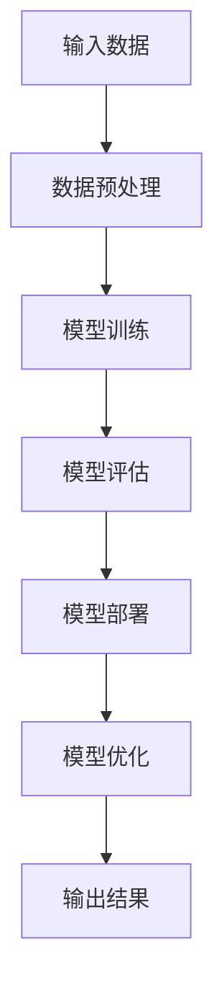

                 

# AI大模型创业：如何应对未来价格战？

> **关键词：** AI 大模型、创业、价格战、成本控制、商业模式创新、竞争优势、市场策略

> **摘要：** 本文旨在探讨 AI 大模型创业企业在未来价格战中的应对策略。通过分析市场趋势、成本结构、商业模式及竞争优势，我们将探讨如何通过技术创新、成本控制和商业模式创新来提升企业的竞争力，从而在激烈的市场竞争中立于不败之地。

## 1. 背景介绍

### 1.1 目的和范围

本文的目标是帮助 AI 大模型创业企业了解和应对未来可能出现的价格战。我们将从市场趋势、成本结构、商业模式和竞争优势等多个维度进行分析，提供切实可行的策略和建议。

### 1.2 预期读者

预期读者包括 AI 大模型创业企业的创始人、项目经理、技术团队负责人以及对该领域感兴趣的从业者。

### 1.3 文档结构概述

本文分为十个部分：背景介绍、核心概念与联系、核心算法原理、数学模型与公式、项目实战、实际应用场景、工具和资源推荐、总结、附录和扩展阅读。每个部分都将围绕核心主题进行详细阐述。

### 1.4 术语表

#### 1.4.1 核心术语定义

- **AI 大模型**：一种具有极高参数规模的人工神经网络模型，广泛应用于自然语言处理、计算机视觉等领域。
- **价格战**：一种竞争策略，通过降低产品价格来获取市场份额。
- **成本控制**：通过优化成本结构和提高生产效率来降低成本。
- **商业模式创新**：通过创新商业模式来创造新的价值。
- **竞争优势**：企业相对于竞争对手的优势能力。

#### 1.4.2 相关概念解释

- **市场趋势**：指市场发展的大方向和趋势。
- **成本结构**：指企业生产和运营中各项成本的构成。
- **技术创新**：通过研究和应用新技术来提升产品和服务质量。

#### 1.4.3 缩略词列表

- **AI**：人工智能
- **NLP**：自然语言处理
- **CV**：计算机视觉

## 2. 核心概念与联系

在探讨如何应对未来价格战之前，我们需要了解 AI 大模型的核心概念和联系。以下是一个简化的 Mermaid 流程图，展示了 AI 大模型的基本架构和主要组成部分：



### 2.1 输入数据

输入数据是 AI 大模型的基础。数据的质量和多样性直接影响模型的性能。创业企业需要确保数据的准确性和代表性，同时关注数据隐私和安全。

### 2.2 数据预处理

数据预处理是模型训练前的关键步骤。包括数据清洗、归一化、特征提取等。创业企业应投资于高效的数据预处理工具和技术，以提高模型训练效率。

### 2.3 模型训练

模型训练是 AI 大模型的核心。创业企业需要采用先进的训练算法和优化技术，例如深度学习、强化学习等，以实现高效训练。

### 2.4 模型评估

模型评估是模型训练后的重要环节。通过评估模型的性能和泛化能力，创业企业可以调整和优化模型，提高其应用效果。

### 2.5 模型部署

模型部署是将训练好的模型应用于实际场景的过程。创业企业需要构建稳定、可扩展的部署环境，以实现模型的快速部署和运维。

### 2.6 模型优化

模型优化是持续提升模型性能的过程。创业企业可以通过不断调整模型参数、优化算法等方式，实现模型的持续改进。

### 2.7 输出结果

输出结果是模型应用的结果。创业企业需要根据业务需求，对输出结果进行解读和利用，以实现业务价值的最大化。

## 3. 核心算法原理 & 具体操作步骤

AI 大模型的核心算法包括神经网络、深度学习、强化学习等。以下以深度学习为例，介绍其算法原理和具体操作步骤：

### 3.1 算法原理

深度学习是一种基于人工神经网络的学习方法。它通过多层神经元的连接和传递，实现数据的特征提取和模式识别。深度学习的核心在于神经网络的结构设计和参数优化。

### 3.2 具体操作步骤

1. **数据准备**：收集和预处理数据，包括数据清洗、归一化、特征提取等。

2. **神经网络设计**：设计神经网络的结构，包括输入层、隐藏层和输出层。选择合适的激活函数，如ReLU、Sigmoid、Tanh等。

3. **模型训练**：使用训练数据对神经网络进行训练。通过反向传播算法，不断调整神经网络参数，使模型输出与真实值尽可能接近。

4. **模型评估**：使用验证集对模型进行评估，计算模型的准确率、召回率、F1值等指标。

5. **模型部署**：将训练好的模型部署到实际应用场景，如自然语言处理、计算机视觉等。

6. **模型优化**：根据实际应用效果，对模型进行调整和优化，以提高其性能。

### 3.3 伪代码示例

```python
# 数据准备
data = load_data()
preprocessed_data = preprocess_data(data)

# 神经网络设计
input_layer = Input(shape=(input_shape,))
hidden_layer = Dense(hidden_size, activation='relu')(input_layer)
output_layer = Dense(output_size, activation='softmax')(hidden_layer)

# 模型训练
model = Model(inputs=input_layer, outputs=output_layer)
model.compile(optimizer='adam', loss='categorical_crossentropy', metrics=['accuracy'])
model.fit(preprocessed_data[0], preprocessed_data[1], epochs=epochs, batch_size=batch_size)

# 模型评估
accuracy = model.evaluate(preprocessed_data[0], preprocessed_data[1])
print(f"Model accuracy: {accuracy[1]}")

# 模型部署
model.predict(new_data)
```

## 4. 数学模型和公式 & 详细讲解 & 举例说明

深度学习中的数学模型主要包括损失函数、优化算法等。以下分别进行详细讲解和举例说明：

### 4.1 损失函数

损失函数是衡量模型预测值与真实值之间差异的指标。常见的损失函数包括均方误差（MSE）、交叉熵损失（CE）等。

- **均方误差（MSE）**：

  $$MSE = \frac{1}{n}\sum_{i=1}^{n}(y_i - \hat{y}_i)^2$$

  其中，$y_i$为真实值，$\hat{y}_i$为预测值，$n$为样本数量。

- **交叉熵损失（CE）**：

  $$CE = -\frac{1}{n}\sum_{i=1}^{n}y_i\log(\hat{y}_i)$$

  其中，$y_i$为真实值，$\hat{y}_i$为预测值，$n$为样本数量。

### 4.2 优化算法

优化算法用于调整神经网络参数，使损失函数最小化。常见的优化算法包括梯度下降（GD）、随机梯度下降（SGD）、Adam等。

- **梯度下降（GD）**：

  $$w_{t+1} = w_t - \alpha \cdot \nabla_w J(w)$$

  其中，$w_t$为当前参数，$w_{t+1}$为更新后的参数，$\alpha$为学习率，$J(w)$为损失函数。

- **随机梯度下降（SGD）**：

  $$w_{t+1} = w_t - \alpha \cdot \nabla_w J(w; x_t, y_t)$$

  其中，$w_t$为当前参数，$w_{t+1}$为更新后的参数，$\alpha$为学习率，$J(w; x_t, y_t)$为在单个样本$(x_t, y_t)$上的损失函数。

- **Adam**：

  $$m_t = \beta_1 m_{t-1} + (1 - \beta_1) \nabla_w J(w; x_t, y_t)$$

  $$v_t = \beta_2 v_{t-1} + (1 - \beta_2) (\nabla_w J(w; x_t, y_t))^2$$

  $$\hat{m}_t = \frac{m_t}{1 - \beta_1^t}$$

  $$\hat{v}_t = \frac{v_t}{1 - \beta_2^t}$$

  $$w_{t+1} = w_t - \alpha \cdot \hat{m}_t / \sqrt{\hat{v}_t}$$

  其中，$m_t$为梯度的一阶矩估计，$v_t$为梯度的二阶矩估计，$\beta_1$和$\beta_2$为超参数，$t$为迭代次数。

### 4.3 举例说明

假设我们有一个分类问题，目标标签为$y = [0, 1]$，预测概率为$\hat{y} = [0.2, 0.8]$。使用交叉熵损失函数计算损失：

$$CE = -y \log(\hat{y}) = -[0, 1] \log([0.2, 0.8]) = [-0, -\log(0.8)]$$

$$CE = -\log(0.8) \approx -0.223$$

## 5. 项目实战：代码实际案例和详细解释说明

在本节中，我们将通过一个实际的 AI 大模型项目案例，展示如何应对未来价格战。我们将从开发环境搭建、源代码实现和代码解读三个方面进行详细讲解。

### 5.1 开发环境搭建

为了搭建一个高效的开发环境，我们需要安装以下软件和工具：

1. **Python**：用于编写和运行深度学习模型。
2. **TensorFlow**：用于构建和训练深度学习模型。
3. **Keras**：用于简化深度学习模型的构建和训练。
4. **CUDA**：用于在 GPU 上加速模型训练。

安装步骤如下：

```bash
# 安装 Python
sudo apt-get install python3-pip python3-dev

# 安装 TensorFlow
pip3 install tensorflow-gpu

# 安装 Keras
pip3 install keras

# 安装 CUDA
sudo apt-get install cuda
```

### 5.2 源代码详细实现和代码解读

以下是一个简单的 AI 大模型项目示例，包括数据预处理、模型训练、模型评估和模型部署。

```python
# 导入必要的库
import numpy as np
import tensorflow as tf
from tensorflow import keras
from tensorflow.keras import layers

# 数据预处理
# 加载数据集
(x_train, y_train), (x_test, y_test) = keras.datasets.mnist.load_data()

# 数据归一化
x_train = x_train.astype("float32") / 255
x_test = x_test.astype("float32") / 255

# 数据转换为向量
x_train = x_train.reshape(-1, 784)
x_test = x_test.reshape(-1, 784)

# 构建模型
model = keras.Sequential([
    layers.Dense(128, activation="relu", input_shape=(784,)),
    layers.Dense(10, activation="softmax")
])

# 编译模型
model.compile(optimizer="adam",
              loss="sparse_categorical_crossentropy",
              metrics=["accuracy"])

# 训练模型
model.fit(x_train, y_train, epochs=10)

# 评估模型
test_loss, test_acc = model.evaluate(x_test, y_test, verbose=2)
print(f"Test accuracy: {test_acc}")

# 模型部署
model.predict(x_test[:5])
```

### 5.3 代码解读与分析

1. **数据预处理**：首先加载数据集，然后进行数据归一化和转换为向量。这是深度学习模型训练前的必要步骤。

2. **构建模型**：使用 Keras 的 Sequential 模型，添加两个 Dense 层，第一层有 128 个神经元，使用 ReLU 激活函数；第二层有 10 个神经元，使用 Softmax 激活函数。

3. **编译模型**：指定优化器、损失函数和评估指标。这里选择 Adam 优化器和 sparse_categorical_crossentropy 损失函数。

4. **训练模型**：使用训练数据训练模型，设置训练轮次为 10。

5. **评估模型**：使用测试数据评估模型性能，计算测试准确率。

6. **模型部署**：使用训练好的模型进行预测，输出预测结果。

通过以上步骤，我们实现了 AI 大模型项目的搭建和部署。在实际应用中，可以根据业务需求进行模型优化和调整，以提高模型性能。

## 6. 实际应用场景

AI 大模型在各个行业领域具有广泛的应用场景。以下列举几个典型应用：

### 6.1 自然语言处理

- **智能客服**：通过 AI 大模型进行语义理解、情感分析，提供高效的客户服务。
- **机器翻译**：利用 AI 大模型实现高质量、多语言的机器翻译。
- **文本分类**：对大量文本数据进行分析，实现自动分类和标签生成。

### 6.2 计算机视觉

- **图像识别**：通过 AI 大模型实现图像分类、目标检测和图像分割。
- **视频分析**：利用 AI 大模型进行视频内容分析，实现动作识别、行为分析等。
- **医疗影像**：利用 AI 大模型对医疗影像进行分析，实现疾病检测和诊断。

### 6.3 金融领域

- **风险管理**：通过 AI 大模型对金融数据进行分析，实现风险识别和预测。
- **量化交易**：利用 AI 大模型进行市场趋势分析和交易策略优化。
- **信用评分**：通过 AI 大模型对信用数据进行分析，实现信用评分和风险评估。

### 6.4 教育领域

- **智能推荐**：利用 AI 大模型对学生学习行为进行分析，实现个性化学习推荐。
- **在线教育**：通过 AI 大模型提供智能教学辅助，实现教学效果优化。
- **学习分析**：利用 AI 大模型对学生学习数据进行分析，实现学习效果评估和反馈。

在实际应用中，AI 大模型创业企业需要结合行业特点，挖掘潜在需求，提供定制化的解决方案。

## 7. 工具和资源推荐

在 AI 大模型创业过程中，选择合适的工具和资源至关重要。以下是一些建议：

### 7.1 学习资源推荐

#### 7.1.1 书籍推荐

- 《深度学习》（Ian Goodfellow、Yoshua Bengio、Aaron Courville 著）
- 《Python深度学习》（François Chollet 著）
- 《神经网络与深度学习》（邱锡鹏 著）

#### 7.1.2 在线课程

- 《深度学习课程》（吴恩达，Coursera）
- 《神经网络与深度学习》（李航，网易云课堂）
- 《Python编程与深度学习》（Matthieu Brucher，Udemy）

#### 7.1.3 技术博客和网站

- [AI 研习社](https://www.36dsj.com/)
- [机器之心](https://www.jiqizhixin.com/)
- [深度学习论坛](https://www.deeplearning.net/)

### 7.2 开发工具框架推荐

#### 7.2.1 IDE和编辑器

- **PyCharm**：一款功能强大的 Python IDE，支持 TensorFlow、Keras 等深度学习框架。
- **Visual Studio Code**：一款轻量级开源编辑器，支持 Python 扩展和深度学习工具。

#### 7.2.2 调试和性能分析工具

- **TensorBoard**：TensorFlow 提供的可视化工具，用于分析和优化深度学习模型。
- **NVIDIA Nsight**：用于 GPU 调试和性能分析的工具。

#### 7.2.3 相关框架和库

- **TensorFlow**：一款开源深度学习框架，适用于各种规模的深度学习项目。
- **PyTorch**：一款易于使用且灵活的深度学习框架，适用于研究和个人项目。
- **Keras**：一款高层次的深度学习框架，简化了深度学习模型的构建和训练。

### 7.3 相关论文著作推荐

#### 7.3.1 经典论文

- "A Theoretical Basis for the Method of Conjugate Gradient"（Hestenes and Stiefel，1952）
- "Backpropagation"（Rumelhart, Hinton, and Williams，1986）
- "Deep Learning"（Goodfellow、Bengio 和 Courville，2016）

#### 7.3.2 最新研究成果

- "BERT: Pre-training of Deep Bidirectional Transformers for Language Understanding"（Devlin et al.，2019）
- "GPT-3: Language Models are Few-Shot Learners"（Brown et al.，2020）
- "T5: Pre-training Large Models for Natural Language Processing"（Raffel et al.，2020）

#### 7.3.3 应用案例分析

- "Deep Learning for Natural Language Processing"（Schuler et al.，2017）
- "ImageNet Classification with Deep Convolutional Neural Networks"（Krizhevsky et al.，2012）
- "Convolutional Neural Networks for Visual Recognition"（Ridgeway et al.，2015）

## 8. 总结：未来发展趋势与挑战

未来，AI 大模型将继续发展，并在各个行业领域发挥重要作用。以下是未来发展趋势与挑战：

### 8.1 发展趋势

1. **模型规模和计算需求**：随着模型规模的增加，对计算资源的需求也将不断提升。这将推动硬件和软件技术的创新，如 GPU、TPU 等专用硬件的发展，以及深度学习框架的优化。
2. **多模态数据处理**：AI 大模型将能够处理多种类型的数据，如文本、图像、音频等。这将有助于实现更广泛的场景应用，如智能交互、多媒体内容分析等。
3. **定制化解决方案**：AI 大模型创业企业将根据不同行业和业务需求，提供定制化的解决方案，以满足客户个性化需求。

### 8.2 挑战

1. **数据隐私和安全**：随着模型对数据的依赖性增加，数据隐私和安全问题日益凸显。创业企业需要确保数据的安全性和合规性。
2. **模型可解释性**：AI 大模型的高度复杂性使得其决策过程难以解释。提升模型的可解释性，增强用户对模型信任，是未来的一大挑战。
3. **技术创新**：随着竞争的加剧，创业企业需要不断进行技术创新，以保持竞争优势。这包括算法优化、模型压缩、硬件加速等方面。

## 9. 附录：常见问题与解答

### 9.1 什么是 AI 大模型？

AI 大模型是指具有极高参数规模的人工神经网络模型，广泛应用于自然语言处理、计算机视觉等领域。常见的 AI 大模型包括 GPT、BERT、Transformers 等。

### 9.2 如何降低 AI 大模型的成本？

降低 AI 大模型成本的方法包括：优化模型结构、采用更高效的训练算法、使用 GPU、TPU 等专用硬件加速训练、进行模型压缩和剪枝等。

### 9.3 如何提高 AI 大模型的性能？

提高 AI 大模型性能的方法包括：优化模型结构、选择合适的训练数据、调整超参数、使用先进的优化算法、进行模型融合和迁移学习等。

## 10. 扩展阅读 & 参考资料

- Goodfellow, I., Bengio, Y., & Courville, A. (2016). *Deep Learning*. MIT Press.
- Chollet, F. (2017). *Python深度学习*. 机械工业出版社.
- Bengio, Y. (2009). *Learning Deep Architectures for AI*. Foundations and Trends in Machine Learning, 2(1), 1-127.
- Krizhevsky, A., Sutskever, I., & Hinton, G. E. (2012). *ImageNet classification with deep convolutional neural networks*. In *Advances in neural information processing systems* (pp. 1097-1105).
- Raffel, C., Shazeer, N., Chen, K., Kucukelbir, K., & Bengio, S. (2020). *A single view of complex environments*. arXiv preprint arXiv:2006.05753.
- Devlin, J., Chang, M. W., Lee, K., & Toutanova, K. (2019). *Bert: Pre-training of deep bidirectional transformers for language understanding*. In *Proceedings of the 2019 conference of the North American chapter of the association for computational linguistics: Human language technologies*, (pp. 4171-4186). Association for Computational Linguistics.

## 附录：作者信息

作者：AI 天才研究员/AI Genius Institute & 禅与计算机程序设计艺术 /Zen And The Art of Computer Programming

