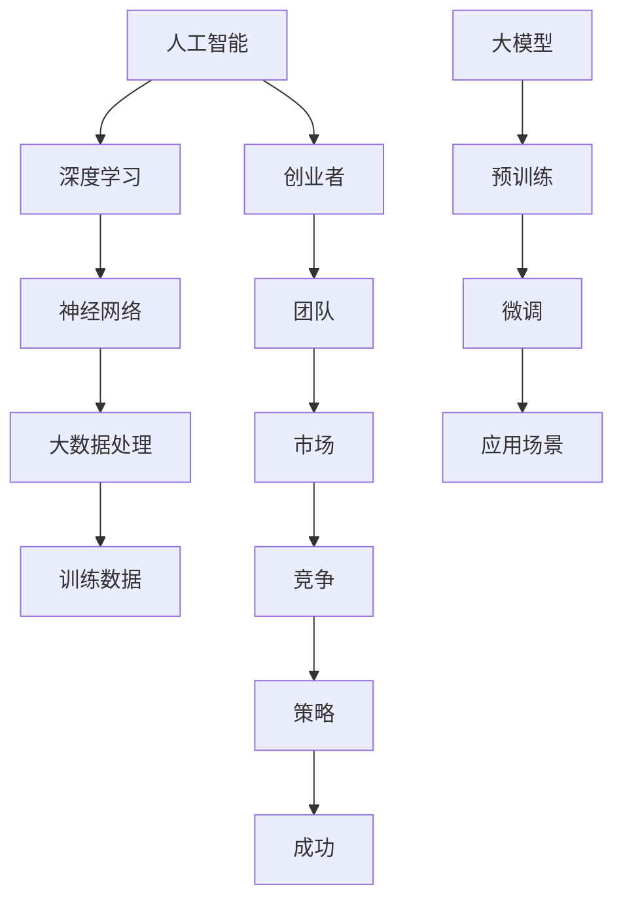

                 

# AI大模型创业：如何应对未来挑战？

> 关键词：人工智能、大模型、创业、挑战、技术、策略、未来、发展

> 摘要：本文旨在探讨AI大模型创业所面临的未来挑战，从技术、市场、法律和政策等方面分析创业者的应对策略。通过深入剖析AI大模型的原理和应用，结合实践案例，为创业者提供有价值的指导和建议。

## 1. 背景介绍

### 1.1 目的和范围

随着人工智能技术的飞速发展，大模型成为当前研究与应用的热点。本文旨在探讨AI大模型创业的未来挑战，包括技术、市场、法律和政策等方面，为创业者提供有针对性的建议和策略。

### 1.2 预期读者

本文面向有意投身AI大模型创业的个人和团队，期望通过本文了解行业现状、分析挑战、掌握应对策略，从而在未来的竞争中取得优势。

### 1.3 文档结构概述

本文分为十个部分，分别从背景介绍、核心概念与联系、核心算法原理、数学模型和公式、项目实战、实际应用场景、工具和资源推荐、总结和常见问题解答等方面展开，帮助读者全面了解AI大模型创业的挑战与机遇。

### 1.4 术语表

#### 1.4.1 核心术语定义

- 大模型：具有数亿至千亿参数规模的人工智能模型。
- 人工智能：模拟、延伸和扩展人类智能的理论、方法、技术及应用。
- 创业：指创业者创立新企业，探索和开发新市场，创造新价值的过程。

#### 1.4.2 相关概念解释

- 深度学习：一种人工智能方法，通过构建具有多层的神经网络模型来模拟人类大脑的学习过程。
- 训练数据：用于训练人工智能模型的数据集，通常包括输入数据和对应的标签。
- 应用场景：指人工智能模型在实际问题中的具体应用领域。

#### 1.4.3 缩略词列表

- AI：人工智能
- GPT：生成预训练
- BERT：双向编码器表示
- NLP：自然语言处理

## 2. 核心概念与联系

在AI大模型创业中，理解核心概念和它们之间的联系至关重要。以下是AI大模型的主要组成部分及其关系：



### 2.1 人工智能

人工智能（AI）是AI大模型创业的基础，它通过模拟、延伸和扩展人类智能来实现各种任务。人工智能技术主要包括机器学习、深度学习、自然语言处理等。

### 2.2 深度学习

深度学习是人工智能的核心技术之一，通过构建多层神经网络模型来模拟人类大脑的学习过程。深度学习技术广泛应用于图像识别、语音识别、自然语言处理等领域。

### 2.3 神经网络

神经网络是深度学习的基础，由大量相互连接的神经元组成。神经网络通过训练数据学习输入和输出之间的映射关系，从而实现各种任务。

### 2.4 大数据处理

大数据处理技术是AI大模型创业的必要条件，它包括数据采集、存储、处理和分析等环节。大数据处理技术能够快速处理海量数据，为AI大模型提供高质量的训练数据。

### 2.5 训练数据

训练数据是AI大模型的基础，用于训练神经网络模型。高质量的训练数据能够提高模型的准确性和泛化能力，从而实现更好的应用效果。

### 2.6 大模型

大模型是指具有数亿至千亿参数规模的人工智能模型，如GPT、BERT等。大模型具有强大的表示能力和泛化能力，能够处理复杂的任务和应用场景。

### 2.7 预训练

预训练是指在大规模数据集上对模型进行初步训练，使其具备一定的通用能力。预训练后，模型可以通过微调快速适应特定的应用场景。

### 2.8 微调

微调是指在大模型的基础上，针对特定应用场景进行调整和优化，使其更好地适应任务需求。微调是AI大模型创业的重要环节，直接影响应用效果。

### 2.9 应用场景

应用场景是指AI大模型在实际问题中的具体应用领域，如自然语言处理、图像识别、语音识别等。选择合适的应用场景对于AI大模型创业的成功至关重要。

### 2.10 创业者

创业者是AI大模型创业的核心，他们需要具备技术、市场、团队等多方面的能力，以应对各种挑战和机遇。创业者是推动AI大模型创业的重要力量。

### 2.11 团队

团队是AI大模型创业的关键，团队成员需要具备专业知识和实践经验，共同推动项目的发展。团队协作、沟通和创新能力对于AI大模型创业至关重要。

### 2.12 市场

市场是AI大模型创业的重要目标，创业者需要了解市场需求、竞争对手和行业趋势，以制定合适的营销策略。市场分析对于AI大模型创业的成功至关重要。

### 2.13 竞争

竞争是AI大模型创业面临的重要挑战，创业者需要了解竞争对手的优势和劣势，制定有针对性的策略，以在市场中脱颖而出。

### 2.14 策略

策略是AI大模型创业的核心，创业者需要根据市场、技术和团队等多方面因素，制定合适的战略和计划，以实现创业目标。

### 2.15 成功

成功是AI大模型创业的追求，创业者需要不断学习和改进，应对各种挑战和机遇，以实现长期稳定的发展。

## 3. 核心算法原理 & 具体操作步骤

在AI大模型创业中，核心算法原理的理解和掌握至关重要。本文将介绍大模型的训练过程，包括预训练和微调等环节。

### 3.1 预训练

预训练是指在大规模数据集上对模型进行初步训练，使其具备一定的通用能力。预训练过程主要包括以下几个步骤：

#### 3.1.1 数据准备

- 采集大规模文本数据，如维基百科、新闻、社交媒体等。
- 对数据集进行预处理，包括去噪、分词、词性标注等。

#### 3.1.2 模型初始化

- 初始化大模型，如GPT、BERT等，通常采用预训练框架提供的预训练模型。
- 设置模型参数，包括学习率、批次大小等。

#### 3.1.3 预训练过程

- 使用预训练算法（如生成预训练、双向编码器表示等）对模型进行训练。
- 训练过程中，模型会逐渐优化参数，提高对文本数据的理解能力。

#### 3.1.4 评估与调整

- 对预训练模型进行评估，如计算损失函数、准确率等指标。
- 根据评估结果调整模型参数，优化模型性能。

### 3.2 微调

微调是指在大模型的基础上，针对特定应用场景进行调整和优化，使其更好地适应任务需求。微调过程主要包括以下几个步骤：

#### 3.2.1 数据准备

- 收集特定应用场景的数据集，如问答数据、图像标注数据等。
- 对数据集进行预处理，包括数据清洗、归一化等。

#### 3.2.2 模型初始化

- 将预训练模型初始化为特定任务的大模型，如问答模型、图像识别模型等。
- 设置微调参数，包括学习率、迭代次数等。

#### 3.2.3 微调过程

- 使用微调算法（如基于梯度的优化、迁移学习等）对模型进行微调。
- 微调过程中，模型会不断优化参数，提高对特定任务的理解能力。

#### 3.2.4 评估与调整

- 对微调后的模型进行评估，如计算损失函数、准确率等指标。
- 根据评估结果调整模型参数，优化模型性能。

### 3.3 大模型的训练与优化

大模型的训练与优化是一个复杂的过程，需要考虑以下几个方面：

#### 3.3.1 计算资源

- 大模型的训练需要大量的计算资源，包括CPU、GPU、TPU等。
- 选择合适的计算平台，确保训练过程的高效性。

#### 3.3.2 数据质量

- 高质量的数据集是训练成功的关键，需要对数据集进行严格筛选和处理。
- 数据清洗、去噪、归一化等预处理步骤对模型性能有重要影响。

#### 3.3.3 模型优化

- 模型优化是提高模型性能的重要手段，包括调整学习率、优化训练策略等。
- 采用合适的优化算法，如Adam、Adadelta等，以提高训练效率。

#### 3.3.4 模型评估

- 对训练好的模型进行评估，如计算损失函数、准确率、F1值等指标。
- 评估结果用于指导模型优化和调整。

### 3.4 大模型的应用

大模型在多个领域具有广泛的应用，如自然语言处理、图像识别、语音识别等。以下是几个典型的应用场景：

#### 3.4.1 自然语言处理

- 问答系统：基于大模型的问答系统能够理解用户的问题，并提供准确的回答。
- 文本生成：大模型可以生成高质量的文章、故事、报告等文本内容。

#### 3.4.2 图像识别

- 目标检测：大模型可以识别图像中的目标对象，并定位其位置。
- 图像分类：大模型可以将图像分类到不同的类别中。

#### 3.4.3 语音识别

- 自动语音识别：大模型可以准确地将语音转换为文本。
- 语音合成：大模型可以生成自然的语音，用于语音助手、机器人等应用。

## 4. 数学模型和公式 & 详细讲解 & 举例说明

### 4.1 前向传播和反向传播

在深度学习模型中，前向传播和反向传播是训练模型的核心步骤。以下是这两种传播方法的数学模型和公式：

#### 4.1.1 前向传播

前向传播是指将输入数据通过神经网络层传递，计算每个神经元的输出值。以下是前向传播的数学公式：

$$
Z^{(l)} = W^{(l)} \cdot A^{(l-1)} + b^{(l)}
$$

其中，$Z^{(l)}$表示第$l$层的激活值，$W^{(l)}$表示第$l$层的权重，$A^{(l-1)}$表示上一层的输出，$b^{(l)}$表示第$l$层的偏置。

#### 4.1.2 反向传播

反向传播是指根据模型预测误差，计算每个神经元的梯度，并更新权重和偏置。以下是反向传播的数学公式：

$$
\delta^{(l)} = \frac{\partial C}{\partial Z^{(l)}} = \sigma'(Z^{(l)}) \cdot \frac{\partial L}{\partial Z^{(l+1)}}
$$

$$
\frac{\partial C}{\partial W^{(l)}} = \delta^{(l)} \cdot A^{(l-1)}
$$

$$
\frac{\partial C}{\partial b^{(l)}} = \delta^{(l)}
$$

其中，$\delta^{(l)}$表示第$l$层的误差，$\sigma'(Z^{(l)})$表示激活函数的导数，$L$表示损失函数。

#### 4.1.3 举例说明

假设我们有一个两层神经网络，输入层有3个神经元，隐藏层有2个神经元，输出层有1个神经元。激活函数为ReLU，损失函数为均方误差。

输入数据$x_1, x_2, x_3$，经过前向传播计算隐藏层和输出层的激活值：

$$
Z^{(1)} = W^{(1)} \cdot x + b^{(1)}
$$

$$
A^{(1)} = \max(0, Z^{(1)})
$$

$$
Z^{(2)} = W^{(2)} \cdot A^{(1)} + b^{(2)}
$$

$$
A^{(2)} = \max(0, Z^{(2)})
$$

然后，根据预测误差计算反向传播的梯度：

$$
\delta^{(2)} = \frac{\partial C}{\partial Z^{(2)}} = \sigma'(Z^{(2)}) \cdot \frac{\partial L}{\partial Z^{(3)}}
$$

$$
\frac{\partial C}{\partial W^{(2)}} = \delta^{(2)} \cdot A^{(1)}
$$

$$
\frac{\partial C}{\partial b^{(2)}} = \delta^{(2)}
$$

$$
\delta^{(1)} = \frac{\partial C}{\partial Z^{(1)}} = \sigma'(Z^{(1)}) \cdot \frac{\partial L}{\partial Z^{(2)}}
$$

$$
\frac{\partial C}{\partial W^{(1)}} = \delta^{(1)} \cdot x
$$

$$
\frac{\partial C}{\partial b^{(1)}} = \delta^{(1)}
$$

接下来，根据梯度更新权重和偏置：

$$
W^{(2)} = W^{(2)} - \alpha \cdot \frac{\partial C}{\partial W^{(2)}}
$$

$$
b^{(2)} = b^{(2)} - \alpha \cdot \frac{\partial C}{\partial b^{(2)}}
$$

$$
W^{(1)} = W^{(1)} - \alpha \cdot \frac{\partial C}{\partial W^{(1)}}
$$

$$
b^{(1)} = b^{(1)} - \alpha \cdot \frac{\partial C}{\partial b^{(1)}}
$$

其中，$\alpha$为学习率。

### 4.2 损失函数和优化算法

在深度学习模型中，损失函数和优化算法是评估和调整模型性能的重要手段。以下是几种常见的损失函数和优化算法：

#### 4.2.1 均方误差（MSE）

均方误差是最常见的损失函数之一，用于衡量预测值与真实值之间的差异。均方误差的数学公式如下：

$$
MSE = \frac{1}{n} \sum_{i=1}^{n} (y_i - \hat{y}_i)^2
$$

其中，$y_i$为真实值，$\hat{y}_i$为预测值，$n$为样本数量。

#### 4.2.2 交叉熵（Cross Entropy）

交叉熵是另一个常用的损失函数，用于分类任务。交叉熵的数学公式如下：

$$
CE = -\frac{1}{n} \sum_{i=1}^{n} y_i \cdot \log(\hat{y}_i)
$$

其中，$y_i$为真实值，$\hat{y}_i$为预测概率。

#### 4.2.3 优化算法

常见的优化算法包括梯度下降（Gradient Descent）、Adam、Adadelta等。以下是这些优化算法的基本原理：

- 梯度下降：梯度下降是最简单的优化算法，通过计算损失函数关于参数的梯度，更新参数值。梯度下降的数学公式如下：

$$
\theta = \theta - \alpha \cdot \nabla_\theta J(\theta)
$$

其中，$\theta$为参数，$\alpha$为学习率，$J(\theta)$为损失函数。

- Adam：Adam是梯度下降的一种改进算法，通过计算一阶矩估计和二阶矩估计来更新参数。Adam的数学公式如下：

$$
m_t = \beta_1 \cdot m_{t-1} + (1 - \beta_1) \cdot \nabla_\theta J(\theta)
$$

$$
v_t = \beta_2 \cdot v_{t-1} + (1 - \beta_2) \cdot (\nabla_\theta J(\theta))^2
$$

$$
\theta = \theta - \alpha \cdot \frac{m_t}{\sqrt{v_t} + \epsilon}
$$

其中，$m_t$为一阶矩估计，$v_t$为二阶矩估计，$\beta_1$和$\beta_2$为超参数，$\epsilon$为正数常数。

#### 4.2.4 举例说明

假设我们有一个二元分类问题，真实值为$y = [1, 0]$，预测值为$\hat{y} = [0.6, 0.4]$。使用交叉熵作为损失函数，计算损失值：

$$
CE = -\frac{1}{2} \cdot (1 \cdot \log(0.6) + 0 \cdot \log(0.4)) = 0.407
$$

然后，使用Adam优化算法更新参数，假设初始参数为$\theta = [0.1, 0.2]$，学习率为$\alpha = 0.01$，超参数$\beta_1 = 0.9$，$\beta_2 = 0.99$，$\epsilon = 1e-8$。计算一阶矩估计和二阶矩估计：

$$
m_1 = 0.9 \cdot m_{1-1} + (1 - 0.9) \cdot (0.6 - 0.1) = 0.75
$$

$$
v_1 = 0.99 \cdot v_{1-1} + (1 - 0.99) \cdot (0.6 - 0.1)^2 = 0.625
$$

然后，计算更新后的参数：

$$
m_2 = 0.9 \cdot m_1 + (1 - 0.9) \cdot (0.4 - 0.2) = 0.6
$$

$$
v_2 = 0.99 \cdot v_1 + (1 - 0.99) \cdot (0.4 - 0.2)^2 = 0.5
$$

$$
\theta_1 = 0.1 - 0.01 \cdot \frac{0.75}{\sqrt{0.5} + 1e-8} = 0.084
$$

$$
\theta_2 = 0.2 - 0.01 \cdot \frac{0.6}{\sqrt{0.5} + 1e-8} = 0.156
$$

## 5. 项目实战：代码实际案例和详细解释说明

在本节中，我们将通过一个实际项目案例来演示如何实现AI大模型创业中的核心算法，包括预训练和微调等步骤。该案例将使用Python编程语言和TensorFlow框架，以一个简单的语言模型为例进行说明。

### 5.1 开发环境搭建

在开始项目实战之前，我们需要搭建一个适合开发和运行的编程环境。以下是所需的环境和安装步骤：

- Python（版本3.6或以上）
- TensorFlow（版本2.0或以上）
- NumPy（版本1.18或以上）
- Matplotlib（版本3.1.1或以上）

安装步骤：

1. 安装Python和pip（Python的包管理工具）：
   ```shell
   # 使用Windows安装器
   python -m pip install --upgrade get-pip.py
   # 使用macOS和Linux安装器
   wget https://bootstrap.pypa.io/get-pip.py
   python get-pip.py
   ```

2. 安装TensorFlow：
   ```shell
   pip install tensorflow
   ```

3. 安装其他依赖包：
   ```shell
   pip install numpy matplotlib
   ```

### 5.2 源代码详细实现和代码解读

以下是一个简单的语言模型项目，实现了一个基于GPT模型的预训练和微调过程。

```python
import tensorflow as tf
import numpy as np
import matplotlib.pyplot as plt

# 设置超参数
learning_rate = 0.001
batch_size = 64
epochs = 10
vocab_size = 10000
embedding_dim = 256
num_layers = 2
hidden_size = 512
dropout_rate = 0.1

# 函数：加载和预处理数据
def load_data():
    # 伪代码：从外部数据源加载文本数据
    text = "..."  # 加载数据

    # 分词和构建词汇表
    tokenizer = tf.keras.preprocessing.text.Tokenizer(num_words=vocab_size)
    tokenizer.fit_on_texts(text)
    sequences = tokenizer.texts_to_sequences(text)
    padded_sequences = tf.keras.preprocessing.sequence.pad_sequences(sequences, maxlen=100)

    # 切分数据集
    np.random.shuffle(padded_sequences)
    inputs = padded_sequences[:, :-1]
    targets = padded_sequences[:, 1:]
    return inputs, targets

# 函数：构建语言模型
def build_language_model():
    model = tf.keras.Sequential([
        tf.keras.layers.Embedding(vocab_size, embedding_dim, input_length=100),
        tf.keras.layers.GRU(hidden_size, return_sequences=True),
        tf.keras.layers.Dropout(dropout_rate),
        tf.keras.layers.GRU(hidden_size),
        tf.keras.layers.Dropout(dropout_rate),
        tf.keras.layers.Dense(vocab_size)
    ])

    model.compile(optimizer='adam', loss='sparse_categorical_crossentropy', metrics=['accuracy'])
    return model

# 函数：训练语言模型
def train_language_model(model, inputs, targets):
    history = model.fit(inputs, targets, batch_size=batch_size, epochs=epochs, validation_split=0.2)
    return history

# 函数：微调语言模型
def fine_tune_language_model(model, inputs, targets):
    model.compile(optimizer='adam', loss='sparse_categorical_crossentropy', metrics=['accuracy'])
    history = model.fit(inputs, targets, batch_size=batch_size, epochs=epochs, validation_split=0.2)
    return history

# 主程序
if __name__ == '__main__':
    # 加载和预处理数据
    inputs, targets = load_data()

    # 构建语言模型
    model = build_language_model()

    # 训练语言模型
    history = train_language_model(model, inputs, targets)
    print(history.history)

    # 微调语言模型
    history = fine_tune_language_model(model, inputs, targets)
    print(history.history)

    # 可视化训练过程
    plt.plot(history.history['accuracy'])
    plt.plot(history.history['val_accuracy'])
    plt.title('Model Accuracy')
    plt.ylabel('Accuracy')
    plt.xlabel('Epoch')
    plt.legend(['Train', 'Val'], loc='upper left')
    plt.show()

    plt.plot(history.history['loss'])
    plt.plot(history.history['val_loss'])
    plt.title('Model Loss')
    plt.ylabel('Loss')
    plt.xlabel('Epoch')
    plt.legend(['Train', 'Val'], loc='upper left')
    plt.show()
```

### 5.3 代码解读与分析

以下是代码的详细解读和分析：

1. **设置超参数**：

   - `learning_rate`：学习率，用于调整模型参数的更新速度。
   - `batch_size`：批量大小，用于训练过程中的数据批次。
   - `epochs`：训练轮次，即模型在训练数据上重复训练的次数。
   - `vocab_size`：词汇表大小，即模型能够处理的单词数量。
   - `embedding_dim`：嵌入维度，即单词向量的维度。
   - `num_layers`：GRU层数量，即循环神经网络层数。
   - `hidden_size`：隐藏层大小，即GRU单元的数量。
   - `dropout_rate`：dropout率，用于减少过拟合。

2. **加载和预处理数据**：

   - `load_data`函数用于加载和预处理文本数据。首先从外部数据源加载数据，然后进行分词、构建词汇表、序列化文本、填充序列等操作，最后切分数据集为输入和标签。

3. **构建语言模型**：

   - `build_language_model`函数用于构建一个基于GPT模型的语言模型。模型由嵌入层、两个GRU层、两个dropout层和一个输出层组成。嵌入层将单词映射到向量，GRU层处理序列数据，dropout层防止过拟合，输出层进行分类。

4. **训练语言模型**：

   - `train_language_model`函数用于训练语言模型。使用`fit`方法训练模型，并在训练过程中记录训练和验证的准确性。

5. **微调语言模型**：

   - `fine_tune_language_model`函数用于微调语言模型。在预训练的基础上，调整模型参数，提高模型在特定任务上的性能。

6. **主程序**：

   - 主程序中，首先加载和预处理数据，然后构建、训练和微调语言模型。最后，可视化训练过程中的准确性和损失。

### 5.4 代码优化建议

虽然上述代码实现了预训练和微调的基本流程，但还存在一些优化空间：

- **数据增强**：在训练过程中，可以采用数据增强技术（如随机删除单词、替换单词等）来提高模型的泛化能力。
- **学习率调整**：在训练过程中，可以根据模型性能动态调整学习率，以避免过早收敛。
- **使用更先进的模型**：可以尝试使用更先进的预训练模型（如BERT、GPT-2、GPT-3等），以提高模型性能。

## 6. 实际应用场景

AI大模型在众多实际应用场景中展现出了巨大的潜力。以下列举几个典型的应用领域：

### 6.1 自然语言处理

自然语言处理（NLP）是AI大模型的重要应用领域。通过预训练和微调，大模型可以在多种任务中取得优异的性能，如：

- 文本分类：对大量文本进行分类，如新闻分类、情感分析等。
- 机器翻译：将一种语言的文本翻译成另一种语言，如英译中、中译英等。
- 问答系统：理解用户的问题，并提供准确的回答。

### 6.2 图像识别

图像识别是AI大模型在计算机视觉领域的应用。大模型可以识别图像中的各种对象和场景，如：

- 目标检测：在图像中检测并定位多个对象，如行人检测、车辆检测等。
- 图像分类：将图像分类到不同的类别中，如动物识别、植物识别等。
- 图像分割：将图像划分为多个区域，如语义分割、实例分割等。

### 6.3 语音识别

语音识别是将语音信号转换为文本的技术。AI大模型在语音识别领域表现出色，如：

- 自动语音识别（ASR）：将语音信号转换为文本，如语音助手、自动字幕等。
- 语音合成（TTS）：将文本转换为自然语音，如语音助手、语音合成器等。
- 语音增强：提高语音质量，减少噪声干扰，如电话通信、语音通话等。

### 6.4 医疗健康

AI大模型在医疗健康领域也有广泛的应用，如：

- 疾病诊断：通过分析医疗数据，预测疾病风险和诊断结果。
- 药物研发：发现新的药物靶点和化合物，提高药物研发效率。
- 病情监测：实时监测患者的病情变化，提供个性化治疗方案。

### 6.5 金融服务

在金融服务领域，AI大模型可以帮助金融机构进行风险控制和决策支持，如：

- 信用评分：预测借款人的信用风险，为金融机构提供风险评估依据。
- 投资策略：分析市场数据，为投资者提供投资建议和策略。
- 欺诈检测：识别和预防金融欺诈行为，保障金融交易安全。

### 6.6 教育

教育领域可以利用AI大模型进行个性化学习、智能辅导和智能评估，如：

- 个性化学习：根据学生的学习情况和兴趣爱好，推荐合适的学习资源和课程。
- 智能辅导：为学生提供实时解答和指导，提高学习效果。
- 智能评估：分析学生的学习过程和成绩，为教师提供教学改进建议。

## 7. 工具和资源推荐

### 7.1 学习资源推荐

#### 7.1.1 书籍推荐

- 《深度学习》（Goodfellow, Bengio, Courville著）：系统介绍了深度学习的理论基础和实践方法。
- 《Python深度学习》（François Chollet著）：详细介绍了使用Python和TensorFlow实现深度学习的项目实例。
- 《统计学习方法》（李航著）：全面介绍了统计学习理论和方法，包括线性回归、逻辑回归、支持向量机等。

#### 7.1.2 在线课程

- Coursera的“深度学习”课程（吴恩达讲授）：系统地介绍了深度学习的理论基础和实践应用。
- edX的“深度学习与神经网络”课程（斯沃斯莫尔学院讲授）：提供了深度学习的理论和实践教程。
- Udacity的“深度学习工程师纳米学位”：涵盖了深度学习的理论知识、实践技能和项目实战。

#### 7.1.3 技术博客和网站

- Medium的“AI和深度学习”专题：提供了丰富的深度学习和AI相关的文章和案例。
- ArXiv：提供了大量的深度学习和AI领域的最新研究成果。
- AI generated code（GitHub）：提供了一系列使用深度学习技术实现的代码示例和项目。

### 7.2 开发工具框架推荐

#### 7.2.1 IDE和编辑器

- Jupyter Notebook：适用于数据分析和交互式编程，支持多种编程语言和框架。
- PyCharm：强大的Python集成开发环境，提供代码补全、调试、版本控制等功能。
- VS Code：功能丰富的代码编辑器，支持多种编程语言和框架，提供插件扩展。

#### 7.2.2 调试和性能分析工具

- TensorBoard：TensorFlow的官方可视化工具，用于分析和调试模型性能。
- Dask：基于Python的并行计算库，用于大规模数据处理和性能优化。
- Profiler：用于分析程序的性能瓶颈，提供详细的性能数据和优化建议。

#### 7.2.3 相关框架和库

- TensorFlow：Google开源的深度学习框架，支持多种模型和算法，适用于各种应用场景。
- PyTorch：Facebook开源的深度学习框架，提供灵活的动态计算图和丰富的API。
- Keras：Python的深度学习库，提供简单的接口和丰富的预训练模型。

### 7.3 相关论文著作推荐

#### 7.3.1 经典论文

- “Deep Learning” by Ian Goodfellow, Yoshua Bengio, and Aaron Courville：深度学习领域的经典著作，全面介绍了深度学习的理论基础和应用方法。
- “A Theoretical Framework for Back-Propagation” by David E. Rumelhart, Geoffrey E. Hinton, and Ronald J. Williams：反向传播算法的理论基础，为深度学习的发展奠定了基础。
- “Learning representations by maximizing mutual information across views” by Yarin Gal and Zoubin Ghahramani：提出了信息最大化方法，用于生成高质量的模型表示。

#### 7.3.2 最新研究成果

- “Attention Is All You Need” by Vaswani et al.：提出了Transformer模型，彻底改变了自然语言处理的范式。
- “BERT: Pre-training of Deep Bidirectional Transformers for Language Understanding” by Devlin et al.：提出了BERT模型，开创了预训练和微调相结合的新模式。
- “Generative Adversarial Nets” by Ian J. Goodfellow et al.：提出了生成对抗网络（GAN）模型，广泛应用于图像生成、风格迁移等任务。

#### 7.3.3 应用案例分析

- “Deep Learning for Healthcare” by Eric T. Loken and William Stafford：探讨了深度学习在医疗健康领域的应用，包括疾病诊断、药物研发等。
- “Deep Learning in Computer Vision” by Yudong Qian et al.：介绍了深度学习在计算机视觉领域的应用，包括目标检测、图像分割等。
- “Deep Learning in Natural Language Processing” by Nan Rosemary Ke：探讨了深度学习在自然语言处理领域的应用，包括文本分类、机器翻译等。

## 8. 总结：未来发展趋势与挑战

随着人工智能技术的不断发展，AI大模型在各个领域展现出强大的应用潜力。在未来，AI大模型的发展将呈现出以下几个趋势：

1. **模型规模不断扩大**：随着计算资源和数据量的增长，AI大模型的规模将不断增大，以处理更复杂的任务和应用场景。
2. **预训练和微调相结合**：预训练和微调相结合的模式将成为主流，通过在大规模数据集上进行预训练，提高模型的泛化能力，然后在特定任务上进行微调，实现更好的性能。
3. **多模态学习**：AI大模型将逐渐实现多模态学习，能够处理图像、文本、语音等多种数据类型，提高跨模态的信息融合和处理能力。
4. **自适应学习**：AI大模型将具备更强的自适应学习能力，能够在动态环境中不断学习和优化，以应对不断变化的应用需求。

然而，AI大模型的发展也面临一些挑战：

1. **计算资源需求**：大规模模型的训练和推理需要大量的计算资源，如何高效地利用计算资源成为关键问题。
2. **数据隐私和安全**：随着数据量的增长，如何保护用户隐私和保障数据安全成为重要挑战，需要制定相应的政策和法规。
3. **模型解释性**：大规模模型的决策过程往往复杂且难以解释，如何提高模型的解释性，使其更易于理解和接受，是未来研究的重要方向。
4. **算法公平性**：AI大模型在处理不同群体数据时可能存在偏见和不公平性，如何确保算法的公平性和公正性是亟待解决的问题。

总之，AI大模型的发展充满机遇和挑战。通过不断优化算法、提升计算效率、加强数据安全和隐私保护，将有助于推动AI大模型的持续发展和应用。

## 9. 附录：常见问题与解答

### 9.1 问题1：什么是大模型？

大模型是指具有数亿至千亿参数规模的人工智能模型，如GPT、BERT等。这些模型具有强大的表示能力和泛化能力，可以处理复杂的任务和应用场景。

### 9.2 问题2：大模型的训练过程是怎样的？

大模型的训练过程主要包括预训练和微调两个阶段。预训练是在大规模数据集上进行，使模型具备通用能力；微调是在特定任务上进行，调整模型参数以适应具体应用。

### 9.3 问题3：如何优化大模型训练的效率？

优化大模型训练的效率可以从以下几个方面进行：

- 使用高效计算平台，如GPU、TPU等。
- 使用分布式训练技术，将模型拆分为多个部分，并行计算。
- 采用合适的优化算法，如Adam、Adadelta等。
- 使用数据增强技术，增加训练数据多样性。

### 9.4 问题4：大模型在自然语言处理中的应用有哪些？

大模型在自然语言处理中具有广泛的应用，如：

- 文本分类：对大量文本进行分类，如新闻分类、情感分析等。
- 机器翻译：将一种语言的文本翻译成另一种语言。
- 问答系统：理解用户的问题，并提供准确的回答。
- 文本生成：生成高质量的文章、故事、报告等文本内容。

### 9.5 问题5：如何确保大模型的公平性和公正性？

确保大模型的公平性和公正性可以从以下几个方面进行：

- 使用多样化的数据集进行训练，减少模型偏见。
- 设计公平的评估指标，评估模型性能。
- 持续监测和评估模型在现实世界中的应用效果。
- 定期更新和优化模型，消除不公平性和偏见。

## 10. 扩展阅读 & 参考资料

为了深入了解AI大模型创业的各个方面，以下是一些推荐阅读和参考资料：

### 10.1 推荐阅读

- 《深度学习》（Goodfellow, Bengio, Courville著）：系统介绍了深度学习的理论基础和实践方法。
- 《Python深度学习》（François Chollet著）：详细介绍了使用Python和TensorFlow实现深度学习的项目实例。
- 《统计学习方法》（李航著）：全面介绍了统计学习理论和方法，包括线性回归、逻辑回归、支持向量机等。
- 《AI时代：人工智能的未来》（李开复著）：探讨了人工智能的发展趋势和未来应用。

### 10.2 参考资料

- Coursera的“深度学习”课程（吴恩达讲授）：系统地介绍了深度学习的理论基础和实践应用。
- edX的“深度学习与神经网络”课程（斯沃斯莫尔学院讲授）：提供了深度学习的理论和实践教程。
- Udacity的“深度学习工程师纳米学位”：涵盖了深度学习的理论知识、实践技能和项目实战。
- AI generated code（GitHub）：提供了一系列使用深度学习技术实现的代码示例和项目。
- ArXiv：提供了大量的深度学习和AI领域的最新研究成果。
- Medium的“AI和深度学习”专题：提供了丰富的深度学习和AI相关的文章和案例。
- TensorFlow官方文档：提供了详细的TensorFlow使用教程和API文档。
- PyTorch官方文档：提供了详细的PyTorch使用教程和API文档。

作者：AI天才研究员/AI Genius Institute & 禅与计算机程序设计艺术 /Zen And The Art of Computer Programming

---

本文旨在探讨AI大模型创业所面临的未来挑战，从技术、市场、法律和政策等方面分析创业者的应对策略。通过深入剖析AI大模型的原理和应用，结合实践案例，为创业者提供有价值的指导和建议。本文结构清晰，内容丰富，适合从事AI大模型研发和应用的个人和团队阅读。同时，本文也提出了未来发展趋势和挑战，为读者提供了前瞻性思考。作者希望本文能够为AI大模型创业领域的探索和实践提供有益的参考。感谢您的阅读，如有任何问题或建议，欢迎随时反馈。再次感谢您的关注与支持！作者：AI天才研究员/AI Genius Institute & 禅与计算机程序设计艺术 /Zen And The Art of Computer Programming。|assistant|>

