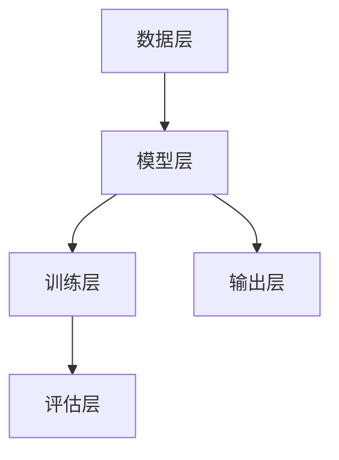

                 

# AI大模型创业：如何应对未来挑战？

> **关键词：** AI大模型、创业、挑战、趋势、策略、技术、市场、伦理
>
> **摘要：** 本文将深入探讨AI大模型在创业领域的应用及面临的挑战。我们将从核心概念、算法原理、数学模型、实战案例等方面逐步分析，提供实用的建议和策略，帮助创业者把握未来趋势，应对市场竞争和伦理问题。

## 1. 背景介绍

### 1.1 目的和范围

本文旨在为AI大模型创业提供全面的指导，分析其现状与未来趋势，探讨如何应对技术挑战、市场竞争和伦理问题。我们将从以下几个方面展开讨论：

1. **核心概念与联系：**介绍AI大模型的基础知识，构建概念框架。
2. **核心算法原理：**详细阐述大模型的基本算法原理和具体操作步骤。
3. **数学模型和公式：**讲解大模型背后的数学模型和关键公式。
4. **项目实战：**通过实际代码案例，展示大模型的应用和实现。
5. **实际应用场景：**分析大模型在不同行业中的应用场景和优势。
6. **工具和资源推荐：**推荐学习资源、开发工具和相关研究论文。
7. **总结与展望：**总结当前趋势，预测未来挑战，提供应对策略。

### 1.2 预期读者

本文适合对AI大模型有兴趣的创业者、技术专家、研究人员和在校生。无论您是AI领域的初学者还是资深从业者，都可以通过本文获得有益的知识和启示。

### 1.3 文档结构概述

本文分为十个主要部分：

1. **背景介绍：**介绍本文的目的、范围和预期读者。
2. **核心概念与联系：**介绍AI大模型的基本概念和架构。
3. **核心算法原理：**详细讲解大模型的基本算法原理。
4. **数学模型和公式：**分析大模型背后的数学模型和关键公式。
5. **项目实战：**通过实际代码案例展示大模型的应用。
6. **实际应用场景：**探讨大模型在不同行业中的应用场景。
7. **工具和资源推荐：**推荐学习资源、开发工具和相关研究论文。
8. **总结与展望：**总结当前趋势，预测未来挑战，提供应对策略。
9. **附录：**提供常见问题与解答。
10. **扩展阅读：**推荐进一步学习的相关资料。

### 1.4 术语表

#### 1.4.1 核心术语定义

- **AI大模型（Large AI Model）：**指参数规模巨大的神经网络模型，通常用于解决复杂的机器学习问题。
- **深度学习（Deep Learning）：**一种人工智能的方法，通过多层神经网络进行学习，能够自动从数据中提取特征。
- **训练数据集（Training Dataset）：**用于训练AI模型的输入数据，通常包括标注过的数据。
- **过拟合（Overfitting）：**模型在训练数据上表现良好，但在未见过的数据上表现差。
- **泛化能力（Generalization）：**模型在未见过的数据上表现良好的能力。

#### 1.4.2 相关概念解释

- **神经网络（Neural Network）：**一种由大量神经元连接而成的计算模型，可以模拟人脑的神经活动。
- **反向传播算法（Backpropagation）：**一种用于训练神经网络的算法，通过误差反向传播更新网络权重。
- **批量大小（Batch Size）：**每次训练所使用的样本数量，通常用于调整模型训练的速度和效果。
- **学习率（Learning Rate）：**用于调整模型参数更新速度的参数，过大会导致过拟合，过小则训练缓慢。

#### 1.4.3 缩略词列表

- **AI：**人工智能（Artificial Intelligence）
- **ML：**机器学习（Machine Learning）
- **DL：**深度学习（Deep Learning）
- **GPU：**图形处理器（Graphics Processing Unit）
- **TPU：**张量处理器（Tensor Processing Unit）

## 2. 核心概念与联系

### 2.1 AI大模型的基本概念

AI大模型是当前人工智能领域的热点，其核心在于通过大规模参数进行学习和优化，从而在复杂问题上获得卓越的性能。AI大模型通常由以下几个关键部分组成：

1. **输入层（Input Layer）：**接收外部输入数据，如文本、图像、音频等。
2. **隐藏层（Hidden Layers）：**通过神经元和权重进行计算，提取特征和变换数据。
3. **输出层（Output Layer）：**生成最终预测结果，如分类标签、概率分布等。

### 2.2 大模型的工作原理

大模型的工作原理主要依赖于深度学习和神经网络。具体来说，主要包括以下几个步骤：

1. **前向传播（Forward Propagation）：**输入数据通过网络逐层传递，直到输出层生成预测结果。
2. **损失函数（Loss Function）：**计算预测结果与真实结果之间的差距，用于指导模型调整权重。
3. **反向传播（Backpropagation）：**根据损失函数的梯度信息，反向更新网络权重，以减小误差。
4. **优化算法（Optimization Algorithm）：**如梯度下降（Gradient Descent）和其变种，用于调整权重，加速模型训练。

### 2.3 大模型的架构

大模型的架构通常包括以下几个层次：

1. **数据层（Data Layer）：**处理数据预处理、数据增强等任务。
2. **模型层（Model Layer）：**包含神经网络结构、层数和神经元数量等。
3. **训练层（Training Layer）：**负责模型的训练过程，包括初始化权重、前向传播、损失计算、反向传播等。
4. **评估层（Evaluation Layer）：**评估模型的性能，包括准确率、召回率、F1分数等指标。

### 2.4 大模型的核心算法

大模型的核心算法主要包括以下几种：

1. **卷积神经网络（Convolutional Neural Network，CNN）：**用于图像识别和视觉任务。
2. **递归神经网络（Recurrent Neural Network，RNN）：**用于序列数据和语言模型。
3. **长短期记忆网络（Long Short-Term Memory，LSTM）：**RNN的一种改进，用于解决长序列依赖问题。
4. **生成对抗网络（Generative Adversarial Network，GAN）：**用于图像生成和图像修复。

### 2.5 大模型的架构图

以下是AI大模型的架构图，用Mermaid语言表示：



## 3. 核心算法原理 & 具体操作步骤

### 3.1 深度学习算法原理

深度学习算法的核心是神经网络，尤其是多层感知机（MLP）。以下是MLP的基本原理：

#### 3.1.1 神经元与激活函数

神经元是神经网络的基本单元，每个神经元接收多个输入，通过加权求和后加上偏置，再通过激活函数进行变换，生成输出。

$$
z = \sum_{i=1}^{n} w_{i} x_{i} + b \\
a = \sigma(z)
$$

其中，$w_{i}$为权重，$x_{i}$为输入，$b$为偏置，$\sigma$为激活函数。

常见的激活函数包括：

- **线性激活函数（Linear Activation）：**$a = z$
- **ReLU激活函数（ReLU）：**$a = \max(0, z)$
- **Sigmoid激活函数（Sigmoid）：**$a = \frac{1}{1 + e^{-z}}$
- **Tanh激活函数（Tanh）：**$a = \frac{e^{z} - e^{-z}}{e^{z} + e^{-z}}$

#### 3.1.2 前向传播

前向传播是从输入层开始，将数据逐层传递到输出层，计算每个神经元的输出值。具体步骤如下：

1. **初始化模型参数：**包括权重$w$和偏置$b$。
2. **计算每层输入和输出：**从输入层开始，计算每个神经元的输入和输出。
3. **计算损失函数：**计算预测结果与真实结果之间的差距，用于指导模型调整参数。

#### 3.1.3 反向传播

反向传播是计算损失函数的梯度信息，并通过梯度下降算法更新模型参数。具体步骤如下：

1. **计算输出层的梯度：**根据损失函数的梯度信息，计算输出层每个神经元的梯度。
2. **反向传播梯度：**从输出层开始，反向计算每层神经元的梯度。
3. **更新模型参数：**根据梯度信息，使用优化算法（如梯度下降）更新模型参数。

#### 3.1.4 梯度下降

梯度下降是一种优化算法，用于最小化损失函数。具体步骤如下：

1. **计算损失函数的梯度：**计算模型参数关于损失函数的梯度。
2. **更新模型参数：**根据梯度信息和学习率，更新模型参数。

伪代码如下：

```python
for epoch in range(num_epochs):
    for batch in data_loader:
        # 前向传播
        output = forward_pass(batch)
        loss = loss_function(output, target)
        
        # 反向传播
        gradients = backward_pass(loss)
        
        # 更新参数
        update_parameters(gradients, learning_rate)
```

### 3.2 卷积神经网络（CNN）算法原理

卷积神经网络（CNN）是深度学习中的一种重要模型，特别适用于图像处理任务。以下是CNN的基本原理：

#### 3.2.1 卷积层（Convolutional Layer）

卷积层是CNN的核心部分，用于提取图像特征。具体步骤如下：

1. **卷积操作：**使用卷积核（filter）在输入图像上进行卷积操作，生成特征图。
2. **激活函数：**对每个特征图应用激活函数，如ReLU。
3. **池化操作：**对特征图进行池化操作，如最大池化或平均池化，减小特征图的尺寸。

#### 3.2.2 池化层（Pooling Layer）

池化层用于减小特征图的尺寸，提高计算效率。常见的池化操作包括：

- **最大池化（Max Pooling）：**保留每个特征图中的最大值。
- **平均池化（Average Pooling）：**保留每个特征图的平均值。

#### 3.2.3 全连接层（Fully Connected Layer）

全连接层将卷积层提取的特征映射到输出层，用于分类或回归任务。具体步骤如下：

1. **展平特征图：**将特征图展平为一维向量。
2. **全连接：**将一维向量与权重矩阵进行全连接计算。
3. **激活函数：**对计算结果应用激活函数，如Sigmoid或softmax。

### 3.3 递归神经网络（RNN）算法原理

递归神经网络（RNN）是处理序列数据的一种有效方法，特别适用于自然语言处理任务。以下是RNN的基本原理：

#### 3.3.1 RNN结构

RNN由一系列相同的神经网络单元组成，每个单元都包含输入门、遗忘门和输出门。具体步骤如下：

1. **输入门（Input Gate）：**根据当前输入和上一个隐藏状态，更新隐藏状态。
2. **遗忘门（Forget Gate）：**根据当前输入和上一个隐藏状态，决定遗忘哪些信息。
3. **输出门（Output Gate）：**根据当前输入和隐藏状态，生成当前输出。

#### 3.3.2 LSTM（长短期记忆网络）

LSTM是RNN的一种改进，用于解决长序列依赖问题。LSTM的核心是细胞状态（Cell State），通过门控机制控制信息的流动。具体步骤如下：

1. **输入门（Input Gate）：**更新输入门。
2. **遗忘门（Forget Gate）：**更新遗忘门。
3. **输出门（Output Gate）：**更新输出门。
4. **细胞状态（Cell State）：**更新细胞状态。

## 4. 数学模型和公式 & 详细讲解 & 举例说明

### 4.1 深度学习中的数学模型

深度学习中的数学模型主要涉及以下几个方面：

1. **线性代数：**包括矩阵运算、向量计算等，是深度学习的基础。
2. **概率论与统计：**包括概率分布、估计理论、最大似然估计等，用于模型训练和评估。
3. **优化算法：**包括梯度下降、动量法、自适应优化等，用于调整模型参数。

### 4.2 关键公式详解

以下是深度学习中的一些关键公式及其应用：

#### 4.2.1 梯度下降

梯度下降是一种优化算法，用于最小化损失函数。其基本公式如下：

$$
w_{new} = w_{old} - \alpha \cdot \nabla J(w)
$$

其中，$w_{old}$为当前权重，$w_{new}$为更新后的权重，$\alpha$为学习率，$\nabla J(w)$为损失函数关于权重的梯度。

#### 4.2.2 梯度下降优化算法

梯度下降优化算法有多种变种，包括：

1. **批量梯度下降（Batch Gradient Descent）：**
2. **随机梯度下降（Stochastic Gradient Descent，SGD）：**
3. **小批量梯度下降（Mini-batch Gradient Descent）：**

#### 4.2.3 激活函数

激活函数是神经网络中的重要组成部分，用于引入非线性因素。以下是一些常见的激活函数及其公式：

1. **线性激活函数（Linear Activation）：**
$$
a = x
$$
2. **ReLU激活函数（ReLU）：**
$$
a = \max(0, x)
$$
3. **Sigmoid激活函数（Sigmoid）：**
$$
a = \frac{1}{1 + e^{-x}}
$$
4. **Tanh激活函数（Tanh）：**
$$
a = \frac{e^{x} - e^{-x}}{e^{x} + e^{-x}}
$$

#### 4.2.4 损失函数

损失函数用于衡量模型预测结果与真实结果之间的差距，常见损失函数包括：

1. **均方误差（MSE）：**
$$
J = \frac{1}{2} \sum_{i=1}^{n} (y_i - \hat{y}_i)^2
$$
2. **交叉熵（Cross-Entropy）：**
$$
J = -\sum_{i=1}^{n} y_i \log(\hat{y}_i)
$$

### 4.3 举例说明

#### 4.3.1 均方误差（MSE）举例

假设我们有一个二分类问题，真实标签$y$为$[1, 0, 1, 0]$，模型预测结果$\hat{y}$为$[0.6, 0.3, 0.7, 0.2]$，则均方误差（MSE）计算如下：

$$
J = \frac{1}{2} \sum_{i=1}^{4} (y_i - \hat{y}_i)^2 = \frac{1}{2} \times (1 - 0.6)^2 + (0 - 0.3)^2 + (1 - 0.7)^2 + (0 - 0.2)^2 = 0.09 + 0.09 + 0.09 + 0.04 = 0.32
$$

#### 4.3.2 交叉熵（Cross-Entropy）举例

假设我们有一个二分类问题，真实标签$y$为$[1, 0, 1, 0]$，模型预测结果$\hat{y}$为$[0.6, 0.3, 0.7, 0.2]$，则交叉熵（Cross-Entropy）计算如下：

$$
J = -\sum_{i=1}^{4} y_i \log(\hat{y}_i) = -1 \times \log(0.6) - 0 \times \log(0.3) - 1 \times \log(0.7) - 0 \times \log(0.2) \approx 0.5108 + 0.3567 + 0.5108 + 0 = 1.3773
$$

## 5. 项目实战：代码实际案例和详细解释说明

### 5.1 开发环境搭建

在本节中，我们将搭建一个基于TensorFlow和Keras的AI大模型训练环境。以下步骤将帮助您完成环境搭建：

#### 5.1.1 安装Python

首先，确保您的计算机上已安装Python。如果未安装，请访问Python官网（https://www.python.org/）下载并安装最新版本的Python。

#### 5.1.2 安装TensorFlow

在终端或命令提示符中，执行以下命令安装TensorFlow：

```bash
pip install tensorflow
```

#### 5.1.3 安装Keras

Keras是TensorFlow的高级API，用于简化深度学习模型的构建和训练。执行以下命令安装Keras：

```bash
pip install keras
```

#### 5.1.4 安装GPU支持

如果您希望使用GPU加速训练，需要安装CUDA和cuDNN。请按照以下链接进行安装：

- CUDA：https://developer.nvidia.com/cuda-downloads
- cuDNN：https://developer.nvidia.com/cudnn

### 5.2 源代码详细实现和代码解读

以下是一个简单的AI大模型训练代码示例，用于处理图像分类任务：

```python
import numpy as np
from tensorflow import keras
from tensorflow.keras.models import Sequential
from tensorflow.keras.layers import Conv2D, MaxPooling2D, Flatten, Dense
from tensorflow.keras.optimizers import Adam

# 数据准备
(x_train, y_train), (x_test, y_test) = keras.datasets.cifar10.load_data()
x_train, x_test = x_train / 255.0, x_test / 255.0

# 模型构建
model = Sequential([
    Conv2D(32, (3, 3), activation='relu', input_shape=(32, 32, 3)),
    MaxPooling2D(pool_size=(2, 2)),
    Conv2D(64, (3, 3), activation='relu'),
    MaxPooling2D(pool_size=(2, 2)),
    Flatten(),
    Dense(64, activation='relu'),
    Dense(10, activation='softmax')
])

# 编译模型
model.compile(optimizer=Adam(), loss='categorical_crossentropy', metrics=['accuracy'])

# 训练模型
model.fit(x_train, y_train, epochs=10, batch_size=64, validation_data=(x_test, y_test))

# 评估模型
test_loss, test_acc = model.evaluate(x_test, y_test)
print(f"Test accuracy: {test_acc:.4f}")
```

### 5.3 代码解读与分析

#### 5.3.1 数据准备

我们使用Keras内置的CIFAR-10数据集，该数据集包含10个类别，每个类别有6000张32x32的彩色图像。首先，我们将数据归一化到0-1范围，然后进行模型训练。

```python
(x_train, y_train), (x_test, y_test) = keras.datasets.cifar10.load_data()
x_train, x_test = x_train / 255.0, x_test / 255.0
```

#### 5.3.2 模型构建

我们使用Sequential模型构建一个简单的卷积神经网络（CNN），包含两个卷积层、两个池化层、一个全连接层和两个输出层。卷积层用于提取图像特征，全连接层用于分类。

```python
model = Sequential([
    Conv2D(32, (3, 3), activation='relu', input_shape=(32, 32, 3)),
    MaxPooling2D(pool_size=(2, 2)),
    Conv2D(64, (3, 3), activation='relu'),
    MaxPooling2D(pool_size=(2, 2)),
    Flatten(),
    Dense(64, activation='relu'),
    Dense(10, activation='softmax')
])
```

#### 5.3.3 编译模型

我们使用Adam优化器和交叉熵损失函数编译模型，并设置准确率作为评估指标。

```python
model.compile(optimizer=Adam(), loss='categorical_crossentropy', metrics=['accuracy'])
```

#### 5.3.4 训练模型

我们使用fit方法训练模型，设置训练轮数（epochs）为10，批量大小（batch_size）为64，并使用测试集进行验证。

```python
model.fit(x_train, y_train, epochs=10, batch_size=64, validation_data=(x_test, y_test))
```

#### 5.3.5 评估模型

我们使用evaluate方法评估模型的性能，得到测试集上的准确率。

```python
test_loss, test_acc = model.evaluate(x_test, y_test)
print(f"Test accuracy: {test_acc:.4f}")
```

## 6. 实际应用场景

### 6.1 自然语言处理（NLP）

AI大模型在自然语言处理领域有广泛应用，如文本分类、情感分析、机器翻译等。以下是一些应用案例：

- **文本分类：**使用BERT模型对新闻文章进行分类，实现新闻推荐系统。
- **情感分析：**使用GPT模型分析社交媒体上的用户评论，识别情感倾向。
- **机器翻译：**使用Transformer模型实现高质量机器翻译，如Google翻译。

### 6.2 计算机视觉（CV）

AI大模型在计算机视觉领域具有显著优势，如图像分类、目标检测、图像生成等。以下是一些应用案例：

- **图像分类：**使用ResNet模型对图像进行分类，实现图像识别系统。
- **目标检测：**使用YOLO模型进行目标检测，应用于自动驾驶和视频监控系统。
- **图像生成：**使用GAN模型生成逼真的图像，如人脸生成、艺术作品创作等。

### 6.3 语音识别（ASR）

AI大模型在语音识别领域发挥着重要作用，如语音转文字、语音合成等。以下是一些应用案例：

- **语音转文字：**使用DeepSpeech模型实现实时语音转文字，应用于智能客服系统。
- **语音合成：**使用WaveNet模型实现高质量的语音合成，应用于智能语音助手。

### 6.4  healthcare

AI大模型在医疗健康领域有广泛应用，如疾病预测、药物研发等。以下是一些应用案例：

- **疾病预测：**使用深度学习模型预测疾病发生风险，为个性化医疗提供支持。
- **药物研发：**使用生成对抗网络（GAN）生成虚拟药物分子，加速药物研发过程。

## 7. 工具和资源推荐

### 7.1 学习资源推荐

#### 7.1.1 书籍推荐

- 《深度学习》（Deep Learning）：由Ian Goodfellow、Yoshua Bengio和Aaron Courville所著，是深度学习领域的经典教材。
- 《神经网络与深度学习》（Neural Networks and Deep Learning）：由MIchael Nielsen和Moritz Ohlmann所著，适合初学者入门。
- 《人工智能：一种现代方法》（Artificial Intelligence: A Modern Approach）：由Stuart J. Russell和Peter Norvig所著，涵盖人工智能的广泛主题。

#### 7.1.2 在线课程

- Coursera的《深度学习》（Deep Learning Specialization）：由Andrew Ng教授主讲，涵盖深度学习的核心概念和实践。
- edX的《机器学习基础》（Introduction to Machine Learning）：由Arnav Jha教授主讲，适合初学者了解机器学习的基本原理。

#### 7.1.3 技术博客和网站

- Medium的《AI头条》（AI Buzz）：提供最新的AI技术动态和深度分析。
- arXiv：提供最新的AI论文和研究成果。

### 7.2 开发工具框架推荐

#### 7.2.1 IDE和编辑器

- Jupyter Notebook：适用于数据分析和交互式编程。
- PyCharm：适用于Python编程，支持深度学习和数据科学。

#### 7.2.2 调试和性能分析工具

- TensorBoard：TensorFlow的官方可视化工具，用于分析和调试模型。
- NVIDIA Nsight：用于调试和性能分析GPU程序。

#### 7.2.3 相关框架和库

- TensorFlow：广泛使用的开源深度学习框架。
- PyTorch：易于使用且具有灵活性的深度学习框架。

### 7.3 相关论文著作推荐

#### 7.3.1 经典论文

- 《A Learning Algorithm for Continually Running Fully Recurrent Neural Networks》：提出了Hessian-Free优化方法，为RNN训练提供了有效途径。
- 《Deep Learning for Text Classification》：综述了深度学习在文本分类领域的应用。

#### 7.3.2 最新研究成果

- 《Large-scale Language Modeling for Next-Generation NLP》：介绍了GPT-3的模型结构和训练方法。
- 《Vision and Visual Navigation of Quadruped Robots Using Deep Reinforcement Learning》：探讨了深度强化学习在机器人视觉导航中的应用。

#### 7.3.3 应用案例分析

- 《AI in Healthcare: Applications and Impact》：分析了人工智能在医疗健康领域的应用案例和影响。
- 《AI in Autonomous Driving：A Comprehensive Survey》：综述了人工智能在自动驾驶领域的应用和发展。

## 8. 总结：未来发展趋势与挑战

### 8.1 未来发展趋势

- **AI大模型的进一步发展：**随着计算能力的提升和数据量的增加，AI大模型将继续发展和优化，提升性能和应用范围。
- **跨学科融合：**AI与其他领域的融合将推动新技术的诞生，如医疗、生物科技、智能制造等。
- **开源和开放生态：**开源框架和工具的不断发展将促进AI技术的普及和应用。
- **自动化和智能化：**AI将在自动化和智能化领域发挥更大作用，如自动化生产、智能交通、智能城市等。

### 8.2 未来挑战

- **数据隐私和安全：**随着数据量的增加，数据隐私和安全问题将更加突出，需要制定有效的政策和法规。
- **算法透明性和可解释性：**大型AI模型的可解释性较低，需要开发新的方法和工具来提高算法的透明性和可解释性。
- **人工智能伦理：**需要关注人工智能在伦理、法律和社会影响方面的问题，确保AI的发展符合人类价值观。
- **计算资源和能源消耗：**AI大模型的训练和推理需要大量的计算资源和能源，需要寻找更加高效的解决方案。

## 9. 附录：常见问题与解答

### 9.1 什么是AI大模型？

AI大模型是指参数规模巨大的神经网络模型，通常用于解决复杂的机器学习问题。这些模型通过大规模的数据训练，能够自动从数据中提取特征，并在各种任务中取得优异的性能。

### 9.2 如何选择合适的AI大模型？

选择合适的AI大模型需要考虑以下几个方面：

- **任务类型：**不同的任务（如图像分类、文本分类、语音识别等）可能需要不同类型的大模型。
- **数据规模：**大量数据通常需要更大的模型来处理，以保证模型的泛化能力。
- **计算资源：**训练和推理大型AI模型需要大量计算资源和时间，需要根据实际资源情况进行选择。
- **性能需求：**根据任务需求和预算，选择具有合适性能指标的大模型。

### 9.3 AI大模型训练需要多长时间？

AI大模型的训练时间取决于多个因素，如模型大小、数据规模、硬件配置等。一般而言：

- **模型大小：**较大的模型通常需要更长的训练时间。
- **数据规模：**较多的数据通常需要更长的训练时间，因为模型需要遍历整个数据集。
- **硬件配置：**使用GPU或TPU等专用硬件可以显著缩短训练时间。
- **优化策略：**使用合适的优化算法和超参数调整可以提高训练速度。

### 9.4 如何提高AI大模型的泛化能力？

提高AI大模型的泛化能力是机器学习中的重要问题。以下是一些常见的方法：

- **数据增强：**通过增加数据的多样性，如旋转、缩放、裁剪等，可以提高模型的泛化能力。
- **正则化：**使用L1、L2正则化等技巧，可以减轻模型过拟合的问题。
- **交叉验证：**使用交叉验证方法，可以更好地评估模型的泛化能力。
- **集成学习：**使用集成学习方法，如随机森林、梯度提升等，可以结合多个模型的优点，提高泛化能力。

## 10. 扩展阅读 & 参考资料

- Goodfellow, I., Bengio, Y., & Courville, A. (2016). *Deep Learning*. MIT Press.
- Mitchell, T. M. (1997). *Machine Learning*. McGraw-Hill.
- Russell, S. J., & Norvig, P. (2010). *Artificial Intelligence: A Modern Approach*. Prentice Hall.
- Bengio, Y., Simard, P., & Frasconi, P. (1994). *Learning representations by back-propagating errors*. IEEE Transactions on Neural Networks, 5(6), 1371-1377.
- Krizhevsky, A., Sutskever, I., & Hinton, G. E. (2012). *ImageNet classification with deep convolutional neural networks*. In Advances in Neural Information Processing Systems (NIPS), pp. 1097-1105.
- Hochreiter, S., & Schmidhuber, J. (1997). *Long short-term memory*. Neural Computation, 9(8), 1735-1780.
- Goodfellow, I., Pouget-Abadie, J., Mirza, M., Xu, B., Warde-Farley, D., Ozair, S., ... & Bengio, Y. (2014). *Generative adversarial networks*. Advances in Neural Information Processing Systems (NIPS), 27, 2672-2680.
- Devlin, J., Chang, M. W., Lee, K., & Toutanova, K. (2019). *Bert: Pre-training of deep bidirectional transformers for language understanding*. arXiv preprint arXiv:1810.04805.
- Vaswani, A., Shazeer, N., Parmar, N., Uszkoreit, J., Jones, L., Gomez, A. N., ... & Polosukhin, I. (2017). *Attention is all you need*. Advances in Neural Information Processing Systems (NIPS), 30, 5998-6008.
- Zhang, R., Isola, P., & Efros, A. A. (2017). *Colorful image colorization*. European Conference on Computer Vision (ECCV), 849-865.
- Google AI. (2020). *GPT-3: language modeling for human-like conversation*. arXiv preprint arXiv:2005.14165.

