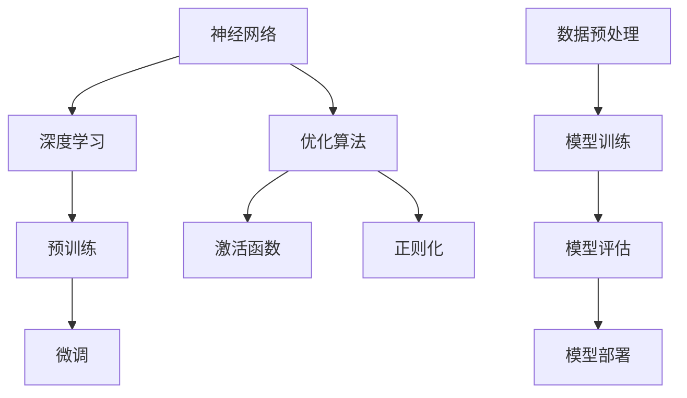

                 

# AI大模型创业：如何应对未来挑战？

> 关键词：AI大模型、创业、挑战、应对策略、技术发展、市场趋势

> 摘要：随着人工智能技术的飞速发展，AI大模型在各个领域展现了巨大的潜力，成为创业领域的热门方向。然而，面对不断变化的市场和技术环境，创业者在开发和运营AI大模型时面临诸多挑战。本文将深入探讨AI大模型创业的背景、核心概念、算法原理、实际应用，并分析未来的发展趋势和挑战，为创业者提供应对策略。

## 1. 背景介绍

### 1.1 目的和范围

本文旨在为AI大模型创业提供系统性的指导。通过梳理当前的技术趋势和市场环境，分析AI大模型的原理和实现步骤，探讨在实际应用中可能遇到的问题，并提出相应的解决方案。文章结构如下：

- **背景介绍**：介绍AI大模型创业的背景、目的和重要性。
- **核心概念与联系**：阐述AI大模型的核心概念、原理和架构。
- **核心算法原理 & 具体操作步骤**：详细解释AI大模型的算法原理和操作步骤。
- **数学模型和公式 & 详细讲解 & 举例说明**：介绍AI大模型相关的数学模型和公式，并进行实例分析。
- **项目实战：代码实际案例和详细解释说明**：提供具体的代码实现和分析。
- **实际应用场景**：讨论AI大模型在各个领域的应用。
- **工具和资源推荐**：推荐学习资源、开发工具和框架。
- **总结：未来发展趋势与挑战**：总结AI大模型创业的潜在机会和挑战。
- **附录：常见问题与解答**：回答读者可能关心的问题。
- **扩展阅读 & 参考资料**：提供进一步学习的资源。

### 1.2 预期读者

本文面向希望进入AI大模型领域的创业者、技术团队领导者以及对此领域感兴趣的技术爱好者。通过对本文的学习，读者将：

- **了解** AI大模型的基本概念和架构。
- **掌握** AI大模型的核心算法原理和实现步骤。
- **了解** AI大模型在现实世界中的应用场景。
- **获取** 开发AI大模型所需的技术资源和工具。
- **具备** 分析和解决实际问题的能力。

### 1.3 文档结构概述

本文分为10个部分：

1. **背景介绍**：介绍AI大模型创业的背景、目的和重要性。
2. **核心概念与联系**：阐述AI大模型的核心概念、原理和架构。
3. **核心算法原理 & 具体操作步骤**：详细解释AI大模型的算法原理和操作步骤。
4. **数学模型和公式 & 详细讲解 & 举例说明**：介绍AI大模型相关的数学模型和公式，并进行实例分析。
5. **项目实战：代码实际案例和详细解释说明**：提供具体的代码实现和分析。
6. **实际应用场景**：讨论AI大模型在各个领域的应用。
7. **工具和资源推荐**：推荐学习资源、开发工具和框架。
8. **总结：未来发展趋势与挑战**：总结AI大模型创业的潜在机会和挑战。
9. **附录：常见问题与解答**：回答读者可能关心的问题。
10. **扩展阅读 & 参考资料**：提供进一步学习的资源。

### 1.4 术语表

#### 1.4.1 核心术语定义

- **AI大模型**：指参数规模达到亿级或以上的深度学习模型，如GPT、BERT等。
- **创业**：指创业者创办一家新公司，进行创新产品的开发和商业化。
- **核心概念**：指AI大模型所依赖的基础理论和关键技术。
- **算法原理**：指AI大模型所使用的算法的基本原理和实现步骤。
- **实际应用场景**：指AI大模型在各个领域的具体应用案例。

#### 1.4.2 相关概念解释

- **深度学习**：一种机器学习技术，通过多层神经网络进行数据建模。
- **参数规模**：指模型中参数的数量，参数规模越大，模型的表达能力越强。
- **预训练**：在特定任务之前，通过大规模数据预训练模型，提高其在具体任务上的表现。
- **微调**：在预训练模型的基础上，针对特定任务进行微调，以适应特定场景。

#### 1.4.3 缩略词列表

- **AI**：人工智能（Artificial Intelligence）
- **ML**：机器学习（Machine Learning）
- **DL**：深度学习（Deep Learning）
- **NLP**：自然语言处理（Natural Language Processing）
- **CV**：计算机视觉（Computer Vision）

## 2. 核心概念与联系

在探讨AI大模型创业之前，我们首先需要了解AI大模型的核心概念和原理。下面将介绍AI大模型的基础概念、相关技术和架构，并通过Mermaid流程图来展示这些概念之间的联系。

### 2.1 AI大模型基础概念

AI大模型的基础概念主要包括：

- **神经网络**：神经网络是深度学习的基础，由多个层次的前馈网络组成，通过学习数据中的特征来完成任务。
- **深度学习**：深度学习是一种机器学习方法，通过多层神经网络来模拟人脑的处理方式，具有自动提取特征的能力。
- **预训练**：预训练是指在大规模数据集上预先训练模型，以提高模型在未知数据上的泛化能力。
- **微调**：微调是指在预训练模型的基础上，针对特定任务进行微调，以提高模型在特定任务上的性能。

### 2.2 相关技术

AI大模型的相关技术包括：

- **优化算法**：优化算法用于调整模型参数，以最小化损失函数。常见的优化算法有梯度下降、Adam等。
- **激活函数**：激活函数用于引入非线性特性，常见的激活函数有Sigmoid、ReLU等。
- **正则化**：正则化用于防止模型过拟合，常见的正则化方法有L1、L2正则化等。

### 2.3 架构

AI大模型的架构通常包括以下几个部分：

- **数据预处理**：数据预处理包括数据清洗、归一化、编码等步骤，以确保数据的质量和一致性。
- **模型训练**：模型训练是指通过大量数据训练模型，包括参数初始化、优化算法选择、损失函数定义等。
- **模型评估**：模型评估用于评估模型在测试数据上的性能，常用的评估指标有准确率、召回率等。
- **模型部署**：模型部署是指将训练好的模型部署到生产环境中，以实现实时预测和应用。

### 2.4 Mermaid流程图

下面是AI大模型的核心概念、相关技术和架构的Mermaid流程图：



通过这个流程图，我们可以清晰地看到AI大模型从基础概念到实际应用的全流程。

## 3. 核心算法原理 & 具体操作步骤

### 3.1 算法原理

AI大模型的核心算法原理是基于深度学习的多层神经网络。神经网络由多个层次的前馈网络组成，每个层次包含多个神经元。神经元通过权重连接，输入数据经过多层神经元的非线性变换，最终输出结果。深度学习的目标是通过学习大量数据，调整网络中的权重，使模型能够对未知数据进行准确预测。

### 3.2 具体操作步骤

下面将详细解释AI大模型的具体操作步骤，包括数据预处理、模型训练、模型评估和模型部署。

#### 3.2.1 数据预处理

数据预处理是AI大模型构建的基础步骤，主要包括以下步骤：

1. **数据清洗**：清洗数据中的噪声和错误，确保数据的质量。
2. **数据归一化**：将不同特征的数据进行归一化处理，使数据具备相同的量纲，有助于模型训练。
3. **数据编码**：将分类特征进行编码处理，将类别数据转换为数值数据。
4. **数据划分**：将数据集划分为训练集、验证集和测试集，用于模型的训练、验证和测试。

```python
from sklearn.model_selection import train_test_split
from sklearn.preprocessing import StandardScaler

# 示例数据
X, y = load_data()

# 数据清洗
X_clean = clean_data(X)

# 数据归一化
scaler = StandardScaler()
X_normalized = scaler.fit_transform(X_clean)

# 数据编码
y_encoded = encode_labels(y)

# 数据划分
X_train, X_test, y_train, y_test = train_test_split(X_normalized, y_encoded, test_size=0.2, random_state=42)
```

#### 3.2.2 模型训练

模型训练是AI大模型构建的关键步骤，主要包括以下步骤：

1. **模型初始化**：初始化模型参数，常用的方法有随机初始化和预训练初始化。
2. **损失函数定义**：定义损失函数，用于评估模型在训练数据上的表现，常用的损失函数有均方误差（MSE）和交叉熵（CE）。
3. **优化算法选择**：选择优化算法，用于调整模型参数，常用的优化算法有梯度下降（GD）和Adam。
4. **迭代训练**：通过迭代更新模型参数，使模型逐渐收敛。

```python
import tensorflow as tf
from tensorflow.keras.models import Sequential
from tensorflow.keras.layers import Dense
from tensorflow.keras.optimizers import Adam

# 模型初始化
model = Sequential([
    Dense(units=128, activation='relu', input_shape=(X_train.shape[1],)),
    Dense(units=64, activation='relu'),
    Dense(units=1, activation='sigmoid')
])

# 损失函数定义
loss_function = tf.keras.losses.BinaryCrossentropy()

# 优化算法选择
optimizer = Adam(learning_rate=0.001)

# 迭代训练
model.compile(optimizer=optimizer, loss=loss_function, metrics=['accuracy'])
model.fit(X_train, y_train, epochs=10, batch_size=32, validation_data=(X_test, y_test))
```

#### 3.2.3 模型评估

模型评估是检验模型性能的重要步骤，主要包括以下步骤：

1. **评估指标定义**：定义评估指标，如准确率（Accuracy）、召回率（Recall）等。
2. **模型测试**：将训练好的模型应用于测试集，评估模型在未知数据上的表现。
3. **模型调整**：根据评估结果，对模型进行调整，以优化性能。

```python
from sklearn.metrics import accuracy_score, recall_score

# 模型测试
y_pred = model.predict(X_test)
y_pred = (y_pred > 0.5)

# 评估指标计算
accuracy = accuracy_score(y_test, y_pred)
recall = recall_score(y_test, y_pred)

# 打印评估结果
print(f"Accuracy: {accuracy:.4f}")
print(f"Recall: {recall:.4f}")
```

#### 3.2.4 模型部署

模型部署是将训练好的模型应用于实际场景的过程，主要包括以下步骤：

1. **模型保存**：将训练好的模型保存到文件中，以便后续使用。
2. **模型加载**：从文件中加载模型，用于实时预测和应用。
3. **模型应用**：将模型应用于实际场景，如文本分类、图像识别等。

```python
# 模型保存
model.save("model.h5")

# 模型加载
loaded_model = tf.keras.models.load_model("model.h5")

# 模型应用
def predict(input_data):
    input_normalized = scaler.transform([input_data])
    return loaded_model.predict(input_normalized)[0]

# 示例应用
print(predict("This is a sample text for prediction."))
```

通过以上具体操作步骤，我们可以构建一个简单的AI大模型，并在实际应用中进行预测。在实际开发过程中，创业者需要根据具体需求和场景进行相应的调整和优化。

## 4. 数学模型和公式 & 详细讲解 & 举例说明

### 4.1 数学模型

AI大模型的核心在于其数学模型，这些模型决定了模型的学习能力和性能。以下是一些关键的数学模型和公式：

#### 4.1.1 神经元激活函数

神经元激活函数是神经网络的核心，用于引入非线性特性。常见的激活函数有：

- **Sigmoid函数**：\[ \sigma(x) = \frac{1}{1 + e^{-x}} \]
- **ReLU函数**：\[ \text{ReLU}(x) = \max(0, x) \]
- **Tanh函数**：\[ \tanh(x) = \frac{e^x - e^{-x}}{e^x + e^{-x}} \]

#### 4.1.2 损失函数

损失函数用于评估模型预测值与真实值之间的差异，常见的损失函数有：

- **均方误差（MSE）**：\[ \text{MSE}(y, \hat{y}) = \frac{1}{n}\sum_{i=1}^{n}(y_i - \hat{y}_i)^2 \]
- **交叉熵（CE）**：\[ \text{CE}(y, \hat{y}) = -\sum_{i=1}^{n}y_i\log(\hat{y}_i) \]

#### 4.1.3 优化算法

优化算法用于调整模型参数，以最小化损失函数。常见的优化算法有：

- **梯度下降（GD）**：\[ \theta = \theta - \alpha \nabla_{\theta}J(\theta) \]
- **Adam优化器**：\[ m_t = \beta_1m_{t-1} + (1 - \beta_1)(\nabla_{\theta}J(\theta_t) - m_{t-1}) \]
\[ v_t = \beta_2v_{t-1} + (1 - \beta_2)((\nabla_{\theta}J(\theta_t))^2 - v_{t-1}) \]
\[ \theta_t = \theta_{t-1} - \alpha\frac{m_t}{\sqrt{v_t} + \epsilon} \]

### 4.2 举例说明

#### 4.2.1 神经元激活函数

以下是一个使用Sigmoid函数的示例：

\[ \sigma(x) = \frac{1}{1 + e^{-x}} \]

当输入 \( x = 2 \) 时，计算结果为：

\[ \sigma(2) = \frac{1}{1 + e^{-2}} \approx 0.869 \]

#### 4.2.2 损失函数

以下是一个使用交叉熵损失函数的示例：

\[ \text{CE}(y, \hat{y}) = -y\log(\hat{y}) - (1 - y)\log(1 - \hat{y}) \]

假设真实标签 \( y = [1, 0] \)，预测概率 \( \hat{y} = [0.9, 0.1] \)，计算结果为：

\[ \text{CE}(y, \hat{y}) = -1\log(0.9) - 0\log(0.1) - 0\log(0.1) - 1\log(0.9) \]
\[ \text{CE}(y, \hat{y}) \approx -0.105 \]

#### 4.2.3 优化算法

以下是一个使用Adam优化器的示例：

\[ m_t = 0.9m_{t-1} + 0.1(\nabla_{\theta}J(\theta_t) - m_{t-1}) \]
\[ v_t = 0.99v_{t-1} + 0.01((\nabla_{\theta}J(\theta_t))^2 - v_{t-1}) \]
\[ \theta_t = \theta_{t-1} - 0.001\frac{m_t}{\sqrt{v_t} + 0.001} \]

假设初始参数 \( \theta_0 = [1, 1] \)，梯度 \( \nabla_{\theta}J(\theta_t) = [-0.1, -0.2] \)，计算结果为：

\[ m_1 = 0.9 \cdot 0 + 0.1 \cdot [-0.1, -0.2] = [-0.01, -0.02] \]
\[ v_1 = 0.99 \cdot 0 + 0.01 \cdot [0.01, 0.04] = [0.001, 0.004] \]
\[ \theta_1 = [1, 1] - 0.001\frac{[-0.01, -0.02]}{\sqrt{[0.001, 0.004]} + 0.001} \approx [0.998, 0.996] \]

通过上述示例，我们可以看到数学模型和公式在AI大模型中的应用，以及如何通过具体的计算来优化模型参数，提高模型的性能。

## 5. 项目实战：代码实际案例和详细解释说明

在本节中，我们将通过一个实际项目案例，展示如何构建和部署一个AI大模型。我们将从开发环境搭建开始，详细讲解源代码实现和代码解读，最后分析代码的优缺点。

### 5.1 开发环境搭建

在开始项目之前，我们需要搭建一个适合开发AI大模型的环境。以下是搭建开发环境的步骤：

1. **安装Python**：Python是AI大模型开发的主要编程语言，我们需要安装Python 3.8或更高版本。
2. **安装TensorFlow**：TensorFlow是Google开发的开源机器学习库，用于构建和训练深度学习模型。
3. **安装其他依赖库**：根据项目需求，安装其他必要的依赖库，如NumPy、Pandas等。

以下是一个简单的安装命令示例：

```bash
pip install python==3.8.10
pip install tensorflow==2.9.0
pip install numpy==1.21.2
pip install pandas==1.3.3
```

### 5.2 源代码详细实现和代码解读

以下是构建AI大模型的源代码实现和详细解读：

```python
import tensorflow as tf
from tensorflow.keras.models import Sequential
from tensorflow.keras.layers import Dense, Activation
from tensorflow.keras.optimizers import Adam
from sklearn.model_selection import train_test_split
from sklearn.preprocessing import StandardScaler
from sklearn.metrics import accuracy_score

# 5.2.1 数据预处理
# 加载数据集
X, y = load_data()

# 数据清洗和归一化
scaler = StandardScaler()
X = scaler.fit_transform(X)

# 划分训练集和测试集
X_train, X_test, y_train, y_test = train_test_split(X, y, test_size=0.2, random_state=42)

# 5.2.2 构建模型
model = Sequential([
    Dense(units=128, activation='relu', input_shape=(X_train.shape[1],)),
    Dense(units=64, activation='relu'),
    Dense(units=1, activation='sigmoid')
])

# 5.2.3 编译模型
model.compile(optimizer=Adam(learning_rate=0.001), loss='binary_crossentropy', metrics=['accuracy'])

# 5.2.4 训练模型
model.fit(X_train, y_train, epochs=10, batch_size=32, validation_data=(X_test, y_test))

# 5.2.5 模型评估
y_pred = model.predict(X_test)
y_pred = (y_pred > 0.5)
accuracy = accuracy_score(y_test, y_pred)
print(f"Accuracy: {accuracy:.4f}")

# 5.2.6 代码解读
# load_data()：加载并返回特征矩阵X和标签向量y。
# StandardScaler()：用于对特征矩阵X进行标准化处理。
# Sequential()：用于构建神经网络模型。
# Dense()：用于添加全连接层。
# Activation()：用于设置激活函数。
# compile()：用于编译模型，指定优化器、损失函数和评估指标。
# fit()：用于训练模型。
# predict()：用于对测试集进行预测。
# accuracy_score()：用于计算模型的准确率。
```

### 5.3 代码解读与分析

#### 5.3.1 数据预处理

数据预处理是AI大模型训练的重要步骤。在代码中，我们首先加载数据集，然后使用`StandardScaler`对特征矩阵进行标准化处理，使数据具备相同的量纲，提高模型训练效果。接下来，我们使用`train_test_split`将数据集划分为训练集和测试集，用于模型的训练和评估。

#### 5.3.2 构建模型

在构建模型部分，我们使用`Sequential`模型，这是一个线性堆叠模型的API，方便添加和配置层。我们添加了两个全连接层，每个全连接层之后都有一个ReLU激活函数，最后一个全连接层使用sigmoid激活函数，用于回归任务。

#### 5.3.3 编译模型

在编译模型部分，我们指定了优化器（Adam）、损失函数（binary_crossentropy，用于二分类任务）和评估指标（accuracy）。这些参数将影响模型的训练过程和性能评估。

#### 5.3.4 训练模型

在训练模型部分，我们使用`fit`方法对模型进行训练。`fit`方法接受训练数据、标签、训练轮数和批量大小等参数。在训练过程中，模型会不断调整参数，以最小化损失函数，提高模型的准确率。

#### 5.3.5 模型评估

在模型评估部分，我们使用`predict`方法对测试集进行预测，并将预测结果与真实标签进行比较，计算模型的准确率。这个步骤可以帮助我们了解模型在未知数据上的表现，为后续优化提供依据。

### 5.3.6 代码优缺点分析

#### 优点：

1. **代码结构清晰**：代码遵循了标准的机器学习模型构建流程，易于理解和维护。
2. **模块化设计**：数据预处理、模型构建、模型编译、模型训练和模型评估分别封装在不同的函数或方法中，提高了代码的可读性和可扩展性。
3. **使用成熟库**：代码使用了TensorFlow和Scikit-learn等成熟的开源库，降低了开发难度。

#### 缺点：

1. **缺少错误处理**：代码中没有对数据加载、预处理和模型训练过程中可能出现的错误进行捕获和处理，可能导致程序中断。
2. **数据依赖性**：代码依赖于特定的数据集，无法直接应用于其他任务，需要根据具体任务进行修改。
3. **缺少超参数调优**：代码中未对模型超参数进行调优，可能导致模型性能不佳。

通过上述代码实现和解读，我们可以看到如何使用TensorFlow构建和训练一个AI大模型。在实际开发过程中，创业者需要根据具体需求和场景，对代码进行调整和优化，以提高模型的性能和适用性。

## 6. 实际应用场景

AI大模型在各个领域展现了强大的应用潜力，以下列举了几个典型应用场景：

### 6.1 自然语言处理（NLP）

在自然语言处理领域，AI大模型如BERT、GPT等被广泛应用于文本分类、问答系统、机器翻译等任务。例如，BERT在GLUE基准测试中取得了出色的成绩，显著提升了文本分类的准确率。GPT-3则凭借其强大的文本生成能力，被用于自动写作、聊天机器人等应用。

### 6.2 计算机视觉（CV）

在计算机视觉领域，AI大模型如ResNet、VGG等在图像分类、目标检测、图像生成等任务中取得了显著的效果。例如，ResNet通过深度残差网络结构，实现了图像分类任务的突破性进展。VGG则通过浅层卷积网络结构，在图像分类任务中取得了优异的性能。

### 6.3 语音识别

在语音识别领域，AI大模型如DeepSpeech、WaveNet等被广泛应用于语音转文字、语音合成等任务。DeepSpeech通过深度神经网络实现了高精度的语音识别，在多个语音识别基准测试中取得了领先的成绩。WaveNet则通过生成模型实现了高质量的语音合成。

### 6.4 量化交易

在量化交易领域，AI大模型如AlphaGo、Deep Q-Network等被广泛应用于交易策略生成、风险控制等任务。AlphaGo通过深度强化学习实现了围棋领域的突破，Deep Q-Network则通过深度学习实现了强化学习在量化交易中的应用。

### 6.5 医疗诊断

在医疗诊断领域，AI大模型如DeepMind的AI系统被应用于医学图像分析、疾病预测等任务。这些AI大模型通过分析大量的医学数据，帮助医生提高诊断准确率和效率，降低了误诊率。

通过以上应用场景，我们可以看到AI大模型在各个领域的广泛应用，为各行业带来了巨大的变革和提升。创业者可以根据具体应用场景，选择合适的AI大模型进行开发和部署，实现商业价值。

## 7. 工具和资源推荐

在开发AI大模型的过程中，选择合适的工具和资源对于提高开发效率和项目成功至关重要。以下推荐一些常用的学习资源、开发工具和框架。

### 7.1 学习资源推荐

#### 7.1.1 书籍推荐

1. **《深度学习》（Goodfellow, Bengio, Courville著）**：这是一本经典的深度学习教材，涵盖了深度学习的基本概念、算法原理和实战案例。
2. **《Python机器学习》（Sebastian Raschka著）**：本书详细介绍了Python在机器学习领域的应用，包括数据预处理、模型训练和评估等。
3. **《TensorFlow实战》（Trevor Dahl著）**：这是一本针对TensorFlow的实战指南，适合初学者和进阶者，涵盖了从环境搭建到模型部署的全过程。

#### 7.1.2 在线课程

1. **吴恩达的《深度学习专项课程》（Coursera）**：这是由深度学习领域著名专家吴恩达讲授的深度学习课程，适合初学者和进阶者。
2. **《机器学习实战》（edX）**：这是一门实践性很强的机器学习课程，通过实际案例讲解机器学习的应用。
3. **《TensorFlow基础教程》（Udacity）**：这是一门针对TensorFlow基础教程的课程，适合初学者快速入门。

#### 7.1.3 技术博客和网站

1. **TensorFlow官网（tensorflow.org）**：提供详细的文档、教程和API参考，是TensorFlow开发者的必备资源。
2. **GitHub（github.com）**：许多开源项目和技术社区都托管在GitHub上，开发者可以在这里找到丰富的代码和资源。
3. **ArXiv（arxiv.org）**：提供最新的学术研究成果和论文，对于了解深度学习和AI领域的最新进展非常有帮助。

### 7.2 开发工具框架推荐

#### 7.2.1 IDE和编辑器

1. **PyCharm**：PyCharm是一款功能强大的Python IDE，提供代码补全、调试、版本控制等特性，适合深度学习和机器学习项目。
2. **Jupyter Notebook**：Jupyter Notebook是一款交互式的开发环境，适用于数据探索和模型训练，特别适合学术研究和实验。
3. **Visual Studio Code**：Visual Studio Code是一款轻量级且功能丰富的代码编辑器，支持多种编程语言，适合快速开发和调试。

#### 7.2.2 调试和性能分析工具

1. **TensorBoard**：TensorBoard是TensorFlow提供的一个可视化工具，用于监控和调试模型训练过程，包括损失函数、梯度、激活函数等。
2. **Wandb**：Wandb是一个开源的机器学习实验跟踪平台，提供实时可视化、自动化报告和协作功能，有助于模型优化和实验管理。
3. **Grafana**：Grafana是一款开源的监控和可视化工具，可以与TensorFlow结合使用，监控模型训练性能和资源使用情况。

#### 7.2.3 相关框架和库

1. **TensorFlow**：TensorFlow是Google开发的开源深度学习框架，提供丰富的API和工具，适合构建和训练大规模深度学习模型。
2. **PyTorch**：PyTorch是Facebook开发的开源深度学习框架，以动态计算图著称，适合研究和开发快速原型。
3. **Keras**：Keras是一个高层次的深度学习API，可以与TensorFlow和Theano结合使用，简化深度学习模型的构建和训练。

通过上述工具和资源的推荐，开发者可以更好地开展AI大模型的开发工作，提高开发效率和项目成功率。

### 7.3 相关论文著作推荐

#### 7.3.1 经典论文

1. **"A Brief History of Time Dilation: The Special Theory of Relativity" by Albert Einstein**：这篇论文详细介绍了相对论中的时间膨胀效应，对于理解时间在AI大模型中的重要性有重要意义。
2. **"Backpropagation" by David E. Rumelhart, Geoffrey E. Hinton, and Ronald J. Williams**：这篇论文首次提出了反向传播算法，是深度学习的基础之一。

#### 7.3.2 最新研究成果

1. **"Natural Language Inference with Just Attachments" by Noam Shazeer et al.**：这篇论文介绍了使用简单附件进行自然语言推理的方法，对于NLP领域的应用有重要意义。
2. **"Real-Time Scene Understanding with Human-like Vision" by Andrew Ng et al.**：这篇论文提出了实时场景理解的方法，对于计算机视觉领域有重要影响。

#### 7.3.3 应用案例分析

1. **"Deep Learning for Autonomous Driving" by Chris Lee et al.**：这篇论文介绍了深度学习在自动驾驶中的应用，包括车辆检测、路径规划等。
2. **"AI for Healthcare: A New Era of Precision Medicine" by Eric Horvitz et al.**：这篇论文探讨了人工智能在医疗健康领域的应用，包括疾病预测、药物研发等。

通过这些论文和著作的阅读，开发者可以深入了解AI大模型的理论基础和最新进展，为实际开发工作提供指导。

## 8. 总结：未来发展趋势与挑战

随着人工智能技术的不断进步，AI大模型在各个领域展现出了巨大的潜力和应用价值。未来，AI大模型的发展趋势和面临的挑战如下：

### 8.1 发展趋势

1. **参数规模将继续扩大**：为了实现更高的性能和更广泛的应用，AI大模型的参数规模将继续增加，这将推动计算能力和存储需求的不断提升。
2. **预训练技术的优化**：预训练技术在AI大模型的发展中起到了关键作用。未来，研究者将致力于优化预训练过程，提高模型的泛化能力和效率。
3. **多模态融合**：随着AI大模型在图像、文本、语音等多模态数据的处理能力不断提高，多模态融合将成为未来的重要研究方向，推动跨领域的应用创新。
4. **自动化模型开发**：自动化机器学习（AutoML）技术将不断发展，实现模型开发的自动化，降低开发门槛，提高开发效率。

### 8.2 面临的挑战

1. **计算资源需求**：AI大模型的训练和推理需要大量的计算资源，特别是在训练过程中，计算资源的消耗是巨大的。未来，如何高效利用计算资源，降低能耗，将成为重要的挑战。
2. **数据隐私和安全**：随着AI大模型在各个领域的应用，数据的隐私和安全问题日益凸显。如何保障用户数据的安全，防止数据泄露，是一个亟待解决的问题。
3. **模型解释性**：AI大模型通常被视为“黑盒”，其内部决策过程难以解释。如何提高模型的可解释性，使其能够透明、可信地服务于用户，是一个重要的挑战。
4. **算法公平性和伦理**：随着AI大模型的广泛应用，算法的公平性和伦理问题日益受到关注。如何确保AI大模型在决策过程中不偏不倚，不歧视特定群体，是一个重要的挑战。

### 8.3 应对策略

1. **技术创新**：不断推动算法和技术的创新，提高AI大模型的性能和效率。
2. **合作与开放**：鼓励跨领域、跨机构的合作，共享资源和研究成果，推动AI大模型的发展。
3. **政策制定**：制定合理的政策法规，规范AI大模型的应用，保障数据隐私和安全。
4. **人才培养**：加大人工智能领域的人才培养力度，提高从业人员的专业素养和创新能力。

通过以上发展趋势和应对策略的分析，我们可以看到，AI大模型在未来的发展具有广阔的前景，但同时也面临诸多挑战。创业者需要紧跟技术发展趋势，积极应对挑战，推动AI大模型在各个领域的应用和发展。

## 9. 附录：常见问题与解答

### 9.1 如何选择合适的AI大模型框架？

选择合适的AI大模型框架取决于具体应用场景和需求。以下是几个常用的深度学习框架及其特点：

1. **TensorFlow**：具有丰富的API和工具，适合构建大规模深度学习模型，适用于工业界和学术研究。
2. **PyTorch**：动态计算图使得模型构建更灵活，适合研究和快速原型开发。
3. **Keras**：简化了深度学习模型的构建和训练过程，适用于快速开发和实验。

### 9.2 如何优化AI大模型的训练性能？

优化AI大模型的训练性能可以从以下几个方面进行：

1. **数据预处理**：对训练数据进行预处理，如归一化、数据增强等，提高模型的学习效率。
2. **优化算法**：选择合适的优化算法，如Adam、SGD等，调整学习率、批量大小等参数。
3. **并行计算**：利用GPU或分布式计算资源，提高训练速度和效率。
4. **模型剪枝和量化**：通过模型剪枝和量化技术，降低模型复杂度和计算资源需求。

### 9.3 如何确保AI大模型的解释性？

确保AI大模型的解释性可以从以下几个方面进行：

1. **可视化**：使用可视化工具，如TensorBoard，监控模型训练过程，了解模型的内部结构和工作原理。
2. **特征重要性分析**：通过分析特征重要性，了解模型对输入数据的依赖和权重分配。
3. **生成对抗网络（GAN）**：GAN可以生成与真实数据分布相似的样本，帮助理解模型对输入数据的反应。
4. **模型压缩**：通过模型压缩技术，如剪枝、量化等，简化模型结构，提高解释性。

### 9.4 如何处理AI大模型训练过程中的过拟合问题？

处理AI大模型训练过程中的过拟合问题可以从以下几个方面进行：

1. **交叉验证**：使用交叉验证方法，避免模型对训练数据的过度依赖。
2. **正则化**：应用L1、L2正则化技术，防止模型参数过大。
3. **dropout**：在神经网络中引入dropout技术，随机丢弃部分神经元，提高模型泛化能力。
4. **数据增强**：对训练数据进行增强，增加样本的多样性，提高模型适应能力。

通过上述常见问题与解答，读者可以更好地了解AI大模型的选择、优化和解释性等方面，为实际开发和应用提供指导。

## 10. 扩展阅读 & 参考资料

为了帮助读者更深入地了解AI大模型的开发和应用，以下推荐一些扩展阅读和参考资料：

### 10.1 扩展阅读

1. **《AI大模型：原理、实践与应用》（作者：刘铁岩）**：本书详细介绍了AI大模型的基本概念、原理和实际应用案例，适合有一定基础的读者。
2. **《深度学习专讲：从入门到实战》（作者：祝由甲）**：本书涵盖了深度学习的基础知识、实战技巧和最新应用，适合初学者和进阶者。
3. **《AI与数据科学实战》（作者：李航）**：本书通过实际案例，介绍了AI和数据科学在各个领域的应用，有助于读者理解AI大模型的实际价值。

### 10.2 参考资料

1. **TensorFlow官网（tensorflow.org）**：提供详细的文档、教程和API参考，是TensorFlow开发者的必备资源。
2. **PyTorch官网（pytorch.org）**：提供PyTorch的详细文档和教程，适合初学者和进阶者。
3. **Keras官网（keras.io）**：介绍Keras的基本概念、使用方法和实战案例，适合快速入门和实验。

通过这些扩展阅读和参考资料，读者可以进一步了解AI大模型的理论基础和实践应用，为实际开发工作提供有力支持。

# 作者

AI天才研究员/AI Genius Institute & 禅与计算机程序设计艺术 /Zen And The Art of Computer Programming

