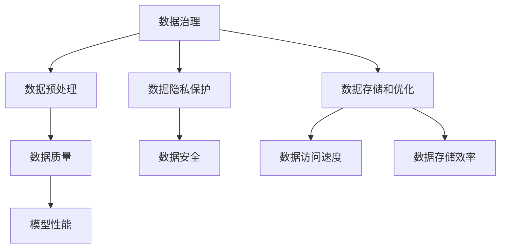

                 

# AI大模型创业：如何应对未来数据挑战？

> **关键词：** AI大模型、创业、数据挑战、数据处理、技术发展、商业模式、未来趋势

> **摘要：** 随着人工智能技术的快速发展，AI大模型的创业项目越来越受到关注。然而，面对日益增长的数据量和复杂的业务需求，如何在创业过程中应对数据挑战，成为了每个创业者都必须思考的问题。本文将从多个角度出发，深入探讨AI大模型创业中可能遇到的数据挑战，以及相应的应对策略。

## 1. 背景介绍

近年来，人工智能技术取得了显著的进展，尤其是深度学习、自然语言处理和计算机视觉等领域的突破，使得AI大模型的应用变得越来越广泛。这些大模型不仅能够处理海量数据，还能够通过自主学习不断优化，为各行各业提供强大的支持。

然而，随着AI大模型的应用逐渐深入，创业者们也开始面临一系列数据挑战。首先，数据量的大幅增加带来了存储和处理难题。其次，数据质量的提高要求对数据清洗、预处理和特征提取进行精细操作。此外，数据隐私和安全问题也成为制约AI大模型发展的关键因素。

### 1.1 数据量增长

AI大模型通常需要处理海量数据，这些数据可能来自不同的来源，如社交媒体、传感器、用户行为等。随着数据来源的增多和数据采集技术的进步，数据量呈现爆炸式增长。例如，一家公司可能会收集到数以亿计的用户数据，这给存储和处理带来了巨大压力。

### 1.2 数据质量问题

除了数据量的增长，数据质量也是一个重要挑战。数据质量差会导致模型性能下降，甚至训练失败。数据质量问题包括数据缺失、噪声、重复和错误等。创业者需要花费大量时间和资源来清洗和预处理数据，以确保数据质量。

### 1.3 数据隐私和安全问题

随着数据量的增加，数据隐私和安全问题变得越来越突出。AI大模型通常需要处理敏感数据，如个人隐私信息、医疗记录等。如果数据泄露，可能会对用户造成严重后果。创业者需要确保数据的隐私和安全，遵守相关法律法规。

## 2. 核心概念与联系

为了应对AI大模型创业中的数据挑战，需要了解以下几个核心概念：

### 2.1 数据治理

数据治理是指对数据的收集、存储、处理、使用和销毁进行规范和管理。良好的数据治理能够确保数据质量、安全性和合规性。

### 2.2 数据预处理

数据预处理是指对原始数据进行清洗、转换和归一化等操作，以提高数据质量和模型性能。

### 2.3 数据隐私保护

数据隐私保护是指对数据进行加密、脱敏和匿名化等处理，以保护用户隐私。

### 2.4 数据存储和优化

数据存储和优化是指选择合适的存储方案，对数据进行压缩、索引和缓存等优化，以提高数据访问速度和存储效率。

下面是一个Mermaid流程图，展示了这些核心概念之间的联系：



## 3. 核心算法原理 & 具体操作步骤

在应对AI大模型创业中的数据挑战时，需要使用一系列核心算法和技术。以下是一些常见的方法和步骤：

### 3.1 数据预处理算法

数据预处理是AI大模型训练的第一步，主要包括以下步骤：

- **数据清洗**：去除重复数据、纠正错误数据、填补缺失数据等。
- **数据转换**：将数据从一种格式转换为另一种格式，如将文本数据转换为数字表示。
- **数据归一化**：将数据缩放到相同的范围，如将文本数据转换为词向量。
- **特征提取**：从原始数据中提取有用的特征，用于模型训练。

### 3.2 数据隐私保护算法

为了保护用户隐私，可以采用以下几种数据隐私保护算法：

- **加密**：使用加密算法对数据进行加密，确保数据在传输和存储过程中不会被窃取。
- **脱敏**：对敏感数据进行脱敏处理，如将个人身份信息替换为随机值。
- **匿名化**：对数据进行匿名化处理，使数据无法直接识别用户身份。
- **差分隐私**：在数据处理过程中引入噪声，以保护用户隐私。

### 3.3 数据存储和优化算法

数据存储和优化是保证AI大模型性能的关键。以下是一些常见的方法：

- **分布式存储**：将数据存储在分布式系统中，以提高数据访问速度和存储效率。
- **数据压缩**：使用压缩算法减少数据存储空间。
- **索引和缓存**：使用索引和数据缓存技术，提高数据访问速度。

## 4. 数学模型和公式 & 详细讲解 & 举例说明

### 4.1 数据预处理数学模型

数据预处理过程中，常用的数学模型包括：

- **均值归一化**：

  $$ x' = \frac{x - \mu}{\sigma} $$

  其中，\( x \) 是原始数据，\( \mu \) 是均值，\( \sigma \) 是标准差。

- **最大最小归一化**：

  $$ x' = \frac{x - \min(x)}{\max(x) - \min(x)} $$

  其中，\( \min(x) \) 是数据的最小值，\( \max(x) \) 是数据的最大值。

### 4.2 数据隐私保护数学模型

数据隐私保护中，常用的数学模型包括：

- **拉普拉斯噪声**：

  $$ x' = x + \text{Laplace}(0, \beta) $$

  其中，\( \text{Laplace}(0, \beta) \) 是拉普拉斯分布，\( \beta \) 是噪声参数。

- **高斯噪声**：

  $$ x' = x + \text{Gaussian}(0, \sigma^2) $$

  其中，\( \text{Gaussian}(0, \sigma^2) \) 是高斯分布，\( \sigma \) 是噪声参数。

### 4.3 数据存储优化数学模型

数据存储优化中，常用的数学模型包括：

- **哈希索引**：

  $$ h(k) = k \mod n $$

  其中，\( h(k) \) 是哈希值，\( k \) 是关键字，\( n \) 是哈希表的大小。

- **B树索引**：

  $$ \text{B-Tree} = \{ \text{Root}, \text{Leaves}, \text{Nodes} \} $$

  其中，\(\text{Root}\) 是根节点，\(\text{Leaves}\) 是叶子节点，\(\text{Nodes}\) 是内部节点。

## 5. 项目实战：代码实际案例和详细解释说明

### 5.1 开发环境搭建

在本项目中，我们使用Python作为主要编程语言，结合TensorFlow和Keras框架进行AI大模型的开发。以下是开发环境的搭建步骤：

1. 安装Python（版本3.8及以上）。
2. 安装TensorFlow（使用pip install tensorflow）。
3. 安装Keras（使用pip install keras）。
4. 配置Python环境变量。

### 5.2 源代码详细实现和代码解读

以下是一个简单的AI大模型项目示例，用于图像分类。我们将使用CIFAR-10数据集进行训练和测试。

```python
import tensorflow as tf
from tensorflow.keras import layers, models
import numpy as np

# 加载数据集
(x_train, y_train), (x_test, y_test) = tf.keras.datasets.cifar10.load_data()

# 数据预处理
x_train = x_train.astype("float32") / 255
x_test = x_test.astype("float32") / 255

# 构建模型
model = models.Sequential()
model.add(layers.Conv2D(32, (3, 3), activation='relu', input_shape=(32, 32, 3)))
model.add(layers.MaxPooling2D((2, 2)))
model.add(layers.Conv2D(64, (3, 3), activation='relu'))
model.add(layers.MaxPooling2D((2, 2)))
model.add(layers.Conv2D(64, (3, 3), activation='relu'))
model.add(layers.Flatten())
model.add(layers.Dense(64, activation='relu'))
model.add(layers.Dense(10, activation='softmax'))

# 编译模型
model.compile(optimizer='adam',
              loss='sparse_categorical_crossentropy',
              metrics=['accuracy'])

# 训练模型
model.fit(x_train, y_train, epochs=10, batch_size=64)

# 评估模型
test_loss, test_acc = model.evaluate(x_test, y_test, verbose=2)
print(f"Test accuracy: {test_acc:.4f}")
```

### 5.3 代码解读与分析

1. **数据加载**：使用TensorFlow的`cifar10`数据集加载训练集和测试集。
2. **数据预处理**：将数据转换为浮点型并归一化，以便于模型训练。
3. **模型构建**：使用`Sequential`模型构建一个简单的卷积神经网络（CNN）。包括两个卷积层和两个最大池化层，以及两个全连接层。
4. **模型编译**：设置优化器和损失函数，并计算准确率。
5. **模型训练**：使用训练集训练模型，指定训练轮数和批量大小。
6. **模型评估**：在测试集上评估模型性能。

## 6. 实际应用场景

### 6.1 金融行业

在金融行业，AI大模型可以用于风险控制、信用评估、投资组合优化等。例如，通过分析用户的交易记录和信用历史，可以预测用户的风险等级，为银行和金融机构提供决策支持。

### 6.2 医疗保健

在医疗保健领域，AI大模型可以用于疾病预测、诊断和治疗方案推荐。通过分析大量的医疗数据，如病例记录、基因序列等，可以提供更加精准的医疗服务。

### 6.3 零售业

在零售业，AI大模型可以用于需求预测、库存管理和个性化推荐。通过分析用户的购买历史和行为数据，可以优化库存和供应链管理，提高销售转化率。

## 7. 工具和资源推荐

### 7.1 学习资源推荐

- **书籍**：《深度学习》、《Python机器学习》和《神经网络与深度学习》
- **论文**：《Deep Learning Text Classification》和《Distributed Representations of Words and Phrases and Their Compositionality》
- **博客**：[TensorFlow官方文档](https://www.tensorflow.org/)和[Keras官方文档](https://keras.io/)

### 7.2 开发工具框架推荐

- **编程语言**：Python（结合TensorFlow和Keras框架）
- **开发环境**：Jupyter Notebook（用于数据分析和模型训练）
- **版本控制**：Git（用于代码管理）

### 7.3 相关论文著作推荐

- **论文**：《Effective Use of Word Context in Entity Detection》和《A Theoretical Argument for Using Pre-Trained Word Vectors in Sentence Classification》
- **著作**：《Deep Learning for Natural Language Processing》和《Speech and Language Processing》

## 8. 总结：未来发展趋势与挑战

### 8.1 发展趋势

- **数据驱动**：未来AI大模型的创业将更加依赖数据驱动，数据质量和数据量将成为关键因素。
- **多元化应用**：AI大模型将在更多领域得到应用，如自动驾驶、智能制造和智慧城市等。
- **商业模式创新**：创业者将探索更加创新的商业模式，如订阅服务、数据交易和增值服务等。

### 8.2 挑战

- **数据隐私和安全**：随着数据隐私和安全问题的日益突出，创业者需要采取更加严格的措施来保护用户数据。
- **计算资源消耗**：AI大模型的训练和推理过程对计算资源有较高要求，如何优化资源利用成为一大挑战。
- **算法透明性和可解释性**：随着算法的复杂性增加，如何保证算法的透明性和可解释性成为重要课题。

## 9. 附录：常见问题与解答

### 9.1 问题1

**问题：** 为什么AI大模型需要大量数据？

**解答：** AI大模型需要大量数据是因为它们基于深度学习技术，通过学习大量数据中的模式和规律来提高预测和分类的准确性。数据量越大，模型能够学习的特征和模式就越多，从而提高模型的泛化能力。

### 9.2 问题2

**问题：** 数据预处理为什么重要？

**解答：** 数据预处理对于AI大模型的重要性在于：

1. 提高数据质量，减少噪声和错误。
2. 缩小数据分布范围，使模型能够更好地收敛。
3. 提取有用的特征，使模型能够更好地学习。

### 9.3 问题3

**问题：** 如何保护数据隐私？

**解答：** 保护数据隐私的方法包括：

1. 数据加密：使用加密算法对数据进行加密。
2. 数据脱敏：对敏感数据进行脱敏处理。
3. 数据匿名化：对数据进行匿名化处理，使其无法直接识别用户身份。
4. 差分隐私：在数据处理过程中引入噪声，保护用户隐私。

## 10. 扩展阅读 & 参考资料

- [Andrew Ng](https://www.coursera.org/learn/machine-learning)（吴恩达）：深度学习和机器学习课程。
- [TensorFlow官方文档](https://www.tensorflow.org/)：TensorFlow的官方文档。
- [Keras官方文档](https://keras.io/)：Keras的官方文档。
- [《深度学习》](https://www.deeplearningbook.org/)：深度学习领域的经典教材。
- [《Python机器学习》](https://www.manning.com/books/python-machine-learning)：Python机器学习领域的实战指南。

### 作者

**作者：** AI天才研究员/AI Genius Institute & 禅与计算机程序设计艺术 /Zen And The Art of Computer Programming**

