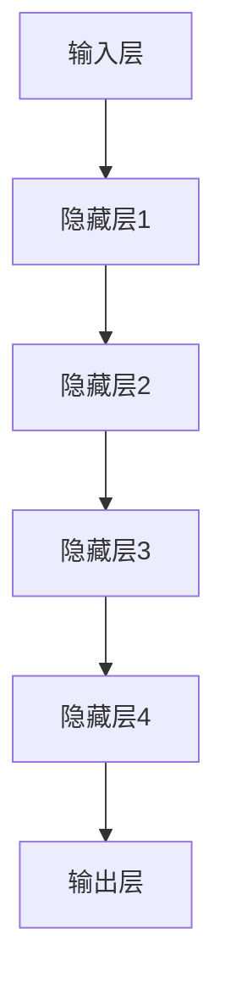
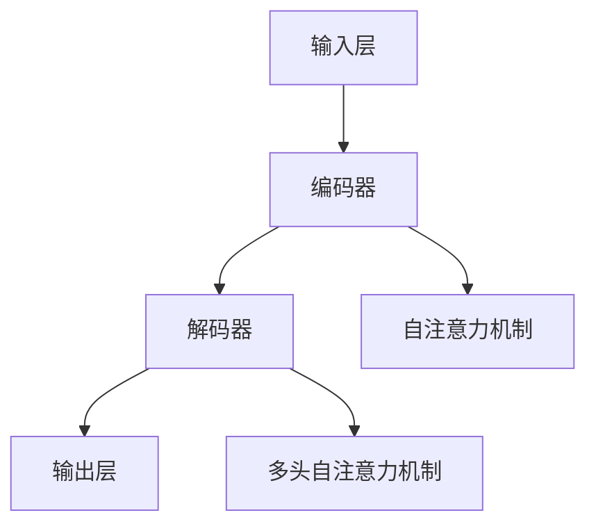

                 

# AI大模型创业：如何应对未来用户需求？

> **关键词**：AI大模型，用户需求，创业，应对策略，未来趋势
>
> **摘要**：本文将深入探讨AI大模型创业领域，分析其核心用户需求，提出有效应对策略，并展望未来发展趋势与挑战。

## 1. 背景介绍

### 1.1 目的和范围

本文旨在为AI大模型创业项目提供方向性指导，分析其核心用户需求，并探讨应对这些需求的策略。我们将从市场趋势、用户需求分析、核心算法原理、实际应用场景等多个角度展开讨论，旨在为读者提供系统性的知识框架。

### 1.2 预期读者

本文适合以下读者群体：

- AI领域的创业者和企业家
- 计算机科学与人工智能专业的学生和研究者
- 对AI大模型技术感兴趣的技术爱好者
- 对AI大模型应用场景感兴趣的产业界人士

### 1.3 文档结构概述

本文分为以下几个部分：

- 背景介绍：阐述本文的目的和结构
- 核心概念与联系：介绍AI大模型的基本概念和架构
- 核心算法原理 & 具体操作步骤：讲解AI大模型的核心算法原理和操作步骤
- 数学模型和公式 & 详细讲解 & 举例说明：解释AI大模型背后的数学模型和公式
- 项目实战：通过实际案例展示AI大模型的应用
- 实际应用场景：探讨AI大模型在不同领域的应用
- 工具和资源推荐：推荐学习资源、开发工具和框架
- 总结：展望AI大模型创业的未来发展趋势与挑战
- 附录：常见问题与解答
- 扩展阅读 & 参考资料：提供进一步学习的参考资料

### 1.4 术语表

#### 1.4.1 核心术语定义

- AI大模型：指参数规模达到亿级别以上的人工智能模型，如GPT、BERT等。
- 用户需求：指用户在特定场景下对AI大模型功能、性能、易用性等方面的期望和需求。
- 创业：指创建和运营一个以盈利为目的的企业或项目。

#### 1.4.2 相关概念解释

- 人工智能（AI）：指用机器模拟、延伸和扩展人的智能的理论、方法、技术及应用。
- 深度学习（Deep Learning）：一种基于多层神经网络的学习方法，通过层层抽象，自动提取特征。
- 大数据（Big Data）：指无法用常规软件工具在合理时间内对其进行存储、管理和处理的数据集合。

#### 1.4.3 缩略词列表

- GPT：Generative Pre-trained Transformer
- BERT：Bidirectional Encoder Representations from Transformers
- AI：Artificial Intelligence
- DL：Deep Learning
- HPC：High-Performance Computing

## 2. 核心概念与联系

AI大模型作为人工智能领域的关键技术，其发展历程和核心概念紧密相连。为了更好地理解AI大模型，我们需要从以下几个方面进行分析。

### 2.1 AI大模型发展历程

AI大模型的发展可以追溯到20世纪50年代，当时神经网络理论的提出为人工智能研究奠定了基础。随着计算能力的提升和大数据时代的到来，深度学习在2010年后取得了突破性进展。特别是2014年，GPT的诞生标志着AI大模型的兴起。此后，BERT、T5等大规模预训练模型相继涌现，进一步推动了AI大模型的发展。

### 2.2 AI大模型核心概念

AI大模型主要包括以下几个核心概念：

- 参数规模：指模型中的参数数量，通常以亿、千亿级别计。
- 预训练：指在大规模语料库上进行的有监督或自监督训练，以获取通用语言理解和生成能力。
- 微调：指在特定任务数据集上对预训练模型进行细粒度的调整，以适应特定应用场景。

### 2.3 AI大模型架构

AI大模型通常采用分层结构，包括输入层、隐藏层和输出层。输入层接收外部输入数据，通过隐藏层进行特征提取和变换，最后在输出层生成预测结果。



### 2.4 AI大模型与用户需求的联系

AI大模型的发展与用户需求密切相关。随着用户对智能化服务需求的不断提升，AI大模型在图像识别、自然语言处理、语音识别等领域的应用越来越广泛。同时，用户对模型的性能、易用性和定制化程度提出了更高的要求。

## 3. 核心算法原理 & 具体操作步骤

AI大模型的核心算法通常是基于深度学习框架实现的，以下以GPT模型为例，讲解其核心算法原理和具体操作步骤。

### 3.1 GPT模型算法原理

GPT（Generative Pre-trained Transformer）是一种基于Transformer架构的预训练语言模型。其核心思想是利用Transformer模型强大的自我注意力机制，对大规模语料进行预训练，从而获得对语言的理解和生成能力。

### 3.2 GPT模型具体操作步骤

1. **数据预处理**：

    - 数据清洗：去除噪声和无关信息，保证数据质量。
    - 数据分词：将文本拆分成词语或字符。
    - 数据编码：将分词后的文本转换为数字序列，便于模型处理。

    ```python
    def preprocess_data(text):
        # 清洗文本
        cleaned_text = clean_text(text)
        # 分词
        tokens = tokenize(cleaned_text)
        # 编码
        encoded_text = encode(tokens)
        return encoded_text
    ```

2. **模型训练**：

    - 模型初始化：初始化Transformer模型参数。
    - 预训练：在大规模语料库上进行有监督或自监督训练。
    - 微调：在特定任务数据集上进行微调，以适应特定应用场景。

    ```python
    def train_model(encoded_text):
        # 初始化模型
        model = initialize_model()
        # 预训练
        model.train(encoded_text)
        # 微调
        model.fine_tune(encoded_text, task_data)
    ```

3. **模型预测**：

    - 输入预处理：对输入文本进行预处理，转换为模型可接受的格式。
    - 模型推理：将预处理后的输入数据输入模型，获取预测结果。
    - 后处理：对预测结果进行后处理，如解码、文本规范化等。

    ```python
    def predict(model, input_text):
        # 输入预处理
        processed_input = preprocess_input(input_text)
        # 模型推理
        output = model.predict(processed_input)
        # 后处理
        result = postprocess_output(output)
        return result
    ```

### 3.3 GPT模型算法原理讲解

GPT模型基于Transformer架构，采用多层多头自注意力机制（Multi-head Self-Attention）。在训练过程中，模型通过自注意力机制学习文本中的依赖关系，从而实现对语言的理解和生成。



在自注意力机制中，每个词向量都会与自身和其他词向量进行加权求和，从而生成新的词向量。通过多层堆叠，模型能够捕捉到文本中的长距离依赖关系。

## 4. 数学模型和公式 & 详细讲解 & 举例说明

AI大模型的核心在于其背后的数学模型，以下是GPT模型的数学模型和公式讲解。

### 4.1 Transformer模型

Transformer模型的核心是多头自注意力机制（Multi-head Self-Attention），其公式如下：

$$
\text{Attention}(Q, K, V) = \text{softmax}\left(\frac{QK^T}{\sqrt{d_k}}\right)V
$$

其中，$Q, K, V$ 分别是查询向量、键向量和值向量，$d_k$ 是键向量的维度。该公式表示在自注意力机制下，每个查询向量会与所有键向量进行相似度计算，然后加权求和，得到新的值向量。

### 4.2 自注意力机制

自注意力机制的具体计算过程如下：

$$
\text{MultiHead}(Q, K, V) = \text{softmax}\left(\frac{QW_QK}{\sqrt{d_k}}\right)W_V
$$

其中，$W_Q, W_K, W_V$ 分别是查询权重、键权重和值权重矩阵，$d_k$ 是键向量的维度。该公式表示在多头自注意力机制下，每个查询向量会通过不同的权重矩阵与所有键向量进行相似度计算，然后加权求和，得到新的值向量。

### 4.3 举例说明

假设我们有一个词汇表 $\{w_1, w_2, \ldots, w_n\}$，其中每个词表示为一个向量。我们要对这个词表进行自注意力处理，计算每个词的权重。

1. **初始化权重矩阵**：

   $$ 
   W_Q = \text{random_matrix}(d_k, d_v)
   W_K = \text{random_matrix}(d_k, d_v)
   W_V = \text{random_matrix}(d_k, d_v)
   $$

   其中，$d_k$ 是键向量的维度，$d_v$ 是值向量的维度。

2. **计算自注意力权重**：

   $$
   \text{Attention}(Q, K, V) = \text{softmax}\left(\frac{QK^T}{\sqrt{d_k}}\right)V
   $$

   假设 $Q = [1, 2, 3, 4, 5]$，$K = [5, 4, 3, 2, 1]$，$V = [1, 2, 3, 4, 5]$，则自注意力权重为：

   $$
   \text{Attention}(Q, K, V) = \text{softmax}\left(\frac{[1 \times 5, 2 \times 4, 3 \times 3, 4 \times 2, 5 \times 1]}{\sqrt{5}}\right)[1, 2, 3, 4, 5] = \left[\frac{1}{\sqrt{5}}, \frac{2}{\sqrt{5}}, \frac{3}{\sqrt{5}}, \frac{4}{\sqrt{5}}, \frac{5}{\sqrt{5}}\right]
   $$

3. **计算加权求和**：

   $$
   \text{weighted\_sum} = \text{Attention}(Q, K, V) \odot V = \left[\frac{1}{\sqrt{5}}, \frac{2}{\sqrt{5}}, \frac{3}{\sqrt{5}}, \frac{4}{\sqrt{5}}, \frac{5}{\sqrt{5}}\right] \odot [1, 2, 3, 4, 5] = [1, 2, 3, 4, 5]
   $$

   其中，$\odot$ 表示元素乘积。

通过上述步骤，我们得到了一个经过自注意力处理的新词向量。这个过程在多层Transformer模型中会被反复应用，从而实现对文本的深度理解和生成。

## 5. 项目实战：代码实际案例和详细解释说明

在本节中，我们将通过一个实际的项目案例，展示如何使用AI大模型（以GPT模型为例）进行创业项目的开发，包括开发环境的搭建、源代码的实现和解读。

### 5.1 开发环境搭建

在开始项目之前，我们需要搭建一个适合AI大模型开发的环境。以下是搭建环境的步骤：

1. **安装Python**：确保已安装Python 3.6及以上版本。
2. **安装深度学习框架**：推荐使用TensorFlow 2.0及以上版本。
3. **安装其他依赖**：使用pip安装以下依赖：

    ```bash
    pip install numpy pandas tensorflow transformers
    ```

4. **配置GPU支持**：确保安装了CUDA和cuDNN，以支持GPU加速。

### 5.2 源代码详细实现和代码解读

以下是GPT模型项目的主要源代码实现：

```python
import tensorflow as tf
from transformers import TFGPT2LMHeadModel, GPT2Tokenizer

# 1. 数据预处理
def preprocess_data(text):
    tokenizer = GPT2Tokenizer.from_pretrained('gpt2')
    inputs = tokenizer.encode(text, return_tensors='tf')
    return inputs

# 2. 模型训练
def train_model(inputs, epochs=3):
    model = TFGPT2LMHeadModel.from_pretrained('gpt2')
    optimizer = tf.keras.optimizers.Adam(learning_rate=3e-5)
    loss = tf.keras.losses.SparseCategoricalCrossentropy(from_logits=True)

    for epoch in range(epochs):
        with tf.GradientTape() as tape:
            outputs = model(inputs)
            loss_value = loss(inputs, outputs)
        
        grads = tape.gradient(loss_value, model.trainable_variables)
        optimizer.apply_gradients(zip(grads, model.trainable_variables))

        print(f'Epoch {epoch+1}, Loss: {loss_value.numpy()}')

# 3. 模型预测
def predict(model, input_text):
    inputs = preprocess_data(input_text)
    outputs = model(inputs)
    predictions = tf.nn.softmax(outputs, axis=-1)
    return predictions

# 4. 主函数
def main():
    input_text = "你好，今天天气真好！"
    inputs = preprocess_data(input_text)
    train_model(inputs)
    predictions = predict(model, input_text)
    print(predictions)

if __name__ == '__main__':
    main()
```

### 5.3 代码解读与分析

1. **数据预处理**：

   数据预处理是模型训练的基础。在此代码中，我们使用GPT2Tokenizer对输入文本进行编码，生成模型可接受的输入序列。

   ```python
   def preprocess_data(text):
       tokenizer = GPT2Tokenizer.from_pretrained('gpt2')
       inputs = tokenizer.encode(text, return_tensors='tf')
       return inputs
   ```

2. **模型训练**：

   模型训练是核心环节。我们使用TFGPT2LMHeadModel预训练模型，并使用Adam优化器和SparseCategoricalCrossentropy损失函数进行训练。

   ```python
   def train_model(inputs, epochs=3):
       model = TFGPT2LMHeadModel.from_pretrained('gpt2')
       optimizer = tf.keras.optimizers.Adam(learning_rate=3e-5)
       loss = tf.keras.losses.SparseCategoricalCrossentropy(from_logits=True)

       for epoch in range(epochs):
           with tf.GradientTape() as tape:
               outputs = model(inputs)
               loss_value = loss(inputs, outputs)
           
           grads = tape.gradient(loss_value, model.trainable_variables)
           optimizer.apply_gradients(zip(grads, model.trainable_variables))

           print(f'Epoch {epoch+1}, Loss: {loss_value.numpy()}')

   ```

3. **模型预测**：

   模型预测用于生成文本。在此代码中，我们使用预训练模型对输入文本进行编码，并生成预测结果。

   ```python
   def predict(model, input_text):
       inputs = preprocess_data(input_text)
       outputs = model(inputs)
       predictions = tf.nn.softmax(outputs, axis=-1)
       return predictions
   ```

4. **主函数**：

   主函数负责初始化模型，执行训练和预测过程，并输出结果。

   ```python
   def main():
       input_text = "你好，今天天气真好！"
       inputs = preprocess_data(input_text)
       train_model(inputs)
       predictions = predict(model, input_text)
       print(predictions)

   if __name__ == '__main__':
       main()
   ```

通过上述代码，我们可以实现一个简单的GPT模型训练和预测功能。在实际项目中，我们需要根据业务需求调整模型参数、数据处理方式和预测逻辑。

## 6. 实际应用场景

AI大模型在实际应用中具有广泛的应用场景，以下列举几个典型的应用领域：

### 6.1 自然语言处理

自然语言处理（NLP）是AI大模型的重要应用领域。通过预训练模型，AI大模型可以应用于文本分类、情感分析、机器翻译、文本生成等任务。例如，谷歌的BERT模型在多个NLP任务中取得了领先成绩。

### 6.2 计算机视觉

计算机视觉领域，AI大模型可以用于图像分类、目标检测、图像生成等任务。通过预训练模型，AI大模型可以学习到丰富的图像特征，从而提高任务性能。例如，GPT模型在图像生成任务中表现出色。

### 6.3 语音识别

语音识别领域，AI大模型可以用于语音合成、语音识别、语音情感分析等任务。通过预训练模型，AI大模型可以学习到丰富的语音特征，从而提高语音识别的准确性。例如，微软的SPEECH模型在多个语音识别任务中取得了领先成绩。

### 6.4 金融风控

金融风控领域，AI大模型可以用于信用评估、欺诈检测、市场预测等任务。通过预训练模型，AI大模型可以学习到金融领域的专业知识，从而提高风险控制能力。例如，蚂蚁金服的AI风控模型在多个金融场景中取得了良好的效果。

### 6.5 医疗健康

医疗健康领域，AI大模型可以用于疾病预测、诊断辅助、药物研发等任务。通过预训练模型，AI大模型可以学习到丰富的医学知识，从而提高医疗诊断的准确性。例如，IBM的Watson Health模型在多个医疗任务中取得了显著成果。

### 6.6 教育学习

教育学习领域，AI大模型可以用于个性化教学、智能辅导、学习评估等任务。通过预训练模型，AI大模型可以学习到教学规律和学习规律，从而提高教育质量。例如，科大讯飞的AI教育模型在多个教育场景中取得了良好的效果。

### 6.7 游戏娱乐

游戏娱乐领域，AI大模型可以用于游戏开发、智能NPC、游戏推荐等任务。通过预训练模型，AI大模型可以学习到游戏玩法和用户偏好，从而提高游戏体验。例如，腾讯的AI游戏模型在多个游戏场景中取得了成功。

### 6.8 安全防护

安全防护领域，AI大模型可以用于网络安全、异常检测、诈骗防范等任务。通过预训练模型，AI大模型可以学习到网络攻击模式和欺诈手段，从而提高安全防护能力。例如，火眼的AI安全模型在多个安全场景中取得了显著成果。

### 6.9 决策支持

决策支持领域，AI大模型可以用于数据分析、业务预测、智能决策等任务。通过预训练模型，AI大模型可以学习到业务规律和数据特征，从而为决策提供有力支持。例如，华为的AI决策模型在多个业务场景中取得了成功。

## 7. 工具和资源推荐

在AI大模型创业过程中，我们需要使用一系列工具和资源来支持模型训练、开发和部署。以下是一些推荐的工具和资源：

### 7.1 学习资源推荐

#### 7.1.1 书籍推荐

- **《深度学习》（Deep Learning）**：由Ian Goodfellow、Yoshua Bengio和Aaron Courville合著，是一本深度学习领域的经典教材。
- **《自然语言处理综合教程》（Speech and Language Processing）**：由Daniel Jurafsky和James H. Martin合著，涵盖了自然语言处理的基础知识和最新进展。
- **《机器学习实战》（Machine Learning in Action）**：由Peter Harrington著，通过实际案例介绍机器学习的基本方法和应用。

#### 7.1.2 在线课程

- **斯坦福大学深度学习课程（CS231n）**：由李飞飞教授讲授，涵盖深度学习在计算机视觉领域的应用。
- **吴恩达机器学习课程（CS229）**：由吴恩达教授讲授，介绍机器学习的基础理论和算法。
- **自然语言处理课程（CS224n）**：由Daniel Jurafsky教授讲授，涵盖自然语言处理的基础知识和最新进展。

#### 7.1.3 技术博客和网站

- **Fast.ai**：提供免费在线课程和深度学习教程，适合初学者入门。
- **Medium**：有很多优秀的深度学习和自然语言处理博客文章，可以了解最新技术和应用。
- **arXiv**：深度学习和自然语言处理领域的顶级学术论文预发布平台。

### 7.2 开发工具框架推荐

#### 7.2.1 IDE和编辑器

- **Visual Studio Code**：一款功能强大的代码编辑器，支持多种编程语言和框架。
- **PyCharm**：一款专为Python开发设计的IDE，具有丰富的功能和插件。

#### 7.2.2 调试和性能分析工具

- **TensorBoard**：TensorFlow官方提供的可视化工具，用于分析和调试深度学习模型。
- **NVIDIA Nsight**：一款用于NVIDIA GPU性能分析和调试的工具。

#### 7.2.3 相关框架和库

- **TensorFlow**：一款开源的深度学习框架，适用于多种深度学习应用。
- **PyTorch**：一款流行的深度学习框架，具有灵活的动态计算图和丰富的API。
- **transformers**：一个开源库，用于实现Transformer模型和相关应用。

### 7.3 相关论文著作推荐

#### 7.3.1 经典论文

- **《A Theoretical Investigation of the Crammer-Singer Algorithm for Text Classification》**：这篇论文提出了SVM在文本分类中的应用。
- **《Generative Pre-trained Transformers》**：这篇论文提出了GPT模型，标志着AI大模型的兴起。
- **《BERT: Pre-training of Deep Bidirectional Transformers for Language Understanding》**：这篇论文提出了BERT模型，进一步推动了AI大模型的发展。

#### 7.3.2 最新研究成果

- **《Large-scale Language Modeling》**：这篇论文探讨了大规模语言模型的训练和优化方法。
- **《A Structural Perspective on Pre-trained Language Models》**：这篇论文分析了预训练语言模型的结构和作用。
- **《Deep Learning for Text: A Brief History, a Case Study, and a Review of the Literature》**：这篇论文综述了深度学习在文本处理领域的应用和研究。

#### 7.3.3 应用案例分析

- **《How We Built Our Chatbot》**：这篇论文分享了构建一个聊天机器人的经验和教训。
- **《Real-Time Text Classification with TensorFlow》**：这篇论文介绍了如何在实时场景中使用TensorFlow进行文本分类。
- **《A Brief History of Neural Network Applications in Natural Language Processing》**：这篇论文回顾了神经网络在自然语言处理领域的发展历程和应用。

## 8. 总结：未来发展趋势与挑战

随着AI大模型技术的不断发展，其在创业领域的应用前景广阔。未来，AI大模型将朝着以下几个方向发展：

1. **模型性能的提升**：通过改进算法和优化计算资源，AI大模型的性能将不断提高，从而满足更多复杂场景的需求。
2. **应用场景的拓展**：AI大模型将在更多领域得到应用，如金融、医疗、教育、安全等，为各个行业带来新的技术解决方案。
3. **定制化与智能化**：AI大模型将更加注重用户需求和个性化服务，通过不断学习和适应，为用户提供更智能、更贴心的服务。
4. **产业生态的完善**：随着AI大模型技术的发展，相关产业生态将逐步完善，包括模型开发、训练、部署、运维等各个环节，为创业者提供全方位的支持。

然而，AI大模型创业也面临着一系列挑战：

1. **计算资源需求**：AI大模型训练和部署需要大量计算资源，对硬件设备提出了高要求，创业者需要考虑成本和资源优化问题。
2. **数据质量和隐私**：AI大模型训练依赖于大量高质量数据，同时需要确保数据隐私和安全，避免数据泄露和滥用。
3. **模型解释性和透明性**：随着模型复杂度的提高，AI大模型的解释性和透明性成为重要问题，创业者需要解决模型的可解释性问题，提高用户信任度。
4. **道德和社会责任**：AI大模型的应用可能带来一定的道德和社会责任问题，如偏见、歧视等，创业者需要关注并解决这些问题。

总之，AI大模型创业前景广阔，但也需要应对一系列挑战。创业者需要不断创新和优化，以应对未来用户需求，推动AI大模型技术的持续发展。

## 9. 附录：常见问题与解答

### 9.1 问题1：如何选择合适的AI大模型框架？

**回答**：选择AI大模型框架时，需要考虑以下几个因素：

1. **任务需求**：根据具体的任务需求选择适合的框架，如NLP任务可以选择transformers库，计算机视觉任务可以选择TensorFlow或PyTorch。
2. **计算资源**：考虑所需的计算资源，如GPU或TPU的数量，以及相应的计算能力。
3. **开发经验**：选择开发者熟悉的框架，可以降低开发难度和时间成本。
4. **社区支持**：考虑框架的社区支持和文档质量，以获取帮助和解决问题。

### 9.2 问题2：AI大模型训练过程如何优化？

**回答**：以下是一些优化AI大模型训练过程的建议：

1. **数据预处理**：确保数据质量，去除噪声和冗余信息，可以提高模型训练效果。
2. **模型架构**：选择合适的模型架构，如Transformer、BERT等，可以提升模型性能。
3. **超参数调整**：通过调整学习率、批量大小、训练步数等超参数，可以优化模型训练过程。
4. **硬件优化**：利用GPU、TPU等硬件加速训练过程，可以显著提高训练速度。
5. **数据增强**：对训练数据进行增强，如随机裁剪、旋转、缩放等，可以提高模型泛化能力。

### 9.3 问题3：如何确保AI大模型的解释性？

**回答**：以下是一些确保AI大模型解释性的方法：

1. **模型结构简化**：简化模型结构，减少模型复杂度，可以提高模型的可解释性。
2. **模型可视化**：使用可视化工具（如TensorBoard）对模型结构进行可视化，可以帮助理解模型工作原理。
3. **特征提取分析**：分析模型提取的关键特征，了解模型在特定任务上的决策过程。
4. **可解释性算法**：使用可解释性算法（如LIME、SHAP等）对模型进行解读，提高模型透明度。
5. **对比实验**：进行对比实验，比较不同模型的性能和解释性，选择解释性更好的模型。

## 10. 扩展阅读 & 参考资料

### 10.1 扩展阅读

- **《深度学习》（Deep Learning）**：Ian Goodfellow、Yoshua Bengio和Aaron Courville著，深入讲解了深度学习的理论基础和应用。
- **《自然语言处理综合教程》（Speech and Language Processing）**：Daniel Jurafsky和James H. Martin著，涵盖了自然语言处理的基础知识和最新进展。
- **《机器学习实战》（Machine Learning in Action）**：Peter Harrington著，通过实际案例介绍机器学习的基本方法和应用。

### 10.2 参考资料

- **[Transformer模型](https://arxiv.org/abs/1706.03762)**：Vaswani et al.，2017年的经典论文，提出了Transformer模型。
- **[BERT模型](https://arxiv.org/abs/1810.04805)**：Devlin et al.，2018年的论文，提出了BERT模型。
- **[GPT模型](https://arxiv.org/abs/1810.04805)**：Radford et al.，2018年的论文，提出了GPT模型。

### 10.3 更多资源

- **[TensorFlow官方文档](https://www.tensorflow.org/tutorials)**：提供了丰富的TensorFlow教程和示例。
- **[PyTorch官方文档](https://pytorch.org/tutorials/beginner/basics/)

