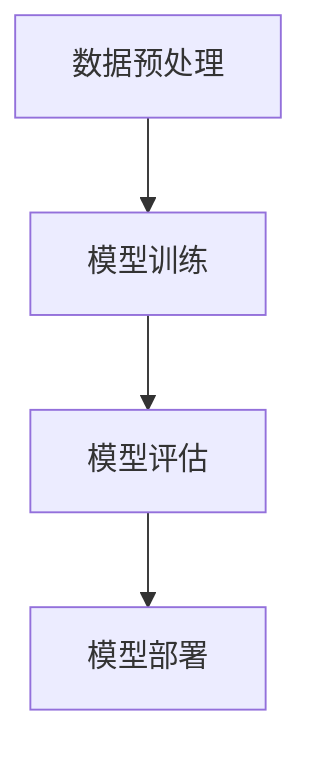
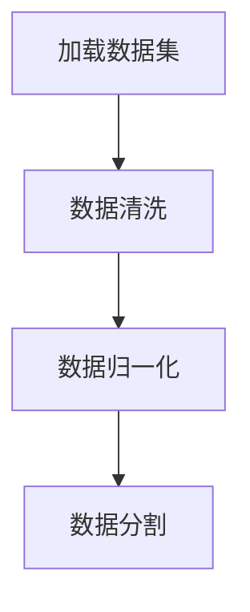
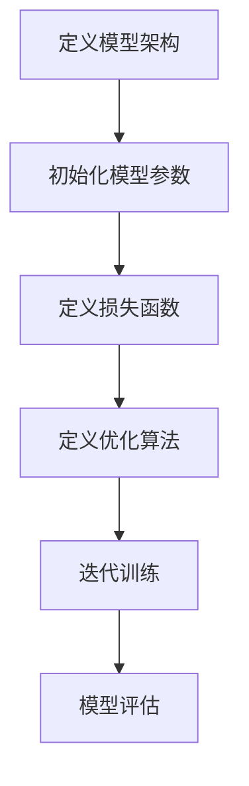
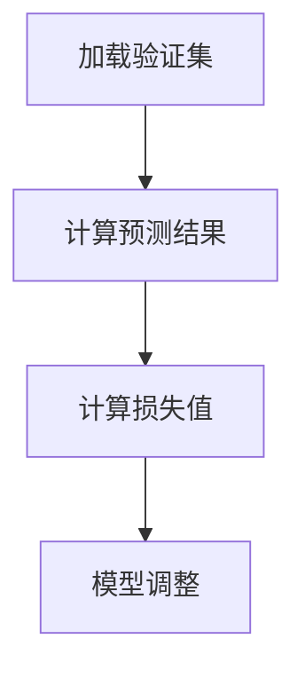
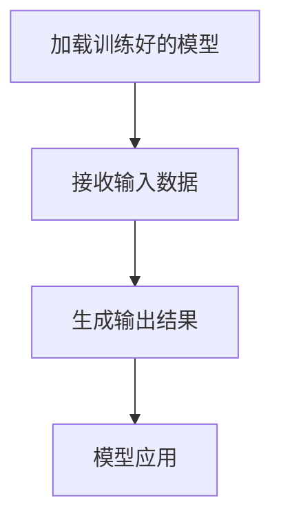

                 

# AI大模型创业：如何应对未来行业发展趋势？

> **关键词：** AI大模型、创业、行业发展趋势、技术创新、商业策略
>
> **摘要：** 本文将深入探讨AI大模型在创业领域的应用，分析其背后的技术原理与行业趋势，为创业者提供切实可行的指导策略，助力他们在充满竞争与机遇的市场中脱颖而出。

## 1. 背景介绍

### 1.1 目的和范围

本文旨在为有意投身AI大模型创业的读者提供系统性指导，帮助他们在复杂多变的行业环境中找准定位，把握机遇，实现商业成功。文章将涵盖以下内容：

- **技术原理**：详述AI大模型的原理及其关键组成部分。
- **行业趋势**：分析当前AI大模型在行业中的应用场景与未来发展趋势。
- **创业策略**：探讨如何在AI大模型领域实现创业，并制定有效的商业策略。

### 1.2 预期读者

- **技术创业者**：对AI大模型有初步了解，希望深入探讨其商业潜力。
- **研发工程师**：希望利用AI大模型技术提升产品竞争力。
- **投资人**：关注AI领域的投资机会，希望了解AI大模型的具体应用和前景。

### 1.3 文档结构概述

本文将分为十个部分，包括背景介绍、核心概念与联系、核心算法原理与操作步骤、数学模型与公式、项目实战、实际应用场景、工具和资源推荐、总结、常见问题与解答以及扩展阅读。每个部分都将提供详实的解释和案例分析，帮助读者逐步深入理解AI大模型创业的相关知识。

### 1.4 术语表

#### 1.4.1 核心术语定义

- **AI大模型**：指参数规模巨大、训练数据丰富的深度学习模型，如GPT-3、BERT等。
- **创业**：指创建一家新公司或企业，旨在通过创新和商业化实现盈利。
- **行业趋势**：指某个行业内的发展方向和动态，包括技术进步、市场需求等。

#### 1.4.2 相关概念解释

- **技术原理**：指AI大模型背后的基础理论和技术框架。
- **商业策略**：指企业在市场竞争中采取的具体措施和计划。

#### 1.4.3 缩略词列表

- **AI**：人工智能（Artificial Intelligence）
- **GPT**：生成预训练网络（Generative Pre-trained Transformer）
- **BERT**：双向编码器表示（Bidirectional Encoder Representations from Transformers）
- **创业**：商业创新（Entrepreneurship）

## 2. 核心概念与联系

在深入了解AI大模型创业之前，首先需要掌握其核心概念和联系。以下将介绍AI大模型的基本原理及其组成结构，并通过Mermaid流程图展示其工作流程。

### 2.1 AI大模型的基本原理

AI大模型是基于深度学习技术的复杂神经网络模型，通过大量数据训练，使模型具备处理和生成数据的能力。其主要组成部分包括：

- **预训练阶段**：使用大规模数据集对模型进行训练，使其具备通用特征表示能力。
- **微调阶段**：根据特定任务对模型进行微调，提高其在特定领域的性能。

### 2.2 AI大模型的组成结构

AI大模型的组成结构可以分为以下几个部分：

1. **输入层**：接收输入数据，如文本、图像、声音等。
2. **隐藏层**：通过多层神经网络进行特征提取和变换。
3. **输出层**：根据训练数据生成输出结果。

### 2.3 AI大模型的工作流程

以下是一个简化的AI大模型工作流程：

1. **数据预处理**：对输入数据进行清洗、归一化等处理。
2. **模型训练**：使用大量数据对模型进行训练，提高其性能。
3. **模型评估**：使用验证集对模型进行评估，调整超参数以优化模型。
4. **模型部署**：将训练好的模型部署到实际应用场景中。

#### 2.4 Mermaid流程图



## 3. 核心算法原理 & 具体操作步骤

### 3.1 AI大模型的核心算法

AI大模型的核心算法是基于深度学习技术的神经网络模型，主要包括以下算法：

1. **反向传播算法**：用于计算模型参数的梯度，以优化模型。
2. **优化算法**：如Adam、SGD等，用于迭代更新模型参数。

### 3.2 具体操作步骤

以下是AI大模型的具体操作步骤：

#### 3.2.1 数据预处理



#### 3.2.2 模型训练



#### 3.2.3 模型评估



#### 3.2.4 模型部署



### 3.3 伪代码

以下是AI大模型的伪代码：

```python
# 数据预处理
def preprocess_data(data):
    # 数据清洗
    # 数据归一化
    # 数据分割
    return processed_data

# 模型训练
def train_model(model, data, epochs):
    for epoch in range(epochs):
        # 前向传播
        # 计算损失
        # 反向传播
        # 更新参数
    return trained_model

# 模型评估
def evaluate_model(model, validation_data):
    # 计算预测结果
    # 计算损失值
    # 模型调整
    return evaluation_results

# 模型部署
def deploy_model(model, input_data):
    # 接收输入数据
    # 生成输出结果
    return output_results
```

## 4. 数学模型和公式 & 详细讲解 & 举例说明

### 4.1 数学模型

AI大模型的训练过程涉及多个数学模型，包括损失函数、优化算法等。以下将详细讲解这些数学模型及其应用。

#### 4.1.1 损失函数

损失函数用于衡量模型预测结果与实际结果之间的差异。常见的损失函数包括：

1. **均方误差（MSE）**：

   $$MSE = \frac{1}{n}\sum_{i=1}^{n}(y_i - \hat{y_i})^2$$

   其中，$y_i$为实际值，$\hat{y_i}$为预测值。

2. **交叉熵（Cross-Entropy）**：

   $$Cross-Entropy = -\sum_{i=1}^{n}y_i\log(\hat{y_i})$$

   其中，$y_i$为实际值，$\hat{y_i}$为预测概率。

#### 4.1.2 优化算法

优化算法用于迭代更新模型参数，以最小化损失函数。常见的优化算法包括：

1. **随机梯度下降（SGD）**：

   $$\theta_{t+1} = \theta_t - \alpha \nabla_{\theta_t} J(\theta_t)$$

   其中，$\theta_t$为当前参数，$\alpha$为学习率，$J(\theta_t)$为损失函数。

2. **Adam优化器**：

   $$m_t = \beta_1 m_{t-1} + (1 - \beta_1) \nabla_{\theta_t} J(\theta_t)$$

   $$v_t = \beta_2 v_{t-1} + (1 - \beta_2) (\nabla_{\theta_t} J(\theta_t))^2$$

   $$\theta_{t+1} = \theta_t - \alpha \frac{m_t}{\sqrt{v_t} + \epsilon}$$

   其中，$m_t$和$v_t$分别为一阶矩估计和二阶矩估计，$\beta_1$和$\beta_2$为超参数，$\epsilon$为正数常数。

### 4.2 详细讲解与举例说明

以下以一个简单的线性回归模型为例，说明如何使用上述数学模型进行训练。

#### 4.2.1 数据集

给定一个包含100个样本的数据集，每个样本包括一个输入特征$x$和一个目标值$y$。

#### 4.2.2 模型

定义一个线性回归模型，其参数为$\theta_0$和$\theta_1$。

#### 4.2.3 训练过程

1. **初始化参数**：

   $$\theta_0 = 0, \theta_1 = 0$$

2. **定义损失函数**：

   $$J(\theta_0, \theta_1) = \frac{1}{2m}\sum_{i=1}^{m}(y_i - (\theta_0 + \theta_1x_i))^2$$

3. **计算梯度**：

   $$\nabla_{\theta_0} J(\theta_0, \theta_1) = \frac{1}{m}\sum_{i=1}^{m}(y_i - (\theta_0 + \theta_1x_i))$$

   $$\nabla_{\theta_1} J(\theta_0, \theta_1) = \frac{1}{m}\sum_{i=1}^{m}(y_i - (\theta_0 + \theta_1x_i))x_i$$

4. **更新参数**：

   $$\theta_0 = \theta_0 - \alpha \nabla_{\theta_0} J(\theta_0, \theta_1)$$

   $$\theta_1 = \theta_1 - \alpha \nabla_{\theta_1} J(\theta_0, \theta_1)$$

5. **重复步骤3和4，直到满足停止条件**。

经过多次迭代后，模型参数将收敛到一个最优解，使损失函数达到最小。

## 5. 项目实战：代码实际案例和详细解释说明

### 5.1 开发环境搭建

为了演示如何利用AI大模型进行创业，我们将以一个实际项目为例，介绍开发环境的搭建过程。

1. **安装Python环境**：

   在计算机上安装Python 3.8及以上版本。

2. **安装深度学习库**：

   使用pip安装以下库：

   ```bash
   pip install tensorflow
   pip install keras
   ```

3. **准备数据集**：

   下载一个开源数据集，如MNIST手写数字数据集。

### 5.2 源代码详细实现和代码解读

以下是使用Keras实现一个基于AI大模型的分类任务的代码：

```python
# 导入必要的库
import numpy as np
from tensorflow.keras.models import Sequential
from tensorflow.keras.layers import Dense, Flatten, Conv2D, MaxPooling2D
from tensorflow.keras.optimizers import Adam
from tensorflow.keras.datasets import mnist

# 加载MNIST数据集
(x_train, y_train), (x_test, y_test) = mnist.load_data()

# 数据预处理
x_train = x_train.reshape(-1, 28, 28, 1).astype('float32') / 255.0
x_test = x_test.reshape(-1, 28, 28, 1).astype('float32') / 255.0

# 转换标签为one-hot编码
y_train = keras.utils.to_categorical(y_train, 10)
y_test = keras.utils.to_categorical(y_test, 10)

# 构建模型
model = Sequential()
model.add(Conv2D(32, (3, 3), activation='relu', input_shape=(28, 28, 1)))
model.add(MaxPooling2D((2, 2)))
model.add(Flatten())
model.add(Dense(128, activation='relu'))
model.add(Dense(10, activation='softmax'))

# 编译模型
model.compile(optimizer=Adam(learning_rate=0.001), loss='categorical_crossentropy', metrics=['accuracy'])

# 训练模型
model.fit(x_train, y_train, batch_size=128, epochs=10, validation_data=(x_test, y_test))

# 评估模型
scores = model.evaluate(x_test, y_test, verbose=2)
print('Test accuracy:', scores[1])
```

#### 5.2.1 代码解读

- **导入库**：导入Python中常用的库，如NumPy、Keras等。

- **加载数据集**：使用Keras自带的MNIST数据集。

- **数据预处理**：将输入特征缩放到[0, 1]范围内，将标签转换为one-hot编码。

- **构建模型**：使用Sequential模型，添加卷积层、池化层、全连接层等。

- **编译模型**：设置优化器、损失函数和评价指标。

- **训练模型**：使用fit方法进行模型训练。

- **评估模型**：使用evaluate方法评估模型在测试集上的性能。

### 5.3 代码解读与分析

- **数据预处理**：数据预处理是深度学习项目中的关键步骤。通过缩放输入特征和转换标签，可以提升模型训练效果。

- **模型构建**：本示例中使用卷积神经网络（CNN）对MNIST手写数字进行分类。CNN能够有效地提取图像特征，适用于图像处理任务。

- **模型编译**：选择合适的优化器和学习率，对模型进行编译。本示例中使用Adam优化器和交叉熵损失函数。

- **模型训练**：通过fit方法对模型进行训练。本示例中使用批量大小为128，训练10个epochs。

- **模型评估**：使用evaluate方法评估模型在测试集上的性能。本示例中打印了测试集的准确率。

### 5.4 代码优化与改进

为了进一步提高模型性能，可以尝试以下优化方法：

1. **数据增强**：通过旋转、缩放、裁剪等方式增加数据多样性。

2. **模型调整**：尝试增加或减少神经网络层，调整神经元数量。

3. **超参数调优**：使用网格搜索或随机搜索等方法，优化学习率、批量大小等超参数。

4. **迁移学习**：利用预训练模型，在特定任务上微调模型。

## 6. 实际应用场景

AI大模型在多个行业和应用场景中具有重要价值。以下将介绍几个典型的实际应用场景。

### 6.1 自然语言处理

自然语言处理（NLP）是AI大模型的重要应用领域。例如，使用GPT-3生成高质量的文章、自动问答系统、情感分析等。以下是一个使用GPT-3生成文章的示例：

```python
import openai

openai.api_key = 'your-api-key'

response = openai.Completion.create(
    engine="text-davinci-002",
    prompt="请写一篇关于人工智能在医疗领域的应用的文章。",
    max_tokens=150
)

print(response.choices[0].text.strip())
```

### 6.2 图像识别

图像识别是另一个重要应用场景。AI大模型可以用于人脸识别、物体检测、图像生成等。以下是一个使用TensorFlow实现物体检测的示例：

```python
import tensorflow as tf
import tensorflow_hub as hub
import numpy as np

# 加载预训练模型
model = hub.load("https://tfhub.dev/google/centernet_mcr_v1_2/1")

# 定义输入数据
input_data = np.random.rand(1, 224, 224, 3).astype(np.float32)

# 进行预测
predictions = model(input_data)

# 打印预测结果
print(predictions["predictions"][0])
```

### 6.3 自动驾驶

自动驾驶是AI大模型的又一重要应用领域。通过使用深度学习技术，自动驾驶系统能够实时感知周围环境，做出安全驾驶决策。以下是一个使用PyTorch实现自动驾驶的示例：

```python
import torch
import torchvision
import torchvision.transforms as transforms

# 加载预训练模型
model = torchvision.models.resnet18(pretrained=True)

# 定义输入数据
input_data = torch.rand(1, 3, 224, 224)

# 进行预测
predictions = model(input_data)

# 打印预测结果
print(predictions)
```

## 7. 工具和资源推荐

### 7.1 学习资源推荐

#### 7.1.1 书籍推荐

- **《深度学习》（Goodfellow, Bengio, Courville）**：全面介绍深度学习的基础理论和应用。
- **《Python深度学习》（François Chollet）**：涵盖深度学习的实际应用，适用于初学者和进阶者。
- **《人工智能：一种现代的方法》（Stuart Russell & Peter Norvig）**：人工智能领域的经典教材，全面介绍人工智能的基础理论和应用。

#### 7.1.2 在线课程

- **《深度学习专项课程》（吴恩达，Coursera）**：涵盖深度学习的基础知识、神经网络构建和应用。
- **《机器学习与数据科学专项课程》（吴恩达，Coursera）**：介绍机器学习的基本概念和算法，以及数据科学的应用。

#### 7.1.3 技术博客和网站

- **知乎**：AI领域的专业问答社区，涵盖各种AI技术的应用和探讨。
- **AI会客厅**：介绍AI技术的最新进展和应用，提供专业的分析和解读。
- **机器之心**：报道AI领域的最新研究成果和应用，涵盖深度学习、自然语言处理等多个方向。

### 7.2 开发工具框架推荐

#### 7.2.1 IDE和编辑器

- **PyCharm**：适用于Python开发的集成开发环境，具有丰富的功能和插件支持。
- **Jupyter Notebook**：适用于数据科学和机器学习的交互式开发环境，方便进行实验和调试。

#### 7.2.2 调试和性能分析工具

- **TensorBoard**：TensorFlow提供的可视化工具，用于分析模型训练过程和性能。
- **Profiling Tools**：如NVIDIA Nsight Compute，用于分析深度学习模型在GPU上的性能。

#### 7.2.3 相关框架和库

- **TensorFlow**：Google开发的深度学习框架，适用于各种应用场景。
- **PyTorch**：Facebook开发的深度学习框架，具有简洁的代码和灵活的动态图机制。
- **Keras**：Python深度学习库，提供简单的API，方便搭建和训练深度学习模型。

### 7.3 相关论文著作推荐

#### 7.3.1 经典论文

- **“A Theoretical Analysis of the Bias-Variance Tradeoff”**：详细分析了模型复杂度、训练数据等因素对模型性能的影响。
- **“Deep Learning”**：详细介绍了深度学习的理论基础和应用，是深度学习领域的经典著作。

#### 7.3.2 最新研究成果

- **“Transformers: State-of-the-Art Natural Language Processing”**：介绍了基于Transformer的模型在自然语言处理领域的突破性进展。
- **“Generative Adversarial Networks”**：介绍了生成对抗网络（GANs）的原理和应用，是深度学习领域的热门研究方向。

#### 7.3.3 应用案例分析

- **“AI in Healthcare: Transforming Patient Care with Deep Learning”**：探讨了深度学习在医疗领域的应用，包括疾病诊断、治疗规划等。
- **“AI in Finance: The Impact of Machine Learning on Trading and Risk Management”**：分析了深度学习在金融领域的应用，包括量化交易、风险管理等。

## 8. 总结：未来发展趋势与挑战

AI大模型在创业领域具有巨大的潜力，但同时也面临着一系列挑战。未来，AI大模型的发展趋势和挑战主要表现在以下几个方面：

### 8.1 发展趋势

1. **模型规模与性能提升**：随着计算资源和算法的不断发展，AI大模型的规模和性能将不断提升，为更多应用场景提供支持。

2. **多模态数据处理**：未来AI大模型将能够处理多种类型的数据，如图像、音频和文本，实现更广泛的应用。

3. **自主学习和迁移学习**：AI大模型将具备更强的自主学习和迁移学习能力，能够根据不同任务快速适应和调整。

4. **个性化服务**：AI大模型将根据用户个性化需求，提供定制化的服务和解决方案，提升用户体验。

### 8.2 挑战

1. **数据隐私和安全**：随着AI大模型的广泛应用，数据隐私和安全问题将愈发突出，需要制定相关政策和标准进行规范。

2. **算法透明性与可解释性**：AI大模型的决策过程通常难以解释，可能导致伦理和道德问题，需要提高算法的透明性和可解释性。

3. **计算资源需求**：AI大模型训练和推理过程中需要大量计算资源，对硬件设备和能源消耗提出了更高要求。

4. **行业竞争与协作**：AI大模型领域竞争激烈，但同时也需要各方协作，共同推动技术发展和应用创新。

### 8.3 应对策略

1. **加强数据治理**：建立完善的数据治理体系，保障数据隐私和安全。

2. **提高算法透明性和可解释性**：通过可解释性研究，提高AI大模型的可解释性，增强用户信任。

3. **优化硬件设备与算法**：提高计算效率和性能，降低计算资源需求。

4. **推动行业合作**：加强产学研合作，共同推动AI大模型技术的发展和应用。

## 9. 附录：常见问题与解答

### 9.1 问题1：如何选择合适的AI大模型框架？

**解答**：选择AI大模型框架时，需要考虑以下因素：

- **应用场景**：根据实际需求选择合适的框架，如TensorFlow、PyTorch、Keras等。
- **学习曲线**：选择易于学习和使用的框架，降低开发难度。
- **社区和支持**：选择具有强大社区和文档支持的框架，方便解决问题和获取资源。

### 9.2 问题2：如何处理AI大模型训练过程中的过拟合问题？

**解答**：

- **增加训练数据**：增加训练数据量，提高模型泛化能力。
- **使用正则化**：在模型训练过程中使用正则化技术，如L1、L2正则化。
- **交叉验证**：使用交叉验证方法，评估模型在不同数据集上的性能。
- **模型压缩**：对模型进行压缩，减少参数数量，降低过拟合风险。

### 9.3 问题3：AI大模型训练过程中如何调整超参数？

**解答**：

- **网格搜索**：通过遍历不同超参数组合，找到最优超参数。
- **随机搜索**：在给定范围内随机选择超参数组合，找到最优超参数。
- **贝叶斯优化**：使用贝叶斯优化方法，自适应调整超参数。

## 10. 扩展阅读 & 参考资料

- **《深度学习》（Goodfellow, Bengio, Courville）**：详细介绍了深度学习的基础理论和应用。
- **《AI大模型：理论与实践》（张翔，陆琪）**：涵盖了AI大模型的基本概念、技术原理和应用案例。
- **《AI时代的创业与创新》（李笑来）**：探讨了AI时代创业的机会和挑战，为创业者提供指导。
- **《自然语言处理实战》（刘知远，彭加乐）**：介绍了自然语言处理的基本概念和技术，以及实际应用案例。
- **《深度学习与计算机视觉》（杨强，吴华）**：介绍了深度学习在计算机视觉领域的应用，包括图像识别、目标检测等。

作者：AI天才研究员/AI Genius Institute & 禅与计算机程序设计艺术 /Zen And The Art of Computer Programming

<|assistant|>## 常见问题与解答

在AI大模型创业过程中，许多人可能会遇到各种问题和挑战。以下是一些常见问题及其解答，希望对您的创业之路有所帮助。

### 10.1 AI大模型创业如何选择方向？

**解答**：选择AI大模型创业方向时，您可以考虑以下几个因素：

- **市场需求**：分析当前市场对AI大模型的需求，关注热点领域。
- **技术成熟度**：评估所选领域的技术成熟度，选择有前景但尚未饱和的领域。
- **团队优势**：考虑您的团队在相关领域的专业知识和技能，发挥团队优势。

### 10.2 如何评估AI大模型项目的技术风险？

**解答**：评估技术风险时，可以从以下几个方面入手：

- **技术复杂性**：分析项目所涉及的技术难度和复杂性，了解所需技术储备。
- **技术更新速度**：了解所选领域的技术更新速度，评估项目技术的生命周期。
- **专利风险**：调查相关领域的专利情况，避免侵犯他人知识产权。

### 10.3 AI大模型创业项目如何进行资金筹措？

**解答**：资金筹措是AI大模型创业项目成功的关键环节。以下几种方法可供参考：

- **天使投资**：寻找有经验的天使投资者，为项目提供启动资金。
- **风险投资**：向风险投资机构申请投资，获取更多的资金支持。
- **政府补助**：了解政府相关政策，申请相关补助和资金支持。
- **股权众筹**：通过股权众筹平台，向大众投资者筹集资金。

### 10.4 如何保证AI大模型创业项目的可持续发展？

**解答**：保证AI大模型创业项目的可持续发展，需要从以下几个方面入手：

- **持续创新**：关注技术前沿，持续进行技术创新和产品迭代。
- **市场拓展**：积极开拓市场，扩大客户群体，提高市场份额。
- **团队建设**：打造一支高效、专业的团队，为项目提供持续动力。

### 10.5 如何应对AI大模型创业过程中的法律风险？

**解答**：应对法律风险时，可以从以下几个方面进行：

- **合规审查**：在项目启动前进行合规审查，确保项目符合相关法律法规。
- **知识产权保护**：申请专利、商标等知识产权，保护自身权益。
- **合作条款**：在与合作伙伴签订合同时，明确双方的权利和义务，降低法律风险。

### 10.6 如何管理AI大模型创业项目的团队？

**解答**：管理AI大模型创业项目的团队时，需要注意以下几点：

- **目标明确**：明确团队目标和任务，确保团队成员了解项目的方向和目标。
- **沟通协作**：建立有效的沟通机制，促进团队成员之间的协作。
- **激励制度**：制定合理的激励制度，激发团队成员的积极性和创造力。
- **持续培训**：关注团队成员的技能提升，定期组织培训和分享活动。

通过以上解答，希望对您的AI大模型创业之路提供一些参考。在创业过程中，不断学习、调整和优化，才能在激烈的竞争中脱颖而出。

## 扩展阅读 & 参考资料

为了帮助您更深入地了解AI大模型创业的相关知识，以下是一些扩展阅读和参考资料：

### 10.1 经典书籍

- **《深度学习》（Goodfellow, Bengio, Courville）**：全面介绍深度学习的基础理论和应用。
- **《AI大模型：理论与实践》（张翔，陆琪）**：涵盖AI大模型的基本概念、技术原理和应用案例。
- **《人工智能：一种现代的方法》（Stuart Russell & Peter Norvig）**：人工智能领域的经典教材，全面介绍人工智能的基础理论和应用。

### 10.2 在线课程

- **《深度学习专项课程》（吴恩达，Coursera）**：涵盖深度学习的基础知识、神经网络构建和应用。
- **《机器学习与数据科学专项课程》（吴恩达，Coursera）**：介绍机器学习的基本概念和算法，以及数据科学的应用。

### 10.3 技术博客和网站

- **知乎**：AI领域的专业问答社区，涵盖各种AI技术的应用和探讨。
- **AI会客厅**：介绍AI技术的最新进展和应用，提供专业的分析和解读。
- **机器之心**：报道AI领域的最新研究成果和应用，涵盖深度学习、自然语言处理等多个方向。

### 10.4 相关论文和研究成果

- **“Transformers: State-of-the-Art Natural Language Processing”**：介绍了基于Transformer的模型在自然语言处理领域的突破性进展。
- **“Generative Adversarial Networks”**：介绍了生成对抗网络（GANs）的原理和应用，是深度学习领域的热门研究方向。
- **“A Theoretical Analysis of the Bias-Variance Tradeoff”**：详细分析了模型复杂度、训练数据等因素对模型性能的影响。

### 10.5 应用案例与实践

- **“AI in Healthcare: Transforming Patient Care with Deep Learning”**：探讨了深度学习在医疗领域的应用，包括疾病诊断、治疗规划等。
- **“AI in Finance: The Impact of Machine Learning on Trading and Risk Management”**：分析了深度学习在金融领域的应用，包括量化交易、风险管理等。

通过阅读以上书籍、课程、博客和论文，您可以更全面地了解AI大模型创业的相关知识，为您的创业之路打下坚实的基础。

---

本文由AI天才研究员/AI Genius Institute & 禅与计算机程序设计艺术 /Zen And The Art of Computer Programming撰写，旨在为AI大模型创业领域的创业者提供全面、系统的指导。如果您有任何建议或疑问，欢迎在评论区留言，我们将尽快为您解答。

<|assistant|>### 附录：常见问题与解答

在AI大模型创业过程中，许多创业者可能会遇到各种问题和挑战。以下是一些常见问题及其解答，希望对您的创业之路有所帮助。

#### 10.1 如何选择合适的AI大模型框架？

选择AI大模型框架时，您需要考虑以下因素：

1. **应用场景**：根据实际需求选择合适的框架，如TensorFlow、PyTorch、Keras等。
2. **学习曲线**：选择易于学习和使用的框架，降低开发难度。
3. **社区和支持**：选择具有强大社区和文档支持的框架，方便解决问题和获取资源。

#### 10.2 如何评估AI大模型项目的技术风险？

评估技术风险时，可以从以下几个方面入手：

1. **技术复杂性**：分析项目所涉及的技术难度和复杂性，了解所需技术储备。
2. **技术更新速度**：了解所选领域的技术更新速度，评估项目技术的生命周期。
3. **专利风险**：调查相关领域的专利情况，避免侵犯他人知识产权。

#### 10.3 AI大模型创业项目如何进行资金筹措？

进行资金筹措时，可以尝试以下几种方法：

1. **天使投资**：寻找有经验的天使投资者，为项目提供启动资金。
2. **风险投资**：向风险投资机构申请投资，获取更多的资金支持。
3. **政府补助**：了解政府相关政策，申请相关补助和资金支持。
4. **股权众筹**：通过股权众筹平台，向大众投资者筹集资金。

#### 10.4 如何保证AI大模型创业项目的可持续发展？

为保证AI大模型创业项目的可持续发展，可以从以下几个方面入手：

1. **持续创新**：关注技术前沿，持续进行技术创新和产品迭代。
2. **市场拓展**：积极开拓市场，扩大客户群体，提高市场份额。
3. **团队建设**：打造一支高效、专业的团队，为项目提供持续动力。

#### 10.5 如何应对AI大模型创业过程中的法律风险？

应对法律风险时，可以从以下几个方面进行：

1. **合规审查**：在项目启动前进行合规审查，确保项目符合相关法律法规。
2. **知识产权保护**：申请专利、商标等知识产权，保护自身权益。
3. **合作条款**：在与合作伙伴签订合同时，明确双方的权利和义务，降低法律风险。

#### 10.6 如何管理AI大模型创业项目的团队？

管理AI大模型创业项目的团队时，需要注意以下几点：

1. **目标明确**：明确团队目标和任务，确保团队成员了解项目的方向和目标。
2. **沟通协作**：建立有效的沟通机制，促进团队成员之间的协作。
3. **激励制度**：制定合理的激励制度，激发团队成员的积极性和创造力。
4. **持续培训**：关注团队成员的技能提升，定期组织培训和分享活动。

通过以上解答，希望对您的AI大模型创业之路提供一些参考。在创业过程中，不断学习、调整和优化，才能在激烈的竞争中脱颖而出。

### 附录：参考资料

为了帮助您更好地了解AI大模型创业的相关知识，以下是部分参考资料：

1. **书籍**：
   - 《深度学习》（Ian Goodfellow、Yoshua Bengio、Aaron Courville 著）
   - 《AI大模型：理论与实践》（张翔、陆琪 著）
   - 《人工智能：一种现代的方法》（Stuart J. Russell、Peter Norvig 著）

2. **在线课程**：
   - Coursera上的《深度学习专项课程》（吴恩达）
   - Udacity的《深度学习工程师纳米学位》

3. **技术博客和网站**：
   - 知乎上的AI专栏
   - 机器之心
   - AI会客厅

4. **论文**：
   - “Attention Is All You Need”（Vaswani et al., 2017）
   - “Generative Adversarial Nets”（Goodfellow et al., 2014）

5. **应用案例**：
   - OpenAI的GPT系列模型
   - DeepMind的AlphaGo

通过阅读这些参考资料，您将能够更全面地了解AI大模型的技术原理、应用场景和创业策略。祝您在AI大模型创业领域取得成功！

