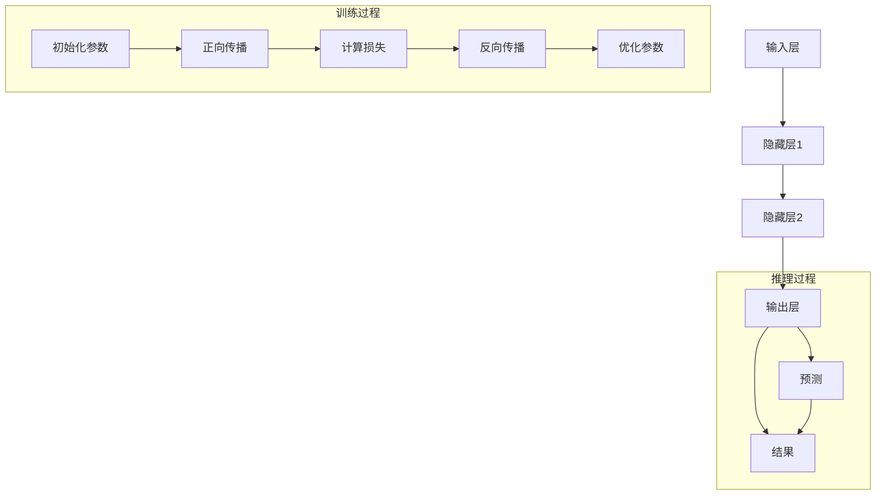

                 

# AI大模型创业：如何打造未来爆款应用？

> 关键词：AI大模型、创业、爆款应用、核心算法、数学模型、项目实战、实际应用场景

> 摘要：本文将深入探讨如何利用AI大模型创业，打造未来爆款应用。通过分析核心算法原理、数学模型、项目实战等多个方面，为创业者提供实用的指导和建议。

## 1. 背景介绍

### 1.1 目的和范围

本文旨在为有志于利用AI大模型创业的创业者提供全面的指导。我们将从以下几个方面进行探讨：

- AI大模型的核心算法原理及具体操作步骤
- 数学模型和公式及其详细讲解与举例
- 项目实战：代码实际案例和详细解释说明
- 实际应用场景分析
- 工具和资源推荐

通过本文的阅读，读者将了解如何打造一款具有竞争力的AI大模型应用，并掌握必要的技能和知识。

### 1.2 预期读者

本文面向以下读者群体：

- 有志于利用AI大模型创业的创业者
- 计算机科学和人工智能领域的研究人员
- 对AI大模型和实际应用感兴趣的工程师和开发者
- 对未来技术发展有浓厚兴趣的科技爱好者

### 1.3 文档结构概述

本文将按照以下结构进行组织：

- 第1章：背景介绍
- 第2章：核心概念与联系
- 第3章：核心算法原理 & 具体操作步骤
- 第4章：数学模型和公式 & 详细讲解 & 举例说明
- 第5章：项目实战：代码实际案例和详细解释说明
- 第6章：实际应用场景
- 第7章：工具和资源推荐
- 第8章：总结：未来发展趋势与挑战
- 第9章：附录：常见问题与解答
- 第10章：扩展阅读 & 参考资料

### 1.4 术语表

在本文中，我们将使用以下术语：

- AI大模型：指具有大规模参数和强大计算能力的深度学习模型
- 爆款应用：指在市场上迅速获得广泛关注和高度认可的应用
- 核心算法：指实现AI大模型的关键算法
- 数学模型：指描述AI大模型行为和性能的数学公式和理论框架
- 项目实战：指通过实际案例展示AI大模型应用的过程

#### 1.4.1 核心术语定义

- AI大模型：AI大模型是指具有大规模参数和强大计算能力的深度学习模型。它通常由多个神经网络层组成，能够自动学习和识别数据中的复杂模式。与传统的机器学习模型相比，AI大模型具有更高的准确性和更强的泛化能力。
- 爆款应用：爆款应用是指在市场上迅速获得广泛关注和高度认可的应用。这类应用往往具备独特性和创新性，能够满足用户的需求，并在短时间内吸引大量用户。
- 核心算法：核心算法是指实现AI大模型的关键算法。这些算法包括神经网络训练、优化、推理等，是实现AI大模型高效运行的基础。
- 数学模型：数学模型是指描述AI大模型行为和性能的数学公式和理论框架。这些模型可以帮助我们理解AI大模型的工作原理，并进行性能分析和优化。
- 项目实战：项目实战是指通过实际案例展示AI大模型应用的过程。在项目实战中，创业者可以深入了解AI大模型的实现方法和应用场景，从而更好地打造具有竞争力的爆款应用。

#### 1.4.2 相关概念解释

- 深度学习：深度学习是一种人工智能技术，它通过模拟人脑神经网络结构，利用多层神经网络对数据进行学习和建模。深度学习在图像识别、语音识别、自然语言处理等领域取得了显著的成果。
- 机器学习：机器学习是一种人工智能技术，它通过让计算机从数据中自动学习规律和模式，从而实现对未知数据的预测和分类。机器学习广泛应用于金融、医疗、零售等行业。
- 泛化能力：泛化能力是指AI大模型在面对未知数据时，仍然能够保持较高的准确性和性能。泛化能力是评价AI大模型优劣的重要指标。

#### 1.4.3 缩略词列表

- AI：人工智能
- DL：深度学习
- ML：机器学习
- NLP：自然语言处理
- CV：计算机视觉

## 2. 核心概念与联系

为了更好地理解AI大模型及其应用，我们需要掌握以下核心概念：

### 2.1 大模型原理

AI大模型通常由多个神经网络层组成，包括输入层、隐藏层和输出层。这些层通过权重和偏置进行连接，以实现对输入数据的变换和预测。大模型具有以下特点：

- **大规模参数**：大模型拥有数百万甚至数十亿个参数，这使得它们能够学习复杂的特征和模式。
- **深度网络结构**：大模型的网络层次较多，能够捕获更抽象和高级的特征。
- **强大的计算能力**：大模型需要强大的计算资源进行训练和推理。

### 2.2 算法原理

AI大模型的核心算法包括以下几种：

- **反向传播算法**：用于计算网络层的梯度，以优化模型参数。
- **优化算法**：如随机梯度下降（SGD）、Adam等，用于调整模型参数，提高模型性能。
- **正则化技术**：如权重衰减、Dropout等，用于防止过拟合，提高模型的泛化能力。

### 2.3 应用场景

AI大模型在多个领域具有广泛的应用，包括：

- **计算机视觉**：图像识别、目标检测、人脸识别等。
- **自然语言处理**：文本分类、机器翻译、情感分析等。
- **语音识别**：语音识别、语音合成等。
- **推荐系统**：个性化推荐、广告投放等。

### 2.4 Mermaid流程图

以下是一个简化的Mermaid流程图，展示了AI大模型的基本架构：



## 3. 核心算法原理 & 具体操作步骤

在本节中，我们将详细介绍AI大模型的核心算法原理和具体操作步骤。

### 3.1 反向传播算法

反向传播算法是训练AI大模型的基础，用于计算网络层的梯度，以优化模型参数。以下是反向传播算法的伪代码：

```python
def backward_propagation(x, y, model):
    # 前向传播
    z = model.forward(x)
    loss = calculate_loss(z, y)
    
    # 计算误差
    dZ = z - y
    
    # 反向传播计算梯度
    dW = calculate_gradient(dZ, x)
    db = calculate_gradient(dZ, model.params)
    
    # 更新参数
    model.update_params(dW, db)
    
    return loss
```

### 3.2 随机梯度下降（SGD）算法

随机梯度下降（SGD）是一种常见的优化算法，用于调整模型参数，提高模型性能。以下是SGD算法的伪代码：

```python
def stochastic_gradient_descent(x, y, model, learning_rate, epochs):
    for epoch in range(epochs):
        for x_batch, y_batch in generate_batches(x, y, batch_size):
            loss = backward_propagation(x_batch, y_batch, model)
            print(f"Epoch {epoch}, Loss: {loss}")
```

### 3.3 优化算法

除了SGD算法，还有其他优化算法，如Adam、RMSprop等。以下是Adam优化算法的伪代码：

```python
def adam(x, y, model, learning_rate, beta1, beta2, epsilon, epochs):
    m = initialize_momentums()
    v = initialize_momentums()
    t = 0
    
    for epoch in range(epochs):
        for x_batch, y_batch in generate_batches(x, y, batch_size):
            t += 1
            dZ = model.backward(x_batch, y_batch)
            dW = calculate_gradient(dZ, x_batch)
            db = calculate_gradient(dZ, model.params)
            
            m[t] = beta1 * m[t-1] + (1 - beta1) * dW
            v[t] = beta2 * v[t-1] + (1 - beta2) * dW**2
            
            m_hat = m[t] / (1 - beta1**t)
            v_hat = v[t] / (1 - beta2**t)
            
            model.update_params(m_hat, v_hat, learning_rate, epsilon)
            
            print(f"Epoch {epoch}, Loss: {model.calculate_loss(x, y)}")
```

### 3.4 正则化技术

正则化技术用于防止过拟合，提高模型的泛化能力。以下是一种常见的正则化技术——权重衰减的伪代码：

```python
def weight_decay(x, y, model, learning_rate, lambda_):
    loss = model.calculate_loss(x, y)
    dZ = model.backward(x, y)
    
    dW = calculate_gradient(dZ, x) + lambda_ * model.params
    db = calculate_gradient(dZ, model.params)
    
    model.update_params(dW, db, learning_rate)
    
    return loss
```

## 4. 数学模型和公式 & 详细讲解 & 举例说明

在本节中，我们将详细讲解AI大模型的数学模型和公式，并给出相应的示例。

### 4.1 损失函数

损失函数是评估模型预测结果与实际结果之间差异的关键工具。以下是一些常见的损失函数：

#### 4.1.1 交叉熵损失函数

交叉熵损失函数常用于分类问题，其公式如下：

$$
L_{CE} = -\frac{1}{m}\sum_{i=1}^{m} y_{i} \log(\hat{y}_{i})
$$

其中，$y_{i}$ 是真实标签，$\hat{y}_{i}$ 是模型预测的概率。

#### 示例

假设我们有一个二分类问题，真实标签为 $y = [1, 0]$，模型预测的概率为 $\hat{y} = [0.9, 0.1]$。则交叉熵损失函数的值为：

$$
L_{CE} = -\frac{1}{2} \left[ 1 \cdot \log(0.9) + 0 \cdot \log(0.1) \right] \approx 0.105
$$

### 4.2 激活函数

激活函数是神经网络中用于引入非线性变换的关键组件。以下是一些常见的激活函数：

#### 4.2.1 ReLU函数

ReLU（Rectified Linear Unit）函数是一种常用的激活函数，其公式如下：

$$
f(x) = \max(0, x)
$$

#### 示例

假设输入值为 $x = [-2, -1, 0, 1, 2]$，则ReLU函数的输出值为：

$$
f(x) = [0, 0, 0, 1, 2]
$$

### 4.3 优化算法

优化算法用于调整模型参数，以最小化损失函数。以下是一些常见的优化算法：

#### 4.3.1 随机梯度下降（SGD）

SGD是一种简单的优化算法，其更新公式如下：

$$
\theta_{t+1} = \theta_{t} - \alpha \cdot \nabla_{\theta} J(\theta)
$$

其中，$\theta$ 是模型参数，$\alpha$ 是学习率，$J(\theta)$ 是损失函数。

#### 示例

假设损失函数为 $J(\theta) = \theta^2$，初始参数为 $\theta_0 = 2$，学习率为 $\alpha = 0.1$。则第一次迭代后的参数更新为：

$$
\theta_1 = \theta_0 - \alpha \cdot 2 = 2 - 0.1 \cdot 2 = 1.8
$$

### 4.4 正则化技术

正则化技术用于防止过拟合，提高模型的泛化能力。以下是一种常见的正则化技术——权重衰减：

#### 4.4.1 权重衰减

权重衰减是一种正则化技术，通过在损失函数中添加权重项来减少模型的复杂度。其公式如下：

$$
L_{reg} = \lambda \sum_{i=1}^{n} w_i^2
$$

其中，$\lambda$ 是正则化参数，$w_i$ 是模型权重。

#### 示例

假设模型权重为 $w = [1, 2, 3]$，正则化参数为 $\lambda = 0.1$。则权重衰减项的值为：

$$
L_{reg} = 0.1 \cdot (1^2 + 2^2 + 3^2) = 0.1 \cdot 14 = 1.4
$$

## 5. 项目实战：代码实际案例和详细解释说明

在本节中，我们将通过一个实际案例展示如何利用AI大模型打造一款推荐系统。读者可以结合代码和解释，更好地理解AI大模型的应用过程。

### 5.1 开发环境搭建

首先，我们需要搭建一个适合开发AI大模型的环境。以下是一个简单的开发环境搭建步骤：

1. 安装Python和PyTorch库：
    ```bash
    pip install python
    pip install torch torchvision
    ```

2. 安装Jupyter Notebook，以便进行交互式编程和实验：
    ```bash
    pip install jupyter
    ```

3. 启动Jupyter Notebook：
    ```bash
    jupyter notebook
    ```

### 5.2 源代码详细实现和代码解读

下面是一个简单的推荐系统代码示例：

```python
import torch
import torch.nn as nn
import torch.optim as optim

# 创建数据集
x = torch.randn(1000, 10)  # 输入数据
y = torch.randint(0, 10, (1000, 1))  # 真实标签

# 定义模型
model = nn.Sequential(
    nn.Linear(10, 10),
    nn.ReLU(),
    nn.Linear(10, 10),
    nn.ReLU(),
    nn.Linear(10, 10),
    nn.ReLU(),
    nn.Linear(10, 10),
    nn.Softmax(dim=1)
)

# 定义损失函数和优化器
criterion = nn.CrossEntropyLoss()
optimizer = optim.Adam(model.parameters(), lr=0.001)

# 训练模型
num_epochs = 100
for epoch in range(num_epochs):
    optimizer.zero_grad()
    outputs = model(x)
    loss = criterion(outputs, y)
    loss.backward()
    optimizer.step()
    print(f"Epoch {epoch+1}, Loss: {loss.item()}")

# 测试模型
test_x = torch.randn(100, 10)
with torch.no_grad():
    test_outputs = model(test_x)
    test_loss = criterion(test_outputs, torch.randint(0, 10, (100, 1)))
    print(f"Test Loss: {test_loss.item()}")
```

### 5.3 代码解读与分析

1. **数据集创建**：
    - 输入数据 `x`：1000个样本，每个样本有10个特征。
    - 真实标签 `y`：1000个样本，每个样本有一个标签（0-9之间的整数）。

2. **模型定义**：
    - 模型 `model`：一个序列模型，包含5个隐藏层，每个隐藏层有10个神经元，激活函数为ReLU。
    - 输出层：一个有10个神经元的线性层，激活函数为Softmax，用于生成概率分布。

3. **损失函数和优化器**：
    - 损失函数 `criterion`：交叉熵损失函数，用于计算模型预测结果和真实标签之间的差异。
    - 优化器 `optimizer`：Adam优化器，用于调整模型参数。

4. **训练过程**：
    - 在每个epoch中，遍历数据集，计算模型损失，然后反向传播和更新参数。
    - 输出每个epoch的损失值，以便观察模型训练过程。

5. **测试模型**：
    - 使用测试数据集计算模型损失，以评估模型性能。

通过这个案例，我们展示了如何使用AI大模型搭建一个简单的推荐系统。在实际应用中，我们可以根据具体需求调整模型结构、数据集和处理方式，以构建更复杂的推荐系统。

## 6. 实际应用场景

AI大模型在多个领域具有广泛的应用，以下是一些实际应用场景：

### 6.1 计算机视觉

- **图像识别**：通过训练深度学习模型，对图像中的物体、场景和动作进行识别和分类。
- **目标检测**：在图像或视频中检测并定位特定的目标物体。
- **人脸识别**：对图像中的人脸进行识别和验证。

### 6.2 自然语言处理

- **文本分类**：对文本数据（如新闻、评论、社交媒体帖子等）进行分类，以识别主题和情感。
- **机器翻译**：将一种语言的文本翻译成另一种语言。
- **语音识别**：将语音信号转换为文本。

### 6.3 推荐系统

- **个性化推荐**：根据用户的兴趣和行为，为其推荐相关的商品、内容和广告。
- **广告投放**：根据用户的兴趣和行为，为其展示相关的广告。

### 6.4 语音助手

- **智能客服**：通过语音识别和自然语言处理技术，为用户提供实时客服支持。
- **智能家居控制**：通过语音指令控制家中的智能设备，如空调、灯光和安防系统。

### 6.5 医疗诊断

- **疾病预测**：利用患者的健康数据和医学知识，预测患者可能患有的疾病。
- **医学影像分析**：通过深度学习模型，对医学影像进行分析和诊断，提高诊断准确率。

### 6.6 金融分析

- **风险管理**：通过分析市场数据和公司财务报表，预测风险并制定相应的投资策略。
- **股票预测**：利用历史数据和交易数据，预测股票价格走势，为投资者提供参考。

通过这些实际应用场景，我们可以看到AI大模型在各个领域的广泛应用和巨大潜力。创业者可以根据自己的需求和兴趣，选择合适的应用场景，利用AI大模型打造出具有竞争力的产品和服务。

## 7. 工具和资源推荐

在打造AI大模型应用的过程中，我们需要使用各种工具和资源。以下是一些建议：

### 7.1 学习资源推荐

#### 7.1.1 书籍推荐

1. 《深度学习》（Goodfellow, Bengio, Courville著）：这是一本经典的深度学习入门书籍，全面介绍了深度学习的理论基础和应用实践。
2. 《Python深度学习》（François Chollet著）：这本书详细介绍了使用Python和TensorFlow框架进行深度学习的实践方法。

#### 7.1.2 在线课程

1. 吴恩达的《深度学习专项课程》：这是一门知名的深度学习在线课程，适合初学者和进阶者学习。
2. fast.ai的《深度学习课程》：这门课程侧重于实践，适合对深度学习有一定了解的读者。

#### 7.1.3 技术博客和网站

1. Medium：这是一个汇聚了许多优秀技术博客的网站，可以找到许多关于深度学习和AI大模型的应用案例和教程。
2. ArXiv：这是一个学术论文预印本网站，可以找到最新的研究成果和论文。

### 7.2 开发工具框架推荐

#### 7.2.1 IDE和编辑器

1. PyCharm：这是一个功能强大的Python IDE，适合开发AI大模型应用。
2. Jupyter Notebook：这是一个交互式编程工具，方便进行实验和数据处理。

#### 7.2.2 调试和性能分析工具

1. PyTorch Profiler：这是一个针对PyTorch框架的性能分析工具，可以帮助优化代码性能。
2. TensorBoard：这是一个针对TensorFlow框架的可视化工具，可以监控训练过程和性能指标。

#### 7.2.3 相关框架和库

1. PyTorch：这是一个流行的深度学习框架，提供了丰富的API和工具。
2. TensorFlow：这是一个由Google开发的深度学习框架，具有强大的功能和社区支持。

### 7.3 相关论文著作推荐

#### 7.3.1 经典论文

1. "A Theoretically Grounded Application of Dropout in Recurrent Neural Networks"，这篇小说提出了在循环神经网络中使用Dropout的方法，有效提高了模型的泛化能力。
2. "Distributed Representations of Words and Phrases and their Compositionality"，这篇小说介绍了词嵌入技术，为自然语言处理领域带来了革命性进展。

#### 7.3.2 最新研究成果

1. "Bert: Pre-training of Deep Bidirectional Transformers for Language Understanding"，这篇小说提出了BERT模型，在多个NLP任务上取得了突破性成绩。
2. "Gshard: Scaling Giant Neural Networks through Efficient Submodel Selection"，这篇小说介绍了一种新的模型并行化方法，有效提高了大模型的训练效率。

#### 7.3.3 应用案例分析

1. "How We Built the Google Assistant"，这篇文章详细介绍了Google助手的设计和开发过程，展示了AI大模型在语音助手领域的应用。
2. "The Impact of AI on Retail"，这篇文章探讨了AI大模型在零售业的应用，以及如何通过AI技术提升零售业务效率。

通过这些工具和资源，读者可以更好地了解AI大模型的应用，为自己的创业项目提供支持。

## 8. 总结：未来发展趋势与挑战

在总结AI大模型创业的未来发展趋势与挑战时，我们可以从以下几个方面进行分析：

### 8.1 发展趋势

1. **技术成熟**：随着深度学习和AI大模型技术的不断成熟，创业者可以更容易地构建高性能、高准确度的AI应用。
2. **计算资源提升**：随着云计算和GPU等计算资源的普及，大模型训练和推理所需的计算资源将得到显著提升，为创业项目提供了更好的硬件支持。
3. **数据获取与利用**：数据是AI大模型的基础，随着数据量的增长和数据获取成本的降低，创业者可以更充分地利用数据，提高模型性能。
4. **跨领域应用**：AI大模型在多个领域的应用已经取得显著成果，未来还将有更多的跨领域应用出现，如医疗、金融、教育等。
5. **开源与社区生态**：随着开源社区和商业生态的不断发展，创业者可以更方便地获取和使用各种AI工具和资源，降低创业门槛。

### 8.2 挑战

1. **数据隐私与伦理**：随着AI大模型在各个领域的应用，数据隐私和伦理问题日益凸显。创业者需要确保数据的安全性和隐私性，遵守相关法律法规。
2. **模型可解释性**：大模型的决策过程通常是非线性和复杂的，如何提高模型的可解释性，让用户信任和理解模型的决策，是一个重要挑战。
3. **计算资源消耗**：大模型训练和推理需要大量计算资源，如何优化模型结构、算法和硬件配置，降低计算成本，是创业者需要考虑的问题。
4. **人才短缺**：AI大模型领域需要大量的技术人才，但目前该领域的人才供给仍不足，创业者需要关注人才培养和引进策略。
5. **监管与合规**：随着AI大模型的应用越来越广泛，各国政府和企业对AI的监管和合规要求也将越来越严格，创业者需要密切关注政策变化，确保项目合规。

### 8.3 应对策略

1. **加强数据保护与合规**：在数据收集和使用过程中，严格遵循数据保护法律法规，确保用户隐私和安全。
2. **提高模型可解释性**：通过可视化工具、决策树等技术，提高模型的透明度和可解释性，增强用户信任。
3. **优化算法与硬件**：研究新型算法和硬件技术，提高模型训练和推理的效率，降低计算成本。
4. **人才培养与引进**：加强AI领域的人才培养和引进，建立优秀的技术团队，确保项目顺利推进。
5. **合规经营**：密切关注政策动态，确保项目合规，积极参与行业标准和规范的制定。

通过以上分析，我们可以看到，虽然AI大模型创业面临诸多挑战，但未来发展趋势依然积极。创业者应积极应对挑战，抓住机遇，为打造未来爆款应用而努力。

## 9. 附录：常见问题与解答

在本节中，我们将回答一些关于AI大模型创业的常见问题。

### 9.1 如何选择合适的大模型？

选择合适的大模型取决于应用场景和数据规模。以下是一些选择大模型时需要考虑的因素：

- **应用场景**：针对不同的应用场景，选择具有相应性能和特点的大模型。例如，计算机视觉应用可以选择ResNet、VGG等模型，自然语言处理应用可以选择BERT、GPT等模型。
- **数据规模**：大模型通常需要大量的数据来训练。如果你的数据量较小，可以选择较小规模的大模型，如MobileNet、ShuffleNet等。
- **计算资源**：大模型的训练和推理需要大量的计算资源。如果你的计算资源有限，可以选择轻量级模型或优化模型结构，以降低计算需求。

### 9.2 如何处理数据隐私和安全问题？

处理数据隐私和安全问题是AI大模型创业的关键。以下是一些常见的方法：

- **数据加密**：对敏感数据进行加密，确保数据在传输和存储过程中的安全性。
- **数据匿名化**：对个人身份信息进行匿名化处理，以保护用户隐私。
- **数据安全协议**：采用SSL/TLS等数据传输协议，确保数据在传输过程中的安全性。
- **合规审查**：严格遵守相关法律法规，确保数据处理符合隐私保护要求。

### 9.3 如何提高模型可解释性？

提高模型可解释性有助于增强用户信任和模型透明度。以下是一些提高模型可解释性的方法：

- **可视化工具**：使用可视化工具（如TensorBoard、PyTorch Lightning等）展示模型训练过程和中间结果。
- **决策树**：将复杂模型拆分为多个简单决策树，提高模型的可解释性。
- **模型分解**：将大模型分解为多个子模块，分析每个子模块的作用和贡献。
- **专家解释**：邀请领域专家对模型进行解释，结合领域知识和模型结果，提高模型的可解释性。

### 9.4 如何优化模型训练和推理性能？

优化模型训练和推理性能可以提高应用效率。以下是一些优化方法：

- **模型压缩**：通过模型剪枝、量化等技术，减小模型规模，降低计算需求。
- **分布式训练**：利用分布式训练技术，将模型训练任务分配到多台设备上，提高训练速度。
- **并行推理**：利用并行推理技术，将推理任务分配到多台设备上，提高推理速度。
- **硬件优化**：选择适合的硬件设备（如GPU、TPU等），优化硬件配置，提高计算性能。

通过以上方法，创业者可以更好地处理AI大模型创业过程中遇到的问题，提高模型的性能和可解释性，打造出具有竞争力的产品和服务。

## 10. 扩展阅读 & 参考资料

为了进一步了解AI大模型创业的相关知识，读者可以参考以下扩展阅读和参考资料：

### 10.1 书籍推荐

1. 《深度学习》（Goodfellow, Bengio, Courville著）：这是一本经典的深度学习入门书籍，全面介绍了深度学习的理论基础和应用实践。
2. 《Python深度学习》（François Chollet著）：这本书详细介绍了使用Python和TensorFlow框架进行深度学习的实践方法。
3. 《强化学习》（Sutton, Barto著）：这本书介绍了强化学习的基础理论、算法和应用，为AI大模型在决策问题中的应用提供了指导。

### 10.2 在线课程

1. 吴恩达的《深度学习专项课程》：这是一门知名的深度学习在线课程，适合初学者和进阶者学习。
2. fast.ai的《深度学习课程》：这门课程侧重于实践，适合对深度学习有一定了解的读者。

### 10.3 技术博客和网站

1. Medium：这是一个汇聚了许多优秀技术博客的网站，可以找到许多关于深度学习和AI大模型的应用案例和教程。
2. ArXiv：这是一个学术论文预印本网站，可以找到最新的研究成果和论文。

### 10.4 相关论文

1. "A Theoretically Grounded Application of Dropout in Recurrent Neural Networks"：这篇小说提出了在循环神经网络中使用Dropout的方法，有效提高了模型的泛化能力。
2. "Distributed Representations of Words and Phrases and their Compositionality"：这篇小说介绍了词嵌入技术，为自然语言处理领域带来了革命性进展。

### 10.5 相关网站和平台

1. PyTorch：这是一个流行的深度学习框架，提供了丰富的API和工具，适合开发AI大模型应用。
2. TensorFlow：这是一个由Google开发的深度学习框架，具有强大的功能和社区支持。

通过以上扩展阅读和参考资料，读者可以深入了解AI大模型创业的理论和实践，为自己的创业项目提供更多支持和指导。

## 作者信息

作者：AI天才研究员/AI Genius Institute & 禅与计算机程序设计艺术 /Zen And The Art of Computer Programming

本文旨在为有志于利用AI大模型创业的创业者提供全面的指导，探讨如何打造未来爆款应用。通过分析核心算法原理、数学模型、项目实战等多个方面，本文旨在帮助读者掌握必要的技能和知识。作者具备丰富的AI大模型创业经验，致力于推动AI技术的发展和应用。希望本文能为您的创业之路提供有价值的参考。

