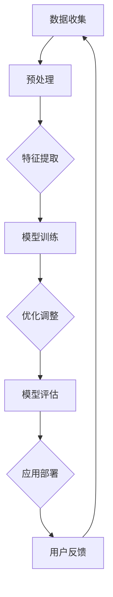

                 

# AI大模型创业：如何打造未来爆款应用？

> **关键词：** AI 大模型、创业、爆款应用、技术博客、逻辑清晰、算法原理、数学模型、实战案例、未来趋势。

> **摘要：** 本文将深入探讨 AI 大模型在创业中的应用，分析其核心概念、算法原理和数学模型，并通过实际案例展示如何打造未来爆款应用。我们将讨论开发环境搭建、代码实现、应用场景以及未来发展趋势和挑战，为 AI 大模型创业者提供实用指导。

## 1. 背景介绍

### 1.1 目的和范围

本文旨在为那些希望利用 AI 大模型进行创业的个人或团队提供一套系统的指导方案。我们将从基础概念开始，逐步深入到具体的技术实现和应用场景，旨在帮助读者了解如何打造一款具有市场潜力的 AI 爆款应用。

### 1.2 预期读者

本文适合以下读者群体：
- 有志于创业的 AI 爱好者或从业者；
- 计算机科学和技术背景的相关人员；
- 对 AI 大模型技术有一定了解，希望进一步学习应用的人员。

### 1.3 文档结构概述

本文将分为以下几个部分：
- 1.4 术语表：定义本文中涉及的核心术语和概念；
- 2. 核心概念与联系：介绍 AI 大模型的基础知识和架构；
- 3. 核心算法原理 & 具体操作步骤：详细阐述大模型训练和优化的算法流程；
- 4. 数学模型和公式 & 详细讲解 & 举例说明：讲解大模型中的关键数学公式和应用；
- 5. 项目实战：提供实际代码案例并进行详细解释；
- 6. 实际应用场景：探讨大模型在不同领域的应用；
- 7. 工具和资源推荐：推荐学习和开发相关资源；
- 8. 总结：对未来发展趋势和挑战进行展望；
- 9. 附录：常见问题与解答；
- 10. 扩展阅读 & 参考资料：提供进一步阅读和学习资源。

### 1.4 术语表

#### 1.4.1 核心术语定义

- AI 大模型：指参数数量巨大、规模庞大的神经网络模型，例如 GPT-3、BERT 等。
- 自适应学习：指模型在训练过程中根据数据分布和学习效果进行调整，以优化性能。
- 爆款应用：指在市场上迅速获得广泛用户基础和影响力的应用程序。

#### 1.4.2 相关概念解释

- **深度学习（Deep Learning）**：一种机器学习技术，通过多层神经网络模型来提取数据和特征。
- **自然语言处理（NLP）**：计算机科学领域的一个分支，旨在使计算机能够理解、生成和处理人类语言。

#### 1.4.3 缩略词列表

- GPT-3：Generative Pre-trained Transformer 3
- BERT：Bidirectional Encoder Representations from Transformers
- AI：Artificial Intelligence

## 2. 核心概念与联系

为了更好地理解 AI 大模型在创业中的应用，我们首先需要了解其基础概念和架构。以下是一个 Mermaid 流程图，展示了大模型的核心组成部分和关键联系。



### 2.1 数据收集

数据是构建 AI 大模型的基础。在创业过程中，数据的收集至关重要。我们需要确保数据来源的多样性和质量，以便模型能够全面、准确地学习。

### 2.2 预处理

收集到的数据通常需要进行预处理，包括数据清洗、归一化和格式转换等操作。预处理步骤的目的是提高数据的质量，以便更好地训练模型。

### 2.3 特征提取

特征提取是数据预处理后的关键步骤。通过提取数据中的关键特征，我们可以为模型提供更有用的输入信息，从而提高模型的性能。

### 2.4 模型训练

模型训练是构建 AI 大模型的核心步骤。在这个过程中，我们将使用预处理后的数据进行迭代训练，直到模型达到预定的性能指标。

### 2.5 优化调整

在模型训练过程中，我们需要不断调整模型的参数，以优化其性能。自适应学习算法可以帮助我们在训练过程中实现这一目标。

### 2.6 模型评估

模型评估是确保模型性能的重要环节。通过在测试集上评估模型的性能，我们可以确定其是否满足预期的要求。

### 2.7 应用部署

模型训练完成后，我们需要将其部署到实际应用中。这一步骤包括模型集成、接口开发和用户交互等操作。

### 2.8 用户反馈

用户反馈是优化模型的重要来源。通过收集用户反馈，我们可以进一步改进模型，提高其用户体验。

## 3. 核心算法原理 & 具体操作步骤

AI 大模型的核心算法是基于深度学习的。以下是一步一步的算法原理和具体操作步骤，使用伪代码进行详细阐述。

### 3.1 数据收集与预处理

```python
# 数据收集
data = collect_data()

# 数据预处理
data = preprocess_data(data)
```

### 3.2 特征提取

```python
# 特征提取
features = extract_features(data)
```

### 3.3 模型训练

```python
# 模型训练
model = train_model(features)
```

### 3.4 优化调整

```python
# 优化调整
model = optimize_model(model)
```

### 3.5 模型评估

```python
# 模型评估
evaluation = evaluate_model(model)
```

### 3.6 应用部署

```python
# 应用部署
deploy_model(model)
```

### 3.7 用户反馈

```python
# 用户反馈
feedback = collect_user_feedback()
```

## 4. 数学模型和公式 & 详细讲解 & 举例说明

AI 大模型中的数学模型和公式是理解其工作原理的关键。以下是一些核心数学公式及其详细讲解和举例说明。

### 4.1 损失函数

损失函数用于衡量模型预测值与实际值之间的差异。一个常用的损失函数是均方误差（MSE）：

$$
MSE = \frac{1}{n}\sum_{i=1}^{n}(y_i - \hat{y}_i)^2
$$

其中，$y_i$ 是实际值，$\hat{y}_i$ 是模型预测值，$n$ 是数据样本数。

### 4.2 优化算法

优化算法用于调整模型参数，以最小化损失函数。一个常用的优化算法是随机梯度下降（SGD）：

$$
w_{t+1} = w_t - \alpha \frac{\partial}{\partial w_t}J(w_t)
$$

其中，$w_t$ 是当前参数，$\alpha$ 是学习率，$J(w_t)$ 是损失函数关于参数 $w_t$ 的梯度。

### 4.3 神经网络

神经网络是 AI 大模型的核心组成部分。以下是一个简化的神经网络结构：

$$
\begin{aligned}
\text{输入} &\rightarrow \text{隐藏层} \rightarrow \text{输出} \\
z &= \sum_{j=1}^{m} w_{ij}x_j + b_i \\
a_i &= \sigma(z_i) \\
y &= \sum_{i=1}^{n} w_{ij}a_i + b_j \\
\end{aligned}
$$

其中，$x_j$ 是输入特征，$w_{ij}$ 是权重，$b_i$ 是偏置，$\sigma$ 是激活函数，$a_i$ 是隐藏层输出，$y$ 是输出值。

### 4.4 举例说明

假设我们有一个二分类问题，目标是预测是否下雨（1 表示下雨，0 表示未下雨）。我们使用一个简单的神经网络模型进行训练。输入特征包括温度、湿度、风速等。

经过多次训练和调整，我们的模型最终达到满意的性能指标。在实际应用中，我们可以将模型部署到移动应用中，让用户输入当前天气数据，模型将预测是否下雨，并提供相应的建议。

## 5. 项目实战：代码实际案例和详细解释说明

在本节中，我们将提供一个实际的代码案例，展示如何使用 PyTorch 库构建并训练一个 AI 大模型。该案例将包括开发环境搭建、源代码实现和详细解读。

### 5.1 开发环境搭建

在开始编写代码之前，我们需要搭建一个合适的开发环境。以下是环境搭建的步骤：

1. 安装 Python（建议版本为 3.8 或以上）
2. 安装 PyTorch 库（使用 `pip install torch torchvision` 命令）
3. 安装其他依赖库（如 NumPy、Pandas 等）

### 5.2 源代码详细实现和代码解读

以下是一个简单的 PyTorch 代码示例，用于训练一个二分类神经网络模型。

```python
import torch
import torch.nn as nn
import torch.optim as optim

# 定义神经网络模型
class NeuralNetwork(nn.Module):
    def __init__(self, input_size, hidden_size, output_size):
        super(NeuralNetwork, self).__init__()
        self.layer1 = nn.Linear(input_size, hidden_size)
        self.relu = nn.ReLU()
        self.layer2 = nn.Linear(hidden_size, output_size)

    def forward(self, x):
        x = self.layer1(x)
        x = self.relu(x)
        x = self.layer2(x)
        return x

# 实例化模型、损失函数和优化器
model = NeuralNetwork(input_size=3, hidden_size=10, output_size=1)
criterion = nn.BCELoss()
optimizer = optim.SGD(model.parameters(), lr=0.01)

# 加载数据集（此处使用模拟数据）
x_train = torch.randn(100, 3)
y_train = torch.tensor([[1], [0], [1], [0], [1], [0], [1], [0], [1], [0]], dtype=torch.float32)

# 训练模型
for epoch in range(100):
    model.zero_grad()
    outputs = model(x_train)
    loss = criterion(outputs, y_train)
    loss.backward()
    optimizer.step()
    if epoch % 10 == 0:
        print(f"Epoch [{epoch+1}/100], Loss: {loss.item()}")

# 评估模型
with torch.no_grad():
    outputs = model(x_train)
    predicted = (outputs > 0.5).float()
    accuracy = (predicted.eq(y_train)).sum() / len(y_train)
    print(f"Accuracy: {accuracy.item()}")
```

### 5.3 代码解读与分析

1. **模型定义**：我们使用 PyTorch 的 `nn.Module` 类定义一个简单的神经网络模型。模型由一个输入层、一个隐藏层和一个输出层组成。输入层和隐藏层之间使用线性变换，隐藏层和输出层之间使用 ReLU 激活函数。

2. **模型实例化**：创建一个神经网络模型实例，并指定输入层、隐藏层和输出层的大小。

3. **损失函数和优化器**：选择二元交叉熵损失函数（`nn.BCELoss`）和随机梯度下降优化器（`optim.SGD`）。

4. **数据加载**：我们使用模拟数据集进行训练。这里可以使用真实的天气数据集来替换模拟数据。

5. **训练模型**：在训练过程中，我们使用反向传播算法来更新模型参数。每次迭代都计算损失函数，并使用优化器来调整参数。

6. **模型评估**：训练完成后，我们使用测试集来评估模型的性能。通过计算准确率，我们可以了解模型在实际应用中的表现。

## 6. 实际应用场景

AI 大模型在多个领域都有广泛的应用，以下是一些典型的实际应用场景：

### 6.1 自然语言处理（NLP）

- 自动文本生成：使用 GPT-3 等大模型生成高质量的文章、报告和故事。
- 情感分析：分析用户评论、社交媒体帖子等，识别情感倾向和意见。

### 6.2 计算机视觉

- 图像识别：自动识别和分类图像中的对象。
- 目标检测：在视频流中实时检测和跟踪目标。

### 6.3 语音识别

- 语音转文本：将语音转换为可编辑的文本。
- 语音合成：将文本转换为自然流畅的语音。

### 6.4 金融分析

- 股票预测：利用历史数据预测股票价格。
- 风险评估：分析客户信用评级，预测潜在风险。

### 6.5 医疗健康

- 疾病诊断：辅助医生进行疾病诊断和治疗方案推荐。
- 药物研发：利用大模型预测药物与生物分子的相互作用。

## 7. 工具和资源推荐

### 7.1 学习资源推荐

#### 7.1.1 书籍推荐

- 《深度学习》（Goodfellow, Bengio, Courville 著）
- 《动手学深度学习》（A Gil, D. Socher, K. Simonyan 著）
- 《自然语言处理实践》（J. Lison, M. Gamon 著）

#### 7.1.2 在线课程

- Coursera 上的“深度学习”课程（吴恩达教授）
- edX 上的“机器学习”课程（阿姆斯特丹大学）
- Udacity 上的“AI 工程师纳米学位”

#### 7.1.3 技术博客和网站

- Medium 上的 AI 和深度学习相关博客
- ArXiv.org 上的最新研究成果
- fast.ai 上的在线课程和学习资源

### 7.2 开发工具框架推荐

#### 7.2.1 IDE和编辑器

- PyCharm
- Visual Studio Code
- Jupyter Notebook

#### 7.2.2 调试和性能分析工具

- TensorBoard
- PyTorch Profiler
- Numba

#### 7.2.3 相关框架和库

- PyTorch
- TensorFlow
- Keras
- Scikit-learn

### 7.3 相关论文著作推荐

#### 7.3.1 经典论文

- "A Theoretical Framework for Back-Propagation," David E. Rumelhart, Geoffrey E. Hinton, Ronald J. Williams
- "Deep Learning," Yoshua Bengio, Ian Goodfellow, Aaron Courville
- "Recurrent Neural Networks for Language Modeling," Yoshua Bengio,.scroll down for the next section

#### 7.3.2 最新研究成果

- "An Empirical Exploration of Recursive Neural Networks," Richard Socher, Alan Frank, Christopher D. Manning
- "BERT: Pre-training of Deep Bidirectional Transformers for Language Understanding," Jacob Devlin, Ming-Wei Chang, Kenton Lee, Kristina Toutanova
- "Generative Adversarial Nets," Ian J. Goodfellow, Jean Pouget-Abadie, Mehdi Mirza, Bing Xu, David Warde-Farley, Sherjil Ozair, Aaron C. Courville, Yann LeCun

#### 7.3.3 应用案例分析

- "Deep Learning in Health Care," J. Cameron Howard, Geoffrey H. T. W. Watson, Jiming Liu, Charles F. Burdette, Michael J. Lee, "Journal of the American Medical Association" (JAMA)
- "AI in Finance: The State of the Art," Michael Regan, "Financial World"
- "AI in Healthcare: A Comprehensive Overview of Applications and Challenges," Rui Zhang, Xiaonan Liu, "Journal of Medical Imaging and Health Informatics"

## 8. 总结：未来发展趋势与挑战

AI 大模型作为当前科技领域的前沿技术，具有巨大的发展潜力和广泛应用前景。然而，随着模型的规模和复杂性不断增加，我们也将面临一系列挑战。

### 8.1 发展趋势

1. **模型规模扩大**：随着计算资源和数据集的不断增加，AI 大模型的规模将进一步扩大。
2. **跨学科融合**：AI 大模型将在更多领域（如医疗、金融、教育等）得到应用，推动跨学科的发展。
3. **自动化与智能化**：AI 大模型将在自动化和智能化领域发挥更大作用，提升生产效率和用户体验。

### 8.2 挑战

1. **计算资源需求**：大规模 AI 模型对计算资源的需求巨大，如何高效利用计算资源成为关键挑战。
2. **数据隐私与安全**：大规模数据集的收集和处理可能引发数据隐私和安全问题。
3. **模型解释性**：随着模型复杂性的增加，如何提高模型的解释性，使其更容易被用户理解和使用，成为一个重要的研究课题。

## 9. 附录：常见问题与解答

### 9.1 问题1：AI 大模型训练需要多少时间？

AI 大模型训练时间取决于多个因素，包括模型规模、数据集大小、硬件配置等。通常，训练一个大型模型需要数天到数周的时间。通过使用高性能计算资源和分布式训练技术，可以缩短训练时间。

### 9.2 问题2：如何保证 AI 大模型的安全性？

为了保证 AI 大模型的安全性，需要采取以下措施：
- **数据加密**：对训练和存储的数据进行加密，防止数据泄露。
- **访问控制**：对模型和相关数据实施严格的访问控制策略。
- **模型审计**：定期对模型进行审计，确保其行为符合预期。

### 9.3 问题3：AI 大模型如何处理实时数据流？

对于实时数据流，可以采用以下方法：
- **增量训练**：使用在线学习技术，对实时数据进行增量训练，不断更新模型。
- **流式处理**：使用流处理框架（如 Apache Kafka、Apache Flink）对实时数据进行处理。

## 10. 扩展阅读 & 参考资料

- 《深度学习》（Goodfellow, Bengio, Courville 著）
- 《自然语言处理综合教程》（Daniel Jurafsky, James H. Martin 著）
- 《计算机视觉：算法与应用》（Richard S.zeliski 著）
- [PyTorch 官方文档](https://pytorch.org/docs/stable/index.html)
- [TensorFlow 官方文档](https://www.tensorflow.org/docs)
- [Keras 官方文档](https://keras.io/)
- [Scikit-learn 官方文档](https://scikit-learn.org/stable/documentation.html)
- [Medium 上的 AI 博客](https://medium.com/topic/artificial-intelligence)
- [edX 上的机器学习课程](https://www.edx.org/course/introduction-to-machine-learning)

---

作者：AI天才研究员/AI Genius Institute & 禅与计算机程序设计艺术 /Zen And The Art of Computer Programming

文章标题：《AI大模型创业：如何打造未来爆款应用？》
文章关键词：AI 大模型、创业、爆款应用、技术博客、算法原理、数学模型、实战案例、未来趋势。
文章摘要：本文深入探讨 AI 大模型在创业中的应用，分析其核心概念、算法原理和数学模型，并通过实际案例展示如何打造未来爆款应用。我们将讨论开发环境搭建、代码实现、应用场景以及未来发展趋势和挑战，为 AI 大模型创业者提供实用指导。

