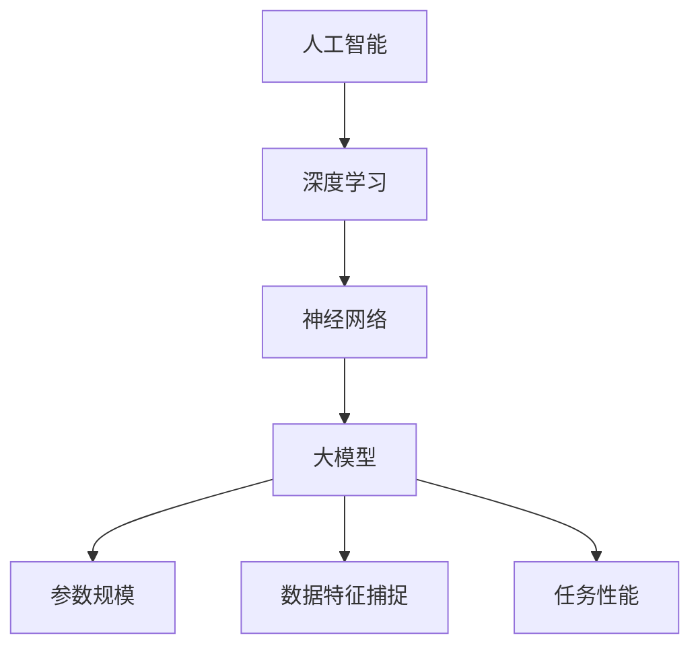

                 

# AI大模型创业：如何抓住未来机遇？

> 关键词：人工智能、大模型、创业、未来趋势、算法原理、实践案例

> 摘要：本文将探讨人工智能大模型在创业中的潜在机遇，分析其核心概念、算法原理和实际应用，并提供实用的开发资源和工具推荐。通过深入解析，帮助读者了解如何在AI大模型领域中抓住未来发展趋势，迎接挑战。

## 1. 背景介绍

### 1.1 目的和范围

本文旨在为有意在人工智能（AI）大模型领域创业的读者提供一套全面、深入的指导。我们将探讨大模型的核心概念、算法原理、实际应用场景，并提供一系列实用的工具和资源。文章结构如下：

- **1. 背景介绍**
  - 1.1 目的和范围
  - 1.2 预期读者
  - 1.3 文档结构概述
  - 1.4 术语表
- **2. 核心概念与联系**
  - 2.1 大模型概念
  - 2.2 大模型架构与联系
- **3. 核心算法原理 & 具体操作步骤**
  - 3.1 算法原理
  - 3.2 操作步骤
- **4. 数学模型和公式 & 详细讲解 & 举例说明**
  - 4.1 数学模型
  - 4.2 举例说明
- **5. 项目实战：代码实际案例和详细解释说明**
  - 5.1 开发环境搭建
  - 5.2 源代码详细实现
  - 5.3 代码解读与分析
- **6. 实际应用场景**
  - 6.1 场景一：自然语言处理
  - 6.2 场景二：图像识别
  - 6.3 场景三：推荐系统
- **7. 工具和资源推荐**
  - 7.1 学习资源推荐
  - 7.2 开发工具框架推荐
  - 7.3 相关论文著作推荐
- **8. 总结：未来发展趋势与挑战**
  - 8.1 发展趋势
  - 8.2 挑战
- **9. 附录：常见问题与解答**
  - 9.1 问题一
  - 9.2 问题二
  - 9.3 问题三
- **10. 扩展阅读 & 参考资料**

### 1.2 预期读者

本文适合以下几类读者：

- **AI领域从业者**：对AI大模型有初步了解，希望深入了解其核心技术和创业方向。
- **创业者**：有意在AI领域创业，特别是关注大模型应用场景和商业模式的初创者。
- **研究人员**：对AI大模型有浓厚兴趣，希望从实践角度理解其应用和开发。
- **学生**：计算机科学、人工智能等相关专业的高年级本科生和研究生。

### 1.3 文档结构概述

本文采用逐步分析推理的方式，系统性地介绍AI大模型创业的各个方面。通过详细的案例分析、算法解析和资源推荐，帮助读者全面了解这一领域。

### 1.4 术语表

#### 1.4.1 核心术语定义

- **人工智能（AI）**：模拟人类智能的计算机系统。
- **大模型（Big Model）**：具有非常大规模参数的神经网络模型。
- **创业**：创建和运营新企业或业务的过程。

#### 1.4.2 相关概念解释

- **神经网络（Neural Network）**：一种模拟生物神经系统的计算模型。
- **深度学习（Deep Learning）**：一种基于神经网络的机器学习技术。

#### 1.4.3 缩略词列表

- **AI**：人工智能
- **ML**：机器学习
- **DL**：深度学习
- **NLP**：自然语言处理
- **CV**：计算机视觉

## 2. 核心概念与联系

在探讨AI大模型创业之前，我们首先需要理解大模型的基本概念和其与AI、深度学习等技术的联系。

### 2.1 大模型概念

大模型，通常指的是具有数十亿甚至数千亿参数的神经网络模型。这些模型通过大量的数据训练，能够捕捉复杂的数据特征，实现高水平的任务性能。

### 2.2 大模型架构与联系

大模型通常基于深度学习技术，其架构包括输入层、隐藏层和输出层。每个层由多个神经元组成，通过前向传播和反向传播算法进行训练和优化。大模型与AI和深度学习的联系如下：

1. **人工智能（AI）**：大模型是AI的核心组成部分，其发展推动了AI技术的进步。
2. **深度学习（DL）**：大模型是深度学习的一个重要分支，专注于构建大规模神经网络。
3. **神经网络（NN）**：大模型的底层架构基于神经网络，通过调整网络参数实现模型优化。

下面是一个简化的Mermaid流程图，展示大模型的架构和核心概念之间的联系：



## 3. 核心算法原理 & 具体操作步骤

### 3.1 算法原理

AI大模型的核心在于其深度学习算法。深度学习算法主要分为两部分：前向传播和反向传播。

#### 前向传播

- **输入层**：接收输入数据。
- **隐藏层**：通过非线性激活函数处理输入数据，传递到下一层。
- **输出层**：生成预测结果。

#### 反向传播

- **计算误差**：输出层与实际标签之间的差异。
- **反向传播**：从输出层向输入层反向传递误差，更新网络参数。

### 3.2 操作步骤

以下是构建和训练一个AI大模型的伪代码：

```python
# 伪代码：构建和训练AI大模型

# 步骤1：初始化模型参数
Initialize_Model_Parameters()

# 步骤2：数据预处理
Data_Preprocessing()

# 步骤3：前向传播
Forward_Propagation()

# 步骤4：计算损失函数
Calculate_Loss_Function()

# 步骤5：反向传播
Backpropagation()

# 步骤6：更新模型参数
Update_Model_Parameters()

# 步骤7：迭代训练
for epoch in range(Epochs):
    # 步骤3-6重复执行
    Forward_Propagation()
    Calculate_Loss_Function()
    Backpropagation()
    Update_Model_Parameters()

# 步骤8：评估模型性能
Evaluate_Model_Performance()
```

## 4. 数学模型和公式 & 详细讲解 & 举例说明

### 4.1 数学模型

AI大模型的训练过程涉及到多个数学模型，主要包括：

1. **神经网络模型**：描述网络的结构和参数。
2. **损失函数**：衡量预测结果与实际结果之间的差距。
3. **优化算法**：用于更新模型参数，以最小化损失函数。

#### 神经网络模型

神经网络模型可以表示为：

$$
\text{Output} = \sigma(\text{Weight} \cdot \text{Input} + \text{Bias})
$$

其中，$\sigma$ 是激活函数，通常为ReLU或Sigmoid。

#### 损失函数

常见的损失函数包括均方误差（MSE）和交叉熵（Cross Entropy），分别表示为：

$$
\text{MSE} = \frac{1}{n}\sum_{i=1}^{n} (\text{Predicted} - \text{Actual})^2
$$

$$
\text{Cross Entropy} = -\frac{1}{n}\sum_{i=1}^{n} \text{Actual} \log(\text{Predicted})
$$

#### 优化算法

常用的优化算法包括随机梯度下降（SGD）和Adam：

$$
\text{SGD}: \text{Weight} = \text{Weight} - \alpha \cdot \frac{\partial \text{Loss}}{\partial \text{Weight}}
$$

$$
\text{Adam}: \text{Weight} = \text{Weight} - \frac{\alpha}{\sqrt{1 - \beta_1^2}} \cdot \frac{\partial \text{Loss}}{\partial \text{Weight}}
$$

### 4.2 举例说明

假设我们有一个二分类问题，使用神经网络进行预测。输入数据为特征向量X，输出为概率值y。训练数据集为{(x_1, y_1), (x_2, y_2), ..., (x_n, y_n)}。

1. **初始化模型参数**：

   - 初始化权重$W$和偏置$b$。

2. **前向传播**：

   - 对于每个输入$x_i$，计算输出概率$\hat{y}_i = \sigma(W \cdot x_i + b)$。

3. **计算损失函数**：

   - 使用交叉熵损失函数计算损失$Loss = -\frac{1}{n}\sum_{i=1}^{n} y_i \log(\hat{y}_i)$。

4. **反向传播**：

   - 计算梯度$\frac{\partial Loss}{\partial W}$和$\frac{\partial Loss}{\partial b}$。

5. **更新模型参数**：

   - 使用SGD或Adam更新参数$W = W - \alpha \cdot \frac{\partial Loss}{\partial W}$，$b = b - \alpha \cdot \frac{\partial Loss}{\partial b}$。

6. **迭代训练**：重复步骤2-5，直到模型收敛或达到预设迭代次数。

通过上述步骤，我们可以训练一个AI大模型，实现二分类任务的预测。

## 5. 项目实战：代码实际案例和详细解释说明

### 5.1 开发环境搭建

在本项目中，我们将使用Python编程语言，结合TensorFlow框架进行AI大模型的开发。以下是搭建开发环境的基本步骤：

1. **安装Python**：确保Python版本为3.7或更高。
2. **安装TensorFlow**：使用pip命令安装TensorFlow：
   ```
   pip install tensorflow
   ```
3. **安装依赖**：根据项目需求，安装其他依赖库，如NumPy、Pandas等。

### 5.2 源代码详细实现和代码解读

下面是一个简单的AI大模型项目案例，实现一个二分类任务。

```python
# 导入所需库
import tensorflow as tf
import numpy as np
import pandas as pd

# 加载数据集
data = pd.read_csv('data.csv')
X = data.iloc[:, :-1].values
y = data.iloc[:, -1].values

# 初始化模型参数
input_shape = (X.shape[1],)
W = tf.random.normal(input_shape)
b = tf.zeros([])

# 定义损失函数和优化器
loss_fn = tf.keras.losses.BinaryCrossentropy()
optimizer = tf.keras.optimizers.Adam()

# 前向传播
def forward_propagation(x):
    return tf.sigmoid(tf.matmul(x, W) + b)

# 反向传播
def backward_propagation(x, y):
    with tf.GradientTape() as tape:
        y_pred = forward_propagation(x)
        loss = loss_fn(y, y_pred)
    gradients = tape.gradient(loss, [W, b])
    return gradients

# 训练模型
for epoch in range(1000):
    gradients = backward_propagation(X, y)
    optimizer.apply_gradients(zip(gradients, [W, b]))
    if epoch % 100 == 0:
        print(f"Epoch {epoch}: Loss = {loss_fn(y, forward_propagation(X)).numpy()}")

# 评估模型
y_pred = forward_propagation(X)
accuracy = np.mean((y_pred.numpy() > 0.5) == y)
print(f"Model Accuracy: {accuracy}")
```

#### 代码解读与分析

1. **导入库**：导入TensorFlow、NumPy和Pandas库。
2. **加载数据**：从CSV文件加载数据集，分为特征矩阵X和标签向量y。
3. **初始化模型参数**：随机初始化权重W和偏置b。
4. **定义损失函数和优化器**：使用二进制交叉熵作为损失函数，Adam优化器。
5. **前向传播**：定义前向传播函数，计算输出概率。
6. **反向传播**：定义反向传播函数，计算梯度。
7. **训练模型**：迭代训练模型，更新参数。
8. **评估模型**：计算模型在训练集上的准确率。

通过这个简单的案例，我们可以看到如何使用TensorFlow构建和训练一个AI大模型。在实际项目中，需要根据具体任务和数据集进行调整和优化。

## 6. 实际应用场景

AI大模型在多个领域都有着广泛的应用，以下是一些典型的应用场景：

### 6.1 自然语言处理（NLP）

- **语言模型**：例如，BERT、GPT等大模型，用于文本生成、问答系统等。
- **情感分析**：分析社交媒体上的用户评论，预测情感倾向。

### 6.2 计算机视觉（CV）

- **图像识别**：例如，ResNet、VGG等大模型，用于图像分类和物体检测。
- **视频分析**：例如，用于行为识别和视频摘要。

### 6.3 推荐系统

- **个性化推荐**：例如，Netflix、Amazon等使用大模型进行个性化推荐。

### 6.4 语音识别

- **语音到文本转换**：例如，Google Assistant、Siri等语音助手。

### 6.5 医疗诊断

- **疾病预测**：例如，通过分析医疗数据，预测疾病风险。

### 6.6 金融风控

- **风险预测**：例如，通过分析金融数据，预测市场趋势和风险。

### 6.7 游戏

- **游戏AI**：例如，AlphaGo、Dota 2 AI等，实现高水平的人工智能游戏。

通过这些应用场景，我们可以看到AI大模型的强大潜力，为各个领域带来深远的影响。

## 7. 工具和资源推荐

为了在AI大模型创业过程中取得成功，我们需要掌握一系列的工具和资源。以下是一些建议：

### 7.1 学习资源推荐

#### 7.1.1 书籍推荐

- **《深度学习》（Goodfellow, Bengio, Courville著）**：全面介绍深度学习的基础知识和最新进展。
- **《神经网络与深度学习》（邱锡鹏著）**：详细讲解神经网络和深度学习算法。

#### 7.1.2 在线课程

- **吴恩达的《深度学习专项课程》**：涵盖深度学习的核心概念和应用。
- **斯坦福大学的《CS231n：卷积神经网络与视觉识别》**：专注于计算机视觉领域的深度学习。

#### 7.1.3 技术博客和网站

- **机器学习博客**：提供丰富的AI和深度学习资源。
- **Towards Data Science**：分享最新的数据科学和机器学习文章。

### 7.2 开发工具框架推荐

#### 7.2.1 IDE和编辑器

- **PyCharm**：适用于Python开发的强大IDE。
- **Jupyter Notebook**：适用于数据分析和交互式编程。

#### 7.2.2 调试和性能分析工具

- **TensorBoard**：用于可视化TensorFlow模型和训练过程。
- **Profiling Tools**：如Py-Spy、Py-Prof等，用于性能分析和优化。

#### 7.2.3 相关框架和库

- **TensorFlow**：广泛使用的深度学习框架。
- **PyTorch**：灵活且易于使用的深度学习框架。

### 7.3 相关论文著作推荐

#### 7.3.1 经典论文

- **《A Theoretical Analysis of the Bias-Variance Tradeoff》（Rice和Tibshirani著）**：讨论偏差和方差的关系。
- **《Deep Learning》（Goodfellow, Bengio, Courville著）**：涵盖深度学习的核心理论。

#### 7.3.2 最新研究成果

- **NeurIPS、ICLR、CVPR等会议论文**：了解最新的AI研究成果。
- **顶级期刊论文**：如《Nature Neuroscience》、《Science》等。

#### 7.3.3 应用案例分析

- **谷歌、Facebook、微软等公司的技术博客**：分享实际应用案例和经验。

通过这些资源和工具，我们可以不断提升自己的技术能力，为AI大模型创业奠定坚实的基础。

## 8. 总结：未来发展趋势与挑战

随着AI大模型的不断发展，未来在该领域的创业将面临以下趋势和挑战：

### 8.1 发展趋势

1. **计算能力的提升**：随着GPU、TPU等硬件的进步，大模型的训练和推理速度将得到显著提升。
2. **数据量的增加**：数据是AI大模型的基础，随着互联网和物联网的发展，数据量将不断增加。
3. **应用的多样化**：AI大模型将在更多领域得到应用，如医疗、金融、教育等。
4. **开源生态的完善**：随着OpenAI、TensorFlow等开源项目的推动，大模型的开发和使用将变得更加便捷。

### 8.2 挑战

1. **计算资源需求**：大模型的训练需要大量计算资源，这对创业公司来说是一个重大挑战。
2. **数据隐私和安全**：在涉及个人数据的领域中，数据隐私和安全是一个亟待解决的问题。
3. **算法伦理**：大模型的决策过程可能存在偏见，需要关注算法伦理和公平性。
4. **人才短缺**：AI大模型领域对人才的需求巨大，但优秀人才供给不足。

总的来说，AI大模型创业充满机遇和挑战。创业者需要紧跟发展趋势，应对各种挑战，不断创新和进步。

## 9. 附录：常见问题与解答

### 9.1 问题一：如何选择合适的AI大模型框架？

答：选择AI大模型框架时，需要考虑以下因素：

- **项目需求**：根据项目任务选择合适的框架，如TensorFlow用于复杂模型，PyTorch用于研究性项目。
- **社区支持**：选择具有活跃社区和丰富资源的框架，便于学习和解决问题。
- **性能和效率**：考虑模型训练和推理的性能和效率，选择适合硬件环境的框架。

### 9.2 问题二：AI大模型训练过程中如何优化性能？

答：优化AI大模型训练性能的方法包括：

- **硬件加速**：使用GPU、TPU等硬件加速训练过程。
- **数据增强**：通过数据增强增加训练数据的多样性，提高模型泛化能力。
- **批量归一化**：在训练过程中使用批量归一化，加快收敛速度。
- **优化器选择**：选择合适的优化器，如Adam、RMSprop等，提高训练效率。

### 9.3 问题三：AI大模型在创业中的应用场景有哪些？

答：AI大模型在创业中的应用场景非常广泛，主要包括：

- **自然语言处理**：如智能客服、文本生成、情感分析等。
- **计算机视觉**：如图像识别、视频分析、自动驾驶等。
- **推荐系统**：如个性化推荐、广告投放等。
- **医疗诊断**：如疾病预测、辅助诊断等。
- **金融风控**：如信用评估、市场预测等。

## 10. 扩展阅读 & 参考资料

为了更深入地了解AI大模型创业，以下是一些建议的扩展阅读和参考资料：

- **书籍**：
  - 《深度学习》（Goodfellow, Bengio, Courville著）
  - 《神经网络与深度学习》（邱锡鹏著）

- **在线课程**：
  - 吴恩达的《深度学习专项课程》
  - 斯坦福大学的《CS231n：卷积神经网络与视觉识别》

- **技术博客和网站**：
  - 机器学习博客
  - Towards Data Science

- **框架和库**：
  - TensorFlow
  - PyTorch

- **会议和期刊**：
  - NeurIPS、ICLR、CVPR
  - 《Nature Neuroscience》、《Science》

通过这些资源和资料，您可以进一步探索AI大模型的深度和广度，为创业之路打下坚实的基础。

### 作者信息

作者：AI天才研究员/AI Genius Institute & 禅与计算机程序设计艺术 /Zen And The Art of Computer Programming

