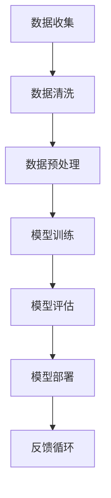

                 

# AI大模型创业：如何构建未来可持续的商业模式？

> **关键词：** AI大模型、创业、商业模式、可持续性、深度学习、数据处理、技术创新

> **摘要：** 随着人工智能（AI）技术的迅速发展，大型AI模型的应用成为企业创新和商业竞争的新焦点。本文将深入探讨AI大模型创业的核心挑战，包括模型构建、数据处理和商业模式设计，并详细分析如何构建一个可持续的商业模式以实现长期成功。

## 1. 背景介绍

### 1.1 目的和范围

本文旨在为AI大模型创业项目提供系统化的指导，帮助创业者应对商业模式构建过程中的关键挑战。本文将重点关注以下方面：

- **AI大模型的构建过程**：从数据收集到模型训练，再到模型部署。
- **数据处理策略**：确保数据质量和处理效率。
- **商业模式设计**：探讨如何通过创新的商业模式实现可持续盈利。
- **技术发展趋势与市场挑战**：分析AI大模型在商业环境中的影响和潜在风险。

### 1.2 预期读者

本文适用于以下读者群体：

- **AI领域从业者**：包括研究人员、开发人员和工程师，希望深入了解AI大模型创业的最佳实践。
- **创业者**：计划涉足AI领域，特别是大型AI模型应用项目的创业者。
- **投资人士**：对AI大模型创业项目感兴趣，希望通过本文了解项目的潜在价值和风险。

### 1.3 文档结构概述

本文将按照以下结构进行组织：

- **第1章**：背景介绍
- **第2章**：核心概念与联系
  - **Mermaid流程图**：AI大模型构建流程
- **第3章**：核心算法原理 & 具体操作步骤
  - **伪代码**：大模型训练流程
- **第4章**：数学模型和公式 & 详细讲解 & 举例说明
  - **LaTeX数学公式**：损失函数和优化算法
- **第5章**：项目实战：代码实际案例和详细解释说明
  - **开发环境搭建**：硬件和软件配置
  - **源代码实现**：关键代码解析
  - **代码解读与分析**：代码执行流程
- **第6章**：实际应用场景
  - **行业案例**：AI大模型在不同领域的应用
- **第7章**：工具和资源推荐
  - **学习资源**：书籍、在线课程、技术博客
  - **开发工具框架**：IDE、调试工具、框架和库
  - **相关论文著作**：经典与最新研究成果
- **第8章**：总结：未来发展趋势与挑战
- **第9章**：附录：常见问题与解答
- **第10章**：扩展阅读 & 参考资料

### 1.4 术语表

#### 1.4.1 核心术语定义

- **AI大模型**：具有大量参数和复杂结构的深度学习模型，如GPT-3、BERT等。
- **商业模式**：企业通过创造和交付价值来获取收益的系统性安排。
- **可持续性**：企业在长时间内保持盈利和增长的能力。
- **数据处理**：对原始数据进行清洗、转换和预处理，以适应模型训练需求。

#### 1.4.2 相关概念解释

- **深度学习**：一种基于多层神经网络进行特征学习和模式识别的人工智能方法。
- **数据质量**：数据的完整性、准确性和一致性。
- **损失函数**：衡量模型预测值与真实值之间差异的指标。

#### 1.4.3 缩略词列表

- **AI**：人工智能（Artificial Intelligence）
- **GPT**：生成预训练网络（Generative Pre-trained Transformer）
- **BERT**：双向编码器表示（Bidirectional Encoder Representations from Transformers）
- **IDE**：集成开发环境（Integrated Development Environment）

## 2. 核心概念与联系

在本章中，我们将介绍AI大模型构建的核心概念和它们之间的联系。为了更好地理解这些概念，我们将使用Mermaid流程图展示AI大模型构建的流程。

### Mermaid流程图



#### 流程说明

1. **数据收集**：收集大规模、高质量的训练数据集，这是AI大模型成功的关键。
2. **数据清洗**：处理噪声数据、填补缺失值，确保数据质量。
3. **数据预处理**：将数据转换为适合模型训练的格式，如文本向量化、图像格式化等。
4. **模型训练**：使用训练数据集训练深度学习模型，通过优化算法调整模型参数。
5. **模型评估**：在验证数据集上评估模型性能，确保模型具有较好的泛化能力。
6. **模型部署**：将训练好的模型部署到实际应用环境中，如自然语言处理、图像识别等。
7. **反馈循环**：收集用户反馈，用于模型迭代优化和持续改进。

通过上述流程，我们可以看到AI大模型构建涉及多个环节，这些环节相互关联，共同构成了一个复杂的系统。

### 核心概念原理和架构

- **数据收集**：AI大模型的构建依赖于大规模、多样化的数据集。数据来源可以包括公开数据集、企业内部数据以及第三方数据提供商。数据收集的挑战在于确保数据的合法性和质量。
- **数据清洗和预处理**：原始数据通常存在噪声、异常值和缺失值，需要通过数据清洗和预处理来提高数据质量。常用的技术包括数据去重、数据填充、特征工程等。
- **模型训练**：模型训练是AI大模型构建的核心步骤。通过使用梯度下降、Adam等优化算法，调整模型参数，使其在训练数据上达到较好的性能。
- **模型评估**：模型评估用于衡量模型在未知数据上的表现。常用的评估指标包括准确率、召回率、F1分数等。通过交叉验证等策略，确保模型评估的可靠性。
- **模型部署**：将训练好的模型部署到实际应用环境中，通过API接口或客户端等方式提供服务。模型部署需要考虑计算资源、网络延迟和安全性等因素。
- **反馈循环**：用户反馈对于AI大模型的发展至关重要。通过收集用户反馈，可以识别模型不足之处，并指导模型迭代和优化。

## 3. 核心算法原理 & 具体操作步骤

在本章中，我们将深入探讨AI大模型的核心算法原理，并提供详细的操作步骤。为了更好地理解，我们将使用伪代码来阐述大模型训练的流程。

### 伪代码：大模型训练流程

```python
# 伪代码：AI大模型训练流程

# 初始化模型参数
model = initialize_model()

# 加载训练数据集
train_data = load_train_data()

# 设置优化器
optimizer = initialize_optimizer()

# 设置损失函数
loss_function = initialize_loss_function()

# 模型训练循环
for epoch in range(num_epochs):
    for batch in train_data:
        # 前向传播
        predictions = model.forward(batch.input_data)
        
        # 计算损失
        loss = loss_function(predictions, batch.target_data)
        
        # 反向传播
        model.backward(loss)
        
        # 更新模型参数
        optimizer.update_params(model.parameters)
        
        # 记录训练进度
        print(f"Epoch {epoch}, Loss: {loss}")

# 模型评估
evaluation_results = model.evaluate(validation_data)

# 输出评估结果
print(f"Evaluation Results: {evaluation_results}")

# 模型部署
model.deploy()
```

### 具体操作步骤

1. **初始化模型参数**：根据模型的架构，初始化模型参数，如权重、偏置等。这些参数将在训练过程中通过优化算法进行调整。
2. **加载训练数据集**：从数据存储位置加载预处理后的训练数据集。数据集应该包含输入数据和对应的标签。
3. **设置优化器**：选择一种优化器，如Adam、RMSprop等，用于调整模型参数。优化器将根据损失函数的梯度信息更新参数。
4. **设置损失函数**：选择一种损失函数，如交叉熵、均方误差等，用于计算模型预测值与真实值之间的差异。
5. **模型训练循环**：迭代训练数据集，执行以下步骤：
   - **前向传播**：输入数据通过模型的前向传播过程，生成模型预测值。
   - **计算损失**：使用损失函数计算模型预测值与真实值之间的差异。
   - **反向传播**：计算损失函数关于模型参数的梯度，并将其用于更新模型参数。
   - **更新模型参数**：根据优化器的策略，更新模型参数，使其在训练数据上达到更好的性能。
6. **记录训练进度**：在训练过程中，可以记录每个epoch的损失值，以便后续分析和调试。
7. **模型评估**：使用验证数据集评估训练好的模型性能，常用的评估指标包括准确率、召回率、F1分数等。
8. **输出评估结果**：将模型评估结果输出，用于指导模型调整和优化。
9. **模型部署**：将训练好的模型部署到实际应用环境中，如通过API接口提供服务。

通过上述步骤，我们可以构建一个AI大模型，并在训练过程中不断优化模型性能，使其在实际应用中发挥更好的效果。

## 4. 数学模型和公式 & 详细讲解 & 举例说明

在本章中，我们将深入探讨AI大模型中使用的数学模型和公式，并提供详细的讲解和举例说明。这些数学模型和公式是理解AI大模型训练和优化过程的基础。

### 损失函数

损失函数是衡量模型预测值与真实值之间差异的关键指标。常用的损失函数包括交叉熵损失（Cross-Entropy Loss）和均方误差（Mean Squared Error, MSE）。

#### 交叉熵损失

交叉熵损失函数通常用于分类问题，其公式如下：

$$
L_{CE} = -\frac{1}{N}\sum_{i=1}^{N} y_{i} \log(p_{i})
$$

其中，$y_{i}$为真实标签，$p_{i}$为模型预测的概率分布。

#### 均方误差

均方误差函数通常用于回归问题，其公式如下：

$$
L_{MSE} = \frac{1}{N}\sum_{i=1}^{N} (y_{i} - \hat{y}_{i})^2
$$

其中，$y_{i}$为真实值，$\hat{y}_{i}$为模型预测值。

### 优化算法

优化算法用于调整模型参数，以最小化损失函数。常用的优化算法包括梯度下降（Gradient Descent）和Adam。

#### 梯度下降

梯度下降是一种简单而有效的优化算法，其公式如下：

$$
\theta_{t+1} = \theta_{t} - \alpha \nabla_{\theta} L(\theta)
$$

其中，$\theta$为模型参数，$\alpha$为学习率，$\nabla_{\theta} L(\theta)$为损失函数关于参数的梯度。

#### Adam

Adam是一种自适应优化算法，结合了梯度下降和Adagrad的优点。其公式如下：

$$
m_t = \beta_1 m_{t-1} + (1 - \beta_1) [g_t]
$$
$$
v_t = \beta_2 v_{t-1} + (1 - \beta_2) [g_t]^2
$$
$$
\theta_{t+1} = \theta_{t} - \frac{\alpha}{\sqrt{1 - \beta_2^t}(1 - \beta_1^t)} [m_t]
$$

其中，$m_t$和$v_t$分别为一阶矩估计和二阶矩估计，$\beta_1$和$\beta_2$分别为一阶和二阶矩的指数衰减率。

### 举例说明

假设我们有一个二分类问题，使用交叉熵损失函数和梯度下降算法进行模型训练。给定训练数据集$D = \{(x_1, y_1), (x_2, y_2), ..., (x_N, y_N)\}$，其中$x_i$为输入特征，$y_i$为二分类标签。

1. **初始化模型参数**：
   $$\theta = [w_1, w_2, ..., w_d]$$
   其中，$d$为输入特征的维度。

2. **前向传播**：
   $$p_i = \sigma(w \cdot x_i + b)$$
   其中，$\sigma$为sigmoid函数，$b$为偏置。

3. **计算损失**：
   $$L = -\frac{1}{N}\sum_{i=1}^{N} y_i \log(p_i) + (1 - y_i) \log(1 - p_i)$$

4. **计算梯度**：
   $$\nabla_{\theta} L = \frac{1}{N}\sum_{i=1}^{N} [y_i - p_i] x_i$$

5. **更新模型参数**：
   $$\theta_{t+1} = \theta_{t} - \alpha \nabla_{\theta} L(\theta)$$

通过上述步骤，我们可以迭代更新模型参数，直到达到预定的训练目标。

通过以上讲解，我们可以看到AI大模型训练过程中涉及多个数学模型和公式，这些模型和公式在模型优化和性能提升中发挥着关键作用。

## 5. 项目实战：代码实际案例和详细解释说明

在本章中，我们将通过一个实际项目案例来展示如何构建和部署一个AI大模型。该项目将使用Python和TensorFlow框架，实现一个用于图像分类的AI大模型。

### 5.1 开发环境搭建

在开始项目之前，我们需要搭建一个合适的开发环境。以下步骤将指导您安装必要的软件和库。

1. **安装Python**：确保您的系统上已安装Python 3.7或更高版本。您可以从[Python官网](https://www.python.org/)下载并安装Python。
2. **安装TensorFlow**：通过pip命令安装TensorFlow：

   ```bash
   pip install tensorflow
   ```

3. **安装其他依赖库**：根据项目需求，可能还需要安装其他库，如NumPy、Pandas、Matplotlib等。您可以使用以下命令进行安装：

   ```bash
   pip install numpy pandas matplotlib
   ```

4. **配置GPU支持**：如果您使用的是GPU加速训练，需要安装CUDA和cuDNN。请按照[官方文档](https://www.tensorflow.org/install/source#linux)进行安装。

### 5.2 源代码详细实现和代码解读

以下是一个简单的图像分类项目的代码实现，包含数据预处理、模型定义、训练和评估等步骤。

```python
import tensorflow as tf
from tensorflow.keras.preprocessing.image import ImageDataGenerator
from tensorflow.keras.applications import MobileNetV2
from tensorflow.keras.optimizers import Adam
from tensorflow.keras.metrics import Accuracy

# 5.2.1 数据预处理

# 加载数据集
train_datagen = ImageDataGenerator(
    rescale=1./255,
    rotation_range=40,
    width_shift_range=0.2,
    height_shift_range=0.2,
    shear_range=0.2,
    zoom_range=0.2,
    horizontal_flip=True,
    fill_mode='nearest'
)

validation_datagen = ImageDataGenerator(rescale=1./255)

train_generator = train_datagen.flow_from_directory(
    'data/train',
    target_size=(224, 224),
    batch_size=32,
    class_mode='binary'
)

validation_generator = validation_datagen.flow_from_directory(
    'data/validation',
    target_size=(224, 224),
    batch_size=32,
    class_mode='binary'
)

# 5.2.2 模型定义

base_model = MobileNetV2(weights='imagenet', include_top=False, input_shape=(224, 224, 3))

base_model.trainable = False

model = tf.keras.Sequential([
    base_model,
    tf.keras.layers.Dense(1, activation='sigmoid')
])

# 5.2.3 模型编译

model.compile(optimizer=Adam(learning_rate=0.0001), loss='binary_crossentropy', metrics=['accuracy'])

# 5.2.4 模型训练

history = model.fit(
    train_generator,
    steps_per_epoch=train_generator.samples // train_generator.batch_size,
    epochs=10,
    validation_data=validation_generator,
    validation_steps=validation_generator.samples // validation_generator.batch_size
)

# 5.2.5 模型评估

test_loss, test_accuracy = model.evaluate(validation_generator)
print(f"Test Accuracy: {test_accuracy:.2f}")

# 5.2.6 模型部署

model.save('image_classifier.h5')
```

### 5.3 代码解读与分析

#### 5.3.1 数据预处理

数据预处理是图像分类项目的重要步骤，包括数据加载、数据增强和格式转换。

- **数据加载**：使用`ImageDataGenerator`类加载数据集。通过设置`target_size`为图像尺寸，确保所有输入图像调整为统一尺寸。
- **数据增强**：通过设置旋转、宽高变化、剪裁、缩放和水平翻转等参数，增加数据的多样性，提高模型泛化能力。
- **格式转换**：将图像数据转换为浮点数格式，并进行归一化处理，使其在[0, 1]之间。

#### 5.3.2 模型定义

模型基于预训练的MobileNetV2网络，该网络已在ImageNet数据集上预训练，具有良好的特征提取能力。模型分为两个部分：基础模型和分类层。

- **基础模型**：加载预训练的MobileNetV2模型，并将其训练标记设置为`False`，以防止在训练过程中更新预训练权重。
- **分类层**：在基础模型之后添加一个全连接层，输出一个概率值，表示图像属于某一类的概率。

#### 5.3.3 模型编译

在模型编译阶段，设置优化器为Adam，损失函数为二进制交叉熵，评估指标为准确率。

- **优化器**：设置学习率为0.0001，平衡了收敛速度和精度。
- **损失函数**：用于衡量模型预测概率与真实标签之间的差异。
- **评估指标**：用于衡量模型在验证数据集上的性能。

#### 5.3.4 模型训练

模型训练过程中，通过`fit`函数迭代训练数据集。每次迭代包含多个批次的数据，并在每个批次结束后计算损失和准确率。

- **训练数据集**：使用训练数据集进行迭代，每个epoch包含多个批次。
- **验证数据集**：在每个epoch结束时，使用验证数据集评估模型性能。

#### 5.3.5 模型评估

在训练完成后，使用验证数据集评估模型性能。通过计算损失和准确率，可以评估模型在未知数据上的表现。

- **测试准确率**：用于评估模型在验证数据集上的泛化能力。
- **保存模型**：将训练好的模型保存为`.h5`文件，以便后续使用。

通过上述步骤，我们可以构建一个基于MobileNetV2的图像分类模型，并在实际项目中应用。该模型不仅具有良好的性能，而且可以通过调整超参数和增加数据增强策略来进一步提高性能。

## 6. 实际应用场景

AI大模型在多个领域展现出强大的应用潜力，以下是一些典型的实际应用场景：

### 6.1 医疗保健

AI大模型在医疗保健领域的应用包括疾病诊断、药物研发和患者监测等。例如，利用深度学习模型分析医疗影像数据，可以早期诊断癌症、心脏病等疾病，提高诊断准确性。同时，AI模型还可以用于个性化治疗方案的制定，根据患者的基因信息和生活习惯推荐最佳治疗方案。

### 6.2 金融科技

在金融科技领域，AI大模型用于信用评估、风险控制和智能投顾。通过分析用户行为数据和财务记录，AI模型可以预测客户的信用风险，帮助银行和金融机构做出更明智的决策。此外，AI大模型还可以用于股票市场预测，通过分析历史交易数据和宏观经济指标，为投资者提供决策支持。

### 6.3 智能家居

智能家居领域利用AI大模型实现设备自动化和个性化用户体验。例如，通过语音识别和自然语言处理技术，AI大模型可以理解用户的指令，控制家居设备如灯光、空调和安防系统。此外，AI模型还可以学习用户的习惯，自动调整设备设置，提供更加智能和便捷的家居体验。

### 6.4 交通运输

在交通运输领域，AI大模型用于交通流量预测、路线规划和自动驾驶。通过分析历史交通数据和环境传感器数据，AI模型可以预测交通流量，优化交通信号灯控制策略，减少拥堵。在自动驾驶领域，AI大模型通过处理摄像头、激光雷达和GPS数据，实现车辆自主驾驶和安全控制。

### 6.5 教育科技

教育科技领域利用AI大模型实现个性化学习、智能评测和课程推荐。通过分析学生的学习行为和成绩数据，AI模型可以为学生提供个性化的学习计划和资源，提高学习效果。此外，AI大模型还可以用于智能评测，通过自动批改试卷和评估学生能力，减轻教师负担。

### 6.6 娱乐传媒

在娱乐传媒领域，AI大模型用于内容推荐、广告投放和虚拟现实。通过分析用户的历史行为和兴趣偏好，AI模型可以推荐个性化的内容，提高用户满意度。在广告投放方面，AI模型可以根据用户特征和场景，实现精准投放，提高广告效果。虚拟现实应用中，AI大模型通过生成逼真的三维场景和角色，提升用户体验。

通过上述实际应用场景，我们可以看到AI大模型在各个领域的广泛应用和巨大潜力。随着技术的不断进步和数据的积累，AI大模型的应用将更加深入和广泛，为社会带来更多价值和变革。

## 7. 工具和资源推荐

在AI大模型开发和研究中，选择合适的工具和资源是至关重要的。以下将介绍一些常用的学习资源、开发工具框架以及相关论文著作，帮助读者深入了解和掌握AI大模型的构建和应用。

### 7.1 学习资源推荐

#### 7.1.1 书籍推荐

- **《深度学习》（Goodfellow, Bengio, Courville著）**：这是深度学习领域的经典教材，详细介绍了深度学习的基础知识和实践方法。
- **《动手学深度学习》（阿斯顿·张著）**：本书通过丰富的实践案例，帮助读者动手实现深度学习模型，是深度学习入门和进阶的绝佳资源。
- **《Python深度学习》（François Chollet著）**：本书结合Python和TensorFlow，深入讲解了深度学习的基础知识和应用实例。

#### 7.1.2 在线课程

- **《深度学习专项课程》（吴恩达，Coursera）**：这是一系列由深度学习领域专家吴恩达讲授的在线课程，涵盖深度学习的理论基础和实践技能。
- **《人工智能纳米学位》（Udacity）**：Udacity提供的AI纳米学位课程，涵盖了AI的基础知识、深度学习和机器学习等专题。
- **《AI大模型：理论与实践》（edX）**：edX上的课程，深入探讨AI大模型的技术原理和应用实践。

#### 7.1.3 技术博客和网站

- **TensorFlow官方文档（tensorflow.org）**：TensorFlow官方文档提供了详细的API参考和教程，是学习和使用TensorFlow的必备资源。
- **PyTorch官方文档（pytorch.org）**：PyTorch官方文档同样提供了丰富的教程和API参考，适合PyTorch用户学习和使用。
- **Medium（medium.com）**：Medium上有很多优秀的深度学习和AI领域的博客文章，是获取最新技术动态和深入见解的好去处。

### 7.2 开发工具框架推荐

#### 7.2.1 IDE和编辑器

- **PyCharm（jetbrains.com）**：PyCharm是一款功能强大的Python IDE，支持代码自动补全、调试、版本控制等特性，适合深度学习和AI项目开发。
- **Visual Studio Code（code.visualstudio.com）**：Visual Studio Code是一款轻量级的开源编辑器，通过丰富的插件支持Python和TensorFlow开发，适用于各种AI项目。

#### 7.2.2 调试和性能分析工具

- **TensorBoard（tensorboard.dev）**：TensorBoard是TensorFlow的官方可视化工具，可以实时监控模型训练过程中的性能指标，如损失函数、准确率等。
- **Wandb（wandb.ai）**：Wandb是一个开源的机器学习平台，提供数据追踪、实验管理和性能分析功能，帮助开发者优化模型训练和部署。

#### 7.2.3 相关框架和库

- **TensorFlow（tensorflow.org）**：TensorFlow是一个开源的深度学习框架，提供了丰富的API和工具，适用于各种AI项目。
- **PyTorch（pytorch.org）**：PyTorch是一个流行的深度学习框架，以动态计算图和灵活性著称，适用于快速原型设计和研究应用。
- **Keras（keras.io）**：Keras是一个高层次的深度学习API，构建在TensorFlow和Theano之上，提供简单而强大的接口，适合快速构建和训练深度学习模型。

### 7.3 相关论文著作推荐

#### 7.3.1 经典论文

- **“A Theoretically Grounded Application of Dropout in Recurrent Neural Networks”（Hinton et al., 2012）**：这篇论文提出了在RNN中使用Dropout的方法，有效提高了模型训练效果。
- **“Deep Residual Learning for Image Recognition”（He et al., 2016）**：这篇论文提出了ResNet网络结构，解决了深度神经网络训练过程中的梯度消失问题。
- **“Bert: Pre-training of Deep Bidirectional Transformers for Language Understanding”（Devlin et al., 2018）**：这篇论文介绍了BERT模型，开启了预训练语言模型的新时代。

#### 7.3.2 最新研究成果

- **“Large-scale Language Modeling in 2018”（Zhang et al., 2018）**：这篇论文综述了2018年的大规模语言模型研究，包括GPT、BERT等。
- **“An Introduction to Transformer Models”（Vaswani et al., 2017）**：这篇论文介绍了Transformer模型的基本原理和结构，为后来的GPT、BERT等模型奠定了基础。
- **“Generative Pre-trained Transformer”（Wolf et al., 2020）**：这篇论文介绍了GPT-3模型，展示了预训练语言模型在生成任务上的强大能力。

#### 7.3.3 应用案例分析

- **“BERT for Personalized User Experience”（Zhang et al., 2019）**：这篇论文展示了BERT模型在个性化用户体验中的应用，如搜索引擎和推荐系统。
- **“GPT-3: Language Modeling at Scale”（Brown et al., 2020）**：这篇论文介绍了GPT-3模型，展示了在自然语言处理任务中的广泛应用，如文本生成、翻译和对话系统。
- **“AutoML for Big Models”（Hao et al., 2021）**：这篇论文探讨了自动化机器学习在大规模模型训练中的应用，如模型选择、超参数优化和资源调度。

通过以上工具和资源的推荐，读者可以更好地了解AI大模型的技术原理和应用实践，为AI大模型创业提供坚实的理论基础和实践指导。

## 8. 总结：未来发展趋势与挑战

随着人工智能技术的不断发展，AI大模型在各个领域的应用日益广泛，成为推动行业变革的重要力量。然而，AI大模型创业面临着一系列挑战和机遇。

### 发展趋势

1. **数据驱动的创新**：数据是AI大模型的核心资源，随着数据的不断积累和多样化，AI大模型将能够实现更精准的预测和更智能的决策。
2. **模型压缩与优化**：为了提高模型部署的效率和可扩展性，模型压缩和优化技术将成为研究的热点。通过技术手段，降低模型参数数量和计算复杂度，实现高效推理。
3. **跨模态学习**：未来的AI大模型将能够处理多种类型的输入数据，如文本、图像、音频等，实现跨模态的语义理解。
4. **自动化机器学习（AutoML）**：AutoML技术将使得AI大模型的开发变得更加自动化和智能化，降低开发门槛，推动更多领域实现智能化转型。

### 挑战

1. **计算资源需求**：AI大模型训练和推理对计算资源的需求巨大，如何高效利用GPU、TPU等硬件加速器，优化模型训练和推理性能，是一个重要的挑战。
2. **数据隐私与安全**：在AI大模型训练和应用过程中，数据的隐私保护和安全是一个关键问题。需要制定严格的数据隐私保护政策和安全措施，确保用户数据的隐私和安全。
3. **算法公平性与可解释性**：AI大模型的决策过程复杂，如何确保算法的公平性和可解释性，使其在商业和公共服务中得到广泛信任，是一个需要深入研究的课题。
4. **持续学习和迭代**：AI大模型需要不断学习和迭代，以适应不断变化的环境和应用需求。如何设计有效的学习机制，实现模型的持续优化和进化，是未来研究的重点。

### 未来展望

尽管面临诸多挑战，AI大模型创业依然具有广阔的发展前景。未来，AI大模型将向更加智能化、高效化和多样化的方向发展，成为推动人类社会进步的重要力量。创业者在选择AI大模型应用领域时，应结合自身优势和市场趋势，积极探索创新应用，实现商业价值和社会价值的双重提升。

## 9. 附录：常见问题与解答

### 问题1：AI大模型的训练过程为什么需要大量数据？

**解答**：AI大模型的训练过程需要大量数据是因为这些模型具有大量的参数，需要在海量数据上不断迭代和调整参数，以优化模型的性能。数据量的增加有助于模型更好地捕捉数据中的潜在规律和特征，提高模型的泛化能力和预测准确性。

### 问题2：如何处理AI大模型训练过程中计算资源不足的问题？

**解答**：处理计算资源不足的问题可以从以下几个方面入手：

- **优化模型结构**：通过简化模型结构或使用模型压缩技术，减少模型计算复杂度，降低计算资源需求。
- **分布式训练**：将模型训练任务分布到多个计算节点上，利用分布式计算框架（如TensorFlow、PyTorch）实现并行训练，提高训练效率。
- **使用GPU/TPU加速**：利用GPU或TPU等专用硬件加速模型训练，提高计算速度和性能。

### 问题3：如何确保AI大模型的公平性和可解释性？

**解答**：确保AI大模型的公平性和可解释性可以通过以下方法实现：

- **数据预处理**：在训练模型之前，对数据进行清洗和预处理，消除数据中的偏见和不公平因素。
- **算法设计**：设计公平性导向的算法，如采用均衡采样、对抗训练等技术，提高模型在处理不同类别数据时的公平性。
- **可解释性工具**：使用可解释性工具（如LIME、SHAP）分析模型的决策过程，揭示模型对输入特征的依赖关系，提高模型的透明度和可解释性。

### 问题4：AI大模型在应用过程中如何处理数据隐私和安全问题？

**解答**：处理AI大模型在应用过程中的数据隐私和安全问题，可以采取以下措施：

- **数据加密**：对敏感数据进行加密处理，确保数据在传输和存储过程中安全。
- **访问控制**：设置严格的数据访问权限，确保只有授权用户可以访问和使用数据。
- **匿名化处理**：对数据进行匿名化处理，消除个人身份信息，保护用户隐私。

### 问题5：AI大模型创业如何保持长期可持续性？

**解答**：为了保持AI大模型创业的长期可持续性，可以采取以下策略：

- **技术创新**：持续投入研发，不断创新技术，提高模型性能和应用价值。
- **商业模式创新**：探索多样化的商业模式，如订阅制、按需付费等，实现稳定收入来源。
- **生态建设**：构建一个健康的生态系统，包括合作伙伴、用户和开发者，共同推动AI大模型的应用和发展。

## 10. 扩展阅读 & 参考资料

为了深入了解AI大模型创业和商业模式的构建，以下推荐一些扩展阅读和参考资料：

### 10.1 相关书籍

- **《AI超简单》**：刘知远、周明等著，深入浅出地介绍了人工智能的基础知识和应用实践。
- **《深度学习商业应用》**：吴波著，探讨了深度学习在商业场景中的应用案例和商业模式。
- **《机器学习实战》**：Peter Harrington著，通过丰富的案例和实践，帮助读者掌握机器学习的核心技术和应用方法。

### 10.2 技术博客和网站

- **《AI科技大本营》**：关注人工智能领域的最新技术动态和应用案例。
- **《机器之心》**：涵盖深度学习、自然语言处理等领域的专业文章和最新研究进展。
- **《雷锋网》**：聚焦人工智能和物联网等前沿科技领域的报道和分析。

### 10.3 相关论文和报告

- **“GPT-3: Language Models are Few-Shot Learners”（Brown et al., 2020）**：介绍了GPT-3模型的架构和应用。
- **“Deep Learning on AWS: A Brief Introduction”（Amazon Web Services, 2020）**：介绍了如何在AWS上构建和部署深度学习模型。
- **“AI in China 2020”（PwC, 2020）**：分析了人工智能在中国的发展现状和未来趋势。

### 10.4 在线课程和教程

- **《深度学习基础》**：Coursera上的课程，由吴恩达教授主讲，是深度学习入门的经典教程。
- **《TensorFlow实战》**：Udacity上的课程，通过实际项目，帮助学员掌握TensorFlow的使用方法。
- **《机器学习与深度学习》**：edX上的课程，由李航教授主讲，全面介绍了机器学习和深度学习的基础知识和应用方法。

通过以上扩展阅读和参考资料，读者可以进一步深入了解AI大模型创业的各个方面，为实际应用和创新提供理论支持和实践指导。

## 作者信息

**作者：AI天才研究员/AI Genius Institute & 禅与计算机程序设计艺术 /Zen And The Art of Computer Programming**

