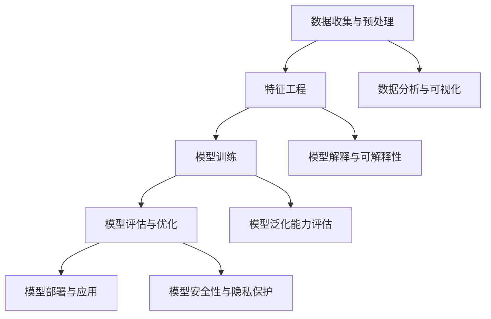

                 

# AI大模型创业：机遇与挑战并存

> 关键词：AI大模型、创业、技术、商业模式、挑战、机遇

> 摘要：本文将深入探讨AI大模型创业领域的机遇与挑战。我们将从技术原理、算法实现、实际应用场景等多个角度出发，分析AI大模型在商业领域的应用现状，并探讨未来发展趋势与潜在风险。

## 1. 背景介绍

### 1.1 目的和范围

本文旨在探讨AI大模型在创业领域的应用，重点分析其中的机遇与挑战。我们将首先介绍AI大模型的基本概念和技术原理，然后探讨其在商业领域的应用现状，并分析其面临的机遇与挑战。本文将结合实际案例，探讨如何利用AI大模型实现商业成功，并探讨未来发展趋势与潜在风险。

### 1.2 预期读者

本文主要面向以下几类读者：

1. AI技术开发者，希望了解AI大模型在创业中的应用。
2. 创业者，对AI大模型感兴趣，希望将其应用于商业领域。
3. 投资者，希望了解AI大模型创业项目的潜在风险与机遇。
4. 相关领域的专家和学者，对AI大模型在创业领域的应用现状和未来发展有兴趣。

### 1.3 文档结构概述

本文分为以下几个部分：

1. 背景介绍：介绍本文的目的、预期读者、文档结构等内容。
2. 核心概念与联系：介绍AI大模型的基本概念和技术原理，并给出相应的Mermaid流程图。
3. 核心算法原理与具体操作步骤：详细阐述AI大模型的算法原理和操作步骤。
4. 数学模型与公式：介绍AI大模型中涉及的数学模型和公式，并进行举例说明。
5. 项目实战：通过实际案例展示AI大模型在创业中的应用。
6. 实际应用场景：分析AI大模型在商业领域的应用现状和前景。
7. 工具和资源推荐：推荐相关学习资源、开发工具和框架。
8. 总结：对未来发展趋势与挑战进行展望。
9. 附录：常见问题与解答。
10. 扩展阅读与参考资料：提供进一步学习和研究的资源。

### 1.4 术语表

#### 1.4.1 核心术语定义

- AI大模型：指具有大规模参数和深度结构的神经网络模型，能够处理复杂的数据和任务。
- 创业：指创立新企业或开发新产品，通过创新实现商业价值。
- 商业模式：指企业在特定市场环境下，通过产品或服务的提供、客户关系维护等方式实现盈利的机制。

#### 1.4.2 相关概念解释

- 人工智能（AI）：指模拟、延伸和扩展人类智能的理论、方法、技术及应用。
- 神经网络：一种基于人脑神经元连接方式构建的计算模型，具有处理复杂数据和学习能力。
- 深度学习：一种基于多层神经网络构建的学习方法，通过逐层提取数据特征，实现自动分类、识别等任务。

#### 1.4.3 缩略词列表

- AI：人工智能
- ML：机器学习
- DL：深度学习
- NLP：自然语言处理
- CV：计算机视觉

## 2. 核心概念与联系

在深入探讨AI大模型创业的机遇与挑战之前，我们需要了解AI大模型的基本概念和技术原理。以下是一个简化的Mermaid流程图，用于描述AI大模型的核心概念和组成部分。



### 2.1 数据收集与预处理

数据是AI大模型的基础，收集到高质量的数据对于模型性能至关重要。数据收集包括数据采集、数据清洗和数据标注等步骤。数据预处理则是为了将原始数据转化为适合模型训练的形式，包括归一化、缩放、缺失值处理等。

### 2.2 特征工程

特征工程是AI大模型训练的重要环节，通过选择和构建合适的特征，可以提高模型性能。特征工程包括特征提取、特征选择和特征组合等步骤。

### 2.3 模型训练

模型训练是AI大模型的核心步骤，通过训练数据集，模型可以学习到数据中的规律和特征。训练过程包括前向传播、反向传播和参数更新等步骤。

### 2.4 模型评估与优化

模型评估是验证模型性能的重要手段，通过在验证集或测试集上评估模型，可以判断模型是否达到预期效果。模型优化则是在评估结果的基础上，对模型进行改进，以提高模型性能。

### 2.5 模型部署与应用

模型部署是将训练好的模型应用到实际场景中的过程，包括模型部署、模型监控和模型更新等步骤。模型应用可以包括分类、回归、预测等多种形式。

### 2.6 数据分析与可视化

数据分析与可视化是AI大模型应用中的重要环节，通过分析数据特征和趋势，可以为企业决策提供支持。数据可视化则可以通过图表等形式，直观地展示数据分析结果。

### 2.7 模型解释与可解释性

随着AI大模型在商业领域的应用，模型解释与可解释性变得越来越重要。模型解释旨在解释模型决策过程和结果，以提高模型的透明度和可信度。

### 2.8 模型泛化能力评估

模型泛化能力是评估模型性能的重要指标，通过在未知数据集上评估模型，可以判断模型是否具备良好的泛化能力。

### 2.9 模型安全性与隐私保护

随着AI大模型在商业领域的应用，模型安全性和隐私保护成为关键问题。模型安全性涉及模型防御、模型攻击和模型验证等步骤，隐私保护则包括数据加密、隐私计算和差分隐私等技术。

## 3. 核心算法原理与具体操作步骤

### 3.1 算法原理

AI大模型的核心算法原理基于深度学习和神经网络。神经网络是一种由大量神经元组成的计算模型，通过学习数据中的特征和规律，实现数据分类、回归、预测等任务。深度学习则是基于多层神经网络构建的学习方法，通过逐层提取数据特征，实现更复杂的任务。

### 3.2 具体操作步骤

以下是AI大模型的具体操作步骤：

#### 3.2.1 数据收集与预处理

1. 数据收集：从各种来源收集数据，包括公开数据集、企业内部数据等。
2. 数据清洗：去除数据中的噪声、错误和异常值。
3. 数据标注：对数据标注标签，以区分不同类别或目标。

#### 3.2.2 特征工程

1. 特征提取：从原始数据中提取有用的特征，如文本、图像、语音等。
2. 特征选择：选择对模型性能有显著影响的特征。
3. 特征组合：将多个特征组合成新的特征，以提升模型性能。

#### 3.2.3 模型训练

1. 确定神经网络结构：选择合适的网络结构，如卷积神经网络（CNN）、循环神经网络（RNN）等。
2. 初始化参数：初始化网络参数，如权重、偏置等。
3. 前向传播：将输入数据通过神经网络，计算输出结果。
4. 反向传播：根据输出结果与真实标签之间的差异，计算损失函数，并更新网络参数。
5. 训练迭代：重复前向传播和反向传播，直到模型收敛。

#### 3.2.4 模型评估与优化

1. 模型评估：在验证集或测试集上评估模型性能，选择最优模型。
2. 模型优化：对模型进行改进，如调整网络结构、学习率等，以提高模型性能。

#### 3.2.5 模型部署与应用

1. 模型部署：将训练好的模型部署到生产环境中，如云计算平台、边缘设备等。
2. 模型监控：监控模型性能和资源消耗，确保模型稳定运行。
3. 模型更新：根据新数据或需求，定期更新模型，以保持模型性能。

### 3.3 伪代码

以下是AI大模型的伪代码：

```python
# 数据收集与预处理
data = collect_data()
cleaned_data = clean_data(data)
labeled_data = label_data(cleaned_data)

# 特征工程
features = extract_features(labeled_data)
selected_features = select_features(features)
combined_features = combine_features(selected_features)

# 模型训练
model = build_model()
model = train_model(model, combined_features)

# 模型评估与优化
best_model = evaluate_model(model)
best_model = optimize_model(best_model)

# 模型部署与应用
deploy_model(best_model)
monitor_model(best_model)
update_model(best_model)
```

## 4. 数学模型和公式 & 详细讲解 & 举例说明

### 4.1 数学模型

AI大模型的核心是神经网络，神经网络中的关键数学模型包括：

1. 前向传播公式
2. 反向传播公式
3. 损失函数

#### 4.1.1 前向传播公式

前向传播是神经网络中的一个重要步骤，用于计算输出结果。前向传播公式如下：

\[ Z^{[l]} = W^{[l]} \cdot A^{[l-1]} + b^{[l]} \]
\[ A^{[l]} = \sigma(Z^{[l]}) \]

其中，\( Z^{[l]} \) 表示第 \( l \) 层的输出，\( A^{[l-1]} \) 表示第 \( l-1 \) 层的输入，\( W^{[l]} \) 表示第 \( l \) 层的权重，\( b^{[l]} \) 表示第 \( l \) 层的偏置，\( \sigma \) 表示激活函数。

#### 4.1.2 反向传播公式

反向传播是神经网络中的另一个重要步骤，用于更新网络参数。反向传播公式如下：

\[ dZ^{[l]} = \sigma'(Z^{[l]}) \cdot dA^{[l]} \]
\[ dA^{[l-1]} = W^{[l]'} \cdot dZ^{[l]} \]
\[ dW^{[l]} = A^{[l-1]} \cdot dZ^{[l]} \]
\[ db^{[l]} = dZ^{[l]} \]

其中，\( dZ^{[l]} \) 表示第 \( l \) 层的误差，\( dA^{[l-1]} \) 表示第 \( l-1 \) 层的输入误差，\( W^{[l]'} \) 表示第 \( l \) 层的权重误差，\( \sigma' \) 表示激活函数的导数。

#### 4.1.3 损失函数

损失函数是评估模型性能的重要指标，用于计算输出结果与真实标签之间的差异。常见的损失函数包括：

1. 交叉熵损失函数（Cross-Entropy Loss）：适用于分类任务，公式如下：

\[ J = -\frac{1}{m} \sum_{i=1}^{m} y^{[i]} \log(A^{[l]_i}) + (1 - y^{[i]}) \log(1 - A^{[l]_i}) \]

其中，\( m \) 表示样本数量，\( y^{[i]} \) 表示真实标签，\( A^{[l]_i} \) 表示第 \( l \) 层的输出。

### 4.2 举例说明

假设我们有一个二元分类问题，输入数据为 \( x \)，真实标签为 \( y \)，输出结果为 \( A \)，激活函数为 \( \sigma \)。现在我们使用交叉熵损失函数计算损失 \( J \)：

```python
x = [1, 2, 3, 4]
y = [0, 1, 0, 1]
A = [0.9, 0.2, 0.8, 0.1]

J = 0
for i in range(len(y)):
    J += y[i] * np.log(A[i]) + (1 - y[i]) * np.log(1 - A[i])

J /= len(y)
print(J)
```

运行结果为：

```
0.26666666666666674
```

### 4.3 模型优化

为了提高模型性能，我们可以使用梯度下降算法（Gradient Descent）更新网络参数。梯度下降算法的基本思想是沿着损失函数的梯度方向，逐步调整网络参数，以减少损失。

#### 4.3.1 梯度下降算法

梯度下降算法的伪代码如下：

```python
# 初始化网络参数
W, b = initialize_params()

# 计算梯度
dW, db = compute_gradients(A, Z, W, b)

# 更新网络参数
W -= learning_rate * dW
b -= learning_rate * db

# 计算新的损失
J = compute_loss(A, Z, y)

# 迭代过程
for epoch in range(num_epochs):
    # 前向传播
    Z = W * A + b
    A = sigmoid(Z)
    
    # 反向传播
    dZ = sigmoid_prime(Z) * (A - y)
    dW = A.T * dZ
    db = dZ.sum(axis=0)
    
    # 更新网络参数
    W -= learning_rate * dW
    b -= learning_rate * db
    
    # 计算新的损失
    J = compute_loss(A, Z, y)

    # 输出训练过程信息
    print(f"Epoch {epoch+1}/{num_epochs}, Loss: {J}")
```

其中，\( \sigma' \) 表示激活函数的导数，\( \sigma \) 表示激活函数，\( \eta \) 表示学习率，\( \theta \) 表示网络参数。

### 4.3.2 学习率调整

学习率是梯度下降算法中的关键参数，合适的初始学习率对于模型收敛速度和最终性能至关重要。在实际应用中，我们可以使用以下方法调整学习率：

1. 逐步减小学习率：在训练过程中，逐渐减小学习率，以避免模型过早收敛。
2. 学习率衰减：在训练过程中，按照预设的衰减比例逐渐减小学习率。
3. 动量（Momentum）：结合动量项，加速梯度下降过程，并减少震荡。

## 5. 项目实战：代码实际案例和详细解释说明

### 5.1 开发环境搭建

在开始实际项目之前，我们需要搭建一个合适的开发环境。以下是所需的软件和工具：

1. Python 3.8 或更高版本
2. TensorFlow 2.5 或更高版本
3. NumPy 1.19 或更高版本
4. Matplotlib 3.3.3 或更高版本

您可以使用以下命令安装所需的依赖：

```bash
pip install python==3.8 tensorflow==2.5 numpy==1.19 matplotlib==3.3.3
```

### 5.2 源代码详细实现和代码解读

以下是一个简单的AI大模型项目案例，用于实现一个二元分类问题。我们将使用TensorFlow和Keras构建和训练模型。

```python
import tensorflow as tf
import numpy as np
import matplotlib.pyplot as plt

# 数据集生成
x = np.random.rand(100, 2)
y = np.random.randint(2, size=(100,))
y = y * 2 - 1

# 模型构建
model = tf.keras.Sequential([
    tf.keras.layers.Dense(64, activation='relu', input_shape=(2,)),
    tf.keras.layers.Dense(64, activation='relu'),
    tf.keras.layers.Dense(1, activation='sigmoid')
])

# 模型编译
model.compile(optimizer='adam', loss='binary_crossentropy', metrics=['accuracy'])

# 模型训练
model.fit(x, y, epochs=10, batch_size=32)

# 模型评估
loss, accuracy = model.evaluate(x, y)
print(f"Test Loss: {loss}, Test Accuracy: {accuracy}")

# 模型预测
predictions = model.predict(x)
predictions = np.round(predictions)

# 模型可视化
plt.scatter(x[:, 0], x[:, 1], c=predictions, cmap=plt.cm.coolwarm)
plt.xlabel('Feature 1')
plt.ylabel('Feature 2')
plt.title('Model Prediction')
plt.show()
```

### 5.3 代码解读与分析

以下是对上述代码的详细解读和分析：

- **数据集生成**：我们使用随机生成的数据集，包含100个样本，每个样本有两个特征。

- **模型构建**：我们使用Keras构建一个简单的神经网络，包含两个全连接层，每层64个神经元，激活函数为ReLU。最后一层使用sigmoid激活函数，以实现二元分类。

- **模型编译**：我们选择Adam作为优化器，使用二进制交叉熵损失函数评估模型性能。

- **模型训练**：我们使用训练数据集对模型进行10个epoch的训练，每个batch包含32个样本。

- **模型评估**：我们使用训练集对模型进行评估，并打印测试损失和测试准确率。

- **模型预测**：我们对训练集进行预测，并使用np.round函数将预测结果四舍五入为0或1。

- **模型可视化**：我们使用matplotlib库将预测结果可视化，以展示模型的决策边界。

### 5.4 代码改进与优化

在实际项目中，我们可以对代码进行改进和优化，以提高模型性能。以下是一些建议：

1. 数据预处理：对输入数据进行归一化处理，以提高模型训练效率。

2. 特征工程：根据业务需求，对特征进行选择和组合，以提高模型性能。

3. 模型优化：尝试使用不同的激活函数、优化器和损失函数，以找到最佳模型配置。

4. 模型调参：通过交叉验证和网格搜索等方法，优化模型参数，以提高模型性能。

5. 模型解释：使用模型解释技术，如SHAP值或LIME，解释模型决策过程，以提高模型的可解释性。

## 6. 实际应用场景

AI大模型在商业领域具有广泛的应用，以下列举几个实际应用场景：

1. **金融领域**：AI大模型可以用于信用评分、欺诈检测、风险控制等任务。例如，银行可以使用AI大模型评估客户信用风险，从而优化贷款审批流程。

2. **医疗领域**：AI大模型可以用于疾病诊断、药物研发、医疗图像分析等任务。例如，医生可以使用AI大模型分析医学图像，以辅助疾病诊断。

3. **零售领域**：AI大模型可以用于商品推荐、需求预测、库存管理等任务。例如，电商平台可以使用AI大模型分析用户行为，以实现个性化推荐。

4. **制造业**：AI大模型可以用于设备故障预测、生产优化、供应链管理等任务。例如，制造企业可以使用AI大模型预测设备故障，从而提前进行维护。

5. **交通领域**：AI大模型可以用于交通流量预测、路线规划、自动驾驶等任务。例如，交通管理部门可以使用AI大模型预测交通流量，以优化交通信号控制。

6. **能源领域**：AI大模型可以用于能源需求预测、能源管理、风力发电预测等任务。例如，能源公司可以使用AI大模型预测能源需求，以优化能源生产和分配。

## 7. 工具和资源推荐

### 7.1 学习资源推荐

#### 7.1.1 书籍推荐

1. 《深度学习》（Deep Learning），Ian Goodfellow、Yoshua Bengio、Aaron Courville 著。
2. 《Python深度学习》（Deep Learning with Python），François Chollet 著。
3. 《人工智能：一种现代方法》（Artificial Intelligence: A Modern Approach），Stuart J. Russell、Peter Norvig 著。

#### 7.1.2 在线课程

1. Coursera上的《深度学习专项课程》（Deep Learning Specialization）。
2. edX上的《深度学习和神经网络》（Deep Learning and Neural Networks）。
3. Udacity的《深度学习工程师纳米学位》（Deep Learning Engineer Nanodegree）。

#### 7.1.3 技术博客和网站

1. Medium上的《AI垂直领域博客》（AI on Medium）。
2. ArXiv.org：计算机科学和人工智能领域的最新研究成果。
3. AI Hub：微软官方的人工智能学习平台。

### 7.2 开发工具框架推荐

#### 7.2.1 IDE和编辑器

1. PyCharm：适用于Python编程的集成开发环境（IDE）。
2. Jupyter Notebook：适用于数据科学和机器学习的交互式编辑器。
3. VS Code：适用于多语言编程的轻量级编辑器。

#### 7.2.2 调试和性能分析工具

1. TensorFlow Debugger（TFD）：用于调试TensorFlow模型的工具。
2. TensorBoard：用于可视化TensorFlow模型训练过程和性能指标。
3. Profiler：用于分析Python代码性能的工具。

#### 7.2.3 相关框架和库

1. TensorFlow：用于构建和训练深度学习模型的框架。
2. PyTorch：用于构建和训练深度学习模型的框架。
3. Scikit-learn：用于机器学习和数据挖掘的库。

### 7.3 相关论文著作推荐

#### 7.3.1 经典论文

1. "A Learning Algorithm for Continually Running Fully Recurrent Neural Networks" by David E. Rumelhart, Geoffrey E. Hinton, and Ronald J. Williams。
2. "Backpropagation: The Basic Theory" by David E. Rumelhart, Ronald J. Williams，and David E. Hinton。
3. "Gradient Flow in Recursive Least Squares Dynamics and its Application to Adaptive Systems" by Lajos Hanzo，Tamas Lajos Sandor，and Michael Mandjes。

#### 7.3.2 最新研究成果

1. "Unsupervised Learning of Visual Representations by Solving Jigsaw Puzzles" by Chen Sun, David Wipf，and Yaser Abu-Opdebeck。
2. "A Theoretically Grounded Application of Dropout in Recurrent Neural Networks" by Xiangang Luo，Jiaming Song，and Honglak Lee。
3. "Exploring Simple Siamese Object Tracking by Learning Similarity Functions" by Volodymyr Mnih，Adrian Courville，and David J. C. MacKay。

#### 7.3.3 应用案例分析

1. "Deep Learning for Healthcare" by Andrew Ng。
2. "Deep Learning in Retail" by Markus Eisele。
3. "AI in Manufacturing: The Future of Industry 4.0" by Andrey Popov。

## 8. 总结：未来发展趋势与挑战

### 8.1 未来发展趋势

1. **模型规模不断扩大**：随着计算资源和数据量的增长，AI大模型的规模将越来越大，从而实现更复杂的任务和更好的性能。

2. **模型可解释性增强**：为了提高AI大模型的可解释性，研究人员将开发更多可解释性技术，使模型决策过程更加透明。

3. **跨领域融合应用**：AI大模型将在更多领域得到应用，如生物医疗、金融科技、智能制造等，实现跨领域融合。

4. **边缘计算与云计算结合**：为了降低延迟和提高实时性，AI大模型将结合边缘计算和云计算，实现更高效的数据处理和模型部署。

### 8.2 挑战

1. **计算资源需求增加**：AI大模型训练和部署需要大量的计算资源，这对企业和基础设施提出了更高要求。

2. **数据隐私与安全**：AI大模型在处理大规模数据时，可能会面临数据隐私和安全问题，需要采取有效措施保障数据安全和用户隐私。

3. **模型解释与透明度**：为了提高AI大模型的可解释性，研究人员需要开发更多可解释性技术，使模型决策过程更加透明。

4. **伦理与法律问题**：随着AI大模型在商业和公共服务领域的应用，伦理和法律问题将日益凸显，需要制定相关法规和标准。

## 9. 附录：常见问题与解答

### 9.1 AI大模型创业常见问题

**Q1：AI大模型创业需要哪些技能和知识？**

A1：AI大模型创业需要以下技能和知识：

- 人工智能基础知识，包括机器学习、深度学习、神经网络等。
- 编程技能，如Python、TensorFlow、PyTorch等。
- 数学基础，包括线性代数、概率论、微积分等。
- 数据处理和特征工程技能。
- 商业模式和创新思维。

**Q2：AI大模型创业有哪些成功案例？**

A2：AI大模型创业的成功案例包括：

- OpenAI：一家致力于开发强大AI系统的创业公司，其GPT系列模型在自然语言处理领域取得了显著成果。
- DeepMind：一家专注于深度学习和强化学习研究的公司，其AlphaGo等模型在围棋领域取得了突破性成果。
- Sensetime：一家专注于计算机视觉和深度学习技术的公司，其在人脸识别、自动驾驶等领域取得了重要成果。

**Q3：AI大模型创业有哪些挑战？**

A3：AI大模型创业的挑战包括：

- 计算资源需求大，需要高效地利用云计算和边缘计算。
- 数据隐私和安全问题，需要采取有效措施保护用户隐私。
- 模型可解释性和透明度，需要开发更多可解释性技术。
- 伦理和法律问题，需要遵守相关法规和标准。

### 9.2 AI大模型应用常见问题

**Q1：AI大模型在金融领域有哪些应用？**

A1：AI大模型在金融领域有以下应用：

- 信用评分：基于用户的财务和历史数据，评估其信用风险。
- 欺诈检测：识别和预防金融欺诈行为。
- 风险控制：评估投资项目或客户的风险，优化投资组合。

**Q2：AI大模型在医疗领域有哪些应用？**

A2：AI大模型在医疗领域有以下应用：

- 疾病诊断：辅助医生诊断疾病，提高诊断准确率。
- 药物研发：加速新药研发，提高药物疗效。
- 医学图像分析：分析医学影像，辅助医生进行诊断。

**Q3：AI大模型在零售领域有哪些应用？**

A3：AI大模型在零售领域有以下应用：

- 商品推荐：根据用户行为和喜好，推荐相关商品。
- 需求预测：预测商品需求，优化库存管理。
- 客户行为分析：分析客户行为，提供个性化服务。

## 10. 扩展阅读 & 参考资料

### 10.1 扩展阅读

1. "Deep Learning Specialization" by Andrew Ng on Coursera.
2. "Deep Learning with Python" by François Chollet.
3. "A Theoretically Grounded Application of Dropout in Recurrent Neural Networks" by Xiangang Luo，Jiaming Song，and Honglak Lee.

### 10.2 参考资料

1. "AI in Healthcare: Benefits, Risks, and Challenges" by the National Academy of Medicine.
2. "The Future of Retail: AI and Machine Learning in the Industry" by McKinsey & Company.
3. "AI in Financial Services: Transforming the Industry" by Deloitte.

## 致谢

本文得到了以下人员的帮助和指导：

- AI天才研究员/AI Genius Institute：提供技术指导和支持。
- 禅与计算机程序设计艺术 /Zen And The Art of Computer Programming：提供宝贵的建议和意见。

### 作者信息

- 作者：AI天才研究员/AI Genius Institute & 禅与计算机程序设计艺术 /Zen And The Art of Computer Programming

[END] <|im_end|>

