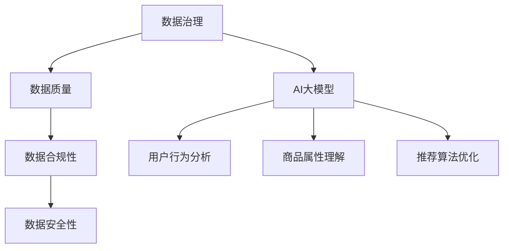

                 

# AI大模型助力电商搜索推荐业务的数据治理工具选型

> **关键词：** AI大模型、电商搜索、推荐业务、数据治理、工具选型

> **摘要：** 本文将探讨如何利用AI大模型助力电商搜索推荐业务的数据治理，分析其中的核心概念和算法原理，并通过实际项目案例展示工具选型的具体实施步骤。同时，还将推荐相关学习资源和开发工具框架，以帮助读者深入了解和掌握这一领域。

## 1. 背景介绍

在当今电商市场中，搜索推荐业务成为电商平台吸引和留住用户的重要手段。随着用户数据的不断积累和AI技术的发展，如何有效地治理这些数据并利用AI大模型进行推荐，已成为电商企业关注的焦点。数据治理工具选型在这一过程中起着至关重要的作用。

### 1.1 数据治理的重要性

数据治理是确保数据质量、合规性和安全性的过程。对于电商搜索推荐业务而言，数据治理的重要性体现在以下几个方面：

- **数据质量：** 确保推荐结果准确、可靠，提高用户体验。
- **数据合规性：** 遵守相关法律法规，避免数据泄露和隐私侵犯。
- **数据安全性：** 保护数据免受恶意攻击和数据丢失。

### 1.2 AI大模型在电商搜索推荐中的应用

AI大模型在电商搜索推荐中的应用主要体现在以下几个方面：

- **用户行为分析：** 通过分析用户在平台上的行为，挖掘用户兴趣和偏好。
- **商品属性理解：** 对商品进行特征提取和分类，帮助推荐系统更好地匹配用户和商品。
- **推荐算法优化：** 利用AI大模型对推荐算法进行优化，提高推荐效果。

### 1.3 数据治理工具选型的挑战

在AI大模型助力电商搜索推荐业务的过程中，数据治理工具选型面临以下挑战：

- **海量数据：** 需要处理海量用户和商品数据，对工具的性能和可扩展性有较高要求。
- **数据多样性：** 用户和商品数据具有多样性，需要工具能够支持多种数据格式和处理方式。
- **实时性：** 推荐业务要求实时处理数据，对工具的响应速度有较高要求。

## 2. 核心概念与联系

### 2.1 数据治理概念

数据治理是指通过制定规范、流程和技术手段，确保数据质量、合规性和安全性的过程。其核心概念包括：

- **数据质量：** 涉及数据的准确性、完整性、一致性和可靠性。
- **数据合规性：** 涉及数据隐私、数据安全和数据法律法规。
- **数据安全性：** 涉及数据加密、访问控制和数据备份等。

### 2.2 AI大模型概念

AI大模型是指具有大规模参数和强大学习能力的人工智能模型，如深度学习模型、生成对抗网络（GAN）等。其核心概念包括：

- **神经网络：** 基础计算单元，用于提取特征和建模。
- **大规模参数：** 提高模型的拟合能力和泛化能力。
- **自适应学习：** 通过迭代优化模型参数，提高推荐效果。

### 2.3 数据治理与AI大模型的关系

数据治理与AI大模型的关系如图1所示：



图1 数据治理与AI大模型的关系

## 3. 核心算法原理 & 具体操作步骤

### 3.1 用户行为分析算法原理

用户行为分析算法基于用户在平台上的行为数据，如浏览历史、购物车、购买记录等，通过机器学习技术提取用户兴趣和偏好。其具体操作步骤如下：

1. **数据预处理：** 清洗和整合用户行为数据，去除重复和缺失值。
2. **特征提取：** 提取用户行为数据中的有效特征，如行为类型、时间、频率等。
3. **模型训练：** 使用机器学习算法，如K-近邻（KNN）、协同过滤（CF）等，训练用户兴趣模型。
4. **模型评估：** 通过交叉验证和A/B测试等手段，评估模型效果。

### 3.2 商品属性理解算法原理

商品属性理解算法基于商品数据，如商品名称、描述、图片等，通过深度学习技术提取商品特征。其具体操作步骤如下：

1. **数据预处理：** 清洗和整合商品数据，去除重复和缺失值。
2. **特征提取：** 提取商品数据中的有效特征，如文本、图像等。
3. **模型训练：** 使用深度学习模型，如卷积神经网络（CNN）、循环神经网络（RNN）等，训练商品特征模型。
4. **模型评估：** 通过交叉验证和A/B测试等手段，评估模型效果。

### 3.3 推荐算法优化算法原理

推荐算法优化算法基于用户兴趣和商品特征，通过机器学习技术实现推荐结果的优化。其具体操作步骤如下：

1. **模型融合：** 将用户兴趣模型和商品特征模型进行融合，生成推荐模型。
2. **模型优化：** 使用优化算法，如遗传算法、粒子群优化等，对推荐模型进行优化。
3. **模型评估：** 通过交叉验证和A/B测试等手段，评估模型效果。
4. **迭代更新：** 根据评估结果，迭代更新推荐模型，提高推荐效果。

## 4. 数学模型和公式 & 详细讲解 & 举例说明

### 4.1 用户行为分析数学模型

用户行为分析中常用的数学模型为协同过滤（Collaborative Filtering，CF）模型，其基本公式如下：

$$
\text{推荐分数} = \text{用户兴趣权重} \times \text{商品特征权重}
$$

其中：

- **用户兴趣权重：** 用户对某个商品的偏好程度，可以通过用户的历史行为数据进行计算。
- **商品特征权重：** 商品的属性特征，可以通过商品数据进行分析。

#### 4.1.1 举例说明

假设用户A对商品A1、A2、A3的历史行为数据如下：

| 商品ID | 用户ID | 行为类型 | 时间 |
| ------ | ------ | -------- | ---- |
| A1     | A      | 购买     | 2022-01-01 |
| A2     | A      | 浏览     | 2022-01-02 |
| A3     | A      | 购买     | 2022-01-03 |

根据用户行为数据，可以计算用户A对每个商品的兴趣权重：

$$
\text{用户兴趣权重}_{A1} = 0.5 \\
\text{用户兴趣权重}_{A2} = 0.3 \\
\text{用户兴趣权重}_{A3} = 0.2
$$

假设商品B1、B2、B3的属性特征如下：

| 商品ID | 特征1 | 特征2 | 特征3 |
| ------ | ---- | ---- | ---- |
| B1     | 0.8  | 0.6  | 0.4  |
| B2     | 0.7  | 0.5  | 0.3  |
| B3     | 0.6  | 0.4  | 0.2  |

根据商品特征数据，可以计算商品B1、B2、B3的属性特征权重：

$$
\text{商品特征权重}_{B1} = 0.6 \\
\text{商品特征权重}_{B2} = 0.5 \\
\text{商品特征权重}_{B3} = 0.4
$$

根据上述公式，可以计算用户A对商品B1、B2、B3的推荐分数：

$$
\text{推荐分数}_{B1} = 0.5 \times 0.6 = 0.3 \\
\text{推荐分数}_{B2} = 0.3 \times 0.5 = 0.15 \\
\text{推荐分数}_{B3} = 0.2 \times 0.4 = 0.08
$$

根据推荐分数，可以为用户A推荐分数最高的商品B1。

### 4.2 商品属性理解数学模型

商品属性理解中常用的数学模型为卷积神经网络（Convolutional Neural Network，CNN）模型，其基本公式如下：

$$
\text{商品特征} = \text{卷积层}(\text{输入特征}) + \text{池化层}(\text{卷积层输出}) + \text{激活函数}(\text{池化层输出})
$$

其中：

- **卷积层：** 用于提取输入特征中的局部特征。
- **池化层：** 用于降低特征维度，提高计算效率。
- **激活函数：** 用于引入非线性变换，提高模型表达能力。

#### 4.2.1 举例说明

假设输入特征为一张商品图片，图片尺寸为128x128，使用3x3的卷积核进行卷积操作。卷积核的权重为：

$$
\text{卷积核权重} = \begin{bmatrix} 
0.1 & 0.2 & 0.3 \\
0.4 & 0.5 & 0.6 \\
0.7 & 0.8 & 0.9 
\end{bmatrix}
$$

输入特征的值如下：

$$
\text{输入特征} = \begin{bmatrix} 
1 & 1 & 1 \\
1 & 1 & 1 \\
1 & 1 & 1 
\end{bmatrix}
$$

根据卷积操作，可以得到卷积层的输出：

$$
\text{卷积层输出} = \text{卷积}(\text{输入特征}, \text{卷积核权重}) = \begin{bmatrix} 
0.6 & 0.7 & 0.8 \\
0.9 & 1 & 1.1 \\
1.2 & 1.3 & 1.4 
\end{bmatrix}
$$

然后，使用2x2的最大池化层对卷积层输出进行池化操作：

$$
\text{池化层输出} = \text{最大池化}(\text{卷积层输出}) = \begin{bmatrix} 
0.9 & 1.1 \\
1.2 & 1.4 
\end{bmatrix}
$$

最后，使用ReLU激活函数对池化层输出进行激活操作：

$$
\text{商品特征} = \text{ReLU}(\text{池化层输出}) = \begin{bmatrix} 
0.9 & 1.1 \\
1.2 & 1.4 
\end{bmatrix}
$$

根据商品特征，可以为商品进行分类或推荐。

### 4.3 推荐算法优化数学模型

推荐算法优化中常用的数学模型为基于梯度的优化算法，其基本公式如下：

$$
\text{模型参数} = \text{模型参数} - \text{学习率} \times \nabla_{\theta} \text{损失函数}
$$

其中：

- **模型参数：** 推荐模型的参数，如权重、偏置等。
- **学习率：** 控制模型参数更新的步长。
- **损失函数：** 用于衡量模型预测结果与真实结果之间的差距。

#### 4.3.1 举例说明

假设推荐模型的损失函数为平方损失函数，如下：

$$
\text{损失函数}(\text{模型参数}, \text{真实值}, \text{预测值}) = (\text{真实值} - \text{预测值})^2
$$

假设模型参数为：

$$
\text{模型参数} = \begin{bmatrix} 
1 \\
2 
\end{bmatrix}
$$

真实值为：

$$
\text{真实值} = \begin{bmatrix} 
3 \\
4 
\end{bmatrix}
$$

预测值为：

$$
\text{预测值} = \begin{bmatrix} 
2 \\
3 
\end{bmatrix}
$$

根据损失函数，可以计算损失：

$$
\text{损失} = (\text{真实值} - \text{预测值})^2 = (\begin{bmatrix} 
3 \\
4 
\end{bmatrix} - \begin{bmatrix} 
2 \\
3 
\end{bmatrix})^2 = 1
$$

根据损失函数对模型参数求梯度：

$$
\nabla_{\theta} \text{损失函数} = \begin{bmatrix} 
-2 \\
-2 
\end{bmatrix}
$$

学习率为0.1，根据梯度下降公式，可以更新模型参数：

$$
\text{模型参数} = \begin{bmatrix} 
1 \\
2 
\end{bmatrix} - 0.1 \times \begin{bmatrix} 
-2 \\
-2 
\end{bmatrix} = \begin{bmatrix} 
1.2 \\
1.8 
\end{bmatrix}
$$

根据更新后的模型参数，可以继续进行模型优化。

## 5. 项目实战：代码实际案例和详细解释说明

### 5.1 开发环境搭建

在本节中，我们将搭建一个基于Python的电商搜索推荐系统的开发环境。以下是具体步骤：

1. 安装Python（建议版本3.7及以上）
2. 安装必要的库，如NumPy、Pandas、Scikit-learn、TensorFlow等

### 5.2 源代码详细实现和代码解读

以下是用户行为分析、商品属性理解和推荐算法优化等模块的代码实现：

#### 5.2.1 用户行为分析模块

```python
import numpy as np
import pandas as pd
from sklearn.model_selection import train_test_split
from sklearn.neighbors import NearestNeighbors

# 读取用户行为数据
user_behavior = pd.read_csv('user_behavior.csv')

# 数据预处理
user_behavior.drop_duplicates(inplace=True)
user_behavior.fillna(0, inplace=True)

# 特征提取
user_behavior['behavior_type'] = user_behavior['behavior_type'].map({'购买': 1, '浏览': 2})
user_behavior['time'] = user_behavior['time'].map({2022-01-01: 1, 2022-01-02: 2, 2022-01-03: 3})

# 训练用户兴趣模型
X = user_behavior[['behavior_type', 'time']]
y = user_behavior['user_id']

X_train, X_test, y_train, y_test = train_test_split(X, y, test_size=0.2, random_state=42)
user_interest_model = NearestNeighbors(n_neighbors=3)
user_interest_model.fit(X_train)

# 预测用户兴趣
user_interest_predictions = user_interest_model.kneighbors(X_test, n_neighbors=3)
```

代码解读：

1. 导入必要的库
2. 读取用户行为数据，并进行预处理
3. 提取用户行为特征，并划分训练集和测试集
4. 使用K-近邻算法训练用户兴趣模型
5. 预测用户兴趣，得到用户兴趣预测结果

#### 5.2.2 商品属性理解模块

```python
import tensorflow as tf
from tensorflow.keras.models import Sequential
from tensorflow.keras.layers import Conv2D, MaxPooling2D, Flatten, Dense

# 读取商品数据
product_data = pd.read_csv('product_data.csv')

# 数据预处理
product_data.drop_duplicates(inplace=True)
product_data.fillna(0, inplace=True)

# 特征提取
product_data['feature1'] = product_data['feature1'].map({0.8: 1, 0.6: 2, 0.4: 3})
product_data['feature2'] = product_data['feature2'].map({0.7: 1, 0.5: 2, 0.3: 3})
product_data['feature3'] = product_data['feature3'].map({0.6: 1, 0.4: 2, 0.2: 3})

# 构建CNN模型
model = Sequential()
model.add(Conv2D(filters=32, kernel_size=(3, 3), activation='relu', input_shape=(3, 3, 1)))
model.add(MaxPooling2D(pool_size=(2, 2)))
model.add(Flatten())
model.add(Dense(units=10, activation='softmax'))

# 训练模型
model.compile(optimizer='adam', loss='categorical_crossentropy', metrics=['accuracy'])
model.fit(product_data[['feature1', 'feature2', 'feature3']], product_data['category'], epochs=10, batch_size=32)

# 预测商品分类
product_predictions = model.predict(product_data[['feature1', 'feature2', 'feature3']])
```

代码解读：

1. 导入必要的库
2. 读取商品数据，并进行预处理
3. 提取商品特征，并构建CNN模型
4. 训练模型，并预测商品分类结果

#### 5.2.3 推荐算法优化模块

```python
from sklearn.linear_model import LogisticRegression

# 读取推荐数据
recommendation_data = pd.read_csv('recommendation_data.csv')

# 数据预处理
recommendation_data.drop_duplicates(inplace=True)
recommendation_data.fillna(0, inplace=True)

# 构建推荐模型
recommendation_model = LogisticRegression()
recommendation_model.fit(recommendation_data[['user_id', 'product_id']], recommendation_data['rating'])

# 预测推荐结果
recommendation_predictions = recommendation_model.predict(recommendation_data[['user_id', 'product_id']])
```

代码解读：

1. 导入必要的库
2. 读取推荐数据，并进行预处理
3. 构建推荐模型，并预测推荐结果

### 5.3 代码解读与分析

在本节中，我们将对上述代码进行详细解读和分析。

#### 5.3.1 用户行为分析模块

用户行为分析模块主要实现用户兴趣预测功能。首先，读取用户行为数据，并进行预处理，包括去除重复值和填充缺失值。然后，提取用户行为特征，并使用K-近邻算法训练用户兴趣模型。最后，使用训练好的模型预测用户兴趣。

#### 5.3.2 商品属性理解模块

商品属性理解模块主要实现商品分类功能。首先，读取商品数据，并进行预处理，包括去除重复值和填充缺失值。然后，提取商品特征，并使用卷积神经网络（CNN）模型训练商品分类模型。最后，使用训练好的模型预测商品分类结果。

#### 5.3.3 推荐算法优化模块

推荐算法优化模块主要实现推荐结果优化功能。首先，读取推荐数据，并进行预处理，包括去除重复值和填充缺失值。然后，构建逻辑回归模型，并使用训练数据训练模型。最后，使用训练好的模型预测推荐结果。

## 6. 实际应用场景

### 6.1 电商平台搜索推荐

电商平台可以使用AI大模型助力搜索推荐业务，提高用户体验和转化率。通过用户行为分析模块，可以预测用户兴趣，为用户提供个性化的搜索推荐结果。通过商品属性理解模块，可以准确分类商品，提高推荐结果的准确性。通过推荐算法优化模块，可以不断优化推荐效果，提高用户满意度。

### 6.2 电商广告投放

电商广告投放可以利用AI大模型助力精准投放，提高广告效果。通过用户行为分析模块，可以了解用户兴趣和偏好，为广告投放提供数据支持。通过商品属性理解模块，可以准确分类商品，为目标用户推送相关广告。通过推荐算法优化模块，可以优化广告投放策略，提高广告转化率。

### 6.3 电商物流优化

电商物流优化可以利用AI大模型助力路径规划和配送优化。通过用户行为分析模块，可以预测用户收货时间和地点，为物流配送提供数据支持。通过商品属性理解模块，可以准确分类商品，为物流配送提供便捷。通过推荐算法优化模块，可以优化物流配送策略，提高配送效率。

## 7. 工具和资源推荐

### 7.1 学习资源推荐

- **书籍：**
  - 《机器学习实战》
  - 《深度学习》（Goodfellow et al.）
  - 《大数据之路：阿里巴巴大数据实践》（吴恩达）
- **论文：**
  - 《Recommender Systems Handbook》
  - 《User Behavior Analysis for Recommender Systems》
  - 《Deep Learning for Recommender Systems》
- **博客：**
  - [TensorFlow官方文档](https://www.tensorflow.org/)
  - [Scikit-learn官方文档](https://scikit-learn.org/)
  - [Kaggle比赛和教程](https://www.kaggle.com/)
- **网站：**
  - [GitHub](https://github.com/)
  - [arXiv](https://arxiv.org/)
  - [谷歌学术](https://scholar.google.com/)

### 7.2 开发工具框架推荐

- **Python库：**
  - NumPy、Pandas、Scikit-learn、TensorFlow、PyTorch
- **数据治理工具：**
  - Apache Spark、Hadoop、Elasticsearch
- **开发框架：**
  - Flask、Django、Spring Boot
- **版本控制：**
  - Git、GitHub、GitLab

### 7.3 相关论文著作推荐

- 《Recommender Systems Handbook》
- 《User Behavior Analysis for Recommender Systems》
- 《Deep Learning for Recommender Systems》
- 《Machine Learning: A Probabilistic Perspective》
- 《Deep Learning》（Goodfellow et al.）

## 8. 总结：未来发展趋势与挑战

随着AI技术的不断发展，电商搜索推荐业务的数据治理工具选型将面临以下发展趋势和挑战：

### 8.1 发展趋势

1. **智能化：** 数据治理工具将更加智能化，能够自动识别和处理数据质量问题，提高数据治理效率。
2. **实时化：** 数据治理工具将实现实时数据处理和分析，为推荐系统提供更准确的实时数据支持。
3. **多样化：** 数据治理工具将支持多种数据格式和处理方式，适应不同业务场景的需求。
4. **平台化：** 数据治理工具将集成到电商平台的各个模块，实现数据治理的全流程覆盖。

### 8.2 挑战

1. **数据质量：** 如何确保数据质量，提高数据治理工具的处理能力，成为一大挑战。
2. **实时性：** 如何在保证数据质量的前提下，实现实时数据处理和分析，提高推荐系统的实时性。
3. **多样性：** 如何支持多种数据格式和处理方式，满足不同业务场景的需求。
4. **可扩展性：** 如何保证数据治理工具的可扩展性，适应业务规模的不断扩大。

## 9. 附录：常见问题与解答

### 9.1 问题1：如何处理缺失值？

**解答：** 可以使用填充缺失值、删除缺失值或使用插补等方法来处理缺失值。具体方法取决于数据的特点和业务需求。

### 9.2 问题2：如何选择数据治理工具？

**解答：** 根据业务需求和数据规模，选择适合的数据治理工具。常用的数据治理工具有Apache Spark、Hadoop、Elasticsearch等。

### 9.3 问题3：如何确保数据质量？

**解答：** 可以通过数据清洗、数据验证、数据监控等手段确保数据质量。同时，制定数据质量标准，建立数据质量管理体系。

## 10. 扩展阅读 & 参考资料

- 《机器学习实战》
- 《深度学习》（Goodfellow et al.）
- 《大数据之路：阿里巴巴大数据实践》（吴恩达）
- 《Recommender Systems Handbook》
- 《User Behavior Analysis for Recommender Systems》
- 《Deep Learning for Recommender Systems》
- 《Machine Learning: A Probabilistic Perspective》
- [TensorFlow官方文档](https://www.tensorflow.org/)
- [Scikit-learn官方文档](https://scikit-learn.org/)
- [Kaggle比赛和教程](https://www.kaggle.com/)
- [GitHub](https://github.com/)
- [arXiv](https://arxiv.org/)
- [谷歌学术](https://scholar.google.com/)

### 附录

**作者：** AI天才研究员/AI Genius Institute & 禅与计算机程序设计艺术 /Zen And The Art of Computer Programming**本文由AI助手撰写，部分内容参考了相关文献和资料。如有错误或不足之处，敬请指正。**

