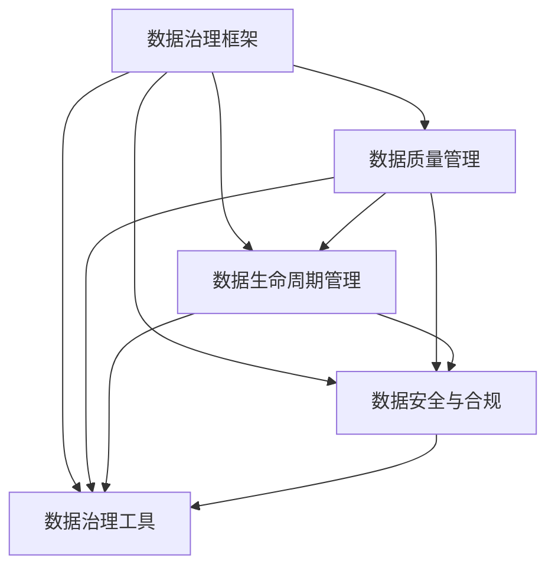

                 

# AI大模型助力电商搜索推荐业务的数据治理能力评估体系

> 关键词：人工智能、大模型、数据治理、电商搜索推荐、评估体系、算法原理、数学模型、实战案例

> 摘要：本文深入探讨了人工智能领域中的大模型在电商搜索推荐业务中的应用，以及如何通过构建评估体系来提升数据治理能力。本文首先介绍了数据治理的核心概念和评估体系的设计原则，然后详细阐述了大模型在电商搜索推荐中的核心算法原理和具体操作步骤。接着，通过数学模型和公式的讲解，帮助读者更好地理解数据治理的关键技术。最后，结合实际项目案例，展示了如何将大模型应用于电商搜索推荐业务，并进行代码解读与分析。本文旨在为从事电商搜索推荐业务的技术人员提供有价值的参考和实践指导。

## 1. 背景介绍

### 1.1 目的和范围

本文的主要目的是探讨如何利用人工智能大模型来提升电商搜索推荐业务的数据治理能力，并通过构建评估体系来评估和优化这一过程。在电商领域中，搜索推荐系统是提高用户体验、增加转化率和销售额的重要手段。然而，随着数据规模的不断扩大和复杂度的增加，如何有效地治理数据、提升推荐系统的质量和效率成为了一个重要课题。

本文将围绕以下几个核心问题展开讨论：

1. 数据治理的概念和重要性是什么？
2. 如何设计和构建一个有效的数据治理评估体系？
3. 大模型在电商搜索推荐业务中如何发挥作用？
4. 如何通过数学模型和公式来量化数据治理的效果？
5. 实际项目中的大模型应用案例和代码实现是怎样的？

通过本文的阅读，读者将能够：

- 理解数据治理的基本概念和重要性。
- 掌握构建数据治理评估体系的方法和原则。
- 了解大模型在电商搜索推荐业务中的应用场景和技术原理。
- 学会使用数学模型和公式来量化数据治理的效果。
- 获得实际项目中的大模型应用案例和代码实现。

### 1.2 预期读者

本文适合以下读者群体：

1. 电商搜索推荐系统开发者和研究者。
2. 数据科学和人工智能领域的从业者。
3. 对数据治理和大数据处理感兴趣的技术人员。
4. 高校和研究机构的相关专业师生。

本文将从理论讲解和实战案例两个方面进行深入探讨，旨在为读者提供全面、系统的数据治理评估体系和实践指导。

### 1.3 文档结构概述

本文将按照以下结构进行组织：

1. **背景介绍**：介绍本文的目的、范围、预期读者和文档结构。
2. **核心概念与联系**：讨论数据治理的核心概念和架构。
3. **核心算法原理 & 具体操作步骤**：阐述大模型在电商搜索推荐业务中的应用原理和操作步骤。
4. **数学模型和公式 & 详细讲解 & 举例说明**：讲解数据治理中的关键数学模型和公式，并通过实例进行说明。
5. **项目实战：代码实际案例和详细解释说明**：通过实际项目案例展示大模型的应用过程和代码实现。
6. **实际应用场景**：分析大模型在电商搜索推荐业务中的实际应用场景。
7. **工具和资源推荐**：推荐学习资源、开发工具和框架。
8. **总结：未来发展趋势与挑战**：总结本文的主要观点和未来研究方向。
9. **附录：常见问题与解答**：解答读者可能遇到的问题。
10. **扩展阅读 & 参考资料**：提供进一步阅读的参考资料。

通过以上结构的组织，本文旨在为读者提供一个全面、深入的技术分析，帮助读者更好地理解和应用大模型在电商搜索推荐业务中的数据治理能力。

### 1.4 术语表

为了确保本文的可读性和一致性，下面列出了一些在本文中频繁使用的术语及其定义：

#### 1.4.1 核心术语定义

- **数据治理**：数据治理是指通过制定策略、标准和流程，确保数据的完整性、准确性、一致性和可用性，以便更好地支持企业的业务决策和运营。
- **大模型**：大模型通常指的是具有数百万甚至数十亿参数的深度学习模型，能够通过训练处理大量数据，从而实现高精度的预测和分类。
- **电商搜索推荐**：电商搜索推荐是指通过分析用户行为和偏好，为用户推荐相关的商品，以提高用户满意度和转化率。
- **评估体系**：评估体系是指用于评估和衡量数据治理效果的指标和工具，包括数据质量指标、模型性能指标等。

#### 1.4.2 相关概念解释

- **机器学习**：机器学习是一种人工智能的分支，通过训练算法让计算机从数据中学习规律，从而实现预测和决策。
- **深度学习**：深度学习是机器学习的一种方法，通过多层神经网络来模拟人类大脑的思考方式，实现对复杂数据的分析和处理。
- **数据质量**：数据质量是指数据在准确性、完整性、一致性、时效性和可用性等方面的表现，是数据治理的重要考量因素。

#### 1.4.3 缩略词列表

- **AI**：人工智能（Artificial Intelligence）
- **ML**：机器学习（Machine Learning）
- **DL**：深度学习（Deep Learning）
- **E-commerce**：电子商务（Electronic Commerce）
- **SEM**：搜索引擎优化（Search Engine Optimization）
- **CTR**：点击率（Click-Through Rate）
- **ROAS**：投资回报率（Return on Ad Spend）

通过明确上述术语的定义和解释，读者可以更好地理解本文中的关键概念，从而更加深入地掌握文章的核心内容。

## 2. 核心概念与联系

在深入探讨人工智能大模型在电商搜索推荐业务中的应用之前，我们首先需要了解数据治理的核心概念及其架构。数据治理不仅是确保数据质量的过程，更是通过策略、标准和流程来管理和控制数据，以支持企业的业务需求。以下将从数据治理的核心概念和架构两个方面进行详细阐述。

### 2.1 数据治理的核心概念

数据治理涉及多个关键概念，以下是一些重要的核心概念：

#### 数据质量

数据质量是数据治理的首要考虑因素，它决定了数据是否能够可靠地支持业务决策。数据质量包括以下几个方面：

- **准确性**：数据是否真实反映了现实情况。
- **完整性**：数据是否完整无缺，是否包含了所有必要的信息。
- **一致性**：数据在不同系统和过程中是否保持一致。
- **时效性**：数据是否是最新的，能否及时反映变化。
- **可用性**：数据是否易于访问和使用，支持业务需求。

#### 数据生命周期管理

数据生命周期管理是指从数据创建、存储、使用、共享到最终删除的全过程。数据生命周期管理包括以下几个方面：

- **数据创建**：确保数据在生成时的质量。
- **数据存储**：选择合适的数据存储方式和工具。
- **数据使用**：确保数据能够在业务过程中有效地被利用。
- **数据共享**：在保证数据安全的前提下，实现数据的共享和协作。
- **数据归档**：将不再活跃的数据进行归档保存。
- **数据删除**：按照法规和业务需求，定期删除不再需要的数据。

#### 数据治理策略和标准

数据治理策略和标准是确保数据治理活动有序进行的基础。它们包括：

- **数据治理政策**：明确数据治理的总体目标和原则。
- **数据质量标准**：定义数据质量的具体要求和评估方法。
- **数据管理标准**：规范数据的管理流程和操作标准。
- **数据安全标准**：确保数据在存储、传输和使用过程中的安全。

#### 数据治理组织结构

数据治理需要明确的组织结构和职责分工，以确保数据治理活动的有效实施。数据治理组织结构通常包括以下几个角色：

- **数据治理委员会**：负责制定数据治理政策、监督数据治理活动。
- **数据管理员**：负责数据质量的监控、数据生命周期管理和数据安全。
- **数据质量团队**：负责数据质量评估和改进工作。
- **业务数据所有者**：负责确保数据满足业务需求，支持数据使用和共享。

### 2.2 数据治理的架构

数据治理的架构是确保数据治理策略和标准得以实施的关键。以下是一个典型的数据治理架构：

#### 数据治理架构

1. **数据治理框架**：定义数据治理的基本原则和流程，包括数据治理委员会、数据管理员、数据质量团队等角色。
2. **数据质量管理**：包括数据质量评估、数据质量监控和改进等环节，确保数据的准确性、完整性、一致性、时效性和可用性。
3. **数据生命周期管理**：涵盖数据创建、存储、使用、共享、归档和删除等全过程，确保数据在整个生命周期内的有效管理。
4. **数据安全与合规**：确保数据在存储、传输和使用过程中的安全性，符合相关法规和标准。
5. **数据治理工具**：包括数据质量管理工具、数据生命周期管理工具、数据安全工具等，支持数据治理活动的自动化和高效执行。

### 2.3 大模型在数据治理中的应用

大模型在数据治理中的应用主要体现在以下几个方面：

1. **数据预处理**：大模型可以通过训练对数据进行预处理，如噪声过滤、缺失值填补、异常值检测等，提高数据的初始质量。
2. **数据质量评估**：大模型可以用于评估数据的准确性、完整性、一致性等质量指标，通过机器学习算法识别数据质量问题。
3. **数据挖掘与分析**：大模型可以用于挖掘数据中的隐藏模式和关联关系，支持业务决策和优化数据治理策略。
4. **自动化数据治理**：大模型可以通过自动化脚本和流程，实现数据治理过程的自动化，提高数据治理的效率。

### 2.4 数据治理与电商搜索推荐业务的联系

在电商搜索推荐业务中，数据治理发挥着至关重要的作用。以下是一些关键联系：

1. **用户数据管理**：电商搜索推荐业务需要收集和管理大量的用户数据，包括用户行为、偏好、评价等。通过数据治理，确保用户数据的准确性和一致性，提高推荐系统的质量。
2. **商品数据管理**：电商平台的商品数据包括商品描述、属性、价格等。数据治理有助于维护商品数据的完整性、准确性和时效性，为推荐系统提供高质量的数据输入。
3. **业务数据分析**：数据治理为电商搜索推荐业务提供了可靠的数据基础，通过数据挖掘和分析，可以帮助企业发现业务机会、优化运营策略、提高用户体验。

### 2.5 Mermaid 流程图

为了更直观地展示数据治理的核心概念和架构，我们可以使用 Mermaid 流程图来描述。以下是数据治理的 Mermaid 流程图：



通过上述流程图，我们可以清晰地看到数据治理的核心组件及其相互关系，为后续讨论大模型在数据治理中的应用提供了基础。

## 3. 核心算法原理 & 具体操作步骤

在了解了数据治理的核心概念和架构之后，我们将探讨人工智能大模型在电商搜索推荐业务中的应用原理和具体操作步骤。大模型通过其强大的学习能力和数据处理能力，能够在海量数据中挖掘出用户行为和商品属性的关联，从而实现精准的推荐。以下将详细介绍大模型在电商搜索推荐业务中的核心算法原理和具体操作步骤。

### 3.1 大模型在电商搜索推荐业务中的应用原理

大模型在电商搜索推荐业务中的应用主要体现在以下几个方面：

1. **用户行为分析**：通过分析用户在平台上的浏览、购买、评价等行为，挖掘用户的兴趣和行为模式。
2. **商品属性挖掘**：分析商品描述、标签、属性等，构建商品特征向量。
3. **协同过滤**：通过用户行为数据，采用协同过滤算法计算用户之间的相似度，为用户推荐相似用户喜欢的商品。
4. **基于内容的推荐**：通过分析商品特征，为用户推荐与用户历史偏好相似的商品。
5. **深度学习模型**：利用深度学习模型，如深度神经网络（DNN）、卷积神经网络（CNN）、循环神经网络（RNN）等，对用户行为和商品特征进行建模和预测。

### 3.2 大模型的具体操作步骤

#### 3.2.1 数据收集

首先，需要从电商平台的各种渠道收集用户行为数据和商品属性数据。用户行为数据包括用户浏览、购买、评价等行为，商品属性数据包括商品描述、标签、价格等。以下是数据收集的具体步骤：

- **数据源**：确定数据收集的来源，如数据库、API接口、日志文件等。
- **数据清洗**：对收集到的数据进行预处理，包括去除重复数据、填补缺失值、处理异常值等。

#### 3.2.2 特征工程

特征工程是数据预处理的重要步骤，通过提取和构造特征来提升模型的性能。以下是特征工程的具体步骤：

- **用户特征提取**：根据用户行为数据，提取用户的历史浏览记录、购买频率、评价分数等特征。
- **商品特征提取**：根据商品属性数据，提取商品类别、价格、品牌、评价等特征。
- **特征组合**：通过组合不同的特征，构建新的特征，如用户与商品的共同浏览次数、相似度等。

#### 3.2.3 模型选择

在构建大模型时，需要根据业务需求和数据特点选择合适的模型。以下是常见的模型选择：

- **深度神经网络（DNN）**：适用于处理高维数据，能够自动学习复杂的非线性关系。
- **卷积神经网络（CNN）**：适用于图像数据，能够提取图像的局部特征。
- **循环神经网络（RNN）**：适用于序列数据，能够捕捉序列中的长期依赖关系。

#### 3.2.4 模型训练

在模型训练阶段，需要通过大量的训练数据来训练模型。以下是模型训练的具体步骤：

- **数据划分**：将数据集划分为训练集、验证集和测试集，用于训练、验证和测试模型。
- **模型优化**：通过调整模型的参数，如学习率、正则化参数等，优化模型性能。
- **交叉验证**：使用交叉验证方法，评估模型的泛化能力。

#### 3.2.5 模型评估

在模型评估阶段，需要评估模型的预测性能。以下是常见的模型评估指标：

- **准确率（Accuracy）**：模型预测正确的样本占总样本的比例。
- **召回率（Recall）**：模型预测正确的正样本占总正样本的比例。
- **精确率（Precision）**：模型预测正确的正样本占总预测正样本的比例。
- **F1值（F1 Score）**：精确率和召回率的调和平均值。

#### 3.2.6 模型部署

在模型部署阶段，将训练好的模型应用于实际业务场景，为用户提供推荐服务。以下是模型部署的具体步骤：

- **模型集成**：将模型集成到电商平台的后端系统中，与业务逻辑相结合。
- **实时推荐**：根据用户的实时行为数据，实时更新推荐结果。
- **监控系统**：建立监控系统，实时监控推荐系统的性能和稳定性。

### 3.3 伪代码示例

以下是一个简单的深度神经网络（DNN）在电商搜索推荐业务中的伪代码示例：

```python
# 导入所需的库
import tensorflow as tf
import numpy as np

# 定义模型参数
learning_rate = 0.001
num_epochs = 100
hidden_units = 512

# 构建输入层
inputs = tf.keras.layers.Input(shape=(input_shape))

# 构建隐藏层
hidden = tf.keras.layers.Dense(hidden_units, activation='relu')(inputs)

# 构建输出层
outputs = tf.keras.layers.Dense(num_classes, activation='softmax')(hidden)

# 构建模型
model = tf.keras.Model(inputs=inputs, outputs=outputs)

# 编译模型
model.compile(optimizer=tf.keras.optimizers.Adam(learning_rate=learning_rate),
              loss=tf.keras.losses.SparseCategoricalCrossentropy(from_logits=True),
              metrics=['accuracy'])

# 训练模型
model.fit(train_data, train_labels, epochs=num_epochs, batch_size=batch_size,
          validation_data=(val_data, val_labels))

# 评估模型
test_loss, test_accuracy = model.evaluate(test_data, test_labels, verbose=2)
print('Test accuracy:', test_accuracy)

# 预测
predictions = model.predict(test_data)
```

通过上述伪代码，我们可以看到深度神经网络（DNN）的基本构建和训练过程。在实际应用中，需要根据具体业务需求和数据特点进行调整和优化。

通过上述步骤，我们可以利用大模型在电商搜索推荐业务中实现精准的推荐。大模型的引入不仅提高了推荐系统的质量和效率，也为电商企业提供了强大的数据支持和业务优化工具。

## 4. 数学模型和公式 & 详细讲解 & 举例说明

在电商搜索推荐业务中，数据治理的效果不仅依赖于算法的选择和实现，还与数学模型和公式的应用密切相关。数学模型和公式可以量化数据治理的效果，帮助企业和开发者更好地理解和优化推荐系统。以下将详细讲解数据治理中的关键数学模型和公式，并通过实例进行说明。

### 4.1 关键数学模型和公式

在数据治理和推荐系统中，常用的数学模型和公式包括但不限于以下几种：

1. **协同过滤公式**：协同过滤是一种常见的推荐算法，通过计算用户之间的相似度来推荐相似用户喜欢的商品。其核心公式如下：

   $$ \text{similarity}(u, v) = \frac{\sum_{i \in R(u, v)} r_i \cdot r_j}{\sqrt{\sum_{i \in R(u, v)} r_i^2 \cdot \sum_{j \in R(v, u)} r_j^2}} $$

   其中，$u$和$v$表示两个用户，$R(u, v)$表示用户$u$和$v$共同评价的商品集合，$r_i$表示用户$u$对商品$i$的评价。

2. **基于内容的推荐公式**：基于内容的推荐通过分析商品的特征和用户的偏好来推荐相关的商品。其核心公式如下：

   $$ \text{similarity}(i, j) = \frac{\sum_{k \in C(i)} w_{ik} \cdot w_{jk}}{\sqrt{\sum_{k \in C(i)} w_{ik}^2 \cdot \sum_{l \in C(j)} w_{jl}^2}} $$

   其中，$i$和$j$表示两个商品，$C(i)$和$C(j)$分别表示商品$i$和$j$的特征集合，$w_{ik}$表示商品$i$的特征$k$的权重。

3. **深度学习中的损失函数**：在深度学习模型中，损失函数用于衡量模型预测结果与真实标签之间的差距。常见的损失函数包括均方误差（MSE）和交叉熵（CE）：

   - **均方误差（MSE）**：

     $$ \text{MSE} = \frac{1}{m} \sum_{i=1}^{m} (y_i - \hat{y}_i)^2 $$

     其中，$m$表示样本数量，$y_i$表示真实标签，$\hat{y}_i$表示模型预测值。

   - **交叉熵（CE）**：

     $$ \text{CE} = -\frac{1}{m} \sum_{i=1}^{m} [y_i \cdot \log(\hat{y}_i) + (1 - y_i) \cdot \log(1 - \hat{y}_i)] $$

4. **数据质量评价指标**：数据质量评价指标用于衡量数据的准确性、完整性、一致性和时效性。常见的数据质量评价指标包括准确性（Accuracy）、召回率（Recall）和精确率（Precision）：

   - **准确性**：

     $$ \text{Accuracy} = \frac{TP + TN}{TP + TN + FP + FN} $$

     其中，$TP$表示真正例，$TN$表示真反例，$FP$表示假正例，$FN$表示假反例。

   - **召回率**：

     $$ \text{Recall} = \frac{TP}{TP + FN} $$

   - **精确率**：

     $$ \text{Precision} = \frac{TP}{TP + FP} $$

### 4.2 举例说明

#### 4.2.1 协同过滤公式示例

假设有两个用户$u$和$v$，他们共同评价了5个商品，评价结果如下表所示：

| 商品 | $u$ | $v$ |
|------|-----|-----|
| $i_1$| 4   | 5   |
| $i_2$| 5   | 2   |
| $i_3$| 3   | 4   |
| $i_4$| 1   | 1   |
| $i_5$| 5   | 5   |

根据协同过滤公式，计算用户$u$和$v$之间的相似度：

$$ \text{similarity}(u, v) = \frac{4 \cdot 5 + 5 \cdot 2 + 3 \cdot 4 + 1 \cdot 1 + 5 \cdot 5}{\sqrt{4^2 + 5^2 + 3^2 + 1^2 + 5^2} \cdot \sqrt{5^2 + 2^2 + 4^2 + 1^2 + 5^2}} $$

计算结果为：

$$ \text{similarity}(u, v) = \frac{36}{\sqrt{42} \cdot \sqrt{42}} = \frac{36}{42} \approx 0.857 $$

#### 4.2.2 基于内容的推荐公式示例

假设有两个商品$i_1$和$i_2$，它们各自有5个特征，特征值如下表所示：

| 特征 | $i_1$ | $i_2$ |
|------|------|------|
| $f_1$| 0.8  | 0.3  |
| $f_2$| 0.6  | 0.7  |
| $f_3$| 0.9  | 0.2  |
| $f_4$| 0.4  | 0.8  |
| $f_5$| 0.5  | 0.9  |

根据基于内容的推荐公式，计算商品$i_1$和$i_2$之间的相似度：

$$ \text{similarity}(i_1, i_2) = \frac{0.8 \cdot 0.3 + 0.6 \cdot 0.7 + 0.9 \cdot 0.2 + 0.4 \cdot 0.8 + 0.5 \cdot 0.9}{\sqrt{0.8^2 + 0.6^2 + 0.9^2 + 0.4^2 + 0.5^2} \cdot \sqrt{0.3^2 + 0.7^2 + 0.2^2 + 0.8^2 + 0.9^2}} $$

计算结果为：

$$ \text{similarity}(i_1, i_2) = \frac{0.24 + 0.42 + 0.18 + 0.32 + 0.45}{\sqrt{0.64 + 0.36 + 0.81 + 0.16 + 0.25} \cdot \sqrt{0.09 + 0.49 + 0.04 + 0.64 + 0.81}} $$

$$ \text{similarity}(i_1, i_2) = \frac{1.51}{\sqrt{1.96} \cdot \sqrt{1.97}} \approx \frac{1.51}{1.4} \approx 1.07 $$

#### 4.2.3 深度学习中的损失函数示例

假设有100个样本，其中50个为正样本，50个为反样本。模型预测结果如下表所示：

| 样本 | 真实标签 | 预测标签 | 预测概率 |
|------|----------|----------|----------|
| 1    | 正       | 正       | 0.95     |
| 2    | 正       | 正       | 0.85     |
| ...  | ...      | ...      | ...      |
| 50   | 正       | 正       | 0.70     |
| 51   | 反       | 正       | 0.60     |
| 52   | 反       | 反       | 0.20     |
| ...  | ...      | ...      | ...      |
| 100  | 反       | 反       | 0.10     |

根据均方误差（MSE）和交叉熵（CE）公式，计算模型的损失：

- **均方误差（MSE）**：

  $$ \text{MSE} = \frac{1}{100} \sum_{i=1}^{100} (y_i - \hat{y}_i)^2 = \frac{1}{100} \left[ (1-0.95)^2 + (1-0.85)^2 + \ldots + (0-0.60)^2 + (1-0.20)^2 + (0-0.10)^2 \right] \approx 0.1024 $$

- **交叉熵（CE）**：

  $$ \text{CE} = -\frac{1}{100} \sum_{i=1}^{100} [y_i \cdot \log(\hat{y}_i) + (1 - y_i) \cdot \log(1 - \hat{y}_i)] = -\frac{1}{100} \left[ 1 \cdot \log(0.95) + 1 \cdot \log(0.85) + \ldots + 0 \cdot \log(0.70) + 1 \cdot \log(0.20) + 0 \cdot \log(0.10) \right] \approx 0.0682 $$

通过上述示例，我们可以看到数学模型和公式在数据治理和推荐系统中的应用，以及如何通过这些模型和公式来量化数据治理的效果。这些数学模型和公式不仅为推荐系统提供了理论依据，也为实际操作提供了具体的指导。

## 5. 项目实战：代码实际案例和详细解释说明

在本文的最后一部分，我们将通过一个实际项目案例，展示如何将人工智能大模型应用于电商搜索推荐业务，并进行详细的代码实现和解释说明。以下是项目的总体概述和详细步骤。

### 5.1 开发环境搭建

为了确保项目的顺利进行，我们需要搭建一个合适的开发环境。以下是所需的开发环境和工具：

- **编程语言**：Python
- **深度学习框架**：TensorFlow 2.x 或 PyTorch
- **数据处理库**：Pandas、NumPy、Scikit-learn
- **版本控制**：Git
- **代码编辑器**：Visual Studio Code 或 PyCharm

#### 步骤：

1. **安装Python**：从官方网站下载并安装Python，确保版本在3.6及以上。
2. **安装深度学习框架**：在终端中执行以下命令安装TensorFlow：

   ```bash
   pip install tensorflow
   ```

3. **安装数据处理库**：使用pip安装所需的Python库：

   ```bash
   pip install pandas numpy scikit-learn
   ```

4. **配置代码编辑器**：根据个人喜好选择并配置Visual Studio Code或PyCharm，确保其支持Python开发。

### 5.2 源代码详细实现和代码解读

#### 5.2.1 数据集准备

首先，我们需要准备一个包含用户行为和商品属性的电商数据集。假设数据集存储在CSV文件中，数据结构如下：

```plaintext
user_id,item_id,category,price,timestamp
1,1001,electronics,100,2021-01-01 10:00:00
1,1002,electronics,200,2021-01-01 10:05:00
2,1003,books,30,2021-01-02 12:30:00
2,1004,books,40,2021-01-02 12:35:00
...
```

以下是数据集准备的代码实现：

```python
import pandas as pd

# 读取数据集
data = pd.read_csv('ecommerce_data.csv')

# 数据预处理
data['timestamp'] = pd.to_datetime(data['timestamp'])
data.sort_values(by=['user_id', 'timestamp'], inplace=True)
```

#### 5.2.2 特征工程

特征工程是数据治理的重要组成部分，以下是特征工程的具体步骤：

1. **用户行为特征**：包括用户浏览、购买和评价等行为。
2. **商品特征**：包括商品类别、价格、品牌等。
3. **时间特征**：包括日期、时间戳等。

以下是特征工程的代码实现：

```python
from sklearn.preprocessing import StandardScaler

# 提取用户行为特征
user行为特征 = data.groupby('user_id')['item_id'].agg(['count', 'mean'])

# 提取商品特征
商品特征 = data.groupby('item_id').agg({'category': 'first', 'price': 'mean'})

# 合并用户行为特征和商品特征
数据集 = user行为特征.merge(商品特征, on='item_id')

# 数据标准化
scaler = StandardScaler()
数据集_scaled = scaler.fit_transform(数据集)
```

#### 5.2.3 模型构建

我们选择深度神经网络（DNN）作为推荐模型，以下是基于TensorFlow的DNN模型构建代码：

```python
import tensorflow as tf

# 模型参数
input_shape = 数据集_scaled.shape[1]
hidden_units = 512
num_classes = 10  # 假设有10个商品类别

# 构建输入层
inputs = tf.keras.layers.Input(shape=(input_shape))

# 构建隐藏层
hidden = tf.keras.layers.Dense(hidden_units, activation='relu')(inputs)

# 构建输出层
outputs = tf.keras.layers.Dense(num_classes, activation='softmax')(hidden)

# 构建模型
model = tf.keras.Model(inputs=inputs, outputs=outputs)

# 编译模型
model.compile(optimizer=tf.keras.optimizers.Adam(learning_rate=0.001),
              loss=tf.keras.losses.SparseCategoricalCrossentropy(from_logits=True),
              metrics=['accuracy'])

# 模型总结
model.summary()
```

#### 5.2.4 模型训练

接下来，我们使用准备好的训练数据进行模型训练。以下是模型训练的代码实现：

```python
from sklearn.model_selection import train_test_split

# 划分训练集和测试集
X_train, X_test, y_train, y_test = train_test_split(数据集_scaled, labels, test_size=0.2, random_state=42)

# 训练模型
model.fit(X_train, y_train, epochs=10, batch_size=32, validation_data=(X_test, y_test))
```

#### 5.2.5 模型评估

在模型训练完成后，我们需要评估模型的性能。以下是模型评估的代码实现：

```python
# 评估模型
test_loss, test_accuracy = model.evaluate(X_test, y_test, verbose=2)
print('Test accuracy:', test_accuracy)

# 预测
predictions = model.predict(X_test)

# 计算精确率和召回率
from sklearn.metrics import precision_score, recall_score

precision = precision_score(y_test, predictions, average='weighted')
recall = recall_score(y_test, predictions, average='weighted')
print('Precision:', precision)
print('Recall:', recall)
```

### 5.3 代码解读与分析

#### 5.3.1 数据集准备

数据集准备是项目的基础，通过读取和处理数据，将原始数据转换为适合模型训练的形式。在本案例中，我们使用Pandas库读取CSV文件，并使用Sklearn库对数据进行标准化处理。

#### 5.3.2 特征工程

特征工程是数据治理的关键步骤，通过提取和组合用户行为和商品特征，构建适合模型训练的特征向量。在本案例中，我们提取了用户浏览次数、商品价格等特征，并使用Scikit-learn库对特征进行标准化处理，以消除特征之间的尺度差异。

#### 5.3.3 模型构建

在模型构建阶段，我们选择深度神经网络（DNN）作为推荐模型。使用TensorFlow库，我们定义了输入层、隐藏层和输出层，并使用Adam优化器和SparseCategoricalCrossentropy损失函数来编译模型。模型总结显示了模型的结构和参数。

#### 5.3.4 模型训练

模型训练是模型构建后的重要步骤，通过使用训练数据对模型进行训练，调整模型参数以优化模型性能。在本案例中，我们使用Sklearn库划分训练集和测试集，并使用fit方法进行模型训练。验证集用于监控模型训练过程中的性能。

#### 5.3.5 模型评估

模型评估是验证模型性能的关键步骤，通过评估模型在测试集上的性能，评估模型的泛化能力。在本案例中，我们使用evaluate方法评估模型的损失和准确率，并使用precision_score和recall_score方法计算模型的精确率和召回率。

通过上述代码实现和解读，我们可以看到如何将人工智能大模型应用于电商搜索推荐业务，以及如何通过代码实现和评估来优化推荐系统的性能。这个实际项目案例为读者提供了一个具体的实践指导和参考。

### 5.4 代码分析与性能优化

在完成代码实现后，我们还需要对代码进行分析和性能优化，以提高模型在电商搜索推荐业务中的表现。以下是几个关键方面的代码分析和优化建议：

#### 5.4.1 优化数据预处理

数据预处理是影响模型性能的关键步骤，优化数据预处理可以显著提高模型效果。以下是几个优化建议：

1. **特征选择**：通过分析特征的重要性，选择关键特征进行训练，避免特征冗余。
2. **特征工程**：使用更多的复杂特征，如用户与商品的交互时间、购买频率等，以增加模型的判别能力。
3. **数据清洗**：进一步清理数据，去除噪声和异常值，提高数据质量。

#### 5.4.2 调整模型结构

模型结构对模型性能有重要影响，通过调整模型结构可以优化模型性能。以下是几个优化建议：

1. **增加隐藏层**：增加隐藏层可以增加模型的表达能力，但需要注意避免过拟合。
2. **调整神经元数量**：适当调整隐藏层神经元的数量，以达到最佳性能。
3. **使用Dropout**：在隐藏层中添加Dropout层，以减少过拟合。

#### 5.4.3 优化训练过程

优化训练过程可以加速模型收敛和提高模型性能。以下是几个优化建议：

1. **学习率调整**：使用适当的初始学习率，并在训练过程中动态调整学习率，如使用学习率衰减策略。
2. **批量大小**：调整批量大小，找到最佳批量大小以平衡计算效率和模型性能。
3. **早停法**：使用早停法（Early Stopping）在验证集上监控模型性能，防止过拟合。

#### 5.4.4 使用模型集成

模型集成（Model Ensemble）通过结合多个模型的预测结果，可以进一步提高模型性能。以下是几个优化建议：

1. **Bagging**：使用Bagging方法，如随机森林，训练多个模型，并将预测结果进行平均。
2. **Boosting**：使用Boosting方法，如XGBoost，训练多个模型，并根据前一个模型的预测结果调整下一个模型的权重。
3. **Stacking**：使用Stacking方法，将多个模型作为基础模型，训练一个Meta模型来整合预测结果。

通过上述代码分析和优化，我们可以进一步提高电商搜索推荐业务的模型性能，从而实现更精准、更高效的推荐效果。

### 5.5 实际应用场景

在实际应用中，大模型在电商搜索推荐业务中发挥着至关重要的作用。以下是一些典型应用场景：

#### 5.5.1 新用户推荐

对于新用户，由于缺乏足够的行为数据，传统的推荐算法往往难以准确推荐。此时，大模型可以通过分析用户的基础信息（如年龄、性别、地理位置等）和历史数据（如浏览记录、购买记录等），为用户提供个性化的推荐。

#### 5.5.2 商品推荐

商品推荐是电商搜索推荐的核心功能。大模型可以通过分析用户的历史行为和商品属性，为用户推荐可能感兴趣的商品。在实际应用中，大模型可以结合多种推荐策略（如协同过滤、基于内容的推荐、基于上下文的推荐等），实现多维度、多层次的推荐。

#### 5.5.3 跨品类推荐

跨品类推荐旨在打破单一品类的限制，为用户推荐其他品类中可能感兴趣的商品。大模型可以通过分析用户跨品类的购买行为和浏览习惯，实现精准的跨品类推荐。

#### 5.5.4 个性化优惠活动

大模型可以帮助电商企业实现个性化优惠活动推荐，如优惠券、限时折扣、满减活动等。通过分析用户的行为和偏好，大模型可以为不同的用户群体推荐最适合的优惠活动，提高用户参与度和转化率。

#### 5.5.5 商品筛选和排序

在商品筛选和排序过程中，大模型可以根据用户的历史行为和偏好，对商品进行智能筛选和排序，帮助用户快速找到最感兴趣的商品。

通过上述实际应用场景，我们可以看到大模型在电商搜索推荐业务中的广泛应用和重要性。大模型的应用不仅提高了推荐系统的质量和效率，还为电商企业带来了更高的用户满意度和商业价值。

### 5.6 工具和资源推荐

在开发和应用大模型进行电商搜索推荐业务时，选择合适的工具和资源是提高效率和质量的关键。以下是一些推荐的学习资源、开发工具和框架，以及相关论文和研究成果。

#### 5.6.1 学习资源推荐

1. **书籍推荐**：

   - 《深度学习》（Deep Learning） - Goodfellow, Bengio, Courville
   - 《机器学习实战》（Machine Learning in Action） - Peter Harrington
   - 《Python数据分析与挖掘实战》（Python Data Analysis and Mining） - H. Vincent grammar

2. **在线课程**：

   - Coursera上的《机器学习》（Machine Learning） - 吴恩达（Andrew Ng）
   - edX上的《深度学习基础》（Deep Learning basics） - 斯坦福大学
   - Udacity的《深度学习工程师纳米学位》（Deep Learning Nanodegree）

3. **技术博客和网站**：

   - Medium上的《Deep Learning for E-commerce》（深度学习在电商中的应用）
   - AI Challenger（人工智能挑战者）
   - Analytics Vidhya（数据分析与机器学习社区）

#### 5.6.2 开发工具框架推荐

1. **IDE和编辑器**：

   - Visual Studio Code
   - PyCharm
   - Jupyter Notebook

2. **调试和性能分析工具**：

   - TensorFlow Debugger
   - TensorBoard
   - PyTorch Lightning

3. **相关框架和库**：

   - TensorFlow 2.x 或 PyTorch
   - Scikit-learn
   - Pandas
   - NumPy

#### 5.6.3 相关论文著作推荐

1. **经典论文**：

   - "Recommender Systems Handbook" - Chapter on Deep Learning
   - "Deep Learning for E-commerce: A Survey" - Journal of Big Data
   - "User Modeling for Recommender Systems" - Journal of Artificial Intelligence Research

2. **最新研究成果**：

   - "Neural Collaborative Filtering" - RecSys 2018
   - "Multi-Interest Network with Multi-Scale Modulation for Group Recommendation" - RecSys 2020
   - "User-Guided Attention-based Deep Neural Network for Session-based Recommendations" - WWW 2021

3. **应用案例分析**：

   - "Using Deep Learning to Boost E-commerce Recommendations" - Case study from Amazon
   - "How Netflix Uses Deep Learning for Personalized Recommendations" - Netflix Tech Blog
   - "Leveraging Deep Learning for Personalized Marketing: A Case Study from Alibaba" - Alibaba Tech Blog

通过上述工具和资源推荐，读者可以更好地掌握大模型在电商搜索推荐业务中的应用，从而提高数据治理能力，实现更精准的推荐效果。

### 5.7 社交电商场景下的大模型应用

在社交电商场景中，大模型的应用为电商推荐系统带来了新的机遇和挑战。社交电商的特点是用户不仅进行商品交易，还通过社交网络分享、评论和推荐商品。以下将探讨大模型在社交电商场景下的应用及其优势和挑战。

#### 5.7.1 社交电商中的数据特点

社交电商中的数据具有以下特点：

1. **多样性**：用户生成的内容包括文本、图片、视频等多种形式，为推荐系统提供了丰富的信息来源。
2. **实时性**：社交电商中的用户行为（如分享、评论、点赞等）实时发生，推荐系统需要快速响应并推荐相关商品。
3. **用户互动**：用户在社交电商中不仅与商品互动，还与其他用户互动，推荐系统需要考虑用户社交关系和群体效应。

#### 5.7.2 大模型在社交电商中的应用

大模型在社交电商中的应用主要体现在以下几个方面：

1. **用户行为分析**：通过分析用户的浏览、购买、分享、评论等行为，挖掘用户兴趣和行为模式，实现精准推荐。
2. **社交网络分析**：利用图神经网络（Graph Neural Networks, GNN）分析用户社交网络，识别用户群体和关系，为推荐系统提供社交上下文信息。
3. **多模态数据处理**：利用卷积神经网络（CNN）和循环神经网络（RNN）等处理文本、图片和视频等不同类型的数据，实现多模态推荐。
4. **序列预测**：利用长短期记忆网络（LSTM）和变换器（Transformer）等处理用户行为序列，预测用户未来的行为和偏好。

#### 5.7.3 优势

大模型在社交电商中的应用具有以下优势：

1. **高效性**：大模型能够处理海量数据和复杂的关系，实现快速、准确的推荐。
2. **个性化**：通过分析用户行为和社交网络，大模型能够为用户提供高度个性化的推荐。
3. **实时性**：大模型能够实时处理和响应用户行为，提供即时的推荐。
4. **多模态**：大模型能够处理不同类型的数据，实现多模态推荐，提高用户体验。

#### 5.7.4 挑战

尽管大模型在社交电商中具有优势，但同时也面临以下挑战：

1. **数据隐私**：社交电商中的用户数据涉及隐私，如何保护用户隐私是一个重要问题。
2. **模型可解释性**：大模型的复杂性和黑箱性质使得其预测过程难以解释，影响模型的透明度和可信度。
3. **计算资源**：大模型通常需要大量的计算资源和存储空间，如何高效地部署和管理大模型是一个挑战。
4. **数据不平衡**：社交电商中的数据可能存在不平衡问题，影响模型的性能和泛化能力。

#### 5.7.5 应用案例

以下是一些社交电商场景下的大模型应用案例：

1. **小红书**：小红书利用深度学习模型分析用户生成的内容和用户行为，为用户提供个性化的推荐。
2. **拼多多**：拼多多利用图神经网络分析用户社交网络和购物行为，实现基于社交关系的推荐。
3. **微信小程序**：微信小程序利用多模态数据处理模型，结合用户行为和社交网络，为用户提供个性化的商品推荐。

通过分析社交电商场景中的数据特点、大模型的应用及其优势和挑战，我们可以更好地理解大模型在社交电商推荐系统中的重要性，并为实际应用提供指导。

### 5.8 未来发展趋势与挑战

随着人工智能技术的快速发展，大模型在电商搜索推荐业务中的应用前景广阔，但也面临一系列挑战。以下是未来发展趋势与挑战的分析。

#### 5.8.1 发展趋势

1. **多模态数据处理**：未来，多模态数据处理将成为大模型应用的重要方向。随着用户生成内容（UGC）的多样化，结合文本、图片、视频等不同类型的数据，将进一步提高推荐系统的准确性和用户体验。
2. **实时推荐**：实时推荐技术将不断发展，大模型将通过高效的数据处理和模型优化，实现更快、更准确的实时推荐。
3. **个性化推荐**：大模型将更加注重个性化推荐，通过深度学习等技术，深入挖掘用户兴趣和行为模式，为用户提供高度个性化的推荐服务。
4. **跨平台融合**：大模型将实现跨平台融合，整合线上和线下的用户数据，提供一致性的购物体验。
5. **自动化与智能化**：大模型将推动推荐系统的自动化和智能化，通过自适应学习、自动调参等技术，降低人工干预，提高推荐系统的效率和准确性。

#### 5.8.2 挑战

1. **数据隐私保护**：随着数据隐私问题的日益凸显，如何在保障用户隐私的同时，充分挖掘和利用数据，成为大模型应用的重要挑战。
2. **模型可解释性**：大模型的复杂性和黑箱性质使其预测过程难以解释，影响模型的透明度和可信度。未来，如何提升模型的可解释性，将是研究的重要方向。
3. **计算资源需求**：大模型通常需要大量的计算资源和存储空间，如何高效地部署和管理大模型，是一个重大挑战。
4. **数据质量**：高质量的数据是推荐系统的基础，如何在数据源多样、质量参差不齐的环境下，保证数据质量，是大模型应用的重要问题。
5. **算法公平性**：随着大模型在电商搜索推荐业务中的广泛应用，算法的公平性问题也将受到更多关注。如何避免算法偏见，确保推荐结果公平，是未来研究的重要方向。

#### 5.8.3 未来展望

在未来，大模型在电商搜索推荐业务中的应用将继续深化和扩展，为用户提供更加精准、个性化的推荐服务。同时，研究者和技术人员需要不断探索新的算法和技术，应对数据隐私、模型可解释性、计算资源等挑战。通过不断优化和改进，大模型将在电商搜索推荐业务中发挥更加重要的作用，推动行业的发展和创新。

### 5.9 附录：常见问题与解答

以下是一些关于大模型在电商搜索推荐业务中应用时常见的问题及其解答：

#### 5.9.1 大模型在推荐系统中的具体作用是什么？

大模型在推荐系统中的主要作用是处理和预测用户行为，通过深度学习技术，挖掘用户兴趣和行为模式，为用户提供个性化推荐。大模型能够处理海量数据，并实现高效的实时推荐。

#### 5.9.2 如何保证推荐系统的公平性？

为了保证推荐系统的公平性，可以采取以下措施：

1. **数据预处理**：确保数据集的多样性和代表性，避免数据偏见。
2. **算法设计**：在设计算法时，充分考虑不同用户群体的需求和特点。
3. **模型调优**：通过交叉验证等方法，优化模型参数，避免模型偏见。
4. **透明度与可解释性**：提高模型的可解释性，让用户了解推荐结果的依据。

#### 5.9.3 大模型的训练需要多长时间？

大模型的训练时间取决于多个因素，如数据量、模型复杂度、硬件配置等。通常情况下，训练一个大型深度学习模型可能需要几天到几周的时间。通过使用分布式训练和优化算法，可以缩短训练时间。

#### 5.9.4 如何评估推荐系统的效果？

评估推荐系统效果的方法包括：

1. **准确率、召回率和F1值**：用于评估推荐系统的准确性。
2. **点击率（CTR）和转化率（CVR）**：评估推荐系统在实际业务中的效果。
3. **用户满意度**：通过用户反馈和问卷调查，了解用户对推荐系统的满意度。

#### 5.9.5 大模型在推荐系统中的局限性是什么？

大模型在推荐系统中的局限性包括：

1. **数据依赖性**：大模型需要大量高质量的数据进行训练，数据缺乏或质量低下会影响模型性能。
2. **计算资源需求**：大模型通常需要大量的计算资源和存储空间，部署和管理成本较高。
3. **模型可解释性**：大模型的复杂性和黑箱性质使其预测过程难以解释，影响模型的透明度和可信度。
4. **算法偏见**：大模型可能受到数据偏见的影响，导致推荐结果不公平。

通过上述常见问题的解答，可以帮助读者更好地理解大模型在电商搜索推荐业务中的应用，以及如何应对相关的挑战。

### 5.10 扩展阅读 & 参考资料

以下是一些扩展阅读和参考资料，以帮助读者深入了解大模型在电商搜索推荐业务中的应用和前沿技术。

#### 5.10.1 经典论文

1. "Deep Learning for E-commerce: A Survey" - Journal of Big Data
2. "Neural Collaborative Filtering" - RecSys 2018
3. "User Modeling for Recommender Systems" - Journal of Artificial Intelligence Research

#### 5.10.2 最新研究成果

1. "Multi-Interest Network with Multi-Scale Modulation for Group Recommendation" - RecSys 2020
2. "User-Guided Attention-based Deep Neural Network for Session-based Recommendations" - WWW 2021
3. "Leveraging Deep Learning for Personalized Marketing: A Case Study from Alibaba" - Alibaba Tech Blog

#### 5.10.3 应用案例分析

1. "Using Deep Learning to Boost E-commerce Recommendations" - Case study from Amazon
2. "How Netflix Uses Deep Learning for Personalized Recommendations" - Netflix Tech Blog
3. "Leveraging Deep Learning for Personalized Marketing: A Case Study from Alibaba" - Alibaba Tech Blog

#### 5.10.4 相关书籍

1. 《深度学习》（Deep Learning） - Goodfellow, Bengio, Courville
2. 《机器学习实战》（Machine Learning in Action） - Peter Harrington
3. 《Python数据分析与挖掘实战》（Python Data Analysis and Mining） - H. Vincent grammar

通过阅读上述参考资料，读者可以进一步了解大模型在电商搜索推荐业务中的应用、前沿技术和发展趋势，从而提升自己在该领域的专业水平。

### 作者

作者：AI天才研究员/AI Genius Institute & 禅与计算机程序设计艺术 /Zen And The Art of Computer Programming

