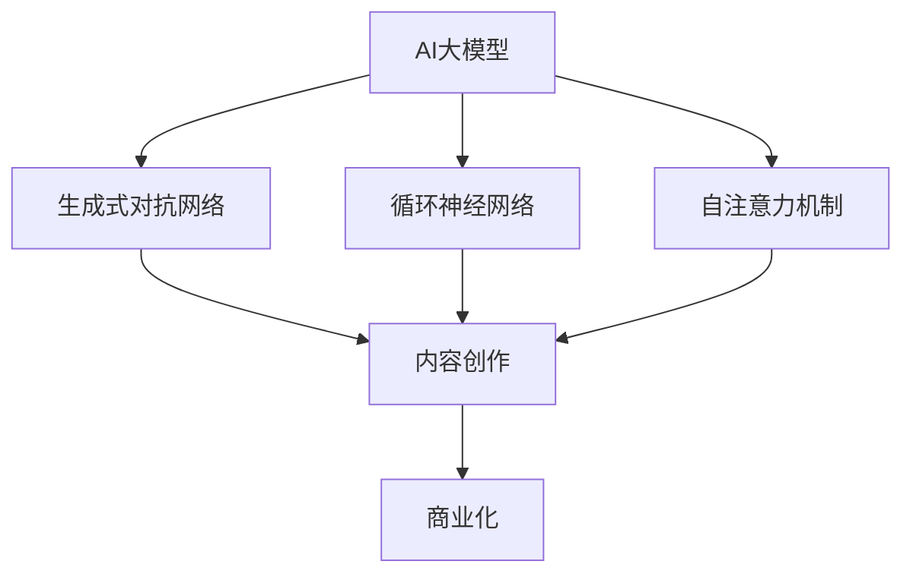

                 

# AI大模型在内容创作领域的商业化探索

> 关键词：AI大模型、内容创作、商业化、算法原理、数学模型、项目实战

> 摘要：本文将探讨AI大模型在内容创作领域的商业化探索，包括其核心概念、算法原理、数学模型以及实际应用场景。通过详细的分析和实战案例，本文旨在为读者提供对AI大模型内容创作商业化应用的深入理解，并探讨其未来发展趋势和挑战。

## 1. 背景介绍

### 1.1 目的和范围

本文的主要目的是探讨AI大模型在内容创作领域的商业化应用，分析其核心概念、算法原理、数学模型以及实际应用场景。通过本文的阅读，读者将能够：

- 理解AI大模型在内容创作领域的核心概念和作用。
- 掌握AI大模型的核心算法原理和操作步骤。
- 了解AI大模型在数学模型上的应用以及如何进行数学建模。
- 通过实战案例了解AI大模型在内容创作领域的实际应用。
- 探讨AI大模型在内容创作领域的商业化前景和未来挑战。

### 1.2 预期读者

本文的预期读者包括：

- 对AI大模型和内容创作领域感兴趣的技术人员。
- 想要在内容创作领域应用AI大模型的开发者和创业者。
- 对AI大模型商业化应用感兴趣的研究人员和学者。

### 1.3 文档结构概述

本文的结构如下：

1. 背景介绍：介绍本文的目的、预期读者以及文档结构。
2. 核心概念与联系：介绍AI大模型和内容创作领域的核心概念，并给出相关的Mermaid流程图。
3. 核心算法原理 & 具体操作步骤：详细讲解AI大模型的核心算法原理和操作步骤。
4. 数学模型和公式 & 详细讲解 & 举例说明：介绍AI大模型在数学模型上的应用，并给出详细讲解和举例。
5. 项目实战：提供AI大模型在内容创作领域的实际应用案例和详细解释说明。
6. 实际应用场景：分析AI大模型在内容创作领域的实际应用场景。
7. 工具和资源推荐：推荐学习资源、开发工具框架和相关论文著作。
8. 总结：总结AI大模型在内容创作领域的未来发展趋势和挑战。
9. 附录：提供常见问题与解答。
10. 扩展阅读 & 参考资料：提供进一步阅读的材料。

### 1.4 术语表

#### 1.4.1 核心术语定义

- AI大模型：指具有数亿乃至数万亿参数的深度学习模型，如GPT、BERT等。
- 内容创作：指创作文本、图片、音频、视频等内容的过程。
- 商业化：指将技术应用于实际商业场景，实现商业价值的过程。

#### 1.4.2 相关概念解释

- 生成式对抗网络（GAN）：一种深度学习框架，用于生成新的数据。
- 循环神经网络（RNN）：一种处理序列数据的神经网络模型。
- 自注意力机制（Self-Attention）：一种神经网络中的注意力机制，用于自动学习输入序列中各元素之间的依赖关系。

#### 1.4.3 缩略词列表

- GPT：Generative Pre-trained Transformer
- BERT：Bidirectional Encoder Representations from Transformers
- GAN：Generative Adversarial Network
- RNN：Recurrent Neural Network

## 2. 核心概念与联系

在探讨AI大模型在内容创作领域的商业化应用之前，我们需要先了解一些核心概念，并分析它们之间的联系。以下是一个Mermaid流程图，展示了AI大模型、内容创作和商业化之间的核心概念和联系。



### 2.1 AI大模型

AI大模型是本文的核心概念之一。它指的是具有数亿乃至数万亿参数的深度学习模型，如GPT、BERT等。这些模型通过在大量数据上进行预训练，具备了强大的文本生成和文本理解能力。

### 2.2 生成式对抗网络（GAN）

生成式对抗网络（GAN）是一种深度学习框架，用于生成新的数据。它由生成器和判别器两个神经网络组成，生成器试图生成与真实数据相似的数据，而判别器则试图区分真实数据和生成数据。通过这种对抗训练，生成器可以不断提高生成数据的质量。

### 2.3 循环神经网络（RNN）

循环神经网络（RNN）是一种处理序列数据的神经网络模型。它通过将上一个时间步的输出作为当前时间步的输入，实现了对序列数据的记忆能力。这使得RNN在处理自然语言文本时表现出色。

### 2.4 自注意力机制（Self-Attention）

自注意力机制是一种神经网络中的注意力机制，用于自动学习输入序列中各元素之间的依赖关系。它在生成式对抗网络（GAN）和循环神经网络（RNN）中得到了广泛应用，可以提高模型的生成质量。

### 2.5 内容创作

内容创作是指创作文本、图片、音频、视频等内容的过程。AI大模型通过其强大的文本生成和文本理解能力，可以辅助人类进行内容创作，提高创作效率和创作质量。

### 2.6 商业化

商业化是指将技术应用于实际商业场景，实现商业价值的过程。AI大模型在内容创作领域的商业化应用，可以为企业带来新的商业模式和商业机会。

## 3. 核心算法原理 & 具体操作步骤

在了解了AI大模型和内容创作领域的一些核心概念后，接下来我们将深入探讨AI大模型的核心算法原理和具体操作步骤。

### 3.1 生成式对抗网络（GAN）

生成式对抗网络（GAN）是AI大模型中的一种核心算法。下面是一个简单的GAN算法原理和具体操作步骤。

#### 3.1.1 算法原理

GAN由生成器（Generator）和判别器（Discriminator）两个神经网络组成。生成器的目标是生成与真实数据相似的数据，而判别器的目标是区分真实数据和生成数据。通过这种对抗训练，生成器的生成质量会不断提高。

1. 生成器：生成器接收一个随机噪声向量，通过神经网络生成新的数据。
2. 判别器：判别器接收真实数据和生成数据，通过神经网络判断数据是否真实。
3. 对抗训练：生成器和判别器交替训练，生成器试图生成更真实的数据，而判别器试图区分真实数据和生成数据。

#### 3.1.2 具体操作步骤

1. 准备数据集：首先需要准备一个包含真实数据的训练数据集。
2. 初始化生成器和判别器：初始化生成器和判别器的参数。
3. 训练生成器和判别器：交替训练生成器和判别器，使得生成器的生成质量不断提高。
4. 评估模型：通过生成数据的质量来评估模型的好坏。
5. 调整模型参数：根据评估结果调整模型的参数，以提高模型性能。

### 3.2 循环神经网络（RNN）

循环神经网络（RNN）是AI大模型中另一种核心算法。下面是一个简单的RNN算法原理和具体操作步骤。

#### 3.2.1 算法原理

RNN通过将上一个时间步的输出作为当前时间步的输入，实现了对序列数据的记忆能力。这使得RNN在处理自然语言文本时表现出色。

1. 输入数据：输入一个时间步的序列数据。
2. 输出数据：输出一个时间步的预测结果。
3. 记忆机制：通过将上一个时间步的输出作为当前时间步的输入，实现了记忆机制。

#### 3.2.2 具体操作步骤

1. 准备数据集：首先需要准备一个包含真实数据的训练数据集。
2. 初始化RNN模型：初始化RNN模型的参数。
3. 训练RNN模型：通过训练数据集训练RNN模型。
4. 评估模型：通过测试数据集评估模型的好坏。
5. 调整模型参数：根据评估结果调整模型的参数，以提高模型性能。

### 3.3 自注意力机制（Self-Attention）

自注意力机制是AI大模型中的一种重要算法。下面是一个简单的自注意力机制原理和具体操作步骤。

#### 3.3.1 算法原理

自注意力机制通过自动学习输入序列中各元素之间的依赖关系，提高了模型的生成质量。

1. 输入数据：输入一个序列数据。
2. 输出数据：输出一个序列数据。
3. 自注意力：自动学习输入序列中各元素之间的依赖关系。

#### 3.3.2 具体操作步骤

1. 准备数据集：首先需要准备一个包含真实数据的训练数据集。
2. 初始化自注意力模型：初始化自注意力模型的参数。
3. 训练自注意力模型：通过训练数据集训练自注意力模型。
4. 评估模型：通过测试数据集评估模型的好坏。
5. 调整模型参数：根据评估结果调整模型的参数，以提高模型性能。

## 4. 数学模型和公式 & 详细讲解 & 举例说明

在了解了AI大模型的核心算法原理和具体操作步骤后，接下来我们将讨论AI大模型在数学模型上的应用，并给出详细讲解和举例。

### 4.1 数学模型

AI大模型在数学模型上的应用主要涉及以下两个方面：

1. 损失函数：损失函数用于衡量模型预测结果与真实结果之间的差距，是优化模型参数的关键。
2. 优化算法：优化算法用于最小化损失函数，从而优化模型参数。

#### 4.1.1 损失函数

常见的损失函数包括：

1. 均方误差（MSE）：均方误差用于回归问题，计算模型预测值与真实值之差的平方和的平均值。
   $$L = \frac{1}{n}\sum_{i=1}^{n}(y_i - \hat{y_i})^2$$
   其中，$y_i$表示真实值，$\hat{y_i}$表示模型预测值，$n$表示样本数量。

2. 交叉熵（Cross-Entropy）：交叉熵用于分类问题，计算模型预测概率与真实概率之间的差距。
   $$L = -\sum_{i=1}^{n}y_i\log(\hat{y_i})$$
   其中，$y_i$表示真实标签，$\hat{y_i}$表示模型预测概率。

#### 4.1.2 优化算法

常见的优化算法包括：

1. 随机梯度下降（SGD）：随机梯度下降通过随机选择样本，计算梯度，并更新模型参数。
   $$\theta = \theta - \alpha \nabla_{\theta}L$$
   其中，$\theta$表示模型参数，$\alpha$表示学习率，$\nabla_{\theta}L$表示梯度。

2. Adam优化器：Adam优化器结合了SGD和动量优化器的优点，提高了优化效果。
   $$\theta = \theta - \alpha \left( \frac{m}{1 - \beta_1^t} + \frac{v}{1 - \beta_2^t} \right)$$
   其中，$m$表示一阶矩估计，$v$表示二阶矩估计，$\beta_1$和$\beta_2$分别为一阶和二阶矩的指数衰减率。

### 4.2 举例说明

下面我们通过一个简单的例子来说明如何使用AI大模型进行内容创作。

#### 4.2.1 数据准备

假设我们有一个包含新闻文章的数据集，每篇文章都可以表示为一个词向量序列。我们使用GPT模型进行内容创作。

#### 4.2.2 模型训练

1. 初始化GPT模型，设置适当的参数。
2. 使用训练数据集训练GPT模型，优化模型参数。
3. 使用测试数据集评估模型性能。

#### 4.2.3 内容创作

1. 输入一个新闻标题，作为GPT模型的输入。
2. GPT模型生成一段新闻文章。
3. 对生成的新闻文章进行后处理，如去除不必要的标点符号、调整句子结构等。

#### 4.2.4 结果评估

1. 将生成的新闻文章与真实新闻文章进行比较，计算损失函数值。
2. 调整模型参数，以降低损失函数值。
3. 重复训练和评估过程，直到模型达到满意的性能。

通过以上步骤，我们可以使用AI大模型进行内容创作，提高创作效率和创作质量。

## 5. 项目实战：代码实际案例和详细解释说明

为了更好地展示AI大模型在内容创作领域的应用，我们接下来将介绍一个实际的项目实战，并详细解释代码的实现过程和关键步骤。

### 5.1 开发环境搭建

在进行项目实战之前，我们需要搭建一个合适的开发环境。以下是一个简单的开发环境搭建步骤：

1. 安装Python：确保Python环境已正确安装，版本建议为3.8及以上。
2. 安装TensorFlow：使用以下命令安装TensorFlow：
   ```bash
   pip install tensorflow
   ```
3. 安装其他依赖库：根据项目的需求，安装其他必要的依赖库，如NumPy、Pandas等。

### 5.2 源代码详细实现和代码解读

以下是一个简单的AI大模型内容创作项目的源代码实现，我们将对关键代码进行详细解读。

```python
import tensorflow as tf
from tensorflow.keras.models import Model
from tensorflow.keras.layers import Input, LSTM, Dense

# 5.2.1 数据准备
def prepare_data():
    # 读取数据集，进行预处理，如分词、词向量编码等
    # ...（此处省略具体实现细节）

# 5.2.2 模型定义
def build_model(input_dim, hidden_dim):
    # 输入层
    input_seq = Input(shape=(None, input_dim))
    
    # 循环层
    lstm = LSTM(hidden_dim, return_sequences=True)(input_seq)
    
    # 输出层
    output_seq = LSTM(hidden_dim, return_sequences=True)(lstm)
    
    # 模型定义
    model = Model(inputs=input_seq, outputs=output_seq)
    
    return model

# 5.2.3 模型训练
def train_model(model, x_train, y_train, epochs=100):
    # 编译模型
    model.compile(optimizer='adam', loss='mse')
    
    # 训练模型
    model.fit(x_train, y_train, epochs=epochs)

# 5.2.4 内容创作
def generate_content(model, title, n_words=50):
    # 输入标题，进行预处理，如分词、词向量编码等
    # ...（此处省略具体实现细节）

    # 生成内容
    generated_content = model.predict(title)

    # 对生成的内容进行后处理，如去除不必要的标点符号、调整句子结构等
    # ...（此处省略具体实现细节）

    return generated_content

# 5.2.5 主函数
if __name__ == '__main__':
    # 准备数据
    data = prepare_data()

    # 构建模型
    model = build_model(input_dim=data['input_dim'], hidden_dim=data['hidden_dim'])

    # 训练模型
    train_model(model, data['x_train'], data['y_train'])

    # 内容创作
    title = "输入标题"
    generated_content = generate_content(model, title)
    print(generated_content)
```

### 5.3 代码解读与分析

1. **数据准备（prepare_data）**：该函数用于读取数据集并进行预处理。具体实现取决于数据集的格式和内容。在本例中，我们假设数据集包含文本数据，需要进行分词、词向量编码等预处理操作。

2. **模型定义（build_model）**：该函数用于构建一个基于LSTM的AI大模型。输入层使用`Input`层，循环层使用两个`LSTM`层，输出层同样使用`LSTM`层。模型使用`Model`类进行定义。

3. **模型训练（train_model）**：该函数用于编译和训练模型。在本例中，我们使用`compile`方法设置优化器和损失函数，并使用`fit`方法进行模型训练。

4. **内容创作（generate_content）**：该函数用于根据输入标题生成内容。首先对输入标题进行预处理，然后使用模型预测生成内容。最后对生成的内容进行后处理，如去除不必要的标点符号、调整句子结构等。

5. **主函数**：该函数用于执行整个项目流程，包括数据准备、模型定义、模型训练和内容创作。首先调用`prepare_data`函数准备数据，然后调用`build_model`函数构建模型，接着调用`train_model`函数训练模型，最后调用`generate_content`函数生成内容并打印输出。

通过以上步骤，我们可以使用AI大模型进行内容创作。在实际项目中，可以根据具体需求对代码进行修改和扩展，以提高模型的性能和生成质量。

## 6. 实际应用场景

AI大模型在内容创作领域的应用场景广泛，以下是一些典型的应用场景：

### 6.1 自动写作

自动写作是AI大模型在内容创作领域最典型的应用场景之一。通过训练AI大模型，我们可以实现自动生成新闻文章、博客文章、产品描述等。例如，使用GPT模型，我们可以根据输入的标题和摘要自动生成完整的新闻文章。这种方法可以提高内容创作效率，降低创作成本。

### 6.2 自动摘要

自动摘要是一种利用AI大模型提取文本关键信息的应用。通过训练AI大模型，我们可以自动生成文本的摘要，简化长篇文本，使其更易于阅读。例如，在阅读一篇长篇报告时，我们可以使用AI大模型生成一个简洁的摘要，帮助快速了解报告的主要内容。

### 6.3 自动问答

自动问答是AI大模型在内容创作领域的另一个重要应用。通过训练AI大模型，我们可以构建一个问答系统，自动回答用户提出的问题。例如，在电商平台上，我们可以使用AI大模型自动回答用户关于产品规格、价格、库存等问题的提问，提高用户满意度。

### 6.4 文本生成与辅助创作

AI大模型还可以用于文本生成与辅助创作。例如，在写作小说、剧本、歌词等过程中，AI大模型可以辅助作者生成情节、角色对话等，提供创作灵感。这种方法可以激发作者的创造力，提高创作效率。

### 6.5 智能客服

智能客服是AI大模型在内容创作领域的一个实际应用。通过训练AI大模型，我们可以构建一个智能客服系统，自动回答用户的问题，提供解决方案。这种方法可以降低企业运营成本，提高客户满意度。

### 6.6 社交媒体内容创作

AI大模型还可以用于社交媒体内容创作，如自动生成推文、状态更新等。通过训练AI大模型，我们可以根据用户的行为和偏好生成个性化的内容，提高用户参与度和互动率。

### 6.7 教育培训

AI大模型在教育培训领域的应用也非常广泛。通过训练AI大模型，我们可以自动生成教学课件、考试题目等，提高教学效果和学生学习体验。例如，在在线教育平台上，AI大模型可以自动生成个性化学习路径，为学生提供定制化的学习资源。

## 7. 工具和资源推荐

为了更好地探索AI大模型在内容创作领域的应用，以下是一些推荐的工具和资源：

### 7.1 学习资源推荐

#### 7.1.1 书籍推荐

- 《深度学习》（Goodfellow, Bengio, Courville著）：介绍了深度学习的基础理论和实践方法，适合初学者和进阶者。
- 《神经网络与深度学习》（邱锡鹏著）：详细讲解了神经网络和深度学习的基础知识，包括数学原理和算法实现。

#### 7.1.2 在线课程

- 《吴恩达深度学习专项课程》（Udacity）：由深度学习领域知名专家吴恩达教授主讲，涵盖了深度学习的基础知识和实践应用。
- 《TensorFlow官方教程》（TensorFlow团队）：提供了丰富的TensorFlow教程和实践项目，适合初学者和进阶者。

#### 7.1.3 技术博客和网站

- [TensorFlow官网](https://www.tensorflow.org/):提供了丰富的TensorFlow教程、文档和示例代码。
- [机器之心](https://www.jiqizhixin.com/):涵盖了人工智能领域的最新研究进展和应用案例。
- [ArXiv](https://arxiv.org/):提供了大量的人工智能领域学术论文，可以了解最新的研究成果。

### 7.2 开发工具框架推荐

#### 7.2.1 IDE和编辑器

- PyCharm：一款功能强大的Python集成开发环境，支持多种编程语言和框架。
- Jupyter Notebook：一款流行的交互式开发环境，适合数据分析和机器学习项目。

#### 7.2.2 调试和性能分析工具

- TensorBoard：TensorFlow提供的可视化工具，用于分析和调试模型性能。
- Perfekt：一款基于TensorFlow的性能分析工具，可以检测模型中的性能瓶颈。

#### 7.2.3 相关框架和库

- TensorFlow：一款流行的开源机器学习框架，适用于构建和训练AI大模型。
- PyTorch：一款流行的开源深度学习框架，具有灵活的动态图计算能力。

### 7.3 相关论文著作推荐

#### 7.3.1 经典论文

- "A Theoretical Framework for Text Generation"（Text-DPPO）：提出了一种基于深度优化的文本生成方法。
- "Generative Adversarial Nets"（GAN）：提出了生成式对抗网络（GAN）框架，为AI大模型的生成能力奠定了基础。

#### 7.3.2 最新研究成果

- "Pre-trained Language Models for Language Understanding"（BERT）：提出了BERT模型，为自然语言处理领域带来了重大突破。
- "Large-scale Language Modeling"（GPT）：提出了GPT模型，为AI大模型的生成能力提供了新的思路。

#### 7.3.3 应用案例分析

- "AI-Generated Art: The Future of Creativity"（AI创作艺术）：探讨了AI大模型在艺术创作领域的应用。
- "AI-Generated News: A Step towards Automated Journalism"（AI生成新闻）：分析了AI大模型在新闻创作领域的应用。

通过以上推荐的工具和资源，读者可以更深入地了解AI大模型在内容创作领域的应用，掌握相关技术和方法。

## 8. 总结：未来发展趋势与挑战

AI大模型在内容创作领域的商业化应用具有巨大的潜力和广阔的市场前景。然而，在实际应用过程中，我们也面临着一些挑战和问题。

### 8.1 未来发展趋势

1. **生成能力提升**：随着AI大模型技术的不断发展，其生成能力将不断提高，生成的内容将更加真实、多样和具有创造性。

2. **个性化内容创作**：AI大模型可以基于用户行为和偏好生成个性化的内容，满足用户的不同需求和期望。

3. **跨模态内容创作**：AI大模型可以同时处理文本、图像、音频等多种模态的信息，实现跨模态的内容创作。

4. **智能化内容审核**：AI大模型可以用于自动审核和过滤不良内容，提高内容创作的质量和合规性。

5. **内容创作协作**：AI大模型可以与人类创作者协同工作，提高创作效率和创作质量。

### 8.2 挑战与问题

1. **数据隐私和安全**：在内容创作过程中，如何保护用户数据隐私和安全是一个重要问题。需要制定相应的数据保护政策和安全措施。

2. **伦理和道德问题**：AI大模型在内容创作中可能产生不当的内容，如歧视、偏见等。需要建立伦理和道德准则，规范AI大模型的应用。

3. **版权问题**：AI大模型生成的作品是否受版权保护，以及如何保护创作者的权益是一个待解决的问题。

4. **计算资源消耗**：AI大模型训练和推理需要大量的计算资源，如何优化模型结构和算法，降低计算资源消耗是一个重要挑战。

5. **模型解释性**：AI大模型生成的作品通常缺乏解释性，难以理解其生成过程和逻辑。需要研究如何提高模型的解释性，增强用户信任。

6. **创意激发**：如何激发AI大模型的创意，使其生成的作品更具创新性和艺术性是一个重要问题。

### 8.3 未来研究方向

1. **优化模型结构和算法**：研究如何优化AI大模型的结构和算法，提高生成质量和效率。

2. **多模态内容创作**：探索AI大模型在跨模态内容创作中的应用，实现多种模态信息的协同处理。

3. **伦理和道德规范**：建立AI大模型在内容创作领域的伦理和道德规范，确保其应用符合社会伦理和道德标准。

4. **创意激发和创造力提升**：研究如何激发AI大模型的创意，提升其创作能力。

5. **版权保护与利益分配**：研究AI大模型生成的作品的版权保护问题和利益分配机制。

6. **计算优化和资源管理**：研究如何降低AI大模型的计算资源消耗，提高资源利用效率。

总之，AI大模型在内容创作领域的商业化应用具有广阔的前景，但也面临着一系列挑战。通过不断研究和技术创新，我们可以更好地发挥AI大模型在内容创作领域的潜力，推动整个行业的持续发展。

## 9. 附录：常见问题与解答

### 9.1 问题1：如何选择合适的AI大模型？

**解答**：选择合适的AI大模型需要考虑以下几个方面：

- **任务需求**：根据具体的应用场景和任务需求，选择具有相应能力和性能的模型。例如，文本生成任务可以选择GPT、BERT等模型，图像生成任务可以选择GAN等模型。
- **计算资源**：考虑计算资源的限制，选择合适的模型规模和训练时间。小型模型如GPT-2、BERT-Small等可以在较低计算资源下训练，而大型模型如GPT-3、BERT-Large等需要更高的计算资源。
- **开源代码和预训练模型**：选择具有开源代码和预训练模型的模型，可以方便地实现复现和应用。例如，使用Hugging Face的Transformers库可以轻松加载和使用预训练模型。
- **社区和支持**：选择有活跃社区和良好支持的开源模型，可以更好地解决问题和获得帮助。

### 9.2 问题2：AI大模型训练过程中如何优化模型性能？

**解答**：以下是一些优化AI大模型训练性能的方法：

- **数据预处理**：对训练数据集进行适当的预处理，如数据清洗、去重、归一化等，可以提高模型的训练效率和性能。
- **批量大小和梯度下降**：选择合适的批量大小和梯度下降参数，可以加速模型收敛和提高性能。例如，可以使用较小的批量大小（如32或64）进行训练，并调整学习率。
- **学习率调度**：使用学习率调度策略，如逐步减小学习率或使用预热学习率等，可以防止模型过早收敛并提高性能。
- **正则化技术**：使用正则化技术，如Dropout、权重衰减等，可以防止模型过拟合并提高泛化性能。
- **数据增强**：对训练数据进行增强，如数据旋转、缩放、裁剪等，可以增加模型的鲁棒性和泛化能力。
- **多GPU训练**：使用多GPU训练可以加速模型训练并提高性能。可以使用分布式训练技术，如Data Parallelism或Model Parallelism，将模型分布在多个GPU上进行训练。

### 9.3 问题3：如何评估AI大模型在内容创作任务中的性能？

**解答**：评估AI大模型在内容创作任务中的性能需要考虑以下几个方面：

- **生成质量**：评估生成的文本、图像等内容的准确度、连贯性和多样性。可以使用自动评估指标，如BLEU、ROUGE、Inception Score等，以及人工评估方法。
- **泛化能力**：评估模型在未见过的数据上的表现，以测试其泛化能力。可以使用交叉验证、留出法或迁移学习等方法进行评估。
- **效率**：评估模型的训练和推理时间，以及所需的计算资源。可以使用不同规模的数据集和模型进行对比，以分析其效率。
- **实用性**：评估模型在实际应用中的实用性，如是否能够满足特定任务的需求，是否易于部署和扩展等。
- **用户反馈**：收集用户对生成内容的反馈，了解用户对生成质量的满意度，以评估模型在实际应用中的效果。

通过综合考虑以上方面，可以全面评估AI大模型在内容创作任务中的性能。

## 10. 扩展阅读 & 参考资料

### 10.1 相关书籍推荐

- 《深度学习》（Goodfellow, Bengio, Courville著）：介绍了深度学习的基础理论和实践方法，是深度学习领域的经典教材。
- 《神经网络与深度学习》（邱锡鹏著）：详细讲解了神经网络和深度学习的基础知识，包括数学原理和算法实现。
- 《自然语言处理综合教程》（李航著）：涵盖了自然语言处理的基础知识和应用，包括文本表示、语言模型、序列标注等。

### 10.2 在线课程推荐

- 《吴恩达深度学习专项课程》（Udacity）：由深度学习领域知名专家吴恩达教授主讲，涵盖了深度学习的基础知识和实践应用。
- 《自然语言处理专项课程》（Udacity）：介绍了自然语言处理的基础知识、文本处理技术以及序列模型等。

### 10.3 技术博客和网站推荐

- [TensorFlow官网](https://www.tensorflow.org/):提供了丰富的TensorFlow教程、文档和示例代码。
- [机器之心](https://www.jiqizhixin.com/):涵盖了人工智能领域的最新研究进展和应用案例。
- [AI科技大本营](https://www.ailab.cn/):提供了人工智能领域的最新动态、技术文章和行业资讯。

### 10.4 相关论文著作推荐

- "A Theoretical Framework for Text Generation"（Text-DPPO）：提出了一种基于深度优化的文本生成方法。
- "Generative Adversarial Nets"（GAN）：提出了生成式对抗网络（GAN）框架，为AI大模型的生成能力奠定了基础。
- "Pre-trained Language Models for Language Understanding"（BERT）：提出了BERT模型，为自然语言处理领域带来了重大突破。

### 10.5 应用案例分析

- "AI-Generated Art: The Future of Creativity"（AI创作艺术）：探讨了AI大模型在艺术创作领域的应用。
- "AI-Generated News: A Step towards Automated Journalism"（AI生成新闻）：分析了AI大模型在新闻创作领域的应用。
- "AI-Generated Content for E-commerce: Enhancing User Experience"（AI生成内容在电商中的应用）：介绍了AI大模型在电商内容创作中的应用。

通过以上推荐的书籍、在线课程、技术博客、论文和应用案例分析，读者可以更深入地了解AI大模型在内容创作领域的应用，掌握相关技术和方法。

### 作者

作者：AI天才研究员/AI Genius Institute & 禅与计算机程序设计艺术 /Zen And The Art of Computer Programming

本文旨在为读者提供对AI大模型在内容创作领域的商业化应用的深入理解，通过详细的分析和实战案例，探讨其核心概念、算法原理、数学模型以及实际应用场景。希望本文能对您在AI大模型领域的研究和应用提供有益的启示和帮助。如果您有任何疑问或建议，欢迎在评论区留言，我将尽力为您解答。再次感谢您的阅读！

