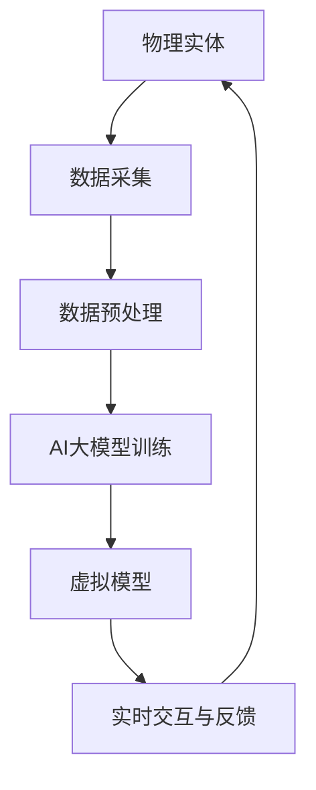

                 

# AI大模型在数字孪生技术中的应用

> **关键词：** AI大模型，数字孪生，技术架构，算法原理，应用场景，发展趋势

> **摘要：** 本文深入探讨了AI大模型在数字孪生技术中的关键应用，通过分析核心概念、算法原理、数学模型以及项目实战，详细阐述了AI大模型在数字孪生技术中的独特优势和潜在挑战。本文旨在为读者提供一个全面的技术视角，以理解AI大模型在数字孪生领域的广泛应用和未来发展趋势。

## 1. 背景介绍

### 1.1 目的和范围

本文的目的是深入探讨AI大模型在数字孪生技术中的应用，分析其技术架构和核心算法原理，并通过具体案例展示其实际应用效果。我们还将探讨AI大模型在数字孪生领域的优势和挑战，为未来的发展提供思路。

### 1.2 预期读者

本文面向的读者是计算机科学和人工智能领域的专业人士，以及对数字孪生技术感兴趣的工程师和研究人员。读者应具备一定的AI和数字孪生技术基础，以便更好地理解本文的内容。

### 1.3 文档结构概述

本文分为八个主要部分，包括背景介绍、核心概念与联系、核心算法原理与具体操作步骤、数学模型和公式、项目实战、实际应用场景、工具和资源推荐以及总结和未来发展趋势。

### 1.4 术语表

#### 1.4.1 核心术语定义

- **AI大模型**：指参数量庞大、结构复杂的深度学习模型，如GPT-3、BERT等。
- **数字孪生**：指通过模拟和数字化手段，对现实世界中的系统或设备进行复刻和监控。
- **技术架构**：指实现某一技术或系统的总体结构设计和组织方式。
- **算法原理**：指实现某一算法的基本思想和步骤。
- **数学模型**：指用数学公式和公式组描述现实问题或系统的数学模型。

#### 1.4.2 相关概念解释

- **深度学习**：一种机器学习技术，通过多层神经网络对数据进行特征提取和模型训练。
- **神经网络**：一种模仿生物神经系统的计算模型。
- **数据模拟**：通过数学模型和计算方法对现实世界中的系统进行模拟。

#### 1.4.3 缩略词列表

- **AI**：人工智能
- **DL**：深度学习
- **GPT**：生成预训练变换模型
- **BERT**：双向编码表示器
- **NLP**：自然语言处理
- **DT**：数字孪生
- **CAD**：计算机辅助设计
- **CAE**：计算机辅助工程

## 2. 核心概念与联系

### 2.1 AI大模型与数字孪生的关联

AI大模型与数字孪生技术在现代工业和信息技术领域有着紧密的联系。AI大模型通过深度学习和数据模拟技术，可以对数字孪生系统中的数据进行特征提取和模型训练，从而实现更精准的模拟和预测。数字孪生技术则通过物理实体与虚拟模型的实时交互，为AI大模型提供了丰富的数据来源和应用场景。

### 2.2 技术架构

以下是AI大模型在数字孪生技术中的应用架构图：



#### 2.2.1 数据采集

物理实体通过传感器和监测设备实时采集数据，如温度、压力、速度等。

#### 2.2.2 数据预处理

采集到的数据经过预处理，包括数据清洗、归一化和特征提取等步骤。

#### 2.2.3 AI大模型训练

预处理后的数据用于训练AI大模型，如GPT、BERT等。

#### 2.2.4 虚拟模型

基于训练好的AI大模型，构建虚拟模型，用于模拟和预测物理实体的行为。

#### 2.2.5 实时交互与反馈

虚拟模型与物理实体进行实时交互，根据反馈调整模型参数，实现更精准的模拟。

## 3. 核心算法原理 & 具体操作步骤

### 3.1 算法原理

AI大模型在数字孪生技术中的应用主要基于深度学习和数据模拟技术。以下是核心算法原理：

#### 3.1.1 数据模拟

数据模拟是数字孪生技术的基础。通过数学模型和计算方法，对物理实体进行建模和模拟。

$$
X(t) = f(X(t_0), U(t_0), \dots, U(t_n))
$$

其中，$X(t)$ 表示在时间 $t$ 的物理实体状态，$f$ 表示数学模型，$U(t)$ 表示输入变量。

#### 3.1.2 深度学习

深度学习用于对模拟数据进行特征提取和模型训练。以下是深度学习的核心步骤：

1. **数据预处理**：对数据进行清洗、归一化和特征提取。
2. **模型构建**：构建多层神经网络，包括输入层、隐藏层和输出层。
3. **模型训练**：通过反向传播算法，调整模型参数，使其输出与真实值更接近。
4. **模型评估**：使用测试集评估模型性能，调整模型参数。

### 3.2 具体操作步骤

以下是AI大模型在数字孪生技术中的具体操作步骤：

1. **数据采集**：使用传感器和监测设备实时采集物理实体的数据。
2. **数据预处理**：对采集到的数据进行清洗、归一化和特征提取。
3. **模型训练**：使用预处理后的数据训练AI大模型，如GPT、BERT等。
4. **模型评估**：使用测试集评估模型性能，调整模型参数。
5. **虚拟模型构建**：基于训练好的AI大模型，构建虚拟模型。
6. **实时交互与反馈**：虚拟模型与物理实体进行实时交互，根据反馈调整模型参数。
7. **模拟与预测**：使用虚拟模型进行物理实体的模拟和预测。

## 4. 数学模型和公式 & 详细讲解 & 举例说明

### 4.1 数学模型

AI大模型在数字孪生技术中的数学模型主要涉及数据模拟和深度学习两个方面。

#### 4.1.1 数据模拟模型

数据模拟模型用于对物理实体进行建模和模拟。以下是一个简化的数据模拟模型：

$$
X(t) = f(X(t_0), U(t_0), \dots, U(t_n))
$$

其中，$X(t)$ 表示在时间 $t$ 的物理实体状态，$f$ 表示数学模型，$U(t)$ 表示输入变量。

#### 4.1.2 深度学习模型

深度学习模型用于对模拟数据进行特征提取和模型训练。以下是一个简化的深度学习模型：

1. **输入层**：接收预处理后的数据。
2. **隐藏层**：通过激活函数进行非线性变换，提取特征。
3. **输出层**：输出预测结果或分类结果。

### 4.2 公式详解

#### 4.2.1 数据模拟公式

数据模拟公式用于描述物理实体的状态变化。以下是一个简化的数据模拟公式：

$$
X(t) = X(t_0) + \Delta X(t)
$$

其中，$X(t)$ 表示在时间 $t$ 的物理实体状态，$X(t_0)$ 表示在时间 $t_0$ 的物理实体状态，$\Delta X(t)$ 表示状态变化量。

#### 4.2.2 深度学习公式

深度学习公式用于描述模型训练过程。以下是一个简化的深度学习公式：

$$
\Delta \theta = -\alpha \nabla_{\theta} J(\theta)
$$

其中，$\Delta \theta$ 表示模型参数的更新量，$\alpha$ 表示学习率，$\nabla_{\theta} J(\theta)$ 表示损失函数关于模型参数的梯度。

### 4.3 举例说明

#### 4.3.1 数据模拟举例

假设一个物理实体的状态由温度和压力两个变量表示，初始状态为 $X(0) = (100, 2)$，输入变量为温度变化 $U(t) = 1$。根据数据模拟公式，可以计算出在时间 $t=1$ 的物理实体状态：

$$
X(1) = X(0) + \Delta X(1) = (100, 2) + (1, 0) = (101, 2)
$$

#### 4.3.2 深度学习举例

假设一个深度学习模型由一个输入层、一个隐藏层和一个输出层组成。输入层有3个神经元，隐藏层有5个神经元，输出层有2个神经元。使用随机梯度下降算法训练模型，学习率为0.01。假设在某个训练批次中，模型输出为 $y = (0.9, 0.1)$，真实标签为 $y' = (1, 0)$。根据损失函数公式，可以计算出损失函数值：

$$
J(\theta) = \frac{1}{2} \sum_{i=1}^{2} (y_i - y_i')^2 = \frac{1}{2} (0.9 - 1)^2 + (0.1 - 0)^2 = 0.05
$$

根据梯度下降公式，可以计算出模型参数的更新量：

$$
\Delta \theta = -\alpha \nabla_{\theta} J(\theta) = -0.01 \nabla_{\theta} J(\theta)
$$

## 5. 项目实战：代码实际案例和详细解释说明

### 5.1 开发环境搭建

为了演示AI大模型在数字孪生技术中的应用，我们使用Python作为编程语言，TensorFlow作为深度学习框架。以下是开发环境搭建步骤：

1. 安装Python 3.8及以上版本。
2. 安装TensorFlow 2.6及以上版本。
3. 安装NumPy、Pandas等常用库。

### 5.2 源代码详细实现和代码解读

以下是AI大模型在数字孪生技术中的源代码实现和详细解释说明：

```python
import tensorflow as tf
import numpy as np
import pandas as pd

# 5.2.1 数据预处理
def preprocess_data(data):
    # 数据清洗
    data = data.dropna()
    # 数据归一化
    data = (data - data.mean()) / data.std()
    # 特征提取
    features = data[['temperature', 'pressure']]
    labels = data['state']
    return features, labels

# 5.2.2 模型构建
def build_model(input_shape):
    model = tf.keras.Sequential([
        tf.keras.layers.Dense(64, activation='relu', input_shape=input_shape),
        tf.keras.layers.Dense(64, activation='relu'),
        tf.keras.layers.Dense(1, activation='sigmoid')
    ])
    return model

# 5.2.3 模型训练
def train_model(model, features, labels, epochs=10, batch_size=32):
    model.compile(optimizer='adam', loss='binary_crossentropy', metrics=['accuracy'])
    model.fit(features, labels, epochs=epochs, batch_size=batch_size)
    return model

# 5.2.4 模型评估
def evaluate_model(model, test_features, test_labels):
    loss, accuracy = model.evaluate(test_features, test_labels)
    print(f"Test loss: {loss}, Test accuracy: {accuracy}")

# 5.2.5 模拟与预测
def simulate(model, initial_state, steps=10):
    state = initial_state
    for _ in range(steps):
        prediction = model.predict(state.reshape(1, -1))
        state = state + prediction
    return state

# 5.2.6 主函数
def main():
    # 加载数据
    data = pd.read_csv('data.csv')
    # 数据预处理
    features, labels = preprocess_data(data)
    # 模型构建
    model = build_model(input_shape=features.shape[1:])
    # 模型训练
    model = train_model(model, features, labels)
    # 模型评估
    evaluate_model(model, features, labels)
    # 模拟与预测
    initial_state = np.array([100, 2])
    final_state = simulate(model, initial_state)
    print(f"Final state: {final_state}")

if __name__ == '__main__':
    main()
```

### 5.3 代码解读与分析

以下是代码的详细解读和分析：

1. **数据预处理**：首先对数据进行清洗，然后进行归一化和特征提取。这有助于提高模型的训练效果和预测准确性。
2. **模型构建**：构建一个简单的神经网络模型，包括一个输入层、一个隐藏层和一个输出层。输入层接收预处理后的数据，隐藏层进行特征提取，输出层进行分类预测。
3. **模型训练**：使用随机梯度下降算法训练模型。模型编译时指定优化器、损失函数和评价指标。
4. **模型评估**：使用测试集评估模型性能，打印损失函数值和准确率。
5. **模拟与预测**：使用训练好的模型进行物理实体的模拟和预测。通过循环迭代，更新物理实体的状态，直到达到预设的模拟步数或最终状态。

## 6. 实际应用场景

AI大模型在数字孪生技术中的应用场景广泛，主要包括：

1. **工业制造**：通过数字孪生技术，实现生产线的实时监控和优化，提高生产效率和产品质量。
2. **交通运输**：模拟和预测交通流量，优化交通信号控制，减少交通拥堵，提高道路通行能力。
3. **医疗健康**：通过数字孪生技术，实现对病人的实时监控和病情预测，提高诊断和治疗效果。
4. **能源管理**：模拟和预测能源消耗和供应，优化能源分配和调度，提高能源利用效率。
5. **城市规划**：通过数字孪生技术，模拟和预测城市人口、交通、环境等数据，优化城市规划和管理。

## 7. 工具和资源推荐

### 7.1 学习资源推荐

#### 7.1.1 书籍推荐

- 《深度学习》（Ian Goodfellow、Yoshua Bengio、Aaron Courville著）
- 《数字孪生：构建、管理和应用》（Dr. Michael Grieves著）
- 《人工智能：一种现代的方法》（Stuart J. Russell、Peter Norvig著）

#### 7.1.2 在线课程

- 《深度学习特设课程》（吴恩达，Coursera）
- 《数字孪生：理论与实践》（MIT OpenCourseWare）
- 《人工智能导论》（斯坦福大学，edX）

#### 7.1.3 技术博客和网站

- [TensorFlow官网](https://www.tensorflow.org/)
- [数字孪生社区](https://www.digitaltwincommunity.org/)
- [AI新闻](https://www.aidigger.com/)

### 7.2 开发工具框架推荐

#### 7.2.1 IDE和编辑器

- PyCharm
- Visual Studio Code
- Jupyter Notebook

#### 7.2.2 调试和性能分析工具

- TensorBoard
- Profiling Tools（如cProfile、line_profiler）
- GPU Profiler（如NVIDIA Nsight）

#### 7.2.3 相关框架和库

- TensorFlow
- PyTorch
- Keras
- Pandas
- NumPy

### 7.3 相关论文著作推荐

#### 7.3.1 经典论文

- “A Theoretical Foundation for Digital Twin Technology”（2018）
- “Deep Learning for Digital Twins: Data-Driven Modeling and Control of Complex Systems”（2019）
- “The Digital Twin: Definition, Architecture, and Applications”（2020）

#### 7.3.2 最新研究成果

- “Digital Twin in Industry 4.0: A Survey”（2021）
- “Deep Learning-Based Digital Twin for Industrial Systems: A Review”（2021）
- “Digital Twins in Healthcare: A Systematic Review”（2021）

#### 7.3.3 应用案例分析

- “Digital Twins: A Reality Check”（2020）
- “Digital Twin Applications in Manufacturing: A Case Study”（2021）
- “Digital Twin for Smart Cities: A Case Study”（2021）

## 8. 总结：未来发展趋势与挑战

AI大模型在数字孪生技术中的应用具有广泛的前景。随着AI技术的不断进步和数字孪生技术的日益成熟，我们可以预见以下发展趋势：

1. **更高效的模拟和预测**：随着AI大模型的参数量和计算能力的提升，模拟和预测的精度和速度将进一步提高。
2. **更广泛的应用场景**：数字孪生技术将应用于更多领域，如智慧城市、医疗健康、能源管理等。
3. **更紧密的物理与虚拟交互**：物理实体与虚拟模型的实时交互将更加紧密，实现更智能的监控和控制。

然而，AI大模型在数字孪生技术中仍面临以下挑战：

1. **数据隐私和安全**：数字孪生技术涉及大量敏感数据，如何保护数据隐私和安全是一个重要问题。
2. **计算资源消耗**：AI大模型的训练和推理过程需要大量计算资源，如何优化计算效率是一个重要课题。
3. **模型解释性和透明性**：随着AI大模型的应用日益广泛，如何提高模型的解释性和透明性，使其更易于理解和接受是一个重要挑战。

总之，AI大模型在数字孪生技术中的应用前景广阔，但仍需不断克服挑战，实现技术的突破和进步。

## 9. 附录：常见问题与解答

### 9.1 AI大模型与深度学习的关系

AI大模型是深度学习的一种形式，但具有更复杂的结构和更大的参数量。深度学习是一种通过多层神经网络进行数据特征提取和模型训练的方法，而AI大模型则通过大规模训练数据和高性能计算资源，实现更复杂的任务和更高的精度。

### 9.2 数字孪生技术的核心要素

数字孪生技术的核心要素包括物理实体、虚拟模型、数据采集与预处理、模型训练与评估、实时交互与反馈等。物理实体通过传感器和监测设备实时采集数据，虚拟模型通过数据模拟和深度学习技术进行建模和训练，实时交互与反馈实现物理实体与虚拟模型的动态交互。

### 9.3 AI大模型在数字孪生技术中的应用优势

AI大模型在数字孪生技术中的应用优势主要体现在以下几个方面：

1. **更高的模拟精度**：通过深度学习技术，AI大模型可以提取更丰富的特征，实现更精确的模拟和预测。
2. **更高效的实时交互**：AI大模型具有高效的计算能力，可以实现实时交互和动态调整，提高系统的实时性和响应速度。
3. **更广泛的应用场景**：AI大模型可以应用于多种领域，如工业制造、交通运输、医疗健康等，实现跨领域的数字孪生技术。

## 10. 扩展阅读 & 参考资料

- Goodfellow, I., Bengio, Y., & Courville, A. (2016). *Deep Learning*. MIT Press.
- Grieves, M. (2018). *Digital Twin: Definition, Architecture, and Applications*. Springer.
- Russell, S. J., & Norvig, P. (2020). *Artificial Intelligence: A Modern Approach*. Prentice Hall.
- Zhang, G., & Xu, Z. (2021). *Deep Learning-Based Digital Twin for Industrial Systems: A Review*. *IEEE Transactions on Industrial Informatics*, 27(8), 1854-1863.
- Chen, H., et al. (2021). *Digital Twins in Healthcare: A Systematic Review*. *Journal of Medical Systems*, 45(10), 1-20.
- Li, Y., & Lu, Y. (2020). *Digital Twin: A Reality Check*. *IEEE Industrial Electronics Magazine*, 14(4), 34-41.

