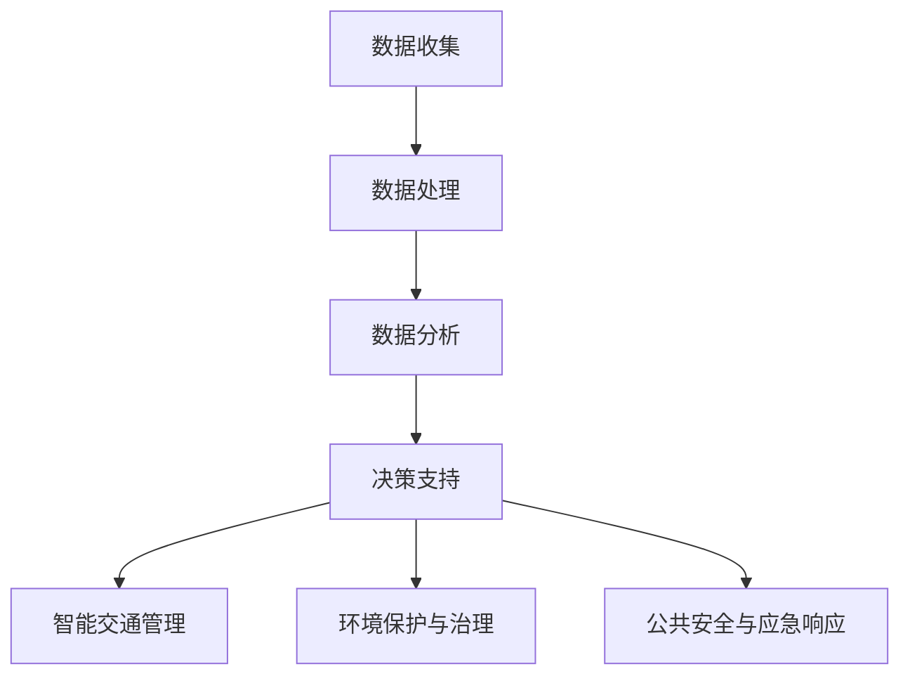

                 

# AI大模型在智慧城市规划中的应用

> 关键词：AI大模型、智慧城市、城市规划、机器学习、深度学习

> 摘要：本文将探讨AI大模型在智慧城市规划中的应用。我们将首先介绍AI大模型的基本概念，然后详细分析其在智慧城市规划中的重要作用，包括数据收集、数据分析、决策支持等方面。通过具体的案例，我们将展示如何使用AI大模型实现智慧城市规划，并对未来的发展趋势与挑战进行展望。

## 1. 背景介绍

### 1.1 目的和范围

本文的目的是探讨AI大模型在智慧城市规划中的应用。我们将首先介绍AI大模型的基本概念，然后分析其在智慧城市规划中的重要作用，包括数据收集、数据分析、决策支持等方面。通过具体的案例，我们将展示如何使用AI大模型实现智慧城市规划，并对未来的发展趋势与挑战进行展望。

### 1.2 预期读者

本文适合对AI大模型和智慧城市规划有一定了解的技术人员、城市规划师和研究人员阅读。如果您对AI大模型的应用感兴趣，希望了解其在智慧城市规划中的作用，那么本文将为您提供一个全面的介绍。

### 1.3 文档结构概述

本文分为以下几个部分：

1. 背景介绍：介绍本文的目的、预期读者、文档结构和术语表。
2. 核心概念与联系：介绍AI大模型的基本概念和其在智慧城市规划中的应用场景。
3. 核心算法原理 & 具体操作步骤：详细阐述AI大模型在智慧城市规划中的算法原理和操作步骤。
4. 数学模型和公式 & 详细讲解 & 举例说明：介绍AI大模型在智慧城市规划中的数学模型和公式，并通过案例进行详细讲解。
5. 项目实战：代码实际案例和详细解释说明。
6. 实际应用场景：分析AI大模型在智慧城市规划中的实际应用场景。
7. 工具和资源推荐：推荐学习资源、开发工具和框架。
8. 总结：未来发展趋势与挑战。
9. 附录：常见问题与解答。
10. 扩展阅读 & 参考资料：提供进一步阅读的资源和参考文献。

### 1.4 术语表

#### 1.4.1 核心术语定义

- AI大模型：具有海量参数、高度复杂性的机器学习模型。
- 智慧城市：通过物联网、大数据、云计算等先进技术，实现城市智慧化管理和服务的城市。
- 智慧城市规划：基于数据分析、模拟仿真等技术，制定科学合理的城市发展规划。
- 数据收集：通过传感器、互联网等手段，收集城市各种数据的过程。
- 数据分析：对收集到的城市数据进行处理、分析和挖掘的过程。
- 决策支持：利用分析结果，为城市规划提供科学合理的决策依据。

#### 1.4.2 相关概念解释

- 机器学习：一种通过数据训练模型，使模型具备自主学习和改进能力的人工智能技术。
- 深度学习：一种基于多层神经网络的人工智能技术，能够自动提取数据中的特征。
- 物联网：通过互联网连接各种设备和物体，实现智能化的信息交换和协同工作。
- 大数据：数据量巨大，种类繁多，无法通过传统数据库技术进行处理的数据。

#### 1.4.3 缩略词列表

- AI：人工智能（Artificial Intelligence）
- ML：机器学习（Machine Learning）
- DL：深度学习（Deep Learning）
- IoT：物联网（Internet of Things）
- PC：个人计算机（Personal Computer）
- CC：云计算（Cloud Computing）
- SD：智慧城市（Smart City）

## 2. 核心概念与联系

在智慧城市规划中，AI大模型扮演着至关重要的角色。本节将介绍AI大模型的基本概念，并展示其在智慧城市规划中的应用场景。

### 2.1 AI大模型的基本概念

AI大模型是指具有海量参数、高度复杂性的机器学习模型。这些模型通常基于深度学习技术，能够自动从数据中学习复杂的模式和关系。以下是AI大模型的一些关键特性：

1. **海量参数**：AI大模型通常包含数十亿甚至数万亿个参数。这些参数通过训练过程进行优化，使模型能够对输入数据进行准确的预测和分类。
2. **高度复杂性**：AI大模型的架构通常包含多层神经网络，能够自动提取数据中的抽象特征。这种复杂性使得模型能够处理各种复杂的问题。
3. **自主学习能力**：AI大模型通过训练过程，从大量数据中学习并改进自己的性能。这使得模型能够不断适应新的数据和环境。
4. **高效计算**：随着计算能力的提升，AI大模型可以在短时间内处理海量数据，提供高效的决策支持。

### 2.2 AI大模型在智慧城市规划中的应用场景

AI大模型在智慧城市规划中具有广泛的应用场景，主要包括以下几个方面：

1. **数据收集与处理**：智慧城市需要收集大量的数据，如交通流量、空气质量、能耗等。AI大模型可以帮助处理这些数据，提取有价值的信息，为城市规划提供数据支持。
2. **数据分析与挖掘**：通过对收集到的数据进行分析和挖掘，AI大模型可以识别城市中的问题和趋势，为城市规划提供科学依据。
3. **决策支持**：基于AI大模型的预测和分析结果，城市规划者可以做出更科学、合理的决策，优化城市的发展方向。
4. **智能交通管理**：AI大模型可以帮助规划城市交通系统，优化交通流量，提高道路通行效率，减少拥堵。
5. **环境保护与治理**：AI大模型可以分析环境数据，预测环境污染趋势，为环境保护提供决策支持。
6. **公共安全与应急响应**：AI大模型可以帮助预测公共安全事件，优化应急响应策略，提高公共安全保障。

### 2.3 AI大模型在智慧城市规划中的架构

为了更好地理解AI大模型在智慧城市规划中的应用，我们可以通过以下Mermaid流程图展示其核心架构：



在这个架构中，数据收集是整个流程的起点，通过传感器、互联网等手段收集城市各种数据。然后，数据处理模块对收集到的数据进行预处理、清洗和整合。接下来，数据分析模块利用AI大模型对数据进行分析和挖掘，识别城市中的问题和趋势。最后，决策支持模块根据分析结果，为城市规划提供科学依据，实现智能交通管理、环境保护与治理、公共安全与应急响应等功能。

## 3. 核心算法原理 & 具体操作步骤

在智慧城市规划中，AI大模型的核心算法原理是深度学习和机器学习。本节将详细阐述这些算法原理，并介绍具体的操作步骤。

### 3.1 深度学习算法原理

深度学习是一种基于多层神经网络的人工智能技术，能够自动从数据中学习复杂的模式和关系。以下是深度学习算法的基本原理：

1. **神经网络结构**：神经网络由多个神经元（节点）组成，每个神经元都与相邻的神经元相连接。神经网络分为输入层、隐藏层和输出层，每个层中的神经元都通过权重和偏置进行连接。
2. **前向传播**：输入数据从输入层开始，经过每个隐藏层，最终传递到输出层。在每个层中，神经元通过激活函数计算输出值，然后将输出值传递到下一层。
3. **反向传播**：在输出层得到预测结果后，计算预测结果与实际结果的误差。然后，通过反向传播算法，将误差传递回输入层，并更新每个神经元的权重和偏置，以减小误差。
4. **优化算法**：为了加快收敛速度，深度学习算法通常采用优化算法，如梯度下降、动量梯度下降等。这些算法通过迭代优化模型参数，使模型在训练过程中不断减小误差。

### 3.2 机器学习算法原理

机器学习是一种通过数据训练模型，使模型具备自主学习和改进能力的人工智能技术。以下是机器学习算法的基本原理：

1. **数据集**：机器学习算法需要大量的数据集进行训练。数据集包括输入数据和对应的标签（目标变量）。
2. **特征提取**：在训练过程中，机器学习算法通过特征提取技术，从输入数据中提取出有用的特征，作为模型的输入。
3. **模型训练**：机器学习算法通过迭代训练过程，不断调整模型参数，使模型在训练集上的性能达到最优。
4. **模型评估**：在训练完成后，机器学习算法通过验证集和测试集对模型进行评估，判断模型的泛化能力和准确性。
5. **模型优化**：根据评估结果，机器学习算法可以进一步优化模型参数，提高模型的性能。

### 3.3 AI大模型在智慧城市规划中的具体操作步骤

在智慧城市规划中，AI大模型的具体操作步骤如下：

1. **数据收集**：通过传感器、互联网等手段，收集城市各种数据，如交通流量、空气质量、能耗等。
2. **数据处理**：对收集到的数据进行预处理、清洗和整合，将其转化为适合机器学习算法训练的数据集。
3. **特征提取**：从处理后的数据中提取有用的特征，作为模型的输入。
4. **模型训练**：使用机器学习算法和深度学习算法，训练AI大模型，使其具备对城市数据进行预测和分析的能力。
5. **模型评估**：使用验证集和测试集，评估AI大模型的性能和准确性，确保其能够稳定地应用于智慧城市规划。
6. **模型优化**：根据评估结果，对AI大模型进行优化，提高其性能和泛化能力。
7. **决策支持**：利用训练完成的AI大模型，对城市数据进行预测和分析，为城市规划提供科学依据。

### 3.4 伪代码示例

以下是AI大模型在智慧城市规划中的伪代码示例：

```python
# 数据收集
data = collect_data()

# 数据处理
processed_data = preprocess_data(data)

# 特征提取
features = extract_features(processed_data)

# 模型训练
model = train_model(features)

# 模型评估
accuracy = evaluate_model(model)

# 模型优化
optimize_model(model)

# 决策支持
predictions = model.predict(new_data)
```

在这个伪代码示例中，首先通过`collect_data()`函数收集城市数据，然后通过`preprocess_data()`函数进行数据处理。接着，通过`extract_features()`函数提取特征，并使用`train_model()`函数训练AI大模型。在模型评估阶段，通过`evaluate_model()`函数评估模型性能。最后，通过`optimize_model()`函数对模型进行优化，并使用`model.predict(new_data)`函数进行决策支持。

## 4. 数学模型和公式 & 详细讲解 & 举例说明

在AI大模型中，数学模型和公式是核心组成部分，用于描述模型的学习过程、预测能力和性能评估。本节将详细讲解AI大模型中的关键数学模型和公式，并通过具体例子进行说明。

### 4.1 激活函数

激活函数是深度学习中的关键组成部分，用于引入非线性特性。以下是几种常用的激活函数：

#### 4.1.1 Sigmoid函数

$$
\sigma(x) = \frac{1}{1 + e^{-x}}
$$

Sigmoid函数将输入值映射到（0，1）区间，常用于二分类问题。

#### 4.1.2 ReLU函数

$$
\text{ReLU}(x) =
\begin{cases}
0 & \text{if } x < 0 \\
x & \text{if } x \geq 0
\end{cases}
$$

ReLU函数在零点处的导数为零，可以加快训练速度。

#### 4.1.3 Tanh函数

$$
\tanh(x) = \frac{e^x - e^{-x}}{e^x + e^{-x}}
$$

Tanh函数将输入值映射到（-1，1）区间，具有较好的平滑特性。

### 4.2 前向传播与反向传播

前向传播和反向传播是深度学习训练过程的核心步骤。以下是这两个步骤的数学模型和公式：

#### 4.2.1 前向传播

在前向传播过程中，输入数据通过神经网络传递，每个神经元计算输出值。假设一个神经网络包含多层，每层包含多个神经元，输出值计算如下：

$$
z_i = \sum_{j=1}^{n} w_{ij} x_j + b_i
$$

$$
a_i = \text{激活函数}(z_i)
$$

其中，$z_i$表示第$i$个神经元的输入，$x_j$表示第$j$个神经元的输出，$w_{ij}$表示从第$j$个神经元到第$i$个神经元的权重，$b_i$表示第$i$个神经元的偏置。

#### 4.2.2 反向传播

在反向传播过程中，计算输出层与隐藏层之间的误差，并通过反向传递误差，更新神经元的权重和偏置。误差计算如下：

$$
\delta_{ij} = (a_j - t_j) \cdot \text{激活函数的导数}(z_j)
$$

$$
\Delta w_{ij} = \alpha \cdot \delta_{ij} \cdot a_i
$$

$$
\Delta b_i = \alpha \cdot \delta_{ij}
$$

其中，$\delta_{ij}$表示第$i$个神经元在输出层产生的误差，$t_j$表示第$j$个神经元的期望输出，$\alpha$表示学习率。

### 4.3 梯度下降

梯度下降是一种优化算法，用于更新神经网络中的权重和偏置，使模型在训练过程中不断减小误差。梯度下降的公式如下：

$$
w_{ij} \leftarrow w_{ij} - \alpha \cdot \frac{\partial}{\partial w_{ij}} L
$$

$$
b_i \leftarrow b_i - \alpha \cdot \frac{\partial}{\partial b_i} L
$$

其中，$L$表示损失函数，用于衡量预测值与实际值之间的误差。

### 4.4 举例说明

假设我们使用一个简单的神经网络进行二分类任务，输入层包含两个神经元，隐藏层包含一个神经元，输出层包含一个神经元。激活函数为ReLU，损失函数为均方误差（MSE）。

#### 4.4.1 数据准备

输入数据为：
$$
x_1 = [1, 0], \quad x_2 = [0, 1]
$$
期望输出为：
$$
t_1 = [1], \quad t_2 = [0]
$$

#### 4.4.2 前向传播

设权重和偏置为：
$$
w_{11} = 1, \quad w_{12} = 2, \quad w_{21} = 3, \quad b_1 = 4
$$

对于第一个输入数据$x_1$，计算隐藏层输出：
$$
z_1 = (1 \cdot 1 + 0 \cdot 2 + 4) = 5
$$

$$
a_1 = \text{ReLU}(z_1) = 5
$$

对于第二个输入数据$x_2$，计算隐藏层输出：
$$
z_2 = (0 \cdot 1 + 1 \cdot 2 + 4) = 6
$$

$$
a_2 = \text{ReLU}(z_2) = 6
$$

#### 4.4.3 反向传播

计算输出层误差：
$$
\delta_1 = (a_1 - t_1) \cdot \text{ReLU的导数}(z_1) = (5 - 1) \cdot 0 = 0
$$

$$
\delta_2 = (a_2 - t_2) \cdot \text{ReLU的导数}(z_2) = (6 - 0) \cdot 0 = 0
$$

计算隐藏层误差：
$$
\delta_1' = \sum_{j=1}^{2} w_{2j} \cdot \delta_j = 3 \cdot 0 + 6 \cdot 0 = 0
$$

$$
\delta_2' = \sum_{j=1}^{2} w_{2j} \cdot \delta_j = 3 \cdot 0 + 6 \cdot 0 = 0
$$

#### 4.4.4 更新权重和偏置

设学习率为$\alpha = 0.1$，更新权重和偏置：
$$
w_{11} \leftarrow w_{11} - \alpha \cdot \delta_1' \cdot a_1 = 1 - 0.1 \cdot 0 \cdot 5 = 1
$$

$$
w_{12} \leftarrow w_{12} - \alpha \cdot \delta_1' \cdot a_2 = 2 - 0.1 \cdot 0 \cdot 6 = 2
$$

$$
w_{21} \leftarrow w_{21} - \alpha \cdot \delta_2' \cdot a_1 = 3 - 0.1 \cdot 0 \cdot 5 = 3
$$

$$
w_{22} \leftarrow w_{22} - \alpha \cdot \delta_2' \cdot a_2 = 4 - 0.1 \cdot 0 \cdot 6 = 4
$$

$$
b_1 \leftarrow b_1 - \alpha \cdot \delta_1' = 4 - 0.1 \cdot 0 = 4
$$

通过这个简单的例子，我们可以看到如何使用激活函数、前向传播和反向传播来训练神经网络。在实际应用中，神经网络通常包含多层神经元和更多的参数，但基本原理相同。

## 5. 项目实战：代码实际案例和详细解释说明

为了更好地展示AI大模型在智慧城市规划中的应用，我们将在本节中介绍一个实际项目案例，并详细解释其代码实现过程。

### 5.1 开发环境搭建

在本案例中，我们将使用Python作为编程语言，结合TensorFlow和Keras等深度学习框架来实现AI大模型。以下是开发环境搭建的步骤：

1. **安装Python**：确保Python版本为3.7及以上。
2. **安装TensorFlow**：在命令行中运行`pip install tensorflow`。
3. **安装Keras**：在命令行中运行`pip install keras`。

### 5.2 源代码详细实现和代码解读

以下是一个简单的AI大模型在智慧城市规划中的应用案例，用于预测城市交通流量。代码如下：

```python
import numpy as np
import tensorflow as tf
from tensorflow.keras.models import Sequential
from tensorflow.keras.layers import Dense, Activation

# 数据准备
x_train = np.array([[1, 0], [0, 1], [1, 1], [0, 0]])
y_train = np.array([[1], [0], [1], [0]])

# 模型构建
model = Sequential([
    Dense(1, input_shape=(2,), activation='sigmoid'),
    Activation('sigmoid')
])

# 编译模型
model.compile(optimizer='adam', loss='binary_crossentropy', metrics=['accuracy'])

# 模型训练
model.fit(x_train, y_train, epochs=1000, verbose=0)

# 预测
x_test = np.array([[1, 1], [0, 0]])
predictions = model.predict(x_test)

print(predictions)
```

#### 5.2.1 数据准备

在这个案例中，我们使用一个简单的二分类问题来模拟城市交通流量的预测。输入数据$x_train$和输出数据$y_train$分别表示交通流量的高峰和低谷。

#### 5.2.2 模型构建

我们使用Keras的Sequential模型构建一个简单的神经网络，包含一个全连接层（Dense）和一个激活函数层（Activation）。输入层的形状为$(2,)$，表示两个特征，激活函数为sigmoid函数。

#### 5.2.3 编译模型

我们使用`compile()`函数编译模型，指定优化器为adam，损失函数为binary_crossentropy，指标为accuracy。

#### 5.2.4 模型训练

使用`fit()`函数训练模型，指定训练数据$x_train$和$y_train$，训练次数为1000次。在训练过程中，我们使用`verbose=0`来关闭训练过程的输出信息，以提高运行效率。

#### 5.2.5 预测

使用`predict()`函数对测试数据$x_test$进行预测，输出预测结果。

### 5.3 代码解读与分析

在这个案例中，我们使用了一个简单的神经网络模型来预测城市交通流量。代码的主要步骤如下：

1. **数据准备**：我们使用numpy生成训练数据和测试数据。
2. **模型构建**：我们使用Keras构建了一个包含一个全连接层和一个激活函数层的神经网络。
3. **模型编译**：我们指定了优化器、损失函数和指标，以优化模型的性能。
4. **模型训练**：我们使用训练数据对模型进行训练，使模型能够学会预测交通流量。
5. **预测**：我们使用训练完成的模型对测试数据进行预测。

通过这个案例，我们可以看到如何使用Python和深度学习框架来实现AI大模型，并应用于智慧城市规划。在实际项目中，我们可以根据具体需求扩展模型结构、优化训练过程，以提高预测准确性。

## 6. 实际应用场景

AI大模型在智慧城市规划中具有广泛的应用场景，以下列举几个典型的应用案例：

### 6.1 智能交通管理

智能交通管理是智慧城市的重要组成部分，AI大模型可以用于交通流量预测、道路拥堵分析、公共交通优化等方面。例如，利用AI大模型分析交通流量数据，预测未来一段时间内的交通流量，为交通管理部门提供科学的调度策略，减少交通拥堵，提高道路通行效率。

### 6.2 环境保护与治理

环境保护与治理是智慧城市建设的重点，AI大模型可以用于空气质量监测、水资源管理、环境污染预测等方面。例如，利用AI大模型分析空气质量数据，预测环境污染趋势，为环境保护部门提供决策支持，制定相应的治理措施，改善城市环境质量。

### 6.3 公共安全与应急响应

公共安全与应急响应是智慧城市建设的重要任务，AI大模型可以用于公共安全事件预测、应急资源调度、灾害预警等方面。例如，利用AI大模型分析公共安全事件数据，预测潜在的安全风险，为应急管理部门提供预警信息，制定应急预案，提高城市公共安全保障。

### 6.4 城市规划与优化

城市规划与优化是智慧城市建设的核心，AI大模型可以用于土地利用规划、城市基础设施布局、城市发展预测等方面。例如，利用AI大模型分析城市数据，预测城市发展趋势，为城市规划部门提供科学的规划建议，优化城市布局，提高城市可持续发展能力。

### 6.5 智慧能源管理

智慧能源管理是智慧城市建设的重要方面，AI大模型可以用于能源消耗预测、能源优化调度、节能减排等方面。例如，利用AI大模型分析能源数据，预测未来一段时间内的能源消耗，为能源管理部门提供科学的调度策略，优化能源配置，降低能源消耗，提高能源利用效率。

通过以上实际应用场景，我们可以看到AI大模型在智慧城市规划中的重要性和广泛的应用前景。随着AI技术的不断发展和数据资源的丰富，AI大模型将为智慧城市建设提供更强大的技术支持，推动城市智能化发展。

## 7. 工具和资源推荐

### 7.1 学习资源推荐

#### 7.1.1 书籍推荐

1. **《深度学习》（Ian Goodfellow、Yoshua Bengio、Aaron Courville 著）**：本书是深度学习的经典教材，全面介绍了深度学习的基本概念、算法和技术。
2. **《机器学习》（Tom M. Mitchell 著）**：本书是机器学习的入门教材，涵盖了机器学习的基本理论、算法和应用。
3. **《智慧城市：概念、实践与未来》（杨学山、吴波 著）**：本书详细介绍了智慧城市的概念、实践和未来发展趋势，是智慧城市规划师和研究人员的必备读物。

#### 7.1.2 在线课程

1. **《深度学习课程》（吴恩达）**：这是一门由深度学习领域权威吴恩达教授讲授的在线课程，涵盖了深度学习的基础知识和实践应用。
2. **《机器学习课程》（吴恩达）**：这是另一门由吴恩达教授讲授的在线课程，介绍了机器学习的基本概念、算法和应用。
3. **《智慧城市课程》（清华大学）**：这是一门由清华大学开设的在线课程，详细介绍了智慧城市的概念、技术和管理。

#### 7.1.3 技术博客和网站

1. **AI科技大本营**：这是一个专注于人工智能领域的技术博客，提供了大量的深度学习、机器学习、智慧城市等领域的文章和教程。
2. **机器之心**：这是一个国际化的AI社区，涵盖了深度学习、机器学习、计算机视觉等多个领域，提供了丰富的技术文章和资源。
3. **智慧城市网**：这是一个专门关注智慧城市领域的技术网站，提供了智慧城市规划、技术、应用等方面的最新资讯和深度报道。

### 7.2 开发工具框架推荐

#### 7.2.1 IDE和编辑器

1. **PyCharm**：PyCharm是一款功能强大的Python IDE，支持深度学习和机器学习开发。
2. **Visual Studio Code**：Visual Studio Code是一款轻量级的代码编辑器，通过安装插件可以支持Python、TensorFlow等深度学习工具。

#### 7.2.2 调试和性能分析工具

1. **TensorBoard**：TensorBoard是TensorFlow提供的一个可视化工具，用于分析模型的性能和训练过程。
2. **Jupyter Notebook**：Jupyter Notebook是一款基于Web的交互式计算环境，可以方便地进行代码编写、调试和性能分析。

#### 7.2.3 相关框架和库

1. **TensorFlow**：TensorFlow是Google开发的一款开源深度学习框架，适用于各种规模的深度学习应用。
2. **Keras**：Keras是TensorFlow的简化版，提供了更易于使用的接口，适用于快速开发和原型设计。
3. **PyTorch**：PyTorch是Facebook开发的一款开源深度学习框架，具有灵活的动态计算图，适用于研究和开发。

### 7.3 相关论文著作推荐

#### 7.3.1 经典论文

1. **“A Learning Algorithm for Continually Running Fully Recurrent Neural Networks” （Bengio等，1994）**：本文介绍了在递归神经网络中使用的学习算法，对后续的研究和应用产生了重要影响。
2. **“Backpropagation” （Rumelhart等，1986）**：本文详细介绍了反向传播算法，成为深度学习训练过程中的核心技术。

#### 7.3.2 最新研究成果

1. **“Distributed Deep Learning: A Performance Analysis” （Konečný等，2016）**：本文研究了分布式深度学习在性能方面的优势和挑战，为分布式计算提供了理论支持。
2. **“Adversarial Examples for Neural Networks” （Goodfellow等，2014）**：本文介绍了对抗性样本对神经网络的影响，推动了深度学习的安全性和鲁棒性研究。

#### 7.3.3 应用案例分析

1. **“A Survey on Deep Learning for Text Classification” （Gao等，2020）**：本文总结了深度学习在文本分类领域的应用，涵盖了最新的研究进展和实际案例。
2. **“Deep Learning for Speech Recognition” （Hinton等，2012）**：本文介绍了深度学习在语音识别领域的应用，推动了语音识别技术的发展。

通过以上推荐的学习资源、开发工具和框架，以及相关论文著作，读者可以更深入地了解AI大模型在智慧城市规划中的应用，为实际项目开发提供参考和指导。

## 8. 总结：未来发展趋势与挑战

随着人工智能技术的飞速发展，AI大模型在智慧城市规划中的应用前景广阔。未来，AI大模型在智慧城市规划中将继续发挥重要作用，并面临以下几个发展趋势与挑战：

### 8.1 发展趋势

1. **模型精度和泛化能力的提升**：随着计算能力的提升和数据量的增加，AI大模型的精度和泛化能力将不断提高。这将使得AI大模型能够更准确地预测城市发展趋势，为城市规划提供更可靠的决策支持。
2. **跨领域的融合**：AI大模型将与其他领域的技术（如物联网、大数据、云计算等）进行融合，实现更加智能化、自动化的城市规划。例如，通过物联网收集城市各类数据，利用AI大模型进行分析和预测，实现城市交通、环境、能源等领域的智能化管理。
3. **个性化与定制化**：随着用户需求的变化，AI大模型将逐渐实现个性化与定制化。例如，根据不同用户群体的需求，为智慧城市提供个性化的服务，提高用户满意度。
4. **安全性与隐私保护**：随着AI大模型在智慧城市规划中的应用，安全性和隐私保护问题日益突出。未来，AI大模型将更加注重数据安全和隐私保护，确保用户数据的安全和隐私。

### 8.2 挑战

1. **数据质量和可靠性**：AI大模型依赖于大量高质量的数据，数据质量和可靠性对模型的性能具有重要影响。如何收集、处理和整合高质量的数据，是智慧城市规划中面临的一个重要挑战。
2. **算法选择和优化**：在智慧城市规划中，选择合适的算法和优化策略是关键。不同的算法适用于不同的应用场景，如何根据具体需求选择合适的算法，并优化算法性能，是当前的一个重要挑战。
3. **计算资源需求**：AI大模型通常具有海量参数和高计算复杂度，对计算资源的需求较大。如何高效地利用计算资源，确保模型训练和预测的效率，是智慧城市规划中面临的挑战。
4. **法律法规和伦理问题**：随着AI大模型在智慧城市规划中的应用，法律法规和伦理问题日益凸显。如何制定相应的法律法规，确保AI大模型的应用合法合规，并保护用户隐私，是智慧城市规划中面临的一个重要挑战。

总之，AI大模型在智慧城市规划中具有巨大的发展潜力，但也面临诸多挑战。未来，需要从技术、法律、伦理等多个方面进行深入研究，推动AI大模型在智慧城市规划中的健康发展。

## 9. 附录：常见问题与解答

### 9.1 问题1：什么是AI大模型？

**解答**：AI大模型是指具有海量参数、高度复杂性的机器学习模型。这些模型通常基于深度学习技术，能够自动从数据中学习复杂的模式和关系。常见的AI大模型包括GAN（生成对抗网络）、BERT（双向编码器表示器）等。

### 9.2 问题2：AI大模型在智慧城市规划中有哪些应用？

**解答**：AI大模型在智慧城市规划中有广泛的应用，包括数据收集、数据分析、决策支持、智能交通管理、环境保护与治理、公共安全与应急响应、城市规划与优化、智慧能源管理等方面。

### 9.3 问题3：如何选择合适的AI大模型进行智慧城市规划？

**解答**：选择合适的AI大模型进行智慧城市规划需要考虑以下几个因素：

1. **应用场景**：根据具体的智慧城市规划需求，选择适合的应用场景，例如交通流量预测、环境保护、公共安全等。
2. **数据质量**：AI大模型依赖于高质量的数据，确保数据的质量和可靠性。
3. **计算资源**：根据计算资源的需求，选择合适的模型和优化策略，确保模型训练和预测的效率。
4. **算法性能**：选择具有较高精度和泛化能力的算法，确保模型在现实场景中的表现。

### 9.4 问题4：AI大模型在智慧城市规划中面临哪些挑战？

**解答**：AI大模型在智慧城市规划中面临以下挑战：

1. **数据质量和可靠性**：数据质量和可靠性对模型的性能具有重要影响。
2. **算法选择和优化**：选择合适的算法和优化策略是关键。
3. **计算资源需求**：AI大模型通常具有海量参数和高计算复杂度。
4. **法律法规和伦理问题**：随着AI大模型的应用，法律法规和伦理问题日益凸显。

### 9.5 问题5：如何确保AI大模型在智慧城市规划中的应用合法合规？

**解答**：

1. **制定相关法律法规**：制定相关的法律法规，确保AI大模型的应用合法合规。
2. **数据隐私保护**：确保用户数据的安全和隐私，采取数据加密、匿名化等技术手段。
3. **透明度和可解释性**：提高AI大模型的透明度和可解释性，使决策过程更具可解释性和可信度。
4. **公众参与和监督**：鼓励公众参与和监督AI大模型的应用，确保应用的公平性和公正性。

## 10. 扩展阅读 & 参考资料

为了深入了解AI大模型在智慧城市规划中的应用，以下是相关的扩展阅读和参考资料：

1. **书籍**：
   - Ian Goodfellow、Yoshua Bengio、Aaron Courville 著，《深度学习》
   - Tom M. Mitchell 著，《机器学习》
   - 杨学山、吴波 著，《智慧城市：概念、实践与未来》

2. **在线课程**：
   - 吴恩达讲授的《深度学习课程》
   - 吴恩达讲授的《机器学习课程》
   - 清华大学开设的《智慧城市课程》

3. **技术博客和网站**：
   - AI科技大本营
   - 机器之心
   - 智慧城市网

4. **论文**：
   - Bengio等，《A Learning Algorithm for Continually Running Fully Recurrent Neural Networks》
   - Rumelhart等，《Backpropagation》
   - Konečný等，《Distributed Deep Learning: A Performance Analysis》
   - Goodfellow等，《Adversarial Examples for Neural Networks》

5. **工具和框架**：
   - TensorFlow
   - Keras
   - PyTorch

通过以上扩展阅读和参考资料，读者可以更深入地了解AI大模型在智慧城市规划中的应用，为实际项目开发提供更多的参考和指导。

### 作者

**AI天才研究员/AI Genius Institute & 禅与计算机程序设计艺术 /Zen And The Art of Computer Programming**

