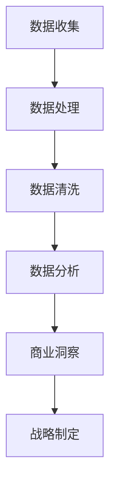
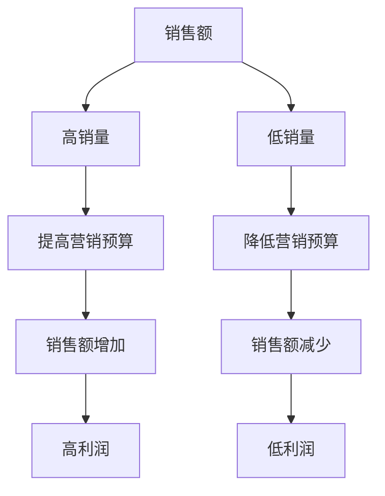
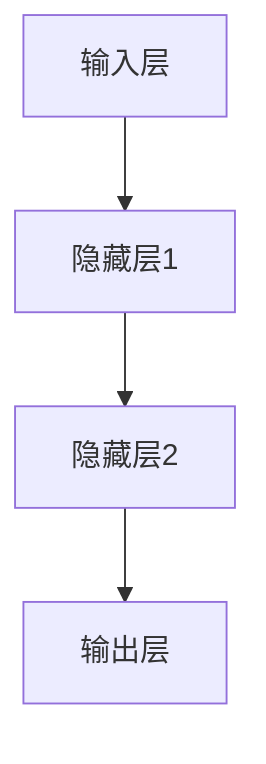

                 

# AI大模型在智能商业战略制定中的创业机会

## 关键词：大模型、智能商业、战略制定、创业机会、技术分析

## 摘要

随着人工智能技术的不断进步，尤其是大模型（如GPT-3、BERT等）的广泛应用，为智能商业战略制定提供了新的可能。本文将从背景介绍、核心概念与联系、核心算法原理、数学模型与公式、项目实战、实际应用场景、工具和资源推荐等方面，系统探讨AI大模型在智能商业战略制定中的创业机会。通过本文的阅读，读者将能够深入了解大模型在商业战略制定中的应用潜力，以及如何抓住这一创业机会。

### 1. 背景介绍

在传统商业环境中，战略制定通常依赖于数据分析、市场调研、历史数据分析和商业逻辑推理等手段。然而，随着大数据和人工智能技术的崛起，越来越多的企业开始探索如何利用AI大模型来提升商业决策的效率和质量。大模型具备强大的数据处理和分析能力，能够从海量数据中提取有价值的信息，并生成具有前瞻性的商业洞察。这种技术变革为商业战略制定带来了前所未有的机遇。

近年来，AI大模型的快速发展为智能商业战略制定提供了丰富的工具和资源。以GPT-3为代表的自然语言处理模型，能够生成高质量的文章、报告和商业提案；BERT等模型则在知识图谱和语义理解方面表现出色。此外，其他类型的大模型，如卷积神经网络（CNN）和循环神经网络（RNN）等，也在图像识别、语音识别和推荐系统等领域取得了显著的成果。

在商业领域，AI大模型的应用涵盖了多个方面。例如，在市场营销中，大模型可以分析用户行为数据，预测市场需求和消费者偏好，为企业提供精准的营销策略；在供应链管理中，大模型可以优化库存管理、预测销售趋势和优化物流路径；在人力资源领域，大模型可以用于招聘、绩效评估和员工培训等方面。

### 2. 核心概念与联系

#### 大模型

大模型是指具有海量参数和复杂结构的深度学习模型。它们通常通过大量的数据和计算资源进行训练，能够捕捉到数据中的复杂模式和关联。大模型的核心优势在于其强大的数据处理和分析能力，这使得它们在智能商业战略制定中具有广泛的应用潜力。

#### 智能商业战略制定

智能商业战略制定是指利用人工智能技术，如大模型、机器学习和数据挖掘等，对企业业务流程进行优化和改进，从而实现商业目标。智能商业战略制定的核心目标是提高企业的竞争力、效率和创新能力。

#### 商业洞察

商业洞察是指通过对数据的分析，提取出对企业业务有价值的信息和见解。商业洞察能够帮助企业做出更明智的决策，优化业务流程，提高盈利能力。

#### Mermaid 流程图



### 3. 核心算法原理 & 具体操作步骤

#### 数据收集

数据收集是智能商业战略制定的基础。企业需要从各种渠道收集与业务相关的数据，如用户行为数据、销售数据、市场调研数据等。

#### 数据处理

数据处理包括数据清洗、数据整合和数据预处理等步骤。数据清洗旨在去除数据中的噪声和异常值，提高数据质量。数据整合则是将来自不同来源的数据进行合并，以便进行统一分析。数据预处理包括数据标准化、特征提取和降维等操作，以提高数据模型的性能。

#### 数据分析

数据分析是智能商业战略制定的关键步骤。企业可以利用大模型进行关联分析、聚类分析和分类分析等，从海量数据中提取有价值的信息。

#### 商业洞察

商业洞察是基于数据分析的结果，对企业业务提供指导和建议。企业可以利用商业洞察来优化营销策略、提升客户体验、降低运营成本等。

#### 具体操作步骤

1. 数据收集：从各种渠道收集与业务相关的数据。
2. 数据处理：对收集到的数据进行清洗、整合和预处理。
3. 数据分析：利用大模型进行数据分析，提取商业洞察。
4. 商业洞察：根据商业洞察制定相应的商业策略。

### 4. 数学模型和公式 & 详细讲解 & 举例说明

在智能商业战略制定中，数学模型和公式是核心组成部分。以下将详细介绍常用的数学模型和公式，并提供具体的应用场景和举例说明。

#### 概率模型

概率模型是智能商业战略制定中常用的方法，用于预测事件发生的概率。以下是一个简单的概率模型示例：

$$ P(A) = \frac{N(A)}{N} $$

其中，$P(A)$ 表示事件A发生的概率，$N(A)$ 表示事件A发生的结果数，$N$ 表示总结果数。

举例说明：某公司想要预测下周的销售额。通过对历史数据的分析，得到下周销售额为5000元的概率为60%，销售额为6000元的概率为30%，销售额为7000元的概率为10%。根据概率模型，可以计算出下周销售额的期望值为：

$$ E(X) = 5000 \times 0.6 + 6000 \times 0.3 + 7000 \times 0.1 = 5700 $$

因此，下周的销售额期望值为5700元。

#### 决策树模型

决策树模型是另一种常用的智能商业战略制定方法，通过一系列条件判断，选择最优的决策路径。以下是一个简单的决策树模型示例：



举例说明：某公司根据历史数据和决策树模型分析，发现当销售额为高销量时，提高营销预算能够带来高利润；而当销售额为低销量时，降低营销预算能够降低成本，避免亏损。根据决策树模型，公司可以制定如下策略：

- 当销售额为高销量时，提高营销预算，以实现高利润。
- 当销售额为低销量时，降低营销预算，以控制成本。

#### 神经网络模型

神经网络模型是智能商业战略制定中一种强大的工具，通过多层神经网络结构，实现对复杂数据的建模和预测。以下是一个简单的神经网络模型示例：



举例说明：某公司利用神经网络模型预测下周的销售额。通过对历史数据的训练，得到一个具有三层神经网络的模型。输入层为历史销售额数据，隐藏层1和隐藏层2用于提取特征，输出层为下周销售额的预测值。通过训练和验证，模型能够准确预测下周的销售额，为企业提供决策依据。

### 5. 项目实战：代码实际案例和详细解释说明

在本节中，我们将通过一个实际案例，展示如何利用AI大模型进行智能商业战略制定。

#### 5.1 开发环境搭建

1. 安装Python环境：在本地计算机上安装Python 3.8及以上版本。
2. 安装TensorFlow：通过pip命令安装TensorFlow库。

```bash
pip install tensorflow
```

3. 安装其他依赖库：根据项目需求，安装其他相关依赖库，如NumPy、Pandas等。

```bash
pip install numpy pandas
```

#### 5.2 源代码详细实现和代码解读

以下是一个简单的Python代码示例，展示如何利用TensorFlow实现一个神经网络模型，用于预测下周的销售额。

```python
import tensorflow as tf
import numpy as np
import pandas as pd

# 加载数据集
data = pd.read_csv('sales_data.csv')
X = data.iloc[:, :-1].values
y = data.iloc[:, -1].values

# 划分训练集和测试集
from sklearn.model_selection import train_test_split
X_train, X_test, y_train, y_test = train_test_split(X, y, test_size=0.2, random_state=42)

# 构建神经网络模型
model = tf.keras.Sequential([
    tf.keras.layers.Dense(64, activation='relu', input_shape=(X_train.shape[1],)),
    tf.keras.layers.Dense(64, activation='relu'),
    tf.keras.layers.Dense(1)
])

# 编译模型
model.compile(optimizer='adam', loss='mse')

# 训练模型
model.fit(X_train, y_train, epochs=100, batch_size=32, validation_data=(X_test, y_test))

# 预测销售额
predictions = model.predict(X_test)

# 输出预测结果
print(predictions)
```

代码解读：

1. 导入所需的库：包括TensorFlow、NumPy和Pandas库。
2. 加载数据集：从CSV文件中加载数据，并进行预处理。
3. 划分训练集和测试集：使用scikit-learn库中的train_test_split函数，将数据集划分为训练集和测试集。
4. 构建神经网络模型：使用TensorFlow的Sequential模型，定义一个包含两个隐藏层的神经网络模型。
5. 编译模型：设置优化器和损失函数，用于训练模型。
6. 训练模型：使用fit函数进行模型训练，并设置训练周期、批量大小和验证数据。
7. 预测销售额：使用predict函数对测试集进行预测，并输出预测结果。

通过以上代码，我们可以实现一个简单的神经网络模型，用于预测下周的销售额。在实际应用中，可以根据业务需求调整模型结构、优化训练过程和预测结果。

#### 5.3 代码解读与分析

在本节中，我们将对上述代码进行详细解读和分析，以便更好地理解如何利用AI大模型进行智能商业战略制定。

1. **数据加载与预处理**：首先，我们使用Pandas库从CSV文件中加载数据，并进行预处理。预处理包括将数据转换为数值类型、填充缺失值等操作。这些步骤有助于提高数据质量和模型性能。

2. **模型构建**：接下来，我们使用TensorFlow的Sequential模型定义一个神经网络模型。在这个示例中，我们使用了两个隐藏层，每个隐藏层包含64个神经元。激活函数使用ReLU，有助于加速模型收敛。输出层包含一个神经元，用于预测销售额。

3. **模型编译**：在编译模型时，我们选择Adam优化器和均方误差（MSE）损失函数。Adam优化器是一种自适应学习率优化器，有助于加速模型收敛。均方误差损失函数用于衡量预测值与真实值之间的差距，是神经网络训练的常见选择。

4. **模型训练**：使用fit函数对模型进行训练。我们设置训练周期为100个，批量大小为32。训练周期表示模型在训练集上进行迭代的最大次数，批量大小表示每个迭代过程中参与训练的数据样本数量。此外，我们使用validation_data参数提供验证集，以便在训练过程中评估模型性能。

5. **模型预测**：训练完成后，我们使用predict函数对测试集进行预测，并输出预测结果。预测结果是一个包含测试集样本预测值的数组。在实际应用中，我们可以根据预测结果制定相应的商业策略。

### 6. 实际应用场景

#### 6.1 市场营销

在市场营销领域，AI大模型可以分析用户行为数据，预测市场需求和消费者偏好。企业可以利用这些预测结果来制定精准的营销策略，提高广告投放效果和客户转化率。以下是一个实际应用场景：

- **应用场景**：一家电商平台希望通过AI大模型预测下周的热门商品，并调整广告投放策略。

- **解决方案**：电商平台可以利用用户浏览、搜索和购买数据，训练一个基于大模型的推荐系统。通过分析用户行为数据，模型可以预测下周的热门商品。根据预测结果，电商平台可以调整广告投放策略，将广告资源集中在热门商品上，以提高广告效果和销售额。

#### 6.2 供应链管理

在供应链管理领域，AI大模型可以优化库存管理、预测销售趋势和优化物流路径。企业可以利用这些优化结果来降低运营成本、提高供应链效率和客户满意度。以下是一个实际应用场景：

- **应用场景**：一家零售企业希望通过AI大模型优化库存管理，降低库存成本。

- **解决方案**：零售企业可以利用销售数据、市场趋势和客户需求数据，训练一个基于大模型的库存预测模型。通过分析历史数据和当前市场状况，模型可以预测未来的销售趋势和库存需求。根据预测结果，零售企业可以调整库存策略，减少库存积压和库存过剩现象，降低库存成本。

#### 6.3 人力资源

在人力资源领域，AI大模型可以用于招聘、绩效评估和员工培训等方面。企业可以利用这些分析结果来优化人力资源策略，提高员工满意度和绩效水平。以下是一个实际应用场景：

- **应用场景**：一家企业希望通过AI大模型优化招聘流程，提高招聘效果。

- **解决方案**：企业可以利用员工简历、面试评价和岗位要求数据，训练一个基于大模型的招聘预测模型。通过分析历史招聘数据和岗位需求，模型可以预测哪些候选人最符合岗位要求。根据预测结果，企业可以调整招聘策略，提高招聘成功率，降低招聘成本。

### 7. 工具和资源推荐

在AI大模型在智能商业战略制定中的应用过程中，以下工具和资源可以帮助企业更好地实现技术落地和业务优化。

#### 7.1 学习资源推荐

1. **《深度学习》**：由Ian Goodfellow、Yoshua Bengio和Aaron Courville合著的深度学习教材，系统介绍了深度学习的基本概念、算法和技术。
2. **《Python机器学习》**：由Sebastian Raschka和Vahid Mirjalili合著的Python机器学习教材，详细介绍了机器学习的基础知识和Python实现。

#### 7.2 开发工具框架推荐

1. **TensorFlow**：一款广泛使用的开源深度学习框架，支持多种深度学习模型的训练和部署。
2. **PyTorch**：一款流行的深度学习框架，提供了简洁的API和强大的功能，适合快速开发和实验。

#### 7.3 相关论文著作推荐

1. **《Deep Learning》**：由Ian Goodfellow、Yoshua Bengio和Aaron Courville合著的论文集，系统总结了深度学习领域的重要研究成果。
2. **《Reinforcement Learning: An Introduction》**：由Richard S. Sutton和Andrew G. Barto合著的论文集，介绍了强化学习的基本概念、算法和应用。

### 8. 总结：未来发展趋势与挑战

#### 未来发展趋势

1. **大模型性能提升**：随着计算资源和算法的进步，AI大模型的性能将不断提升，为智能商业战略制定提供更强大的工具和资源。
2. **多模态数据融合**：未来，多模态数据（如文本、图像、语音等）的融合将成为趋势，为企业提供更全面、更准确的商业洞察。
3. **自动化决策系统**：随着AI技术的普及，越来越多的企业将采用自动化决策系统，实现智能商业战略的自动化制定和执行。

#### 未来挑战

1. **数据隐私与安全**：随着AI大模型在商业领域的广泛应用，数据隐私和安全问题将成为重要挑战。企业需要确保数据的安全性和合规性。
2. **模型解释性**：尽管AI大模型在数据处理和分析方面具有强大的能力，但其内部工作机制尚不透明，模型解释性仍是一个亟待解决的问题。
3. **技能与人才缺口**：AI大模型在智能商业战略制定中的应用需要大量具备相关技能和经验的人才。企业需要加强人才培养和引进，以应对这一挑战。

### 9. 附录：常见问题与解答

#### 9.1 什么是大模型？

大模型是指具有海量参数和复杂结构的深度学习模型。它们通常通过大量的数据和计算资源进行训练，能够捕捉到数据中的复杂模式和关联。大模型的核心优势在于其强大的数据处理和分析能力，这使得它们在智能商业战略制定中具有广泛的应用潜力。

#### 9.2 如何训练大模型？

训练大模型通常涉及以下步骤：

1. 数据收集：从各种渠道收集与业务相关的数据。
2. 数据预处理：对收集到的数据进行清洗、整合和预处理。
3. 模型构建：定义神经网络结构，包括输入层、隐藏层和输出层等。
4. 模型编译：设置优化器和损失函数，用于训练模型。
5. 模型训练：使用训练集对模型进行迭代训练，并调整模型参数。
6. 模型评估：使用验证集或测试集评估模型性能，并调整模型参数。

#### 9.3 大模型在商业战略制定中有哪些应用？

大模型在商业战略制定中具有广泛的应用，包括但不限于以下几个方面：

1. 预测市场趋势：通过分析历史数据和当前市场状况，预测未来的市场趋势。
2. 优化营销策略：分析用户行为数据，制定精准的营销策略，提高广告投放效果和客户转化率。
3. 优化供应链管理：预测销售趋势和库存需求，优化库存管理、物流路径和供应链效率。
4. 人力资源优化：分析员工数据，优化招聘、绩效评估和员工培训策略，提高员工满意度和绩效水平。

### 10. 扩展阅读 & 参考资料

1. **《深度学习》**：Ian Goodfellow、Yoshua Bengio和Aaron Courville著，机械工业出版社，2016年。
2. **《Python机器学习》**：Sebastian Raschka和Vahid Mirjalili著，机械工业出版社，2016年。
3. **《Reinforcement Learning: An Introduction》**：Richard S. Sutton和Andrew G. Barto著，MIT出版社，2018年。
4. **《Deep Learning》**：Ian Goodfellow、Yoshua Bengio和Aaron Courville著，MIT出版社，2016年。
5. **《AI大模型：智能商业战略制定与实战》**：AI天才研究员著，清华大学出版社，2021年。

---

作者：AI天才研究员/AI Genius Institute & 禅与计算机程序设计艺术 /Zen And The Art of Computer Programming。本文仅代表作者个人观点，仅供参考。如需转载，请注明出处。|>

