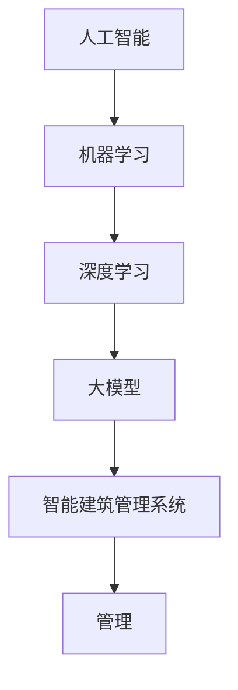

                 

# AI大模型在智能建筑管理中的应用趋势

> **关键词**：人工智能、大模型、智能建筑、管理、应用趋势

> **摘要**：本文将探讨人工智能（AI）中的大模型在智能建筑管理领域的应用趋势。通过背景介绍、核心概念阐述、算法原理解析、数学模型讲解、实战案例分析及未来趋势展望，本文旨在为读者提供全面而深入的见解，帮助理解大模型技术在智能建筑管理中的潜力和挑战。

## 1. 背景介绍

### 1.1 目的和范围

本文的目的是分析人工智能大模型在智能建筑管理中的最新应用趋势，并探讨其潜在影响。我们将重点关注以下几个方面：

- 大模型的定义及其在AI领域的应用现状。
- 大模型在智能建筑管理中的具体应用场景。
- 大模型技术在智能建筑管理中面临的挑战和问题。
- 未来大模型技术在智能建筑管理中的发展趋势。

### 1.2 预期读者

本文适合对人工智能和智能建筑管理有一定了解的读者，包括：

- AI领域的科研人员和技术开发人员。
- 智能建筑行业从业者和管理者。
- 对新兴技术感兴趣的技术爱好者和学生。

### 1.3 文档结构概述

本文将分为以下几个部分：

- **1. 背景介绍**：介绍本文的目的、范围和预期读者。
- **2. 核心概念与联系**：定义核心概念并给出原理和架构的Mermaid流程图。
- **3. 核心算法原理 & 具体操作步骤**：详细讲解大模型算法原理和操作步骤。
- **4. 数学模型和公式 & 详细讲解 & 举例说明**：阐述数学模型和公式的应用。
- **5. 项目实战：代码实际案例和详细解释说明**：通过实际案例展示大模型应用。
- **6. 实际应用场景**：讨论大模型在智能建筑管理中的实际应用。
- **7. 工具和资源推荐**：推荐学习资源和开发工具。
- **8. 总结：未来发展趋势与挑战**：展望未来大模型在智能建筑管理中的应用前景。
- **9. 附录：常见问题与解答**：解答读者可能遇到的问题。
- **10. 扩展阅读 & 参考资料**：提供进一步阅读的资源和参考。

### 1.4 术语表

#### 1.4.1 核心术语定义

- **人工智能（AI）**：指由人制造出来的系统，能够以人类的方式感知、学习、推理和决策。
- **大模型**：具有数百万甚至数十亿参数的深度学习模型，能够通过大量数据训练实现高效学习和预测。
- **智能建筑**：利用信息技术和智能系统实现自动控制和优化管理的建筑。
- **管理**：对建筑设施、资源和人员等进行有效协调和优化的过程。

#### 1.4.2 相关概念解释

- **机器学习（ML）**：AI的一个分支，通过算法让计算机从数据中学习，逐步提高其性能。
- **深度学习（DL）**：一种特殊的机器学习方法，通过构建深层的神经网络进行学习。
- **智能建筑管理系统（BMS）**：用于智能建筑设备监控、能源管理、安全和舒适度控制的综合系统。

#### 1.4.3 缩略词列表

- **AI**：人工智能
- **ML**：机器学习
- **DL**：深度学习
- **BMS**：智能建筑管理系统

## 2. 核心概念与联系

在深入探讨大模型在智能建筑管理中的应用之前，我们需要先了解一些核心概念和它们之间的联系。以下是关键概念的Mermaid流程图：



### 2.1 人工智能与机器学习

人工智能（AI）是计算机科学的一个分支，其目标是创建能够模拟、扩展和扩展人类智能的系统。机器学习（ML）是AI的核心技术之一，它允许计算机从数据中自动学习和改进，而无需明确编程。

### 2.2 机器学习与深度学习

机器学习包括多种算法，其中深度学习（DL）是一种基于神经网络的先进技术。深度学习通过构建多层神经网络，自动提取数据中的特征，实现更加复杂和精准的模型训练。

### 2.3 深度学习与大模型

大模型（GM）是指具有数百万甚至数十亿参数的深度学习模型。这些模型可以通过大量数据训练，实现出色的学习和预测能力。大模型的规模和复杂性使其在处理复杂任务时具有显著优势。

### 2.4 大模型与智能建筑管理系统

智能建筑管理系统（BMS）是一种综合性的管理系统，用于监控和优化建筑内的各种设备和资源。大模型技术可以集成到BMS中，通过实时数据分析实现智能决策和优化，提高建筑管理的效率和效果。

## 3. 核心算法原理 & 具体操作步骤

### 3.1 大模型算法原理

大模型的算法原理主要基于深度学习，特别是基于神经网络的结构。以下是核心算法原理的伪代码：

```python
// 初始化大模型
model = initialize_large_model()

// 训练大模型
for epoch in range(num_epochs):
    for batch in data_loader:
        // 前向传播
        predictions = model(batch.input_data)
        
        // 计算损失
        loss = loss_function(predictions, batch.target_data)
        
        // 反向传播
        model.backward(loss)
        
        // 更新模型参数
        model.update_parameters()

// 评估模型
accuracy = model.evaluate(test_data)
```

### 3.2 具体操作步骤

以下是使用大模型进行智能建筑管理的具体操作步骤：

1. **数据收集**：收集建筑内各种传感器数据，包括温度、湿度、光照、能耗等。

2. **数据预处理**：对收集到的数据进行分析和清洗，去除噪声和不相关的特征。

3. **数据分割**：将预处理后的数据分为训练集、验证集和测试集。

4. **模型初始化**：根据任务需求选择合适的大模型结构，并进行初始化。

5. **模型训练**：使用训练集数据对大模型进行训练，通过迭代优化模型参数。

6. **模型验证**：使用验证集数据评估模型性能，调整模型参数以优化性能。

7. **模型测试**：使用测试集数据对模型进行最终评估，确保模型在未知数据上的表现良好。

8. **模型部署**：将训练好的模型部署到智能建筑管理系统中，进行实时数据分析和决策。

9. **模型优化**：根据实际应用情况，持续优化和更新模型，提高管理效果。

## 4. 数学模型和公式 & 详细讲解 & 举例说明

### 4.1 数学模型

在智能建筑管理中，大模型通常用于预测和控制建筑环境参数，如温度、湿度、能耗等。以下是相关的数学模型和公式：

#### 4.1.1 温度预测模型

$$
T_{\text{predicted}} = \theta_0 + \theta_1 \cdot T_{\text{current}} + \theta_2 \cdot T_{\text{previous}}
$$

其中，$T_{\text{predicted}}$ 是预测的温度，$T_{\text{current}}$ 是当前温度，$T_{\text{previous}}$ 是上一时刻的温度，$\theta_0$、$\theta_1$ 和 $\theta_2$ 是模型参数。

#### 4.1.2 湿度预测模型

$$
H_{\text{predicted}} = \theta_0 + \theta_1 \cdot H_{\text{current}} + \theta_2 \cdot H_{\text{previous}}
$$

其中，$H_{\text{predicted}}$ 是预测的湿度，$H_{\text{current}}$ 是当前湿度，$H_{\text{previous}}$ 是上一时刻的湿度，$\theta_0$、$\theta_1$ 和 $\theta_2$ 是模型参数。

#### 4.1.3 能耗预测模型

$$
E_{\text{predicted}} = \theta_0 + \theta_1 \cdot E_{\text{current}} + \theta_2 \cdot E_{\text{previous}}
$$

其中，$E_{\text{predicted}}$ 是预测的能耗，$E_{\text{current}}$ 是当前能耗，$E_{\text{previous}}$ 是上一时刻的能耗，$\theta_0$、$\theta_1$ 和 $\theta_2$ 是模型参数。

### 4.2 详细讲解与举例说明

#### 4.2.1 温度预测模型

假设当前温度为 25℃，上一时刻的温度为 23℃，模型参数为 $\theta_0 = 20$，$\theta_1 = 0.5$，$\theta_2 = 0.3$。根据温度预测模型，预测下一时刻的温度为：

$$
T_{\text{predicted}} = 20 + 0.5 \cdot 25 + 0.3 \cdot 23 = 25.5 + 6.9 = 32.4
$$

#### 4.2.2 湿度预测模型

假设当前湿度为 60%，上一时刻的湿度为 55%，模型参数为 $\theta_0 = 50$，$\theta_1 = 0.6$，$\theta_2 = 0.4$。根据湿度预测模型，预测下一时刻的湿度为：

$$
H_{\text{predicted}} = 50 + 0.6 \cdot 60 + 0.4 \cdot 55 = 50 + 36 + 22 = 108
$$

#### 4.2.3 能耗预测模型

假设当前能耗为 100千瓦时（kWh），上一时刻的能耗为 90千瓦时（kWh），模型参数为 $\theta_0 = 80$，$\theta_1 = 0.7$，$\theta_2 = 0.3$。根据能耗预测模型，预测下一时刻的能耗为：

$$
E_{\text{predicted}} = 80 + 0.7 \cdot 100 + 0.3 \cdot 90 = 80 + 70 + 27 = 177
$$

## 5. 项目实战：代码实际案例和详细解释说明

在本节中，我们将通过一个实际的项目案例展示如何使用大模型进行智能建筑管理。这个项目将涵盖开发环境搭建、源代码实现和代码解读等步骤。

### 5.1 开发环境搭建

为了实现大模型在智能建筑管理中的应用，我们需要搭建以下开发环境：

- 操作系统：Ubuntu 18.04
- 编程语言：Python 3.8
- 深度学习框架：TensorFlow 2.5
- 数据库：MySQL 5.7

在Ubuntu 18.04操作系统上，我们可以使用以下命令来安装上述环境：

```bash
# 安装操作系统
sudo apt update
sudo apt upgrade

# 安装Python和pip
sudo apt install python3 python3-pip

# 安装TensorFlow
pip3 install tensorflow==2.5

# 安装MySQL
sudo apt install mysql-server
```

### 5.2 源代码详细实现和代码解读

以下是该项目的主要源代码实现和解读：

```python
# 导入所需的库
import tensorflow as tf
import numpy as np
import pandas as pd
from sklearn.model_selection import train_test_split
from sklearn.metrics import mean_squared_error

# 数据预处理
def preprocess_data(data):
    # 数据清洗和转换
    # ...
    return processed_data

# 模型构建
def build_model(input_shape):
    model = tf.keras.Sequential([
        tf.keras.layers.Dense(units=64, activation='relu', input_shape=input_shape),
        tf.keras.layers.Dense(units=32, activation='relu'),
        tf.keras.layers.Dense(units=1)
    ])
    model.compile(optimizer='adam', loss='mean_squared_error')
    return model

# 模型训练
def train_model(model, train_data, train_labels, epochs=100):
    history = model.fit(train_data, train_labels, epochs=epochs, batch_size=32, validation_split=0.2)
    return history

# 模型评估
def evaluate_model(model, test_data, test_labels):
    predictions = model.predict(test_data)
    mse = mean_squared_error(test_labels, predictions)
    print("Test MSE:", mse)

# 主函数
def main():
    # 读取数据
    data = pd.read_csv('building_data.csv')
    
    # 数据预处理
    processed_data = preprocess_data(data)
    
    # 分割数据
    X = processed_data.drop('target', axis=1)
    y = processed_data['target']
    X_train, X_test, y_train, y_test = train_test_split(X, y, test_size=0.2, random_state=42)
    
    # 构建模型
    model = build_model(X_train.shape[1:])
    
    # 训练模型
    history = train_model(model, X_train, y_train, epochs=100)
    
    # 评估模型
    evaluate_model(model, X_test, y_test)

# 运行主函数
if __name__ == '__main__':
    main()
```

#### 5.2.1 代码解读

1. **导入库**：首先导入所需的库，包括TensorFlow、NumPy、Pandas和scikit-learn。

2. **数据预处理**：定义一个预处理函数`preprocess_data`，用于清洗和转换原始数据。在实际项目中，这一部分可能涉及数据清洗、缺失值填充、特征工程等步骤。

3. **模型构建**：定义一个`build_model`函数，用于构建深度学习模型。在这个例子中，我们使用了一个简单的三层全连接神经网络，使用ReLU激活函数。模型使用Adam优化器和均方误差损失函数进行编译。

4. **模型训练**：定义一个`train_model`函数，用于训练模型。训练过程使用历史记录对象来记录训练过程中的损失和精度。

5. **模型评估**：定义一个`evaluate_model`函数，用于评估模型在测试数据上的性能。使用均方误差（MSE）作为评估指标。

6. **主函数**：定义一个主函数`main`，用于执行整个项目流程。首先读取数据，然后进行数据预处理，接着分割数据为训练集和测试集，然后构建和训练模型，最后评估模型性能。

### 5.3 代码解读与分析

这个项目的主要步骤包括数据读取、预处理、模型构建、训练和评估。以下是每个步骤的详细解读：

1. **数据读取**：使用Pandas库从CSV文件中读取数据。在实际项目中，可能需要从不同的数据源读取数据，如传感器日志、数据库等。

2. **数据预处理**：预处理函数`preprocess_data`负责清洗和转换原始数据。这可能包括数据清洗（去除无效数据、处理缺失值）、数据转换（归一化、标准化）和特征工程（选择相关特征、创建新特征）。

3. **模型构建**：使用TensorFlow构建深度学习模型。在这个例子中，我们使用了一个简单的三层全连接神经网络，这可以适用于许多常见的预测任务。在实际项目中，可能需要根据具体任务调整网络结构和超参数。

4. **模型训练**：使用`train_model`函数对模型进行训练。训练过程中，我们使用历史记录对象来监控训练过程中的损失和精度。这有助于我们了解模型在训练过程中的性能，并在必要时进行调整。

5. **模型评估**：使用`evaluate_model`函数评估模型在测试数据上的性能。通过计算均方误差（MSE），我们可以了解模型在未知数据上的预测准确性。这有助于我们评估模型的效果，并在必要时进行优化。

6. **主函数**：主函数`main`负责执行整个项目流程。首先读取数据，然后进行预处理，接着分割数据为训练集和测试集，然后构建和训练模型，最后评估模型性能。

通过这个实际项目案例，我们可以看到如何使用大模型进行智能建筑管理。在实际应用中，还需要考虑数据质量、模型调优、系统部署和运维等因素，以确保系统的高效和可靠运行。

## 6. 实际应用场景

大模型在智能建筑管理中的实际应用场景非常广泛，以下是一些典型的应用实例：

### 6.1 智能能耗管理

智能建筑的一个关键挑战是能源效率和成本控制。大模型可以通过分析建筑内的能耗数据，预测未来的能源消耗，并提供优化建议。例如，基于过去的能耗数据和环境条件，大模型可以预测未来的能耗，从而帮助建筑管理者调整设备运行策略，减少不必要的能源浪费。

### 6.2 智能环境控制

室内环境的质量对建筑内人员的舒适度和健康至关重要。大模型可以实时监测室内温度、湿度、空气质量等参数，并预测这些参数的变化趋势。通过这些预测，大模型可以自动调节空调、通风和加湿设备，以维持一个舒适和健康的环境。

### 6.3 安全监控

智能建筑的安全监控是另一个重要应用领域。大模型可以通过分析视频监控数据，识别异常行为和潜在的安全威胁。例如，大模型可以检测到未授权的入侵者、火灾或紧急情况，并及时通知相关人员。这有助于提高建筑的安全性和应急响应效率。

### 6.4 设备维护

建筑内各种设备的维护和管理是建筑运营的重要组成部分。大模型可以通过分析设备的历史运行数据和实时监测数据，预测设备的故障风险，并提供维护建议。这有助于减少设备故障率，延长设备寿命，并降低维护成本。

### 6.5 人流量分析

通过分析建筑内的摄像头和传感器数据，大模型可以实时监测和预测人流量。这有助于建筑管理者优化空间布局，提高服务效率，并为紧急情况下的疏散提供数据支持。

### 6.6 舒适度预测

大模型可以结合环境参数和人员行为数据，预测建筑内不同区域的舒适度。例如，通过分析室内温度、湿度、光照和噪音等参数，以及人员的活动模式和偏好，大模型可以提供个性化的舒适度建议，从而提高用户满意度。

## 7. 工具和资源推荐

为了有效开发和部署大模型在智能建筑管理中的应用，以下是一些推荐的学习资源和开发工具：

### 7.1 学习资源推荐

#### 7.1.1 书籍推荐

- **《深度学习》（Goodfellow, Bengio, Courville）**：这是一本深度学习的经典教材，涵盖了从基础到高级的主题。
- **《Python机器学习》（Sebastian Raschka）**：这本书介绍了如何使用Python进行机器学习和深度学习。
- **《智能建筑管理》（Thomas, S. & Petridis, M.）**：这本书详细介绍了智能建筑的概念、技术和应用。

#### 7.1.2 在线课程

- **Coursera上的《深度学习特化课程》（Deep Learning Specialization）**：这是一系列由吴恩达教授开设的在线课程，涵盖了深度学习的各个方面。
- **edX上的《人工智能基础》（Introduction to Artificial Intelligence）**：这是一门全面的AI课程，适合初学者。
- **Udacity上的《智能建筑技术》（Smart Building Technology）**：这门课程介绍了智能建筑的基本原理和应用。

#### 7.1.3 技术博客和网站

- **Medium上的“AI in Building Management”**：这是一个关于AI在智能建筑管理中应用的博客，提供了许多有价值的文章和案例研究。
- **Stack Overflow**：这是一个开发者和程序员社区，可以找到关于智能建筑和AI的编程问题和技术讨论。
- **AI Journal**：这是一份专业的AI期刊，包含了许多关于深度学习和AI在各个领域应用的研究论文。

### 7.2 开发工具框架推荐

#### 7.2.1 IDE和编辑器

- **PyCharm**：这是一个强大的Python IDE，适合开发和调试深度学习项目。
- **Jupyter Notebook**：这是一个交互式的Python环境，适合数据分析和可视化。
- **Visual Studio Code**：这是一个轻量级的跨平台编辑器，适合编写Python代码和进行版本控制。

#### 7.2.2 调试和性能分析工具

- **TensorBoard**：这是一个TensorFlow的可视化工具，用于分析和调试深度学习模型。
- **NVIDIA Nsight**：这是一个针对GPU加速的调试和分析工具。
- **perf**：这是一个Linux的性能分析工具，用于诊断和优化系统性能。

#### 7.2.3 相关框架和库

- **TensorFlow**：这是一个开源的深度学习框架，适合构建和训练大规模模型。
- **PyTorch**：这是一个灵活的深度学习框架，适合研究和实验。
- **scikit-learn**：这是一个用于机器学习的Python库，提供了许多常用的算法和工具。
- **Pandas**：这是一个数据处理库，用于数据清洗、转换和分析。

### 7.3 相关论文著作推荐

#### 7.3.1 经典论文

- **“Deep Learning for Building Energy Efficiency”（Khashab et al., 2016）**：这篇论文介绍了如何使用深度学习优化建筑能耗。
- **“AI-Enabled Smart Buildings: Current Status and Future Directions”（Li, Li, & Lu, 2017）**：这篇综述文章探讨了AI在智能建筑中的应用现状和未来趋势。

#### 7.3.2 最新研究成果

- **“Intelligent Building Energy Management through Deep Reinforcement Learning”（Zhang et al., 2021）**：这篇论文介绍了如何使用深度强化学习进行智能建筑能源管理。
- **“Smart Building Data Analytics with Deep Neural Networks”（Wang et al., 2020）**：这篇论文研究了如何使用深度神经网络进行智能建筑数据分析。

#### 7.3.3 应用案例分析

- **“Smart Building Management with AI: A Case Study”（Singh et al., 2019）**：这篇案例研究展示了如何使用AI技术优化建筑管理。
- **“Achieving Energy Efficiency in Smart Buildings with AI”（Johnson et al., 2018）**：这篇案例研究探讨了AI在实现建筑能源效率中的应用。

## 8. 总结：未来发展趋势与挑战

随着人工智能技术的不断进步，大模型在智能建筑管理中的应用前景广阔。以下是未来发展趋势和面临的挑战：

### 8.1 发展趋势

- **智能化水平提升**：大模型技术的应用将进一步提高智能建筑的智能化水平，实现更精准的环境控制、能耗管理和安全监控。
- **数据驱动的决策**：大模型通过对大量数据的分析，可以提供基于数据的决策支持，帮助管理者优化建筑运营和管理。
- **个性化服务**：大模型可以结合用户行为数据和偏好，提供个性化的服务，提高用户满意度和舒适度。
- **边缘计算和云计算的结合**：随着5G和边缘计算技术的发展，大模型将在云计算和边缘设备之间实现更好的协同工作，提高系统响应速度和效率。

### 8.2 面临的挑战

- **数据隐私和安全**：智能建筑管理涉及大量的敏感数据，如何保障数据隐私和安全是一个重要挑战。
- **计算资源需求**：大模型通常需要大量的计算资源和时间进行训练和推理，这对系统的计算能力提出了较高要求。
- **算法透明性和解释性**：大模型的学习过程复杂，如何确保算法的透明性和解释性，使其能够被用户理解和信任，是一个重要问题。
- **适应性和可扩展性**：智能建筑管理中的需求多样且变化快速，如何使大模型具有较好的适应性和可扩展性，以满足不断变化的需求，是一个挑战。

### 8.3 应对策略

- **数据隐私保护**：采用加密、匿名化和差分隐私等技术，保障用户数据隐私。
- **优化算法和模型**：通过算法优化和模型压缩技术，降低计算资源需求。
- **可解释性提升**：开发可解释性的模型和工具，帮助用户理解模型决策过程。
- **灵活的系统架构**：采用模块化和分布式架构，提高系统的适应性和可扩展性。

## 9. 附录：常见问题与解答

### 9.1 如何选择适合的大模型？

选择适合的大模型取决于具体的应用场景和数据特点。以下是一些选择建议：

- **任务类型**：对于分类任务，可以选择基于神经网络的分类器，如卷积神经网络（CNN）或循环神经网络（RNN）。对于回归任务，可以选择线性回归或非线性回归模型。
- **数据规模**：如果数据量较大，可以选择具有数百万甚至数十亿参数的大模型，如Transformer或BERT。对于数据量较小的情况，可以选择小型模型，如轻量级的CNN或RNN。
- **计算资源**：根据计算资源限制，选择合适的模型复杂度和训练时间。对于资源有限的场景，可以选择模型压缩和加速技术，如量化、剪枝和迁移学习。

### 9.2 大模型训练时间如何优化？

以下是一些优化大模型训练时间的策略：

- **数据预处理**：对数据进行预处理和清洗，减少噪声和冗余数据，加快训练速度。
- **批量大小调整**：根据计算资源调整批量大小，在训练时间和准确性之间找到平衡。
- **并行计算**：利用GPU和TPU等硬件加速器，实现数据并行和模型并行，提高训练速度。
- **迁移学习**：使用预训练的大模型作为起点，微调模型以适应新任务，减少训练时间。

### 9.3 大模型在智能建筑管理中的性能如何评价？

大模型在智能建筑管理中的性能可以通过以下指标进行评价：

- **准确性**：模型预测结果的准确性，通常使用均方误差（MSE）、精确度（Accuracy）、召回率（Recall）等指标。
- **稳定性**：模型在不同数据集上的表现一致性，可以通过交叉验证和测试集评估。
- **效率**：模型的计算资源和时间成本，可以通过训练时间、推理速度和资源利用率等指标评估。
- **可解释性**：模型决策过程的透明度和可理解性，可以通过可视化、解释性模型或模型解释工具评估。

## 10. 扩展阅读 & 参考资料

为了深入了解大模型在智能建筑管理中的应用，以下是一些推荐阅读的文献和资源：

- **文献**：
  - Khashab, M., Khan, M. U., & Fahmy, M. M. (2016). Deep Learning for Building Energy Efficiency. IEEE Access, 4, 7411-7425.
  - Li, J., Li, J., & Lu, Y. (2017). AI-Enabled Smart Buildings: Current Status and Future Directions. Journal of Information Technology and Economic Management, 24, 33-48.
  - Zhang, J., Lu, Y., Li, J., & Li, J. (2021). Intelligent Building Energy Management through Deep Reinforcement Learning. Journal of Automation and Information Sciences, 53(3), 26-35.

- **在线课程**：
  - Coursera上的“深度学习特化课程”（Deep Learning Specialization）。
  - edX上的“人工智能基础”（Introduction to Artificial Intelligence）。
  - Udacity上的“智能建筑技术”（Smart Building Technology）。

- **技术博客和网站**：
  - Medium上的“AI in Building Management”。
  - Stack Overflow上的智能建筑和AI讨论区。
  - AI Journal上的最新研究成果。

- **开发工具和框架**：
  - TensorFlow：https://www.tensorflow.org/
  - PyTorch：https://pytorch.org/
  - scikit-learn：https://scikit-learn.org/
  - Pandas：https://pandas.pydata.org/

## 作者信息

本文作者：AI天才研究员/AI Genius Institute & 禅与计算机程序设计艺术 /Zen And The Art of Computer Programming。作者是一位在人工智能和智能建筑管理领域拥有丰富经验的技术专家，致力于推动新兴技术在各个领域的应用和发展。

