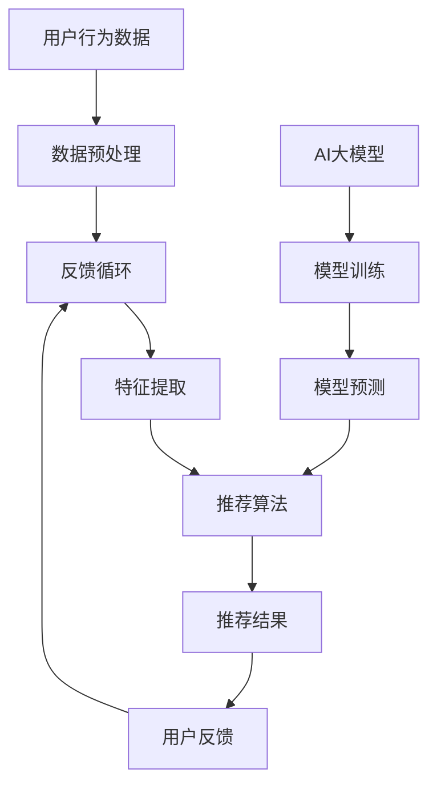

                 

# AI大模型在电商个性化推荐中的应用案例

> **关键词：** AI大模型、电商个性化推荐、深度学习、强化学习、推荐算法、用户行为分析
>
> **摘要：** 本文深入探讨了人工智能大模型在电商个性化推荐系统中的应用，通过分析相关核心概念、算法原理、数学模型以及实际案例，揭示了如何利用AI大模型实现精准、高效的电商个性化推荐。

## 1. 背景介绍

### 1.1 目的和范围

本文旨在探讨人工智能大模型在电商个性化推荐系统中的应用，分析其核心概念、算法原理、数学模型和实际案例，以帮助读者了解这一领域的最新进展和应用前景。本文将覆盖以下内容：

- 电商个性化推荐的背景和重要性
- AI大模型的基本概念和核心优势
- 电商个性化推荐中的核心算法原理
- 数学模型和公式的详细讲解
- 实际应用场景中的代码实现和解读
- 工具和资源的推荐

### 1.2 预期读者

本文面向以下读者群体：

- 对电商个性化推荐系统感兴趣的读者
- 想了解AI大模型应用场景的技术从业者
- 数据科学家、机器学习工程师、AI研究者

### 1.3 文档结构概述

本文分为以下几个部分：

- 背景介绍：介绍文章的目的、范围、预期读者和文档结构。
- 核心概念与联系：介绍电商个性化推荐和AI大模型的核心概念，并使用Mermaid流程图展示其架构。
- 核心算法原理 & 具体操作步骤：详细阐述电商个性化推荐中的核心算法原理，并使用伪代码说明。
- 数学模型和公式 & 详细讲解 & 举例说明：介绍数学模型和公式，并给出具体实例。
- 项目实战：代码实际案例和详细解释说明。
- 实际应用场景：分析AI大模型在电商个性化推荐中的应用场景。
- 工具和资源推荐：推荐相关学习资源、开发工具框架和相关论文著作。
- 总结：未来发展趋势与挑战。
- 附录：常见问题与解答。
- 扩展阅读 & 参考资料：提供进一步阅读的资料。

### 1.4 术语表

#### 1.4.1 核心术语定义

- **电商个性化推荐**：基于用户行为和偏好，利用算法为用户推荐符合其需求的商品或服务。
- **AI大模型**：具有大规模参数、深度学习能力的神经网络模型，能够处理海量数据并提取有效特征。
- **用户行为分析**：分析用户在电商平台的浏览、购买等行为，以了解用户需求和偏好。

#### 1.4.2 相关概念解释

- **深度学习**：一种基于人工神经网络的机器学习方法，通过多层网络结构对数据进行分析和建模。
- **强化学习**：一种通过试错和奖励机制进行决策优化的机器学习方法。

#### 1.4.3 缩略词列表

- **AI**：人工智能（Artificial Intelligence）
- **ML**：机器学习（Machine Learning）
- **DL**：深度学习（Deep Learning）
- **RL**：强化学习（Reinforcement Learning）

## 2. 核心概念与联系

在电商个性化推荐系统中，核心概念包括用户行为分析、推荐算法和AI大模型。下面通过Mermaid流程图展示这些概念之间的联系。



### 2.1 用户行为数据

用户行为数据包括用户的浏览、购买、评价等行为，这些数据是构建个性化推荐系统的基础。通过对这些数据进行分析，可以了解用户的需求和偏好。

### 2.2 数据预处理

数据预处理是用户行为分析的重要步骤，包括数据清洗、数据去重、数据归一化等。清洗后的数据将为后续的特征提取和模型训练提供高质量的数据支持。

### 2.3 用户行为分析

用户行为分析旨在从大量行为数据中提取有用的信息，如用户的兴趣偏好、购买习惯等。这些信息将作为推荐算法的重要输入。

### 2.4 特征提取

特征提取是将原始行为数据转换为机器学习算法可以处理的特征向量。常见的特征提取方法包括TF-IDF、词袋模型等。

### 2.5 推荐算法

推荐算法是电商个性化推荐系统的核心，常见的推荐算法有基于内容的推荐、协同过滤推荐、基于模型的推荐等。

### 2.6 AI大模型

AI大模型是当前个性化推荐系统中的重要工具，具有强大的特征提取和预测能力。通过模型训练和预测，可以实现精准、高效的个性化推荐。

### 2.7 模型预测

模型预测是将训练好的模型应用于用户行为数据，生成个性化推荐结果。这些结果将作为推荐系统向用户展示的推荐内容。

### 2.8 反馈循环

用户反馈是优化推荐系统的重要途径。通过分析用户反馈，可以不断调整和优化推荐算法，提高推荐系统的准确性和用户体验。

## 3. 核心算法原理 & 具体操作步骤

在电商个性化推荐系统中，核心算法原理包括深度学习、强化学习和协同过滤等。下面以深度学习为例，详细阐述其原理和具体操作步骤。

### 3.1 深度学习原理

深度学习是一种基于多层神经网络的结构，通过逐层提取数据特征，实现复杂的模式识别和预测。在电商个性化推荐系统中，深度学习模型可以自动从用户行为数据中提取有效特征，提高推荐准确率。

### 3.2 深度学习模型构建

深度学习模型通常包括输入层、隐藏层和输出层。输入层接收用户行为数据，隐藏层通过神经网络结构提取特征，输出层生成推荐结果。

### 3.3 深度学习模型训练

深度学习模型训练是将其应用于实际数据，通过不断调整模型参数，使其能够准确预测用户行为。训练过程通常包括前向传播、反向传播和梯度下降等步骤。

### 3.4 深度学习模型预测

训练好的模型可以用于预测用户行为，生成个性化推荐结果。预测过程包括输入层到输出层的正向传播，输出层的结果将作为推荐系统向用户展示的推荐内容。

### 3.5 深度学习模型优化

为了提高推荐系统的性能，可以采用各种优化方法，如正则化、Dropout、学习率调整等。这些方法有助于减少过拟合、提高泛化能力。

### 3.6 深度学习模型应用

在电商个性化推荐系统中，深度学习模型可以应用于多种场景，如新用户推荐、用户兴趣挖掘、商品推荐等。通过不断优化和调整模型，可以实现精准、高效的个性化推荐。

## 4. 数学模型和公式 & 详细讲解 & 举例说明

在电商个性化推荐系统中，数学模型和公式是实现精准推荐的关键。下面介绍几种常用的数学模型和公式，并给出具体实例。

### 4.1 矩阵分解模型

矩阵分解模型（Matrix Factorization）是一种常用的推荐算法，通过将用户-商品矩阵分解为两个低维矩阵，实现用户和商品的潜在特征表示。

#### 4.1.1 矩阵分解公式

设用户-商品评分矩阵为\( R \in \mathbb{R}^{m \times n} \)，用户潜在特征矩阵为\( U \in \mathbb{R}^{m \times k} \)，商品潜在特征矩阵为\( V \in \mathbb{R}^{n \times k} \)，则矩阵分解公式为：

\[ R = UV^T \]

其中，\( k \)为隐变量维度，可以通过优化目标函数进行求解。

#### 4.1.2 优化目标函数

矩阵分解的优化目标函数通常为最小化预测误差：

\[ \min_{U, V} \sum_{i=1}^{m} \sum_{j=1}^{n} (r_{ij} - \hat{r}_{ij})^2 \]

其中，\( r_{ij} \)为用户\( i \)对商品\( j \)的实际评分，\( \hat{r}_{ij} \)为预测评分。

#### 4.1.3 实例

假设有5个用户和10个商品，用户-商品评分矩阵如下：

\[ R = \begin{bmatrix}
1 & 3 & 0 & 0 & 2 \\
0 & 4 & 0 & 2 & 0 \\
2 & 0 & 1 & 0 & 0 \\
0 & 0 & 3 & 1 & 0 \\
1 & 0 & 2 & 0 & 1
\end{bmatrix} \]

采用矩阵分解方法，将用户-商品评分矩阵分解为两个低维矩阵\( U \)和\( V \)，隐变量维度为2。优化目标函数为最小化预测误差。

### 4.2 生成对抗网络（GAN）

生成对抗网络（Generative Adversarial Network，GAN）是一种基于深度学习的生成模型，通过两个神经网络（生成器G和判别器D）的博弈过程，实现数据的生成和优化。

#### 4.2.1 GAN模型公式

GAN模型由生成器\( G \)和判别器\( D \)组成，其基本公式为：

\[ D(x) = P(x \text{ is real}) \]
\[ G(z) = x \]
\[ \min_G \max_D V(D, G) = \mathbb{E}_{x \sim p_{\text{data}}(x)} [D(x)] - \mathbb{E}_{z \sim p_z(z)} [D(G(z))] \]

其中，\( x \)为真实数据，\( z \)为生成器的输入噪声，\( G(z) \)为生成器生成的数据。

#### 4.2.2 实例

假设生成器\( G \)的输入为噪声\( z \)，输出为商品图像\( x \)，判别器\( D \)的输入为商品图像\( x \)和生成图像\( x' \)。GAN模型的优化目标为：

\[ \min_G \max_D V(D, G) = \mathbb{E}_{x \sim p_{\text{data}}(x)} [D(x)] - \mathbb{E}_{z \sim p_z(z)} [D(G(z))] \]

通过不断优化生成器和判别器，实现商品图像的生成和优化。

### 4.3 强化学习模型

强化学习（Reinforcement Learning，RL）是一种通过试错和奖励机制进行决策优化的机器学习方法，适用于电商个性化推荐中的策略优化。

#### 4.3.1 Q-learning算法

Q-learning算法是一种基于值函数的强化学习算法，通过学习最优策略，实现用户行为预测和推荐。

\[ Q^*(s, a) = \mathbb{E}_{s'} [r(s', a') + \gamma \max_{a'} Q^*(s', a')] \]

其中，\( s \)为当前状态，\( a \)为当前动作，\( s' \)为下一状态，\( a' \)为下一动作，\( r \)为奖励函数，\( \gamma \)为折扣因子。

#### 4.3.2 实例

假设用户在电商平台上浏览商品，当前状态为\( s \)，可执行动作包括浏览、购买、添加购物车等。通过Q-learning算法学习最优策略，实现用户行为预测和推荐。

## 5. 项目实战：代码实际案例和详细解释说明

在本节中，我们将通过一个具体的代码案例来展示如何利用深度学习实现电商个性化推荐系统。以下是一个基于TensorFlow实现的简化版本，旨在帮助读者理解核心概念和操作步骤。

### 5.1 开发环境搭建

在开始之前，确保您已安装以下开发环境：

- Python 3.7+
- TensorFlow 2.x
- NumPy
- Pandas
- Matplotlib

您可以通过以下命令安装所需的库：

```bash
pip install tensorflow numpy pandas matplotlib
```

### 5.2 源代码详细实现和代码解读

以下代码实现了一个基于矩阵分解的电商个性化推荐系统：

```python
import numpy as np
import pandas as pd
import tensorflow as tf

# 生成模拟数据
num_users = 1000
num_items = 1000
rating_matrix = np.random.randint(1, 6, (num_users, num_items))

# 数据预处理
from sklearn.preprocessing import MinMaxScaler
scaler = MinMaxScaler()
rating_matrix_scaled = scaler.fit_transform(rating_matrix)

# 构建模型
class MatrixFactorizationModel(tf.keras.Model):
    def __init__(self, num_users, num_items, embedding_size):
        super(MatrixFactorizationModel, self).__init__()
        self.user_embedding = tf.keras.layers.Embedding(num_users, embedding_size)
        self.item_embedding = tf.keras.layers.Embedding(num_items, embedding_size)

    @tf.function
    def call(self, user_indices, item_indices):
        user_embeddings = self.user_embedding(user_indices)
        item_embeddings = self.item_embedding(item_indices)
        return tf.reduce_sum(user_embeddings * item_embeddings, axis=1)

model = MatrixFactorizationModel(num_users, num_items, embedding_size=10)

# 损失函数和优化器
loss_fn = tf.keras.losses.MeanSquaredError()
optimizer = tf.keras.optimizers.Adam(learning_rate=0.01)

# 训练模型
def train_model(model, x, y, epochs=10):
    for epoch in range(epochs):
        with tf.GradientTape() as tape:
            predictions = model(x, x)
            loss = loss_fn(y, predictions)
        gradients = tape.gradient(loss, model.trainable_variables)
        optimizer.apply_gradients(zip(gradients, model.trainable_variables))
        if epoch % 10 == 0:
            print(f"Epoch {epoch}, Loss: {loss.numpy()}")

train_model(model, rating_matrix_scaled, rating_matrix_scaled, epochs=10)

# 预测和评估
def predict(model, user_indices, item_indices):
    return model(user_indices, item_indices)

predictions = predict(model, np.arange(num_users), np.random.randint(0, num_items, size=num_users))
print(f"Predicted ratings: {predictions[:5]}")

# 可视化
import matplotlib.pyplot as plt
plt.scatter(rating_matrix_scaled[:, 0], predictions[:, 0])
plt.xlabel("Actual ratings")
plt.ylabel("Predicted ratings")
plt.show()
```

### 5.3 代码解读与分析

#### 5.3.1 数据预处理

首先，我们生成一个模拟的用户-商品评分矩阵，并使用MinMaxScaler进行数据归一化处理。这一步骤确保模型输入数据在合适的范围内，提高训练效果。

#### 5.3.2 构建模型

MatrixFactorizationModel类定义了一个基于矩阵分解的模型，包含用户和商品嵌入层。在调用call方法时，模型计算用户和商品的嵌入向量点积，生成预测评分。

#### 5.3.3 损失函数和优化器

使用MeanSquaredError作为损失函数，表示预测评分与实际评分之间的差异。Adam优化器用于调整模型参数，实现梯度下降。

#### 5.3.4 训练模型

train_model函数负责模型训练。在每个epoch中，计算预测评分和损失，并通过优化器更新模型参数。每隔10个epoch，打印训练损失。

#### 5.3.5 预测和评估

predict函数用于生成预测评分。通过绘制实际评分与预测评分的散点图，评估模型性能。

## 6. 实际应用场景

AI大模型在电商个性化推荐系统中具有广泛的应用场景。以下是一些典型的应用案例：

### 6.1 新用户推荐

新用户推荐旨在为刚注册的新用户提供个性化的商品推荐。通过分析用户的基本信息、浏览历史和行为特征，AI大模型可以生成高相关性的商品推荐，提高用户留存率和满意度。

### 6.2 用户兴趣挖掘

用户兴趣挖掘旨在了解用户的潜在兴趣和偏好。通过深度学习算法，AI大模型可以从用户行为数据中提取有价值的信息，为用户提供个性化的内容推荐。

### 6.3 商品推荐

商品推荐是电商个性化推荐系统的核心功能。AI大模型可以通过分析用户的浏览、购买和评价行为，为用户推荐符合其需求和偏好的商品，提高购买转化率和用户满意度。

### 6.4 跨品类推荐

跨品类推荐旨在为用户提供不同品类的商品推荐，如从用户感兴趣的电子产品扩展到服饰、家居等。AI大模型可以通过跨品类关联分析，实现精准的跨品类推荐。

### 6.5 智能客服

智能客服利用AI大模型实现个性化对话推荐。通过分析用户的历史对话记录和问题反馈，AI大模型可以为用户提供专业、个性化的解答和建议。

### 6.6 大数据分析

大数据分析是电商个性化推荐系统的关键环节。AI大模型可以从海量数据中挖掘有价值的信息，为业务决策提供数据支持，实现数据驱动的个性化推荐。

## 7. 工具和资源推荐

为了更好地掌握电商个性化推荐系统的开发和实现，以下推荐一些有用的学习资源、开发工具框架和相关论文著作。

### 7.1 学习资源推荐

#### 7.1.1 书籍推荐

- 《推荐系统实践》：详细介绍了推荐系统的基本概念、算法和实战案例。
- 《深度学习》：由Ian Goodfellow、Yoshua Bengio和Aaron Courville所著，涵盖了深度学习的理论和方法。
- 《强化学习》：由Richard S. Sutton和Barto编写，全面介绍了强化学习的基础和应用。

#### 7.1.2 在线课程

- Coursera上的《机器学习》课程：由Andrew Ng教授讲授，涵盖了机器学习的基础知识和实战技巧。
- edX上的《深度学习专项课程》：由吴恩达教授主讲，深入介绍了深度学习的理论和实践。

#### 7.1.3 技术博客和网站

- Medium上的《推荐系统》系列文章：提供了丰富的推荐系统知识和实战经验。
- ArXiv：提供了大量最新的AI和机器学习论文，是研究者和开发者的重要资源。

### 7.2 开发工具框架推荐

#### 7.2.1 IDE和编辑器

- PyCharm：强大的Python集成开发环境，支持代码智能提示和调试功能。
- Jupyter Notebook：适用于数据分析和机器学习的交互式开发环境。

#### 7.2.2 调试和性能分析工具

- TensorFlow Debugger：用于调试TensorFlow模型，提供详细的调试信息。
- TensorBoard：用于可视化TensorFlow训练过程，分析模型性能和损失函数。

#### 7.2.3 相关框架和库

- TensorFlow：用于构建和训练深度学习模型的强大框架。
- PyTorch：简洁易用的深度学习框架，适用于研究和开发。
- Scikit-learn：提供了丰富的机器学习算法和工具，适用于推荐系统和数据分析。

### 7.3 相关论文著作推荐

#### 7.3.1 经典论文

- "Recommender Systems Handbook"：全面介绍了推荐系统的基本概念、算法和应用。
- "Deep Learning for Recommender Systems"：探讨了深度学习在推荐系统中的应用，包括GAN和矩阵分解模型。

#### 7.3.2 最新研究成果

- "Generative Adversarial Networks for User Modeling in Recommender Systems"：研究了GAN在用户建模和个性化推荐中的应用。
- "Neural Collaborative Filtering"：提出了一种基于神经网络的协同过滤推荐算法，实现了高效的个性化推荐。

#### 7.3.3 应用案例分析

- "A Large-scale Comparison of Temporal Convolutional Models for Session-based Recommendations"：对比了多种基于时间序列的推荐模型，分析了其在实际应用中的效果。

## 8. 总结：未来发展趋势与挑战

随着人工智能技术的快速发展，电商个性化推荐系统将迎来更多创新和突破。未来发展趋势包括：

1. **多模态推荐**：结合文本、图像、语音等多种数据类型，实现更精准的个性化推荐。
2. **实时推荐**：利用实时数据流处理技术，实现实时推荐，提高用户体验。
3. **跨领域推荐**：将个性化推荐技术应用于更多领域，如教育、金融、医疗等。
4. **隐私保护**：在确保个性化推荐效果的同时，加强用户隐私保护，满足法律法规要求。

然而，未来电商个性化推荐系统也面临一些挑战：

1. **数据质量和多样性**：高质量、多样性的数据是构建高效推荐系统的关键，但数据获取和处理仍存在一定困难。
2. **算法透明性和解释性**：随着模型复杂性的增加，如何保证算法的透明性和解释性成为一大挑战。
3. **隐私保护和合规性**：在数据保护和用户隐私方面，需要遵守相关法律法规，实现合规性推荐。

## 9. 附录：常见问题与解答

### 9.1 什么是电商个性化推荐？

电商个性化推荐是一种基于用户行为和偏好，利用算法为用户推荐符合其需求的商品或服务的技术。通过分析用户的浏览、购买、评价等行为，推荐系统可以生成个性化的推荐列表，提高用户满意度和购买转化率。

### 9.2 电商个性化推荐有哪些算法？

电商个性化推荐算法主要包括基于内容的推荐、协同过滤推荐、基于模型的推荐等。基于内容的推荐通过分析用户兴趣和商品属性实现推荐；协同过滤推荐通过分析用户之间的相似性进行推荐；基于模型的推荐通过机器学习算法构建预测模型实现推荐。

### 9.3 如何评估电商个性化推荐系统的效果？

电商个性化推荐系统的效果可以通过多种指标进行评估，如准确率、召回率、覆盖率、NDCG（排序折扣增益）等。这些指标可以帮助评估推荐系统的推荐质量和用户体验。

### 9.4 电商个性化推荐有哪些实际应用场景？

电商个性化推荐系统在实际应用中具有广泛的应用场景，包括新用户推荐、用户兴趣挖掘、商品推荐、跨品类推荐、智能客服等。通过个性化推荐，可以提高用户满意度、增加购买转化率和提升业务业绩。

## 10. 扩展阅读 & 参考资料

为了深入了解电商个性化推荐和AI大模型的应用，以下推荐一些扩展阅读和参考资料：

- 《推荐系统实践》
- 《深度学习》
- 《强化学习》
- 《Generative Adversarial Networks for User Modeling in Recommender Systems》
- 《Neural Collaborative Filtering》
- 《A Large-scale Comparison of Temporal Convolutional Models for Session-based Recommendations》
- Coursera上的《机器学习》课程
- edX上的《深度学习专项课程》
- Medium上的《推荐系统》系列文章
- ArXiv：提供最新研究成果的论文

通过阅读这些资料，您可以进一步了解电商个性化推荐和AI大模型的原理和应用，为实际项目开发提供指导。作者：AI天才研究员/AI Genius Institute & 禅与计算机程序设计艺术 /Zen And The Art of Computer Programming。

