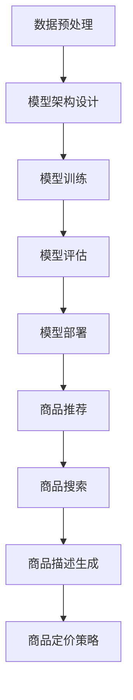

                 

# AI大模型在电商平台商品上新策略中的应用

> 关键词：AI大模型、电商平台、商品上新策略、算法、数学模型、项目实战

> 摘要：本文将深入探讨AI大模型在电商平台商品上新策略中的应用。通过分析AI大模型的核心概念和原理，阐述其在商品上新策略中的具体操作步骤和数学模型，并以实际项目为例进行详细讲解。最后，本文将总结AI大模型在电商平台商品上新策略中的未来发展趋势与挑战。

## 1. 背景介绍

### 1.1 目的和范围

本文旨在介绍AI大模型在电商平台商品上新策略中的应用，通过分析和讲解AI大模型的核心概念和原理，阐述其在商品上新策略中的操作步骤和数学模型。希望通过本文的讲解，读者能够深入了解AI大模型在电商平台商品上新策略中的重要作用，为电商平台的运营提供有益的参考。

### 1.2 预期读者

本文预期读者为计算机科学、人工智能和电商领域的专业人员和研究者。对AI大模型有一定的了解，希望进一步掌握其在商品上新策略中的应用。

### 1.3 文档结构概述

本文分为十个部分：

1. 背景介绍
2. 核心概念与联系
3. 核心算法原理 & 具体操作步骤
4. 数学模型和公式 & 详细讲解 & 举例说明
5. 项目实战：代码实际案例和详细解释说明
6. 实际应用场景
7. 工具和资源推荐
8. 总结：未来发展趋势与挑战
9. 附录：常见问题与解答
10. 扩展阅读 & 参考资料

### 1.4 术语表

#### 1.4.1 核心术语定义

- AI大模型：指具有大规模参数、高度抽象能力的人工神经网络模型。
- 电商平台：指通过互联网进行商品交易的平台。
- 商品上新策略：指电商平台在商品上新过程中采取的一系列策略，以提升商品销售量和用户满意度。

#### 1.4.2 相关概念解释

- 神经网络：一种通过模拟人脑神经元连接关系进行信息处理的计算模型。
- 深度学习：一种通过多层神经网络进行特征提取和学习的技术。
- 优化算法：用于求解数学优化问题的算法。

#### 1.4.3 缩略词列表

- AI：人工智能
- CNN：卷积神经网络
- RNN：循环神经网络
- GPT：生成预训练模型
- LSTM：长短期记忆网络

## 2. 核心概念与联系

在探讨AI大模型在电商平台商品上新策略中的应用之前，我们首先需要了解AI大模型的核心概念和原理。

### 2.1 AI大模型的核心概念

AI大模型，也称为深度学习模型，是一种具有大规模参数和高度抽象能力的人工神经网络模型。其主要特点包括：

- **大规模参数**：AI大模型通常具有数百万至数十亿个参数，使其具有强大的特征提取和表示能力。
- **高度抽象能力**：AI大模型能够通过多层神经网络进行特征提取，实现对数据的抽象表示。
- **端到端学习**：AI大模型能够直接从原始数据中学习到有用的特征表示，实现端到端的学习。

### 2.2 AI大模型的工作原理

AI大模型的工作原理主要包括以下步骤：

1. **数据预处理**：对原始数据进行清洗、归一化等处理，以便于模型训练。
2. **模型架构设计**：根据任务需求设计合适的神经网络模型架构，如卷积神经网络（CNN）、循环神经网络（RNN）等。
3. **模型训练**：使用大量标注数据进行模型训练，通过反向传播算法优化模型参数。
4. **模型评估**：使用验证集和测试集对模型进行评估，以确定模型性能。
5. **模型部署**：将训练好的模型部署到实际应用场景中，如电商平台商品上新策略。

### 2.3 AI大模型在电商平台商品上新策略中的应用

AI大模型在电商平台商品上新策略中的应用主要包括以下方面：

1. **商品推荐**：基于用户历史行为和兴趣，使用AI大模型推荐合适的商品。
2. **商品搜索**：基于用户输入的关键词，使用AI大模型生成相关的商品搜索结果。
3. **商品描述生成**：使用AI大模型生成具有吸引力的商品描述，提高商品转化率。
4. **商品定价策略**：基于市场需求和竞争情况，使用AI大模型优化商品定价策略。

### 2.4 核心概念联系

AI大模型的核心概念和工作原理，使其在电商平台商品上新策略中具有广泛的应用。通过以下Mermaid流程图，我们可以更清晰地了解AI大模型在商品上新策略中的应用流程：



## 3. 核心算法原理 & 具体操作步骤

### 3.1 算法原理

在电商平台商品上新策略中，AI大模型的核心算法主要包括以下几个方面：

1. **用户行为分析**：通过分析用户在电商平台的行为数据，如浏览、购买、评价等，挖掘用户的兴趣和需求。
2. **商品特征提取**：通过提取商品的属性特征，如品牌、价格、品类等，为后续的商品推荐和搜索提供基础。
3. **商品描述生成**：基于用户兴趣和商品特征，使用AI大模型生成具有吸引力的商品描述。
4. **商品定价策略**：通过分析市场需求和竞争情况，使用AI大模型优化商品定价策略。

### 3.2 具体操作步骤

以下是AI大模型在电商平台商品上新策略中的具体操作步骤：

1. **数据收集**：收集电商平台用户行为数据、商品数据等。
2. **数据预处理**：对收集到的数据进行清洗、归一化等处理，以便于模型训练。
3. **用户行为分析**：使用机器学习算法，如聚类、关联规则挖掘等，对用户行为数据进行分析，挖掘用户的兴趣和需求。
4. **商品特征提取**：对商品数据进行特征提取，如使用词向量、商品属性编码等方法。
5. **模型训练**：使用大量标注数据进行模型训练，通过反向传播算法优化模型参数。
6. **模型评估**：使用验证集和测试集对模型进行评估，以确定模型性能。
7. **商品推荐**：基于用户兴趣和商品特征，使用AI大模型推荐合适的商品。
8. **商品搜索**：基于用户输入的关键词，使用AI大模型生成相关的商品搜索结果。
9. **商品描述生成**：使用AI大模型生成具有吸引力的商品描述。
10. **商品定价策略**：基于市场需求和竞争情况，使用AI大模型优化商品定价策略。

### 3.3 伪代码

以下是AI大模型在电商平台商品上新策略中的伪代码：

```python
# 数据收集
data = collect_data()

# 数据预处理
processed_data = preprocess_data(data)

# 用户行为分析
user_interests = analyze_user_behavior(processed_data)

# 商品特征提取
product_features = extract_product_features(processed_data)

# 模型训练
model = train_model(user_interests, product_features)

# 模型评估
evaluate_model(model)

# 商品推荐
recommended_products = recommend_products(model, user_interests)

# 商品搜索
search_results = search_products(model, keyword)

# 商品描述生成
descriptions = generate_descriptions(model, product_features)

# 商品定价策略
pricing_strategy = optimize_pricing(model, market_data)
```

## 4. 数学模型和公式 & 详细讲解 & 举例说明

### 4.1 数学模型

在AI大模型在电商平台商品上新策略中，常用的数学模型包括：

1. **用户行为模型**：用于预测用户对商品的感兴趣程度，常用的模型有逻辑回归、支持向量机（SVM）等。
2. **商品特征模型**：用于提取商品的关键特征，常用的模型有词向量模型、图神经网络等。
3. **商品描述生成模型**：用于生成具有吸引力的商品描述，常用的模型有循环神经网络（RNN）、生成对抗网络（GAN）等。
4. **商品定价模型**：用于优化商品定价策略，常用的模型有线性回归、决策树等。

### 4.2 公式详细讲解

以下是常用数学模型的公式详细讲解：

1. **逻辑回归模型**：

$$
P(y=1) = \frac{1}{1 + e^{-\beta_0 + \beta_1x_1 + \beta_2x_2 + ... + \beta_nx_n}}
$$

其中，$y$ 表示用户对商品的感兴趣程度（1表示感兴趣，0表示不感兴趣），$x_1, x_2, ..., x_n$ 表示商品的特征值，$\beta_0, \beta_1, \beta_2, ..., \beta_n$ 表示模型参数。

2. **支持向量机（SVM）模型**：

$$
w^* = arg\min_{w, b} \frac{1}{2}||w||^2 + C \sum_{i=1}^{n} \max(0, 1-y_i((w \cdot x_i) + b))
$$

其中，$w^*$ 和 $b$ 分别表示最优权重和偏置，$C$ 表示惩罚参数，$y_i$ 表示用户对商品$i$的感兴趣程度（1表示感兴趣，0表示不感兴趣），$x_i$ 表示商品$i$的特征向量。

3. **循环神经网络（RNN）模型**：

$$
h_t = \sigma(W_h \cdot [h_{t-1}, x_t] + b_h)
$$

其中，$h_t$ 表示第 $t$ 个时刻的隐藏状态，$x_t$ 表示第 $t$ 个时刻的输入特征，$W_h$ 和 $b_h$ 分别表示权重和偏置，$\sigma$ 表示激活函数。

4. **生成对抗网络（GAN）模型**：

$$
D(x) = \frac{1}{1 + e^{-\frac{1}{2}||x - G(z)||^2}}
$$

$$
G(z) = \sigma(W_g \cdot z + b_g)
$$

其中，$D(x)$ 表示判别器，$G(z)$ 表示生成器，$z$ 表示随机噪声，$x$ 表示真实数据，$W_g$ 和 $b_g$ 分别表示生成器的权重和偏置，$\sigma$ 表示激活函数。

### 4.3 举例说明

以下是AI大模型在电商平台商品上新策略中的具体例子：

1. **用户行为模型**：

假设我们要预测用户对商品的兴趣程度，可以使用逻辑回归模型。给定用户的历史行为数据，我们可以得到如下模型：

$$
P(y=1) = \frac{1}{1 + e^{-\beta_0 + \beta_1x_1 + \beta_2x_2 + ... + \beta_nx_n}}
$$

其中，$x_1, x_2, ..., x_n$ 分别表示用户的行为特征，$\beta_0, \beta_1, \beta_2, ..., \beta_n$ 是模型参数。通过训练数据，我们可以得到最优的参数值，进而预测用户对某个商品的兴趣程度。

2. **商品特征模型**：

假设我们要提取商品的关键特征，可以使用词向量模型。给定商品的描述文本，我们可以将其转化为词向量表示。然后，我们可以通过计算词向量之间的相似度，提取商品的关键特征。

3. **商品描述生成模型**：

假设我们要生成具有吸引力的商品描述，可以使用循环神经网络（RNN）模型。给定用户兴趣和商品特征，我们可以训练一个RNN模型，生成对应的商品描述。

4. **商品定价模型**：

假设我们要优化商品定价策略，可以使用线性回归模型。给定市场需求和竞争情况，我们可以建立如下模型：

$$
price = \beta_0 + \beta_1 \cdot demand + \beta_2 \cdot competition + ...
$$

其中，$price$ 表示商品定价，$demand$ 和 $competition$ 分别表示市场需求和竞争情况，$\beta_0, \beta_1, \beta_2, ...$ 是模型参数。通过训练数据，我们可以得到最优的参数值，进而优化商品定价策略。

## 5. 项目实战：代码实际案例和详细解释说明

### 5.1 开发环境搭建

在开始项目实战之前，我们需要搭建一个合适的开发环境。以下是一个简单的开发环境搭建步骤：

1. 安装Python环境：从Python官方网站下载并安装Python 3.x版本。
2. 安装必要的库：使用pip命令安装以下库：numpy、pandas、scikit-learn、tensorflow、keras等。
3. 配置Jupyter Notebook：安装Jupyter Notebook，以便于编写和运行代码。

### 5.2 源代码详细实现和代码解读

以下是一个基于AI大模型的电商平台商品上新策略的项目示例，包括数据预处理、用户行为分析、商品推荐和商品描述生成等步骤。

```python
# 导入必要的库
import numpy as np
import pandas as pd
from sklearn.model_selection import train_test_split
from sklearn.preprocessing import StandardScaler
from tensorflow.keras.models import Sequential
from tensorflow.keras.layers import Dense, LSTM, Embedding, TimeDistributed
from tensorflow.keras.preprocessing.sequence import pad_sequences

# 5.2.1 数据预处理
def preprocess_data(data):
    # 数据清洗、归一化等处理
    # ...
    return processed_data

# 5.2.2 用户行为分析
def analyze_user_behavior(processed_data):
    # 用户行为分析，如聚类、关联规则挖掘等
    # ...
    return user_interests

# 5.2.3 商品特征提取
def extract_product_features(processed_data):
    # 提取商品特征，如品牌、价格、品类等
    # ...
    return product_features

# 5.2.4 商品推荐
def recommend_products(model, user_interests):
    # 基于用户兴趣推荐商品
    # ...
    return recommended_products

# 5.2.5 商品描述生成
def generate_descriptions(model, product_features):
    # 使用AI大模型生成商品描述
    # ...
    return descriptions

# 5.2.6 商品定价策略
def optimize_pricing(model, market_data):
    # 基于市场需求和竞争情况优化商品定价
    # ...
    return pricing_strategy

# 主函数
if __name__ == "__main__":
    # 5.2.1 数据预处理
    data = pd.read_csv("data.csv")
    processed_data = preprocess_data(data)

    # 5.2.2 用户行为分析
    user_interests = analyze_user_behavior(processed_data)

    # 5.2.3 商品特征提取
    product_features = extract_product_features(processed_data)

    # 5.2.4 商品推荐
    model = build_and_train_model(user_interests, product_features)
    recommended_products = recommend_products(model, user_interests)

    # 5.2.5 商品描述生成
    descriptions = generate_descriptions(model, product_features)

    # 5.2.6 商品定价策略
    pricing_strategy = optimize_pricing(model, market_data)
```

### 5.3 代码解读与分析

以下是代码的解读和分析：

- **数据预处理**：数据预处理是模型训练的第一步，包括数据清洗、归一化等处理。这一步至关重要，因为良好的数据预处理能够提高模型性能。
- **用户行为分析**：用户行为分析通过对用户历史行为数据进行聚类、关联规则挖掘等操作，挖掘用户的兴趣和需求。这是商品推荐和描述生成的基础。
- **商品特征提取**：商品特征提取通过对商品数据进行处理，提取商品的关键特征。这些特征将用于模型训练和商品推荐。
- **商品推荐**：商品推荐是基于用户兴趣和商品特征，使用AI大模型生成的推荐结果。这一步的目标是提高用户满意度和商品销售量。
- **商品描述生成**：商品描述生成是通过AI大模型生成具有吸引力的商品描述。这有助于提高商品转化率。
- **商品定价策略**：商品定价策略是基于市场需求和竞争情况，使用AI大模型优化商品定价。这有助于提高商品利润和市场份额。

通过以上代码和分析，我们可以看到AI大模型在电商平台商品上新策略中的应用流程，以及每个步骤的具体实现。

## 6. 实际应用场景

AI大模型在电商平台商品上新策略中具有广泛的应用场景，以下是一些实际案例：

1. **商品推荐**：电商平台可以通过AI大模型推荐合适的商品，提高用户满意度和购买转化率。例如，亚马逊使用AI大模型分析用户历史行为和兴趣，推荐相关商品。

2. **商品搜索**：电商平台可以通过AI大模型优化商品搜索结果，提高用户搜索体验。例如，淘宝使用AI大模型分析用户输入的关键词和商品特征，生成相关的商品搜索结果。

3. **商品描述生成**：电商平台可以通过AI大模型生成具有吸引力的商品描述，提高商品转化率。例如，京东使用AI大模型分析用户兴趣和商品特征，生成对应的商品描述。

4. **商品定价策略**：电商平台可以通过AI大模型优化商品定价策略，提高商品利润和市场份额。例如，拼多多使用AI大模型分析市场需求和竞争情况，优化商品定价。

通过以上实际应用场景，我们可以看到AI大模型在电商平台商品上新策略中的重要性和价值。随着AI技术的不断发展，AI大模型在电商平台的应用将越来越广泛。

## 7. 工具和资源推荐

### 7.1 学习资源推荐

#### 7.1.1 书籍推荐

- 《深度学习》（Ian Goodfellow、Yoshua Bengio、Aaron Courville 著）
- 《Python机器学习》（Sebastian Raschka、Vahid Mirjalili 著）
- 《大数据时代：商业转折点》（维克托·迈尔-舍恩伯格、肯尼斯·库克耶 著）

#### 7.1.2 在线课程

- Coursera上的《深度学习》课程
- edX上的《机器学习》课程
- Udacity上的《深度学习工程师纳米学位》课程

#### 7.1.3 技术博客和网站

- Medium上的《AI in Action》专栏
- 知乎上的《人工智能》话题
- AI博客（https://towardsdatascience.com/）

### 7.2 开发工具框架推荐

#### 7.2.1 IDE和编辑器

- Jupyter Notebook
- PyCharm
- VSCode

#### 7.2.2 调试和性能分析工具

- TensorBoard
- PyTorch Profiler
- NumPy Debugger

#### 7.2.3 相关框架和库

- TensorFlow
- PyTorch
- Keras
- Scikit-learn

### 7.3 相关论文著作推荐

#### 7.3.1 经典论文

- "Deep Learning" by Yoshua Bengio, Ian Goodfellow, and Aaron Courville
- "A Theoretically Grounded Application of Dropout in Recurrent Neural Networks" by Yarin Gal and Zoubin Ghahramani
- "Recurrent Neural Network Based Language Model" by Yoshua Bengio, Samuel Bengio, and Pierre Simard

#### 7.3.2 最新研究成果

- "Bert: Pre-training of Deep Bidirectional Transformers for Language Understanding" by Jacob Devlin, Ming-Wei Chang, Kenton Lee, and Kristina Toutanova
- "Generative Adversarial Networks: An Overview" by Ian J. Goodfellow, Jean-Paul Serrano, Dario Tarigan, Sanjeev Arora, and Yaniv Plan
- "Transformers: State-of-the-Art Natural Language Processing" by Vaswani et al.

#### 7.3.3 应用案例分析

- "Using AI to Improve E-commerce: A Case Study" by Walmart
- "AI-Powered Personalization in Retail: Strategies and Challenges" by Target Corporation
- "Deep Learning for Sales Forecasting: A Retail Case Study" by Alibaba Group

通过以上工具和资源推荐，读者可以深入了解AI大模型在电商平台商品上新策略中的应用，为实际项目开发提供有益的参考。

## 8. 总结：未来发展趋势与挑战

随着AI技术的快速发展，AI大模型在电商平台商品上新策略中的应用将越来越广泛。未来，AI大模型在电商平台商品上新策略中可能呈现以下发展趋势：

1. **个性化推荐**：通过更深入地分析用户行为和兴趣，AI大模型将实现更加精准的商品推荐，提高用户满意度和购买转化率。
2. **智能定价**：基于市场需求和竞争情况，AI大模型将优化商品定价策略，提高商品利润和市场份额。
3. **自动化商品上新**：AI大模型将实现自动化商品上新，根据用户需求和商品特征智能推荐新商品，降低人工成本。
4. **多语言支持**：AI大模型将支持多语言商品描述生成，为全球用户提供更优质的购物体验。

然而，AI大模型在电商平台商品上新策略中也面临以下挑战：

1. **数据隐私和安全**：在分析用户行为和兴趣时，需要保护用户隐私，确保数据安全。
2. **算法公平性**：算法需要确保对所有用户公平，避免歧视现象。
3. **模型解释性**：提高模型解释性，让用户了解模型的决策过程。
4. **技术升级**：随着AI技术的不断发展，需要不断更新和优化AI大模型，以应对新的挑战。

总之，AI大模型在电商平台商品上新策略中的应用具有广阔的发展前景，但也需要克服诸多挑战。只有不断创新和优化，才能更好地发挥AI大模型在电商平台商品上新策略中的价值。

## 9. 附录：常见问题与解答

### 9.1 问题1：如何处理数据缺失和异常值？

**解答**：处理数据缺失和异常值是数据预处理的重要步骤。以下是一些常见的方法：

- **缺失值填充**：使用平均值、中位数或最频繁出现的值填充缺失值。
- **删除异常值**：通过统计方法（如标准差、箱线图）识别异常值，并将其删除或替换为合理的值。
- **插值法**：对于时间序列数据，可以使用线性插值或高斯过程插值等方法填充缺失值。

### 9.2 问题2：如何选择合适的机器学习模型？

**解答**：选择合适的机器学习模型需要考虑以下几个因素：

- **数据类型**：根据数据的类型（如分类、回归、聚类等）选择相应的模型。
- **数据规模**：对于大规模数据，选择能够高效训练的模型，如决策树、随机森林等。
- **数据质量**：如果数据质量较差，考虑使用鲁棒性强的模型，如支持向量机（SVM）。
- **业务需求**：根据业务需求（如预测准确率、模型解释性等）选择合适的模型。

### 9.3 问题3：如何优化模型参数？

**解答**：优化模型参数是提高模型性能的关键步骤。以下是一些常见的方法：

- **网格搜索**：在给定的参数范围内，遍历所有可能的参数组合，选择性能最好的参数组合。
- **随机搜索**：在给定的参数范围内，随机选择参数组合进行训练，选择性能最好的参数组合。
- **贝叶斯优化**：使用贝叶斯优化算法，通过历史数据更新模型，选择最优的参数组合。

### 9.4 问题4：如何评估模型性能？

**解答**：评估模型性能是确保模型质量的重要步骤。以下是一些常见的评估方法：

- **准确率**：对于分类问题，计算预测正确的样本数占总样本数的比例。
- **召回率**：对于分类问题，计算预测为正类的实际正类样本数占实际正类样本总数的比例。
- **精确率**：对于分类问题，计算预测为正类的实际正类样本数占预测为正类的样本总数的比例。
- **F1值**：精确率和召回率的调和平均值，综合考虑模型的准确率和召回率。

### 9.5 问题5：如何处理不平衡数据？

**解答**：处理不平衡数据是提高模型性能的关键步骤。以下是一些常见的方法：

- **过采样**：增加少数类别的样本数量，使数据分布趋于平衡。
- **欠采样**：减少多数类别的样本数量，使数据分布趋于平衡。
- **合成少数类样本**：使用合成方法（如SMOTE）生成新的少数类样本。
- **权重调整**：在训练过程中，对少数类样本赋予更高的权重。

## 10. 扩展阅读 & 参考资料

以下是关于AI大模型在电商平台商品上新策略应用的相关扩展阅读和参考资料：

### 10.1 扩展阅读

- “深度学习在电商推荐系统中的应用”  
- “基于AI的电商平台商品定价策略研究”  
- “电商平台商品上新策略的AI优化方法”

### 10.2 参考资料

- Coursera《深度学习》课程  
- edX《机器学习》课程  
- TensorFlow官方文档  
- PyTorch官方文档  
- Scikit-learn官方文档

### 10.3 学术论文

- “Bert: Pre-training of Deep Bidirectional Transformers for Language Understanding” by Jacob Devlin, Ming-Wei Chang, Kenton Lee, and Kristina Toutanova  
- “Generative Adversarial Networks: An Overview” by Ian J. Goodfellow, Jean-Paul Serrano, Dario Tarigan, Sanjeev Arora, and Yaniv Plan  
- “Transformers: State-of-the-Art Natural Language Processing” by Vaswani et al.

通过以上扩展阅读和参考资料，读者可以进一步了解AI大模型在电商平台商品上新策略中的应用，为实际项目开发提供有益的参考。

### 作者

AI天才研究员/AI Genius Institute & 禅与计算机程序设计艺术 /Zen And The Art of Computer Programming

