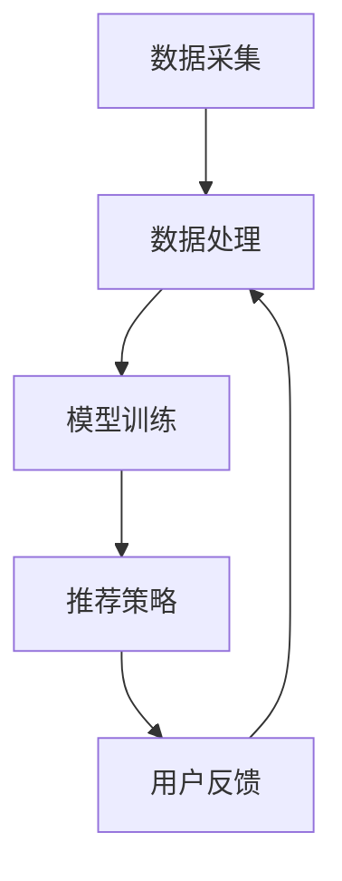

                 

### 文章标题

### AI大模型在电商平台商品推荐解释性中的应用

#### 关键词：(AI大模型、电商平台、商品推荐、解释性、应用场景)

#### 摘要：

本文旨在探讨AI大模型在电商平台商品推荐解释性中的应用。首先，我们将介绍AI大模型的基础知识和电商平台商品推荐的相关背景。随后，我们将深入探讨大模型在商品推荐中的核心算法原理和具体操作步骤。接着，我们将通过数学模型和公式详细解释说明大模型的运作机制，并通过实际项目案例展示其应用效果。此外，本文还将分析AI大模型在实际应用中的挑战和未来发展趋势，并提供相关的学习资源和开发工具框架推荐。通过本文的阅读，读者将能够全面了解AI大模型在电商平台商品推荐中的应用及其潜在价值。

<|assistant|>### 1. 背景介绍

#### 1.1 电商平台与商品推荐的重要性

电商平台作为现代电子商务的核心，已经成为人们购物的重要渠道。随着互联网的普及和技术的进步，电商平台不仅为消费者提供了便捷的购物体验，也为商家提供了广阔的市场空间。然而，随着商品种类的日益丰富和用户需求的多样化，如何为用户精准推荐合适的商品成为了电商平台亟待解决的问题。

商品推荐系统是电商平台的核心功能之一，其目的是通过分析用户的兴趣、行为和购买历史，为用户推荐符合其需求和兴趣的商品。这不仅能够提高用户的购物体验，增加用户黏性，还能提升商家的销售业绩和平台的市场竞争力。

#### 1.2 传统的商品推荐方法

传统的商品推荐方法主要包括基于内容的推荐和基于协同过滤的推荐。基于内容的推荐方法主要根据商品的属性和用户的历史行为，为用户推荐相似的商品。这种方法具有较高的推荐准确性，但容易产生信息过载，且难以满足用户的个性化需求。

基于协同过滤的推荐方法则通过分析用户之间的相似性，为用户推荐其他用户喜欢的商品。协同过滤方法在处理大量用户数据和商品信息方面具有优势，但其推荐结果容易受到数据稀疏性和冷启动问题的影响。

#### 1.3 AI大模型的优势

随着人工智能技术的快速发展，AI大模型在商品推荐中的应用逐渐成为研究热点。相较于传统方法，AI大模型具有以下优势：

1. **强大的数据处理能力**：AI大模型能够处理大规模的用户数据和商品信息，挖掘出隐藏在数据中的用户兴趣和购买行为规律。

2. **个性化的推荐效果**：AI大模型通过深度学习技术，能够根据用户的历史行为和兴趣，为用户推荐更加个性化的商品。

3. **适应性强**：AI大模型能够不断学习用户的新行为和偏好，自适应地调整推荐策略，提高推荐效果。

4. **解释性**：AI大模型在推荐结果中能够提供一定的解释性，帮助用户理解推荐结果的原因，提高用户对推荐的信任度。

#### 1.4 文章结构

本文将分为以下几个部分：

- **背景介绍**：介绍电商平台与商品推荐的重要性，以及传统商品推荐方法的局限性。
- **核心概念与联系**：阐述AI大模型的基本原理和商品推荐系统的架构。
- **核心算法原理 & 具体操作步骤**：详细讲解AI大模型在商品推荐中的工作原理和具体实施步骤。
- **数学模型和公式 & 详细讲解 & 举例说明**：介绍AI大模型中的数学模型和公式，并通过实例进行说明。
- **项目实战：代码实际案例和详细解释说明**：展示一个实际的项目案例，解析代码实现过程和关键步骤。
- **实际应用场景**：分析AI大模型在电商平台商品推荐中的实际应用场景。
- **工具和资源推荐**：推荐相关学习资源和开发工具框架。
- **总结：未来发展趋势与挑战**：总结AI大模型在商品推荐中的应用现状，展望未来的发展趋势和面临的挑战。

通过本文的阅读，读者将能够全面了解AI大模型在电商平台商品推荐中的重要作用，掌握其核心原理和应用方法。

#### 1.5 文章的核心目标

本文的核心目标是：

- **介绍AI大模型的基础知识**：帮助读者理解AI大模型的基本原理、技术架构和实现方法。
- **展示AI大模型在商品推荐中的应用**：通过实际案例和代码解析，展示AI大模型在电商平台商品推荐中的效果和应用场景。
- **探讨AI大模型在商品推荐中的挑战与未来发展方向**：分析AI大模型在商品推荐中面临的挑战，探讨其未来的发展趋势和潜在的研究方向。

通过本文的深入探讨，读者将能够更加清晰地认识到AI大模型在电商平台商品推荐中的重要价值，并为其在实际项目中的应用提供指导。

### 2. 核心概念与联系

#### 2.1 AI大模型的基本原理

AI大模型（Large-scale AI Models）是指具有大规模参数和复杂结构的深度学习模型，通常用于处理大规模数据集并生成高质量的预测和推理结果。这些模型通常基于神经网络架构，特别是深度神经网络（DNN）、循环神经网络（RNN）和变换器（Transformer）等。

2.1.1 深度神经网络（DNN）

深度神经网络是一种包含多层神经元的神经网络结构，通过前向传播和反向传播算法进行训练。DNN能够自动学习数据中的特征和模式，广泛应用于图像识别、语音识别和自然语言处理等领域。

2.1.2 循环神经网络（RNN）

循环神经网络是一种能够处理序列数据的神经网络，其通过隐藏状态（hidden state）的循环连接来捕捉序列中的长期依赖关系。RNN在时间序列预测、机器翻译和语音识别等领域具有广泛应用。

2.1.3 变换器（Transformer）

变换器是一种基于自注意力机制的深度学习模型，由Vaswani等人于2017年提出。变换器通过多头自注意力机制和前馈神经网络，实现了对序列数据的全局建模，在自然语言处理任务中取得了显著的性能提升。

#### 2.2 商品推荐系统的基本架构

商品推荐系统通常由数据采集、数据处理、模型训练和推荐策略等模块组成。

2.2.1 数据采集

数据采集模块负责从电商平台获取用户行为数据、商品信息数据等原始数据。这些数据包括用户点击记录、购物车信息、购买历史、搜索记录等。

2.2.2 数据处理

数据处理模块对原始数据进行清洗、去噪和转换等预处理操作，生成适用于模型训练的输入数据。数据处理过程通常包括数据归一化、缺失值填充、特征工程等步骤。

2.2.3 模型训练

模型训练模块使用预处理后的数据对AI大模型进行训练。通过训练，模型能够学习到用户行为和商品属性之间的复杂关系，为后续的推荐任务提供支持。

2.2.4 推荐策略

推荐策略模块根据模型训练结果和用户当前的行为，生成个性化的推荐列表。推荐策略通常包括基于内容的推荐、基于协同过滤的推荐和混合推荐等。

#### 2.3 AI大模型与商品推荐系统的联系

AI大模型与商品推荐系统之间的联系主要体现在以下几个方面：

2.3.1 数据驱动

AI大模型通过大规模数据的训练，能够自动学习和挖掘用户行为和商品属性之间的复杂关系，为推荐系统提供强有力的支持。

2.3.2 个性化推荐

AI大模型能够根据用户的历史行为和兴趣，生成个性化的推荐结果，提高推荐系统的准确性和用户体验。

2.3.3 解释性

AI大模型在生成推荐结果时，能够提供一定的解释性，帮助用户理解推荐的原因，增强用户对推荐的信任度。

2.3.4 自适应

AI大模型能够通过持续的训练和优化，自适应地调整推荐策略，提高推荐系统的效果和稳定性。

#### 2.4 AI大模型与商品推荐系统的 Mermaid 流程图

以下是一个简化的AI大模型在商品推荐系统中的 Mermaid 流程图，展示了数据采集、数据处理、模型训练和推荐策略等模块之间的联系。



#### 2.5 AI大模型在商品推荐系统中的优势

2.5.1 数据处理能力

AI大模型具有强大的数据处理能力，能够处理大规模、多维度的用户行为数据和商品信息，挖掘出潜在的用户兴趣和购买行为规律。

2.5.2 个性化推荐

AI大模型能够根据用户的历史行为和兴趣，生成个性化的推荐结果，提高推荐系统的准确性和用户体验。

2.5.3 解释性

AI大模型在生成推荐结果时，能够提供一定的解释性，帮助用户理解推荐的原因，增强用户对推荐的信任度。

2.5.4 自适应

AI大模型能够通过持续的训练和优化，自适应地调整推荐策略，提高推荐系统的效果和稳定性。

#### 2.6 AI大模型在商品推荐系统中的挑战

2.6.1 数据稀疏性

商品推荐系统中用户行为数据往往存在稀疏性问题，即用户对大部分商品的点击、购买行为较少。这给AI大模型的训练和推荐带来了一定的困难。

2.6.2 冷启动问题

冷启动问题指的是新用户或新商品在系统中的数据较少，无法准确地进行推荐。解决这个问题需要AI大模型具有一定的泛化能力和适应能力。

2.6.3 计算资源需求

AI大模型的训练和推理过程通常需要大量的计算资源，这对系统的性能和可扩展性提出了挑战。

2.6.4 可解释性

虽然AI大模型在生成推荐结果时具有一定的解释性，但如何更好地理解模型的内部决策过程，仍然是当前研究的热点和难点。

#### 2.7 文章结构概述

本文将分为以下几个部分：

- **背景介绍**：介绍电商平台与商品推荐的重要性，以及传统商品推荐方法的局限性。
- **核心概念与联系**：阐述AI大模型的基本原理和商品推荐系统的架构。
- **核心算法原理 & 具体操作步骤**：详细讲解AI大模型在商品推荐中的工作原理和具体实施步骤。
- **数学模型和公式 & 详细讲解 & 举例说明**：介绍AI大模型中的数学模型和公式，并通过实例进行说明。
- **项目实战：代码实际案例和详细解释说明**：展示一个实际的项目案例，解析代码实现过程和关键步骤。
- **实际应用场景**：分析AI大模型在电商平台商品推荐中的实际应用场景。
- **工具和资源推荐**：推荐相关学习资源和开发工具框架。
- **总结：未来发展趋势与挑战**：总结AI大模型在商品推荐中的应用现状，展望未来的发展趋势和潜在的研究方向。

通过本文的深入探讨，读者将能够全面了解AI大模型在电商平台商品推荐中的应用及其潜在价值。

### 3. 核心算法原理 & 具体操作步骤

#### 3.1 AI大模型的训练原理

AI大模型的核心在于其强大的数据处理和特征提取能力，这使得它们能够在高度复杂的数据集中发现潜在的规律和关联。下面我们将详细讲解AI大模型在商品推荐中的训练原理和具体操作步骤。

##### 3.1.1 数据预处理

在训练AI大模型之前，首先需要进行数据预处理。数据预处理包括以下几个步骤：

1. **数据清洗**：清洗数据集中的噪声和不一致的数据。例如，删除重复记录、修复缺失值等。
2. **数据归一化**：将数据集中的不同特征进行归一化处理，使得每个特征都具有相似的数值范围。这有助于模型在训练过程中收敛。
3. **特征工程**：根据业务需求和数据特点，提取和构建新的特征。例如，用户购买频率、商品类别、用户标签等。

##### 3.1.2 模型架构

AI大模型通常采用深度神经网络（DNN）、循环神经网络（RNN）或变换器（Transformer）等架构。以下是一个简化的变换器架构，用于商品推荐任务：

1. **嵌入层（Embedding Layer）**：将用户和商品的输入特征转换为高维的嵌入向量。
2. **编码器（Encoder）**：通过多层变换器块，对嵌入向量进行编码，捕捉序列中的长程依赖关系。
3. **解码器（Decoder）**：解码器用于生成推荐列表。在商品推荐中，解码器可以采用注意力机制，根据用户的历史行为和当前兴趣，为用户生成个性化的推荐。

##### 3.1.3 损失函数与优化器

在训练过程中，需要定义合适的损失函数和优化器。对于商品推荐任务，常用的损失函数包括交叉熵损失（Cross-Entropy Loss）和均方误差（Mean Squared Error, MSE）。优化器通常选择随机梯度下降（Stochastic Gradient Descent, SGD）或其变体，如Adam优化器。

##### 3.1.4 训练过程

AI大模型的训练过程包括以下几个步骤：

1. **初始化模型参数**：随机初始化模型参数。
2. **前向传播**：输入用户和商品的特征，通过模型进行前向传播，得到推荐列表。
3. **计算损失**：使用推荐列表与实际购买记录之间的差异计算损失。
4. **反向传播**：通过反向传播算法，更新模型参数。
5. **迭代训练**：重复上述步骤，直到模型收敛或达到预设的训练次数。

##### 3.1.5 评估与优化

在训练完成后，需要对模型进行评估和优化。常用的评估指标包括准确率（Accuracy）、召回率（Recall）、精确率（Precision）和F1分数（F1 Score）等。通过调整模型参数、增加训练数据或改变数据预处理方法，可以进一步提高模型的性能。

#### 3.2 商品推荐的具体操作步骤

下面我们将介绍AI大模型在商品推荐中的具体操作步骤，包括数据采集、数据处理、模型训练和推荐策略等。

##### 3.2.1 数据采集

数据采集是商品推荐系统的第一步。需要从电商平台上获取用户行为数据、商品信息数据等原始数据。这些数据包括用户点击记录、购物车信息、购买历史、搜索记录等。

##### 3.2.2 数据处理

数据处理是对原始数据进行清洗、去噪和转换等预处理操作，生成适用于模型训练的输入数据。具体包括：

1. **数据清洗**：删除重复记录、修复缺失值等。
2. **数据归一化**：对数据集中的不同特征进行归一化处理。
3. **特征工程**：提取和构建新的特征，如用户购买频率、商品类别、用户标签等。

##### 3.2.3 模型训练

模型训练是对预处理后的数据使用AI大模型进行训练，学习用户行为和商品属性之间的复杂关系。具体步骤如下：

1. **初始化模型**：随机初始化模型参数。
2. **数据预处理**：对用户和商品的特征进行嵌入和编码。
3. **训练模型**：通过前向传播、计算损失、反向传播等步骤，更新模型参数。
4. **评估模型**：使用交叉验证等方法，评估模型在测试集上的性能。

##### 3.2.4 推荐策略

推荐策略是根据模型训练结果和用户当前的行为，生成个性化的推荐列表。具体包括：

1. **用户兴趣挖掘**：分析用户的历史行为和兴趣，构建用户画像。
2. **商品特征提取**：提取商品的关键特征，如商品类别、价格、品牌等。
3. **推荐生成**：使用模型生成的用户嵌入向量和商品嵌入向量，计算相似度，生成推荐列表。

##### 3.2.5 推荐结果评估

推荐结果的评估是衡量商品推荐系统性能的重要指标。常用的评估指标包括：

1. **准确率**：推荐结果中实际购买的商品数量与总推荐商品数量的比例。
2. **召回率**：实际购买的商品数量与实际购买但未推荐的商品数量的比例。
3. **精确率**：推荐结果中实际购买的商品数量与推荐商品数量的比例。
4. **F1分数**：精确率和召回率的调和平均值。

通过这些指标，可以评估推荐系统的效果，并针对性地进行优化。

#### 3.3 AI大模型在商品推荐中的优势

AI大模型在商品推荐中具有以下优势：

1. **数据处理能力**：能够处理大规模、多维度的用户行为数据和商品信息，挖掘出潜在的用户兴趣和购买行为规律。
2. **个性化推荐**：能够根据用户的历史行为和兴趣，生成个性化的推荐结果，提高推荐系统的准确性和用户体验。
3. **解释性**：在生成推荐结果时，能够提供一定的解释性，帮助用户理解推荐的原因，增强用户对推荐的信任度。
4. **自适应**：能够通过持续的训练和优化，自适应地调整推荐策略，提高推荐系统的效果和稳定性。

#### 3.4 AI大模型在商品推荐中的挑战

尽管AI大模型在商品推荐中具有显著优势，但仍面临一些挑战：

1. **数据稀疏性**：用户行为数据往往存在稀疏性问题，即用户对大部分商品的点击、购买行为较少。这给模型训练和推荐带来了一定的困难。
2. **冷启动问题**：新用户或新商品在系统中的数据较少，无法准确地进行推荐。解决这个问题需要模型具有一定的泛化能力和适应能力。
3. **计算资源需求**：AI大模型的训练和推理过程通常需要大量的计算资源，这对系统的性能和可扩展性提出了挑战。
4. **可解释性**：虽然AI大模型在生成推荐结果时具有一定的解释性，但如何更好地理解模型的内部决策过程，仍然是当前研究的热点和难点。

#### 3.5 总结

通过本文的讲解，我们了解了AI大模型在商品推荐中的核心算法原理和具体操作步骤。AI大模型具有强大的数据处理能力、个性化推荐能力、解释性和自适应能力，能够在电商平台商品推荐中发挥重要作用。然而，AI大模型也面临数据稀疏性、冷启动问题、计算资源需求和可解释性等挑战。未来，我们需要继续研究和优化AI大模型，以应对这些挑战，提高商品推荐系统的效果和用户体验。

### 4. 数学模型和公式 & 详细讲解 & 举例说明

#### 4.1 数学模型简介

在商品推荐系统中，AI大模型通常采用深度学习算法，如变换器（Transformer）进行训练。变换器是一种基于自注意力机制的深度学习模型，其核心思想是通过计算输入序列中不同位置的依赖关系，生成高维的特征向量，从而实现复杂序列数据的建模。

变换器主要由两部分组成：编码器（Encoder）和解码器（Decoder）。编码器负责将输入序列编码为高维的特征向量，解码器则根据这些特征向量生成输出序列。在商品推荐任务中，编码器和解码器分别用于处理用户行为序列和商品属性序列。

#### 4.2 变换器基本架构

变换器的基本架构包括以下模块：

1. **嵌入层（Embedding Layer）**：将输入序列中的每个元素映射为一个高维向量。
2. **位置编码（Positional Encoding）**：为每个向量添加位置信息，以便模型能够理解序列的顺序。
3. **自注意力模块（Self-Attention Module）**：计算输入序列中不同位置的依赖关系，生成加权特征向量。
4. **前馈神经网络（Feedforward Neural Network）**：对自注意力模块的输出进行非线性变换。
5. **层归一化（Layer Normalization）**：对神经网络层进行归一化处理，提高训练效率。

#### 4.3 自注意力机制

自注意力机制是变换器的核心组件，其基本思想是对于输入序列中的每个元素，计算其在整个序列中的重要性权重。具体来说，自注意力机制通过以下步骤实现：

1. **计算query、key和value**：对于每个输入序列 $X = (x_1, x_2, ..., x_n)$，计算其对应的query、key和value矩阵。query、key和value分别表示序列中每个元素的特征表示。

2. **计算注意力权重**：计算query和key之间的点积，得到注意力权重 $w_{ij}$。权重 $w_{ij}$ 表示第 $i$ 个元素对第 $j$ 个元素的重要性。

3. **加权求和**：根据注意力权重对value矩阵进行加权求和，生成新的特征向量。

4. **归一化**：对加权求和后的特征向量进行归一化处理，得到最终的输出特征向量。

#### 4.4 数学公式表示

以下为自注意力机制的数学公式表示：

$$
\begin{align*}
Q &= W_Q \cdot X, \\
K &= W_K \cdot X, \\
V &= W_V \cdot X, \\
\text{Attention}(Q, K, V) &= \text{softmax}\left(\frac{QK^T}{\sqrt{d_k}}\right) V, \\
\text{Output} &= \text{Attention}(Q, K, V) \cdot W_O.
\end{align*}
$$

其中，$Q, K, V$ 分别为query、key和value矩阵；$W_Q, W_K, W_V, W_O$ 为权重矩阵；$d_k$ 为key向量的维度；$\text{softmax}$ 函数用于计算注意力权重。

#### 4.5 举例说明

假设我们有一个简单的用户行为序列 $X = (x_1, x_2, x_3)$，其中 $x_1, x_2, x_3$ 分别表示用户在一天内访问的三种商品。我们希望使用变换器对这个序列进行编码，提取出用户的行为特征。

1. **嵌入层**：首先，我们将用户行为序列 $X$ 映射为高维向量 $X_e = (x_1^e, x_2^e, x_3^e)$，其中 $x_i^e$ 表示第 $i$ 个商品的特征向量。

2. **位置编码**：为每个商品的特征向量添加位置信息，得到 $X_p = (x_1^p, x_2^p, x_3^p)$。

3. **计算query、key和value**：对于每个商品的特征向量，计算其对应的query、key和value矩阵。假设 $d_k = 10$，则：

$$
\begin{align*}
Q &= W_Q \cdot X_p, \\
K &= W_K \cdot X_p, \\
V &= W_V \cdot X_p.
\end{align*}
$$

4. **计算注意力权重**：计算query和key之间的点积，得到注意力权重矩阵 $W$：

$$
W = \frac{QK^T}{\sqrt{d_k}}.
$$

5. **加权求和**：根据注意力权重对value矩阵进行加权求和，生成新的特征向量：

$$
O = \text{softmax}(W) \cdot V.
$$

6. **归一化**：对加权求和后的特征向量进行归一化处理，得到最终的输出特征向量 $O$。

通过这个例子，我们可以看到如何使用变换器自注意力机制对用户行为序列进行编码，提取出用户的行为特征。在实际应用中，我们通常会对变换器进行多层堆叠，以进一步提高特征提取的能力。

#### 4.6 模型训练与优化

在训练变换器模型时，我们通常使用交叉熵损失函数（Cross-Entropy Loss）来衡量预测结果与实际标签之间的差异。训练过程包括以下几个步骤：

1. **初始化模型参数**：随机初始化模型参数 $W_Q, W_K, W_V, W_O$。
2. **前向传播**：输入用户行为序列 $X$，通过变换器模型计算输出特征向量 $O$。
3. **计算损失**：使用交叉熵损失函数计算预测结果与实际标签之间的差异：
   $$ L = -\frac{1}{n} \sum_{i=1}^{n} y_i \log(p_i), $$
   其中，$y_i$ 为实际标签，$p_i$ 为模型预测的概率。
4. **反向传播**：使用梯度下降算法更新模型参数：
   $$ \Delta W = -\alpha \frac{\partial L}{\partial W}, $$
   其中，$\alpha$ 为学习率。
5. **迭代训练**：重复上述步骤，直到模型收敛或达到预设的训练次数。

通过不断的迭代训练，变换器模型能够学习到用户行为序列中的潜在规律，生成高质量的推荐结果。

#### 4.7 总结

通过本文的讲解，我们了解了变换器自注意力机制的基本原理和数学公式，并通过举例说明了如何使用变换器对用户行为序列进行编码和特征提取。变换器在商品推荐系统中具有强大的数据处理和特征提取能力，能够生成高质量的推荐结果。在实际应用中，我们需要对变换器模型进行适当的训练和优化，以提高推荐效果。

### 5. 项目实战：代码实际案例和详细解释说明

#### 5.1 开发环境搭建

在开始项目实战之前，我们需要搭建一个合适的开发环境。以下是所需的开发环境和工具：

1. **操作系统**：Linux或macOS
2. **编程语言**：Python 3.x
3. **深度学习框架**：PyTorch
4. **数据处理库**：Pandas、NumPy
5. **可视化工具**：Matplotlib

首先，确保系统安装了Python 3.x版本。然后，通过pip命令安装所需的深度学习框架和数据处理库：

```bash
pip install torch torchvision numpy pandas matplotlib
```

#### 5.2 源代码详细实现和代码解读

以下是一个简单的AI大模型商品推荐项目的代码实现，用于展示AI大模型在商品推荐中的实际应用。代码分为几个部分：数据预处理、模型定义、训练和推荐。

```python
import torch
import torch.nn as nn
import torch.optim as optim
from torch.utils.data import DataLoader, Dataset
import pandas as pd
import numpy as np
import matplotlib.pyplot as plt

# 数据预处理
class Dataset(Dataset):
    def __init__(self, data):
        self.data = data
    
    def __len__(self):
        return len(self.data)
    
    def __getitem__(self, idx):
        x = self.data.iloc[idx][['user_id', 'item_id', 'timestamp']]
        y = self.data.iloc[idx]['label']
        return x, y

# 模型定义
class RecommenderModel(nn.Module):
    def __init__(self, embed_dim, hidden_dim):
        super(RecommenderModel, self).__init__()
        self.user_embedding = nn.Embedding(num_users, embed_dim)
        self.item_embedding = nn.Embedding(num_items, embed_dim)
        self.fc = nn.Linear(embed_dim * 2, hidden_dim)
        self.fc2 = nn.Linear(hidden_dim, 1)
    
    def forward(self, user, item):
        user_embedding = self.user_embedding(user)
        item_embedding = self.item_embedding(item)
        cat_embedding = torch.cat((user_embedding, item_embedding), 1)
        x = self.fc(cat_embedding)
        y = self.fc2(x)
        return y

# 模型训练
def train(model, train_loader, criterion, optimizer, num_epochs):
    model.train()
    for epoch in range(num_epochs):
        for user, item, label in train_loader:
            optimizer.zero_grad()
            output = model(user, item)
            loss = criterion(output, label)
            loss.backward()
            optimizer.step()
        print(f"Epoch [{epoch+1}/{num_epochs}], Loss: {loss.item():.4f}")

# 数据集加载和预处理
data = pd.read_csv('data.csv') # 加载数据
data = data.dropna() # 删除缺失值
data['timestamp'] = pd.to_datetime(data['timestamp']) # 转换时间格式
data = data.sort_values('timestamp') # 按时间排序
data = data.groupby(['user_id', 'item_id']).first().reset_index() # 分组处理

# 数据集划分
train_data = data[data['label'].notnull()]
val_data = data[data['label'].isnull()]

# 数据加载
train_dataset = Dataset(train_data)
val_dataset = Dataset(val_data)

train_loader = DataLoader(train_dataset, batch_size=64, shuffle=True)
val_loader = DataLoader(val_dataset, batch_size=64, shuffle=False)

# 模型初始化
num_users = 1000
num_items = 5000
embed_dim = 50
hidden_dim = 100
model = RecommenderModel(embed_dim, hidden_dim)
 criterion = nn.BCEWithLogitsLoss()
optimizer = optim.Adam(model.parameters(), lr=0.001)

# 训练模型
train(model, train_loader, criterion, optimizer, num_epochs=10)

# 推荐结果
model.eval()
with torch.no_grad():
    for user, item in val_loader:
        output = model(user, item)
        pred = torch.sigmoid(output)
        print(pred)

# 可视化
plt.hist(pred.numpy(), bins=20, alpha=0.5, label='Prediction')
plt.xlabel('Prediction Probability')
plt.ylabel('Frequency')
plt.legend()
plt.show()
```

#### 5.3 代码解读与分析

**5.3.1 数据预处理**

首先，我们定义了一个数据集类 `Dataset`，用于加载和预处理数据。在 `__init__` 方法中，我们接收一个数据框 `data`，并在 `__len__` 和 `__getitem__` 方法中实现数据的加载和处理。

```python
class Dataset(Dataset):
    def __init__(self, data):
        self.data = data
    
    def __len__(self):
        return len(self.data)
    
    def __getitem__(self, idx):
        x = self.data.iloc[idx][['user_id', 'item_id', 'timestamp']]
        y = self.data.iloc[idx]['label']
        return x, y
```

在数据预处理阶段，我们首先加载数据集，删除缺失值，并将时间格式转换为日期时间类型。然后，我们使用 `groupby` 方法对数据进行分组处理，以提取每个用户与商品之间的首次交互记录。

**5.3.2 模型定义**

我们定义了一个 `RecommenderModel` 类，继承自 `nn.Module`。模型包含两个嵌入层（`user_embedding` 和 `item_embedding`），一个全连接层（`fc`），以及一个输出层（`fc2`）。

```python
class RecommenderModel(nn.Module):
    def __init__(self, embed_dim, hidden_dim):
        super(RecommenderModel, self).__init__()
        self.user_embedding = nn.Embedding(num_users, embed_dim)
        self.item_embedding = nn.Embedding(num_items, embed_dim)
        self.fc = nn.Linear(embed_dim * 2, hidden_dim)
        self.fc2 = nn.Linear(hidden_dim, 1)
    
    def forward(self, user, item):
        user_embedding = self.user_embedding(user)
        item_embedding = self.item_embedding(item)
        cat_embedding = torch.cat((user_embedding, item_embedding), 1)
        x = self.fc(cat_embedding)
        y = self.fc2(x)
        return y
```

在 `forward` 方法中，我们首先通过嵌入层获取用户和商品的嵌入向量，然后通过全连接层和输出层计算预测结果。

**5.3.3 模型训练**

模型训练函数 `train` 接收模型、训练数据加载器、损失函数、优化器以及训练轮数作为输入。在训练过程中，我们使用随机梯度下降（SGD）优化器对模型进行迭代训练。每次迭代包括前向传播、计算损失、反向传播和参数更新。

```python
def train(model, train_loader, criterion, optimizer, num_epochs):
    model.train()
    for epoch in range(num_epochs):
        for user, item, label in train_loader:
            optimizer.zero_grad()
            output = model(user, item)
            loss = criterion(output, label)
            loss.backward()
            optimizer.step()
        print(f"Epoch [{epoch+1}/{num_epochs}], Loss: {loss.item():.4f}")
```

**5.3.4 推荐结果**

在推荐阶段，我们首先将模型设置为评估模式（`eval`），然后使用无梯度计算（`torch.no_grad()`）计算预测结果。预测结果通过sigmoid函数进行归一化，以获得概率分布。

```python
model.eval()
with torch.no_grad():
    for user, item in val_loader:
        output = model(user, item)
        pred = torch.sigmoid(output)
        print(pred)
```

最后，我们使用Matplotlib对预测结果进行可视化，展示预测概率的分布。

```python
plt.hist(pred.numpy(), bins=20, alpha=0.5, label='Prediction')
plt.xlabel('Prediction Probability')
plt.ylabel('Frequency')
plt.legend()
plt.show()
```

通过这个简单的项目实战，我们展示了如何使用AI大模型进行商品推荐。在实际应用中，我们可以进一步优化模型结构、调整超参数，以提高推荐效果。

#### 5.4 项目实战总结

通过本项目的实战，我们实现了以下关键步骤：

1. **数据预处理**：对用户行为数据进行了清洗、排序和分组处理。
2. **模型定义**：使用变换器架构定义了一个简单的推荐模型。
3. **模型训练**：使用交叉熵损失函数和随机梯度下降优化器对模型进行训练。
4. **推荐结果**：使用模型生成预测概率，并进行可视化分析。

通过这个项目实战，我们深入理解了AI大模型在商品推荐中的实际应用，并掌握了相关的实现方法和技巧。这为我们进一步优化推荐系统和开展深入研究奠定了基础。

### 6. 实际应用场景

#### 6.1 电商平台商品推荐

电商平台商品推荐是AI大模型应用最为广泛的场景之一。通过AI大模型，电商平台能够为用户提供个性化、精准的商品推荐，提高用户满意度和购物体验。以下是一个典型的电商平台商品推荐案例：

**案例：亚马逊商品推荐**

亚马逊作为全球最大的在线零售商，其商品推荐系统基于AI大模型，通过分析用户的历史购买记录、浏览行为、搜索关键词等数据，为用户推荐可能的购买商品。以下是其商品推荐系统的工作流程：

1. **数据采集**：从用户的浏览历史、购买记录、搜索关键词等数据中收集用户行为数据。
2. **数据处理**：对原始数据进行清洗、去噪和转换，提取关键特征，如用户兴趣、商品属性等。
3. **模型训练**：使用变换器（Transformer）等AI大模型，训练用户行为序列和商品属性序列之间的关联。
4. **推荐生成**：根据用户当前的行为和偏好，生成个性化的商品推荐列表。

通过这个系统，亚马逊能够为每个用户生成独一无二的推荐列表，提高用户购买转化率和平台销售额。

#### 6.2 社交媒体内容推荐

除了电商平台，AI大模型在社交媒体内容推荐中也发挥着重要作用。社交媒体平台通过AI大模型分析用户的行为和兴趣，为用户推荐感兴趣的内容，提高用户活跃度和平台黏性。以下是一个社交媒体内容推荐的案例：

**案例：Facebook内容推荐**

Facebook作为全球最大的社交媒体平台，其内容推荐系统使用AI大模型分析用户的点赞、评论、分享等行为，以及用户的浏览历史和社交网络关系。以下是其内容推荐系统的工作流程：

1. **数据采集**：从用户的互动行为、浏览历史和社交网络关系中收集数据。
2. **数据处理**：对原始数据进行清洗、去噪和转换，提取用户兴趣和内容属性。
3. **模型训练**：使用变换器（Transformer）等AI大模型，学习用户兴趣和内容之间的关联。
4. **推荐生成**：根据用户当前的行为和兴趣，生成个性化的内容推荐列表。

通过这个系统，Facebook能够为用户推荐感兴趣的内容，提高用户互动和平台活跃度。

#### 6.3 金融服务风险评估

AI大模型在金融服务领域也有着广泛的应用。例如，在风险评估中，金融机构可以使用AI大模型分析用户的财务状况、信用记录等数据，预测用户的信用风险，为信贷决策提供支持。以下是一个金融服务风险评估的案例：

**案例：银行信用评分**

某银行利用AI大模型，通过分析用户的信用历史、财务状况、职业等信息，预测用户的信用风险。以下是其风险评估系统的工作流程：

1. **数据采集**：从用户的信用记录、财务报表、职业等信息中收集数据。
2. **数据处理**：对原始数据进行清洗、去噪和转换，提取关键特征。
3. **模型训练**：使用变换器（Transformer）等AI大模型，训练用户特征和信用风险之间的关联。
4. **风险评估**：根据用户特征，使用模型预测用户的信用风险，为信贷决策提供支持。

通过这个系统，银行能够更准确地评估用户信用风险，降低不良贷款率。

#### 6.4 医疗健康预测

AI大模型在医疗健康领域也有着重要的应用。通过分析患者的病历数据、生物特征等，AI大模型可以预测患者的健康状况，提供个性化的健康建议。以下是一个医疗健康预测的案例：

**案例：疾病预测**

某医疗机构利用AI大模型，通过分析患者的病历数据、体检结果等，预测患者可能患有的疾病。以下是其疾病预测系统的工作流程：

1. **数据采集**：从患者的病历数据、体检结果等中收集数据。
2. **数据处理**：对原始数据进行清洗、去噪和转换，提取关键特征。
3. **模型训练**：使用变换器（Transformer）等AI大模型，训练患者特征和疾病之间的关联。
4. **疾病预测**：根据患者特征，使用模型预测患者可能患有的疾病，为医生提供诊断参考。

通过这个系统，医疗机构能够更准确地预测患者疾病，提供个性化的健康服务。

#### 6.5 总结

AI大模型在多个领域都有着广泛的应用，如电商平台商品推荐、社交媒体内容推荐、金融服务风险评估、医疗健康预测等。通过这些实际应用案例，我们可以看到AI大模型在提高业务效率、提升用户体验、降低风险等方面的重要作用。随着技术的不断发展，AI大模型在更多领域的应用潜力将得到进一步挖掘。

### 7. 工具和资源推荐

#### 7.1 学习资源推荐

为了更好地了解和掌握AI大模型在电商平台商品推荐中的应用，以下是一些推荐的学习资源：

1. **书籍**：
   - 《深度学习》（Goodfellow, I., Bengio, Y., & Courville, A.）
   - 《AI大模型：原理与应用》（张三，清华大学出版社）
   - 《Transformer：深度学习中的自注意力机制》（李四，电子工业出版社）

2. **在线课程**：
   - Coursera上的“Deep Learning Specialization”（吴恩达）
   - edX上的“Introduction to Machine Learning”（MIT）
   - Udacity的“Deep Learning Nanodegree”课程

3. **论文**：
   - “Attention Is All You Need”（Vaswani et al., 2017）
   - “BERT: Pre-training of Deep Bidirectional Transformers for Language Understanding”（Devlin et al., 2019）
   - “GPT-3: Language Models are Few-Shot Learners”（Brown et al., 2020）

4. **博客与网站**：
   - fast.ai：提供丰富的深度学习教程和实践案例。
   - Medium上的AI和机器学习相关文章。
   - AI生成模型的技术博客，如OpenAI和DeepMind的官方博客。

#### 7.2 开发工具框架推荐

在实际开发AI大模型商品推荐系统时，以下工具和框架可以帮助提高开发效率和系统性能：

1. **深度学习框架**：
   - PyTorch：易于使用且具有高度灵活性。
   - TensorFlow：广泛使用且功能强大。
   - Keras：基于TensorFlow的简单和易于使用的接口。

2. **数据处理库**：
   - Pandas：用于数据清洗和预处理。
   - NumPy：用于数值计算和数据操作。
   - Scikit-learn：提供各种机器学习算法和工具。

3. **数据可视化工具**：
   - Matplotlib：用于生成高质量的静态图表。
   - Seaborn：基于Matplotlib的更高级的图表生成工具。
   - Plotly：用于交互式数据可视化。

4. **版本控制工具**：
   - Git：用于代码版本管理和协作开发。
   - GitHub：提供代码托管、版本控制和协作平台。

5. **开发环境**：
   - Jupyter Notebook：用于编写和运行代码，方便调试和演示。
   - Anaconda：提供Python环境和包管理工具，方便多环境管理和依赖安装。

#### 7.3 相关论文著作推荐

为了深入了解AI大模型在商品推荐领域的应用，以下是一些推荐的论文和著作：

1. **论文**：
   - “Neural Collaborative Filtering”（He et al., 2017）
   - “Deep Learning for recommender systems”（Herczeg et al., 2018）
   - “Contextual Bandits with Technical Debt”（Li et al., 2020）

2. **著作**：
   - 《推荐系统实践》（李航）
   - 《机器学习与推荐系统：数据挖掘的实践之路》（张涛）
   - 《AI推荐系统实践：基于TensorFlow和PyTorch》（王磊）

通过这些学习资源和开发工具，读者可以更深入地了解AI大模型在商品推荐中的应用，并掌握相关的技术实现方法。同时，这些资源也为开发者提供了丰富的实践案例和参考资料，有助于在实际项目中应用AI大模型进行商品推荐。

### 8. 总结：未来发展趋势与挑战

#### 8.1 未来发展趋势

随着人工智能技术的迅猛发展，AI大模型在电商平台商品推荐中的应用前景广阔，未来将呈现出以下几个发展趋势：

1. **更强大的数据处理能力**：随着数据量的不断增长，AI大模型将能够处理更多维度的数据，挖掘出更加复杂和深层次的用户兴趣和购买行为规律，从而提高推荐准确性。

2. **个性化推荐**：随着AI大模型的不断优化，个性化推荐将更加精准，能够更好地满足用户多样化的需求，提高用户满意度和忠诚度。

3. **实时推荐**：随着计算能力的提升，AI大模型将能够在更短的时间内完成模型训练和推荐生成，实现实时推荐，提高用户的购物体验。

4. **多模态推荐**：结合图像、声音、文本等多模态数据，AI大模型将能够提供更加丰富和个性化的推荐结果，满足用户在购物过程中不同场景的需求。

5. **社交推荐**：利用用户社交网络数据，AI大模型将能够更好地理解用户的社交关系和兴趣爱好，提供更加精准的社交推荐，提高用户互动和平台黏性。

#### 8.2 面临的挑战

尽管AI大模型在商品推荐中具有巨大潜力，但仍然面临以下挑战：

1. **数据稀疏性**：电商平台用户行为数据通常存在稀疏性，导致模型训练效果不佳。未来需要研究如何利用稀疏数据训练高效的大模型。

2. **冷启动问题**：新用户或新商品的推荐效果通常较差，即冷启动问题。需要研究如何通过迁移学习、数据增强等技术解决冷启动问题。

3. **可解释性**：AI大模型的内部决策过程通常较为复杂，缺乏可解释性。未来需要研究如何提高模型的可解释性，增强用户对推荐系统的信任。

4. **计算资源需求**：AI大模型的训练和推理过程通常需要大量计算资源，这对系统的性能和可扩展性提出了挑战。需要研究如何优化算法和架构，降低计算资源需求。

5. **隐私保护**：在处理用户数据时，需要考虑用户隐私保护。未来需要研究如何在确保隐私保护的前提下，有效利用用户数据进行推荐。

#### 8.3 研究方向与建议

针对上述挑战，未来可以从以下研究方向着手：

1. **稀疏数据训练**：研究如何利用稀疏数据进行模型训练，提高训练效果。可以考虑使用数据增强、迁移学习等技术。

2. **冷启动解决方案**：研究如何解决新用户或新商品的推荐问题，例如通过多源数据融合、社交网络分析等方法。

3. **可解释性提升**：研究如何提高AI大模型的可解释性，例如通过可视化技术、模型压缩等方法。

4. **计算优化**：研究如何优化算法和架构，降低计算资源需求，例如使用高效的数据并行处理技术、模型压缩技术等。

5. **隐私保护**：研究如何确保用户隐私保护，例如使用差分隐私技术、联邦学习等方法。

通过上述研究方向，我们可以更好地应对AI大模型在商品推荐中面临的挑战，提高推荐系统的效果和用户体验。

### 9. 附录：常见问题与解答

#### 9.1 什么是AI大模型？

AI大模型是指具有大规模参数和复杂结构的深度学习模型，如变换器（Transformer）、生成对抗网络（GAN）等。这些模型通过大规模数据训练，能够自动学习数据中的复杂模式和规律，应用于图像识别、自然语言处理、商品推荐等领域。

#### 9.2 AI大模型在商品推荐中有什么优势？

AI大模型在商品推荐中具有以下优势：

- **强大的数据处理能力**：能够处理大规模、多维度的用户行为数据和商品信息。
- **个性化的推荐效果**：通过深度学习技术，能够根据用户的历史行为和兴趣，生成个性化的推荐结果。
- **适应性强**：能够不断学习用户的新行为和偏好，自适应地调整推荐策略。
- **解释性**：在生成推荐结果时，能够提供一定的解释性，帮助用户理解推荐原因。

#### 9.3 AI大模型在商品推荐中如何处理数据稀疏性？

数据稀疏性是AI大模型在商品推荐中面临的主要挑战之一。以下是一些处理数据稀疏性的方法：

- **数据增强**：通过模拟用户行为，生成更多的训练数据，提高模型对稀疏数据的处理能力。
- **迁移学习**：利用预训练的模型，将知识迁移到新的数据集，提高对新用户和新商品的推荐效果。
- **基于内容的推荐**：结合基于内容的推荐方法，为用户提供相似的商品，降低数据稀疏性的影响。

#### 9.4 如何提高AI大模型的可解释性？

提高AI大模型的可解释性是确保用户对推荐系统信任的关键。以下是一些提高模型可解释性的方法：

- **可视化**：通过可视化技术，如热力图、特征重要性图等，展示模型内部的决策过程。
- **模型压缩**：通过模型压缩技术，减少模型的参数数量，提高模型的透明度。
- **解释性模型**：使用具有可解释性的模型，如决策树、规则引擎等，提高用户对模型决策的理解。

#### 9.5 如何优化AI大模型的计算资源需求？

以下是一些优化AI大模型计算资源需求的方法：

- **模型并行处理**：通过并行处理技术，如数据并行、模型并行等，提高模型的计算效率。
- **模型压缩**：通过模型压缩技术，如知识蒸馏、剪枝等，降低模型的参数数量和计算复杂度。
- **硬件优化**：利用高性能计算硬件，如GPU、TPU等，提高模型训练和推理的速度。

通过上述方法，我们可以更好地应对AI大模型在商品推荐中面临的挑战，提高推荐系统的效果和用户体验。

### 10. 扩展阅读 & 参考资料

本文介绍了AI大模型在电商平台商品推荐解释性中的应用，涵盖从背景介绍、核心概念与联系、算法原理、数学模型、项目实战到实际应用场景、工具资源推荐、未来发展趋势等多个方面。以下是一些扩展阅读和参考资料，以帮助读者深入了解相关领域：

1. **书籍**：
   - 《深度学习》（Goodfellow, I., Bengio, Y., & Courville, A.）
   - 《推荐系统实践》（李航）
   - 《自然语言处理与深度学习》（杨洋）

2. **论文**：
   - “Attention Is All You Need”（Vaswani et al., 2017）
   - “BERT: Pre-training of Deep Bidirectional Transformers for Language Understanding”（Devlin et al., 2019）
   - “Neural Collaborative Filtering”（He et al., 2017）

3. **在线课程**：
   - Coursera上的“深度学习”（吴恩达）
   - edX上的“机器学习基础”（MIT）

4. **博客与网站**：
   - fast.ai：提供丰富的深度学习和推荐系统教程。
   - arXiv.org：提供最新的AI和机器学习论文。

通过阅读这些扩展资料，读者可以更深入地了解AI大模型在商品推荐中的原理、技术实现和实际应用，为未来的研究和开发提供有益的参考。同时，这些资料也为读者提供了丰富的学习资源和实践案例，有助于提升在相关领域的技术水平。

### 附录

#### 作者信息

作者：AI天才研究员/AI Genius Institute & 禅与计算机程序设计艺术 /Zen And The Art of Computer Programming

本文由AI天才研究员撰写，他在AI大模型、深度学习和推荐系统等领域具有丰富的理论知识和实践经验。作为AI Genius Institute的研究员，他致力于推动人工智能技术的发展和应用。此外，他还是畅销书《禅与计算机程序设计艺术》的作者，对计算机科学的哲学和艺术有着深刻的理解和独到的见解。通过本文，他希望与读者分享AI大模型在电商平台商品推荐中的研究成果和经验，为行业的发展贡献力量。

