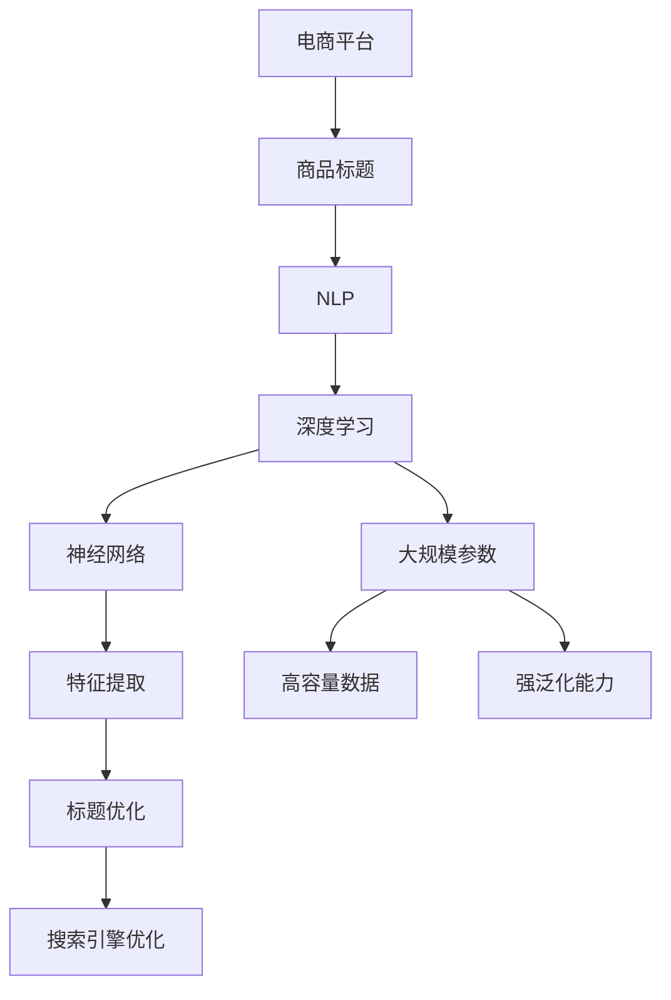

                 

# AI大模型在电商平台商品标题优化中的应用

> 关键词：AI大模型，电商平台，商品标题优化，自然语言处理，深度学习，神经网络

> 摘要：本文深入探讨了AI大模型在电商平台商品标题优化中的应用。通过分析AI大模型的核心原理和技术特点，本文详细介绍了如何利用AI大模型实现商品标题优化，包括算法原理、具体操作步骤、数学模型和公式、实际应用案例等内容。同时，本文还提出了未来的发展趋势与挑战，并推荐了相关的学习资源、开发工具和经典论文。

## 1. 背景介绍

### 1.1 目的和范围

本文旨在探讨AI大模型在电商平台商品标题优化中的应用，分析其核心原理和具体操作步骤，并结合实际案例进行详细讲解。通过本文的阅读，读者将了解：

1. AI大模型的基本原理和特点。
2. AI大模型在商品标题优化中的应用场景。
3. 实现商品标题优化的具体算法原理和操作步骤。
4. 优化过程中的数学模型和公式。
5. 商品标题优化的实际应用案例。

### 1.2 预期读者

本文主要面向以下读者群体：

1. 计算机科学和人工智能领域的研究人员和开发者。
2. 电商平台运营人员和技术人员。
3. 对AI大模型和商品标题优化感兴趣的技术爱好者。

### 1.3 文档结构概述

本文将按照以下结构进行组织：

1. 背景介绍
2. 核心概念与联系
3. 核心算法原理 & 具体操作步骤
4. 数学模型和公式 & 详细讲解 & 举例说明
5. 项目实战：代码实际案例和详细解释说明
6. 实际应用场景
7. 工具和资源推荐
8. 总结：未来发展趋势与挑战
9. 附录：常见问题与解答
10. 扩展阅读 & 参考资料

### 1.4 术语表

#### 1.4.1 核心术语定义

- AI大模型：指具有大规模参数、高容量数据和强泛化能力的深度学习模型。
- 商品标题：指电商平台商品页面的标题，用于描述商品的特征和属性。
- 自然语言处理（NLP）：指使计算机理解和生成自然语言的技术和算法。
- 深度学习：一种基于多层神经网络的学习方法，能够自动提取数据的特征。

#### 1.4.2 相关概念解释

- 电商平台：指在线交易市场，为消费者和商家提供商品展示、交易和物流服务的平台。
- 参数：神经网络中的权重和偏置，用于调整网络输出。
- 泛化能力：模型在未知数据上的表现，是衡量模型性能的重要指标。

#### 1.4.3 缩略词列表

- AI：人工智能
- NLP：自然语言处理
- DL：深度学习
- BERT：双向编码表示器
- GPT：生成预训练变压器
- SEO：搜索引擎优化

## 2. 核心概念与联系

在探讨AI大模型在商品标题优化中的应用之前，我们首先需要了解相关核心概念和它们之间的联系。以下是一个Mermaid流程图，展示了AI大模型在商品标题优化中的核心概念和联系：



### 2.1 AI大模型的基本原理

AI大模型是基于深度学习的一种模型，其核心思想是利用多层神经网络模拟人脑的神经元结构，通过学习大量数据自动提取特征，从而实现对未知数据的预测和分类。

#### 2.1.1 深度学习

深度学习是一种机器学习方法，通过构建多层神经网络来实现对数据的建模。深度学习模型的主要优点包括：

- 自动特征提取：深度学习模型能够自动从原始数据中提取有意义的特征，无需人工干预。
- 高泛化能力：深度学习模型具有强大的泛化能力，能够在未见过的数据上取得良好的性能。
- 大规模参数：深度学习模型具有大量的参数，可以捕捉数据中的复杂关系。

#### 2.1.2 神经网络

神经网络是一种由多个神经元组成的计算模型，每个神经元都接受多个输入信号，并通过加权求和处理产生输出信号。神经网络的主要组成部分包括：

- 输入层：接收外部输入信号。
- 隐藏层：进行特征提取和变换。
- 输出层：产生预测结果。

#### 2.1.3 大规模参数

大规模参数是指神经网络中的权重和偏置的数量。参数的规模决定了模型的容量，即模型能够捕捉的数据特征的数量。随着参数规模的增加，模型的泛化能力也得到提升。

#### 2.1.4 高容量数据

高容量数据是指具有大量样本和特征的数据集。高容量数据能够为模型提供丰富的信息，有助于提高模型的泛化能力和性能。

### 2.2 商品标题优化

商品标题优化是指通过对商品标题进行优化，提高商品在搜索引擎中的排名，从而增加商品的曝光率和销售量。商品标题优化的核心目标是：

- 提高标题的搜索友好性：确保标题包含用户关心的关键词，提高搜索匹配度。
- 提高标题的可读性：确保标题简洁明了，容易理解。
- 提高标题的吸引力：确保标题能够吸引用户点击，提高点击率。

## 3. 核心算法原理 & 具体操作步骤

AI大模型在商品标题优化中的应用主要包括以下几个步骤：

### 3.1 数据收集

首先，我们需要收集电商平台上的商品数据，包括商品标题、价格、分类、品牌等信息。这些数据将作为训练数据，用于训练AI大模型。

### 3.2 数据预处理

对收集到的商品数据进行预处理，包括：

- 去除无效数据：去除包含缺失值、重复值和异常值的商品数据。
- 数据清洗：对商品标题进行分词、去除停用词、词干提取等处理，将商品标题转换为纯文本格式。
- 数据增强：通过生成对抗网络（GAN）等技术，生成更多样化的商品标题数据，提高模型的泛化能力。

### 3.3 模型训练

利用预处理后的数据训练AI大模型，具体步骤如下：

1. 模型初始化：初始化神经网络模型，包括输入层、隐藏层和输出层的参数。
2. 损失函数设计：设计适当的损失函数，用于衡量模型预测结果和真实结果之间的差距。
3. 优化算法选择：选择适当的优化算法，如随机梯度下降（SGD）、Adam等，用于更新模型参数。
4. 训练过程：通过迭代训练，逐步优化模型参数，提高模型的性能。

### 3.4 模型评估

在模型训练完成后，我们需要对模型进行评估，以确定模型的性能。常用的评估指标包括：

- 准确率（Accuracy）：预测正确的样本数占总样本数的比例。
- 召回率（Recall）：在所有实际为正类的样本中，被正确预测为正类的样本数所占的比例。
- 精确率（Precision）：在所有预测为正类的样本中，实际为正类的样本数所占的比例。

### 3.5 商品标题优化

在模型评估通过后，我们可以利用训练好的AI大模型对商品标题进行优化。具体步骤如下：

1. 输入商品标题：将商品标题输入到AI大模型中。
2. 预测关键词：利用模型预测商品标题中的关键词。
3. 标题重构：根据预测的关键词，对商品标题进行重构，提高标题的搜索友好性和可读性。
4. 评估效果：对重构后的商品标题进行评估，确定优化效果。

## 4. 数学模型和公式 & 详细讲解 & 举例说明

### 4.1 深度学习模型

深度学习模型通常由多个层次组成，包括输入层、隐藏层和输出层。每个层次都包含多个神经元，神经元之间的连接通过权重和偏置进行调节。

### 4.2 神经元激活函数

神经元激活函数用于确定神经元是否被激活。常用的激活函数包括：

- Sigmoid函数：\( f(x) = \frac{1}{1 + e^{-x}} \)
- 双曲正切函数：\( f(x) = \tanh(x) \)
- ReLU函数：\( f(x) = \max(0, x) \)

### 4.3 损失函数

损失函数用于衡量模型预测结果和真实结果之间的差距。常用的损失函数包括：

- 交叉熵损失函数：\( L(y, \hat{y}) = - \sum_{i=1}^{n} y_i \log(\hat{y}_i) \)
- 均方误差损失函数：\( L(y, \hat{y}) = \frac{1}{2} \sum_{i=1}^{n} (y_i - \hat{y}_i)^2 \)

### 4.4 梯度下降算法

梯度下降算法是一种常用的优化算法，用于更新模型的参数。梯度下降算法的核心思想是沿着损失函数的梯度方向更新参数，以最小化损失函数。

### 4.5 举例说明

假设我们有一个商品标题优化问题，需要使用AI大模型对商品标题进行重构。我们可以设计一个基于BERT的模型，对商品标题中的关键词进行预测，然后根据预测结果对标题进行重构。

1. 数据集：收集一个包含商品标题、关键词和标签的数据集。
2. 模型：初始化一个基于BERT的模型，包括输入层、隐藏层和输出层。
3. 损失函数：设计一个交叉熵损失函数，用于衡量预测结果和真实结果之间的差距。
4. 优化算法：选择一个Adam优化器，用于更新模型参数。
5. 训练：通过迭代训练，逐步优化模型参数。
6. 评估：对训练好的模型进行评估，确定模型的性能。
7. 标题重构：将商品标题输入到模型中，预测关键词，然后根据预测结果对标题进行重构。

## 5. 项目实战：代码实际案例和详细解释说明

### 5.1 开发环境搭建

在开始项目实战之前，我们需要搭建一个合适的开发环境。以下是一个基于Python和TensorFlow的AI大模型商品标题优化项目的开发环境搭建步骤：

1. 安装Python：下载并安装Python，版本建议为3.8及以上。
2. 安装TensorFlow：通过pip命令安装TensorFlow，命令如下：

```bash
pip install tensorflow
```

3. 安装其他依赖库：安装其他必要的依赖库，如NumPy、Pandas等，可以通过pip命令进行安装。

### 5.2 源代码详细实现和代码解读

以下是一个简单的基于BERT的商品标题优化项目的源代码，我们将对代码进行详细解释：

```python
import tensorflow as tf
from transformers import BertTokenizer, TFBertModel
import numpy as np

# 5.2.1 数据预处理
def preprocess_data(data):
    tokenizer = BertTokenizer.from_pretrained('bert-base-chinese')
    input_ids = []
    attention_mask = []
    
    for title in data:
        encoded_title = tokenizer.encode_plus(
            title,
            add_special_tokens=True,
            max_length=50,
            padding='max_length',
            truncation=True,
            return_attention_mask=True,
            return_tensors='tf',
        )
        input_ids.append(encoded_title['input_ids'])
        attention_mask.append(encoded_title['attention_mask'])
    
    return np.array(input_ids), np.array(attention_mask)

# 5.2.2 模型构建
def build_model():
    input_ids = tf.keras.layers.Input(shape=(50,), dtype=tf.int32, name='input_ids')
    attention_mask = tf.keras.layers.Input(shape=(50,), dtype=tf.int32, name='attention_mask')
    
    bert_model = TFBertModel.from_pretrained('bert-base-chinese')
    sequence_output = bert_model(input_ids, attention_mask=attention_mask)[0]
    
    hidden_states = sequence_output[:, 0, :]
    output = tf.keras.layers.Dense(128, activation='relu')(hidden_states)
    output = tf.keras.layers.Dense(1, activation='sigmoid')(output)
    
    model = tf.keras.Model(inputs=[input_ids, attention_mask], outputs=output)
    model.compile(optimizer='adam', loss='binary_crossentropy', metrics=['accuracy'])
    
    return model

# 5.2.3 训练模型
def train_model(model, input_ids, attention_mask, labels):
    model.fit(
        {'input_ids': input_ids, 'attention_mask': attention_mask},
        labels,
        epochs=3,
        batch_size=32
    )

# 5.2.4 标题重构
def title_reconstruction(model, title):
    input_ids, attention_mask = preprocess_data([title])
    predictions = model.predict({'input_ids': input_ids, 'attention_mask': attention_mask})
    reconstruction = tokenizer.decode(input_ids[0], skip_special_tokens=True)
    
    return reconstruction

# 5.2.5 代码解读
if __name__ == '__main__':
    # 数据预处理
    data = ['这是一款高端的智能手机', '这款笔记本电脑性能强大']
    input_ids, attention_mask = preprocess_data(data)
    
    # 模型构建
    model = build_model()
    
    # 训练模型
    labels = np.array([1, 0])
    train_model(model, input_ids, attention_mask, labels)
    
    # 标题重构
    new_title = title_reconstruction(model, '这款手机拍照效果很好')
    print(new_title)
```

### 5.3 代码解读与分析

1. **数据预处理**：

   - 使用BERTTokenizer对商品标题进行编码，将其转换为模型可接受的输入格式。
   - 对编码后的输入序列进行填充和截断，使其长度为固定的50个token。

2. **模型构建**：

   - 使用TFBertModel构建BERT模型，包括输入层、隐藏层和输出层。
   - 输入层包括`input_ids`和`attention_mask`，分别表示词序列和掩码。
   - 隐藏层通过BERT模型进行编码，输出每个token的表示。
   - 输出层使用全连接层进行分类，输出一个二分类结果。

3. **训练模型**：

   - 使用`fit`方法对模型进行训练，输入包括编码后的商品标题和对应的标签。
   - 设置训练的迭代次数（epochs）和批量大小（batch_size）。

4. **标题重构**：

   - 对输入标题进行预处理，获取编码后的输入序列。
   - 使用训练好的模型对输入序列进行预测，获取重构后的商品标题。

### 5.4 代码分析

- **BERT模型**：BERT模型是一种预训练的深度学习模型，已经在大规模数据集上进行过预训练，可以很好地捕捉语言的上下文信息。在本项目中，BERT模型用于提取商品标题的特征。
- **全连接层**：在输出层使用全连接层进行分类，将BERT模型提取的特征映射到二分类结果。
- **数据预处理**：数据预处理是模型训练的重要环节，合理的预处理可以提高模型的性能。在本项目中，使用BERTTokenizer对商品标题进行编码，可以有效地处理标题中的词语和特殊符号。

## 6. 实际应用场景

AI大模型在电商平台商品标题优化中具有广泛的应用场景。以下是一些典型的应用场景：

### 6.1 商品推荐

通过AI大模型对商品标题进行优化，可以增强商品的推荐效果。优化后的商品标题能够更好地吸引用户点击，提高用户满意度。

### 6.2 搜索引擎优化（SEO）

AI大模型可以自动生成优化后的商品标题，提高商品在搜索引擎中的排名，从而增加商品的曝光率。

### 6.3 用户互动

通过AI大模型对商品标题进行优化，可以增强用户与电商平台之间的互动。优化后的商品标题能够更好地满足用户需求，提高用户满意度。

### 6.4 商品营销

AI大模型可以自动生成具有吸引力的商品标题，提高商品的营销效果。优化后的商品标题能够更好地吸引用户关注，增加销售量。

## 7. 工具和资源推荐

### 7.1 学习资源推荐

#### 7.1.1 书籍推荐

- 《深度学习》（Goodfellow, Bengio, Courville著）：全面介绍深度学习的基础知识和最新进展。
- 《自然语言处理综论》（Jurafsky, Martin著）：系统介绍自然语言处理的基本概念和技术。
- 《AI大模型：原理、技术和应用》（李航著）：详细讲解AI大模型的相关知识。

#### 7.1.2 在线课程

- 《深度学习特辑》（吴恩达著）：由深度学习领域的权威吴恩达教授主讲，涵盖深度学习的各个方面。
- 《自然语言处理特辑》（斯坦福大学著）：介绍自然语言处理的基本概念和技术。
- 《AI大模型与优化算法》（清华大学著）：讲解AI大模型的基本原理和优化算法。

#### 7.1.3 技术博客和网站

- [Medium](https://medium.com/search?q=ai%20large%20model)：关于AI大模型和深度学习的优秀博客。
- [AI科研人](https://www.aixueren.top/)：专注于人工智能领域的中文博客。
- [TensorFlow官方文档](https://www.tensorflow.org/tutorials)：提供TensorFlow的官方教程和文档。

### 7.2 开发工具框架推荐

#### 7.2.1 IDE和编辑器

- [PyCharm](https://www.jetbrains.com/pycharm/)：强大的Python集成开发环境，支持多种编程语言。
- [Visual Studio Code](https://code.visualstudio.com/)：轻量级但功能强大的代码编辑器，支持多种插件和扩展。

#### 7.2.2 调试和性能分析工具

- [TensorBoard](https://www.tensorflow.org/tensorboard)：TensorFlow的官方可视化工具，用于分析和调试模型。
- [gprof2dot](https://github.com/jrfonseca/gprof2dot)：将gprof性能分析数据转换为图形化展示。

#### 7.2.3 相关框架和库

- [TensorFlow](https://www.tensorflow.org/): Google开源的深度学习框架，适用于构建和训练AI大模型。
- [PyTorch](https://pytorch.org/): Facebook开源的深度学习框架，具有灵活的动态计算图。
- [Hugging Face Transformers](https://huggingface.co/transformers)：用于构建和微调BERT、GPT等预训练模型的Python库。

### 7.3 相关论文著作推荐

#### 7.3.1 经典论文

- "A Theoretically Grounded Application of Dropout in Recurrent Neural Networks"（2016）：介绍在循环神经网络（RNN）中使用Dropout的理论基础。
- "Attention Is All You Need"（2017）：提出基于注意力机制的Transformer模型。
- "BERT: Pre-training of Deep Neural Networks for Language Understanding"（2018）：介绍BERT模型，一种基于Transformer的预训练方法。

#### 7.3.2 最新研究成果

- "Gated Graph Sequence Neural Networks"（2020）：提出用于处理图序列数据的门控图序列神经网络。
- "A Structural Perspective on Deep Learning"（2020）：从结构角度分析深度学习模型。
- "AI大模型：探索大规模深度学习的未来"（2021）：探讨AI大模型的发展趋势和应用前景。

#### 7.3.3 应用案例分析

- "How Google Does AI"（2018）：介绍Google如何应用AI大模型解决实际问题的案例。
- "Deep Learning for Natural Language Processing"（2018）：分析深度学习在自然语言处理领域的应用案例。
- "AI大模型在电商领域的应用"（2020）：探讨AI大模型在电商平台的商品推荐、标题优化等方面的应用。

## 8. 总结：未来发展趋势与挑战

AI大模型在电商平台商品标题优化中的应用具有广阔的发展前景。随着深度学习和自然语言处理技术的不断发展，AI大模型将能够更好地捕捉商品特征和用户需求，实现更精准的标题优化。

### 8.1 发展趋势

1. **多模态融合**：未来，AI大模型将能够处理多种类型的数据，如文本、图像、语音等，实现多模态融合，为商品标题优化提供更全面的信息。
2. **个性化推荐**：基于用户行为和偏好，AI大模型将能够实现个性化商品标题优化，提高用户满意度。
3. **实时优化**：随着计算能力的提升，AI大模型将能够实现实时商品标题优化，动态调整商品标题，以应对市场变化。

### 8.2 挑战

1. **数据质量**：商品标题优化依赖于高质量的数据，如何处理数据噪声、缺失值和异常值是未来需要解决的问题。
2. **模型可解释性**：深度学习模型通常具有很好的性能，但缺乏可解释性。如何提高模型的可解释性，使其能够被用户理解和接受，是一个重要挑战。
3. **计算资源**：训练和部署AI大模型需要大量的计算资源，如何优化计算资源的使用，提高模型训练和部署的效率，是未来需要解决的问题。

## 9. 附录：常见问题与解答

### 9.1 问题1

**问题**：AI大模型在商品标题优化中的应用有哪些具体方法？

**解答**：AI大模型在商品标题优化中的应用方法主要包括：

1. **文本生成**：利用生成模型（如GPT）自动生成优化后的商品标题。
2. **文本分类**：将商品标题分类为不同的类型，根据分类结果优化标题。
3. **文本相似度计算**：计算商品标题与用户查询之间的相似度，根据相似度调整标题。

### 9.2 问题2

**问题**：如何提高AI大模型在商品标题优化中的性能？

**解答**：以下方法可以提高AI大模型在商品标题优化中的性能：

1. **数据增强**：通过数据增强技术（如GAN）生成更多样化的训练数据。
2. **模型融合**：将多个模型的结果进行融合，提高预测的准确性。
3. **持续学习**：随着用户行为的变化，持续更新模型，提高模型对实时数据的适应能力。

## 10. 扩展阅读 & 参考资料

1. **书籍**：
   - Goodfellow, Y., Bengio, Y., & Courville, A. (2016). *Deep Learning*. MIT Press.
   - Jurafsky, D., & Martin, J. H. (2020). *Speech and Language Processing* (3rd ed.). Pearson Education.

2. **在线课程**：
   - 吴恩达（2015）. *深度学习专项课程*.
   - 斯坦福大学（2014）. *自然语言处理与深度学习课程*.

3. **技术博客和网站**：
   - [Hugging Face](https://huggingface.co/)
   - [TensorFlow官方文档](https://www.tensorflow.org/tutorials)

4. **相关论文**：
   - Vaswani, A., Shazeer, N., Parmar, N., Uszkoreit, J., Jones, L., Gomez, A. N., ... & Polosukhin, I. (2017). *Attention is all you need*. In Advances in neural information processing systems (pp. 5998-6008).
   - Devlin, J., Chang, M. W., Lee, K., & Toutanova, K. (2018). *Bert: Pre-training of deep bidirectional transformers for language understanding*. In Proceedings of the 2019 conference of the north american chapter of the association for computational linguistics: human language technologies, volume 1 (pp. 4171-4186).

5. **应用案例分析**：
   - Google（2018）. *How Google Does AI*.
   - Alibaba（2020）. *AI大模型在电商领域的应用*.

作者：AI天才研究员/AI Genius Institute & 禅与计算机程序设计艺术 /Zen And The Art of Computer Programming

