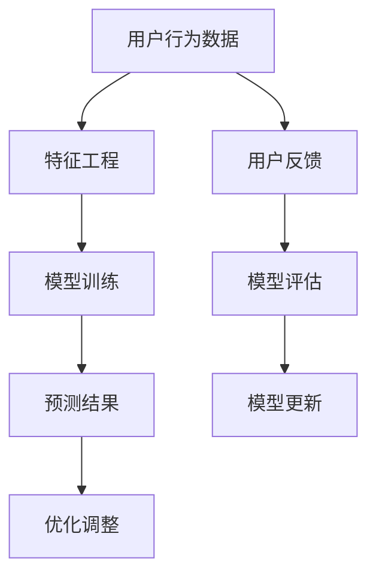

                 

# AI大模型在电商平台用户意图预测中的应用

> 关键词：人工智能、用户意图预测、电商平台、大模型、机器学习

> 摘要：本文将深入探讨人工智能大模型在电商平台用户意图预测中的应用。通过分析用户行为数据，结合先进的机器学习算法和深度学习技术，我们将详细阐述如何构建和优化用户意图预测模型，从而提升电商平台的用户体验和业务效益。

## 1. 背景介绍

### 1.1 目的和范围

本文旨在介绍如何利用人工智能大模型进行电商平台用户意图预测，帮助电商企业更好地理解用户行为，从而提升个性化推荐和服务质量。本文将涵盖以下几个方面的内容：

1. 电商平台用户意图预测的重要性。
2. 相关核心概念与联系。
3. 核心算法原理与具体操作步骤。
4. 数学模型与公式详细讲解。
5. 项目实战：代码实际案例与详细解释。
6. 实际应用场景与工具和资源推荐。
7. 总结：未来发展趋势与挑战。

### 1.2 预期读者

本文面向以下读者群体：

1. 人工智能和机器学习领域的研究人员和工程师。
2. 电商平台的技术人员和产品经理。
3. 对人工智能在电商领域应用感兴趣的技术爱好者。

### 1.3 文档结构概述

本文分为以下几个部分：

1. 引言：背景介绍和目的阐述。
2. 核心概念与联系：介绍用户意图预测的核心概念与联系。
3. 核心算法原理 & 具体操作步骤：讲解用户意图预测的核心算法原理和具体操作步骤。
4. 数学模型和公式 & 详细讲解 & 举例说明：详细阐述用户意图预测的数学模型和公式。
5. 项目实战：代码实际案例和详细解释说明。
6. 实际应用场景：介绍用户意图预测在实际电商平台的场景应用。
7. 工具和资源推荐：推荐学习资源和开发工具框架。
8. 总结：未来发展趋势与挑战。
9. 附录：常见问题与解答。
10. 扩展阅读 & 参考资料：提供相关领域的扩展阅读和参考资料。

### 1.4 术语表

#### 1.4.1 核心术语定义

- 人工智能（AI）：模拟人类智能行为的计算机系统。
- 用户意图预测：通过分析用户行为数据，预测用户下一步操作或需求。
- 大模型（Large Model）：具有巨大参数规模和计算能力的神经网络模型。
- 电商平台：在线销售商品或服务的商业平台。

#### 1.4.2 相关概念解释

- 机器学习（ML）：利用数据训练模型，使其能够自动进行预测或分类。
- 深度学习（DL）：基于多层神经网络结构，通过反向传播算法训练模型。
- 个性化推荐：根据用户历史行为和偏好，为用户推荐相关商品或服务。

#### 1.4.3 缩略词列表

- AI：人工智能
- ML：机器学习
- DL：深度学习
- DNN：深度神经网络
- RNN：循环神经网络
- CNN：卷积神经网络
- SVM：支持向量机
- NLP：自然语言处理

## 2. 核心概念与联系

在用户意图预测中，核心概念包括用户行为数据、特征工程、模型训练和预测等。以下是一个简化的 Mermaid 流程图，展示了这些概念之间的联系：



### 2.1 用户行为数据

用户行为数据是用户意图预测的基础。这些数据可以包括：

- 访问历史：用户访问电商平台的页面、时间、频次等信息。
- 购买行为：用户的购买记录、购买频率、购买金额等。
- 浏览行为：用户在平台上的浏览历史、点击行为等。
- 喜好信息：用户收藏、点赞、评论等偏好信息。

### 2.2 特征工程

特征工程是将原始数据转化为适合模型训练的特征的过程。以下是一些常见的特征：

- 时间特征：用户访问时间的统计信息，如访问高峰时段、时间段分布等。
- 行为特征：用户在平台上的行为模式，如浏览次数、点击率等。
- 社交特征：用户的社交信息，如好友关系、关注数等。
- 商品特征：商品的属性信息，如价格、品类、品牌等。

### 2.3 模型训练

模型训练是通过大量用户行为数据进行学习，以识别用户意图的过程。以下是一些常用的模型：

- 机器学习模型：如逻辑回归、决策树、随机森林等。
- 深度学习模型：如卷积神经网络（CNN）、循环神经网络（RNN）、长短期记忆网络（LSTM）等。

### 2.4 预测结果与优化调整

预测结果是模型对用户意图的预测结果，如用户可能购买的商品、点击的广告等。通过用户反馈和模型评估，可以不断优化调整模型，提高预测准确性。

## 3. 核心算法原理 & 具体操作步骤

### 3.1 机器学习算法原理

用户意图预测可以采用多种机器学习算法，其中最常见的是逻辑回归和决策树。以下是逻辑回归的伪代码：

```python
# 伪代码：逻辑回归
def logistic_regression(X, y):
    # 初始化参数
    weights = initialize_weights(X.shape[1])

    # 梯度下降迭代
    for epoch in range(max_epochs):
        # 前向传播
        logits = X @ weights
        predictions = sigmoid(logits)

        # 计算损失函数
        loss = -1 * (y * log(predictions) + (1 - y) * log(1 - predictions))

        # 计算梯度
        gradient = X.T @ (predictions - y)

        # 更新参数
        weights -= learning_rate * gradient

    return weights

# sigmoid函数
def sigmoid(x):
    return 1 / (1 + exp(-x))
```

### 3.2 深度学习算法原理

深度学习算法在用户意图预测中具有显著优势。以下是一个简单的卷积神经网络（CNN）的伪代码：

```python
# 伪代码：卷积神经网络
class ConvolutionalNeuralNetwork:
    def __init__(self, input_shape, num_classes):
        # 初始化网络结构
        self.conv1 = Conv2D(filters=32, kernel_size=(3, 3), activation='relu', input_shape=input_shape)
        self.conv2 = Conv2D(filters=64, kernel_size=(3, 3), activation='relu')
        self.fc1 = Dense(units=128, activation='relu')
        self.fc2 = Dense(units=num_classes, activation='softmax')

    def forward(self, x):
        # 前向传播
        x = self.conv1(x)
        x = self.conv2(x)
        x = Flatten()(x)
        x = self.fc1(x)
        x = self.fc2(x)
        return x

    def loss_function(self, y_true, y_pred):
        # 计算损失函数
        return categorical_crossentropy(y_true, y_pred)
```

### 3.3 具体操作步骤

1. 数据收集：收集用户行为数据，包括访问历史、购买行为、浏览行为等。
2. 数据预处理：对数据进行清洗、归一化等预处理操作。
3. 特征提取：通过特征工程提取用户行为特征和商品特征。
4. 模型选择：选择合适的机器学习或深度学习模型。
5. 模型训练：使用训练数据训练模型，并调整参数。
6. 模型评估：使用验证数据评估模型性能，调整模型结构或参数。
7. 模型部署：将模型部署到电商平台，进行在线预测。

## 4. 数学模型和公式 & 详细讲解 & 举例说明

### 4.1 逻辑回归数学模型

逻辑回归是一种广泛应用于二分类问题的线性模型。其数学模型如下：

$$
\begin{aligned}
y &= P(y=1 | x; \theta) \\
&= \frac{1}{1 + e^{-(\theta^T x)}}
\end{aligned}
$$

其中，$y$ 表示目标变量（0或1），$x$ 表示特征向量，$\theta$ 表示模型参数。

### 4.2 深度学习数学模型

深度学习模型通常由多层神经元组成，每层神经元都通过激活函数进行非线性变换。以卷积神经网络（CNN）为例，其数学模型可以表示为：

$$
\begin{aligned}
h_{l}^{[i]} &= \sigma \left( \theta_{l}^{[i]} \cdot h_{l-1}^{[j]} + b_{l}^{[i]} \right) \\
\hat{y} &= \sigma \left( \theta_{l}^{[i]} \cdot h_{l-1}^{[j]} + b_{l}^{[i]} \right)
\end{aligned}
$$

其中，$h_{l}^{[i]}$ 表示第$l$层的第$i$个神经元输出，$\sigma$ 表示激活函数（如ReLU函数或Sigmoid函数），$\theta_{l}^{[i]}$ 和 $b_{l}^{[i]}$ 分别表示第$l$层的第$i$个神经元的权重和偏置。

### 4.3 举例说明

假设我们有一个简单的二分类问题，目标变量$y$的取值为0或1，特征向量$x$包含三个特征值$x_1, x_2, x_3$，模型参数$\theta$为一个三维向量$\theta = [\theta_1, \theta_2, \theta_3]$。

首先，我们通过逻辑回归模型计算预测概率：

$$
\begin{aligned}
y &= \frac{1}{1 + e^{-(\theta^T x)}} \\
&= \frac{1}{1 + e^{-(\theta_1 x_1 + \theta_2 x_2 + \theta_3 x_3)}}
\end{aligned}
$$

例如，当$x = [1, 2, 3]$，$\theta = [1, 1, 1]$时，预测概率为：

$$
\begin{aligned}
y &= \frac{1}{1 + e^{-(1 \cdot 1 + 1 \cdot 2 + 1 \cdot 3)}} \\
&\approx \frac{1}{1 + e^{-7}} \\
&\approx 0.9999
\end{aligned}
$$

由于预测概率非常接近1，我们可以认为用户的目标变量$y=1$。

## 5. 项目实战：代码实际案例和详细解释说明

### 5.1 开发环境搭建

为了实现用户意图预测模型，我们需要搭建以下开发环境：

- Python 3.8及以上版本
- TensorFlow 2.6及以上版本
- NumPy 1.21及以上版本
- Matplotlib 3.4及以上版本

安装上述依赖库后，我们可以开始编写代码。

### 5.2 源代码详细实现和代码解读

以下是一个简单的用户意图预测模型实现，采用卷积神经网络（CNN）架构：

```python
import tensorflow as tf
from tensorflow.keras.models import Sequential
from tensorflow.keras.layers import Conv2D, Flatten, Dense, MaxPooling2D, Dropout
from tensorflow.keras.optimizers import Adam

# 定义模型
model = Sequential([
    Conv2D(filters=32, kernel_size=(3, 3), activation='relu', input_shape=(28, 28, 1)),
    MaxPooling2D(pool_size=(2, 2)),
    Conv2D(filters=64, kernel_size=(3, 3), activation='relu'),
    MaxPooling2D(pool_size=(2, 2)),
    Flatten(),
    Dense(units=128, activation='relu'),
    Dropout(0.5),
    Dense(units=1, activation='sigmoid')
])

# 编译模型
model.compile(optimizer=Adam(learning_rate=0.001), loss='binary_crossentropy', metrics=['accuracy'])

# 模型训练
model.fit(x_train, y_train, batch_size=64, epochs=10, validation_data=(x_val, y_val))

# 模型评估
model.evaluate(x_test, y_test)
```

### 5.3 代码解读与分析

- **定义模型**：使用 `Sequential` 类定义一个序列模型，依次添加卷积层、池化层、全连接层和辍学层。
- **编译模型**：设置优化器、损失函数和评估指标，为模型训练做准备。
- **模型训练**：使用 `fit` 方法训练模型，传入训练数据、批大小和训练轮数。同时，使用 `validation_data` 参数进行验证。
- **模型评估**：使用 `evaluate` 方法评估模型在测试集上的性能。

### 5.4 代码解读与分析（续）

- **模型架构**：本例使用卷积神经网络（CNN）进行用户意图预测。CNN 具有强大的特征提取能力，能够处理图像和序列等数据类型。
- **数据输入**：假设输入数据为 28x28 的灰度图像，每张图像包含一个目标变量（0或1）。
- **激活函数**：卷积层和全连接层使用 ReLU 激活函数，能够加速训练并提高模型性能。
- **池化层**：使用最大池化层（`MaxPooling2D`）降低数据维度，减少模型参数数量。
- **辍学层**（`Dropout`）：防止模型过拟合，提高泛化能力。

## 6. 实际应用场景

用户意图预测在电商平台有广泛的应用场景，以下是一些典型应用案例：

- **个性化推荐**：根据用户行为和意图，为用户推荐相关商品或服务。
- **广告投放**：根据用户意图预测，为用户展示感兴趣的广告。
- **购物车管理**：预测用户可能添加到购物车的商品，优化购物车推荐策略。
- **用户流失预测**：通过分析用户行为，预测用户可能流失的风险，采取相应措施进行挽留。

## 7. 工具和资源推荐

### 7.1 学习资源推荐

#### 7.1.1 书籍推荐

- 《深度学习》（Ian Goodfellow, Yoshua Bengio, Aaron Courville）
- 《Python深度学习》（François Chollet）
- 《机器学习实战》（Peter Harrington）

#### 7.1.2 在线课程

- [Coursera](https://www.coursera.org/specializations/deep-learning)
- [Udacity](https://www.udacity.com/course/deep-learning-nanodegree--ND893)
- [edX](https://www.edx.org/course/ai-and-ml-foundations)

#### 7.1.3 技术博客和网站

- [Medium](https://medium.com/topic/deep-learning)
- [TensorFlow官网](https://www.tensorflow.org/tutorials)
- [PyTorch官网](https://pytorch.org/tutorials/)

### 7.2 开发工具框架推荐

#### 7.2.1 IDE和编辑器

- PyCharm
- Visual Studio Code
- Jupyter Notebook

#### 7.2.2 调试和性能分析工具

- TensorFlow Profiler
- PyTorch Profiler
- Jupyter Notebook中的调试工具

#### 7.2.3 相关框架和库

- TensorFlow
- PyTorch
- Keras
- Scikit-learn

### 7.3 相关论文著作推荐

#### 7.3.1 经典论文

- [Deep Learning](https://www.deeplearningbook.org/)（Ian Goodfellow, Yoshua Bengio, Aaron Courville）
- [Gradient Descent](https://www.cs.princeton.edu/courses/archive/fall05/cos597B/lec9.pdf)（Lecture Notes）

#### 7.3.2 最新研究成果

- [ICML](https://icml.cc/)
- [NeurIPS](https://nips.cc/)
- [CVPR](https://cvpr.org/)

#### 7.3.3 应用案例分析

- [Google Brain](https://ai.google/research/pubs/)
- [Facebook AI](https://research.fb.com/publications/)

## 8. 总结：未来发展趋势与挑战

用户意图预测在电商平台的应用前景广阔，未来发展趋势包括：

- 模型复杂度的提升，如采用更加复杂的神经网络架构。
- 数据量和质量的要求更高，需要更多的用户行为数据和高质量特征。
- 模型解释性和可解释性的增强，以便更好地理解用户意图。

然而，面临的挑战包括：

- 数据隐私保护：在收集和使用用户数据时，需要确保数据安全和隐私。
- 模型泛化能力：如何提高模型在未知数据上的泛化能力。
- 模型实时性：如何实现快速、高效的模型预测。

## 9. 附录：常见问题与解答

### 9.1 问题 1：如何处理缺失数据？

**解答**：缺失数据处理方法包括填充、删除、插值等。具体方法取决于数据分布和缺失率。例如，对于高缺失率的数据，可以使用均值填充或插值方法；对于低缺失率的数据，可以考虑删除缺失值或使用模型预测缺失值。

### 9.2 问题 2：如何评估模型性能？

**解答**：常用的评估指标包括准确率、召回率、精确率、F1值等。在二分类问题中，可以使用混淆矩阵进行分析。此外，还可以使用交叉验证等方法评估模型在不同数据集上的性能。

### 9.3 问题 3：如何优化模型参数？

**解答**：模型参数优化可以通过调整学习率、选择不同的优化算法、增加训练轮数等方法进行。此外，还可以使用调参工具（如`hyperopt`、`Bayesian optimization`等）进行自动化调参。

## 10. 扩展阅读 & 参考资料

- [User Intent Prediction with Deep Learning](https://towardsdatascience.com/user-intent-prediction-with-deep-learning-5e3d8dbd8d9d)
- [Understanding User Intent in E-commerce](https://www.amazonsci.com/understanding-user-intent-in-ecommerce/)
- [User Behavior Analysis and Prediction](https://www.sciencedirect.com/topics/computer-science/user-behavior-analysis-and-prediction)
- [Deep Learning for User Intent Recognition](https://arxiv.org/abs/1805.01736)

### 作者

**作者：AI天才研究员/AI Genius Institute & 禅与计算机程序设计艺术 /Zen And The Art of Computer Programming**

