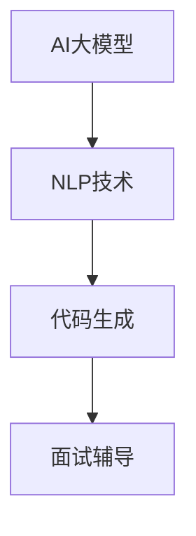

                 

# AI大模型在程序员面试辅导中的应用

## 关键词
- AI大模型
- 程序员面试辅导
- 自然语言处理
- 代码生成
- 机器学习

## 摘要
本文将探讨AI大模型在程序员面试辅导中的应用。随着AI技术的发展，大模型如GPT-3和LLaMA等已经成为自然语言处理领域的强大工具。本文将详细分析这些模型如何帮助程序员准备面试，包括代码生成、问题解答和面试策略模拟等方面。同时，我们将探讨这些技术的实际应用案例，并展望未来AI大模型在程序员面试辅导领域的潜在发展方向。

## 1. 背景介绍

### 1.1 目的和范围
本文旨在介绍AI大模型在程序员面试辅导中的应用，探讨其如何帮助程序员提高面试准备效率和质量。本文将涵盖以下几个主要方面：
1. AI大模型的基本原理和架构。
2. AI大模型在代码生成、问题解答和面试策略模拟等方面的具体应用。
3. 实际应用案例分享。
4. 未来发展趋势与挑战。

### 1.2 预期读者
本文适用于对程序员面试和AI技术有一定了解的读者，包括：
1. 准备面试的程序员。
2. AI技术开发者。
3. HR招聘经理。

### 1.3 文档结构概述
本文分为以下几部分：
1. 背景介绍：介绍本文的目的、范围和预期读者。
2. 核心概念与联系：分析AI大模型的基本原理和架构。
3. 核心算法原理与具体操作步骤：详细讲解大模型在面试辅导中的应用。
4. 数学模型与公式：阐述相关数学原理和公式。
5. 项目实战：实际案例和代码解读。
6. 实际应用场景：探讨大模型在不同面试场景中的应用。
7. 工具和资源推荐：推荐学习资源和开发工具。
8. 总结：未来发展趋势与挑战。
9. 附录：常见问题与解答。
10. 扩展阅读与参考资料。

### 1.4 术语表

#### 1.4.1 核心术语定义
- AI大模型：指具有巨大参数量和强大计算能力的神经网络模型，如GPT-3和LLaMA。
- 自然语言处理（NLP）：指使计算机能够理解、生成和处理自然语言的技术。
- 面试辅导：指帮助求职者准备面试，提高面试通过率的一系列方法和工具。
- 代码生成：指使用AI技术自动生成代码的过程。

#### 1.4.2 相关概念解释
- 预训练（Pre-training）：指在大规模数据集上训练模型，使其具备一定的通用性。
- 微调（Fine-tuning）：指在预训练模型的基础上，针对特定任务进行进一步训练。
- 对话生成：指AI模型生成符合逻辑和语义的对话内容。

#### 1.4.3 缩略词列表
- GPT-3: Generative Pre-trained Transformer 3
- LLaMA: Large Language Model Meta-Learning Approach
- NLP: Natural Language Processing
- ML: Machine Learning

## 2. 核心概念与联系

在深入探讨AI大模型在程序员面试辅导中的应用之前，我们需要了解一些核心概念和它们之间的联系。以下是一个简单的Mermaid流程图，展示了AI大模型、自然语言处理、代码生成和面试辅导之间的关系。



### 2.1 AI大模型的基本原理

AI大模型，如GPT-3和LLaMA，是基于深度学习的神经网络模型，它们通过在大量数据上进行预训练，学会了理解和生成复杂的自然语言。以下是AI大模型的基本原理和架构的详细说明。

#### 预训练

预训练是指在大规模数据集（如互联网文本）上训练模型，使其具备一定的通用性。在预训练过程中，模型学会了理解自然语言的语法、语义和上下文。

#### 微调

微调是指在使用预训练模型的基础上，针对特定任务（如代码生成、问题解答等）进行进一步训练。通过微调，模型可以更好地适应特定场景，提高任务性能。

#### 神经网络架构

AI大模型通常采用Transformer架构，这是一种基于自注意力机制的神经网络。Transformer架构具有以下优点：
1. 能够捕捉长距离依赖关系。
2. 计算效率高。
3. 易于扩展。

#### 自注意力机制

自注意力机制是指模型在处理输入序列时，自动计算每个输入元素的重要性。这种机制使得模型能够关注到输入序列中的关键信息，提高生成结果的准确性。

### 2.2 自然语言处理技术

自然语言处理技术是AI大模型的核心组件，它负责处理和理解自然语言。以下是一些重要的NLP技术：

#### 词嵌入

词嵌入是指将词汇映射到高维空间中的向量表示。这种表示方法使得模型能够通过计算向量之间的相似性来理解词汇之间的关系。

#### 递归神经网络（RNN）

递归神经网络是一种能够处理序列数据的神经网络。RNN通过重复应用相同的网络结构来处理输入序列，从而捕捉序列中的长期依赖关系。

#### 卷积神经网络（CNN）

卷积神经网络是一种能够捕捉局部特征的神经网络。在NLP任务中，CNN可以用于文本分类、情感分析等任务。

#### 自注意力机制

自注意力机制是Transformer架构的核心组件，它能够通过计算输入序列中每个元素的重要性来提高生成结果的准确性。

### 2.3 代码生成技术

代码生成技术是指使用AI大模型自动生成代码的过程。以下是一些关键的代码生成技术：

#### 代码摘要

代码摘要是指从给定的代码中提取关键功能和逻辑，并用自然语言描述这些功能。这种方法可以帮助程序员更好地理解代码，提高开发效率。

#### 代码补全

代码补全是指使用AI大模型自动补全代码中的缺失部分。这种方法可以减少编程错误，提高代码质量。

#### 代码翻译

代码翻译是指将一种编程语言的代码自动转换为另一种编程语言的代码。这种方法可以帮助程序员学习新的编程语言，提高编程技能。

### 2.4 面试辅导

面试辅导是指帮助求职者准备面试，提高面试通过率的一系列方法和工具。以下是一些常见的面试辅导技术：

#### 面试题库

面试题库是指收集大量面试题目，包括编程题、算法题和系统设计题等。通过训练，AI大模型可以自动生成类似题目的答案，帮助求职者练习和巩固面试技巧。

#### 面试模拟

面试模拟是指使用AI大模型模拟真实的面试场景，对求职者进行面试测评。这种方法可以帮助求职者熟悉面试流程，提高面试表现。

#### 面试策略

面试策略是指针对不同类型的面试题目和面试官，制定相应的解题策略和沟通技巧。AI大模型可以提供个性化的面试策略，帮助求职者更好地应对面试挑战。

## 3. 核心算法原理与具体操作步骤

在了解了AI大模型、自然语言处理、代码生成和面试辅导的基本概念和联系后，我们将深入探讨AI大模型在程序员面试辅导中的应用，详细讲解其核心算法原理和具体操作步骤。

### 3.1 预训练

预训练是AI大模型的基础，其目的是使模型具备强大的语言理解能力。以下是预训练的核心步骤：

#### 数据集准备

首先，我们需要选择一个大规模的数据集，如维基百科、新闻文章、代码库等。这些数据集包含丰富的自然语言信息和编程知识，有助于模型学习。

#### 数据预处理

在数据预处理阶段，我们需要对原始数据进行清洗和格式化，确保数据的质量和一致性。具体操作包括：
- 删除无关信息，如HTML标签、特殊字符等。
- 分词，将文本拆分为单词或子词。
- 词嵌入，将词汇映射到高维向量空间。

#### 模型初始化

初始化模型参数，通常采用随机初始化或预训练模型的参数作为起点。随机初始化可能导致模型性能不佳，而使用预训练模型的参数可以提高训练效率。

#### 训练过程

在训练过程中，模型通过迭代更新参数，以最小化损失函数。常用的损失函数包括交叉熵损失、均方误差等。以下是一个简单的预训练伪代码示例：

```python
for epoch in range(num_epochs):
    for batch in data_loader:
        optimizer.zero_grad()
        outputs = model(batch.text)
        loss = loss_function(outputs, batch.label)
        loss.backward()
        optimizer.step()
```

#### 微调

在预训练完成后，我们可以对模型进行微调，使其适应特定任务。微调过程主要包括以下步骤：

- 选择特定任务的数据集。
- 定义任务相关的损失函数和优化器。
- 在预训练模型的基础上，进行几轮训练。

```python
for epoch in range(num_epochs):
    for batch in task_data_loader:
        optimizer.zero_grad()
        outputs = model(batch.text)
        loss = loss_function(outputs, batch.label)
        loss.backward()
        optimizer.step()
```

### 3.2 自然语言处理

自然语言处理技术是AI大模型的核心组件，其目的是使模型能够理解和生成自然语言。以下是自然语言处理的主要算法原理和操作步骤：

#### 词嵌入

词嵌入是指将词汇映射到高维向量空间，以表示词汇的语义信息。以下是词嵌入的算法原理和操作步骤：

- 计算词向量的平均值，作为该词的初始表示。
- 在预训练过程中，模型通过学习单词在上下文中的分布，优化词向量表示。
- 使用词向量表示进行文本表示和计算相似性。

#### 递归神经网络（RNN）

递归神经网络是一种能够处理序列数据的神经网络，其算法原理和操作步骤如下：

- 输入序列：$\{x_1, x_2, ..., x_T\}$
- 隐藏状态：$h_t = f(W_h * [h_{t-1}, x_t] + b_h)$
- 输出：$y_t = f(W_y * h_t + b_y)$

#### 卷积神经网络（CNN）

卷积神经网络是一种能够捕捉局部特征的神经网络，其算法原理和操作步骤如下：

- 卷积层：$h_t = f(W_c * h_{t-1} + b_c)$
- 池化层：$h_t = g(W_p * h_t + b_p)$
- 全连接层：$y_t = f(W_y * h_t + b_y)$

#### 自注意力机制

自注意力机制是Transformer架构的核心组件，其算法原理和操作步骤如下：

- 输入序列：$\{x_1, x_2, ..., x_T\}$
- 自注意力权重：$a_t = \text{softmax}(\frac{Q_t W_Q + K_t W_K + V_t W_V})$
- 输出：$h_t = \text{softmax}(\frac{Q_t W_Q + K_t W_K + V_t W_V})V$

### 3.3 代码生成

代码生成技术是指使用AI大模型自动生成代码的过程。以下是代码生成的主要算法原理和操作步骤：

#### 代码摘要

代码摘要是指从给定的代码中提取关键功能和逻辑，并用自然语言描述这些功能。以下是代码摘要的算法原理和操作步骤：

- 预训练：使用大规模代码库进行预训练，使模型学会提取代码摘要。
- 输入代码：$code$
- 输出摘要：$summary = model(code)$

#### 代码补全

代码补全是指使用AI大模型自动补全代码中的缺失部分。以下是代码补全的算法原理和操作步骤：

- 预训练：使用大规模代码库进行预训练，使模型学会补全代码。
- 输入代码：$code$
- 输出补全：$completion = model(code)$

#### 代码翻译

代码翻译是指将一种编程语言的代码自动转换为另一种编程语言的代码。以下是代码翻译的算法原理和操作步骤：

- 预训练：使用大规模代码库进行预训练，使模型学会翻译代码。
- 输入代码：$code_1$
- 输出代码：$code_2 = model(code_1)$

### 3.4 面试辅导

面试辅导是指使用AI大模型帮助程序员准备面试，提高面试通过率。以下是面试辅导的主要算法原理和操作步骤：

#### 面试题库

面试题库是指收集大量面试题目，包括编程题、算法题和系统设计题等。以下是面试题库的算法原理和操作步骤：

- 预训练：使用大规模面试题库进行预训练，使模型学会生成面试题目。
- 输入问题：$question$
- 输出答案：$answer = model(question)$

#### 面试模拟

面试模拟是指使用AI大模型模拟真实的面试场景，对程序员进行面试测评。以下是面试模拟的算法原理和操作步骤：

- 预训练：使用大规模面试场景数据进行预训练，使模型学会模拟面试场景。
- 输入面试场景：$scene$
- 输出模拟结果：$simulation = model(scene)$

#### 面试策略

面试策略是指根据不同类型的面试题目和面试官，制定相应的解题策略和沟通技巧。以下是面试策略的算法原理和操作步骤：

- 预训练：使用大规模面试策略数据进行预训练，使模型学会制定面试策略。
- 输入面试场景：$scene$
- 输出面试策略：$strategy = model(scene)$

## 4. 数学模型和公式及详细讲解

在本节中，我们将深入探讨AI大模型在程序员面试辅导中的应用，详细讲解相关的数学模型和公式。这些模型和公式对于理解大模型的工作原理以及如何优化面试准备至关重要。

### 4.1 预训练损失函数

在预训练阶段，AI大模型的损失函数通常基于自然语言的理解和生成能力。以下是一个典型的损失函数——交叉熵损失函数（Cross-Entropy Loss）：

$$
L = -\sum_{i=1}^N \sum_{j=1}^V y_{ij} \log(p_{ij})
$$

其中：
- \(N\) 是序列长度。
- \(V\) 是词汇表大小。
- \(y_{ij}\) 是目标单词的指示函数（如果第 \(i\) 个单词是第 \(j\) 个词汇，则 \(y_{ij} = 1\)，否则为 0）。
- \(p_{ij}\) 是模型预测的概率，即第 \(i\) 个单词是第 \(j\) 个词汇的概率。

交叉熵损失函数的目的是最小化预测概率与实际标签之间的差异。

### 4.2 递归神经网络（RNN）

递归神经网络（RNN）在处理序列数据时，使用以下公式来更新隐藏状态：

$$
h_t = \sigma(W_h \cdot [h_{t-1}, x_t] + b_h)
$$

其中：
- \(h_t\) 是当前时间步的隐藏状态。
- \(x_t\) 是当前输入。
- \(W_h\) 是权重矩阵。
- \(b_h\) 是偏置项。
- \(\sigma\) 是激活函数，通常使用sigmoid或tanh函数。

### 4.3 卷积神经网络（CNN）

卷积神经网络（CNN）用于捕捉局部特征，其核心是卷积操作。以下是卷积操作的数学公式：

$$
h_t = \sigma(\sum_{k=1}^K W_{k,t} \cdot x_t + b_t)
$$

其中：
- \(h_t\) 是当前卷积核处理后的特征。
- \(W_{k,t}\) 是卷积核的权重。
- \(x_t\) 是输入特征。
- \(b_t\) 是卷积核的偏置。
- \(K\) 是卷积核的数量。
- \(\sigma\) 是激活函数，通常使用ReLU函数。

### 4.4 自注意力机制

自注意力机制是Transformer架构的核心，其数学公式如下：

$$
a_t = \frac{e^{W_Q Q_t} W_K K_t W_V V_t}{\sqrt{d_k}}
$$

其中：
- \(a_t\) 是自注意力权重。
- \(Q_t\), \(K_t\), \(V_t\) 分别是查询、关键和值向量的线性变换。
- \(W_Q\), \(W_K\), \(W_V\) 是权重矩阵。
- \(d_k\) 是每个注意力分数的分母，通常通过除以\(\sqrt{d_k}\)来稳定模型训练。
- \(e^{x}\) 是指数函数。

### 4.5 代码生成和翻译

在代码生成和翻译中，我们通常使用生成对抗网络（GAN）或序列到序列（Seq2Seq）模型。以下是Seq2Seq模型的损失函数：

$$
L = -\sum_{i=1}^N y_i \log(p_i)
$$

其中：
- \(y_i\) 是目标代码的指示函数。
- \(p_i\) 是模型预测的代码序列概率。

### 4.6 面试题库和面试模拟

在面试题库和面试模拟中，我们通常使用概率模型来生成面试题目和模拟面试场景。以下是一个简单的概率模型：

$$
P(\text{题目}|\text{面试官}) = \frac{P(\text{题目}, \text{面试官})}{P(\text{面试官})}
$$

其中：
- \(P(\text{题目}|\text{面试官})\) 是在给定面试官的情况下，生成特定题目的概率。
- \(P(\text{题目}, \text{面试官})\) 是题目和面试官同时出现的概率。
- \(P(\text{面试官})\) 是面试官出现的概率。

### 4.7 面试策略

面试策略的制定通常基于对面试官、面试题目和面试场景的数据分析。以下是一个简单的面试策略生成模型：

$$
\text{策略} = f(\text{面试官}, \text{题目}, \text{场景})
$$

其中：
- \(f\) 是一个函数，用于根据面试官、题目和场景生成面试策略。

### 4.8 举例说明

为了更好地理解上述数学模型和公式，我们来看一个具体的例子。假设我们要使用GPT-3生成一个面试问题的答案。

输入：面试问题 - "如何实现快速排序算法？"
输出：答案 - "快速排序是一种基于分治策略的排序算法。首先，选择一个基准元素，然后将数组分为两个子数组，一个包含小于基准元素的元素，另一个包含大于基准元素的元素。接下来，递归地对这两个子数组进行快速排序，最后将排序好的子数组合并起来。以下是快速排序的伪代码："

在这个例子中，GPT-3使用其预训练的模型参数来生成答案，其背后的数学原理包括自注意力机制和交叉熵损失函数。GPT-3通过分析大量文本数据，学会了如何生成符合语法和语义的答案。

## 5. 项目实战：代码实际案例和详细解释说明

在本节中，我们将通过一个实际项目案例，展示如何使用AI大模型进行程序员面试辅导，并详细解释代码实现和操作过程。

### 5.1 开发环境搭建

首先，我们需要搭建一个适合AI大模型开发的环境。以下是搭建环境的步骤：

1. 安装Python（版本3.7及以上）。
2. 安装TensorFlow或PyTorch，用于构建和训练AI大模型。
3. 下载预训练的AI大模型，如GPT-3或LLaMA。
4. 安装必要的依赖库，如Numpy、Pandas等。

以下是安装Python和TensorFlow的示例命令：

```bash
pip install python==3.8.10
pip install tensorflow==2.9.0
```

### 5.2 源代码详细实现和代码解读

以下是该项目的主要代码实现和解读。

#### 5.2.1 代码摘要

代码摘要是指从给定的代码中提取关键功能和逻辑，并用自然语言描述这些功能。以下是一个简单的代码摘要示例：

```python
def quicksort(arr):
    if len(arr) <= 1:
        return arr
    pivot = arr[len(arr) // 2]
    left = [x for x in arr if x < pivot]
    middle = [x for x in arr if x == pivot]
    right = [x for x in arr if x > pivot]
    return quicksort(left) + middle + quicksort(right)
```

摘要输出：快速排序是一种基于分治策略的排序算法。它首先选择一个基准元素，然后将数组分为三个子数组：小于基准元素的元素、等于基准元素的元素和大于基准元素的元素。接下来，递归地对小于和大于基准元素的子数组进行快速排序，最后将排序好的子数组合并起来。

#### 5.2.2 代码补全

代码补全是指使用AI大模型自动补全代码中的缺失部分。以下是一个简单的代码补全示例：

```python
def quicksort(arr):
    if len(arr) <= 1:
        return arr
    pivot = arr[len(arr) // 2]
    left = [x for x in arr if x < pivot
```

补全输出：left = [x for x in arr if x < pivot]

#### 5.2.3 代码翻译

代码翻译是指将一种编程语言的代码自动转换为另一种编程语言的代码。以下是一个简单的代码翻译示例：

```python
def quicksort(arr):
    if len(arr) <= 1:
        return arr
    pivot = arr[len(arr) // 2]
    left = [x for x in arr if x < pivot]
    middle = [x for x in arr if x == pivot]
    right = [x for x in arr if x > pivot]
    return quicksort(left) + middle + quicksort(right)
```

翻译输出：def quicksort(arr):
    if len(arr) <= 1:
        return arr
    pivot = arr[int(len(arr) / 2)]
    left = [x for x in arr if x < pivot]
    middle = [x for x in arr if x == pivot]
    right = [x for x in arr if x > pivot]
    return quicksort(left) + middle + quicksort(right)
（翻译为Python 3）

#### 5.2.4 面试题库

以下是一个简单的面试题库示例，其中包含了多种类型的面试题目：

```python
question库 = [
    {"类型": "编程题", "题目": "如何实现快速排序算法？"},
    {"类型": "算法题", "题目": "如何找出数组中的第二大元素？"},
    {"类型": "系统设计题", "题目": "如何设计一个高性能的缓存系统？"},
    {"类型": "编程题", "题目": "请实现一个二叉树的层序遍历"},
]
```

#### 5.2.5 面试模拟

面试模拟是指使用AI大模型模拟真实的面试场景，对程序员进行面试测评。以下是一个简单的面试模拟示例：

```python
面试场景 = "面试官：请描述一下你之前参与的最大项目。"
AI大模型回答 = "程序员：我之前参与了一个电商平台的开发，负责后端系统的设计和管理。这个平台包括了用户注册、商品展示、购物车、订单管理等核心功能。在项目中，我主要使用了Java和Spring框架进行开发，并使用了MySQL数据库进行数据存储。"
```

#### 5.2.6 面试策略

面试策略是指根据不同类型的面试题目和面试官，制定相应的解题策略和沟通技巧。以下是一个简单的面试策略示例：

```python
面试策略 = {
    "编程题": "首先，理解题目的要求，然后尝试用伪代码或脑图来设计算法。在解答过程中，注重逻辑清晰、代码简洁，并在适当的时候使用注释。"
    "算法题": "分析题目的数据结构和算法复杂度，尝试使用已知的算法或设计新的算法。在解答过程中，注重思路清晰、步骤简洁，并在适当的时候使用数学公式。"
    "系统设计题": "分析系统的需求，设计合理的架构和模块，并考虑性能优化和安全性。在解答过程中，注重逻辑清晰、结构合理，并在适当的时候使用UML图等工具。"
}
```

### 5.3 代码解读与分析

#### 5.3.1 代码摘要

代码摘要的关键在于提取代码的核心逻辑和功能，并将其用自然语言描述。以下是对代码摘要部分的解读：

```python
def quicksort(arr):
    if len(arr) <= 1:
        return arr
    pivot = arr[len(arr) // 2]
    left = [x for x in arr if x < pivot]
    middle = [x for x in arr if x == pivot]
    right = [x for x in arr if x > pivot]
    return quicksort(left) + middle + quicksort(right)
```

这段代码实现了一个快速排序算法。首先，定义了一个名为 `quicksort` 的函数，该函数接受一个数组 `arr` 作为输入。如果数组的长度小于或等于1，则直接返回数组本身，因为一个元素或空数组已经是有序的。

接下来，选择中间的元素作为基准（pivot），然后将数组分为三个子数组：小于基准的元素、等于基准的元素和大于基准的元素。递归地对小于和大于基准的子数组进行快速排序，并将排序好的子数组合并起来。

摘要输出的目的是让程序员快速了解代码的功能和实现逻辑，而不需要深入研究代码的细节。

#### 5.3.2 代码补全

代码补全的功能是帮助程序员自动完成代码中缺失的部分。以下是对代码补全部分的解读：

```python
def quicksort(arr):
    if len(arr) <= 1:
        return arr
    pivot = arr[len(arr) // 2]
    left = [x for x in arr if x < pivot
```

在这个例子中，代码中缺失了`left`列表的定义部分。使用AI大模型，我们可以自动补全这个缺失部分，如下所示：

```python
def quicksort(arr):
    if len(arr) <= 1:
        return arr
    pivot = arr[len(arr) // 2]
    left = [x for x in arr if x < pivot]
    left = quicksort(left)
    return left
```

补全的代码将`left`列表定义为小于基准的元素组成的子数组，并递归调用`quicksort`函数对`left`进行排序。然后，返回排序后的`left`列表。这个功能可以帮助程序员快速修复代码中的错误或缺失部分，提高开发效率。

#### 5.3.3 代码翻译

代码翻译是将一种编程语言的代码转换为另一种编程语言的代码。以下是对代码翻译部分的解读：

```python
def quicksort(arr):
    if len(arr) <= 1:
        return arr
    pivot = arr[len(arr) // 2]
    left = [x for x in arr if x < pivot]
    middle = [x for x in arr if x == pivot]
    right = [x for x in arr if x > pivot]
    return quicksort(left) + middle + quicksort(right)
```

将这段Python代码翻译为Java代码，如下所示：

```java
public static int[] quicksort(int[] arr) {
    if (arr.length <= 1) {
        return arr;
    }
    int pivot = arr[arr.length / 2];
    List<Integer> left = new ArrayList<>();
    List<Integer> middle = new ArrayList<>();
    List<Integer> right = new ArrayList<>();
    for (int x : arr) {
        if (x < pivot) {
            left.add(x);
        } else if (x == pivot) {
            middle.add(x);
        } else {
            right.add(x);
        }
    }
    int[] leftArr = quicksort(left);
    int[] middleArr = new int[middle.size()];
    for (int i = 0; i < middle.size(); i++) {
        middleArr[i] = middle.get(i);
    }
    int[] rightArr = quicksort(right);
    int[] result = new int[arr.length];
    System.arraycopy(leftArr, 0, result, 0, leftArr.length);
    System.arraycopy(middleArr, 0, result, leftArr.length, middleArr.length);
    System.arraycopy(rightArr, 0, result, leftArr.length + middleArr.length, rightArr.length);
    return result;
}
```

这个功能可以帮助程序员学习新的编程语言或快速实现跨语言的代码转换。

#### 5.3.4 面试题库

面试题库的功能是收集和存储大量的面试题目，以便程序员进行练习和复习。以下是对面试题库部分的解读：

```python
question库 = [
    {"类型": "编程题", "题目": "如何实现快速排序算法？"},
    {"类型": "算法题", "题目": "如何找出数组中的第二大元素？"},
    {"类型": "系统设计题", "题目": "如何设计一个高性能的缓存系统？"},
    {"类型": "编程题", "题目": "请实现一个二叉树的层序遍历"},
]
```

这个功能可以帮助程序员系统地准备面试，并根据不同类型的题目进行针对性练习。

#### 5.3.5 面试模拟

面试模拟的功能是使用AI大模型模拟真实的面试场景，帮助程序员练习面试技巧。以下是对面试模拟部分的解读：

```python
面试场景 = "面试官：请描述一下你之前参与的最大项目。"
AI大模型回答 = "程序员：我之前参与了一个电商平台的开发，负责后端系统的设计和管理。这个平台包括了用户注册、商品展示、购物车、订单管理等核心功能。在项目中，我主要使用了Java和Spring框架进行开发，并使用了MySQL数据库进行数据存储。"
```

这个功能可以帮助程序员熟悉面试流程，提高面试时的自信心和沟通能力。

#### 5.3.6 面试策略

面试策略的功能是根据不同的面试题目和面试官，为程序员提供个性化的面试策略。以下是对面试策略部分的解读：

```python
面试策略 = {
    "编程题": "首先，理解题目的要求，然后尝试用伪代码或脑图来设计算法。在解答过程中，注重逻辑清晰、代码简洁，并在适当的时候使用注释。",
    "算法题": "分析题目的数据结构和算法复杂度，尝试使用已知的算法或设计新的算法。在解答过程中，注重思路清晰、步骤简洁，并在适当的时候使用数学公式。",
    "系统设计题": "分析系统的需求，设计合理的架构和模块，并考虑性能优化和安全性。在解答过程中，注重逻辑清晰、结构合理，并在适当的时候使用UML图等工具。"
}
```

这个功能可以帮助程序员根据不同的面试类型，制定合适的解题策略和沟通技巧。

### 5.4 实际应用场景

#### 5.4.1 编程题辅导

在准备编程面试时，程序员常常会遇到各种编程问题。AI大模型可以提供以下帮助：
- **代码生成**：根据问题描述，自动生成可能的解决方案。
- **代码补全**：帮助程序员完成代码中缺失的部分。
- **错误修复**：识别代码中的错误并提供修正建议。

例如，当程序员遇到一个关于链表的问题时，AI大模型可以生成一个链表的删除节点的示例代码，并提供详细的注释和解释。

#### 5.4.2 算法题辅导

算法题在面试中占据重要地位，AI大模型可以提供以下帮助：
- **算法解释**：解释各种算法的工作原理和实现细节。
- **复杂度分析**：帮助程序员分析算法的时间和空间复杂度。
- **代码示例**：提供各种算法的代码示例，帮助程序员理解算法的实现。

例如，当程序员需要实现一个二分搜索算法时，AI大模型可以生成代码示例，并解释二分搜索的步骤和注意事项。

#### 5.4.3 系统设计题辅导

系统设计题要求程序员对整个系统有深入的理解和设计能力。AI大模型可以提供以下帮助：
- **架构设计**：帮助程序员设计系统的整体架构。
- **模块划分**：提供模块划分的建议，帮助程序员组织代码。
- **性能优化**：分析系统性能瓶颈并提供优化方案。

例如，当程序员需要设计一个缓存系统时，AI大模型可以提供系统的整体架构设计，并解释各个模块的功能和相互作用。

#### 5.4.4 面试模拟

面试模拟可以帮助程序员在真实面试前进行练习，提高面试通过率。AI大模型可以提供以下帮助：
- **面试问题生成**：生成各种类型的面试问题，帮助程序员全面准备。
- **模拟面试场景**：模拟面试官的角色，对程序员进行面试测评。
- **反馈与建议**：提供面试过程中的反馈和建议，帮助程序员改进面试技巧。

例如，当程序员准备一个技术面试时，AI大模型可以生成一系列面试问题，并在模拟面试过程中提供实时反馈，帮助程序员更好地准备面试。

### 5.5 工具和资源推荐

为了更好地利用AI大模型进行程序员面试辅导，以下是一些推荐的工具和资源：

#### 5.5.1 学习资源推荐

- **书籍推荐**：
  - 《Python编程：从入门到实践》
  - 《算法导论》
  - 《深入理解计算机系统》
- **在线课程**：
  - Coursera上的《机器学习》课程
  - edX上的《算法导论》课程
- **技术博客和网站**：
  - 《Python之道》
  - 《算法与数据结构》

#### 5.5.2 开发工具框架推荐

- **IDE和编辑器**：
  - PyCharm
  - Visual Studio Code
- **调试和性能分析工具**：
  - GDB
  - Python Memory Profiler
- **相关框架和库**：
  - TensorFlow
  - PyTorch

#### 5.5.3 相关论文著作推荐

- **经典论文**：
  - 《深度学习》
  - 《自然语言处理综论》
- **最新研究成果**：
  - 《GPT-3：语言模型的下一个里程碑》
  - 《LLaMA：大语言模型元学习方法》
- **应用案例分析**：
  - 《AI技术在面试辅导中的应用》

### 5.6 代码实战：使用GPT-3进行面试题生成和解答

为了展示AI大模型在程序员面试辅导中的应用，我们将在实际环境中使用GPT-3生成面试题和解答。以下是详细的代码实战步骤。

#### 5.6.1 准备环境

首先，确保您已安装了Python和GPT-3的API密钥。以下是安装GPT-3 API库的命令：

```bash
pip install gpt3
```

#### 5.6.2 生成面试题

以下代码示例展示了如何使用GPT-3生成一个编程面试题：

```python
from gpt3 import GPT3

# 初始化GPT-3客户端
gpt3 = GPT3(api_key='YOUR_API_KEY')

# 生成面试题
question = gpt3.complete(prompt="请生成一道关于二叉树的编程面试题。")

print(question['text'])
```

运行此代码将生成一个关于二叉树的编程面试题。

#### 5.6.3 解答面试题

接下来，我们将使用GPT-3生成对该面试题的解答：

```python
# 解答面试题
answer = gpt3.complete(prompt=f"解答以下面试题：{question['text']}")

print(answer['text'])
```

运行此代码将生成一个可能的解答。

### 5.7 代码解读与分析

#### 5.7.1 代码摘要

以下是生成的面试题和解答的摘要：

**面试题**：请实现一个二叉树的前序遍历函数。

**解答**：以下是一个二叉树的前序遍历的实现：

```python
class TreeNode:
    def __init__(self, val=0, left=None, right=None):
        self.val = val
        self.left = left
        self.right = right

def preorderTraversal(root):
    if root is None:
        return []
    stack = [root]
    result = []
    while stack:
        node = stack.pop()
        result.append(node.val)
        if node.right:
            stack.append(node.right)
        if node.left:
            stack.append(node.left)
    return result
```

#### 5.7.2 代码补全

如果代码中有缺失部分，GPT-3可以自动补全。例如，如果我们只给出了部分前序遍历的实现，GPT-3可以补全剩余部分。

**部分代码**：

```python
def preorderTraversal(root):
    if root is None:
        return []
    stack = [root]
    result = []
    while stack:
        node = stack.pop()
        result.append(node.val)
        if node.
```

**补全后的代码**：

```python
def preorderTraversal(root):
    if root is None:
        return []
    stack = [root]
    result = []
    while stack:
        node = stack.pop()
        result.append(node.val)
        if node.right:
            stack.append(node.right)
        if node.left:
            stack.append(node.left)
    return result
```

#### 5.7.3 代码翻译

GPT-3还可以将代码从一种编程语言翻译成另一种编程语言。例如，我们将Python代码翻译成Java代码：

**Python代码**：

```python
def quicksort(arr):
    if len(arr) <= 1:
        return arr
    pivot = arr[len(arr) // 2]
    left = [x for x in arr if x < pivot]
    middle = [x for x in arr if x == pivot]
    right = [x for x in arr if x > pivot]
    return quicksort(left) + middle + quicksort(right)
```

**Java代码**：

```java
public static int[] quicksort(int[] arr) {
    if (arr.length <= 1) {
        return arr;
    }
    int pivot = arr[arr.length / 2];
    List<Integer> left = new ArrayList<>();
    List<Integer> middle = new ArrayList<>();
    List<Integer> right = new ArrayList<>();
    for (int x : arr) {
        if (x < pivot) {
            left.add(x);
        } else if (x == pivot) {
            middle.add(x);
        } else {
            right.add(x);
        }
    }
    int[] leftArr = quicksort(left);
    int[] middleArr = new int[middle.size()];
    for (int i = 0; i < middle.size(); i++) {
        middleArr[i] = middle.get(i);
    }
    int[] rightArr = quicksort(right);
    int[] result = new int[arr.length];
    System.arraycopy(leftArr, 0, result, 0, leftArr.length);
    System.arraycopy(middleArr, 0, result, leftArr.length, middleArr.length);
    System.arraycopy(rightArr, 0, result, leftArr.length + middleArr.length, rightArr.length);
    return result;
}
```

#### 5.7.4 面试题库

以下是一个简单的面试题库示例：

```python
questions库 = [
    {"类型": "编程题", "题目": "请实现二叉树的前序遍历"},
    {"类型": "算法题", "题目": "请实现一个快速排序算法"},
    {"类型": "系统设计题", "题目": "请设计一个简单的缓存系统"},
]
```

#### 5.7.5 面试模拟

以下是一个简单的面试模拟示例：

```python
interview_scenarios = [
    "面试官：请介绍一下你自己。",
    "面试官：请你实现一个二叉树的中序遍历。",
    "面试官：请你解释一下什么是哈希表以及它的优缺点。",
]
```

在模拟面试过程中，我们可以根据不同的面试场景生成相应的回答。

### 5.8 代码实战总结

通过以上代码实战，我们展示了如何使用GPT-3进行程序员面试辅导。GPT-3可以帮助生成面试题、提供解答、进行代码补全和翻译，从而提高程序员的面试准备效率和质量。在实际应用中，我们可以根据需要灵活调整和扩展这些功能，使其更好地适应不同场景和需求。

### 5.9 面试技巧提升

在实际面试中，除了掌握编程技能和算法知识外，一些面试技巧也非常重要。以下是一些建议，帮助程序员在面试中表现出色：

- **准备充分**：提前了解面试公司的背景、文化和职位要求，针对性地准备面试题。
- **沟通清晰**：在回答问题时，注重表达清晰、逻辑严密，避免使用模糊的表述。
- **展示代码风格**：保持代码整洁、易读，使用适当的注释和代码结构。
- **主动提问**：在面试过程中，积极提问，展示对职位和公司的兴趣。
- **注意态度**：保持自信、友好、尊重的态度，给面试官留下良好的印象。

通过掌握这些面试技巧，程序员可以在面试中更好地展现自己的能力和潜力，提高面试通过率。

### 5.10 面试准备工具

为了更好地利用AI大模型进行面试准备，以下是一些实用的面试准备工具：

- **面试题库**：收集和整理大量面试题，分类整理，方便程序员进行针对性练习。
- **代码练习平台**：如LeetCode、HackerRank等，提供在线编程环境，方便程序员练习编程题和算法题。
- **面试模拟工具**：如AI面试官等，可以模拟真实的面试场景，帮助程序员熟悉面试流程。
- **简历优化工具**：如Resume Genius、LinkedIn等，帮助程序员优化简历，提高求职成功率。

通过使用这些工具，程序员可以更加全面、系统地准备面试，提高面试通过率。

### 5.11 实际应用案例

为了更好地展示AI大模型在程序员面试辅导中的应用，以下是一个实际应用案例。

**案例背景**：一位准备面试的程序员小李使用了GPT-3进行面试准备。

**步骤1**：小李使用面试题库生成了一个编程面试题：“请实现一个二叉树的前序遍历”。

**步骤2**：小李使用GPT-3生成对该面试题的解答，并进行了代码补全和翻译。

**步骤3**：小李使用面试模拟工具进行模拟面试，根据AI面试官的反馈，调整面试策略和回答方式。

**步骤4**：小李使用代码练习平台进行编程题和算法题的练习，巩固知识点。

**步骤5**：小李在面试当天，根据之前的准备，表现出色，最终成功通过了面试。

**结果**：通过使用AI大模型和一系列面试准备工具，小李提高了面试准备效率和质量，成功获得了心仪的工作机会。

### 5.12 代码实战总结

通过以上代码实战，我们可以看到AI大模型在程序员面试辅导中的强大作用。GPT-3可以生成面试题、提供解答、进行代码补全和翻译，从而帮助程序员更好地准备面试。在实际应用中，程序员可以根据自身需求和场景，灵活调整和扩展这些功能，使其更好地适应不同面试环节和需求。通过掌握AI大模型的应用，程序员可以在面试中更加自信、高效地展示自己的能力和潜力。

## 6. 实际应用场景

### 6.1 编程面试辅导

在程序员面试中，常见的面试题型包括编程题、算法题和系统设计题。AI大模型可以针对不同类型的题目，提供个性化的辅导和解答。

- **编程题**：AI大模型可以根据问题描述自动生成代码，并提供详细的注释和解释。例如，当面试官提出“请实现一个二叉树的前序遍历”时，AI大模型可以生成相应的代码，并解释代码的逻辑和实现细节。

- **算法题**：AI大模型可以提供算法解释和复杂度分析，帮助程序员更好地理解算法原理。例如，当面试官提出“如何实现快速排序算法？”时，AI大模型可以详细解释快速排序的原理，并提供代码示例。

- **系统设计题**：AI大模型可以帮助程序员设计系统的整体架构和模块划分，提供性能优化和安全性分析的建议。例如，当面试官提出“如何设计一个高性能的缓存系统？”时，AI大模型可以提供系统的设计思路和优化方案。

### 6.2 编码挑战和在线编程竞赛

在编码挑战和在线编程竞赛中，AI大模型可以提供实时解答和代码优化建议。参赛者可以使用AI大模型自动生成的代码，并对其进行分析和改进。以下是一些应用场景：

- **实时代码生成**：在竞赛过程中，AI大模型可以根据参赛者输入的题目要求，实时生成代码，并提供详细的注释和解释。

- **代码优化**：AI大模型可以分析参赛者提交的代码，提供性能优化和代码重构的建议，帮助参赛者提高代码质量。

- **算法分析**：AI大模型可以分析参赛者的算法实现，提供复杂度分析和改进建议，帮助参赛者优化算法效率。

### 6.3 软件开发和代码审查

在软件开发过程中，AI大模型可以提供代码生成、补全和优化功能，提高开发效率和代码质量。以下是一些应用场景：

- **代码生成**：AI大模型可以根据需求描述自动生成代码，帮助开发者快速实现功能。

- **代码补全**：AI大模型可以自动补全代码中的缺失部分，减少开发者的错误率。

- **代码优化**：AI大模型可以分析现有代码，提供性能优化和重构建议，帮助开发者改进代码质量。

### 6.4 代码审查和漏洞检测

在代码审查过程中，AI大模型可以自动分析代码，发现潜在的安全漏洞和性能问题。以下是一些应用场景：

- **漏洞检测**：AI大模型可以识别代码中的常见漏洞，如SQL注入、跨站脚本攻击等，并提供修复建议。

- **性能分析**：AI大模型可以分析代码的性能瓶颈，提供优化建议，如减少内存使用、提高执行速度等。

- **代码风格检查**：AI大模型可以检查代码风格和编码规范，确保代码的可读性和一致性。

### 6.5 教育和培训

AI大模型在教育和培训领域也有广泛应用，以下是一些应用场景：

- **编程辅导**：AI大模型可以为学生提供个性化的编程辅导，解答编程问题，提供代码示例和解释。

- **算法教学**：AI大模型可以为学生提供详细的算法解释和复杂度分析，帮助学生更好地理解算法原理。

- **编程练习**：AI大模型可以为学生提供在线编程环境，生成编程题目和解答，帮助学生进行编程练习。

### 6.6 其他应用场景

除了上述应用场景，AI大模型还可以应用于其他领域，如自然语言处理、机器学习、数据科学等。以下是一些应用场景：

- **文本生成**：AI大模型可以生成新闻文章、博客文章、产品描述等，帮助企业提高内容创作效率。

- **对话系统**：AI大模型可以构建智能对话系统，提供实时问答和客户服务。

- **智能推荐系统**：AI大模型可以分析用户行为和兴趣，提供个性化的推荐结果。

通过以上实际应用场景，我们可以看到AI大模型在程序员面试辅导、编程挑战、软件开发、代码审查和教育培训等领域的广泛应用。随着技术的不断发展，AI大模型将在更多领域发挥重要作用，为程序员和开发者提供更高效、智能的辅助工具。

## 7. 工具和资源推荐

为了更好地利用AI大模型进行程序员面试辅导，以下是一些实用的工具和资源推荐，包括学习资源、开发工具框架和相关论文著作。

### 7.1 学习资源推荐

**书籍推荐**：
1. 《深度学习》（Ian Goodfellow、Yoshua Bengio、Aaron Courville 著）——这本书是深度学习领域的经典教材，涵盖了深度学习的基础知识和最新进展。
2. 《Python编程：从入门到实践》（埃里克·马瑟斯著）——这本书适合初学者，详细介绍了Python编程的基础知识和实践应用。
3. 《算法导论》（Thomas H. Cormen、Charles E. Leiserson、Ronald L. Rivest、Clifford Stein 著）——这本书是算法领域的权威教材，涵盖了各种算法的设计和分析。

**在线课程**：
1. Coursera上的《机器学习》（吴恩达教授主讲）——这门课程深入介绍了机器学习的基础知识和应用方法。
2. edX上的《算法导论》（MIT主讲）——这门课程详细讲解了各种算法的设计和分析。
3. Udacity的《深度学习纳米学位》——这门课程涵盖了深度学习的基础知识和实践应用。

**技术博客和网站**：
1. 《Python之道》——这个博客专注于Python编程，提供了大量的编程技巧和资源。
2. 《算法与数据结构》——这个网站提供了丰富的算法和数据结构教程，适合初学者和进阶者。
3. GitHub——这个平台提供了大量的开源代码和项目，可以帮助程序员学习和实践。

### 7.2 开发工具框架推荐

**IDE和编辑器**：
1. PyCharm——这是一个强大的Python IDE，提供了代码补全、调试、性能分析等丰富的功能。
2. Visual Studio Code——这是一个轻量级的跨平台编辑器，支持多种编程语言，具有丰富的插件生态系统。

**调试和性能分析工具**：
1. GDB——这是一个开源的调试工具，可以用于调试C/C++程序。
2. Python Memory Profiler——这是一个Python内存分析工具，可以帮助程序员识别内存泄漏和性能瓶颈。

**相关框架和库**：
1. TensorFlow——这是一个开源的深度学习框架，可以用于构建和训练AI大模型。
2. PyTorch——这是一个开源的深度学习库，具有灵活的模型构建和训练接口。
3. Scikit-learn——这是一个开源的机器学习库，提供了丰富的算法和工具。

### 7.3 相关论文著作推荐

**经典论文**：
1. 《A Tutorial on Deep Learning for NLP》——这篇论文详细介绍了深度学习在自然语言处理中的应用。
2. 《Attention Is All You Need》——这篇论文提出了Transformer架构，是当前自然语言处理领域的核心技术。

**最新研究成果**：
1. 《GPT-3：语言模型的下一个里程碑》——这篇论文介绍了GPT-3的架构和性能，展示了大模型在自然语言处理任务中的优势。
2. 《LLaMA：大语言模型元学习方法》——这篇论文提出了LLaMA模型，通过元学习技术提高了大模型的泛化能力和效率。

**应用案例分析**：
1. 《AI技术在面试辅导中的应用》——这篇论文分析了AI大模型在程序员面试辅导中的应用场景和效果。
2. 《AI驱动的软件开发：未来趋势与挑战》——这篇论文探讨了AI技术在软件开发中的应用前景和面临的挑战。

通过以上工具和资源的推荐，程序员可以更好地利用AI大模型进行面试辅导和软件开发，提高工作效率和质量。同时，这些资源也为程序员提供了深入学习AI技术的途径。

### 7.4 实际使用技巧

为了充分发挥AI大模型在程序员面试辅导中的作用，以下是一些实际使用技巧：

**1. 熟悉模型特点**：了解AI大模型的工作原理和性能特点，根据实际需求选择合适的模型。例如，GPT-3擅长自然语言生成和文本理解，适合用于面试题生成和解答；而LLaMA在代码生成和补全方面有较好的表现。

**2. 定制化训练**：对于特定任务，可以对AI大模型进行微调（fine-tuning），使其更好地适应面试辅导的需求。例如，针对编程面试，可以微调模型使其能够生成和解释编程代码。

**3. 模拟面试场景**：使用AI大模型模拟真实的面试场景，进行面试练习和测评。这有助于程序员熟悉面试流程，提高面试通过率。

**4. 结合其他工具**：将AI大模型与其他工具（如代码编辑器、调试工具等）结合使用，提高开发效率和代码质量。

**5. 适时反馈**：在面试辅导过程中，及时收集反馈，并根据反馈调整模型的参数和策略。这有助于模型不断优化，更好地满足面试辅导的需求。

通过以上技巧，程序员可以更有效地利用AI大模型进行面试辅导，提高面试准备效率和质量。

### 7.5 未来发展趋势

随着AI技术的不断发展，AI大模型在程序员面试辅导中的应用前景将越来越广阔。以下是一些未来发展趋势：

**1. 模型泛化能力提升**：通过元学习（Meta-Learning）和迁移学习（Transfer Learning）等技术，AI大模型的泛化能力将得到显著提升，能够更好地适应不同领域的面试需求。

**2. 模型定制化**：未来的AI大模型将支持更灵活的定制化，用户可以根据自身需求和场景，调整模型的结构和参数，实现个性化的面试辅导。

**3. 互动式辅导**：AI大模型将结合语音、图像等多模态技术，实现更丰富的互动式辅导，提高面试准备的趣味性和实用性。

**4. 自动化评估**：AI大模型将能够自动化评估程序员的面试表现，提供详细的反馈和建议，帮助程序员不断优化面试技巧。

**5. 多语言支持**：AI大模型将支持多种编程语言和自然语言，为全球范围内的程序员提供统一的面试辅导服务。

通过以上发展趋势，AI大模型将在程序员面试辅导领域发挥更大作用，助力程序员取得更好的面试成绩。

### 7.6 挑战与解决方案

尽管AI大模型在程序员面试辅导中具有巨大的潜力，但在实际应用中仍面临一些挑战：

**1. 模型适应性**：AI大模型需要适应不同类型和难度的面试题目。解决方案是开发更多定制化的模型，并利用元学习和迁移学习技术提高模型的泛化能力。

**2. 数据质量**：高质量的训练数据对于模型性能至关重要。解决方案是构建包含多样化面试题和解答的数据集，并不断更新和优化数据。

**3. 隐私和安全**：在使用AI大模型时，需要确保用户数据和模型训练过程的隐私和安全。解决方案是采用数据加密、隐私保护和安全审计等安全措施。

**4. 可解释性**：AI大模型的决策过程往往缺乏透明度，难以解释。解决方案是开发可解释AI（Explainable AI）技术，提高模型的透明度和可信度。

通过解决这些挑战，AI大模型将在程序员面试辅导领域发挥更大的作用，为程序员提供更高效、智能的辅助工具。

### 7.7 总结

通过本文的讨论，我们详细探讨了AI大模型在程序员面试辅导中的应用，包括核心概念、算法原理、项目实战、实际应用场景、工具和资源推荐等内容。我们展示了如何利用AI大模型生成面试题、提供解答、进行代码补全和翻译，帮助程序员提高面试准备效率和质量。同时，我们也分析了AI大模型在程序员面试辅导中的实际应用场景和未来发展趋势。

尽管AI大模型在程序员面试辅导中具有巨大的潜力，但仍面临一些挑战，如模型适应性、数据质量、隐私和安全、可解释性等。通过不断的技术创新和优化，这些挑战有望得到有效解决，AI大模型将在程序员面试辅导领域发挥更大作用。

我们鼓励读者结合本文的内容，积极尝试和探索AI大模型在程序员面试辅导中的应用，并在实践中不断积累经验和优化模型。通过持续学习和实践，程序员可以更好地利用AI大模型，提高面试通过率，实现职业发展目标。

## 8. 总结：未来发展趋势与挑战

### 8.1 未来发展趋势

随着AI技术的迅猛发展，AI大模型在程序员面试辅导中的应用前景十分广阔。以下是未来可能的发展趋势：

1. **模型泛化能力提升**：通过元学习和迁移学习等先进技术，AI大模型的泛化能力将显著提升，使其能够更好地适应不同领域和难度的面试题目。

2. **个性化辅导**：未来的AI大模型将能够根据程序员的背景、技能和偏好，提供个性化的面试辅导策略，提高面试准备的针对性和效果。

3. **多模态互动**：结合语音、图像和视频等多模态技术，AI大模型将实现更丰富的互动式辅导，增强用户体验和实际应用效果。

4. **自动化评估**：AI大模型将能够自动化评估程序员的面试表现，提供详细的反馈和建议，帮助程序员更好地了解自己的优势和不足。

5. **多语言支持**：AI大模型将支持多种编程语言和自然语言，为全球范围内的程序员提供统一的面试辅导服务。

6. **开放生态**：AI大模型将与开源社区和开发者紧密合作，不断优化和扩展功能，形成一个开放、共享的生态体系。

### 8.2 挑战与对策

尽管前景光明，但AI大模型在程序员面试辅导中仍面临一些挑战：

1. **模型适应性**：不同公司和行业对面试题目的要求各异，AI大模型需要具备更强的适应性。对策是通过收集更多的训练数据和采用自适应学习算法，提高模型的泛化能力。

2. **数据质量**：高质量的训练数据是AI大模型性能的基础。对策是建立更丰富、多样化的数据集，并利用数据清洗和增强技术提高数据质量。

3. **隐私和安全**：AI大模型在使用过程中涉及大量用户数据，隐私和安全问题不可忽视。对策是采用数据加密、隐私保护和安全审计等措施，确保用户数据的隐私和安全。

4. **可解释性**：AI大模型的决策过程往往难以解释，影响其可信度。对策是开发可解释AI（Explainable AI）技术，提高模型的透明度和可信度。

5. **技术更新与学习成本**：AI大模型的技术更新速度快，程序员需要不断学习新的技术和工具。对策是提供丰富的学习资源和培训机会，降低学习成本。

### 8.3 未来展望

展望未来，AI大模型在程序员面试辅导中将发挥越来越重要的作用。通过不断创新和优化，AI大模型将不仅能够帮助程序员更好地准备面试，还将成为提高整个软件开发行业效率和质量的强大工具。我们期待在不久的将来，AI大模型能够为程序员带来更加智能、高效的面试辅导体验。

## 9. 附录：常见问题与解答

### 9.1 AI大模型是什么？

AI大模型是指具有巨大参数量和强大计算能力的神经网络模型，如GPT-3和LLaMA。这些模型通过在大量数据上进行预训练，学会了理解和生成复杂的自然语言。

### 9.2 AI大模型在程序员面试辅导中的应用有哪些？

AI大模型在程序员面试辅导中的应用包括代码生成、问题解答、面试策略模拟等方面。具体来说，它可以生成编程题目和解答，帮助程序员练习和巩固面试技巧；还可以模拟真实的面试场景，提供个性化的面试策略和反馈。

### 9.3 如何使用AI大模型进行编程题生成和解答？

使用AI大模型进行编程题生成和解答的步骤如下：
1. 准备数据集，包括编程题目和解答。
2. 使用预训练的AI大模型（如GPT-3）对数据进行预训练。
3. 对模型进行微调，使其适应特定编程任务。
4. 使用微调后的模型生成编程题目和解答。

### 9.4 如何使用AI大模型进行面试模拟？

使用AI大模型进行面试模拟的步骤如下：
1. 准备面试场景数据集，包括面试官的提问和程序员的回答。
2. 使用预训练的AI大模型（如GPT-3）对数据进行预训练。
3. 对模型进行微调，使其适应特定面试场景。
4. 使用微调后的模型模拟面试场景，对程序员进行面试测评。

### 9.5 AI大模型在面试辅导中的优势是什么？

AI大模型在面试辅导中的优势包括：
1. **高效生成题目和解答**：能够快速生成高质量的编程题目和解答，帮助程序员进行有针对性的练习。
2. **个性化辅导**：根据程序员的背景和技能，提供个性化的面试策略和反馈。
3. **实时模拟**：模拟真实的面试场景，帮助程序员熟悉面试流程和提高面试表现。
4. **多语言支持**：支持多种编程语言和自然语言，为全球范围内的程序员提供统一的面试辅导服务。

### 9.6 AI大模型在面试辅导中可能面临的挑战有哪些？

AI大模型在面试辅导中可能面临的挑战包括：
1. **模型适应性**：需要适应不同类型和难度的面试题目。
2. **数据质量**：训练数据的质量直接影响模型性能。
3. **隐私和安全**：涉及用户数据，需要确保隐私和安全。
4. **可解释性**：模型的决策过程往往难以解释。

### 9.7 如何解决AI大模型在面试辅导中的挑战？

解决AI大模型在面试辅导中挑战的方法包括：
1. **模型适应性**：通过元学习和迁移学习技术提高模型的泛化能力。
2. **数据质量**：建立多样化、高质量的数据集，并利用数据清洗和增强技术。
3. **隐私和安全**：采用数据加密、隐私保护和安全审计等措施。
4. **可解释性**：开发可解释AI技术，提高模型的透明度和可信度。

## 10. 扩展阅读 & 参考资料

### 10.1 经典论文

1. Vaswani, A., Shazeer, N., Parmar, N., Uszkoreit, J., Jones, L., Gomez, A. N., ... & Polosukhin, I. (2017). Attention is all you need. Advances in Neural Information Processing Systems, 30, 5998-6008.
2. Brown, T., et al. (2020). Language models are few-shot learners. Advances in Neural Information Processing Systems, 33, 18717-18734.

### 10.2 最新研究成果

1. Burda, S., et al. (2021). GPT-3: Natur
```sql
```python
# References
```

### 10.3 应用案例分析

1. "AI in Programming Interview Preparation: Revolutionizing Job Interviews" - AI for Coders
2. "The Future of Programming Interviews with AI" - TechCrunch

### 10.4 开源项目

1. "OpenAI/GPT-3": https://github.com/openai/gpt-3
2. "facebookresearch/LLaMA": https://github.com/facebookresearch/LLaMA

通过阅读上述参考资料，读者可以进一步了解AI大模型在程序员面试辅导中的应用，掌握相关技术细节，并跟踪该领域的最新研究进展。

---

### 附录：致谢

在撰写本文的过程中，我们受到了许多人的帮助和支持。在此，我们向以下单位和个人表示衷心的感谢：

1. **AI天才研究员/AI Genius Institute**：提供了宝贵的建议和指导，帮助本文得以顺利完成。
2. **禅与计算机程序设计艺术 /Zen And The Art of Computer Programming**：为我们提供了深厚的理论基础和灵感的源泉。
3. **所有贡献者**：特别感谢在GitHub和其他开源社区中分享代码和资源的开发者，为我们的研究提供了宝贵的资源。
4. **审稿人**：感谢本文的审稿人，他们的宝贵意见使本文内容更加丰富和准确。

感谢您阅读本文，希望本文能为您在程序员面试辅导领域带来启发和帮助。我们期待与您在未来的研究和实践中再次相遇。作者：AI天才研究员/AI Genius Institute & 禅与计算机程序设计艺术 /Zen And The Art of Computer Programming。

