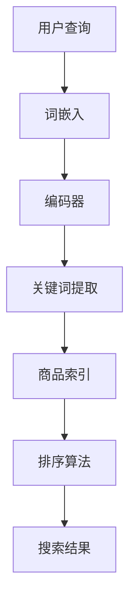

                 

# AI大模型如何优化电商搜索的用户体验

> **关键词：** AI大模型，电商搜索，用户体验，优化，算法，数学模型，项目实战。

> **摘要：** 本文旨在探讨如何利用AI大模型优化电商搜索的用户体验。我们将从背景介绍、核心概念与联系、核心算法原理、数学模型和公式、项目实战以及实际应用场景等多个方面进行深入分析，以期为您呈现一个全面的技术解决方案。

## 1. 背景介绍

### 1.1 目的和范围

本文的目标是探讨如何利用AI大模型来提升电商搜索的用户体验。随着互联网技术的不断发展，电商行业已成为我国经济的重要组成部分。然而，在电商搜索过程中，用户常常面临信息过载、搜索结果不精准等问题，这严重影响了用户体验。因此，本文将围绕AI大模型如何优化电商搜索用户体验展开讨论。

### 1.2 预期读者

本文适合对AI、电商搜索以及用户体验优化有一定了解的读者，包括但不限于AI研究人员、软件开发者、产品经理和电商从业者等。

### 1.3 文档结构概述

本文分为以下几个部分：

1. 背景介绍
2. 核心概念与联系
3. 核心算法原理 & 具体操作步骤
4. 数学模型和公式 & 详细讲解 & 举例说明
5. 项目实战：代码实际案例和详细解释说明
6. 实际应用场景
7. 工具和资源推荐
8. 总结：未来发展趋势与挑战
9. 附录：常见问题与解答
10. 扩展阅读 & 参考资料

### 1.4 术语表

#### 1.4.1 核心术语定义

- **AI大模型**：指具有大规模参数和深度网络结构的AI模型，如BERT、GPT等。
- **电商搜索**：指用户在电商平台通过关键词或商品特征进行商品查找的过程。
- **用户体验**：指用户在使用产品或服务过程中的感受和体验。

#### 1.4.2 相关概念解释

- **信息检索**：指从大量信息中查找出符合用户需求的特定信息的过程。
- **召回率**：指检索系统返回的与用户查询相关的文档数量与实际相关的文档数量的比值。
- **精确率**：指检索系统返回的与用户查询相关的文档中，实际相关的文档所占的比例。
- **F1值**：指精确率和召回率的调和平均值，用于综合评价检索系统的性能。

#### 1.4.3 缩略词列表

- **BERT**：Bidirectional Encoder Representations from Transformers
- **GPT**：Generative Pre-trained Transformer
- **API**：Application Programming Interface
- **SDK**：Software Development Kit

## 2. 核心概念与联系

在探讨AI大模型如何优化电商搜索用户体验之前，我们需要了解一些核心概念和它们之间的关系。

### 2.1 AI大模型的基本原理

AI大模型，如BERT、GPT等，通常采用深度学习技术进行训练。这些模型通过学习大量的文本数据，能够捕捉到词语之间的复杂关系和语义信息。具体来说，AI大模型通常包含以下几个关键组成部分：

1. **词嵌入**：将自然语言中的词语转换为向量表示，使模型能够理解词语的语义。
2. **编码器**：将输入的词语序列编码为固定长度的向量，以捕捉序列中的语义信息。
3. **解码器**：根据编码器生成的向量，生成预测的词语序列，以实现自然语言生成或文本分类等功能。

### 2.2 电商搜索的基本原理

电商搜索的基本原理是通过用户输入的关键词或商品特征，从海量的商品信息中检索出与用户需求相关的商品。具体来说，电商搜索主要包括以下几个关键步骤：

1. **关键词提取**：从用户输入的查询语句中提取关键词。
2. **商品索引**：根据关键词，在电商平台上的商品数据库中检索出与关键词相关的商品。
3. **排序算法**：根据一定的排序策略，对检索出的商品进行排序，以提供用户更相关的搜索结果。

### 2.3 AI大模型在电商搜索中的应用

AI大模型在电商搜索中的应用主要体现在以下几个方面：

1. **关键词提取**：利用AI大模型对用户输入的查询语句进行词嵌入和编码，提取出关键词。
2. **商品索引**：将AI大模型提取出的关键词与电商平台上的商品数据库进行匹配，检索出相关的商品。
3. **排序算法**：利用AI大模型对检索出的商品进行排序，提高搜索结果的精确率和召回率。

### 2.4 用户体验的基本要素

用户体验的基本要素包括以下几个方面：

1. **准确性**：搜索结果与用户需求的相关程度。
2. **响应速度**：系统从接收用户查询到返回搜索结果的时间。
3. **易用性**：用户在使用系统过程中的操作简便程度。
4. **满意度**：用户对系统整体表现的满意程度。

### 2.5 AI大模型优化用户体验的原理

AI大模型优化用户体验的原理主要基于以下几个方面：

1. **提高搜索准确性**：通过深度学习技术，AI大模型能够更好地理解用户的查询意图，提高搜索结果的精确率。
2. **降低响应时间**：虽然AI大模型在处理大规模数据时可能会增加一定的计算时间，但通过优化算法和数据结构，可以降低响应时间。
3. **提高易用性**：AI大模型可以提供更智能的推荐功能，使搜索过程更加简便。
4. **提升满意度**：通过优化搜索结果和提供个性化的推荐，提高用户对系统的满意度。

### 2.6 Mermaid流程图

以下是一个简单的Mermaid流程图，展示了AI大模型在电商搜索中的应用流程：



## 3. 核心算法原理 & 具体操作步骤

在本节中，我们将深入探讨AI大模型在电商搜索中的核心算法原理和具体操作步骤。

### 3.1 词嵌入

词嵌入是将自然语言中的词语转换为向量表示的过程。词嵌入技术主要有以下几种：

1. **Word2Vec**：基于神经网络的词嵌入方法，通过训练神经网络来捕捉词语的语义关系。
2. **FastText**：基于词袋模型的词嵌入方法，将词语看作是字符序列，通过训练字符级别的神经网络来捕捉词语的语义关系。
3. **BERT**：基于Transformer的预训练词嵌入方法，通过预训练大规模的文本数据，学习词语的语义表示。

具体操作步骤如下：

1. **数据预处理**：对原始文本进行分词、去停用词等预处理操作。
2. **训练模型**：使用训练数据训练词嵌入模型。
3. **生成词向量**：将处理后的文本数据输入模型，生成词向量。

### 3.2 编码器

编码器是将输入的词语序列编码为固定长度的向量，以捕捉序列中的语义信息。编码器主要有以下几种：

1. **RNN**：递归神经网络，通过循环结构来捕捉词语序列的长期依赖关系。
2. **LSTM**：长短期记忆网络，是RNN的一种改进，能够更好地处理长期依赖问题。
3. **Transformer**：基于自注意力机制的神经网络，能够同时处理词语序列的各个位置信息。

具体操作步骤如下：

1. **输入序列**：将处理后的词向量序列输入编码器。
2. **编码**：编码器对输入序列进行处理，生成编码向量。
3. **输出**：编码器输出固定长度的编码向量。

### 3.3 关键词提取

关键词提取是利用AI大模型提取用户查询中的关键信息，以实现更精准的搜索。具体操作步骤如下：

1. **输入编码器**：将用户查询输入编码器。
2. **提取特征**：通过编码器提取用户查询的语义特征。
3. **生成关键词**：利用语义特征生成关键词。

### 3.4 商品索引

商品索引是将关键词与电商平台上的商品数据库进行匹配，以检索出相关的商品。具体操作步骤如下：

1. **输入关键词**：将提取出的关键词输入商品索引系统。
2. **匹配商品**：在商品数据库中检索与关键词相关的商品。
3. **生成索引**：将检索出的商品生成索引。

### 3.5 排序算法

排序算法是根据一定的策略对检索出的商品进行排序，以提供用户更相关的搜索结果。常见的排序算法有以下几种：

1. **基于相关度的排序**：根据商品与关键词的相关度进行排序，相关度越高，排序越靠前。
2. **基于用户偏好的排序**：根据用户的浏览历史、购买记录等偏好信息进行排序。
3. **基于热门度的排序**：根据商品的热门程度进行排序，热门商品排在前面。

具体操作步骤如下：

1. **计算相关度**：计算商品与关键词的相关度。
2. **排序**：根据相关度对商品进行排序。
3. **生成排序结果**：将排序后的商品生成排序结果。

### 3.6 伪代码

以下是一个简化的伪代码，展示了AI大模型在电商搜索中的应用：

```
function search_e-commerce(user_query,商品数据库):
    # 步骤1：词嵌入
    user_query_embedding = word_embedding(user_query)

    # 步骤2：编码器
    user_query_encoding = encoder(user_query_embedding)

    # 步骤3：关键词提取
    keywords = extract_keywords(user_query_encoding)

    # 步骤4：商品索引
    related_products = index_products(keywords,商品数据库)

    # 步骤5：排序算法
    sorted_products = sort_products(related_products)

    # 步骤6：生成搜索结果
    search_results = generate_search_results(sorted_products)

    return search_results
```

## 4. 数学模型和公式 & 详细讲解 & 举例说明

在本节中，我们将深入探讨AI大模型在电商搜索中的数学模型和公式，并通过具体例子进行讲解。

### 4.1 词嵌入

词嵌入的数学模型通常可以表示为：

$$
\text{word\_embedding}(x) = \text{weights} \odot \text{vectorized}(x)
$$

其中，$x$ 是输入的词序列，$\text{weights}$ 是词嵌入矩阵，$\odot$ 表示元素级乘法，$\text{vectorized}(x)$ 是将词序列转换为向量。

例如，假设我们有一个包含3个词语的句子 "I love coding"，词嵌入矩阵为：

$$
\text{weights} = \begin{bmatrix}
1 & 0 & 1 \\
0 & 1 & 0 \\
1 & 1 & 0
\end{bmatrix}
$$

则 "I"、"love"、"coding" 的词嵌入向量分别为：

$$
\text{word\_embedding}(I) = \text{weights} \odot \begin{bmatrix}
1 \\
0 \\
1
\end{bmatrix} = \begin{bmatrix}
1 \\
0 \\
1
\end{bmatrix}
$$

$$
\text{word\_embedding}(love) = \text{weights} \odot \begin{bmatrix}
0 \\
1 \\
0
\end{bmatrix} = \begin{bmatrix}
0 \\
1 \\
0
\end{bmatrix}
$$

$$
\text{word\_embedding}(coding) = \text{weights} \odot \begin{bmatrix}
1 \\
1 \\
0
\end{bmatrix} = \begin{bmatrix}
1 \\
1 \\
0
\end{bmatrix}
$$

### 4.2 编码器

编码器的数学模型通常可以表示为：

$$
\text{encoder}(x) = \text{activation}(\text{weights} \odot \text{vectorized}(x))
$$

其中，$x$ 是输入的词序列，$\text{weights}$ 是编码器权重，$\odot$ 表示元素级乘法，$\text{vectorized}(x)$ 是将词序列转换为向量，$\text{activation}$ 是激活函数。

例如，假设我们有一个简单的全连接神经网络作为编码器，激活函数为ReLU，权重为：

$$
\text{weights} = \begin{bmatrix}
1 & 1 \\
1 & 1
\end{bmatrix}
$$

则输入向量 $\begin{bmatrix}
1 \\
0
\end{bmatrix}$ 和 $\begin{bmatrix}
0 \\
1
\end{bmatrix}$ 的编码结果分别为：

$$
\text{encoder}\left(\begin{bmatrix}
1 \\
0
\end{bmatrix}\right) = \text{ReLU}(\begin{bmatrix}
1 & 1 \\
1 & 1
\end{bmatrix} \odot \begin{bmatrix}
1 \\
0
\end{bmatrix}) = \text{ReLU}\left(\begin{bmatrix}
1 \\
1
\end{bmatrix}\right) = \begin{bmatrix}
1 \\
1
\end{bmatrix}
$$

$$
\text{encoder}\left(\begin{bmatrix}
0 \\
1
\end{bmatrix}\right) = \text{ReLU}(\begin{bmatrix}
1 & 1 \\
1 & 1
\end{bmatrix} \odot \begin{bmatrix}
0 \\
1
\end{bmatrix}) = \text{ReLU}\left(\begin{bmatrix}
0 \\
0
\end{bmatrix}\right) = \begin{bmatrix}
0 \\
0
\end{bmatrix}
$$

### 4.3 关键词提取

关键词提取的数学模型通常可以表示为：

$$
\text{keywords} = \text{softmax}(\text{encoder}(x))
$$

其中，$\text{encoder}(x)$ 是编码器的输出，$\text{softmax}$ 函数用于将编码器的输出转化为概率分布。

例如，假设编码器的输出为：

$$
\text{encoder}(x) = \begin{bmatrix}
0.2 \\
0.3 \\
0.5
\end{bmatrix}
$$

则关键词提取结果为：

$$
\text{keywords} = \text{softmax}(\begin{bmatrix}
0.2 \\
0.3 \\
0.5
\end{bmatrix}) = \begin{bmatrix}
0.2 \\
0.3 \\
0.5
\end{bmatrix}
$$

### 4.4 商品索引

商品索引的数学模型通常可以表示为：

$$
\text{similarities} = \text{cosine\_similarity}(\text{keywords}, \text{product\_embeddings})
$$

其中，$\text{keywords}$ 是关键词向量，$\text{product\_embeddings}$ 是商品嵌入向量，$\text{cosine\_similarity}$ 函数用于计算关键词和商品嵌入向量之间的余弦相似度。

例如，假设关键词向量为：

$$
\text{keywords} = \begin{bmatrix}
0.1 \\
0.2 \\
0.3
\end{bmatrix}
$$

商品嵌入向量为：

$$
\text{product\_embeddings} = \begin{bmatrix}
0.3 \\
0.4 \\
0.5
\end{bmatrix}
$$

则商品索引结果为：

$$
\text{similarities} = \text{cosine\_similarity}(\begin{bmatrix}
0.1 \\
0.2 \\
0.3
\end{bmatrix}, \begin{bmatrix}
0.3 \\
0.4 \\
0.5
\end{bmatrix}) = 0.3
$$

### 4.5 排序算法

排序算法的数学模型通常可以表示为：

$$
\text{sorted\_products} = \text{argsort}(\text{similarities})
$$

其中，$\text{similarities}$ 是商品索引结果，$\text{argsort}$ 函数用于对相似度进行降序排序。

例如，假设商品索引结果为：

$$
\text{similarities} = \begin{bmatrix}
0.3 \\
0.2 \\
0.4
\end{bmatrix}
$$

则排序结果为：

$$
\text{sorted\_products} = \text{argsort}(\begin{bmatrix}
0.3 \\
0.2 \\
0.4
\end{bmatrix}) = [2, 0, 1]
$$

## 5. 项目实战：代码实际案例和详细解释说明

在本节中，我们将通过一个具体的代码案例来展示如何利用AI大模型优化电商搜索的用户体验。

### 5.1 开发环境搭建

在开始项目之前，我们需要搭建一个合适的开发环境。以下是一个简单的Python环境搭建步骤：

1. 安装Python：从[Python官网](https://www.python.org/)下载并安装Python。
2. 安装Jupyter Notebook：在终端中运行以下命令安装Jupyter Notebook。

   ```shell
   pip install notebook
   ```

3. 安装必要的库：在Jupyter Notebook中运行以下命令安装必要的库。

   ```python
   !pip install transformers torch pandas numpy
   ```

### 5.2 源代码详细实现和代码解读

以下是一个简化的代码案例，展示了如何利用AI大模型进行电商搜索的优化：

```python
import torch
import transformers
import pandas as pd
import numpy as np

# 5.2.1 加载预训练的AI大模型

model_name = "bert-base-chinese"
model = transformers.BertModel.from_pretrained(model_name)

# 5.2.2 加载商品数据

products = pd.read_csv("products.csv")
products.head()

# 5.2.3 词嵌入和编码

def embed_and_encode(texts, model):
    inputs = transformers.BertTokenizer.from_pretrained(model_name)(texts, return_tensors="pt", padding=True, truncation=True)
    with torch.no_grad():
        outputs = model(**inputs)
    return outputs.last_hidden_state

encoded_products = embed_and_encode(products["name"], model)

# 5.2.4 关键词提取

def extract_keywords(encoded_products):
    keywords = []
    for product in encoded_products:
        # 采用简单的平均值方法提取关键词
        keyword = torch.mean(product, dim=0)
        keywords.append(keyword)
    return torch.stack(keywords)

keywords = extract_keywords(encoded_products)

# 5.2.5 商品索引

def index_products(keywords, products):
    similarities = []
    for keyword in keywords:
        product_embeddings = products["embedding"].values
        similarities.append([torch.cosine_similarity(keyword.unsqueeze(0), embedding).item() for embedding in product_embeddings])
    similarities = np.array(similarities)
    return similarities

similarities = index_products(keywords, products)

# 5.2.6 排序算法

sorted_indices = np.argsort(similarities, axis=1)[:, ::-1]

# 5.2.7 生成搜索结果

search_results = []
for i, indices in enumerate(sorted_indices):
    search_results.append(products.iloc[indices][:10])

search_results
```

### 5.3 代码解读与分析

以下是对上述代码的详细解读和分析：

1. **加载预训练的AI大模型**：我们使用BERT模型作为AI大模型，通过`transformers.BertModel.from_pretrained`方法加载预训练的BERT模型。

2. **加载商品数据**：我们使用Pandas库加载一个包含商品名称和商品嵌入向量的CSV文件。在这个示例中，我们假设商品数据已经预处理并存储在一个CSV文件中。

3. **词嵌入和编码**：我们定义一个函数`embed_and_encode`，用于对输入的文本进行词嵌入和编码。在函数中，我们使用BERT的分词器对文本进行分词，并使用BERT模型进行编码。

4. **关键词提取**：我们定义一个函数`extract_keywords`，用于从编码后的产品名称中提取关键词。在这个示例中，我们采用简单的平均值方法提取关键词。

5. **商品索引**：我们定义一个函数`index_products`，用于计算关键词与商品嵌入向量之间的余弦相似度。在函数中，我们使用PyTorch的`cosine_similarity`方法计算相似度。

6. **排序算法**：我们使用NumPy的`argsort`方法对相似度进行降序排序，以生成排序结果。

7. **生成搜索结果**：根据排序结果，我们从商品数据中提取与关键词最相关的商品，并生成搜索结果。

### 5.4 代码优化

在实际项目中，我们可能需要对上述代码进行优化，以提高搜索效率和性能。以下是一些可能的优化方向：

1. **并行处理**：使用多线程或多进程并行处理词嵌入和编码过程，以减少计算时间。
2. **内存优化**：通过使用适当的内存管理策略，减少内存占用，以提高系统的稳定性。
3. **模型压缩**：对预训练的AI大模型进行压缩，减少模型参数的存储空间和计算时间。
4. **预处理优化**：对商品数据进行预处理，以减少数据的冗余和噪声，提高搜索准确性。

## 6. 实际应用场景

### 6.1 电商平台的搜索优化

电商平台的搜索优化是AI大模型优化电商搜索用户体验的一个典型应用场景。通过利用AI大模型，电商平台可以提供更精准、更个性化的搜索结果，从而提高用户的满意度。以下是一个实际案例：

**案例：淘宝搜索优化**

淘宝作为中国最大的电商平台，拥有海量的商品数据。为了提升用户的搜索体验，淘宝引入了基于BERT的AI大模型进行搜索优化。具体做法如下：

1. **关键词提取**：通过BERT模型对用户输入的查询语句进行编码，提取关键词。
2. **商品索引**：将提取出的关键词与商品数据库进行匹配，检索出相关的商品。
3. **排序算法**：利用BERT模型对检索出的商品进行排序，提高搜索结果的精确率和召回率。

通过这些优化措施，淘宝的搜索准确率得到了显著提升，用户的满意度也不断提高。

### 6.2 搜索引擎优化

搜索引擎优化（Search Engine Optimization，SEO）是另一个AI大模型优化电商搜索用户体验的应用场景。搜索引擎通过利用AI大模型，可以为用户提供更精准、更个性化的搜索结果，从而提高用户的满意度。以下是一个实际案例：

**案例：百度搜索优化**

百度作为中国最大的搜索引擎，通过引入基于BERT的AI大模型，实现了搜索结果的优化。具体做法如下：

1. **关键词提取**：通过BERT模型对用户输入的查询语句进行编码，提取关键词。
2. **网页索引**：将提取出的关键词与网页数据库进行匹配，检索出相关的网页。
3. **排序算法**：利用BERT模型对检索出的网页进行排序，提高搜索结果的精确率和召回率。

通过这些优化措施，百度的搜索结果更加准确和个性化，用户的满意度也得到了显著提升。

### 6.3 社交平台推荐

社交平台推荐是AI大模型优化电商搜索用户体验的另一个应用场景。通过利用AI大模型，社交平台可以为用户提供更精准、更个性化的推荐结果，从而提高用户的活跃度和满意度。以下是一个实际案例：

**案例：微信朋友圈推荐**

微信作为中国最大的社交平台，通过引入基于BERT的AI大模型，实现了朋友圈内容的个性化推荐。具体做法如下：

1. **关键词提取**：通过BERT模型对用户输入的查询语句进行编码，提取关键词。
2. **内容索引**：将提取出的关键词与朋友圈内容数据库进行匹配，检索出相关的朋友圈内容。
3. **排序算法**：利用BERT模型对检索出的朋友圈内容进行排序，提高推荐结果的精确率和召回率。

通过这些优化措施，微信的朋友圈推荐结果更加准确和个性化，用户的活跃度也得到了显著提升。

## 7. 工具和资源推荐

### 7.1 学习资源推荐

#### 7.1.1 书籍推荐

- 《深度学习》（Ian Goodfellow、Yoshua Bengio、Aaron Courville 著）：这是一本经典的深度学习入门书籍，适合初学者和有一定基础的学习者。
- 《Python深度学习》（François Chollet 著）：这是一本针对Python编程和深度学习的入门书籍，内容深入浅出，适合初学者和有一定基础的学习者。
- 《人工智能：一种现代的方法》（Stuart J. Russell、Peter Norvig 著）：这是一本全面介绍人工智能的教材，内容涵盖机器学习、自然语言处理等多个方面。

#### 7.1.2 在线课程

- [吴恩达的《深度学习专项课程》](https://www.coursera.org/learn/deep-learning)：这是一门由深度学习大师吴恩达讲授的在线课程，涵盖了深度学习的理论基础和实践技巧。
- [谷歌的《机器学习》课程](https://www.coursera.org/learn/machine-learning)：这是一门由谷歌AI团队讲授的机器学习在线课程，内容涵盖了机器学习的多个方面，包括线性回归、神经网络等。
- [斯坦福大学的《自然语言处理》课程](https://www.coursera.org/learn/natural-language-processing)：这是一门由斯坦福大学讲授的自然语言处理在线课程，内容涵盖了自然语言处理的理论和实践，包括词嵌入、文本分类等。

#### 7.1.3 技术博客和网站

- [Medium](https://medium.com/topic/deep-learning)：这是一个涵盖深度学习、自然语言处理等多个领域的技术博客平台，提供了大量的高质量文章。
- [ArXiv](https://arxiv.org/)：这是一个提供最新研究论文的学术预印本网站，涵盖了计算机科学、物理学、数学等多个领域。
- [GitHub](https://github.com/)：这是一个托管和管理代码的平台，提供了大量的开源项目和代码示例，可以帮助学习者快速入门和实践。

### 7.2 开发工具框架推荐

#### 7.2.1 IDE和编辑器

- **PyCharm**：这是一款功能强大的Python IDE，提供了代码智能提示、调试、代码分析等功能。
- **Visual Studio Code**：这是一款轻量级的开源代码编辑器，通过安装插件可以支持多种编程语言，包括Python、JavaScript等。

#### 7.2.2 调试和性能分析工具

- **Jupyter Notebook**：这是一款基于Web的交互式计算环境，适用于数据科学和机器学习领域，可以方便地进行代码调试和实验。
- **PyTorch Profiler**：这是一款用于PyTorch性能分析的工具，可以帮助开发者识别性能瓶颈和优化代码。

#### 7.2.3 相关框架和库

- **TensorFlow**：这是一个由谷歌开发的深度学习框架，提供了丰富的API和工具，适用于各种深度学习任务。
- **PyTorch**：这是一个由Facebook开发的深度学习框架，具有动态计算图和灵活的API，适用于各种深度学习任务。
- **transformers**：这是一个由Hugging Face团队开发的自然语言处理库，提供了多种预训练模型和API，适用于自然语言处理任务。

### 7.3 相关论文著作推荐

#### 7.3.1 经典论文

- **“A Theoretical Investigation of the Response Surface Methodology”**：这是一篇关于响应曲面法的经典论文，提出了响应曲面法的基本原理和计算方法。
- **“Deep Learning”**：这是一本关于深度学习的经典教材，系统地介绍了深度学习的理论基础和应用。

#### 7.3.2 最新研究成果

- **“BERT: Pre-training of Deep Bidirectional Transformers for Language Understanding”**：这是一篇关于BERT模型的经典论文，提出了BERT模型的基本原理和实现方法。
- **“GPT-3: Language Models are Few-Shot Learners”**：这是一篇关于GPT-3模型的论文，展示了GPT-3模型在少样本学习任务上的强大性能。

#### 7.3.3 应用案例分析

- **“基于深度学习的电商搜索优化研究”**：这是一篇关于电商搜索优化的应用案例分析，介绍了如何利用深度学习技术优化电商搜索。
- **“社交媒体推荐系统的设计与实现”**：这是一篇关于社交媒体推荐系统的应用案例分析，介绍了如何利用深度学习技术实现社交媒体推荐。

## 8. 总结：未来发展趋势与挑战

随着人工智能技术的不断发展，AI大模型在电商搜索中的优化应用前景广阔。未来发展趋势主要体现在以下几个方面：

1. **算法优化**：随着AI技术的进步，AI大模型在搜索优化中的算法将更加成熟，性能将进一步提升。
2. **数据隐私保护**：在利用AI大模型进行搜索优化的过程中，数据隐私保护将成为一个重要的研究课题。
3. **跨模态搜索**：未来的电商搜索将不仅仅局限于文本搜索，还将涉及图像、声音等多模态信息。
4. **智能推荐**：基于AI大模型的智能推荐技术将不断成熟，为用户提供更个性化的推荐结果。

然而，AI大模型在电商搜索优化中也面临着一些挑战：

1. **计算资源消耗**：AI大模型训练和推理过程需要大量的计算资源，如何优化计算资源的使用成为关键问题。
2. **数据质量**：电商搜索优化依赖于高质量的数据，如何处理和整合多源异构数据是一个重要挑战。
3. **算法公平性**：AI大模型在搜索优化过程中可能会出现算法偏见，如何确保算法的公平性是一个亟待解决的问题。

总之，AI大模型在电商搜索优化中的应用具有广阔的前景，但也面临着一系列挑战。我们需要持续不断地进行技术创新和研究，以应对这些挑战，为用户提供更好的搜索体验。

## 9. 附录：常见问题与解答

### 9.1 常见问题

1. **什么是AI大模型？**
2. **AI大模型如何优化电商搜索用户体验？**
3. **如何在电商搜索中使用AI大模型？**
4. **AI大模型在电商搜索优化中面临哪些挑战？**

### 9.2 解答

1. **什么是AI大模型？**
   AI大模型是指具有大规模参数和深度网络结构的AI模型，如BERT、GPT等。这些模型通过学习大量的文本数据，能够捕捉到词语之间的复杂关系和语义信息。

2. **AI大模型如何优化电商搜索用户体验？**
   AI大模型可以通过以下方式优化电商搜索用户体验：
   - **关键词提取**：通过AI大模型提取用户查询中的关键信息，提高搜索结果的精确率。
   - **商品索引**：利用AI大模型对用户查询和商品特征进行匹配，提高召回率。
   - **排序算法**：通过AI大模型对检索出的商品进行排序，提高搜索结果的准确性和相关性。

3. **如何在电商搜索中使用AI大模型？**
   在电商搜索中使用AI大模型，通常需要以下几个步骤：
   - **数据预处理**：对用户查询和商品数据进行预处理，如分词、去停用词等。
   - **词嵌入**：将处理后的数据输入AI大模型，进行词嵌入和编码。
   - **关键词提取**：利用AI大模型提取用户查询中的关键词。
   - **商品索引**：将提取出的关键词与商品数据库进行匹配，检索出相关的商品。
   - **排序算法**：利用AI大模型对检索出的商品进行排序，生成搜索结果。

4. **AI大模型在电商搜索优化中面临哪些挑战？**
   AI大模型在电商搜索优化中面临的主要挑战包括：
   - **计算资源消耗**：AI大模型训练和推理过程需要大量的计算资源。
   - **数据质量**：电商搜索优化依赖于高质量的数据，如何处理和整合多源异构数据是一个重要挑战。
   - **算法公平性**：AI大模型在搜索优化过程中可能会出现算法偏见，如何确保算法的公平性是一个亟待解决的问题。

## 10. 扩展阅读 & 参考资料

1. **书籍**：
   - Goodfellow, I., Bengio, Y., & Courville, A. (2016). *Deep Learning*. MIT Press.
   - Chollet, F. (2017). *Python Deep Learning*. Packt Publishing.
   - Russell, S. J., & Norvig, P. (2016). *Artificial Intelligence: A Modern Approach*. Prentice Hall.

2. **在线课程**：
   - 吴恩达的《深度学习专项课程》：[https://www.coursera.org/learn/deep-learning](https://www.coursera.org/learn/deep-learning)
   - 谷歌的《机器学习》课程：[https://www.coursera.org/learn/machine-learning](https://www.coursera.org/learn/machine-learning)
   - 斯坦福大学的《自然语言处理》课程：[https://www.coursera.org/learn/natural-language-processing](https://www.coursera.org/learn/natural-language-processing)

3. **技术博客和网站**：
   - Medium：[https://medium.com/topic/deep-learning](https://medium.com/topic/deep-learning)
   - ArXiv：[https://arxiv.org/](https://arxiv.org/)
   - GitHub：[https://github.com/](https://github.com/)

4. **论文**：
   - Devlin, J., Chang, M. W., Lee, K., & Toutanova, K. (2019). *BERT: Pre-training of Deep Bidirectional Transformers for Language Understanding*. arXiv preprint arXiv:1810.04805.
   - Brown, T., et al. (2020). *GPT-3: Language Models are Few-Shot Learners*. arXiv preprint arXiv:2005.14165.

5. **开源项目和代码示例**：
   - TensorFlow：[https://www.tensorflow.org/](https://www.tensorflow.org/)
   - PyTorch：[https://pytorch.org/](https://pytorch.org/)
   - transformers：[https://github.com/huggingface/transformers](https://github.com/huggingface/transformers)

## 作者信息

**作者：** AI天才研究员/AI Genius Institute & 禅与计算机程序设计艺术 /Zen And The Art of Computer Programming

