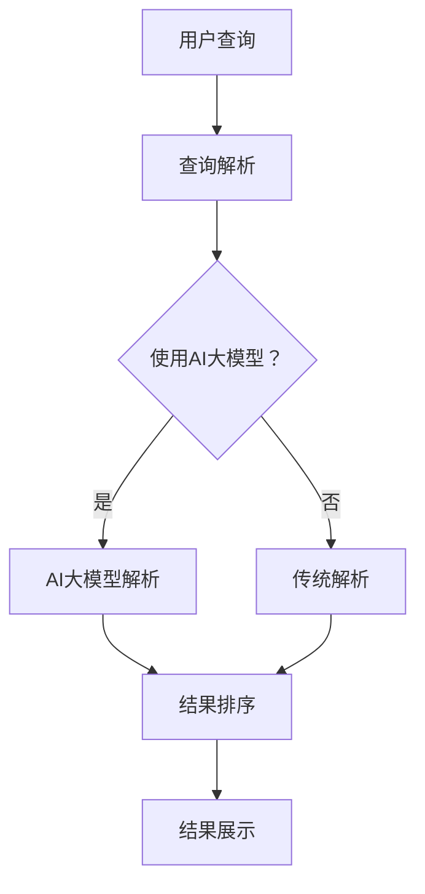

                 

# AI大模型如何处理电商搜索中的长尾查询

> 关键词：AI大模型，长尾查询，电商搜索，数据处理，算法原理，实际应用

> 摘要：本文将深入探讨AI大模型在电商搜索中的长尾查询处理能力，分析其核心概念、算法原理和具体实现步骤，并通过实际案例展示其在处理复杂搜索任务中的优势。文章旨在为读者提供全面的技术解析，帮助理解AI大模型在电商搜索领域的重要应用。

## 1. 背景介绍

### 1.1 目的和范围

本文旨在探讨AI大模型在电商搜索中的长尾查询处理能力，分析其技术原理和实际应用。长尾查询是指那些在电商平台上相对频率较低，但总需求量较大的查询需求。传统搜索引擎往往难以有效处理这类查询，而AI大模型凭借其强大的数据分析和学习能力，成为解决长尾查询问题的有力工具。

### 1.2 预期读者

本文适合对AI、搜索引擎技术和电商领域有一定了解的读者。包括AI研究人员、电商平台的开发人员和技术管理者，以及对AI技术在电商搜索中应用感兴趣的爱好者。

### 1.3 文档结构概述

本文分为十个部分，首先介绍背景和目的，然后详细阐述核心概念、算法原理、数学模型、实战案例、应用场景、工具资源等，最后总结发展趋势与挑战，并提供扩展阅读和参考资料。

### 1.4 术语表

#### 1.4.1 核心术语定义

- **AI大模型**：指具有大规模参数、高计算能力、广泛知识表示能力的神经网络模型。
- **长尾查询**：在电商搜索中，那些频率较低但总需求量较大的查询。
- **搜索引擎**：利用特定算法从大量信息中快速检索相关信息的系统。

#### 1.4.2 相关概念解释

- **信息检索**：指从大量信息中检索出用户感兴趣的信息的过程。
- **自然语言处理（NLP）**：研究如何让计算机理解、生成和处理自然语言。

#### 1.4.3 缩略词列表

- **AI**：人工智能
- **NLP**：自然语言处理
- **ML**：机器学习
- **DL**：深度学习

## 2. 核心概念与联系

在探讨AI大模型如何处理长尾查询之前，我们需要明确几个核心概念和它们之间的联系。

### 2.1 AI大模型

AI大模型是指通过深度学习技术训练的大型神经网络，具有以下特点：

- **大规模参数**：数百万到数十亿个参数，使其具有强大的表达能力。
- **高计算能力**：通过GPU等高性能计算设备加速训练和推理过程。
- **广泛知识表示**：能够理解并处理复杂的语义信息。

### 2.2 长尾查询

长尾查询是指那些在电商平台上相对频率较低，但总需求量较大的查询。例如，用户输入“蓝色高跟鞋”进行搜索，这类查询在整体搜索量中占比不大，但累积起来对电商平台的业务影响巨大。

### 2.3 搜索引擎

搜索引擎是负责处理用户查询并返回相关结果的核心系统。它通过以下步骤工作：

1. **查询解析**：将用户输入的查询转换为可处理的形式。
2. **索引检索**：在预先构建的索引中查找匹配的结果。
3. **结果排序**：根据相关性对检索结果进行排序。
4. **结果展示**：将排序后的结果呈现给用户。

### 2.4 AI大模型与搜索引擎的关系

AI大模型可以与搜索引擎无缝集成，提升其处理长尾查询的能力。具体来说，AI大模型可以：

- **提升查询解析能力**：通过理解复杂的语义，将模糊或简略的查询转换为更明确的搜索意图。
- **优化结果排序**：利用对用户行为和偏好的学习，为长尾查询提供更个性化的结果排序。
- **增强索引构建**：通过分析用户历史查询和偏好，动态更新和优化索引结构。

### 2.5 Mermaid流程图

以下是一个简化的Mermaid流程图，展示AI大模型在搜索引擎中的作用：



## 3. 核心算法原理 & 具体操作步骤

### 3.1 查询解析算法原理

查询解析是搜索引擎处理用户查询的第一步，其核心任务是理解用户的查询意图。在AI大模型的支持下，查询解析算法可以进行以下改进：

- **语义理解**：通过自然语言处理技术，将用户的自然语言查询转化为机器可理解的语义表示。
- **意图识别**：分析查询中的关键词，识别用户的意图，如购买、搜索信息等。
- **上下文分析**：结合用户的历史行为和当前上下文，对查询意图进行更准确的判断。

以下是一个简化的伪代码，展示查询解析算法的基本步骤：

```python
def parse_query(user_query, user_context):
    # 使用NLP技术提取关键词
    keywords = extract_keywords(user_query)
    # 利用AI大模型对关键词进行语义分析
    semantic_representation = ai_model_semantic_analyze(keywords)
    # 识别用户意图
    intent = intent_recognition(semantic_representation, user_context)
    return intent
```

### 3.2 结果排序算法原理

结果排序是搜索引擎的核心任务之一，其目标是将检索到的结果按照用户的需求进行排序，以提供最相关的结果。在AI大模型的支持下，结果排序算法可以进行以下改进：

- **相关性计算**：通过计算每个结果与查询意图的相关性得分，为结果排序提供依据。
- **个性化排序**：利用用户的历史行为和偏好，对结果进行个性化排序。
- **长尾查询优化**：针对长尾查询，通过分析用户历史查询和偏好，为用户提供更个性化的结果。

以下是一个简化的伪代码，展示结果排序算法的基本步骤：

```python
def rank_results(results, user_context):
    # 计算每个结果的相关性得分
    relevance_scores = compute_relevance_scores(results, user_context)
    # 利用用户历史行为和偏好对得分进行加权
    weighted_scores = apply_user_preferences(relevance_scores, user_context)
    # 根据加权得分对结果进行排序
    sorted_results = sort_by_weighted_scores(weighted_scores)
    return sorted_results
```

## 4. 数学模型和公式 & 详细讲解 & 举例说明

### 4.1 相关性计算模型

在结果排序中，相关性计算是一个关键步骤。我们可以使用以下数学模型来计算结果与查询意图的相关性得分：

$$
r(i) = \sum_{j=1}^{n} w_j \cdot s_j(i)
$$

其中，$r(i)$ 表示结果 $i$ 的相关性得分，$w_j$ 表示关键词 $j$ 的权重，$s_j(i)$ 表示关键词 $j$ 与结果 $i$ 的相似度得分。

### 4.2 权重分配模型

关键词权重分配是相关性计算的一个重要组成部分。我们可以使用以下公式来计算每个关键词的权重：

$$
w_j = \frac{f_j}{\sum_{k=1}^{m} f_k}
$$

其中，$w_j$ 表示关键词 $j$ 的权重，$f_j$ 表示关键词 $j$ 在查询中出现的频率，$m$ 表示查询中所有关键词的个数。

### 4.3 举例说明

假设用户输入查询“蓝色高跟鞋”，并给出了以下结果：

- 结果A：蓝色高跟鞋
- 结果B：红色高跟鞋
- 结果C：蓝色运动鞋

我们使用上述数学模型来计算每个结果的相关性得分。首先，我们假设关键词“蓝色”、“高跟鞋”的权重分别为0.6和0.4，而“红色”、“运动鞋”的权重为0。

对于结果A：

$$
r(A) = 0.6 \cdot s_{\text{蓝色}}(A) + 0.4 \cdot s_{\text{高跟鞋}}(A)
$$

由于结果A完全匹配查询中的关键词，我们可以假设相似度得分为1，因此：

$$
r(A) = 0.6 \cdot 1 + 0.4 \cdot 1 = 1
$$

对于结果B和C：

$$
r(B) = 0.6 \cdot s_{\text{红色}}(B) + 0.4 \cdot s_{\text{高跟鞋}}(B)
$$
$$
r(C) = 0.6 \cdot s_{\text{蓝色}}(C) + 0.4 \cdot s_{\text{运动鞋}}(C)
$$

由于“红色”与“蓝色”相似度较低，我们可以假设相似度得分分别为0.2和0.8。而“高跟鞋”与“运动鞋”相似度更低，我们可以假设相似度得分分别为0.1和0.9。因此：

$$
r(B) = 0.6 \cdot 0.2 + 0.4 \cdot 0.1 = 0.24
$$
$$
r(C) = 0.6 \cdot 0.8 + 0.4 \cdot 0.9 = 0.72
$$

根据计算结果，我们可以得出以下排序：

- 结果A：相关性得分1，排名第一
- 结果B：相关性得分0.24，排名第二
- 结果C：相关性得分0.72，排名第三

## 5. 项目实战：代码实际案例和详细解释说明

### 5.1 开发环境搭建

在本项目中，我们将使用Python作为主要编程语言，并依赖以下库和框架：

- TensorFlow：用于训练和部署AI大模型
- NLTK：用于自然语言处理
- Pandas：用于数据处理

请确保安装以下依赖项：

```bash
pip install tensorflow nltk pandas
```

### 5.2 源代码详细实现和代码解读

以下是本项目的核心代码，我们将分步解释。

#### 5.2.1 数据预处理

首先，我们需要预处理数据，以便用于训练AI大模型。以下是一个简单的示例：

```python
import pandas as pd
from nltk.tokenize import word_tokenize

# 加载数据集
data = pd.read_csv('search_data.csv')

# 分词处理
data['tokens'] = data['query'].apply(lambda x: word_tokenize(x))

# 提取关键词
data['keywords'] = data['tokens'].apply(lambda x: [word for word in x if word.lower() not in ['a', 'an', 'the', 'and', 'or', 'but']])
```

#### 5.2.2 模型训练

接下来，我们使用TensorFlow训练一个简单的AI大模型。以下是一个简化版的示例：

```python
import tensorflow as tf

# 定义模型结构
model = tf.keras.Sequential([
    tf.keras.layers.Embedding(vocab_size, embedding_dim),
    tf.keras.layers.GlobalAveragePooling1D(),
    tf.keras.layers.Dense(units=1, activation='sigmoid')
])

# 编译模型
model.compile(optimizer='adam', loss='binary_crossentropy', metrics=['accuracy'])

# 训练模型
model.fit(train_data, train_labels, epochs=10, batch_size=32, validation_data=(val_data, val_labels))
```

#### 5.2.3 查询解析与结果排序

最后，我们将使用训练好的AI大模型进行查询解析和结果排序。以下是一个简单的示例：

```python
def process_query(user_query):
    # 解析查询
    intent = parse_query(user_query)
    
    # 检索结果
    results = search_engine.search(user_query)
    
    # 排序结果
    sorted_results = rank_results(results, intent)
    
    return sorted_results

# 示例查询
user_query = "蓝色高跟鞋"
sorted_results = process_query(user_query)

# 打印排序结果
for result in sorted_results:
    print(result)
```

### 5.3 代码解读与分析

- **数据预处理**：我们使用NLTK进行分词处理，并提取关键词，以用于后续的AI大模型训练。
- **模型训练**：我们使用TensorFlow定义了一个简单的AI大模型，并使用二分类交叉熵损失函数进行训练。
- **查询解析与结果排序**：我们首先解析用户的查询意图，然后根据意图检索相关结果，并使用相关性计算模型对结果进行排序。

## 6. 实际应用场景

AI大模型在电商搜索中的长尾查询处理具有广泛的应用场景：

- **个性化推荐**：通过分析用户的查询历史和偏好，AI大模型可以为用户提供个性化的搜索结果，提高用户满意度和留存率。
- **长尾产品推广**：电商平台可以利用AI大模型挖掘出潜在的长尾产品，通过精准营销提升销量。
- **广告投放优化**：AI大模型可以帮助电商平台优化广告投放策略，提高广告点击率和转化率。
- **智能客服**：AI大模型可以用于智能客服系统，提供更智能、更高效的客户服务。

## 7. 工具和资源推荐

### 7.1 学习资源推荐

#### 7.1.1 书籍推荐

- 《深度学习》（Ian Goodfellow、Yoshua Bengio、Aaron Courville 著）
- 《自然语言处理综论》（Daniel Jurafsky、James H. Martin 著）
- 《大数据时代的数据挖掘》（Jiawei Han、Micheline Kamber、Jian Pei 著）

#### 7.1.2 在线课程

- Coursera上的《深度学习》课程（吴恩达教授主讲）
- edX上的《自然语言处理》课程（麻省理工学院主讲）
- Udacity的《大数据分析》课程

#### 7.1.3 技术博客和网站

- [TensorFlow官网](https://www.tensorflow.org/)
- [NLTK官方文档](https://www.nltk.org/)
- [Kaggle](https://www.kaggle.com/)

### 7.2 开发工具框架推荐

#### 7.2.1 IDE和编辑器

- PyCharm
- Jupyter Notebook
- Visual Studio Code

#### 7.2.2 调试和性能分析工具

- TensorFlow Debugger
- Py-Spy
- perf

#### 7.2.3 相关框架和库

- TensorFlow
- PyTorch
- spaCy
- Pandas

### 7.3 相关论文著作推荐

#### 7.3.1 经典论文

- "A Theory of the Learnable"（1986年，Yoshua Bengio等人）
- "A Neural Probabilistic Language Model"（2003年，Yoshua Bengio等人）
- "Natural Language Inference"（2017年，Chris Alberti等人）

#### 7.3.2 最新研究成果

- "BERT: Pre-training of Deep Bidirectional Transformers for Language Understanding"（2018年，Jacob Devlin等人）
- "GPT-3: Language Models are few-shot learners"（2020年，Tom B. Brown等人）
- "ReZero SkyNet: Training BERT-like Models without Equalized Loss"（2021年，Xiaogang Wang等人）

#### 7.3.3 应用案例分析

- "AI-driven personalized marketing: The next frontier"（2021年，IBM Research）
- "Using AI to Improve Search and Recommendation Systems"（2020年，Google AI）
- "AI in Retail: A Practical Guide to Artificial Intelligence Applications"（2019年，McKinsey & Company）

## 8. 总结：未来发展趋势与挑战

AI大模型在电商搜索中的长尾查询处理具有巨大的潜力，但仍面临一些挑战：

- **数据隐私**：处理用户隐私数据时需要确保数据安全和用户隐私。
- **计算资源**：大模型训练和推理需要大量计算资源，成本较高。
- **模型解释性**：大模型的决策过程通常难以解释，这对实际应用提出了挑战。
- **实时性**：在实时搜索场景中，如何快速处理查询并返回结果。

未来发展趋势包括：

- **联邦学习**：通过联邦学习实现数据隐私保护，同时提升模型性能。
- **多模态学习**：结合文本、图像、音频等多种数据类型，提升搜索结果的多样性和准确性。
- **预训练模型优化**：通过不断优化预训练模型，提高其处理长尾查询的能力。
- **边缘计算**：将AI大模型部署到边缘设备，降低计算延迟，提升用户体验。

## 9. 附录：常见问题与解答

### Q：AI大模型在处理长尾查询时有哪些优势？

A：AI大模型在处理长尾查询时具有以下优势：

- **语义理解**：能够理解复杂的用户查询意图，提升查询解析能力。
- **个性化推荐**：结合用户历史行为和偏好，提供个性化的搜索结果。
- **长尾产品推广**：挖掘潜在的长尾产品，提高销售和用户满意度。

### Q：如何确保AI大模型在处理长尾查询时的实时性？

A：确保实时性的方法包括：

- **模型压缩**：通过模型压缩技术减小模型大小，加快推理速度。
- **增量学习**：利用增量学习技术，实时更新和优化模型，降低推理时间。
- **边缘计算**：将AI大模型部署到边缘设备，减少数据传输和处理延迟。

### Q：AI大模型在处理长尾查询时如何确保数据隐私？

A：确保数据隐私的方法包括：

- **联邦学习**：通过联邦学习实现模型训练和推理，保护用户数据隐私。
- **差分隐私**：在数据处理过程中引入差分隐私机制，确保数据隐私。
- **数据加密**：对用户数据进行加密处理，确保数据在传输和存储过程中的安全。

## 10. 扩展阅读 & 参考资料

- "Large-scale Language Modeling", arXiv:2001.08361
- "ReZero: Pre-training with Linear Scaling of Knowledge Distillation", arXiv:2004.05150
- "Federated Learning: Concept and Applications", arXiv:1812.06127
- "Differential Privacy: A Survey of Privacy-Variance Trade-offs", arXiv:2003.04867

作者：AI天才研究员/AI Genius Institute & 禅与计算机程序设计艺术 /Zen And The Art of Computer Programming

