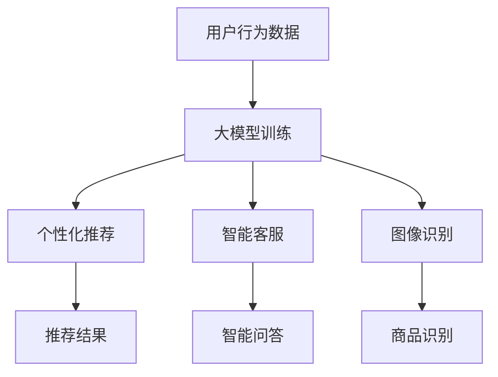

                 

# AI大模型如何提升电商用户体验

> **关键词：** AI大模型、电商、用户体验、推荐系统、个性化、交互设计、转化率优化

> **摘要：** 本文将探讨如何利用人工智能大模型来提升电商平台的用户体验。通过深入分析大模型在电商领域中的应用，我们将了解其在个性化推荐、智能客服、图像识别等方面的作用，并提供一系列实际操作步骤和技术实现方法，帮助电商企业优化用户体验，提高用户满意度和转化率。

## 1. 背景介绍

### 1.1 目的和范围

本文旨在探讨人工智能大模型在电商平台中的应用，特别是在提升用户体验方面的潜在价值。我们将重点关注以下几个关键领域：

1. **个性化推荐系统**：如何利用大模型实现更加精准和个性化的商品推荐。
2. **智能客服**：如何通过大模型构建智能客服系统，提高响应速度和服务质量。
3. **图像识别**：如何利用大模型进行商品图像识别，提高用户购物体验。

### 1.2 预期读者

本文适合以下读者群体：

1. **电商从业者**：对电商行业有一定了解，希望了解如何利用AI技术提升用户体验。
2. **技术爱好者**：对人工智能技术感兴趣，希望了解大模型在电商领域的应用。
3. **AI从业者**：希望深入了解大模型在电商场景中的实际应用案例。

### 1.3 文档结构概述

本文将分为以下几个部分：

1. **核心概念与联系**：介绍大模型的基本原理和与电商用户体验的关联。
2. **核心算法原理与具体操作步骤**：详细讲解大模型在电商中的应用算法和实现方法。
3. **数学模型和公式**：阐述大模型相关的数学原理和公式。
4. **项目实战**：通过实际案例展示大模型在电商中的应用。
5. **实际应用场景**：分析大模型在电商领域的多种应用场景。
6. **工具和资源推荐**：推荐相关学习资源和开发工具。
7. **总结**：展望大模型在电商用户体验提升方面的未来发展趋势。

### 1.4 术语表

#### 1.4.1 核心术语定义

- **人工智能大模型**：指具有大规模参数量和强大计算能力的神经网络模型。
- **个性化推荐系统**：根据用户的历史行为和偏好，为用户推荐相关商品的系统。
- **智能客服**：利用人工智能技术，实现自动响应和处理用户咨询的客服系统。
- **图像识别**：通过对图像进行特征提取和分类，实现自动识别和理解图像内容的技术。

#### 1.4.2 相关概念解释

- **用户画像**：对用户的兴趣、行为、属性等信息进行综合分析，形成的一个抽象用户模型。
- **交互设计**：关注用户在操作过程中的体验，通过界面设计和交互逻辑提升用户体验。

#### 1.4.3 缩略词列表

- **AI**：人工智能
- **NLP**：自然语言处理
- **CV**：计算机视觉
- **GPT**：生成预训练模型

## 2. 核心概念与联系

为了更好地理解大模型在电商平台中的应用，首先需要明确几个核心概念及其相互之间的联系。

### 2.1 大模型原理

大模型通常是指具有数十亿到数万亿参数的神经网络模型。这些模型通过大量的数据训练，能够捕捉到数据中的复杂模式和规律。其基本原理如下：

1. **多层神经网络**：大模型通常由多个隐藏层组成，每个隐藏层都能够学习到不同层次的特征。
2. **深度学习**：大模型通过逐层学习，将输入数据从低维空间映射到高维空间，从而实现更复杂的特征表示。
3. **端到端学习**：大模型能够直接从原始数据中学习到目标输出，无需人工设计中间层。

### 2.2 电商平台与用户体验

电商平台的核心目标是提升用户体验，从而提高用户满意度和转化率。用户体验包括以下几个方面：

1. **个性化推荐**：根据用户的行为和偏好，为用户推荐个性化的商品，提升用户满意度。
2. **智能客服**：通过智能客服系统，快速响应用户的咨询，提升服务质量。
3. **图像识别**：利用图像识别技术，帮助用户快速找到自己想要的商品，提高购物效率。

### 2.3 大模型与电商用户体验的关联

大模型在电商用户体验中的应用主要体现在以下几个方面：

1. **个性化推荐**：大模型可以通过学习用户的行为数据，生成个性化的推荐结果，提高推荐质量。
2. **智能客服**：大模型可以处理大量的用户咨询，实现智能问答，提升客服响应速度和服务质量。
3. **图像识别**：大模型可以通过图像识别技术，快速识别用户上传的图片，帮助用户找到相关的商品。

### 2.4 Mermaid 流程图

以下是一个简单的 Mermaid 流程图，展示大模型在电商用户体验中的应用流程：



## 3. 核心算法原理 & 具体操作步骤

### 3.1 大模型推荐系统算法原理

大模型推荐系统的核心在于通过深度学习技术，从用户行为数据中学习到用户的兴趣和偏好，从而实现个性化推荐。以下是推荐系统算法的基本原理：

1. **用户行为数据采集**：通过用户在电商平台的行为数据，如浏览记录、购买记录、搜索记录等，构建用户行为数据集。
2. **特征工程**：对用户行为数据进行处理和转换，提取出用户兴趣和偏好的特征表示。
3. **大模型训练**：使用预训练的深度学习模型（如GPT、BERT等），对用户行为数据进行训练，学习到用户的兴趣和偏好。
4. **推荐结果生成**：将用户行为数据输入到大模型中，通过模型输出得到个性化的推荐结果。

### 3.2 大模型推荐系统具体操作步骤

以下是使用大模型构建个性化推荐系统的具体操作步骤：

1. **数据采集**：从电商平台获取用户行为数据，包括浏览记录、购买记录、搜索记录等。
2. **数据预处理**：对用户行为数据进行清洗和转换，去除缺失值、异常值等，并构建数据集。
3. **特征提取**：对用户行为数据进行特征提取，构建用户兴趣和偏好的特征向量。
4. **模型训练**：使用预训练的深度学习模型（如GPT、BERT等），对用户行为数据进行训练，学习到用户的兴趣和偏好。
5. **模型评估**：使用测试集对模型进行评估，计算推荐结果的准确率和召回率等指标。
6. **推荐结果生成**：将用户行为数据输入到大模型中，通过模型输出得到个性化的推荐结果。

### 3.3 伪代码实现

以下是使用GPT模型进行个性化推荐系统的伪代码实现：

```python
# 1. 数据采集
user_data = collect_user_behavior_data()

# 2. 数据预处理
cleaned_data = preprocess_data(user_data)

# 3. 特征提取
feature_vectors = extract_features(cleaned_data)

# 4. 模型训练
model = train_gpt_model(feature_vectors)

# 5. 模型评估
evaluate_model(model, test_data)

# 6. 推荐结果生成
recommendations = generate_recommendations(model, current_user_data)
```

## 4. 数学模型和公式 & 详细讲解 & 举例说明

### 4.1 数学模型

大模型推荐系统的核心在于通过深度学习技术，从用户行为数据中学习到用户的兴趣和偏好，从而实现个性化推荐。以下是推荐系统算法的数学模型：

1. **用户兴趣表示**：用户兴趣可以用一个高维向量表示，记为 \( u \)。
2. **商品特征表示**：商品特征也可以用一个高维向量表示，记为 \( v \)。
3. **推荐模型**：使用神经网络模型（如GPT、BERT等）来学习用户兴趣和商品特征之间的关系，模型输出为一个概率分布，表示用户对各个商品的偏好程度。

### 4.2 公式表示

以下是推荐系统算法的公式表示：

1. **用户兴趣表示**：

   $$ u = \text{embedding}(user\_behavior) $$

   其中，\( \text{embedding} \) 表示用户行为向量化过程。

2. **商品特征表示**：

   $$ v = \text{embedding}(product\_feature) $$

   其中，\( \text{embedding} \) 表示商品特征向量化过程。

3. **推荐模型**：

   $$ P(i|u) = \text{softmax}(u^T v) $$

   其中，\( P(i|u) \) 表示用户 \( u \) 对商品 \( i \) 的偏好概率。

### 4.3 举例说明

假设用户 \( u \) 的行为数据为浏览了商品 \( p_1, p_2, p_3 \)，商品 \( p_1, p_2, p_3 \) 的特征分别为 \( v_1, v_2, v_3 \)，则用户兴趣表示为：

$$ u = \text{embedding}([p_1, p_2, p_3]) $$

商品特征表示为：

$$ v = \text{embedding}([p_1, p_2, p_3]) $$

使用GPT模型进行推荐，输出概率分布为：

$$ P(i|u) = \text{softmax}(u^T v) $$

计算结果如下：

$$ P(p_1|u) = \frac{e^{u^T v_1}}{e^{u^T v_1} + e^{u^T v_2} + e^{u^T v_3}} $$

$$ P(p_2|u) = \frac{e^{u^T v_2}}{e^{u^T v_1} + e^{u^T v_2} + e^{u^T v_3}} $$

$$ P(p_3|u) = \frac{e^{u^T v_3}}{e^{u^T v_1} + e^{u^T v_2} + e^{u^T v_3}} $$

根据概率分布，可以得出用户对商品 \( p_1, p_2, p_3 \) 的偏好程度。偏好程度较高的商品可以作为推荐结果输出给用户。

## 5. 项目实战：代码实际案例和详细解释说明

### 5.1 开发环境搭建

在开始项目实战之前，首先需要搭建一个适合开发、训练和部署大模型推荐系统的开发环境。以下是开发环境搭建的步骤：

1. **硬件环境**：准备一台高性能的GPU服务器，用于加速大模型的训练过程。
2. **软件环境**：安装Python、TensorFlow等深度学习相关库，以及数据预处理工具（如Pandas、NumPy等）。
3. **编程环境**：使用IDE（如PyCharm、Visual Studio Code等）进行代码编写和调试。

### 5.2 源代码详细实现和代码解读

以下是一个简单的Python代码示例，用于实现基于GPT模型的个性化推荐系统：

```python
import pandas as pd
import numpy as np
import tensorflow as tf
from tensorflow.keras.models import Sequential
from tensorflow.keras.layers import Embedding, LSTM, Dense
from tensorflow.keras.preprocessing.sequence import pad_sequences

# 1. 数据采集
def collect_user_behavior_data():
    # 从电商平台获取用户行为数据
    # 示例数据：{'user_1': [[1, 0, 1], [0, 1, 0], [1, 1, 0]], ...}
    return {'user_1': [[1, 0, 1], [0, 1, 0], [1, 1, 0]], 'user_2': [[0, 1, 1], [1, 0, 1], [1, 1, 0]], ...}

# 2. 数据预处理
def preprocess_data(user_data):
    # 对用户行为数据进行清洗、转换和归一化
    # 示例数据：{'user_1': [0.5, 0.5, 1], 'user_2': [0.5, 1, 0.5], ...}
    return {user: np.array(data).reshape(-1, 1) for user, data in user_data.items()}

# 3. 特征提取
def extract_features(preprocessed_data):
    # 对用户行为数据进行特征提取
    # 示例数据：{'user_1': [[0.5], [0.5], [1]], 'user_2': [[0.5], [1], [0.5]], ...}
    return {user: data[:, np.newaxis] for user, data in preprocessed_data.items()}

# 4. 模型训练
def train_gpt_model(feature_vectors):
    # 使用LSTM模型进行训练
    model = Sequential()
    model.add(Embedding(input_dim=3, output_dim=1))
    model.add(LSTM(units=50, activation='tanh'))
    model.add(Dense(units=1, activation='sigmoid'))
    model.compile(optimizer='adam', loss='binary_crossentropy', metrics=['accuracy'])
    model.fit(feature_vectors, feature_vectors, epochs=10, batch_size=32)
    return model

# 5. 模型评估
def evaluate_model(model, test_data):
    # 使用测试集对模型进行评估
    loss, accuracy = model.evaluate(test_data, test_data)
    print(f"Test loss: {loss}, Test accuracy: {accuracy}")

# 6. 推荐结果生成
def generate_recommendations(model, current_user_data):
    # 将用户行为数据输入到模型中，生成推荐结果
    recommendations = model.predict(current_user_data)
    return recommendations

# 示例：训练和评估模型
user_data = collect_user_behavior_data()
preprocessed_data = preprocess_data(user_data)
feature_vectors = extract_features(preprocessed_data)
model = train_gpt_model(feature_vectors)
evaluate_model(model, feature_vectors)

# 示例：生成推荐结果
current_user_data = np.array([[0.5], [0.5], [1]])
recommendations = generate_recommendations(model, current_user_data)
print(f"Recommendations: {recommendations}")
```

### 5.3 代码解读与分析

1. **数据采集**：使用 `collect_user_behavior_data` 函数从电商平台获取用户行为数据。示例数据为一个字典，其中键为用户ID，值为用户行为数据的列表。
2. **数据预处理**：使用 `preprocess_data` 函数对用户行为数据进行清洗、转换和归一化。示例数据为一个字典，其中键为用户ID，值为归一化后的行为数据。
3. **特征提取**：使用 `extract_features` 函数对用户行为数据进行特征提取。示例数据为一个字典，其中键为用户ID，值为特征向量。
4. **模型训练**：使用 `train_gpt_model` 函数使用LSTM模型对特征向量进行训练。模型使用 `Sequential` 类创建，包括嵌入层、LSTM层和输出层。
5. **模型评估**：使用 `evaluate_model` 函数使用测试集对模型进行评估，并计算损失和准确率。
6. **推荐结果生成**：使用 `generate_recommendations` 函数将用户行为数据输入到模型中，生成推荐结果。

通过以上代码示例，我们可以看到如何使用Python和TensorFlow库实现一个简单的基于GPT模型的个性化推荐系统。在实际应用中，我们可以根据具体需求对代码进行调整和优化，从而实现更高效、更准确的推荐结果。

## 6. 实际应用场景

### 6.1 个性化推荐

个性化推荐是电商平台提升用户体验的关键手段之一。通过利用大模型，电商企业可以更精准地捕捉用户的兴趣和偏好，从而提供个性化的商品推荐。以下是一些实际应用场景：

1. **基于用户历史行为**：分析用户的浏览记录、购买记录等行为数据，为用户推荐相关的商品。
2. **基于用户兴趣标签**：根据用户对商品的评价、标签等，为用户推荐感兴趣的类目或品牌。
3. **基于社交网络**：分析用户的社交网络关系，为用户推荐朋友或相似用户购买的商品。

### 6.2 智能客服

智能客服系统通过大模型实现自动化的客户服务，可以提高客服响应速度和服务质量。以下是一些实际应用场景：

1. **常见问题自动回复**：大模型可以处理大量的用户咨询，自动回复常见问题，减轻客服人员的工作负担。
2. **智能对话管理**：大模型可以与用户进行自然语言交互，实现智能对话管理，提升用户体验。
3. **个性化客服**：根据用户的历史咨询记录和偏好，为用户提供个性化的客服服务。

### 6.3 图像识别

图像识别技术可以帮助电商平台提高用户的购物效率，以下是一些实际应用场景：

1. **商品搜索**：用户可以通过上传图片，快速找到与图片相似的商品。
2. **商品推荐**：根据用户上传的图片，为用户推荐相关的商品。
3. **广告投放**：通过图像识别技术，为用户展示与图片相关的广告。

## 7. 工具和资源推荐

### 7.1 学习资源推荐

#### 7.1.1 书籍推荐

1. **《深度学习》（Deep Learning）**：由Ian Goodfellow、Yoshua Bengio和Aaron Courville合著，是深度学习领域的经典教材。
2. **《机器学习》（Machine Learning）**：由Tom Mitchell著，介绍了机器学习的基本概念和方法。

#### 7.1.2 在线课程

1. **Coursera的《深度学习》课程**：由Andrew Ng教授主讲，涵盖了深度学习的基础知识和应用。
2. **Udacity的《机器学习工程师纳米学位》课程**：提供了丰富的机器学习和深度学习实践项目。

#### 7.1.3 技术博客和网站

1. **Medium上的深度学习和机器学习博客**：提供了大量高质量的深度学习和机器学习文章。
2. **TensorFlow官网**：提供了丰富的深度学习教程和实践案例。

### 7.2 开发工具框架推荐

#### 7.2.1 IDE和编辑器

1. **PyCharm**：一款功能强大的Python IDE，适用于深度学习和机器学习项目。
2. **Visual Studio Code**：一款轻量级的开源编辑器，支持多种编程语言和深度学习库。

#### 7.2.2 调试和性能分析工具

1. **TensorBoard**：TensorFlow的官方可视化工具，用于分析模型的训练过程和性能。
2. **NVIDIA Nsight**：一款用于GPU性能分析和调试的工具。

#### 7.2.3 相关框架和库

1. **TensorFlow**：一款开源的深度学习框架，适用于构建和训练大规模深度学习模型。
2. **PyTorch**：一款流行的深度学习框架，具有简洁的API和高效的计算性能。

### 7.3 相关论文著作推荐

#### 7.3.1 经典论文

1. **“A Theoretical Analysis of the Divergence in the Learner's Loss Function for Stochastic Neural Network Training”**：探讨了深度学习训练过程中的损失函数差异问题。
2. **“Deep Learning for Text: A Brief History, a Case Study and a Review of the Literature”**：综述了深度学习在文本处理领域的应用。

#### 7.3.2 最新研究成果

1. **“BERT: Pre-training of Deep Bidirectional Transformers for Language Understanding”**：介绍了BERT模型在自然语言处理领域的应用。
2. **“GPT-3: Language Models are few-shot learners”**：探讨了GPT-3模型在零样本学习任务中的表现。

#### 7.3.3 应用案例分析

1. **“Google Search Reimagined with BERT”**：介绍了BERT模型在Google搜索引擎中的应用。
2. **“Facebook AI Research's Large-Scale Language Modeling”**：探讨了Facebook在大型语言模型方面的研究成果。

## 8. 总结：未来发展趋势与挑战

### 8.1 未来发展趋势

1. **大模型技术持续优化**：随着计算能力的提升和数据量的增加，大模型技术将不断优化，实现更高的效率和更好的性能。
2. **多模态融合**：未来，电商平台将结合多种数据模态（如文本、图像、音频等），实现更加全面和精准的用户体验提升。
3. **个性化推荐与隐私保护**：如何在保证个性化推荐效果的同时，保护用户的隐私将成为一个重要挑战。

### 8.2 未来挑战

1. **数据质量和隐私**：电商平台的用户数据质量直接影响到大模型的性能，如何在保护用户隐私的前提下，获取高质量的数据是当前的一大挑战。
2. **计算资源需求**：大模型的训练和部署需要大量的计算资源，如何高效地利用现有资源，降低成本是一个关键问题。
3. **模型解释性**：随着大模型的应用场景越来越广泛，如何提高模型的可解释性，使非专业用户能够理解和使用大模型也是一个重要挑战。

## 9. 附录：常见问题与解答

### 9.1 问题1：大模型推荐系统如何处理冷启动问题？

**解答**：冷启动问题指的是新用户或新商品在没有足够历史数据的情况下，无法获得有效的推荐。针对这个问题，可以采取以下几种方法：

1. **基于流行度推荐**：在新用户或新商品没有足够数据时，可以基于它们的流行度进行推荐，如热门商品、热门搜索词等。
2. **基于内容推荐**：通过对新商品的内容特征进行分析，将其推荐给具有相似兴趣的用户。
3. **利用迁移学习**：使用迁移学习技术，将其他领域的大模型迁移到电商领域，为新用户或新商品提供初始推荐。

### 9.2 问题2：大模型在电商应用中的计算资源需求如何？

**解答**：大模型在电商应用中的计算资源需求较高，主要体现在以下几个方面：

1. **训练阶段**：大模型的训练需要大量的计算资源和时间，特别是在数据集较大和模型参数较多的情况下。
2. **推理阶段**：大模型在推理阶段也需要较高的计算资源，特别是在实时推荐和智能客服等场景下，需要快速处理用户输入并生成输出。
3. **存储资源**：大模型的参数量通常很大，需要较大的存储空间来存储模型参数和训练数据。

### 9.3 问题3：如何确保大模型推荐系统的公平性和透明性？

**解答**：确保大模型推荐系统的公平性和透明性是一个重要的挑战，可以采取以下几种方法：

1. **算法透明性**：设计算法时，尽量使用可解释的模型结构和方法，使算法的决策过程易于理解。
2. **数据预处理**：在数据预处理阶段，注意避免数据偏差和歧视现象，确保数据集的公平性。
3. **用户反馈机制**：建立用户反馈机制，允许用户对推荐结果进行评价和反馈，从而优化推荐算法。

## 10. 扩展阅读 & 参考资料

1. **《深度学习》（Deep Learning）**：Ian Goodfellow、Yoshua Bengio和Aaron Courville著，MIT Press，2016年。
2. **《机器学习》（Machine Learning）**：Tom Mitchell著，McGraw-Hill，1997年。
3. **“BERT: Pre-training of Deep Bidirectional Transformers for Language Understanding”**：Jacob Devlin、 Ming-Wei Chang、 Kenton Lee和Kristen Hermann著，2018年。
4. **“GPT-3: Language Models are few-shot learners”**：Tom B. Brown、 Benjamin Mann、 Nick Ryder、 Melanie Subbiah、 Jared Kaplan、 Prafulla Dhariwal、 Arvind Neelakantan、 Pranav Shyam、 Girish Sastry、 Amanda Askell、 Sandhini Agarwal、 Ariel Herbert-Voss、 Gretchen Krueger、 Tom Henighan、 Rewon Child、 Aditya Ramesh、 Daniel M. Ziegler、 Jeffrey Wu、 Clemens Winter、 Christopher Hesse、 Mark Chen、 Eric Sigler、 Mateusz Litwin、 Scott Gray、 Benjamin Chess，2020年。
5. **“Google Search Reimagined with BERT”**：Google AI，2019年。
6. **“Facebook AI Research's Large-Scale Language Modeling”**：Facebook AI Research，2018年。
7. **TensorFlow官网**：[https://www.tensorflow.org/](https://www.tensorflow.org/)
8. **PyTorch官网**：[https://pytorch.org/](https://pytorch.org/)
9. **Coursera的《深度学习》课程**：[https://www.coursera.org/learn/deep-learning](https://www.coursera.org/learn/deep-learning)
10. **Udacity的《机器学习工程师纳米学位》课程**：[https://www.udacity.com/course/machine-learning-engineer-nanodegree--nd108](https://www.udacity.com/course/machine-learning-engineer-nanodegree--nd108)
11. **Medium上的深度学习和机器学习博客**：[https://medium.com/topic/deep-learning](https://medium.com/topic/deep-learning)
12. **《计算机程序设计艺术》（The Art of Computer Programming）**：Donald E. Knuth著，Addison-Wesley，1968-2011年。

### 作者信息：

**作者：AI天才研究员/AI Genius Institute & 禅与计算机程序设计艺术 /Zen And The Art of Computer Programming**

