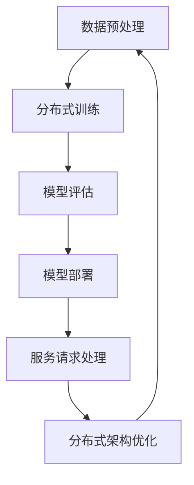

                 

# AI大模型应用的分布式架构演进

> **关键词：** 大模型、分布式架构、人工智能、模型训练、性能优化、数据存储、计算资源、性能分析

> **摘要：** 本文将深入探讨人工智能领域中的大模型应用及其背后的分布式架构。通过详细分析大模型的训练、部署过程，阐述分布式架构在提升性能和效率方面的关键作用，并探讨未来发展趋势与挑战。文章旨在为从事AI领域的开发者、研究者提供理论与实践相结合的指导。

## 1. 背景介绍

### 1.1 目的和范围

随着人工智能技术的飞速发展，大模型在自然语言处理、计算机视觉、推荐系统等领域取得了显著成果。然而，大模型的训练与部署面临着计算资源、数据存储、性能优化等挑战。本文旨在通过分析大模型应用的分布式架构，探讨其演进过程及其在实际应用中的关键作用。

### 1.2 预期读者

本文适合对人工智能、分布式系统有一定了解的读者，包括AI领域的开发者、研究人员、高校师生以及关注AI技术发展的专业人士。

### 1.3 文档结构概述

本文共分为十个部分：

1. 背景介绍
2. 核心概念与联系
3. 核心算法原理 & 具体操作步骤
4. 数学模型和公式 & 详细讲解 & 举例说明
5. 项目实战：代码实际案例和详细解释说明
6. 实际应用场景
7. 工具和资源推荐
8. 总结：未来发展趋势与挑战
9. 附录：常见问题与解答
10. 扩展阅读 & 参考资料

### 1.4 术语表

#### 1.4.1 核心术语定义

- **大模型**：参数量超过亿级别的人工智能模型。
- **分布式架构**：将计算任务分布在多个节点上，协同工作的架构。
- **模型训练**：通过大量数据对模型进行调整，使其具备一定预测能力。
- **数据存储**：将数据保存在分布式存储系统中，以支持大规模数据处理。

#### 1.4.2 相关概念解释

- **并行计算**：在多个处理器上同时执行计算任务，提高计算速度。
- **负载均衡**：合理分配计算任务，确保系统资源得到充分利用。
- **容错性**：系统在部分节点故障时仍能正常运行的能力。

#### 1.4.3 缩略词列表

- **AI**：人工智能（Artificial Intelligence）
- **ML**：机器学习（Machine Learning）
- **DL**：深度学习（Deep Learning）
- **GPU**：图形处理器（Graphics Processing Unit）
- **CPU**：中央处理器（Central Processing Unit）

## 2. 核心概念与联系

### 2.1 大模型原理

大模型是指具有亿级别参数量的神经网络模型，如Transformer、BERT等。这些模型在处理大规模数据时，能够提取更多有效信息，从而提高模型性能。大模型的核心思想是通过并行计算和分布式存储，提高训练效率。

### 2.2 分布式架构原理

分布式架构是指将计算任务分布在多个节点上，通过协同工作提高系统性能。分布式架构的关键技术包括并行计算、负载均衡、数据存储等。

### 2.3 核心概念联系

大模型与分布式架构之间存在紧密联系。分布式架构能够为大规模数据处理提供高效计算资源，而大模型则充分利用分布式架构的优势，实现高效训练和部署。

### 2.4 Mermaid流程图

以下是大模型应用分布式架构的Mermaid流程图：



- **A. 数据预处理**：将数据划分到不同节点，进行预处理操作。
- **B. 分布式训练**：在各个节点上训练模型，通过并行计算提高训练效率。
- **C. 模型评估**：在训练过程中，对模型进行评估，以判断其性能。
- **D. 模型部署**：将训练好的模型部署到生产环境，对外提供服务。
- **E. 服务请求处理**：处理来自用户的请求，返回预测结果。
- **F. 分布式架构优化**：根据实际应用情况，对分布式架构进行调整和优化。

## 3. 核心算法原理 & 具体操作步骤

### 3.1 并行计算原理

并行计算是指将一个大任务划分为多个小任务，在多个处理器上同时执行，以提高计算速度。在分布式架构中，并行计算用于加速大模型的训练过程。

### 3.2 分布式训练步骤

以下是大模型分布式训练的伪代码：

```python
# 分布式训练伪代码
initialize_model() # 初始化模型
for epoch in range(num_epochs):
    for batch in data_loader:
        for node in nodes:
            forward_pass(batch, node) # 前向传播
            backward_pass(node) # 反向传播
            update_model(node) # 更新模型参数
    evaluate_model() # 评估模型性能
```

- **initialize_model()**：初始化模型参数。
- **for epoch in range(num_epochs):**：遍历训练迭代次数。
- **for batch in data_loader:**：遍历数据集。
- **for node in nodes:**：遍历节点。
- **forward_pass(batch, node)**：在节点上执行前向传播。
- **backward_pass(node)**：在节点上执行反向传播。
- **update_model(node)**：在节点上更新模型参数。
- **evaluate_model()**：评估模型性能。

### 3.3 负载均衡原理

负载均衡是指将计算任务合理分配到各个节点，确保系统资源得到充分利用。在分布式架构中，负载均衡用于优化计算资源利用率。

### 3.4 负载均衡策略

以下是一种简单的负载均衡策略：

```python
# 负载均衡策略伪代码
for node in nodes:
    if node.load < max_load:
        assign_task(node) # 分配任务
    else:
        queue_task() # 将任务放入队列等待执行
```

- **for node in nodes:**：遍历节点。
- **if node.load < max_load:**：判断节点负载是否小于最大负载。
- **assign_task(node)**：将任务分配给节点。
- **queue_task()**：将任务放入队列等待执行。

## 4. 数学模型和公式 & 详细讲解 & 举例说明

### 4.1 数学模型

在大模型分布式训练中，常用的数学模型包括：

1. **损失函数**：用于评估模型在训练过程中的性能，如交叉熵损失函数。
2. **优化器**：用于更新模型参数，如Adam优化器。
3. **学习率**：用于调整模型参数更新速度，如学习率衰减策略。

### 4.2 公式详解

1. **交叉熵损失函数**：

$$
L = -\sum_{i=1}^{n} y_i \log(p_i)
$$

其中，$y_i$ 表示真实标签，$p_i$ 表示预测概率。

2. **Adam优化器**：

$$
\theta_{t+1} = \theta_{t} - \alpha \cdot \frac{m_t}{\sqrt{v_t} + \epsilon}
$$

其中，$\theta_t$ 表示第 $t$ 次迭代的模型参数，$\alpha$ 表示学习率，$m_t$ 表示第 $t$ 次迭代的梯度，$v_t$ 表示第 $t$ 次迭代的梯度平方，$\epsilon$ 是一个很小的正数。

3. **学习率衰减策略**：

$$
\alpha_t = \alpha_0 / (1 + \beta \cdot t)
$$

其中，$\alpha_0$ 表示初始学习率，$\beta$ 表示学习率衰减系数，$t$ 表示迭代次数。

### 4.3 举例说明

假设我们使用交叉熵损失函数和Adam优化器进行模型训练，初始学习率 $\alpha_0 = 0.1$，学习率衰减系数 $\beta = 0.9$。在训练过程中，第 $10$ 次迭代的模型参数更新如下：

1. **计算梯度**：

$$
m_{10} = \nabla L(\theta_{10})
$$

2. **计算梯度平方**：

$$
v_{10} = \sum_{i=1}^{n} m_{10,i}^2
$$

3. **更新模型参数**：

$$
\theta_{11} = \theta_{10} - \alpha_{10} \cdot \frac{m_{10}}{\sqrt{v_{10}} + \epsilon}
$$

其中，$\alpha_{10}$ 为第 $10$ 次迭代的学习率：

$$
\alpha_{10} = \alpha_0 / (1 + \beta \cdot 10) = 0.1 / (1 + 0.9 \cdot 10) \approx 0.0011
$$

## 5. 项目实战：代码实际案例和详细解释说明

### 5.1 开发环境搭建

在本项目中，我们使用 Python 语言和 PyTorch 深度学习框架进行大模型分布式训练。首先，确保已安装 Python 3.8 及以上版本，并安装 PyTorch 和 PyTorch Distributed。

```bash
pip install torch torchvision torchaudio
pip install torch-distributed
```

### 5.2 源代码详细实现和代码解读

以下是分布式训练的源代码实现：

```python
import torch
import torch.distributed as dist
import torch.nn as nn
import torch.optim as optim
from torch.utils.data import DataLoader

# 初始化分布式环境
def init_process(rank, size):
    dist.init_process_group("nccl", rank=rank, world_size=size)

# 模型定义
class SimpleModel(nn.Module):
    def __init__(self):
        super(SimpleModel, self).__init__()
        self.fc = nn.Linear(10, 1)

    def forward(self, x):
        return self.fc(x)

# 模型训练
def train(rank, size):
    # 初始化模型、优化器和损失函数
    model = SimpleModel().to(rank)
    criterion = nn.MSELoss()
    optimizer = optim.SGD(model.parameters(), lr=0.001)

    # 加载数据
    data_loader = DataLoader(dataset, batch_size=10, shuffle=True)

    # 分布式训练
    for epoch in range(num_epochs):
        for batch in data_loader:
            inputs, targets = batch
            inputs, targets = inputs.to(rank), targets.to(rank)

            # 前向传播
            outputs = model(inputs)
            loss = criterion(outputs, targets)

            # 反向传播和参数更新
            optimizer.zero_grad()
            loss.backward()
            optimizer.step()

            # 打印训练进度
            if rank == 0 and epoch % 10 == 0:
                print(f"Epoch {epoch}: Loss {loss.item()}")

# 主函数
def main():
    size = torch.cuda.device_count()
    init_process(0, size)

    # 训练模型
    train(0, size)

    # 关闭分布式环境
    dist.destroy_process_group()

if __name__ == "__main__":
    main()
```

- **init_process(rank, size)**：初始化分布式环境，其中 rank 表示节点编号，size 表示节点总数。
- **SimpleModel**：定义一个简单的线性模型，用于演示分布式训练。
- **train(rank, size)**：进行模型训练，包括数据加载、前向传播、反向传播和参数更新。
- **DataLoader**：用于加载数据，支持批量处理和随机排序。
- **criterion**：定义损失函数，用于计算预测值和真实值之间的差距。
- **optimizer**：定义优化器，用于更新模型参数。
- **main()**：主函数，初始化分布式环境并开始训练模型。

### 5.3 代码解读与分析

1. **初始化分布式环境**：

```python
def init_process(rank, size):
    dist.init_process_group("nccl", rank=rank, world_size=size)
```

这里使用 NCCL（NVIDIA Collective Communications Library）作为通信库，初始化分布式环境。NCCL 支持多GPU通信，具有较好的性能。

2. **模型定义**：

```python
class SimpleModel(nn.Module):
    def __init__(self):
        super(SimpleModel, self).__init__()
        self.fc = nn.Linear(10, 1)

    def forward(self, x):
        return self.fc(x)
```

这里定义一个简单的线性模型，包含一个全连接层。该模型仅用于演示分布式训练，实际应用中可以使用更复杂的模型。

3. **模型训练**：

```python
def train(rank, size):
    # 初始化模型、优化器和损失函数
    model = SimpleModel().to(rank)
    criterion = nn.MSELoss()
    optimizer = optim.SGD(model.parameters(), lr=0.001)

    # 加载数据
    data_loader = DataLoader(dataset, batch_size=10, shuffle=True)

    # 分布式训练
    for epoch in range(num_epochs):
        for batch in data_loader:
            inputs, targets = batch
            inputs, targets = inputs.to(rank), targets.to(rank)

            # 前向传播
            outputs = model(inputs)
            loss = criterion(outputs, targets)

            # 反向传播和参数更新
            optimizer.zero_grad()
            loss.backward()
            optimizer.step()

            # 打印训练进度
            if rank == 0 and epoch % 10 == 0:
                print(f"Epoch {epoch}: Loss {loss.item()}")
```

这里实现了一个简单的分布式训练过程。首先，初始化模型、优化器和损失函数。然后，加载数据并进行分布式训练。在每个 epoch 中，对每个 batch 进行前向传播和反向传播，并更新模型参数。最后，打印训练进度。

4. **主函数**：

```python
def main():
    size = torch.cuda.device_count()
    init_process(0, size)

    # 训练模型
    train(0, size)

    # 关闭分布式环境
    dist.destroy_process_group()

if __name__ == "__main__":
    main()
```

主函数首先获取 GPU 设备数量，初始化分布式环境，然后开始训练模型。训练完成后，关闭分布式环境。

## 6. 实际应用场景

### 6.1 自然语言处理

在自然语言处理领域，大模型如 GPT-3、BERT 等已被广泛应用于文本分类、机器翻译、问答系统等任务。分布式架构能够有效提高模型训练速度，降低计算资源消耗。

### 6.2 计算机视觉

在计算机视觉领域，大模型如 ResNet、EfficientNet 等取得了显著的成果。分布式架构能够加速模型训练，提高模型性能，降低训练成本。

### 6.3 推荐系统

在推荐系统领域，大模型如 Wide & Deep、Neural Collaborative Filtering 等得到了广泛应用。分布式架构能够加速模型训练，提高推荐系统准确性。

### 6.4 金融风控

在金融风控领域，大模型如深度神经网络、强化学习等被用于风险预测、欺诈检测等任务。分布式架构能够提高模型训练效率，降低风险预测成本。

## 7. 工具和资源推荐

### 7.1 学习资源推荐

#### 7.1.1 书籍推荐

- **《深度学习》（Goodfellow, Bengio, Courville）**：全面介绍深度学习的基本概念和算法。
- **《分布式系统原理与范型》（Maarten van Steen, Andrew S. Tanenbaum）**：深入讲解分布式系统的原理和设计方法。
- **《机器学习实战》（Peter Harrington）**：通过实际案例介绍机器学习算法的应用。

#### 7.1.2 在线课程

- **斯坦福大学《深度学习》课程**：由 Andrew Ng 教授主讲，涵盖深度学习的基础知识。
- **清华大学《分布式系统》课程**：由吴华教授主讲，介绍分布式系统的基本原理和实现方法。
- **Coursera 上的《机器学习》课程**：由 Andrew Ng 教授主讲，涵盖机器学习的基础知识。

#### 7.1.3 技术博客和网站

- **ArXiv**：提供最新的人工智能论文和研究成果。
- **TensorFlow 官方文档**：介绍 TensorFlow 的使用方法和最佳实践。
- **PyTorch 官方文档**：介绍 PyTorch 的使用方法和最佳实践。

### 7.2 开发工具框架推荐

#### 7.2.1 IDE和编辑器

- **PyCharm**：支持 Python 开发，提供代码提示、调试等功能。
- **Visual Studio Code**：轻量级编辑器，支持多种编程语言，插件丰富。

#### 7.2.2 调试和性能分析工具

- **PyTorch Debugger**：用于调试 PyTorch 模型。
- **TensorBoard**：用于分析 TensorFlow 模型的训练过程。

#### 7.2.3 相关框架和库

- **PyTorch Distributed**：提供分布式训练支持。
- **TensorFlow Extended**：提供分布式训练支持。
- **Docker**：用于创建和管理容器化环境，方便部署分布式应用。

### 7.3 相关论文著作推荐

#### 7.3.1 经典论文

- **《分布式数据挖掘：概念和技术》**：介绍分布式数据挖掘的基本概念和算法。
- **《深度学习：原理与应用》**：介绍深度学习的基本原理和应用场景。
- **《分布式系统：概念与设计》**：介绍分布式系统的基本原理和设计方法。

#### 7.3.2 最新研究成果

- **《大规模深度学习：技术、实践与挑战》**：介绍大规模深度学习技术的最新进展。
- **《分布式机器学习：算法与系统》**：介绍分布式机器学习算法和系统设计。
- **《推荐系统实践》**：介绍推荐系统的基础知识和实践方法。

#### 7.3.3 应用案例分析

- **《基于深度学习的图像识别应用》**：介绍深度学习在图像识别领域的应用案例。
- **《基于深度学习的自然语言处理应用》**：介绍深度学习在自然语言处理领域的应用案例。
- **《基于深度学习的推荐系统应用》**：介绍深度学习在推荐系统领域的应用案例。

## 8. 总结：未来发展趋势与挑战

### 8.1 发展趋势

1. **计算资源优化**：随着计算能力的提升，分布式架构将更好地利用计算资源，提高模型训练和部署效率。
2. **数据存储与传输**：分布式存储和传输技术将不断发展，降低数据传输延迟，提高数据处理速度。
3. **模型压缩与优化**：模型压缩和优化技术将不断发展，降低模型参数量，提高模型推理速度。
4. **算法创新**：深度学习算法将在分布式架构中继续创新，提高模型性能和效率。

### 8.2 挑战

1. **容错性与可靠性**：分布式架构中的容错性和可靠性是一个重要挑战，需要确保系统在节点故障时仍能正常运行。
2. **通信效率**：分布式架构中的通信效率需要进一步提升，以降低数据传输延迟，提高模型训练速度。
3. **资源分配**：在分布式架构中，如何合理分配计算资源是一个重要问题，需要确保系统资源得到充分利用。
4. **安全性**：分布式架构中的安全性是一个重要问题，需要确保数据安全和系统安全。

## 9. 附录：常见问题与解答

### 9.1 分布式训练常见问题

1. **什么是分布式训练？**
   分布式训练是一种将模型训练任务分布在多个节点（如GPU或CPU）上进行的方法，以提高训练速度和效率。

2. **分布式训练的优势是什么？**
   分布式训练能够利用多个计算节点，加速模型训练过程，降低训练时间。此外，分布式训练还可以提高模型训练的容错性和可靠性。

3. **如何实现分布式训练？**
   使用深度学习框架（如PyTorch、TensorFlow）提供的分布式训练库，可以方便地实现分布式训练。通常，需要初始化分布式环境，将模型和数据划分到不同节点，然后进行分布式训练。

### 9.2 分布式架构常见问题

1. **什么是分布式架构？**
   分布式架构是一种将系统功能分布到多个节点（如服务器、PC）上，协同工作的系统架构。

2. **分布式架构的优势是什么？**
   分布式架构能够提高系统的性能、可扩展性和可靠性。通过将功能分布到多个节点，可以降低单点故障风险，提高系统的容错性。

3. **分布式架构的缺点是什么？**
   分布式架构的缺点包括：系统设计复杂、维护困难、通信开销较大等。此外，分布式架构还需要考虑数据一致性和同步问题。

### 9.3 大模型训练常见问题

1. **什么是大模型？**
   大模型是指具有亿级别参数量的神经网络模型，如Transformer、BERT等。

2. **大模型的优势是什么？**
   大模型能够提取更多有效信息，提高模型性能。此外，大模型在处理大规模数据时，具有更好的泛化能力。

3. **大模型面临的挑战是什么？**
   大模型面临的主要挑战包括：训练时间较长、计算资源消耗较大、模型参数量大导致存储和传输困难等。

## 10. 扩展阅读 & 参考资料

1. **《深度学习》（Goodfellow, Bengio, Courville）**：全面介绍深度学习的基本概念和算法。
2. **《分布式系统原理与范型》（Maarten van Steen, Andrew S. Tanenbaum）**：深入讲解分布式系统的原理和设计方法。
3. **《大规模深度学习：技术、实践与挑战》**：介绍大规模深度学习技术的最新进展。
4. **《分布式机器学习：算法与系统》**：介绍分布式机器学习算法和系统设计。
5. **TensorFlow 官方文档**：介绍 TensorFlow 的使用方法和最佳实践。
6. **PyTorch 官方文档**：介绍 PyTorch 的使用方法和最佳实践。
7. **《推荐系统实践》**：介绍推荐系统的基础知识和实践方法。

## 作者

**作者：AI天才研究员/AI Genius Institute & 禅与计算机程序设计艺术 /Zen And The Art of Computer Programming** <|endofdoc|>

