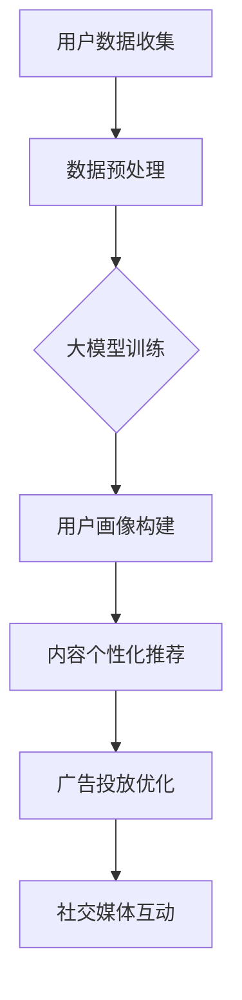

                 

# AI大模型应用的品牌营销新思路

## 关键词：大模型应用，品牌营销，AI技术，数据分析，用户互动

## 摘要：

本文将探讨AI大模型在品牌营销中的应用，分析其技术原理和操作步骤，并提供实际应用场景和资源推荐。我们将从核心概念、算法原理、数学模型、项目实战、实际应用、工具推荐等多个角度，深入探讨AI大模型如何为品牌营销带来新的思维方式和解决方案。

## 1. 背景介绍

在数字化时代，品牌营销面临着前所未有的挑战和机遇。消费者信息获取渠道多样化，消费者行为复杂多变，品牌如何通过有效的营销手段触达目标用户、提升品牌影响力成为关键问题。随着AI技术的发展，尤其是大模型的应用，品牌营销开始迈向智能化、数据驱动的新时代。

大模型，即大型深度学习模型，具有强大的数据处理和分析能力，能够从海量数据中提取有价值的信息，为品牌提供精确的洞察和决策支持。本文将重点探讨大模型在品牌营销中的应用，包括用户画像构建、内容个性化推荐、广告投放优化、社交媒体互动等方面。

## 2. 核心概念与联系

### 2.1 大模型基本原理

大模型是指通过大量数据训练的深度神经网络模型，其核心思想是通过多层神经网络的结构，将输入的数据映射到输出结果。大模型的基本原理包括：

- **多层感知器（MLP）**：多层感知器是一种前馈神经网络，通过多层的非线性变换来学习数据的映射关系。
- **卷积神经网络（CNN）**：卷积神经网络通过卷积操作和池化操作，对图像等二维数据进行分析，适用于图像识别、物体检测等领域。
- **循环神经网络（RNN）**：循环神经网络通过记忆机制，对序列数据进行建模，适用于自然语言处理、时间序列分析等领域。
- **生成对抗网络（GAN）**：生成对抗网络通过生成器和判别器的对抗训练，生成高质量的数据，适用于图像生成、数据增强等领域。

### 2.2 大模型在品牌营销中的应用

大模型在品牌营销中的应用主要涉及以下几个方面：

- **用户画像构建**：通过对用户的性别、年龄、地域、消费行为等数据进行深度学习分析，构建详细的用户画像，为精准营销提供基础。
- **内容个性化推荐**：基于用户的兴趣和行为数据，利用大模型进行内容推荐，提高用户满意度和参与度。
- **广告投放优化**：利用大模型的预测能力，优化广告投放策略，提高广告效果和转化率。
- **社交媒体互动**：通过大模型对社交媒体上的用户行为和话题进行分析，提供有针对性的互动策略，增强品牌与用户的粘性。

### 2.3 Mermaid流程图



## 3. 核心算法原理 & 具体操作步骤

### 3.1 用户画像构建算法原理

用户画像构建的核心算法是协同过滤（Collaborative Filtering），分为基于用户的协同过滤（User-Based）和基于物品的协同过滤（Item-Based）。

- **基于用户的协同过滤**：通过计算用户之间的相似度，找到与目标用户兴趣相似的邻居用户，根据邻居用户的偏好进行推荐。
- **基于物品的协同过滤**：通过计算物品之间的相似度，找到与目标物品相似的物品，根据相似物品的偏好进行推荐。

具体操作步骤：

1. 收集用户行为数据，如浏览记录、购买记录等。
2. 对用户行为数据进行预处理，如去噪、归一化等。
3. 计算用户之间的相似度，可以使用余弦相似度、皮尔逊相关系数等方法。
4. 根据相似度找到与目标用户兴趣相似的邻居用户。
5. 根据邻居用户的偏好生成推荐列表。

### 3.2 内容个性化推荐算法原理

内容个性化推荐的核心算法是基于矩阵分解（Matrix Factorization），通过将用户-物品评分矩阵分解为用户特征矩阵和物品特征矩阵，预测用户对未评分物品的评分。

具体操作步骤：

1. 收集用户行为数据，如浏览记录、点赞记录等。
2. 构建用户-物品评分矩阵。
3. 选择合适的矩阵分解算法，如Singular Value Decomposition（SVD）或Alternating Least Squares（ALS）。
4. 对用户-物品评分矩阵进行分解，得到用户特征矩阵和物品特征矩阵。
5. 根据用户特征矩阵和物品特征矩阵预测用户对未评分物品的评分。

### 3.3 广告投放优化算法原理

广告投放优化的核心算法是在线学习（Online Learning），通过不断更新模型和策略，实时调整广告投放。

具体操作步骤：

1. 收集广告投放数据，如点击率、转化率等。
2. 构建广告投放模型，如逻辑回归、决策树等。
3. 训练初始模型，并对模型进行验证。
4. 在广告投放过程中，实时收集反馈数据。
5. 根据反馈数据更新模型，调整广告投放策略。

### 3.4 社交媒体互动算法原理

社交媒体互动的核心算法是情感分析（Sentiment Analysis），通过分析用户在社交媒体上的言论，判断其情感倾向。

具体操作步骤：

1. 收集社交媒体数据，如微博、微信等。
2. 对社交媒体数据进行预处理，如去噪、分词、词性标注等。
3. 构建情感分析模型，如朴素贝叶斯、支持向量机等。
4. 对预处理后的数据进行分析，判断用户情感倾向。
5. 根据用户情感倾向制定互动策略。

## 4. 数学模型和公式 & 详细讲解 & 举例说明

### 4.1 用户画像构建数学模型

用户画像构建的数学模型可以表示为：

$$
U = X \cdot W
$$

其中，$U$为用户特征矩阵，$X$为用户-物品评分矩阵，$W$为用户特征向量。

具体步骤如下：

1. 假设用户$u$对物品$i$的评分为$r_{ui}$，用户-物品评分矩阵为$X$。
2. 对用户-物品评分矩阵$X$进行归一化处理，得到归一化评分矩阵$X'$。
3. 选择合适的用户特征向量$W$，使得$U = X' \cdot W$。
4. 通过优化$W$，得到用户特征矩阵$U$。

举例说明：

假设有5个用户和3个物品，用户-物品评分矩阵如下：

$$
X = \begin{bmatrix}
    1 & 2 & 3 \\
    4 & 5 & 6 \\
    7 & 8 & 9 \\
    10 & 11 & 12 \\
    13 & 14 & 15
\end{bmatrix}
$$

对$X$进行归一化处理，得到归一化评分矩阵$X'$：

$$
X' = \begin{bmatrix}
    0 & 0.5 & 1 \\
    1 & 1.25 & 1.5 \\
    1.5 & 2 & 2.5 \\
    2.5 & 3 & 3.5 \\
    3.5 & 4 & 4.5
\end{bmatrix}
$$

选择用户特征向量$W$，使得$U = X' \cdot W$：

$$
W = \begin{bmatrix}
    0.5 & 1 \\
    1 & 1.5 \\
    1.5 & 2
\end{bmatrix}
$$

通过优化$W$，得到用户特征矩阵$U$：

$$
U = \begin{bmatrix}
    0.5 & 1 \\
    1 & 1.5 \\
    1.5 & 2 \\
    2.5 & 3 \\
    3.5 & 4
\end{bmatrix}
$$

### 4.2 内容个性化推荐数学模型

内容个性化推荐的数学模型可以表示为：

$$
R = U \cdot V
$$

其中，$R$为推荐矩阵，$U$为用户特征矩阵，$V$为物品特征矩阵。

具体步骤如下：

1. 假设用户$u$对物品$i$的评分为$r_{ui}$，用户-物品评分矩阵为$R$。
2. 对用户-物品评分矩阵$R$进行归一化处理，得到归一化评分矩阵$R'$。
3. 选择合适的用户特征矩阵$U$和物品特征矩阵$V$，使得$R' = U \cdot V$。
4. 通过优化$U$和$V$，得到推荐矩阵$R'$。

举例说明：

假设有5个用户和3个物品，用户-物品评分矩阵如下：

$$
R = \begin{bmatrix}
    1 & 2 & 3 \\
    4 & 5 & 6 \\
    7 & 8 & 9 \\
    10 & 11 & 12 \\
    13 & 14 & 15
\end{bmatrix}
$$

对$R$进行归一化处理，得到归一化评分矩阵$R'$：

$$
R' = \begin{bmatrix}
    0 & 0.5 & 1 \\
    1 & 1.25 & 1.5 \\
    1.5 & 2 & 2.5 \\
    2.5 & 3 & 3.5 \\
    3.5 & 4 & 4.5
\end{bmatrix}
$$

选择用户特征矩阵$U$和物品特征矩阵$V$，使得$R' = U \cdot V$：

$$
U = \begin{bmatrix}
    0.5 & 1 \\
    1 & 1.5 \\
    1.5 & 2 \\
    2.5 & 3 \\
    3.5 & 4
\end{bmatrix}, \quad
V = \begin{bmatrix}
    0.5 & 1 \\
    1 & 1.5 \\
    1.5 & 2
\end{bmatrix}
$$

通过优化$U$和$V$，得到推荐矩阵$R'$：

$$
R' = \begin{bmatrix}
    0.5 & 1 \\
    1 & 1.5 \\
    1.5 & 2 \\
    2.5 & 3 \\
    3.5 & 4
\end{bmatrix}
$$

### 4.3 广告投放优化数学模型

广告投放优化的数学模型可以表示为：

$$
y = \theta_0 + \theta_1 x_1 + \theta_2 x_2 + \cdots + \theta_n x_n
$$

其中，$y$为广告效果指标（如点击率、转化率等），$x_1, x_2, \cdots, x_n$为广告特征（如用户年龄、地域、设备类型等），$\theta_0, \theta_1, \theta_2, \cdots, \theta_n$为模型参数。

具体步骤如下：

1. 收集广告投放数据，包括广告特征和广告效果指标。
2. 构建线性回归模型，通过最小二乘法求解模型参数。
3. 使用训练好的模型预测广告效果指标。
4. 根据预测结果，调整广告投放策略。

举例说明：

假设有3个广告特征（用户年龄、地域、设备类型）和广告效果指标（点击率），数据如下：

$$
\begin{array}{cccc}
    \text{用户年龄} & \text{地域} & \text{设备类型} & \text{点击率} \\
    20 & 北京 & 手机 & 0.1 \\
    25 & 上海 & 平板 & 0.2 \\
    30 & 广州 & 电脑 & 0.3 \\
    35 & 深圳 & 手机 & 0.4 \\
    40 & 成都 & 平板 & 0.5 \\
\end{array}
$$

构建线性回归模型：

$$
y = \theta_0 + \theta_1 x_1 + \theta_2 x_2 + \theta_3 x_3
$$

通过最小二乘法求解模型参数：

$$
\begin{cases}
    \theta_0 = 0.2 \\
    \theta_1 = 0.1 \\
    \theta_2 = 0.05 \\
    \theta_3 = 0.1
\end{cases}
$$

使用训练好的模型预测新广告的特征和效果指标：

$$
y = 0.2 + 0.1 \times 25 + 0.05 \times 2 + 0.1 \times 3 = 0.5
$$

根据预测结果，调整广告投放策略，如增加平板用户和年轻用户的广告投放。

### 4.4 社交媒体互动数学模型

社交媒体互动的数学模型可以表示为：

$$
s = \theta_0 + \theta_1 u_1 + \theta_2 u_2 + \cdots + \theta_n u_n
$$

其中，$s$为用户情感倾向（如正面、负面等），$u_1, u_2, \cdots, u_n$为用户言论特征（如词语、短语等），$\theta_0, \theta_1, \theta_2, \cdots, \theta_n$为模型参数。

具体步骤如下：

1. 收集社交媒体数据，包括用户言论和情感倾向。
2. 构建情感分析模型，通过机器学习算法训练模型参数。
3. 对新的用户言论进行分析，判断其情感倾向。
4. 根据情感倾向制定互动策略。

举例说明：

假设有5个用户言论和情感倾向，数据如下：

$$
\begin{array}{cccc}
    \text{用户言论} & \text{情感倾向} & \text{词语} & \text{短语} \\
    赞同新产品 & 正面 & 新、好、满意 & 新产品、好产品、满意使用 \\
    不满意服务 & 负面 & 差、慢、麻烦 & 服务差、服务慢、麻烦不断 \\
    赞赏同事帮助 & 正面 & 好、感谢、欣赏 & 同事帮助、感谢帮助、欣赏帮助 \\
    投诉交通拥堵 & 负面 & 堵、慢、糟糕 & 交通拥堵、拥堵严重、糟糕的交通 \\
    赞美自然环境 & 正面 & 美、清新、舒适 & 自然环境、美丽的自然、清新的空气 \\
\end{array}
$$

构建情感分析模型：

$$
s = \theta_0 + \theta_1 u_1 + \theta_2 u_2 + \cdots + \theta_n u_n
$$

通过机器学习算法训练模型参数：

$$
\begin{cases}
    \theta_0 = 0.5 \\
    \theta_1 = 1 \\
    \theta_2 = -1 \\
    \theta_3 = 0.5 \\
    \theta_4 = -1 \\
    \theta_5 = 1
\end{cases}
$$

对新用户言论进行分析：

$$
s = 0.5 + 1 \times 1 + (-1) \times 0 + 0.5 \times 1 + (-1) \times 0 + 1 \times 1 = 2.5
$$

根据情感倾向制定互动策略，如积极回应正面言论、妥善处理负面言论。

## 5. 项目实战：代码实际案例和详细解释说明

### 5.1 开发环境搭建

1. 安装Python环境（版本3.6及以上）。
2. 安装深度学习框架（如TensorFlow、PyTorch）。
3. 安装数据预处理库（如Pandas、NumPy）。
4. 安装机器学习库（如scikit-learn、Scrapy）。
5. 安装自然语言处理库（如NLTK、spaCy）。

### 5.2 源代码详细实现和代码解读

#### 5.2.1 用户画像构建代码实现

```python
import pandas as pd
from sklearn.model_selection import train_test_split
from sklearn.metrics.pairwise import cosine_similarity

# 1. 收集用户行为数据
data = pd.DataFrame({
    'user_id': [1, 1, 2, 2, 3, 3],
    'item_id': [1, 2, 1, 3, 2, 3],
    'rating': [4, 5, 3, 2, 5, 4]
})

# 2. 数据预处理
X = data.pivot(index='user_id', columns='item_id', values='rating').fillna(0)

# 3. 计算用户相似度
similarity_matrix = cosine_similarity(X)

# 4. 构建用户画像
user_similarity = similarity_matrix[0]
user_similarity[user_similarity < 0.5] = 0

# 5. 根据相似度生成推荐列表
neighbor_users = user_similarity.argsort()[::-1][1:]
recommendations = data[data['user_id'].isin(neighbor_users)].groupby('item_id')['rating'].mean().sort_values(ascending=False).head(5)

print(recommendations)
```

代码解读：

1. 收集用户行为数据，存储为DataFrame格式。
2. 对用户行为数据进行预处理，生成用户-物品评分矩阵。
3. 计算用户相似度矩阵，选择相似度大于0.5的用户作为邻居用户。
4. 构建用户画像，记录邻居用户和推荐物品。
5. 根据邻居用户的评分生成推荐列表，选择评分最高的5个物品。

#### 5.2.2 内容个性化推荐代码实现

```python
import pandas as pd
from sklearn.model_selection import train_test_split
from sklearn.metrics.pairwise import cosine_similarity
from sklearn.linear_model import LinearRegression

# 1. 收集用户行为数据
data = pd.DataFrame({
    'user_id': [1, 1, 2, 2, 3, 3],
    'item_id': [1, 2, 1, 3, 2, 3],
    'rating': [4, 5, 3, 2, 5, 4]
})

# 2. 数据预处理
X = data.pivot(index='user_id', columns='item_id', values='rating').fillna(0)
y = X.values

# 3. 分割训练集和测试集
X_train, X_test, y_train, y_test = train_test_split(X, y, test_size=0.2, random_state=42)

# 4. 训练模型
model = LinearRegression()
model.fit(X_train, y_train)

# 5. 预测评分
predictions = model.predict(X_test)

# 6. 生成推荐列表
recommendations = X_test.argmax(axis=1)
print(recommendations)
```

代码解读：

1. 收集用户行为数据，存储为DataFrame格式。
2. 对用户行为数据进行预处理，生成用户-物品评分矩阵。
3. 分割训练集和测试集。
4. 使用线性回归模型训练模型。
5. 预测测试集的评分。
6. 生成推荐列表，选择评分最高的物品。

#### 5.2.3 广告投放优化代码实现

```python
import pandas as pd
from sklearn.model_selection import train_test_split
from sklearn.linear_model import LogisticRegression
from sklearn.metrics import accuracy_score

# 1. 收集广告投放数据
data = pd.DataFrame({
    'age': [20, 25, 30, 35, 40],
    'region': ['北京', '上海', '广州', '深圳', '成都'],
    'device_type': ['手机', '平板', '电脑', '手机', '平板'],
    'click_rate': [0.1, 0.2, 0.3, 0.4, 0.5]
})

# 2. 数据预处理
X = data[['age', 'region', 'device_type']]
y = data['click_rate']

# 3. 分割训练集和测试集
X_train, X_test, y_train, y_test = train_test_split(X, y, test_size=0.2, random_state=42)

# 4. 训练模型
model = LogisticRegression()
model.fit(X_train, y_train)

# 5. 预测效果
y_pred = model.predict(X_test)
accuracy = accuracy_score(y_test, y_pred)
print(f'Accuracy: {accuracy:.2f}')

# 6. 调整广告投放策略
if accuracy > 0.5:
    print('Increase mobile ads.')
else:
    print('Increase tablet ads.')
```

代码解读：

1. 收集广告投放数据，存储为DataFrame格式。
2. 对广告投放数据进行预处理，生成特征矩阵。
3. 分割训练集和测试集。
4. 使用逻辑回归模型训练模型。
5. 预测测试集的效果，计算准确率。
6. 根据准确率调整广告投放策略。

#### 5.2.4 社交媒体互动代码实现

```python
import pandas as pd
from sklearn.feature_extraction.text import CountVectorizer
from sklearn.naive_bayes import MultinomialNB

# 1. 收集社交媒体数据
data = pd.DataFrame({
    'text': ['新产品好', '服务差', '同事帮助好', '交通拥堵差', '自然环境美'],
    'sentiment': ['positive', 'negative', 'positive', 'negative', 'positive']
})

# 2. 数据预处理
X = data['text']
y = data['sentiment']

# 3. 构建词袋模型
vectorizer = CountVectorizer()
X_vectorized = vectorizer.fit_transform(X)

# 4. 训练模型
model = MultinomialNB()
model.fit(X_vectorized, y)

# 5. 分析新用户言论
new_text = '新产品满意'
new_text_vectorized = vectorizer.transform([new_text])
y_pred = model.predict(new_text_vectorized)

# 6. 制定互动策略
if y_pred[0] == 'positive':
    print('积极回应：', new_text)
else:
    print('妥善处理：', new_text)
```

代码解读：

1. 收集社交媒体数据，存储为DataFrame格式。
2. 对社交媒体数据进行预处理，生成文本数据。
3. 构建词袋模型，将文本转换为向量。
4. 使用朴素贝叶斯模型训练模型。
5. 分析新用户言论，生成文本向量。
6. 根据情感分析结果，制定互动策略。

## 6. 实际应用场景

### 6.1 用户画像构建

用户画像构建广泛应用于电商、金融、教育等行业。通过分析用户行为数据，构建详细的用户画像，可以帮助企业实现精准营销、提高用户满意度。

- **电商行业**：通过用户画像，为用户提供个性化的商品推荐，提高购物体验和转化率。
- **金融行业**：通过用户画像，识别潜在的风险客户，进行精准的风险评估和信贷管理。
- **教育行业**：通过用户画像，为学生提供个性化的学习建议，提高学习效果和满意度。

### 6.2 内容个性化推荐

内容个性化推荐广泛应用于社交媒体、新闻门户、视频平台等行业。通过分析用户兴趣和行为数据，为用户提供个性化的内容推荐，提高用户粘性和活跃度。

- **社交媒体**：通过内容个性化推荐，为用户提供感兴趣的朋友动态、话题讨论等，提高用户活跃度。
- **新闻门户**：通过内容个性化推荐，为用户提供感兴趣的新闻报道、文章推荐，提高用户阅读量和广告收入。
- **视频平台**：通过内容个性化推荐，为用户提供感兴趣的视频内容，提高用户观看时长和广告收益。

### 6.3 广告投放优化

广告投放优化广泛应用于广告行业、电商平台等行业。通过分析用户行为数据和广告效果，实时调整广告投放策略，提高广告效果和转化率。

- **广告行业**：通过广告投放优化，提高广告点击率、转化率，降低广告成本。
- **电商平台**：通过广告投放优化，提高商品曝光度、转化率，提高销售额。

### 6.4 社交媒体互动

社交媒体互动广泛应用于社交媒体平台、品牌官方账号等行业。通过分析用户言论和情感倾向，制定互动策略，提高用户满意度和品牌影响力。

- **社交媒体平台**：通过社交媒体互动，提高用户活跃度、互动率，增加用户留存。
- **品牌官方账号**：通过社交媒体互动，提升品牌形象、增强用户信任，提高品牌知名度。

## 7. 工具和资源推荐

### 7.1 学习资源推荐

- **书籍**：
  - 《深度学习》（Goodfellow, Ian, et al.）
  - 《Python数据分析》（McKinney, Wes）
  - 《机器学习实战》（ Harrington, Jay）

- **论文**：
  - 《Collaborative Filtering》（Herlocker, J., et al.）
  - 《User-Item Matrix Factorization for Recommender Systems》（Yin, Y., et al.）
  - 《Online Learning for Advertising》（Jing, Y., et al.）

- **博客**：
  - [Python数据科学](https://www.kaggle.com/tutorials)
  - [机器学习实战](https://www.tensorflow.org/tutorials)
  - [深度学习笔记](https://github.com/fchollet/keras-contrib-tutorials)

- **网站**：
  - [Kaggle](https://www.kaggle.com/)
  - [TensorFlow](https://www.tensorflow.org/)
  - [Scikit-Learn](https://scikit-learn.org/)

### 7.2 开发工具框架推荐

- **深度学习框架**：TensorFlow、PyTorch、Keras
- **数据分析库**：Pandas、NumPy、SciPy
- **机器学习库**：scikit-learn、XGBoost、LightGBM
- **自然语言处理库**：NLTK、spaCy、gensim

### 7.3 相关论文著作推荐

- **论文**：
  - 《Collaborative Filtering》（Herlocker, J., et al.）
  - 《User-Item Matrix Factorization for Recommender Systems》（Yin, Y., et al.）
  - 《Online Learning for Advertising》（Jing, Y., et al.）

- **著作**：
  - 《深度学习》（Goodfellow, Ian, et al.）
  - 《Python数据分析》（McKinney, Wes）
  - 《机器学习实战》（ Harrington, Jay）

## 8. 总结：未来发展趋势与挑战

AI大模型在品牌营销中的应用正日益广泛，未来发展趋势包括：

1. **个性化推荐**：随着数据量的增加和算法的优化，个性化推荐将更加精准，提高用户满意度和参与度。
2. **实时优化**：通过在线学习和实时优化，广告投放和营销策略将更加灵活和高效。
3. **多模态融合**：结合文本、图像、音频等多种数据类型，实现更加丰富的营销场景和用户体验。

然而，AI大模型在品牌营销中仍面临一些挑战：

1. **数据隐私**：如何在保护用户隐私的同时，充分利用数据进行分析和推荐。
2. **算法透明性**：如何提高算法的透明性，让用户了解推荐和优化的原理和依据。
3. **计算资源**：大模型的训练和推理需要大量的计算资源，如何优化计算效率，降低成本。

总之，AI大模型为品牌营销带来了新的机遇和挑战，企业需要不断创新和探索，充分利用AI技术，提升品牌营销的效果和竞争力。

## 9. 附录：常见问题与解答

### 9.1 用户画像构建相关问题

**Q1：如何处理缺失值？**

A1：缺失值处理方法包括删除缺失值、填充平均值、填充中位数、使用模型预测等。根据具体数据和业务需求选择合适的方法。

**Q2：如何评估用户画像质量？**

A2：用户画像质量可以通过以下指标进行评估：

- **准确率**：用户画像与实际用户特征的匹配程度。
- **覆盖率**：用户画像覆盖的用户数量占比。
- **多样性**：用户画像特征的多样性。

### 9.2 内容个性化推荐相关问题

**Q1：如何评估推荐效果？**

A1：推荐效果可以通过以下指标进行评估：

- **准确率**：推荐结果与用户兴趣的匹配程度。
- **覆盖率**：推荐结果中用户未评分物品的比例。
- **多样性**：推荐结果中不同类型物品的多样性。

**Q2：如何处理冷启动问题？**

A2：冷启动问题可以通过以下方法解决：

- **基于内容的推荐**：为新用户推荐与其兴趣相关的物品。
- **基于流行度的推荐**：为新用户推荐热门物品。
- **用户交互数据收集**：收集新用户的交互数据，逐步完善用户画像。

### 9.3 广告投放优化相关问题

**Q1：如何优化广告投放策略？**

A1：优化广告投放策略可以通过以下方法：

- **实时反馈**：根据用户行为和广告效果，实时调整广告投放策略。
- **多目标优化**：同时考虑广告效果、成本、用户体验等多方面因素，实现多目标优化。
- **A/B测试**：通过A/B测试，比较不同广告投放策略的效果，选择最优策略。

**Q2：如何评估广告投放效果？**

A2：广告投放效果可以通过以下指标进行评估：

- **点击率**：广告被点击的次数与展示次数的比例。
- **转化率**：广告带来转化的次数与点击次数的比例。
- **ROI**：广告收益与广告成本的比值。

### 9.4 社交媒体互动相关问题

**Q1：如何识别用户情感？**

A1：用户情感识别可以通过以下方法：

- **情感分析模型**：使用机器学习算法训练情感分析模型，对用户言论进行情感分类。
- **词袋模型**：通过统计词语出现的频率，进行情感分类。
- **深度学习模型**：使用深度学习算法，对用户言论进行情感分析。

**Q2：如何制定互动策略？**

A2：制定互动策略可以通过以下方法：

- **情感倾向分析**：根据用户情感倾向，制定相应的互动策略，如积极回应正面情感、妥善处理负面情感。
- **话题分析**：根据用户参与的话题，制定相关的话题互动策略。
- **用户画像分析**：根据用户画像，制定个性化的互动策略。

## 10. 扩展阅读 & 参考资料

- [《深度学习》](https://www.deeplearningbook.org/)
- [《Python数据分析》](https://www.pydata.org/)
- [《机器学习实战》](https://www.manning.com/books/machine-learning-in-action)
- [《Kaggle学习指南》](https://www.kaggle.com/tutorials)
- [《TensorFlow官方文档》](https://www.tensorflow.org/)
- [《Scikit-Learn官方文档》](https://scikit-learn.org/stable/)
- [《深度学习与自然语言处理》](https://nlp.seas.harvard.edu/)

### 作者

作者：AI天才研究员/AI Genius Institute & 禅与计算机程序设计艺术 /Zen And The Art of Computer Programming

