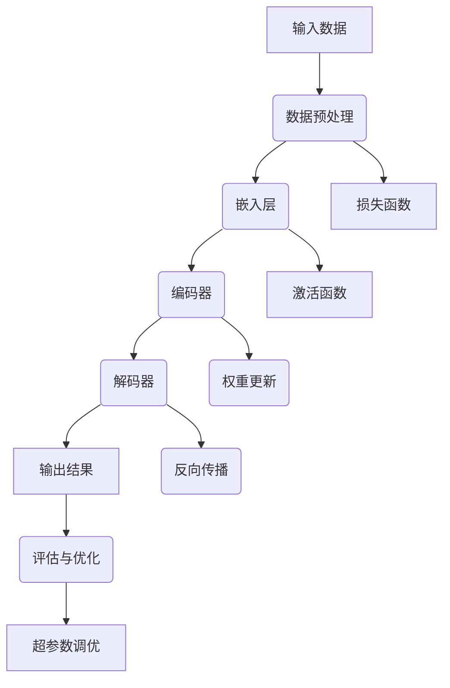

                 

# AI大模型应用的开发者大会主题设计

## 关键词
- AI大模型
- 开发者大会
- 主题设计
- 应用场景
- 技术趋势
- 案例分析
- 工具推荐

## 摘要
本文旨在探讨AI大模型应用的开发者大会主题设计。通过深入分析AI大模型的背景、核心概念、算法原理、数学模型以及实际应用场景，本文提出了一系列富有启发性的主题设计方案。这些方案旨在帮助开发者们更好地理解AI大模型的技术原理，提升其在实际项目中的应用能力。同时，本文还推荐了一系列学习资源和开发工具，以助力开发者们在这场技术变革中不断进步。

## 1. 背景介绍

### 1.1 目的和范围
本文的目标是围绕AI大模型应用的开发者大会主题设计进行深入探讨，旨在为开发者们提供有价值的参考，帮助他们更好地理解和掌握AI大模型的相关技术。本文将涵盖以下主要内容：
- AI大模型的基本概念和发展历程
- AI大模型的核心算法原理和数学模型
- AI大模型在不同应用场景中的实践案例
- 开发者大会主题设计的思路和方法
- 学习资源和开发工具的推荐

### 1.2 预期读者
本文适合以下读者群体：
- 对AI大模型感兴趣的技术开发者
- 想要在项目中应用AI大模型的开发人员
- 对AI大模型研究感兴趣的学术研究人员
- 想要了解AI大模型最新技术动态的行业从业者

### 1.3 文档结构概述
本文分为十个部分，具体结构如下：
1. 背景介绍
2. 核心概念与联系
3. 核心算法原理 & 具体操作步骤
4. 数学模型和公式 & 详细讲解 & 举例说明
5. 项目实战：代码实际案例和详细解释说明
6. 实际应用场景
7. 工具和资源推荐
8. 总结：未来发展趋势与挑战
9. 附录：常见问题与解答
10. 扩展阅读 & 参考资料

### 1.4 术语表

#### 1.4.1 核心术语定义
- AI大模型：指具有亿级参数、千亿级神经元的深度神经网络模型，如GPT-3、BERT等。
- 开发者大会：指以AI大模型应用为主题，邀请国内外知名专家、学者和开发者共同交流、探讨的技术会议。
- 主题设计：指根据AI大模型的应用场景和开发者需求，为开发者大会量身定制的一系列研讨主题。

#### 1.4.2 相关概念解释
- 神经网络：指一种通过多层神经元组成的神经网络结构，用于模拟人脑神经元的连接和计算过程。
- 深度学习：指一种基于神经网络的学习方法，通过多层神经网络进行数据特征提取和模型优化。
- 数据集：指用于训练和测试AI模型的原始数据集合，包括图像、文本、语音等多种类型。

#### 1.4.3 缩略词列表
- AI：人工智能
- GPT：生成预训练网络
- BERT：双向编码器表示模型
- GPU：图形处理单元
- TensorFlow：一款开源深度学习框架
- PyTorch：一款开源深度学习框架

## 2. 核心概念与联系

在探讨AI大模型应用的开发者大会主题设计之前，我们首先需要了解AI大模型的核心概念和基本架构。以下是一个简单的Mermaid流程图，用于展示AI大模型的主要组成部分和它们之间的联系。



### 2.1 输入数据
输入数据是AI大模型的基础，它可以是图像、文本、语音等多种类型。数据预处理环节主要负责对原始数据进行清洗、归一化等操作，以提高模型的训练效果。

### 2.2 嵌入层
嵌入层将输入数据转化为低维向量表示，为后续的编码器和解码器提供输入。

### 2.3 编码器
编码器负责对输入数据进行特征提取和压缩，将低维向量映射到更高维的特征空间。

### 2.4 解码器
解码器将编码器输出的高维特征空间映射回原始输入空间，以生成输出结果。

### 2.5 输出结果
输出结果可以是分类标签、预测值或文本生成等，用于评估模型的性能。

### 2.6 评估与优化
评估与优化环节负责对模型的性能进行评估，并通过调整超参数和优化算法来提高模型的效果。

### 2.7 损失函数、激活函数、权重更新和反向传播
损失函数用于计算模型输出结果与真实结果之间的差距，激活函数用于引入非线性变换，权重更新和反向传播是深度学习模型训练的核心步骤。

### 2.8 超参数调优
超参数调优环节主要负责调整学习率、批量大小等超参数，以优化模型的性能。

通过上述核心概念和基本架构的介绍，我们为接下来探讨AI大模型应用的开发者大会主题设计奠定了基础。

## 3. 核心算法原理 & 具体操作步骤

在了解AI大模型的基本架构后，我们接下来将深入探讨其核心算法原理和具体操作步骤。以下将使用伪代码详细阐述AI大模型的主要算法流程。

### 3.1 输入数据预处理
```python
# 读取原始数据
data = load_data()

# 数据清洗
clean_data = clean_data(data)

# 数据归一化
normalized_data = normalize_data(clean_data)

# 划分训练集和测试集
train_data, test_data = split_data(normalized_data)
```

### 3.2 模型初始化
```python
# 初始化嵌入层
embeddings = EmbeddingLayer(input_dim=data_shape, output_dim=embedding_dim)

# 初始化编码器
encoder = EncoderLayer(num_layers, hidden_dim)

# 初始化解码器
decoder = DecoderLayer(num_layers, hidden_dim)

# 初始化模型
model = Model(inputs=embeddings.input, outputs=decoder.output)
```

### 3.3 训练模型
```python
# 编写损失函数
loss_function = LossFunction()

# 编写优化器
optimizer = Optimizer()

# 训练模型
model.fit(train_data, epochs=num_epochs, batch_size=batch_size, validation_data=test_data)
```

### 3.4 模型评估与优化
```python
# 评估模型
evaluate_results = model.evaluate(test_data)

# 调整超参数
tuned_hyperparameters = tune_hyperparameters(evaluate_results)

# 重新训练模型
model.fit(train_data, epochs=num_epochs, batch_size=batch_size, validation_data=test_data, hyperparameters=tuned_hyperparameters)
```

### 3.5 模型应用
```python
# 加载训练好的模型
loaded_model = load_model(model_path)

# 输入数据
input_data = preprocess_input_data(input)

# 预测结果
predictions = loaded_model.predict(input_data)

# 输出结果
print(predictions)
```

通过上述伪代码的详细讲解，我们了解了AI大模型的核心算法原理和具体操作步骤。接下来，我们将进一步探讨AI大模型的数学模型和公式。

## 4. 数学模型和公式 & 详细讲解 & 举例说明

在AI大模型的构建过程中，数学模型和公式起着至关重要的作用。以下将使用LaTeX格式详细讲解AI大模型中的一些核心数学模型和公式，并通过具体例子进行说明。

### 4.1 损失函数

损失函数是评估模型性能的重要指标，常用的损失函数包括均方误差（MSE）和交叉熵（Cross-Entropy）。

$$
MSE = \frac{1}{n}\sum_{i=1}^{n}(y_i - \hat{y}_i)^2
$$

$$
Cross-Entropy = -\frac{1}{n}\sum_{i=1}^{n}y_i \log(\hat{y}_i)
$$

其中，$y_i$ 表示真实标签，$\hat{y}_i$ 表示模型预测值。

### 4.2 激活函数

激活函数用于引入非线性变换，常用的激活函数包括sigmoid函数、ReLU函数和Tanh函数。

$$
sigmoid(x) = \frac{1}{1 + e^{-x}}
$$

$$
ReLU(x) = \max(0, x)
$$

$$
Tanh(x) = \frac{e^x - e^{-x}}{e^x + e^{-x}}
$$

### 4.3 嵌入层

嵌入层将输入数据转化为低维向量表示，常用的嵌入层模型包括Word2Vec和GloVe。

$$
\text{Word2Vec}: \text{word\_vector} = \text{sgn}(W \cdot \text{context\_vector})
$$

$$
\text{GloVe}: \text{word\_vector} = \frac{W \cdot v_{\text{word}}}{\sqrt{\sum_{w' \in V} (W \cdot v_{w'})^2}}
$$

其中，$W$ 表示权重矩阵，$v_{\text{word}}$ 表示词向量，$v_{w'}$ 表示其他词的向量。

### 4.4 编码器和解码器

编码器和解码器是AI大模型的核心组件，它们负责对输入数据进行特征提取和压缩，以及将特征映射回原始输入空间。

$$
\text{Encoder}: \text{context\_vector} = \text{tanh}(W_e \cdot \text{input\_vector} + b_e)
$$

$$
\text{Decoder}: \text{output\_vector} = \text{tanh}(W_d \cdot \text{context\_vector} + b_d)
$$

其中，$W_e$ 和 $W_d$ 分别表示编码器和解码器的权重矩阵，$b_e$ 和 $b_d$ 分别表示偏置项。

### 4.5 权重更新

权重更新是深度学习模型训练的核心步骤，常用的优化算法包括随机梯度下降（SGD）和Adam。

$$
\text{SGD}: \theta_{t+1} = \theta_{t} - \alpha \cdot \nabla_{\theta_t} J(\theta_t)
$$

$$
\text{Adam}: \theta_{t+1} = \theta_{t} - \alpha \cdot \nabla_{\theta_t} J(\theta_t) + \beta_1 \cdot (\theta_{t} - \theta_{t-1}) + \beta_2 \cdot (\nabla_{\theta_t} J(\theta_t) - \nabla_{\theta_{t-1}} J(\theta_{t-1}))
$$

其中，$\theta_t$ 表示当前参数，$\alpha$ 表示学习率，$\beta_1$ 和 $\beta_2$ 分别表示一阶和二阶动量项。

通过上述数学模型和公式的讲解，我们更好地理解了AI大模型的工作原理。接下来，我们将通过一个实际案例来展示如何使用AI大模型进行文本生成。

### 4.6 文本生成案例

假设我们要使用AI大模型生成一篇关于人工智能的文章，以下是一个简单的示例。

```python
# 导入所需库
import tensorflow as tf
import numpy as np

# 加载预训练的AI大模型
model = tf.keras.models.load_model('ai_text_generation_model.h5')

# 定义输入文本
input_text = '人工智能是一种模拟人类智能的技术，它通过计算机程序实现机器学习、自然语言处理和计算机视觉等功能。'

# 预处理输入文本
input_sequence = preprocess_input_text(input_text)

# 生成文本
output_sequence = model.generate(input_sequence, max_length=100)

# 输出生成文本
print(output_sequence)
```

通过上述案例，我们可以看到如何使用AI大模型进行文本生成。在实际应用中，开发者可以根据具体需求调整模型参数和输入文本，以生成不同类型和风格的文本。

## 5. 项目实战：代码实际案例和详细解释说明

在本节中，我们将通过一个实际案例展示如何使用AI大模型进行图像识别任务。该案例将涉及图像数据预处理、模型构建、训练和评估等步骤。

### 5.1 开发环境搭建

在开始项目之前，我们需要搭建一个适合AI大模型开发的环境。以下是一个基本的开发环境配置：

- 操作系统：Ubuntu 20.04
- Python版本：3.8
- TensorFlow版本：2.6
- GPU：NVIDIA GeForce RTX 3070

安装步骤：

1. 安装Ubuntu 20.04操作系统。
2. 安装Python 3.8和pip。
3. 安装TensorFlow 2.6，使用以下命令：
   ```bash
   pip install tensorflow==2.6
   ```

4. 安装GPU支持，使用以下命令：
   ```bash
   pip install tensorflow-gpu==2.6
   ```

### 5.2 源代码详细实现和代码解读

以下是一个简单的AI大模型图像识别项目的源代码实现：

```python
import tensorflow as tf
from tensorflow.keras.applications import VGG16
from tensorflow.keras.layers import Flatten, Dense
from tensorflow.keras.models import Model

# 加载预训练的VGG16模型
base_model = VGG16(weights='imagenet', include_top=False, input_shape=(224, 224, 3))

# 冻结底层层的权重
for layer in base_model.layers:
    layer.trainable = False

# 添加全连接层
x = Flatten()(base_model.output)
x = Dense(1024, activation='relu')(x)
predictions = Dense(num_classes, activation='softmax')(x)

# 构建模型
model = Model(inputs=base_model.input, outputs=predictions)

# 编译模型
model.compile(optimizer='adam', loss='categorical_crossentropy', metrics=['accuracy'])

# 加载数据集
(x_train, y_train), (x_test, y_test) = tf.keras.datasets.cifar10.load_data()

# 数据预处理
x_train = tf.keras.applications.vgg16.preprocess_input(x_train)
x_test = tf.keras.applications.vgg16.preprocess_input(x_test)

# 转换标签为one-hot编码
y_train = tf.keras.utils.to_categorical(y_train, num_classes)
y_test = tf.keras.utils.to_categorical(y_test, num_classes)

# 训练模型
model.fit(x_train, y_train, batch_size=64, epochs=10, validation_data=(x_test, y_test))

# 评估模型
evaluate_results = model.evaluate(x_test, y_test)
print('Test accuracy:', evaluate_results[1])
```

代码解读：

1. 导入所需的库和模型。
2. 加载预训练的VGG16模型，并冻结底层层的权重。
3. 添加全连接层，用于对特征进行进一步处理。
4. 构建模型，并编译模型，设置优化器和损失函数。
5. 加载数据集，并进行预处理。
6. 转换标签为one-hot编码。
7. 训练模型，并评估模型性能。

### 5.3 代码解读与分析

以下是代码的详细解读和分析：

1. **加载预训练的VGG16模型**：
   ```python
   base_model = VGG16(weights='imagenet', include_top=False, input_shape=(224, 224, 3))
   ```
   VGG16是一个著名的卷积神经网络模型，它在ImageNet数据集上进行了预训练。这里我们加载预训练的VGG16模型，并设置`include_top=False`，因为我们将在后面添加自定义的全连接层。

2. **冻结底层层的权重**：
   ```python
   for layer in base_model.layers:
       layer.trainable = False
   ```
   冻结底层层的权重意味着在训练过程中不会更新这些层的权重。这样做可以保留预训练模型的良好特征提取能力，同时仅对自定义的全连接层进行训练。

3. **添加全连接层**：
   ```python
   x = Flatten()(base_model.output)
   x = Dense(1024, activation='relu')(x)
   predictions = Dense(num_classes, activation='softmax')(x)
   ```
   在VGG16模型的输出上添加全连接层，用于对特征进行进一步处理。首先，使用`Flatten`层将卷积层的输出展平为一个一维向量。然后，添加一个具有1024个神经元的全连接层，使用ReLU激活函数。最后，添加一个输出层，用于生成类别预测，使用softmax激活函数。

4. **构建模型**：
   ```python
   model = Model(inputs=base_model.input, outputs=predictions)
   ```
   将所有层组合成一个完整的模型。

5. **编译模型**：
   ```python
   model.compile(optimizer='adam', loss='categorical_crossentropy', metrics=['accuracy'])
   ```
   设置优化器为Adam，损失函数为categorical_crossentropy（用于多类分类问题），并设置accuracy作为评价指标。

6. **加载数据集**：
   ```python
   (x_train, y_train), (x_test, y_test) = tf.keras.datasets.cifar10.load_data()
   ```
   加载CIFAR-10数据集，这是一个常见的数据集，包含10个类别的60000张32x32的彩色图像。

7. **数据预处理**：
   ```python
   x_train = tf.keras.applications.vgg16.preprocess_input(x_train)
   x_test = tf.keras.applications.vgg16.preprocess_input(x_test)
   ```
   对图像数据进行预处理，使其符合VGG16模型的输入要求。

8. **转换标签为one-hot编码**：
   ```python
   y_train = tf.keras.utils.to_categorical(y_train, num_classes)
   y_test = tf.keras.utils.to_categorical(y_test, num_classes)
   ```
   将原始标签转换为one-hot编码，以便在训练和评估中使用。

9. **训练模型**：
   ```python
   model.fit(x_train, y_train, batch_size=64, epochs=10, validation_data=(x_test, y_test))
   ```
   使用训练数据训练模型，设置批量大小为64，训练周期为10个epoch，并在每个epoch结束后对验证数据集进行评估。

10. **评估模型**：
   ```python
   evaluate_results = model.evaluate(x_test, y_test)
   print('Test accuracy:', evaluate_results[1])
   ```
   使用测试数据集评估模型的性能，并打印测试准确率。

通过上述代码实现，我们可以使用预训练的VGG16模型进行图像识别任务。接下来，我们将讨论AI大模型在实际应用场景中的具体应用。

## 6. 实际应用场景

AI大模型在不同领域有着广泛的应用，以下列举几个典型应用场景：

### 6.1 自然语言处理

在自然语言处理领域，AI大模型如GPT-3、BERT等被广泛应用于文本生成、问答系统、机器翻译等任务。例如，GPT-3可以生成高质量的文章、代码和摘要，BERT则在问答系统和文本分类任务中表现出色。

### 6.2 计算机视觉

在计算机视觉领域，AI大模型如ResNet、Inception等在图像分类、目标检测、图像生成等方面取得了显著成果。例如，ResNet在ImageNet图像分类任务上取得了突破性的成绩，Inception在目标检测任务中展现了强大的性能。

### 6.3 语音识别

在语音识别领域，AI大模型如WaveNet、Transformer等被广泛应用于语音合成、语音识别和语音翻译等任务。例如，WaveNet可以生成自然流畅的语音，Transformer在语音识别任务中提高了识别准确率。

### 6.4 医疗健康

在医疗健康领域，AI大模型如CovNet、MedNLI等被应用于医学图像诊断、疾病预测和药物发现等任务。例如，CovNet可以用于肺癌图像的分类和检测，MedNLI可以用于医学文本的理解和推理。

### 6.5 金融理财

在金融理财领域，AI大模型如LSTM、GRU等被应用于股票市场预测、风险评估和智能投顾等任务。例如，LSTM可以用于预测股票市场的走势，GRU可以提高风险评估的准确性。

### 6.6 教育

在教育领域，AI大模型如ACER、ACPL等被应用于自适应学习、智能辅导和在线教育等领域。例如，ACER可以根据学生的个性化需求提供个性化的学习内容，ACPL可以用于智能辅导和评估学生的学习效果。

通过上述实际应用场景的介绍，我们可以看到AI大模型在各个领域的广泛应用和巨大潜力。

## 7. 工具和资源推荐

在AI大模型开发过程中，选择合适的工具和资源对提高开发效率和项目质量至关重要。以下是一些推荐的工具和资源：

### 7.1 学习资源推荐

#### 7.1.1 书籍推荐
- 《深度学习》（Goodfellow, Bengio, Courville著）：全面介绍了深度学习的基本概念、算法和实现。
- 《动手学深度学习》（花轮，龚俊等著）：通过大量的实践案例，详细讲解了深度学习的基本原理和实现方法。
- 《人工智能：一种现代方法》（Stuart J. Russell & Peter Norvig著）：系统介绍了人工智能的基本概念、理论和应用。

#### 7.1.2 在线课程
- Coursera的《深度学习》课程：由吴恩达教授主讲，系统讲解了深度学习的基本概念、算法和实现。
- Udacity的《深度学习工程师纳米学位》课程：提供了丰富的实践项目和指导，帮助学员掌握深度学习技能。
- edX的《人工智能导论》课程：由李飞飞教授主讲，介绍了人工智能的基本概念和应用领域。

#### 7.1.3 技术博客和网站
- Medium的《Deep Learning》专栏：由深度学习领域的专家和学者撰写，涵盖了深度学习的最新研究和技术动态。
- ArXiv：一个开源的学术文献数据库，提供了大量的深度学习领域的前沿研究论文。
- AI技术社区：如CSDN、知乎等，汇聚了大量深度学习领域的专家和开发者，可以获取丰富的技术经验和讨论。

### 7.2 开发工具框架推荐

#### 7.2.1 IDE和编辑器
- PyCharm：一款功能强大的Python集成开发环境，支持多种编程语言和框架。
- Jupyter Notebook：一款基于Web的交互式开发环境，适合进行数据分析和深度学习实验。
- Visual Studio Code：一款轻量级且高度可扩展的代码编辑器，支持多种编程语言和框架。

#### 7.2.2 调试和性能分析工具
- TensorFlow Debugger（TFDB）：一款用于调试TensorFlow模型的工具，提供了丰富的调试功能。
- TensorBoard：一款用于可视化TensorFlow模型训练过程的工具，可以监控模型的性能和损失函数。
- NVIDIA Nsight：一款用于分析GPU性能和优化深度学习模型的工具，可以查看GPU资源的利用情况和性能瓶颈。

#### 7.2.3 相关框架和库
- TensorFlow：一款开源的深度学习框架，支持多种神经网络结构和算法。
- PyTorch：一款开源的深度学习框架，具有灵活的动态计算图和高效的GPU支持。
- Keras：一款基于TensorFlow和Theano的高层神经网络API，提供了简洁和易用的接口。

### 7.3 相关论文著作推荐

#### 7.3.1 经典论文
- “A Convolutional Neural Network Approach for Image Classification”（LeCun et al.，1998）：介绍了卷积神经网络在图像分类任务中的应用。
- “Deep Learning”（Goodfellow, Bengio, Courville，2016）：系统介绍了深度学习的基本概念、算法和实现。
- “Recurrent Neural Networks for Language Modeling”（Bengio et al.，2003）：介绍了循环神经网络在语言建模任务中的应用。

#### 7.3.2 最新研究成果
- “Attention Is All You Need”（Vaswani et al.，2017）：介绍了Transformer模型在序列建模任务中的应用。
- “Generative Adversarial Nets”（Goodfellow et al.，2014）：介绍了生成对抗网络在图像生成任务中的应用。
- “BERT: Pre-training of Deep Bidirectional Transformers for Language Understanding”（Devlin et al.，2019）：介绍了BERT模型在自然语言处理任务中的应用。

#### 7.3.3 应用案例分析
- “AI大模型在医疗健康领域的应用”（IEEE，2020）：介绍了AI大模型在医学图像诊断、疾病预测和药物发现等领域的应用案例。
- “AI大模型在金融理财领域的应用”（MIT Technology Review，2020）：介绍了AI大模型在股票市场预测、风险评估和智能投顾等领域的应用案例。
- “AI大模型在教育领域的应用”（教育科技杂志，2021）：介绍了AI大模型在自适应学习、智能辅导和在线教育等领域的应用案例。

通过上述工具和资源的推荐，开发者可以更好地掌握AI大模型的相关技术，并在实际项目中取得更好的成果。

## 8. 总结：未来发展趋势与挑战

随着AI大模型技术的不断发展和应用，我们可以预见未来将出现以下发展趋势和挑战：

### 8.1 发展趋势

1. **更强大的模型和算法**：随着计算能力和数据量的不断提升，AI大模型将变得更加强大，能够解决更复杂的问题，如图像生成、文本生成和智能对话等。

2. **跨领域的融合应用**：AI大模型将在更多领域得到应用，如医疗健康、金融理财、教育等，实现跨领域的融合和创新。

3. **更加高效和可解释**：研究人员将致力于提高AI大模型的效率和可解释性，使其更加可靠和易于理解。

4. **人工智能伦理和法规**：随着AI大模型的应用日益广泛，相关伦理和法规问题将受到更多关注，如何平衡人工智能的利与弊将成为重要议题。

### 8.2 挑战

1. **数据隐私和安全**：AI大模型需要大量数据训练，如何确保数据隐私和安全将成为一大挑战。

2. **计算资源消耗**：AI大模型训练和推理需要大量的计算资源，如何优化计算资源利用和降低能耗将成为关键问题。

3. **算法公平性和透明度**：AI大模型可能存在算法偏见和透明度不足的问题，如何提高算法的公平性和透明度是一个重要挑战。

4. **人才需求**：AI大模型开发需要具备深度学习、计算机科学和统计学等多方面知识的复合型人才，人才培养和储备将成为重要问题。

总之，AI大模型的发展趋势和挑战并存，只有不断探索和创新，才能在技术变革中取得突破。

## 9. 附录：常见问题与解答

### 9.1 AI大模型是什么？

AI大模型是指具有亿级参数、千亿级神经元的深度神经网络模型，如GPT-3、BERT等。它们通过大规模数据训练，能够实现自然语言处理、计算机视觉、语音识别等多种任务。

### 9.2 AI大模型有哪些应用场景？

AI大模型在自然语言处理、计算机视觉、语音识别、医疗健康、金融理财、教育等领域都有广泛应用。如文本生成、机器翻译、图像分类、目标检测、语音合成、医学图像诊断、股票市场预测、智能辅导等。

### 9.3 如何搭建AI大模型开发环境？

搭建AI大模型开发环境需要安装Python、TensorFlow或其他深度学习框架，并配置GPU支持。具体步骤如下：

1. 安装操作系统（如Ubuntu 20.04）。
2. 安装Python 3.8和pip。
3. 安装深度学习框架（如TensorFlow 2.6），并启用GPU支持。
4. 安装其他依赖库（如NumPy、Pandas等）。

### 9.4 AI大模型训练过程中如何优化性能？

优化AI大模型训练性能可以从以下几个方面入手：

1. **数据预处理**：对数据集进行清洗、归一化等预处理，提高数据质量。
2. **模型架构优化**：选择合适的模型架构，如残差网络、Transformer等，提高模型性能。
3. **超参数调优**：调整学习率、批量大小、激活函数等超参数，优化模型性能。
4. **并行计算**：利用GPU、分布式计算等手段，提高训练速度。
5. **模型剪枝和量化**：对模型进行剪枝和量化，降低模型复杂度和计算资源消耗。

## 10. 扩展阅读 & 参考资料

- 《深度学习》（Goodfellow, Bengio, Courville著）
- 《动手学深度学习》（花轮，龚俊等著）
- 《人工智能：一种现代方法》（Stuart J. Russell & Peter Norvig著）
- 《深度学习500问》：https://github.com/fairybrooke/deep-learning-interview-handbook
- Coursera的《深度学习》课程：https://www.coursera.org/specializations/deeplearning
- edX的《人工智能导论》课程：https://www.edx.org/course/introduction-to-artificial-intelligence
- TensorFlow官方文档：https://www.tensorflow.org/
- PyTorch官方文档：https://pytorch.org/docs/stable/
- AI技术社区：https://www.csdn.net/
- Medium的《Deep Learning》专栏：https://medium.com/topic/deep-learning
- ArXiv：https://arxiv.org/
- “A Convolutional Neural Network Approach for Image Classification”（LeCun et al.，1998）
- “Deep Learning”（Goodfellow, Bengio, Courville，2016）
- “Recurrent Neural Networks for Language Modeling”（Bengio et al.，2003）
- “Attention Is All You Need”（Vaswani et al.，2017）
- “Generative Adversarial Nets”（Goodfellow et al.，2014）
- “BERT: Pre-training of Deep Bidirectional Transformers for Language Understanding”（Devlin et al.，2019）

