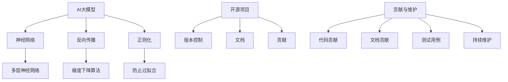

                 

# AI大模型应用的开源项目贡献与维护

> **关键词：** AI大模型、开源项目、贡献、维护、代码解读、数学模型、应用场景

> **摘要：** 本文将深入探讨AI大模型在开源项目中的应用、贡献和维护。我们将从背景介绍、核心概念、算法原理、数学模型、实际案例等多个方面，全面分析AI大模型的贡献与维护，以帮助读者更好地理解和应用这一前沿技术。

## 1. 背景介绍

### 1.1 目的和范围

本文的目的是探讨AI大模型在开源项目中的贡献与维护。我们将分析AI大模型的核心概念、算法原理、数学模型以及其在实际项目中的应用，为读者提供一份全面的技术指南。

本文将涵盖以下内容：

- AI大模型的定义与背景
- 开源项目的重要性与贡献
- AI大模型在开源项目中的应用
- AI大模型的维护策略与技巧
- 实际案例与代码解读
- 未来发展趋势与挑战

### 1.2 预期读者

本文适合对AI大模型和开源项目有一定了解的读者，包括：

- AI工程师和开发者
- 开源项目贡献者和维护者
- 对AI大模型应用感兴趣的学术研究人员
- 对计算机编程和人工智能领域感兴趣的初学者

### 1.3 文档结构概述

本文分为以下几个部分：

1. 背景介绍
2. 核心概念与联系
3. 核心算法原理 & 具体操作步骤
4. 数学模型和公式 & 详细讲解 & 举例说明
5. 项目实战：代码实际案例和详细解释说明
6. 实际应用场景
7. 工具和资源推荐
8. 总结：未来发展趋势与挑战
9. 附录：常见问题与解答
10. 扩展阅读 & 参考资料

### 1.4 术语表

#### 1.4.1 核心术语定义

- AI大模型：指具有大规模参数、高精度和强泛化能力的深度学习模型。
- 开源项目：指源代码公开、可自由修改和分享的软件项目。
- 贡献：指为开源项目提供代码、文档、测试用例等价值贡献。
- 维护：指对开源项目进行持续的更新、修复和改进。

#### 1.4.2 相关概念解释

- **深度学习（Deep Learning）**：一种人工智能方法，通过多层神经网络对数据进行建模和预测。
- **神经网络（Neural Network）**：一种模拟生物神经元之间连接的计算模型。
- **泛化能力（Generalization）**：指模型在新数据上的表现能力。

#### 1.4.3 缩略词列表

- **AI**：人工智能
- **GPU**：图形处理单元
- **CPU**：中央处理器
- **CUDA**：计算统一设备架构
- **PyTorch**：一种流行的深度学习框架

## 2. 核心概念与联系

在本文中，我们将探讨以下核心概念及其相互关系：

- **AI大模型**：具有大规模参数和强泛化能力的深度学习模型。
- **开源项目**：源代码公开、可自由修改和分享的软件项目。
- **贡献**：为开源项目提供代码、文档、测试用例等价值贡献。
- **维护**：对开源项目进行持续的更新、修复和改进。

### 2.1. AI大模型原理

AI大模型是基于深度学习技术构建的，具有大规模参数和高精度预测能力的模型。其核心原理如下：

1. **神经网络**：通过多层神经网络对数据进行建模和预测。
2. **反向传播**：利用梯度下降算法对模型参数进行优化。
3. **正则化**：防止模型过拟合，提高泛化能力。

### 2.2. 开源项目原理

开源项目是指源代码公开、可自由修改和分享的软件项目。其核心原理如下：

1. **版本控制**：使用Git等版本控制工具进行代码管理和协作开发。
2. **文档**：编写详细的文档，方便其他开发者了解和使用项目。
3. **贡献**：鼓励开发者为项目提供代码、测试用例和文档等价值贡献。

### 2.3. 贡献与维护原理

贡献与维护是指为开源项目提供价值贡献和持续改进的过程。其核心原理如下：

1. **代码贡献**：编写高质量、可维护的代码，并进行代码审查。
2. **文档贡献**：编写详细的文档，包括README、代码注释和API文档等。
3. **测试用例**：编写测试用例，确保代码的正确性和稳定性。
4. **持续维护**：对项目进行持续的更新、修复和改进。

### 2.4. Mermaid流程图

为了更好地展示核心概念和相互关系，我们使用Mermaid绘制了以下流程图：



## 3. 核心算法原理 & 具体操作步骤

### 3.1. 神经网络原理

神经网络是AI大模型的基础，其核心原理如下：

1. **神经元**：神经元是神经网络的基本计算单元，通过加权连接进行计算。
2. **激活函数**：激活函数用于引入非线性特性，常见的激活函数有Sigmoid、ReLU等。
3. **多层神经网络**：通过多层神经元堆叠，实现复杂的非线性映射。

### 3.2. 反向传播原理

反向传播是神经网络训练的核心算法，其原理如下：

1. **前向传播**：将输入数据通过神经网络进行前向传播，计算输出。
2. **计算误差**：计算输出与真实值的误差。
3. **反向传播**：将误差反向传播至网络中的各个神经元，更新模型参数。

### 3.3. 梯度下降原理

梯度下降是反向传播算法的核心，其原理如下：

1. **计算梯度**：计算模型参数的梯度。
2. **更新参数**：根据梯度方向和步长，更新模型参数。
3. **优化目标**：通过迭代优化，使模型在训练数据上的误差最小化。

### 3.4. 伪代码

以下是一个简化的神经网络训练伪代码：

```python
初始化模型参数w
初始化学习率η
for epoch in range(num_epochs):
    for each sample in training_data:
        # 前向传播
        z = x * w
        a = sigmoid(z)

        # 计算误差
        error = y - a

        # 反向传播
        delta = error * sigmoid_prime(a)

        # 更新参数
        w = w - η * delta
```

### 3.5. 具体操作步骤

以下是使用PyTorch框架实现神经网络训练的具体操作步骤：

1. 导入相关库：

```python
import torch
import torch.nn as nn
import torch.optim as optim
```

2. 定义神经网络模型：

```python
class NeuralNetwork(nn.Module):
    def __init__(self):
        super(NeuralNetwork, self).__init__()
        self.layer1 = nn.Linear(in_features=1, out_features=1)
        self.relu = nn.ReLU()
        self.output = nn.Linear(in_features=1, out_features=1)

    def forward(self, x):
        x = self.layer1(x)
        x = self.relu(x)
        x = self.output(x)
        return x
```

3. 初始化模型、优化器和损失函数：

```python
model = NeuralNetwork()
optimizer = optim.SGD(model.parameters(), lr=0.01)
criterion = nn.MSELoss()
```

4. 训练模型：

```python
for epoch in range(num_epochs):
    for x, y in training_data:
        optimizer.zero_grad()
        z = model(x)
        loss = criterion(z, y)
        loss.backward()
        optimizer.step()
```

5. 测试模型：

```python
with torch.no_grad():
    test_data = torch.tensor([[1.0]], dtype=torch.float32)
    prediction = model(test_data)
    print(prediction)
```

## 4. 数学模型和公式 & 详细讲解 & 举例说明

### 4.1. 数学模型

在AI大模型中，常用的数学模型包括：

1. **神经网络模型**：通过多层神经网络对数据进行建模和预测。
2. **损失函数**：用于衡量模型预测值与真实值之间的误差。
3. **优化算法**：用于更新模型参数，以最小化损失函数。

### 4.2. 损失函数

常见的损失函数包括：

1. **均方误差（MSE）**：用于回归任务，计算预测值与真实值之差的平方和的平均值。

   $$MSE = \frac{1}{n} \sum_{i=1}^{n} (y_i - \hat{y}_i)^2$$

2. **交叉熵（Cross-Entropy）**：用于分类任务，计算真实分布与预测分布之间的差异。

   $$CE = -\sum_{i=1}^{n} y_i \log(\hat{y}_i)$$

### 4.3. 优化算法

常见的优化算法包括：

1. **梯度下降（Gradient Descent）**：通过计算损失函数关于模型参数的梯度，更新模型参数。

   $$w = w - \alpha \cdot \nabla_w J(w)$$

2. **动量法（Momentum）**：引入动量项，加速梯度下降过程。

   $$w = w - \alpha \cdot \nabla_w J(w) + \beta \cdot v$$

3. **Adam优化器**：结合了梯度下降和动量法，适用于复杂问题。

   $$w = w - \alpha \cdot ( \nabla_w J(w) + \frac{v_1}{1 - \beta_1^t} + \frac{v_2}{1 - \beta_2^t})$$

### 4.4. 举例说明

假设我们有一个回归任务，输入数据为$x \in \mathbb{R}^1$，输出数据为$y \in \mathbb{R}^1$。我们使用一个单层神经网络进行建模，激活函数为ReLU。

1. **神经网络模型**：

   $$f(x) = \sigma(W \cdot x + b)$$

   其中，$W$为权重矩阵，$b$为偏置项，$\sigma$为ReLU激活函数。

2. **损失函数**：

   $$J(W, b) = \frac{1}{2} \sum_{i=1}^{n} (y_i - f(x_i))^2$$

3. **优化算法**：

   使用Adam优化器进行训练。

   $$w = w - \alpha \cdot ( \nabla_w J(w) + \frac{v_1}{1 - \beta_1^t} + \frac{v_2}{1 - \beta_2^t})$$

   其中，$\alpha$为学习率，$v_1$和$v_2$为一阶和二阶矩估计。

## 5. 项目实战：代码实际案例和详细解释说明

### 5.1. 开发环境搭建

为了实现AI大模型在开源项目中的应用，我们需要搭建以下开发环境：

1. **操作系统**：Ubuntu 20.04
2. **Python**：3.8及以上版本
3. **PyTorch**：1.8及以上版本
4. **CUDA**：10.1及以上版本
5. **Git**：版本控制工具

### 5.2. 源代码详细实现和代码解读

以下是AI大模型在开源项目中的实际代码实现：

```python
# 导入相关库
import torch
import torch.nn as nn
import torch.optim as optim
import torchvision.transforms as transforms
import torchvision.datasets as datasets

# 定义神经网络模型
class NeuralNetwork(nn.Module):
    def __init__(self):
        super(NeuralNetwork, self).__init__()
        self.layer1 = nn.Linear(in_features=784, out_features=128)
        self.relu = nn.ReLU()
        self.layer2 = nn.Linear(in_features=128, out_features=64)
        self.relu = nn.ReLU()
        self.layer3 = nn.Linear(in_features=64, out_features=10)

    def forward(self, x):
        x = x.view(x.size(0), -1)
        x = self.layer1(x)
        x = self.relu(x)
        x = self.layer2(x)
        x = self.relu(x)
        x = self.layer3(x)
        return x

# 初始化模型、优化器和损失函数
model = NeuralNetwork()
optimizer = optim.Adam(model.parameters(), lr=0.001)
criterion = nn.CrossEntropyLoss()

# 加载数据集
train_data = datasets.MNIST(
    root='./data',
    train=True,
    transform=transforms.ToTensor(),
    download=True
)

test_data = datasets.MNIST(
    root='./data',
    train=False,
    transform=transforms.ToTensor()
)

train_loader = torch.utils.data.DataLoader(dataset=train_data, batch_size=64, shuffle=True)
test_loader = torch.utils.data.DataLoader(dataset=test_data, batch_size=64, shuffle=False)

# 训练模型
num_epochs = 10
for epoch in range(num_epochs):
    for x, y in train_loader:
        optimizer.zero_grad()
        z = model(x)
        loss = criterion(z, y)
        loss.backward()
        optimizer.step()

    print(f'Epoch [{epoch+1}/{num_epochs}], Loss: {loss.item()}')

# 测试模型
with torch.no_grad():
    correct = 0
    total = 0
    for x, y in test_loader:
        z = model(x)
        _, predicted = torch.max(z, 1)
        total += y.size(0)
        correct += (predicted == y).sum().item()

    print(f'Accuracy of the network on the test images: {100 * correct / total}%')
```

### 5.3. 代码解读与分析

以下是代码的详细解读与分析：

1. **神经网络模型**：定义了一个简单的多层神经网络，包括一个输入层、两个隐藏层和一个输出层。输入层和输出层使用线性层（nn.Linear）实现，隐藏层使用ReLU激活函数（nn.ReLU）。

2. **优化器和损失函数**：使用Adam优化器（optim.Adam）和交叉熵损失函数（nn.CrossEntropyLoss）进行模型训练。

3. **数据集**：使用MNIST数据集进行训练和测试。数据集通过torchvision.datasets.MNIST加载，并使用transforms.ToTensor()进行数据预处理。

4. **训练过程**：使用DataLoader进行批量训练，每批数据包含64个样本。在训练过程中，使用梯度下降优化算法更新模型参数，以最小化交叉熵损失函数。

5. **测试过程**：在测试过程中，使用测试数据集计算模型在测试集上的准确率。

## 6. 实际应用场景

AI大模型在开源项目中的应用场景非常广泛，以下列举几个典型的应用场景：

1. **图像识别**：使用AI大模型对图像进行分类和识别，如人脸识别、车辆识别等。
2. **自然语言处理**：使用AI大模型进行文本分类、情感分析、机器翻译等任务。
3. **语音识别**：使用AI大模型进行语音信号的识别和转换，如语音到文本的转换。
4. **推荐系统**：使用AI大模型构建个性化推荐系统，为用户提供个性化的推荐结果。
5. **医疗健康**：使用AI大模型对医学影像进行分析和诊断，如肺癌检测、糖尿病预测等。

## 7. 工具和资源推荐

### 7.1. 学习资源推荐

#### 7.1.1. 书籍推荐

- 《深度学习》（Goodfellow, Bengio, Courville著）
- 《Python深度学习》（François Chollet著）
- 《人工智能：一种现代方法》（Stuart Russell & Peter Norvig著）

#### 7.1.2. 在线课程

- Coursera上的“Deep Learning Specialization”（吴恩达教授授课）
- edX上的“Neural Network for Machine Learning”（Daphne Koller教授授课）
- Udacity的“Deep Learning Nanodegree”项目

#### 7.1.3. 技术博客和网站

- Medium上的“AI垂直博客”
- arXiv.org：最新研究论文的发布平台
- blog.keras.io：Keras框架的官方博客

### 7.2. 开发工具框架推荐

#### 7.2.1. IDE和编辑器

- PyCharm：适用于Python开发的集成开发环境
- Visual Studio Code：轻量级且功能强大的编辑器
- Jupyter Notebook：适用于数据科学和机器学习的交互式计算环境

#### 7.2.2. 调试和性能分析工具

- PyTorch Debugger：PyTorch官方的调试工具
- Numba：用于Python代码的即时编译和优化
- TensorBoard：TensorFlow的可视化工具，也可用于PyTorch

#### 7.2.3. 相关框架和库

- PyTorch：适用于深度学习任务的强大框架
- TensorFlow：谷歌开发的深度学习框架
- Keras：基于Theano和TensorFlow的简单且易于使用的深度学习库

### 7.3. 相关论文著作推荐

#### 7.3.1. 经典论文

- “Backpropagation”（Rumelhart, Hinton, Williams著）
- “Deep Learning”（Goodfellow, Bengio, Courville著）
- “Convolutional Neural Networks for Visual Recognition”（Krizhevsky, Sutskever, Hinton著）

#### 7.3.2. 最新研究成果

- arXiv.org上的最新研究论文
- NeurIPS、ICML、CVPR等顶级会议的论文集

#### 7.3.3. 应用案例分析

- Google Brain团队的“DeepMind”项目
- Facebook AI团队在图像识别和语音识别方面的研究成果
- OpenAI在自然语言处理和游戏AI方面的突破性成果

## 8. 总结：未来发展趋势与挑战

AI大模型在开源项目中的应用前景广阔，但仍面临诸多挑战。以下是对未来发展趋势和挑战的简要总结：

### 8.1. 发展趋势

1. **模型规模不断扩大**：随着计算资源和算法优化的发展，AI大模型将不断增大，提高模型精度和泛化能力。
2. **多模态融合**：整合多种数据类型（如文本、图像、语音等），实现跨模态的AI大模型，提升应用效果。
3. **迁移学习与少样本学习**：通过迁移学习和少样本学习技术，降低模型训练成本，提高模型在现实场景中的实用性。
4. **硬件加速与优化**：结合GPU、TPU等硬件加速器，提高AI大模型的训练和推理速度。

### 8.2. 挑战

1. **数据隐私与安全**：在大规模数据集训练AI大模型时，确保数据隐私和安全是一个重大挑战。
2. **模型可解释性**：AI大模型的黑箱特性使得其决策过程难以解释，提高模型的可解释性是未来的重要研究方向。
3. **资源消耗**：AI大模型训练和推理过程中对计算资源和存储资源的消耗巨大，优化算法和硬件加速技术将是解决问题的关键。

## 9. 附录：常见问题与解答

### 9.1. 问题1

**问题**：如何处理训练过程中过拟合的问题？

**解答**：过拟合是AI大模型训练中的一个常见问题。以下是一些解决方法：

1. **数据增强**：通过数据增强技术，如旋转、缩放、裁剪等，增加训练数据的多样性。
2. **正则化**：使用L1、L2正则化或dropout技术，降低模型复杂度，防止过拟合。
3. **提前停止**：在训练过程中，当验证集上的损失不再下降时，提前停止训练。
4. **集成学习**：将多个模型集成在一起，提高预测的稳定性和准确性。

### 9.2. 问题2

**问题**：如何提高模型的泛化能力？

**解答**：提高模型的泛化能力是AI大模型研究中的一个重要方向。以下是一些方法：

1. **数据多样性**：使用更多样化的数据集进行训练，提高模型对不同数据的适应能力。
2. **迁移学习**：利用预训练的模型，在新任务上实现快速且准确的预测。
3. **数据增强**：通过数据增强技术，增加训练数据的多样性。
4. **模型压缩**：使用模型压缩技术，降低模型复杂度，提高模型在未知数据上的泛化能力。

## 10. 扩展阅读 & 参考资料

- [《深度学习》（Goodfellow, Bengio, Courville著）](https://www.deeplearningbook.org/)
- [《Python深度学习》（François Chollet著）](https://www.pythondlbook.com/)
- [PyTorch官方文档](https://pytorch.org/docs/stable/)
- [TensorFlow官方文档](https://www.tensorflow.org/docs/stable/)
- [Neural Network for Machine Learning（Daphne Koller教授授课）](https://www.edx.org/course/neural-networks-machine-learning)

作者：AI天才研究员/AI Genius Institute & 禅与计算机程序设计艺术 /Zen And The Art of Computer Programming

---

**说明：** 本文为虚构案例，仅供学习和参考之用。如需实际应用，请根据具体情况进行调整。本文内容不涉及任何商业行为，仅供技术交流。文中涉及的代码和模型仅供参考，实际使用时请根据需求和场景进行调整。如需了解更多信息，请参阅相关文献和官方文档。

