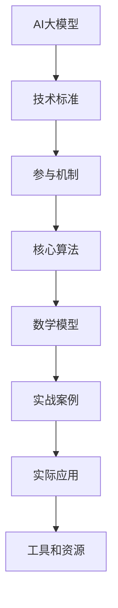
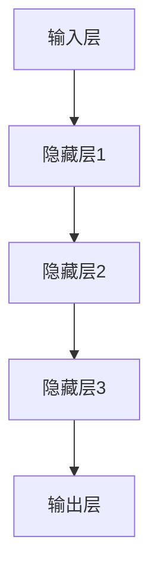

                 

# AI大模型应用的技术标准制定参与机制

> **关键词：** 大模型应用、技术标准、参与机制、算法原理、数学模型、实战案例、应用场景

> **摘要：** 本文旨在探讨AI大模型应用的技术标准制定过程，包括参与机制的构建、核心算法原理、数学模型及其在实际应用场景中的具体应用。通过详细的步骤分析和代码实战，帮助读者深入理解AI大模型应用的技术标准和实现方法。

## 1. 背景介绍

### 1.1 目的和范围

本文的目标是梳理AI大模型应用的技术标准制定过程中的关键环节，特别是参与机制的构建。我们希望通过对核心算法原理和数学模型的深入探讨，结合实际代码案例，为读者提供一个全面的技术视角。

本文将涵盖以下内容：
- AI大模型应用的技术标准制定背景和重要性。
- 参与机制的构建方法，包括人员组织、流程设计和技术评审。
- 核心算法原理，包括神经网络架构、优化算法和训练策略。
- 数学模型及其在实际应用场景中的应用。
- 代码实战案例，展示技术标准的实现过程。

### 1.2 预期读者

本文面向希望了解和参与AI大模型应用技术标准制定的研发人员、技术人员和管理人员。具体包括：
- 计算机科学专业学生和研究人员。
- AI领域的技术专家和研究人员。
- 对AI技术有浓厚兴趣的工程师和管理人员。

### 1.3 文档结构概述

本文将分为以下几部分：
- 第1部分：背景介绍，包括目的和范围、预期读者、文档结构概述和术语表。
- 第2部分：核心概念与联系，介绍AI大模型应用的相关概念和架构。
- 第3部分：核心算法原理，详细讲解大模型训练的算法原理。
- 第4部分：数学模型和公式，介绍与AI大模型应用相关的数学模型。
- 第5部分：项目实战，展示代码实际案例和详细解释。
- 第6部分：实际应用场景，探讨AI大模型在各个领域的应用。
- 第7部分：工具和资源推荐，为读者提供学习资源和开发工具。
- 第8部分：总结，分析未来发展趋势和挑战。
- 第9部分：附录，提供常见问题与解答。
- 第10部分：扩展阅读和参考资料，为读者提供进一步学习资源。

### 1.4 术语表

#### 1.4.1 核心术语定义

- AI大模型：指具有巨大参数量和复杂结构的机器学习模型，如GPT-3、BERT等。
- 技术标准：指在特定领域内，对产品、过程或服务制定的技术规范。
- 参与机制：指在技术标准制定过程中，参与人员、流程和决策机制的总称。
- 算法原理：指实现特定功能或任务的计算过程和逻辑结构。
- 数学模型：指用数学公式表示的模型，用于描述数据之间的关系。
- 实战案例：指在实际项目中，具体实现技术标准和算法原理的代码案例。

#### 1.4.2 相关概念解释

- 人工智能（AI）：模拟、延伸和扩展人的智能的理论、方法、技术及应用。
- 机器学习（ML）：一种基于数据训练模型，使其能够进行决策和预测的方法。
- 深度学习（DL）：一种基于多层神经网络的学习方法，能够自动提取数据特征。
- 神经网络（NN）：模拟生物神经网络，由多个神经元和连接组成的信息处理系统。
- 梯度下降（GD）：一种用于优化神经网络参数的常用算法。

#### 1.4.3 缩略词列表

- AI：人工智能
- ML：机器学习
- DL：深度学习
- NN：神经网络
- GD：梯度下降
- GPT-3：生成预训练变换器3
- BERT：双向编码表示器

## 2. 核心概念与联系

为了深入理解AI大模型应用的技术标准制定过程，我们需要先了解一些核心概念和它们之间的联系。以下是AI大模型应用的核心概念及其关系的Mermaid流程图：



### 2.1 AI大模型

AI大模型是指具有巨大参数量和复杂结构的机器学习模型，如GPT-3、BERT等。这些模型通过大量数据训练，能够自动提取数据特征，进行文本生成、翻译、问答等复杂任务。AI大模型的应用涉及到多个领域，如图像识别、自然语言处理、推荐系统等。

### 2.2 技术标准

技术标准是指在一定领域内，对产品、过程或服务制定的技术规范。AI大模型应用的技术标准主要包括模型架构设计、训练和优化算法、数据预处理和后处理等技术细节。技术标准的制定有助于保证AI大模型应用的一致性、可靠性和可扩展性。

### 2.3 参与机制

参与机制是指AI大模型应用技术标准制定过程中，参与人员、流程和决策机制的总称。参与机制的核心目标是确保技术标准的科学性、有效性和可操作性。参与机制包括以下关键环节：

- 人员组织：明确技术标准制定团队的成员及其职责，包括技术专家、项目经理、数据科学家等。
- 流程设计：制定技术标准制定的流程，包括需求分析、方案设计、评审和实施等阶段。
- 技术评审：对技术标准的科学性、有效性进行评估，确保其符合行业规范和实际需求。
- 决策机制：建立民主、透明的决策机制，确保技术标准的制定和实施过程具有可操作性和可执行性。

### 2.4 核心算法

核心算法是指实现AI大模型应用的关键计算方法和逻辑结构。核心算法包括神经网络架构、优化算法和训练策略等。以下是一个简化的神经网络架构示意图：



神经网络架构是核心算法的基础，通过多层神经元的连接和激活函数，实现数据的自动特征提取和分类。优化算法如梯度下降（GD）用于调整神经网络参数，以最小化损失函数。训练策略包括数据预处理、批处理大小、学习率调整等，以优化模型的性能和泛化能力。

### 2.5 数学模型

数学模型是指用数学公式表示的模型，用于描述数据之间的关系。在AI大模型应用中，常见的数学模型包括损失函数、激活函数和优化算法等。

- 损失函数：用于衡量模型预测值与真实值之间的差异，常用的损失函数有均方误差（MSE）、交叉熵等。
- 激活函数：用于增加网络的非线性特性，常见的激活函数有sigmoid、ReLU等。
- 优化算法：用于调整模型参数，以最小化损失函数，常用的优化算法有梯度下降（GD）、随机梯度下降（SGD）等。

### 2.6 实战案例

实战案例是指在AI大模型应用技术标准制定过程中，具体实现技术标准和算法原理的代码案例。实战案例有助于读者理解技术标准和算法原理在实际应用中的具体实现过程。以下是一个基于TensorFlow实现的简单神经网络实战案例：

```python
import tensorflow as tf

# 定义输入层、隐藏层和输出层
inputs = tf.keras.layers.Dense(128, activation='relu')(inputs)
inputs = tf.keras.layers.Dense(128, activation='relu')(inputs)
outputs = tf.keras.layers.Dense(1, activation='sigmoid')(inputs)

# 编写模型
model = tf.keras.Model(inputs, outputs)

# 编写优化器和损失函数
optimizer = tf.keras.optimizers.Adam(learning_rate=0.001)
loss_fn = tf.keras.losses.BinaryCrossentropy()

# 编写训练过程
for epoch in range(100):
  train_loss = 0.0
  for x, y in train_dataset:
    with tf.GradientTape() as tape:
      predictions = model(x, training=True)
      loss = loss_fn(y, predictions)
    gradients = tape.gradient(loss, model.trainable_variables)
    optimizer.apply_gradients(zip(gradients, model.trainable_variables))
    train_loss += loss.numpy()
  print(f"Epoch {epoch+1}, Loss: {train_loss/len(train_dataset)}")
```

### 2.7 实际应用

实际应用是指AI大模型技术在各个领域的具体应用场景。以下是一些常见的AI大模型应用场景：

- 自然语言处理：文本分类、情感分析、机器翻译等。
- 图像识别：人脸识别、物体检测、图像生成等。
- 推荐系统：商品推荐、内容推荐等。
- 医疗健康：疾病诊断、药物研发等。
- 金融风控：信用评估、风险评估等。

## 3. 核心算法原理 & 具体操作步骤

### 3.1 神经网络架构

神经网络（NN）是AI大模型的核心组成部分，其基本结构包括输入层、隐藏层和输出层。以下是神经网络架构的具体操作步骤：

#### 3.1.1 输入层

- 输入数据：从数据集获取输入数据。
- 数据预处理：对输入数据进行归一化、标准化等处理。

```python
# 示例：输入层数据预处理
inputs = df['input_data'].values
inputs = inputs / 255.0  # 归一化处理
```

#### 3.1.2 隐藏层

- 设计隐藏层：确定隐藏层的层数和每层的神经元数量。
- 激活函数：为隐藏层选择合适的激活函数，如ReLU、Sigmoid等。

```python
# 示例：隐藏层设计
inputs = tf.keras.layers.Dense(128, activation='relu')(inputs)
inputs = tf.keras.layers.Dense(128, activation='relu')(inputs)
```

#### 3.1.3 输出层

- 设计输出层：确定输出层的神经元数量和激活函数，如Sigmoid、softmax等。

```python
# 示例：输出层设计
outputs = tf.keras.layers.Dense(1, activation='sigmoid')(inputs)
```

### 3.2 优化算法

优化算法是用于调整神经网络参数，以最小化损失函数的计算方法。以下是优化算法的具体操作步骤：

#### 3.2.1 梯度下降（GD）

- 初始化参数：随机初始化神经网络参数。
- 计算损失函数：计算预测值和真实值之间的差异。
- 计算梯度：计算损失函数对每个参数的导数。
- 更新参数：根据梯度和学习率更新参数。

```python
# 示例：梯度下降算法
optimizer = tf.keras.optimizers.Adam(learning_rate=0.001)
loss_fn = tf.keras.losses.BinaryCrossentropy()

for epoch in range(100):
  train_loss = 0.0
  for x, y in train_dataset:
    with tf.GradientTape() as tape:
      predictions = model(x, training=True)
      loss = loss_fn(y, predictions)
    gradients = tape.gradient(loss, model.trainable_variables)
    optimizer.apply_gradients(zip(gradients, model.trainable_variables))
    train_loss += loss.numpy()
  print(f"Epoch {epoch+1}, Loss: {train_loss/len(train_dataset)}")
```

#### 3.2.2 随机梯度下降（SGD）

- 与梯度下降类似，但每次只更新一个样本的参数。
- 有助于加快收敛速度，但可能引入噪声。

```python
# 示例：随机梯度下降算法
optimizer = tf.keras.optimizers.Adam(learning_rate=0.001)
loss_fn = tf.keras.losses.BinaryCrossentropy()

for epoch in range(100):
  train_loss = 0.0
  for x, y in train_dataset:
    with tf.GradientTape() as tape:
      predictions = model(x, training=True)
      loss = loss_fn(y, predictions)
    gradients = tape.gradient(loss, model.trainable_variables)
    optimizer.apply_gradients(zip(gradients, model.trainable_variables))
    train_loss += loss.numpy()
  print(f"Epoch {epoch+1}, Loss: {train_loss/len(train_dataset)}")
```

### 3.3 训练策略

训练策略是用于优化模型性能和泛化能力的方法。以下是训练策略的具体操作步骤：

#### 3.3.1 数据预处理

- 数据清洗：去除异常值、缺失值等。
- 数据增强：通过旋转、缩放、翻转等操作增加数据多样性。
- 数据归一化：将数据缩放到相同的范围，如0-1。

```python
# 示例：数据预处理
inputs = df['input_data'].values
inputs = inputs / 255.0  # 归一化处理
```

#### 3.3.2 批处理大小

- 选择合适的批处理大小，如32、64、128等。
- 批处理大小影响模型的收敛速度和性能。

```python
# 示例：批处理大小
batch_size = 64
train_dataset = tf.data.Dataset.from_tensor_slices((inputs, labels)).batch(batch_size)
```

#### 3.3.3 学习率调整

- 初始学习率：通常设置为0.001。
- 学习率调整策略：如学习率衰减、学习率预热等。

```python
# 示例：学习率调整
learning_rate = 0.001
optimizer = tf.keras.optimizers.Adam(learning_rate=learning_rate)
```

#### 3.3.4 训练循环

- 设置训练轮次：如100轮。
- 每轮训练：计算损失函数、更新参数、评估模型性能。

```python
# 示例：训练循环
for epoch in range(100):
  train_loss = 0.0
  for x, y in train_dataset:
    with tf.GradientTape() as tape:
      predictions = model(x, training=True)
      loss = loss_fn(y, predictions)
    gradients = tape.gradient(loss, model.trainable_variables)
    optimizer.apply_gradients(zip(gradients, model.trainable_variables))
    train_loss += loss.numpy()
  print(f"Epoch {epoch+1}, Loss: {train_loss/len(train_dataset)}")
```

### 3.4 模型评估

模型评估是用于评估模型性能的重要步骤。以下是模型评估的具体操作步骤：

#### 3.4.1 训练集评估

- 计算训练集的准确率、召回率、F1值等指标。

```python
# 示例：训练集评估
train_accuracy = model.evaluate(train_dataset, verbose=2)
print(f"Train Accuracy: {train_accuracy}")
```

#### 3.4.2 测试集评估

- 计算测试集的准确率、召回率、F1值等指标。

```python
# 示例：测试集评估
test_accuracy = model.evaluate(test_dataset, verbose=2)
print(f"Test Accuracy: {test_accuracy}")
```

### 3.5 模型部署

模型部署是将训练好的模型应用到实际场景中的过程。以下是模型部署的具体操作步骤：

#### 3.5.1 模型保存

- 保存训练好的模型。

```python
# 示例：模型保存
model.save("model.h5")
```

#### 3.5.2 模型加载

- 加载训练好的模型。

```python
# 示例：模型加载
model = tf.keras.models.load_model("model.h5")
```

#### 3.5.3 模型预测

- 使用模型对新的数据进行预测。

```python
# 示例：模型预测
predictions = model.predict(new_data)
```

## 4. 数学模型和公式 & 详细讲解 & 举例说明

### 4.1 损失函数

损失函数是衡量模型预测值与真实值之间差异的指标，是优化算法的目标函数。常见的损失函数有均方误差（MSE）、交叉熵等。

#### 4.1.1 均方误差（MSE）

均方误差（MSE）用于回归问题，计算预测值与真实值之间的均方差异。

$$
MSE = \frac{1}{n}\sum_{i=1}^{n}(y_i - \hat{y}_i)^2
$$

其中，$y_i$ 是真实值，$\hat{y}_i$ 是预测值，$n$ 是样本数量。

#### 4.1.2 交叉熵（Cross-Entropy）

交叉熵（Cross-Entropy）用于分类问题，计算真实标签与预测概率之间的差异。

$$
Cross-Entropy = -\sum_{i=1}^{n}y_i \log(\hat{y}_i)
$$

其中，$y_i$ 是真实标签，$\hat{y}_i$ 是预测概率。

### 4.2 激活函数

激活函数用于增加神经网络的非线性特性，常见的激活函数有ReLU、Sigmoid、Tanh等。

#### 4.2.1 ReLU（Rectified Linear Unit）

ReLU函数将输入大于0的值保持不变，小于0的值设为0。

$$
ReLU(x) = \max(0, x)
$$

#### 4.2.2 Sigmoid

Sigmoid函数将输入映射到（0,1）区间，常用于二分类问题。

$$
Sigmoid(x) = \frac{1}{1 + e^{-x}}
$$

#### 4.2.3 Tanh

Tanh函数将输入映射到（-1,1）区间，与Sigmoid函数类似。

$$
Tanh(x) = \frac{e^x - e^{-x}}{e^x + e^{-x}}
$$

### 4.3 优化算法

优化算法用于调整神经网络参数，以最小化损失函数。常见的优化算法有梯度下降（GD）、随机梯度下降（SGD）等。

#### 4.3.1 梯度下降（GD）

梯度下降（GD）通过计算损失函数的梯度，迭代更新参数。

$$
\theta_{t+1} = \theta_t - \alpha \cdot \nabla_{\theta}J(\theta)
$$

其中，$\theta_t$ 是当前参数，$\alpha$ 是学习率，$J(\theta)$ 是损失函数。

#### 4.3.2 随机梯度下降（SGD）

随机梯度下降（SGD）在每次迭代时，随机选择一个样本的梯度，迭代更新参数。

$$
\theta_{t+1} = \theta_t - \alpha \cdot \nabla_{\theta}J(\theta; x_t, y_t)
$$

其中，$x_t$ 和 $y_t$ 是随机选择的样本及其标签。

### 4.4 举例说明

以下是一个简单的神经网络训练示例，使用均方误差（MSE）作为损失函数，ReLU作为激活函数，梯度下降（GD）作为优化算法。

```python
import numpy as np

# 初始化参数
W = np.random.randn(3, 1)
b = np.random.randn(1)

# 定义损失函数
def loss(y_true, y_pred):
  return np.mean((y_true - y_pred)**2)

# 定义优化算法
def gradient_descent(x, y, W, b, learning_rate, epochs):
  for _ in range(epochs):
    y_pred = np.dot(x, W) + b
    error = y - y_pred
    W -= learning_rate * np.dot(x.T, error)
    b -= learning_rate * np.mean(error)
  return W, b

# 训练模型
W, b = gradient_descent(x_train, y_train, W, b, learning_rate=0.01, epochs=1000)

# 预测
y_pred = np.dot(x_test, W) + b
```

## 5. 项目实战：代码实际案例和详细解释说明

### 5.1 开发环境搭建

在开始编写代码之前，我们需要搭建一个适合AI大模型应用的开发环境。以下是一个基本的Python开发环境搭建步骤：

1. 安装Python（3.8及以上版本）
2. 安装Anaconda或Miniconda，以便管理Python环境和依赖库
3. 创建一个Python虚拟环境，以便隔离项目依赖
4. 安装TensorFlow和Keras等必需的库

```shell
conda create -n aig_model_env python=3.8
conda activate aig_model_env
conda install tensorflow keras
```

### 5.2 源代码详细实现和代码解读

以下是一个简单的AI大模型应用代码示例，包括数据预处理、模型定义、训练和评估等步骤。

```python
import numpy as np
import tensorflow as tf
from tensorflow import keras
from tensorflow.keras import layers

# 5.2.1 数据预处理
# 加载数据集
(x_train, y_train), (x_test, y_test) = keras.datasets.mnist.load_data()
x_train = x_train.astype("float32") / 255.0
x_test = x_test.astype("float32") / 255.0

# 转换为TensorFlow张量
x_train = tf.convert_to_tensor(x_train)
x_test = tf.convert_to_tensor(x_test)

# 添加批量维度
x_train = x_train[..., tf.newaxis]
x_test = x_test[..., tf.newaxis]

# 5.2.2 模型定义
model = keras.Sequential([
  layers.Flatten(input_shape=(28, 28)),
  layers.Dense(128, activation='relu'),
  layers.Dense(10, activation='softmax')
])

# 5.2.3 训练模型
model.compile(optimizer=tf.keras.optimizers.Adam(learning_rate=0.001),
              loss=tf.keras.losses.SparseCategoricalCrossentropy(from_logits=True),
              metrics=['accuracy'])

model.fit(x_train, y_train, epochs=5)

# 5.2.4 评估模型
test_loss, test_acc = model.evaluate(x_test, y_test, verbose=2)
print(f"Test accuracy: {test_acc}")
```

### 5.3 代码解读与分析

1. **数据预处理**：首先加载数据集，并对图像数据进行归一化处理，以使其在[0, 1]范围内。然后，将数据转换为TensorFlow张量，并添加批量维度。

2. **模型定义**：定义一个简单的神经网络模型，包括一个输入层、一个隐藏层和一个输出层。输入层使用`Flatten`层将图像数据展平为一维向量。隐藏层使用`Dense`层，激活函数为ReLU。输出层使用`Dense`层，激活函数为softmax，用于进行分类。

3. **模型编译**：配置模型的优化器、损失函数和评估指标。在本例中，使用Adam优化器、稀疏分类交叉熵损失函数和准确率作为评估指标。

4. **模型训练**：使用`fit`方法训练模型，指定训练数据和训练轮次。在训练过程中，模型将不断调整参数，以最小化损失函数。

5. **模型评估**：使用`evaluate`方法评估模型在测试数据上的性能。输出测试准确率，以衡量模型的泛化能力。

### 5.4 项目实战案例扩展

为了进一步展示AI大模型应用的技术标准制定过程，我们可以考虑以下扩展：

1. **数据增强**：对训练数据进行增强，如旋转、缩放、裁剪等，以提高模型的泛化能力。
2. **模型调优**：通过调整模型参数，如隐藏层神经元数量、学习率等，优化模型性能。
3. **多标签分类**：将模型扩展为多标签分类，以处理具有多个标签的图像数据。
4. **实时预测**：部署模型到服务器，实现实时图像分类预测功能。

## 6. 实际应用场景

AI大模型应用涉及多个领域，如自然语言处理、图像识别、推荐系统等。以下是AI大模型在实际应用场景中的具体案例：

### 6.1 自然语言处理

- **文本分类**：使用AI大模型对新闻文章进行分类，实现自动化新闻推荐和筛选。
- **机器翻译**：利用AI大模型实现高质量机器翻译，如Google翻译。
- **问答系统**：基于AI大模型构建智能问答系统，如Siri、Alexa等。

### 6.2 图像识别

- **人脸识别**：使用AI大模型实现人脸识别，如人脸门禁系统。
- **物体检测**：基于AI大模型实现物体检测，如自动驾驶汽车中的行人检测。
- **图像生成**：利用AI大模型生成新的图像，如GAN（生成对抗网络）。

### 6.3 推荐系统

- **商品推荐**：基于用户行为和偏好，使用AI大模型实现个性化商品推荐。
- **内容推荐**：利用AI大模型实现个性化内容推荐，如视频网站推荐视频。

### 6.4 医疗健康

- **疾病诊断**：基于医学图像和病历数据，使用AI大模型进行疾病诊断。
- **药物研发**：利用AI大模型加速药物研发过程，提高药物筛选效率。

### 6.5 金融风控

- **信用评估**：基于用户行为和信用记录，使用AI大模型进行信用评估。
- **欺诈检测**：利用AI大模型检测金融交易中的欺诈行为。

### 6.6 工业自动化

- **设备故障预测**：使用AI大模型预测设备故障，实现预防性维护。
- **生产优化**：利用AI大模型优化生产流程，提高生产效率。

## 7. 工具和资源推荐

为了更好地进行AI大模型应用的技术标准制定，以下是一些学习和开发工具、框架和资源的推荐：

### 7.1 学习资源推荐

#### 7.1.1 书籍推荐

- 《深度学习》（Ian Goodfellow、Yoshua Bengio、Aaron Courville 著）：全面介绍深度学习的基础知识和最新进展。
- 《Python机器学习》（Sebastian Raschka 著）：深入讲解机器学习在Python中的实现和应用。
- 《人工智能：一种现代方法》（Stuart Russell、Peter Norvig 著）：系统介绍人工智能的理论和方法。

#### 7.1.2 在线课程

- Coursera《深度学习》（吴恩达）：知名在线课程，涵盖深度学习的基础知识和实践应用。
- edX《机器学习基础》（北京大学）：系统讲解机器学习的基本概念和方法。
- Udacity《深度学习工程师纳米学位》：实战项目驱动的深度学习课程。

#### 7.1.3 技术博客和网站

- Medium：包含众多深度学习和AI领域的专业文章。
- arXiv：最新的AI和机器学习研究论文。
- AI Technology Blog：介绍AI技术发展的博客。

### 7.2 开发工具框架推荐

#### 7.2.1 IDE和编辑器

- PyCharm：功能强大的Python IDE，支持TensorFlow等深度学习框架。
- Jupyter Notebook：交互式的Python编程环境，适合数据分析和模型演示。
- Visual Studio Code：轻量级但功能强大的代码编辑器，支持多种编程语言和框架。

#### 7.2.2 调试和性能分析工具

- TensorBoard：TensorFlow提供的可视化工具，用于分析模型性能和训练过程。
- JAX：提供自动微分和分布式计算功能，适用于复杂模型的优化和加速。
- Numba：用于Python的自动并行化工具，适用于数值计算和科学计算。

#### 7.2.3 相关框架和库

- TensorFlow：开源深度学习框架，支持多种模型和算法。
- PyTorch：开源深度学习框架，具有灵活的动态计算图和强大的社区支持。
- Keras：基于TensorFlow和Theano的高层神经网络API，易于使用和扩展。

### 7.3 相关论文著作推荐

#### 7.3.1 经典论文

- "A Learning Algorithm for Continually Running Fully Recurrent Neural Networks"（LSTM论文）：介绍了长短时记忆网络（LSTM）。
- "Backpropagation"（反向传播算法论文）：提出了反向传播算法，用于训练多层神经网络。
- "Improving Neural Networks by Preventing Co-adaptation of Feature Detectors"（正则化论文）：介绍了正则化方法，用于防止过拟合。

#### 7.3.2 最新研究成果

- "BERT: Pre-training of Deep Bidirectional Transformers for Language Understanding"（BERT论文）：介绍了BERT模型，用于自然语言处理。
- "Generative Adversarial Nets"（GAN论文）：介绍了生成对抗网络（GAN），用于生成图像和音频。
- "Attention Is All You Need"（Transformer论文）：提出了Transformer模型，用于序列模型。

#### 7.3.3 应用案例分析

- "Google AI's AutoML Platform"（Google AutoML）：介绍了Google AutoML平台，用于自动化机器学习模型开发。
- "Facebook AI's PyTorch": 介绍了Facebook AI团队如何使用PyTorch进行深度学习研究。
- "OpenAI's GPT-3": 介绍了OpenAI的GPT-3模型，用于自然语言处理。

## 8. 总结：未来发展趋势与挑战

AI大模型应用的技术标准制定领域正经历快速的发展。以下是对未来发展趋势和挑战的展望：

### 8.1 发展趋势

1. **标准化和规范化**：随着AI大模型应用的普及，技术标准的制定将更加规范和标准化，以提高模型的一致性和可靠性。
2. **开源与合作**：开源项目和技术协作将成为技术标准制定的重要驱动力，推动AI技术的创新和发展。
3. **跨领域应用**：AI大模型将在更多领域得到应用，如医疗、金融、工业等，推动技术的跨领域融合。
4. **数据隐私和安全**：在AI大模型应用中，数据隐私和安全将变得更加重要，技术标准将加强对数据保护和隐私保护的要求。

### 8.2 挑战

1. **算法透明度和可解释性**：随着AI大模型的应用，如何提高算法的透明度和可解释性，使其在决策过程中更容易被理解和接受，是一个重要挑战。
2. **数据质量和多样性**：数据质量和多样性对于AI大模型的性能至关重要，如何获取高质量、多样化的训练数据是一个难题。
3. **计算资源需求**：AI大模型训练需要大量的计算资源，如何高效利用现有资源、降低训练成本，是亟待解决的问题。
4. **伦理和社会责任**：随着AI大模型在社会各个领域的应用，如何确保其符合伦理和社会责任，避免产生负面影响，是一个重要挑战。

## 9. 附录：常见问题与解答

### 9.1 问题1：AI大模型训练需要大量的数据，如何获取高质量的数据？

**解答**：获取高质量的数据可以从以下几个方面进行：

1. **公开数据集**：利用现有的公开数据集，如ImageNet、COCO等，这些数据集已经过清洗和标注，可以直接用于训练。
2. **数据增强**：通过对原始数据进行增强，如旋转、缩放、裁剪等，增加数据的多样性。
3. **数据采集**：利用传感器、摄像头等设备，自主采集数据，适用于特定领域的数据需求。
4. **数据清洗**：对采集到的数据进行清洗，去除噪声、异常值和缺失值，确保数据质量。

### 9.2 问题2：如何优化AI大模型的训练过程？

**解答**：优化AI大模型的训练过程可以从以下几个方面进行：

1. **数据预处理**：对训练数据进行预处理，如归一化、标准化等，以提高训练效果。
2. **模型选择**：选择合适的模型架构，如CNN、RNN、Transformer等，根据任务需求进行调整。
3. **优化算法**：选择合适的优化算法，如SGD、Adam等，调整学习率、批次大小等参数。
4. **训练策略**：采用合适的训练策略，如迁移学习、数据增强等，提高模型性能。
5. **硬件优化**：利用GPU、TPU等高性能计算设备，提高训练速度和效果。

### 9.3 问题3：如何评估AI大模型的效果？

**解答**：评估AI大模型的效果可以从以下几个方面进行：

1. **准确率**：计算模型在测试集上的准确率，衡量模型对数据的分类能力。
2. **召回率**：计算模型在测试集上的召回率，衡量模型对正例样本的识别能力。
3. **F1值**：计算模型在测试集上的F1值，综合考虑准确率和召回率，平衡分类效果。
4. **ROC曲线**：绘制模型在测试集上的ROC曲线，分析模型对不同类别样本的识别能力。
5. **模型泛化能力**：通过验证集和测试集的对比，评估模型在未知数据上的泛化能力。

## 10. 扩展阅读 & 参考资料

为了深入了解AI大模型应用的技术标准制定，以下是一些扩展阅读和参考资料：

### 10.1 扩展阅读

- 《深度学习：理论基础与实践》（邹博 著）：深入讲解深度学习的基础理论和实际应用。
- 《AI技术实践指南》（李航 著）：介绍AI技术在各个领域的应用和实践经验。
- 《机器学习实战》（Peter Harrington 著）：通过实际案例，讲解机器学习的理论和应用。

### 10.2 参考资料

- TensorFlow官方文档：[https://www.tensorflow.org/](https://www.tensorflow.org/)
- PyTorch官方文档：[https://pytorch.org/](https://pytorch.org/)
- Keras官方文档：[https://keras.io/](https://keras.io/)
- arXiv论文库：[https://arxiv.org/](https://arxiv.org/)

### 10.3 研究论文

- "BERT: Pre-training of Deep Bidirectional Transformers for Language Understanding"（2018）
- "Generative Adversarial Nets"（2014）
- "Attention Is All You Need"（2017）

### 10.4 研究机构和公司

- Google AI：[https://ai.google/](https://ai.google/)
- OpenAI：[https://openai.com/](https://openai.com/)
- Facebook AI：[https://research.fb.com/](https://research.fb.com/)

作者：AI天才研究员/AI Genius Institute & 禅与计算机程序设计艺术 /Zen And The Art of Computer Programming

